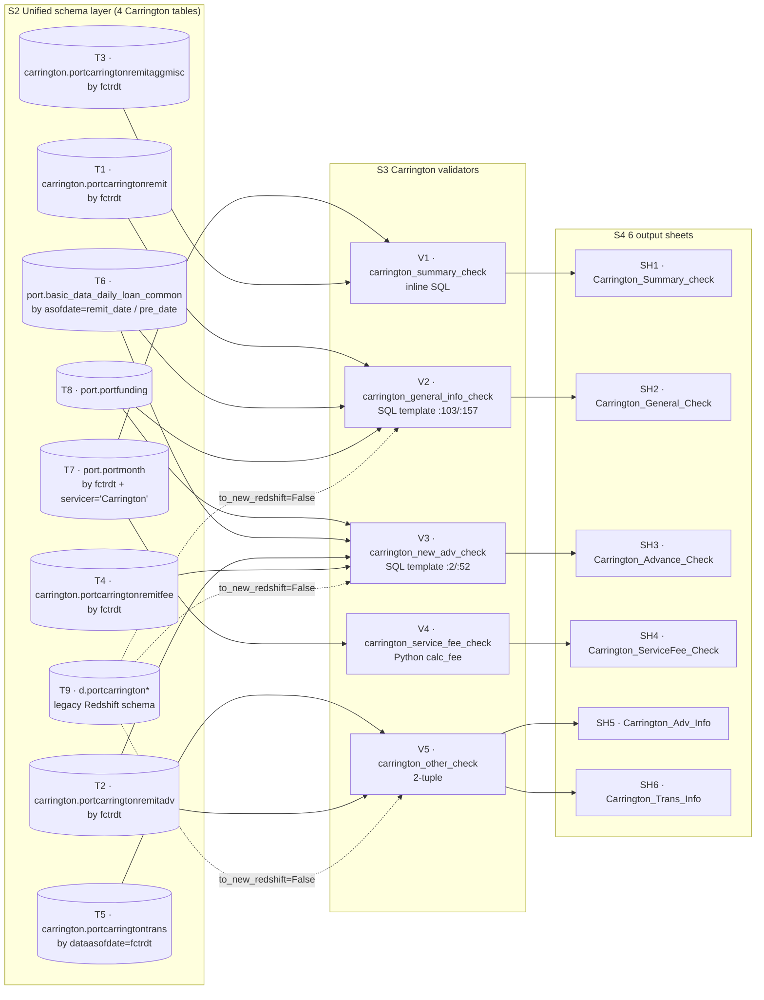

# 1.2.1 Carrington Chapter

> **Purpose**: Reverse-engineer, using source code as the single source of truth, the complete generation logic of the Carrington servicer in PrefectFlow `remit_validation` — how 5 validators turn 4 upstream unified tables into 6 Excel sheets (`Carrington_Summary_check` / `Carrington_General_Check` / `Carrington_Advance_Check` / `Carrington_ServiceFee_Check` / `Carrington_Adv_Info` / `Carrington_Trans_Info`), along with the column-level field mapping and calculation formula for every output column.
>
> **Intended audience**: (1) PrefectFlow engineers maintaining the Carrington validators; (2) new engineers onboarding; (3) Stage 2 designers needing Carrington as a template; (4) business users cross-checking the 6 Carrington sheets.
>
> **Revision history**
>
> | Date | Author | Change |
> |---|---|---|
> | 2026-05-16 | Copilot CLI agent | v1.0 first release (zh/en bilingual): covers full generation logic + field mapping + dataflow branch + known pitfalls for all 6 sheets. |

---

## 1.2.1.1 Servicer overview

Carrington is the **largest** of the 7 servicers: 5 validators → **6** sheets (other servicers typically produce 4-5). The "extra one" comes from `carrington_other_check` returning a `(trans_df, adv_info)` 2-tuple — detailed in the 1.1.7.3 sequence diagram.

| Validator function | Input data | Output sheet | Type |
|---|---|---|---|
| `carrington_summary_check` | `port.portmonth` + `carrington.portcarringtonremitaggmisc` | `Carrington_Summary_check` | 1-row summary |
| `carrington_general_info_check` | SQL template `carrington_general_check` (joins remit / daily / funding) | `Carrington_General_Check` | 1 row per loan |
| `carrington_new_adv_check` | SQL template `carrington_adv_validation` (joins daily curr/prev + remit adv) | `Carrington_Advance_Check` | 1 row per loan |
| `carrington_service_fee_check` | `port.portmonth` + Python rule `calc_fee` | `Carrington_ServiceFee_Check` | abnormal rows only |
| `carrington_other_check` (2-tuple) | `carrington.portcarringtontrans` + `carrington.portcarringtonremitadv` (curr+prev) | `Carrington_Trans_Info`, `Carrington_Adv_Info` | aggregated tables |

Source locations:

- Flow entry block: `flow/remit_validation/remit_validation.py:81-92` (5 validator calls + 6 MAP key writes)
- DB layer: `flow/remit_validation/carrington_db.py:79-156`
- Validator layer: `flow/remit_validation/carrington_validation.py:1-198`
- SQL templates: `flow/remit_validation/servicer_validation_with_portdaily.py:2,52,103,157`
- Sheet column definitions: `util/gen_remit_validation_report.py:353-585`

When `CarringtonDB.__init__` is instantiated at `remit_validation.py:81`, it computes 4 derived date / table-name variables:

| Field | Source | Meaning |
|---|---|---|
| `remit_date` | flow argument | month-end date (`2025-10-31`) |
| `pre_date` | `(remit_date - MonthEnd(1)).date()` | previous month-end (`2025-09-30`) |
| `fctrdt` | `get_fctrdt(remit_date)` → 1st of next month | remit table partition key (`2025-11-01`) |
| `fctrdt_1m` | `get_fctrdt(pre_date)` | previous period remit fctrdt (`2025-10-01`) |

Source: `carrington_db.py:80-88` + `flow/remit_validation/utils.py:get_fctrdt`. `fctrdt` is the Carrington remit table's partition key (NOT `remit_date`) — this is the single most common pitfall when reading the SQL.

---

## 1.2.1.2 Carrington dataflow branch



> Figure 1.2.1-1: End-to-end dataflow from Carrington's 4 main unified tables + 4 auxiliary tables → 5 validators → 6 sheets. Source: `carrington_db.py:79-156` + `carrington_validation.py:1-198` + `servicer_validation_with_portdaily.py:2-197`.

**Legend (node-ID naming convention):**

| Prefix | Meaning | Range in this figure | How it appears in the prose |
|---|---|---|---|
| `T#` | **T**able — upstream source table (unified / auxiliary) | `T1`–`T8` | Appears in the step-by-step text by its real table name (e.g. `port.portmonth`, `carrington.*`) |
| `V#` | **V**alidator — Prefect `@task` validation function | `V1`–`V5` | `V1 = carrington_summary_check`, `V2 = carrington_general_info_check`, `V3 = carrington_new_adv_check`, `V4 = carrington_service_fee_check`, `V5 = carrington_other_check` |
| `SH#` | **SH**eet — final XLSX worksheet | `SH1`–`SH6` | `SH1 = Carrington_Summary_check`, `SH2 = Carrington_General_Check`, `SH3 = Carrington_Advance_Check`, `SH4 = Carrington_ServiceFee_Check`, `SH5 = Carrington_Adv_Info`, `SH6 = Carrington_Trans_Info` |

Node IDs exist only as cross-references between the diagram and the prose; they are **not** identifiers in the source code. The real name of each node appears inside its box after `·` (e.g. `V1 · carrington_summary_check`) and in the step-by-step explanation below.

**Step-by-step explanation (in validator call order):**

1. **summary**: `V1` pulls `port.portmonth` directly (filtered by servicer='Carrington' + fctrdt) + a subquery summing float_income from `carrington.portcarringtonremitaggmisc` → outputs `SH1`. Source: `carrington_validation.py:28-51`.
2. **general**: `V2` uses a SQL template that joins `carrington.portcarringtonremit` (by fctrdt) + `port.basic_data_daily_loan_common` (by asofdate = fctrdt-1) + same table (by pre_date) + `port.portfunding` → 1 row per loanid → `SH2`. Source: `carrington_validation.py:10-25` + `servicer_validation_with_portdaily.py:103-154`.
3. **adv**: `V3` uses a SQL template joining daily (pre/curr) + remit adv (aggregated by adv_bucket) + remit fee (int_on_escrow) + funding → 1 row per loanid → `SH3`. Source: `carrington_validation.py:54-73` + `servicer_validation_with_portdaily.py:2-49`.
4. **service_fee**: `V4` does NOT use a SQL template; it directly pulls `port.portmonth` → computes expected service fee in Python via `calc_fee` → keeps only rows where `servicefee != calc_servicefee` → `SH4`. Source: `carrington_validation.py:77-136`.
5. **other (2-tuple)**: `V5` produces 2 sheets at once: (a) the trans portion is grouped by `(code_description, transaction_code)` and summed → `SH6`; (b) the adv portion pulls remitadv once for curr month and once for prev month, grouped by `(adv_bucket, adv_type, advance_description)` → merged → MoM ratio computed → `SH5`. Source: `carrington_validation.py:139-197`.
6. **schema routing**: all 4 unified tables route to legacy `d.portcarrington*` schema when `to_new_redshift=False`; the MySQL path has twin templates only for V2/V3 (V1/V4/V5 have no `mysql_` versions, but V1/V4 use `port.portmonth` which also runs on MySQL, and V5 in `to_mysql=True` mode similarly hits `d.portcarrington*` → in practice production never runs MySQL so this path is unexercised). Source: `carrington_db.py:98-156`.

Key takeaway: the "main table + remit + daily(pre/curr) + funding" four-source join pattern in Carrington is reused as a template in Shellpoint / Selene / MRC chapters later. service_fee using a Python rule instead of SQL is unique to Carrington, stemming from the "fee rate looked up by delinq stage" schedule structure.

---

## 1.2.1.3 Per-sheet generation logic

Each sheet follows a unified framework: basic info → data sources → join / filter / group by → field table (column name + source column + data type + business meaning + edge cases) → validation rule → highlight columns → known pitfalls.

### 1.2.1.3.1 Carrington_Summary_check (1-row summary)

**Basic info**

| Item | Value |
|---|---|
| Sheet name (XLSX literal) | `Carrington_Summary_check` (lowercase c) |
| Producing function | `carrington_summary_check` (`carrington_validation.py:28-51`) |
| Output row count | 1 (table-wide sum) |
| Header rows | 1 |
| Highlight column | none |

**Data sources + SQL**

inline SQL (no template reuse):

- main table `port.portmonth` — filter `servicer = 'Carrington' AND fctrdt = <carrington_db.fctrdt>`.
- subquery: `select sum(amount) from carrington.portcarringtonremitaggmisc where fctrdt = <fctrdt>` → single float_income value.
- no join; pure aggregation.

**Field table (10 columns)**

| Output column | Source table / column | Calculation / Transform | Data type | Business meaning | Edge cases |
|---|---|---|---|---|---|
| `principalreceived` | `portmonth.principalreceived` | `sum(...)` | money | total principal collected this month | if portmonth has no Carrington rows for the month → EmptyData raised |
| `corpescadv` | `portmonth.escrowadv_chg + portmonth.corpadvtotal_chg` | `sum(escrowadv_chg + corpadvtotal_chg)` | money | escrow advance + corp advance total change | if either column is NULL → SUM skips |
| `interestreceived` | `portmonth.interestreceived` | `sum(...)` | money | total interest collected this month | — |
| `servicefee` | `portmonth.servicefee + portmonth.otherfees` | `sum(servicefee + otherfees)` | money | service fee + other fees | — |
| `float_income` | `carrington.portcarringtonremitaggmisc.amount` | subquery `sum(amount)` | money | float income (aggmisc table total) | subquery with no rows → column = `None` |
| `totalremit` | `portmonth.totremit` | `sum(...)` | money | total remit amount | — |
| `beginningbalance` | `portmonth.prevbal` | `sum(...)` | money | beginning balance | — |
| `totalprincipalreceived` | `portmonth.principalreceived` | `sum(...)` (duplicates column 1) | money | total principal collected (business reclassification) | same value as `principalreceived` |
| `endingbalance` | `portmonth.balance` | `sum(...)` | money | ending balance | — |
| `asofdate` | assigned in Python layer | `data_df['asofdate'] = carrington_db.remit_date` | date | report's month-end | always = remit_date, not from SQL |

> Table 1.2.1-2: 10-column field mapping for Carrington_Summary_check. Source: `carrington_validation.py:32-46` + `util/gen_remit_validation_report.py:353-370`.

**Validation rule**: this sheet does NOT do per-row pass/fail — it is a **pure summary display**, with humans cross-referencing against the upstream vendor remit report to spot anomalies. When the `try/except` catches any exception, the validator returns `None`, and the corresponding slot is short-circuited at the `gen_remit_report` write phase (see 1.1.7.5 step 6).

**Known pitfalls**: (1) `totalprincipalreceived` equals `principalreceived` — both aliases are `sum(principalreceived)` in SQL; business uses them under different reporting bucketing. (2) `float_income` comes from a separate-table subquery; when monthly aggmisc data is missing, no error is raised — the column simply becomes NULL.

---

### 1.2.1.3.2 Carrington_General_Check (1 row per loan, ~24 sub-columns)

**Basic info**

| Item | Value |
|---|---|
| Sheet name | `Carrington_General_Check` |
| Producing function | `carrington_general_info_check` (`carrington_validation.py:10-25`) |
| Output row count | equal to the row count of `carrington.portcarringtonremit` for the month (1 per loan) |
| Header rows | 2 (multi-level header: group + sub-column) |
| Highlight column | 6 diff columns (any nonzero triggers highlight) |
| SQL template | `carrington_general_check` (`servicer_validation_with_portdaily.py:103-154`) + MySQL twin `mysql_carrington_general_check` (`:157-197`) |

**Data sources + join**

| Alias | Table | Filter / Join condition |
|---|---|---|
| `r` | `carrington.portcarringtonremit` | `r.fctrdt = '<fctrdt>'` |
| `c` | `port.basic_data_daily_loan_common` | `c.loanid = r.loanid AND c.asofdate = dateadd(day, -1, r.fctrdt)` — i.e. **one day before** remit fctrdt (which equals remit_date itself) |
| `c2` | `port.basic_data_daily_loan_common` (joined to same table a 2nd time) | `c2.loanid = r.loanid AND c2.asofdate = '<pre_date>'` — previous month-end |
| `f` | `port.portfunding` | `f.loanid = r.loanid` (left join) |

**Group by**: none. Each loanid is naturally unique in the remit table.

**SQL template substitution** (`carrington_validation.py:18-19`):

```python
sql.replace('input_fctrdt', str(carrington_db.fctrdt))
   .replace('input_pre_month_end', str(carrington_db.pre_date))
```

**Field table (22 columns, 4 ID groups + 6 diff groups)**

| Output column (sub_column) | Top-level group | Source | Calculation | Data type | Business meaning |
|---|---|---|---|---|---|
| `loanid` | ID | `r.loanid` | direct | str | internal loan id |
| `carrington_ln_number` | ID | `r.carrington_ln_number` | direct | str | Carrington internal loan number |
| `dealid` | ID | `f.dealid` | left join | str | asset pool deal id |
| `intrate_diff_remitvsdaily` | Interest Rate Diff | `intrate_remit - intrate_daily` | `r.interest_rate - c.interest_rate` | float | interest rate delta; **expected = 0** |
| `intrate_remit` | Interest Rate Diff | `r.interest_rate` | — | float | remit table interest rate |
| `intrate_daily` | Interest Rate Diff | `c.interest_rate` | — | float | daily table interest rate |
| `nextduedate_diff_remitvsdaily` | Next Due Date Diff | `nextduedate_remit - nextduedate_daily` | `r.next_due_date - c.nextduedate` | float (day count) | **expected = 0** |
| `nextduedate_remit` | Next Due Date Diff | `r.next_due_date` | — | date | remit next due date |
| `nextduedate_daily` | Next Due Date Diff | `c.nextduedate` | — | date | daily next due date |
| `begbal_diff_remitvsdaily` | Begin Balance Diff | `begbal_remit - c2.principalbalance` | `r.beginning_balance - c2.principalbalance` | money | begin-balance reconciliation; **expected = 0** |
| `begbal_remit` | Begin Balance Diff | `r.beginning_balance` | — | money | remit beginning balance |
| `endbal_diff_remitvsdaily` | End Balance Diff | `endbal_remit - endbal_daily` | `r.ending_balance - c.principalbalance` | money | end-balance reconciliation; **expected = 0** |
| `endbal_remit` | End Balance Diff | `r.ending_balance` | — | money | remit ending balance |
| `endbal_daily` | End Balance Diff | `c.principalbalance` | — | money | daily ending balance |
| `principal_diff_remit` | Principal Difference in Remit | `endbal + deferredupb - totalupb` | `r.ending_balance + r.ending_def_prin - r.total_upb` | money | remit internal consistency; **expected = 0** |
| `endbal_in_remit` | Principal Difference in Remit | `r.ending_balance` | — | money | same as endbal_remit |
| `deferredupb_remit` | Principal Difference in Remit | `r.ending_def_prin` | — | money | deferred principal |
| `totalupb_remit` | Principal Difference in Remit | `r.total_upb` | — | money | total UPB |
| `balchg_prin_diff_remit` | Principle Balance Change in Remit | `begbal - endbal + deferred_paid - principal_remit` | `r.beginning_balance - r.ending_balance + (r.beginning_def_prin - r.ending_def_prin) - r.principal_payment_actual_prinorcash_received` | money | beg-end-deferred change should equal principal collected; **expected = 0** |
| `begbal_in_remit_repo` | Principle Balance Change in Remit | `r.beginning_balance` | — | money | same as begbal_remit |
| `endbal_in_remit_repo` | Principle Balance Change in Remit | `r.ending_balance` | — | money | same as endbal_remit |
| `deferredbal_paid_remit` | Principle Balance Change in Remit | `beginning_def_prin - ending_def_prin` | `r.beginning_def_prin - r.ending_def_prin` | money | deferred principal paid down this month |
| `principal_remit` | Principle Balance Change in Remit | `r.principal_payment_actual_prinorcash_received` | — | money | remit principal collected |
| `pandi_expected_remit` | (blank divider column) | `r.current_regular_pmt_amt` | — | money | expected P&I |
| `interest_remit` | (blank divider column) | `r.gross_interest_payment` | — | money | remit interest collected |
| `asofdate` | (written by Python) | `re_df['asofdate'] = carrington_db.remit_date` | date | report's month-end | — |

> Table 1.2.1-3: Carrington_General_Check field mapping (incl. 6 diff cols + upstream/downstream cols). Source: `servicer_validation_with_portdaily.py:103-154` + `util/gen_remit_validation_report.py:372-453`.

**Validation rule (6 diff columns, highlight threshold = 0)**

`util/gen_remit_validation_report.py:445-452` `highlight_column`:

```python
[
    {"column": "intrate_diff_remitvsdaily", "threshold": 0},
    {"column": "nextduedate_diff_remitvsdaily", "threshold": 0},
    {"column": "begbal_diff_remitvsdaily", "threshold": 0},
    {"column": "endbal_diff_remitvsdaily", "threshold": 0},
    {"column": "principal_diff_remit", "threshold": 0},
    {"column": "balchg_prin_diff_remit", "threshold": 0}
]
```

Row-level decision: if any diff column ≠ 0 → `all_sheet_format` applies a highlight fill to that cell; no rows are filtered, all loans are shown for humans to review highlighted rows. Validator exception → returns `None` → the entire sheet is short-circuited (see 1.1.7.5).

**Known pitfalls**: (1) `c.asofdate = dateadd(day, -1, r.fctrdt)` — since `r.fctrdt` is the remit partition key (= month-end + 1 day), `dateadd(-1)` lands back exactly on `remit_date`, NOT the previous month-end. Easy to misread in reverse. (2) The MySQL twin template (`mysql_carrington_general_check`) uses `DATE_ADD(r.fctrdt, INTERVAL -1 DAY)` instead of Redshift's `dateadd`, and inlines alias references (because MySQL doesn't allow alias back-reference inside select).

---

### 1.2.1.3.3 Carrington_Advance_Check (1 row per loan, ~24 sub-columns)

**Basic info**

| Item | Value |
|---|---|
| Sheet name | `Carrington_Advance_Check` |
| Producing function | `carrington_new_adv_check` (`carrington_validation.py:54-73`) |
| Output row count | row count of daily `p1` (prev month-end) left-joined `p2` (curr month-end) loans |
| Header rows | 2 |
| Highlight column | 3 diff columns |
| SQL template | `carrington_adv_validation` (`servicer_validation_with_portdaily.py:2-49`) + MySQL twin (`:52-99`) |

**Data sources + join**

| Alias | Table | Filter / Join condition |
|---|---|---|
| `p1` | `port.basic_data_daily_loan_common` | `asofdate = '<pre_month_end>' AND servicer = 'Carrington'` — prev month-end daily snapshot |
| `p2` | `port.basic_data_daily_loan_common` | `asofdate = '<curr_month_end>' AND servicer = 'Carrington'`, `p2.loanid = p1.loanid` (left join) |
| `tmp` | `carrington.portcarringtonremitadv` | subquery grouped by `fctrdt + loanid`, sum by adv_bucket categories |
| `e2` | `carrington.portcarringtonremitfee` | subquery `sum(interest_on_escrow_paid_to_morgagor) as int_on_escrow` per loanid |
| `f` | `port.portfunding` | left join for dealid |

`tmp` subquery's adv_bucket categorization (`servicer_validation_with_portdaily.py:33-35`):

```sql
sum(case when adv_bucket in ('InvRec', 'ThirdParty')   then tran_amount else 0 end) as corpadvnonrec_chg
sum(case when adv_bucket in ('Corporate', 'DRM')       then tran_amount else 0 end) as corpadvrec_chg
sum(case when adv_bucket in ('Escrow')                  then tran_amount else 0 end) as escrow_chg
```

**SQL template substitution** — this is the unique 3-placeholder case (`carrington_validation.py:63-65`):

```python
sql.replace('input_fctrdt',          str(carrington_db.fctrdt))
   .replace('input_curr_month_end',  str(carrington_db.remit_date))
   .replace('input_pre_month_end',   str(carrington_db.pre_date))
```

**Field table (selected highlights; full column list in `util/gen_remit_validation_report.py:454-530`)**

| Output column | Calculation | Data type | Business meaning |
|---|---|---|---|
| `loanid` / `carrington_ln_number` / `dealid` / `delq_status` | direct from p1/f | str | ID group |
| `recovcorpadv_diff` | `recovcorpadv_chg_remit - recovcorpadv_chg_daily` | money | recov corp adv remit-vs-daily delta; **expected = 0** |
| `recovcorpadv_chg_remit` | `coalesce(tmp.corpadvrec_chg, 0)` | money | remit-side recov chg |
| `recovcorpadv_chg_daily` | `p2.reccorpadvance - p1.reccorpadvance` | money | daily-side recov chg |
| `borrower_recoverable_advance_balance_prev/curr` | `p1.reccorpadvance` / `p2.reccorpadvance` | money | daily balance |
| `nonrecovcorpadv_diff` | `nonrecovcorpadv_chg_remit - nonrecovcorpadv_chg_daily` | money | **expected = 0** |
| `nonrecovcorpadv_chg_remit` | `coalesce(tmp.corpadvnonrec_chg, 0)` | money | remit-side nonrecov chg |
| `nonrecovcorpadv_chg_daily` | `p2.nonrecovadvance - p1.nonrecovadvance` | money | daily-side nonrecov chg |
| `nonrecovcorpadv_prev/curr` | `p1.nonrecovadvance` / `p2.nonrecovadvance` | money | daily balance |
| `int_on_escrow` | `e2.int_on_escrow` (from remitfee subquery) | money | escrow interest paid to mortgagor |
| `escrowadv_diff_remitvsdaily` | `escadv_chg_remit - escadv_chg_daily` | money | **expected = 0** |
| `escadv_chg_remit` | `coalesce(tmp.escrow_chg, 0)` | money | remit-side escrow adv chg |
| `escadv_chg_daily` | `p2.escrow_advance_balance - p1.escrow_advance_balance` | money | daily-side escrow adv chg |
| `escadv_prev/curr` | `p1/p2.escrow_advance_balance` | money | daily balance |
| `escrow_balance_prev/curr` | `p1/p2.escrowbalance` | money | escrow main balance (not advance) |

> Table 1.2.1-4: Carrington_Advance_Check field mapping (selected key columns). Source: `servicer_validation_with_portdaily.py:2-49` + `util/gen_remit_validation_report.py:454-530`.

**Validation rule (3 diff columns, highlight threshold = 0)**

```python
[
    {"column": "recovcorpadv_diff", "threshold": 0},
    {"column": "nonrecovcorpadv_diff", "threshold": 0},
    {"column": "escrowadv_diff_remitvsdaily", "threshold": 0}
]
```

Any ≠ 0 → highlight. Same as General: no row filtering, humans review.

**Known pitfalls**: (1) The Redshift version uses select-alias back-reference (e.g. `nonrecovcorpadv_chg_remit - nonrecovcorpadv_chg_daily as ...`), while the MySQL version must inline the full expression. (2) `p1` filters on `pre_month_end` but the servicer filter is hard-coded = 'Carrington' inside the subquery, so even if the vendor briefly changes the servicer name, prev-month rows still get filtered by the old name.

---

### 1.2.1.3.4 Carrington_ServiceFee_Check (abnormal rows only)

**Basic info**

| Item | Value |
|---|---|
| Sheet name | `Carrington_ServiceFee_Check` |
| Producing function | `carrington_service_fee_check` (`carrington_validation.py:77-136`) |
| Output row count | only loans where `servicefee != calc_servicefee` (**filtered**) |
| Header rows | 1 |
| Highlight column | none (the whole sheet IS the exception list) |
| Compute mode | **Python rule**, not a SQL template |

**Data source**: `port.portmonth` (via `carrington_db.get_port_month_data('Carrington')`), filtered by `fctrdt == carrington_db.fctrdt`.

**Core `calc_fee(row)` rule** (`carrington_validation.py:85-109`):

| Condition (evaluated in order, first match wins) | Base value | additon_fee bump (see below) |
|---|---|---|
| `bankruptcy == 'Y' AND prevdelinq == 'C'` | -60 | see below |
| `bankruptcy == 'Y' AND prevdelinq IN ('D30','D60','D90','D120P')` | -65 | see below |
| `prevdelinq == 'C'` | -9 | see below |
| `prevdelinq == 'D30'` | -25 | see below |
| `prevdelinq == 'D60'` | -35 | see below |
| `prevdelinq IN ('D90','D120P')` | -80 | see below |
| `prevdelinq == 'FCL'` | -110 | see below |
| `prevdelinq == 'REO'` | -35 | see below |
| otherwise | 0 | — |

**`additon_fee` bump rules** (accumulated before the base value is chosen):

- `agency in ('FHA','VA','USDA')` → `+1`
- `amorttype == 'ARM'` → `+1`

**Final `calc_servicefee = base - additon_fee`** (note the minus: base is already negative; subtracting the bump makes the absolute value larger).

**Field table (14 columns)**

| Output column | Source | Business meaning |
|---|---|---|
| `fctrdt` | `portmonth.fctrdt` | month partition |
| `loanid` | `portmonth.loanid` | internal loan id |
| `svcloanid` | `portmonth.svcloanid` | servicer-side loan id |
| `dealid` | `portmonth.dealid` | asset pool id |
| `servicer` | `portmonth.data_servicer` (rename: `data_servicer → servicer`) | servicer name after SLS-stripping (see 1.1.2 SLS identification logic) |
| `agency` | `portmonth.agency` | FHA/VA/USDA/conventional |
| `amorttype` | `portmonth.amorttype` | ARM / FIX |
| `delinq` / `prevdelinq` | `portmonth.delinq` / `prevdelinq` | current / prev delinquency stage |
| `bankruptcy` | `portmonth.bankruptcy` | Y/N |
| `calc_servicefee` | Python `calc_fee(row)` | expected service fee |
| `servicefee` | `portmonth.servicefee` | actual servicefee booked |
| `nextduedate` | `portmonth.nextduedate` | next due date |
| `asofdate` | written in Python = `remit_date` | report date |

> Table 1.2.1-5: Carrington_ServiceFee_Check 14-column field mapping. Source: `carrington_validation.py:111-130` + `util/gen_remit_validation_report.py:531-552`.

**Validation rule**: in Python, directly `abnormal = carrington_month_df[carrington_month_df['servicefee'] != carrington_month_df['calc_servicefee']]` (`carrington_validation.py:112`). The sheet shows only abnormal rows; no highlight columns; if the abnormal DataFrame is empty, the sheet header is still written (no short-circuit, because `[]` then `.empty == True`, hitting the 1.1.7.5 step 6 short-circuit logic — in practice when no anomalies occur for the month, the sheet does NOT appear).

**Known pitfalls**: (1) When `prevdelinq` doesn't match any branch, returns 0, meaning expected service fee is 0; if actual servicefee is also 0 the row is NOT abnormal; if ≠ 0 the row IS abnormal — this is the implicit "unknown delinq stage" check. (2) The `bankruptcy=='Y'` branch does NOT consume D120P's high fee, but uses -65 (lower absolute value) — business-side bankruptcy discount.

---

### 1.2.1.3.5 Carrington_Adv_Info (aggregated table, 1 row per advance_description × curr / prev month comparison)

**Basic info**

| Item | Value |
|---|---|
| Sheet name | `Carrington_Adv_Info` |
| Producing function | second element `carrington_adv_info` of `carrington_other_check`'s return value (`carrington_validation.py:160-191`) |
| Output row count | count of distinct `(adv_bucket, adv_type, advance_description)` combinations in this month's remitadv |
| Header rows | 1 |
| Highlight column | none |

**Data sources**

- Current month: `get_carrington_remit_adv()` pulls `carrington.portcarringtonremitadv where fctrdt = <fctrdt>`.
- Previous month: **temporarily set `carrington_db.fctrdt = carrington_db.fctrdt_1m`, call the same function, then restore** (`carrington_validation.py:171-184`) — this is the only side effect in this validator.

**Python compute pipeline**

1. **Compute adv_type** (`carrington_validation.py:150-157`):
   - `adv_bucket in ('Corporate','DRM')` → `'recov_corpadv'`
   - `adv_bucket in ('InvRec','ThirdParty')` → `'nonrecov_corpadv'`
   - `adv_bucket == 'Escrow'` → `'Escrow'`
   - otherwise → use the `adv_bucket` value as-is
2. **Curr-month group by**: `(adv_bucket, adv_type, advance_description)` → `sum(tran_amount) as tot_amt`.
3. **Prev-month**: same group by → `sum(tran_amount) as tot_amt_1m`.
4. **Merge**: `pd.merge(curr_df, pre_df, on=['adv_bucket','adv_type','advance_description'], how='left')` — combinations not in prev month are NOT added.
5. **MoM**: `tot_amt_MoM = tot_amt / tot_amt_1m - 1` — when prev is 0 / NaN result is inf / NaN (Excel shows `#DIV/0!`).

**Field table (7 columns)**

| Output column | Source | Calculation | Data type | Business meaning |
|---|---|---|---|---|
| `adv_bucket` | same remitadv column | group by key | str | one of 6 buckets |
| `adv_type` | Python `func(row)` | see 4 branches above | str | normalized category |
| `advance_description` | same remitadv column | group by key | str | text description (e.g. 'Property Tax') |
| `tot_amt` | curr_df aggregate | `sum(tran_amount)` | money | curr-month total |
| `asofdate` | written in Python | `= remit_date` | date | report date |
| `tot_amt_1m` | pre_df aggregate (after merge) | `sum(tran_amount)` of prev month | money | prev-month total |
| `tot_amt_MoM` | Python formula | `tot_amt / tot_amt_1m - 1` | percentage | MoM change ratio |

> Table 1.2.1-6: Carrington_Adv_Info 7-column field mapping. Source: `carrington_validation.py:150-191` + `util/gen_remit_validation_report.py:553-567`.

**Validation rule**: no row-level rule; pure display.

**Known pitfalls**: (1) Temporarily mutating `carrington_db.fctrdt` and restoring — if another thread accesses the same db instance during this window it would read a wrong fctrdt; the current flow is serial so no concurrency risk. (2) `how='left'` means advance_description values that appeared in prev month but vanished this month do NOT appear in the sheet — separate logic is needed if "disappearing items" matter. (3) When `tot_amt_1m` is missing, `tot_amt_MoM = inf`, displayed as `#DIV/0!` in Excel.

---

### 1.2.1.3.6 Carrington_Trans_Info (aggregated table, 1 row per transaction_code)

**Basic info**

| Item | Value |
|---|---|
| Sheet name | `Carrington_Trans_Info` |
| Producing function | first element `trans_df` of `carrington_other_check`'s return value (`carrington_validation.py:143-148`) |
| Output row count | count of distinct `(code_description, transaction_code)` combinations in this month's trans table |
| Header rows | 1 |
| Highlight column | none |

**Data source**: `get_carrington_trans()` pulls `carrington.portcarringtontrans where dataasofdate = <fctrdt>`.

**Python compute**:

```python
trans_df = (trans_df[['code_description', 'transaction_code', 'transaction_amount',
                      'interest_amount', 'principal_amount', 'escrow_amount',
                      'late_charge_amount', 'balance_principal', 'balance_escrow']]
            .groupby(['code_description', 'transaction_code']).sum().reset_index())
trans_df['asofdate'] = carrington_db.remit_date
```

**Field table (10 columns)**

| Output column | Source | Calculation | Data type | Business meaning |
|---|---|---|---|---|
| `code_description` | trans column | group key | str | transaction category text description |
| `transaction_code` | trans column | group key | str | transaction code (e.g. 'P&I' / 'CORP_ADV') |
| `transaction_amount` | trans column | `sum(...)` | money | total transaction amount for this code this month |
| `interest_amount` | trans column | `sum(...)` | money | interest portion for this code this month |
| `principal_amount` | trans column | `sum(...)` | money | principal portion |
| `escrow_amount` | trans column | `sum(...)` | money | escrow portion |
| `late_charge_amount` | trans column | `sum(...)` | money | late charge portion |
| `balance_principal` | trans column | `sum(...)` | money | end principal balance sum for this code |
| `balance_escrow` | trans column | `sum(...)` | money | end escrow balance sum for this code |
| `asofdate` | written in Python | `= remit_date` | date | report date |

> Table 1.2.1-7: Carrington_Trans_Info 10-column field mapping. Source: `carrington_validation.py:143-148` + `util/gen_remit_validation_report.py:568-585`.

**Validation rule**: no row-level rule; pure display. When `carrington_other_check`'s `try/except` fails it returns `(None, None)` — both sheets short-circuit at the same time.

**Known pitfalls**: the trans table uses `dataasofdate` while the remit tables use `fctrdt` and daily uses `asofdate` — inconsistent naming inherited from vendor side.

---

## 1.2.1.4 Cross-sheet field index

This table consolidates all the "diff / validation-class" fields across Carrington's 6 sheets, for one-shot QA reconciliation:

| Sheet | Field | Expected | Actual expression |
|---|---|---|---|
| Carrington_General_Check | `intrate_diff_remitvsdaily` | 0 | `r.interest_rate - c.interest_rate` |
| Carrington_General_Check | `nextduedate_diff_remitvsdaily` | 0 days | `r.next_due_date - c.nextduedate` |
| Carrington_General_Check | `begbal_diff_remitvsdaily` | 0 | `r.beginning_balance - c2.principalbalance` |
| Carrington_General_Check | `endbal_diff_remitvsdaily` | 0 | `r.ending_balance - c.principalbalance` |
| Carrington_General_Check | `principal_diff_remit` | 0 | `endbal + deferredupb - totalupb` |
| Carrington_General_Check | `balchg_prin_diff_remit` | 0 | `begbal - endbal + (begdef - enddef) - principal_remit` |
| Carrington_Advance_Check | `recovcorpadv_diff` | 0 | `tmp.corpadvrec_chg - (p2.reccorpadvance - p1.reccorpadvance)` |
| Carrington_Advance_Check | `nonrecovcorpadv_diff` | 0 | `tmp.corpadvnonrec_chg - (p2.nonrecovadvance - p1.nonrecovadvance)` |
| Carrington_Advance_Check | `escrowadv_diff_remitvsdaily` | 0 | `tmp.escrow_chg - (p2.escrow_advance_balance - p1.escrow_advance_balance)` |
| Carrington_ServiceFee_Check | (row-level) | `servicefee == calc_servicefee` | Python `calc_fee(row)` |

> Table 1.2.1-8: All validation-class fields across Carrington's 6 sheets. Source: the per-sheet sections above.

---

## 1.2.1.5 Known pitfalls / historical decisions

1. **fctrdt vs remit_date**: Carrington's 4 remit tables (remit / remitadv / remitfee / remitaggmisc) use partition key `fctrdt = remit_date + 1 day`; the trans table similarly uses `dataasofdate = fctrdt`; the daily table uses `asofdate = remit_date`. In General SQL `dateadd(day, -1, r.fctrdt)` is used to push fctrdt back to remit_date for joining daily.
2. **MySQL path degradation**: Carrington's adv / general both have `mysql_` twin templates (`servicer_validation_with_portdaily.py:52, 157`), but summary / service_fee / other have no dedicated MySQL path — they directly use `port.portmonth` / `carrington.*` tables and rely on `ValidationBaseDB.run_sql` to switch the connection. In production, the MySQL path is **never exercised**, so the twin templates are not strictly reconciled.
3. **service_fee rule hand-written in Python**: the `calc_fee` function (`carrington_validation.py:85-109`) is a hand-maintained case-when table tied to the upstream vendor contract's fee schedule — changes require business sign-off. All other servicers' service_fee go through SQL templates; Carrington is the sole exception.
4. **2-tuple return value**: `carrington_other_check` is the only validator among 7 servicers that returns a 2-tuple, producing 2 sheets (Trans_Info + Adv_Info). This is the root cause of Carrington having "6 sheets" while other servicers have "5 sheets".
5. **other_check temporarily mutates fctrdt**: explained in 1.2.1.3.5, safe in single-thread, unsafe in multi-thread.
6. **Empty-data backstop**: all 5 validators use `try/except` to back-stop returning None / (None, None), and the corresponding slot is short-circuited at `gen_remit_report` (see 1.1.7.5 step 6).

---

## 1.2.1.6 Source citation index

| Node | File | Lines |
|---|---|---|
| Carrington block in flow | `remit_validation.py` | `81-92` |
| `CarringtonDB` class | `carrington_db.py` | `79-156` |
| `get_carrington_daily_data` | `carrington_db.py` | `90-114` |
| `get_carrington_remit_data` | `carrington_db.py` | `116-128` |
| `get_carrington_remit_adv` | `carrington_db.py` | `130-142` |
| `get_carrington_trans` | `carrington_db.py` | `144-156` |
| `carrington_general_info_check` | `carrington_validation.py` | `10-25` |
| `carrington_summary_check` | `carrington_validation.py` | `28-51` |
| `carrington_new_adv_check` | `carrington_validation.py` | `54-73` |
| `carrington_service_fee_check` | `carrington_validation.py` | `77-136` |
| `carrington_other_check` (2-tuple) | `carrington_validation.py` | `139-197` |
| SQL template `carrington_adv_validation` | `servicer_validation_with_portdaily.py` | `2-49` |
| SQL template `mysql_carrington_adv_validation` | `servicer_validation_with_portdaily.py` | `52-99` |
| SQL template `carrington_general_check` | `servicer_validation_with_portdaily.py` | `103-154` |
| SQL template `mysql_carrington_general_check` | `servicer_validation_with_portdaily.py` | `157-197` |
| Carrington_Summary_check sheet columns | `util/gen_remit_validation_report.py` | `353-370` |
| Carrington_General_Check sheet columns | `util/gen_remit_validation_report.py` | `372-453` |
| Carrington_Advance_Check sheet columns | `util/gen_remit_validation_report.py` | `454-530` |
| Carrington_ServiceFee_Check sheet columns | `util/gen_remit_validation_report.py` | `531-552` |
| Carrington_Adv_Info sheet columns | `util/gen_remit_validation_report.py` | `553-567` |
| Carrington_Trans_Info sheet columns | `util/gen_remit_validation_report.py` | `568-585` |

> Table 1.2.1-9: All source citations referenced in this chapter. Source: the files / line numbers in this table are themselves the locations.
