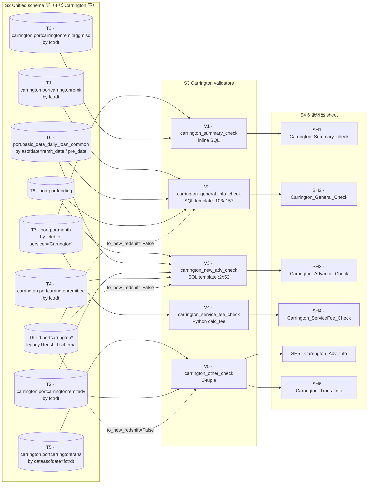

# 1.2.1 Carrington 章节（Carrington Chapter）

> **Purpose / 目的**：以源码为唯一事实来源，反推 PrefectFlow `remit_validation` 中 Carrington servicer 的全部生成逻辑 —— 5 个 validator 如何把 4 张上游 unified 表算成 6 张 Excel sheet（`Carrington_Summary_check` / `Carrington_General_Check` / `Carrington_Advance_Check` / `Carrington_ServiceFee_Check` / `Carrington_Adv_Info` / `Carrington_Trans_Info`），以及每一列的字段映射与计算公式。
>
> **Intended audience / 目标读者**：(1) 维护 Carrington validator 的 PrefectFlow 工程师；(2) Onboarding 新工程师；(3) Stage 2 设计阶段需要 Carrington 模板的设计者；(4) 业务方对照 Carrington 6 张 sheet 时的参考。
>
> **Revision history / 版本历史**
>
> | 日期 / Date | 作者 / Author | 变更 / Change |
> |---|---|---|
> | 2026-05-16 | Copilot CLI agent | v1.0 首版（中英双份）：覆盖 6 张 sheet 的完整生成逻辑 + 字段映射 + 数据流分支 + 已知坑。 |

---

## 1.2.1.1 Servicer overview / Servicer 概览

Carrington 是 7 个 servicer 中**最大**的：5 个 validator → **6** 张 sheet（其它 servicer 普遍 4-5 张）。"多 1 张"的根因在 `carrington_other_check` 返回 `(trans_df, adv_info)` 2-tuple —— 这一例外已在 1.1.7.3 时序图中详述。

| Validator 函数 | 输入数据 | 输出 sheet | 类型 |
|---|---|---|---|
| `carrington_summary_check` | `port.portmonth` + `carrington.portcarringtonremitaggmisc` | `Carrington_Summary_check` | 汇总 1 行 |
| `carrington_general_info_check` | SQL 模板 `carrington_general_check`（合 remit / daily / funding） | `Carrington_General_Check` | 每 loan 1 行 |
| `carrington_new_adv_check` | SQL 模板 `carrington_adv_validation`（合 daily 当月/上月 + remit adv） | `Carrington_Advance_Check` | 每 loan 1 行 |
| `carrington_service_fee_check` | `port.portmonth` + Python 规则 `calc_fee` | `Carrington_ServiceFee_Check` | 仅异常行 |
| `carrington_other_check`（2-tuple） | `carrington.portcarringtontrans` + `carrington.portcarringtonremitadv`（当月+上月） | `Carrington_Trans_Info`、`Carrington_Adv_Info` | 聚合表 |

源码定位：

- Flow 入口段：`flow/remit_validation/remit_validation.py:81-92`（5 个 validator 调用 + 6 个 MAP key 写入）
- DB 层：`flow/remit_validation/carrington_db.py:79-156`
- Validator 层：`flow/remit_validation/carrington_validation.py:1-198`
- SQL 模板：`flow/remit_validation/servicer_validation_with_portdaily.py:2,52,103,157`
- Sheet 列配置：`util/gen_remit_validation_report.py:353-585`

`CarringtonDB.__init__` 在 `remit_validation.py:81` 实例化时计算 4 个派生日期 / 表名变量：

| 字段 | 来源 | 含义 |
|---|---|---|
| `remit_date` | flow 入参 | 月末日（`2025-10-31`） |
| `pre_date` | `(remit_date - MonthEnd(1)).date()` | 上月月末（`2025-09-30`） |
| `fctrdt` | `get_fctrdt(remit_date)` → 下月 1 号 | Remit 表分区键（`2025-11-01`） |
| `fctrdt_1m` | `get_fctrdt(pre_date)` | 上一期 remit fctrdt（`2025-10-01`） |

源码：`carrington_db.py:80-88` + `flow/remit_validation/utils.py:get_fctrdt`。`fctrdt` 是 Carrington remit 表的分区键（不是 `remit_date`），这是阅读 SQL 时最常踩的坑。

---

## 1.2.1.2 Carrington 数据流分支（Carrington dataflow branch）



> 图 1.2.1-1：Carrington 4 张主 unified 表 + 4 张辅助表 → 5 个 validator → 6 张 sheet 的端到端数据流。Source：`carrington_db.py:79-156` + `carrington_validation.py:1-198` + `servicer_validation_with_portdaily.py:2-197`。

**图例（节点 ID 命名约定）：**

| 前缀 | 含义 | 在本图中的范围 | 在正文中出现的方式 |
|---|---|---|---|
| `T#` | **T**able — 上游源表（unified / 辅助表） | `T1`–`T8` | 在「逐步说明」里以真实表名出现（如 `port.portmonth`、`carrington.*`） |
| `V#` | **V**alidator — Prefect `@task` 校验函数 | `V1`–`V5` | `V1 = carrington_summary_check`，`V2 = carrington_general_info_check`，`V3 = carrington_new_adv_check`，`V4 = carrington_service_fee_check`，`V5 = carrington_other_check` |
| `SH#` | **SH**eet — 最终 XLSX 工作表 | `SH1`–`SH6` | `SH1 = Carrington_Summary_check`，`SH2 = Carrington_General_Check`，`SH3 = Carrington_Advance_Check`，`SH4 = Carrington_ServiceFee_Check`，`SH5 = Carrington_Adv_Info`，`SH6 = Carrington_Trans_Info` |

节点 ID 仅用于图与正文之间的交叉引用，**不是**源码里的标识符；源码里的真实名字写在每个节点框内 `·` 之后（例如 `V1 · carrington_summary_check`）以及下方「逐步说明」中。

**逐步说明（按 validator 调用顺序）：**

1. **summary**：`V1` 直接拉 `port.portmonth`（按 servicer='Carrington' + fctrdt 过滤）+ 子查询从 `carrington.portcarringtonremitaggmisc` 求 float_income → 输出 `SH1`。源码：`carrington_validation.py:28-51`。
2. **general**：`V2` 用 SQL 模板把 `carrington.portcarringtonremit`（按 fctrdt）+ `port.basic_data_daily_loan_common`（按 asofdate = fctrdt-1）+ 同表（按 pre_date）+ `port.portfunding` join 在一起 → 每个 loanid 输出 1 行 → `SH2`。源码：`carrington_validation.py:10-25` + `servicer_validation_with_portdaily.py:103-154`。
3. **adv**：`V3` 用 SQL 模板把 daily（pre/curr）+ remit adv（按 adv_bucket 聚合）+ remit fee（int_on_escrow）+ funding join → 每 loanid 输出 1 行 → `SH3`。源码：`carrington_validation.py:54-73` + `servicer_validation_with_portdaily.py:2-49`。
4. **service_fee**：`V4` 不走 SQL 模板，而是直接拉 `port.portmonth` → 在 Python 里按 `calc_fee` 规则算期望服务费 → 仅保留 `servicefee != calc_servicefee` 的行 → `SH4`。源码：`carrington_validation.py:77-136`。
5. **other (2-tuple)**：`V5` 同时产 2 张：(a) trans 部分按 `(code_description, transaction_code)` group_by 求和 → `SH6`；(b) adv 部分拉当月 + 上月各一次 remitadv，按 `(adv_bucket, adv_type, advance_description)` group_by → merge → 算 MoM 比例 → `SH5`。源码：`carrington_validation.py:139-197`。
6. **schema 路由**：所有 4 个 unified 表在 `to_new_redshift=False` 时改读 `d.portcarrington*` legacy schema；MySQL 路径只在 V2/V3 有孪生模板（V1/V4/V5 没有 mysql_ 版本，但 V1/V4 用的 `port.portmonth` 在 MySQL 也能跑，V5 在 `to_mysql=True` 时同样命中 `d.portcarrington*` → 实际生产从未走 MySQL 所以未暴露）。源码：`carrington_db.py:98-156`。

要点：Carrington 的"主表 + remit + daily(pre/curr) + funding"四源合并模式是后面 Shellpoint / Selene / MRC 章节复用的模板；service_fee 走 Python 规则而非 SQL 是 Carrington 独有，源于"按 delinq 阶段查表"的费率结构。

---

## 1.2.1.3 6 张 sheet 详细生成逻辑（per-sheet logic）

每张 sheet 按统一框架展开：基本信息 → 数据源 → join / filter / group by → 字段表（列名 + 来源列 + 数据类型 + 业务含义 + 边界） → 校验规则 → 高亮列 → 已知坑。

### 1.2.1.3.1 Carrington_Summary_check（1 行汇总）

**基本信息**

| 项 | 值 |
|---|---|
| Sheet name（XLSX 原名） | `Carrington_Summary_check`（小写 c） |
| 生成函数 | `carrington_summary_check`（`carrington_validation.py:28-51`） |
| 输出行数 | 1 行（全表 sum） |
| Header row 数 | 1 |
| Highlight column | 无 |

**数据源 + SQL**

inline SQL（无模板复用）：

- 主表 `port.portmonth` —— 过滤 `servicer = 'Carrington' AND fctrdt = <carrington_db.fctrdt>`。
- 子查询：`select sum(amount) from carrington.portcarringtonremitaggmisc where fctrdt = <fctrdt>` → 取 float_income 单值。
- 无 join；纯聚合。

**字段表（10 列）**

| 输出列 | 来源表 / 源列 | 计算 / Transform | 数据类型 | 业务含义 | 边界 / 边界 case |
|---|---|---|---|---|---|
| `principalreceived` | `portmonth.principalreceived` | `sum(...)` | money | 当月本金回收总额 | 若全月 portmonth 无 Carrington 行 → 抛 EmptyData |
| `corpescadv` | `portmonth.escrowadv_chg + portmonth.corpadvtotal_chg` | `sum(escrowadv_chg + corpadvtotal_chg)` | money | escrow advance + corp advance 总变动 | 若两列任一为 NULL → SUM 跳过 |
| `interestreceived` | `portmonth.interestreceived` | `sum(...)` | money | 当月利息回收总额 | — |
| `servicefee` | `portmonth.servicefee + portmonth.otherfees` | `sum(servicefee + otherfees)` | money | 服务费 + 其它费用 | — |
| `float_income` | `carrington.portcarringtonremitaggmisc.amount` | 子查询 `sum(amount)` | money | Float 收益（aggmisc 表汇总） | 子查询无行时返回 `None` 列 |
| `totalremit` | `portmonth.totremit` | `sum(...)` | money | 总 remit 金额 | — |
| `beginningbalance` | `portmonth.prevbal` | `sum(...)` | money | 期初余额 | — |
| `totalprincipalreceived` | `portmonth.principalreceived` | `sum(...)`（与第 1 列重复） | money | 总本金回收（业务侧分类） | 与 `principalreceived` 值相同 |
| `endingbalance` | `portmonth.balance` | `sum(...)` | money | 期末余额 | — |
| `asofdate` | Python 层赋值 | `data_df['asofdate'] = carrington_db.remit_date` | date | 报表所属月末 | 永远 = remit_date，不来自 SQL |

> 表 1.2.1-2：Carrington_Summary_check 10 列字段映射。Source：`carrington_validation.py:32-46` + `util/gen_remit_validation_report.py:353-370`。

**校验规则**：本 sheet 不做"行级 pass/fail"——它是**纯汇总展示**，由人工对照上游 vendor remit 报告判断异常。`try/except` 捕获到任何异常时 validator 返回 `None`，对应 slot 在 `gen_remit_report` 写入阶段被短路（参见 1.1.7.5 step 6）。

**已知坑**：(1) `totalprincipalreceived` 与 `principalreceived` 值相同——SQL 里两个 alias 都 `sum(principalreceived)`，业务侧把它们用于不同口径展示。(2) `float_income` 来自不同表的子查询；当月度 aggmisc 缺数时不会报错，列会变 NULL。

---

### 1.2.1.3.2 Carrington_General_Check（每 loan 1 行，~24 sub-columns）

**基本信息**

| 项 | 值 |
|---|---|
| Sheet name | `Carrington_General_Check` |
| 生成函数 | `carrington_general_info_check`（`carrington_validation.py:10-25`） |
| 输出行数 | 等于 `carrington.portcarringtonremit` 当月行数（每 loan 1 行） |
| Header row 数 | 2（多级表头：分组 + 子列） |
| Highlight column | 6 列 diff（任一非 0 触发高亮） |
| SQL 模板 | `carrington_general_check`（`servicer_validation_with_portdaily.py:103-154`）+ MySQL 孪生 `mysql_carrington_general_check`（`:157-197`） |

**数据源 + Join**

| 别名 | 表 | 过滤 / Join 条件 |
|---|---|---|
| `r` | `carrington.portcarringtonremit` | `r.fctrdt = '<fctrdt>'` |
| `c` | `port.basic_data_daily_loan_common` | `c.loanid = r.loanid AND c.asofdate = dateadd(day, -1, r.fctrdt)` —— 即 remit fctrdt **前一天**（也就是 remit_date 当天） |
| `c2` | `port.basic_data_daily_loan_common`（同表第二次 join） | `c2.loanid = r.loanid AND c2.asofdate = '<pre_date>'` —— 上月月末当天 |
| `f` | `port.portfunding` | `f.loanid = r.loanid`（left join） |

**Group by**：无。每个 loanid 在 remit 表中天然唯一一行。

**SQL 模板替换**（`carrington_validation.py:18-19`）：

```python
sql.replace('input_fctrdt', str(carrington_db.fctrdt))
   .replace('input_pre_month_end', str(carrington_db.pre_date))
```

**字段表（22 列，4 组 ID + 6 组 diff）**

| 输出列（sub_column） | 顶层分组 | 来源 | 计算 | 数据类型 | 业务含义 |
|---|---|---|---|---|---|
| `loanid` | ID | `r.loanid` | 直接取 | str | 内部 loan id |
| `carrington_ln_number` | ID | `r.carrington_ln_number` | 直接取 | str | Carrington 内部 loan 号 |
| `dealid` | ID | `f.dealid` | left join | str | 资产包 deal id |
| `intrate_diff_remitvsdaily` | Interest Rate Diff | `intrate_remit - intrate_daily` | `r.interest_rate - c.interest_rate` | float | 利率差；**期望 = 0** |
| `intrate_remit` | Interest Rate Diff | `r.interest_rate` | — | float | Remit 表利率 |
| `intrate_daily` | Interest Rate Diff | `c.interest_rate` | — | float | Daily 表利率 |
| `nextduedate_diff_remitvsdaily` | Next Due Date Diff | `nextduedate_remit - nextduedate_daily` | `r.next_due_date - c.nextduedate` | float（天数差）| **期望 = 0** |
| `nextduedate_remit` | Next Due Date Diff | `r.next_due_date` | — | date | Remit 下一付款日 |
| `nextduedate_daily` | Next Due Date Diff | `c.nextduedate` | — | date | Daily 下一付款日 |
| `begbal_diff_remitvsdaily` | Begin Balance Diff | `begbal_remit - c2.principalbalance` | `r.beginning_balance - c2.principalbalance` | money | 期初余额对账差；**期望 = 0** |
| `begbal_remit` | Begin Balance Diff | `r.beginning_balance` | — | money | Remit 期初余额 |
| `endbal_diff_remitvsdaily` | End Balance Diff | `endbal_remit - endbal_daily` | `r.ending_balance - c.principalbalance` | money | 期末余额对账差；**期望 = 0** |
| `endbal_remit` | End Balance Diff | `r.ending_balance` | — | money | Remit 期末余额 |
| `endbal_daily` | End Balance Diff | `c.principalbalance` | — | money | Daily 期末余额 |
| `principal_diff_remit` | Principal Difference in Remit | `endbal + deferredupb - totalupb` | `r.ending_balance + r.ending_def_prin - r.total_upb` | money | Remit 内部一致性；**期望 = 0** |
| `endbal_in_remit` | Principal Difference in Remit | `r.ending_balance` | — | money | 同 endbal_remit |
| `deferredupb_remit` | Principal Difference in Remit | `r.ending_def_prin` | — | money | 递延本金 |
| `totalupb_remit` | Principal Difference in Remit | `r.total_upb` | — | money | UPB 总额 |
| `balchg_prin_diff_remit` | Principle Balance Change in Remit | `begbal - endbal + deferred_paid - principal_remit` | `r.beginning_balance - r.ending_balance + (r.beginning_def_prin - r.ending_def_prin) - r.principal_payment_actual_prinorcash_received` | money | 期初-期末-递延变动应等于本金回收；**期望 = 0** |
| `begbal_in_remit_repo` | Principle Balance Change in Remit | `r.beginning_balance` | — | money | 同 begbal_remit |
| `endbal_in_remit_repo` | Principle Balance Change in Remit | `r.ending_balance` | — | money | 同 endbal_remit |
| `deferredbal_paid_remit` | Principle Balance Change in Remit | `beginning_def_prin - ending_def_prin` | `r.beginning_def_prin - r.ending_def_prin` | money | 递延本金本月偿付 |
| `principal_remit` | Principle Balance Change in Remit | `r.principal_payment_actual_prinorcash_received` | — | money | Remit 本金回收 |
| `pandi_expected_remit` | (空列分隔) | `r.current_regular_pmt_amt` | — | money | 期望本息合计 |
| `interest_remit` | (空列分隔) | `r.gross_interest_payment` | — | money | Remit 利息收入 |
| `asofdate` | （Python 后写） | Python 层 `re_df['asofdate'] = carrington_db.remit_date` | date | 报表所属月末 | — |

> 表 1.2.1-3：Carrington_General_Check 字段映射（含 6 个 diff 列 + 上下游列）。Source：`servicer_validation_with_portdaily.py:103-154` + `util/gen_remit_validation_report.py:372-453`。

**校验规则（6 个 diff 列，highlight threshold = 0）**

`util/gen_remit_validation_report.py:445-452` 的 `highlight_column`：

```python
[
    {"column": "intrate_diff_remitvsdaily", "threshold": 0},
    {"column": "nextduedate_diff_remitvsdaily", "threshold": 0},
    {"column": "begbal_diff_remitvsdaily", "threshold": 0},
    {"column": "endbal_diff_remitvsdaily", "threshold": 0},
    {"column": "principal_diff_remit", "threshold": 0},
    {"column": "balchg_prin_diff_remit", "threshold": 0}
]
```

行级判定：每行只要任一 diff 列 ≠ 0 → `all_sheet_format` 给该 cell 上高亮色；不会过滤行，所有 loan 都展示，由人工 review 高亮行。Validator 异常 → 返回 `None` → sheet 整体短路（参见 1.1.7.5）。

**已知坑**：(1) `c.asofdate = dateadd(day, -1, r.fctrdt)` —— `r.fctrdt` 是 remit 表分区键（= 月末 +1 day），所以 `dateadd(-1)` 后正好回到 `remit_date`，而不是上月末。读 SQL 时容易反推错。(2) MySQL 孪生模板（`mysql_carrington_general_check`）用 `DATE_ADD(r.fctrdt, INTERVAL -1 DAY)` 替代 Redshift 的 `dateadd`，且把 alias 引用 inline 化（因为 MySQL 不支持 select 内 alias 反向引用）。

---

### 1.2.1.3.3 Carrington_Advance_Check（每 loan 1 行，~24 sub-columns）

**基本信息**

| 项 | 值 |
|---|---|
| Sheet name | `Carrington_Advance_Check` |
| 生成函数 | `carrington_new_adv_check`（`carrington_validation.py:54-73`） |
| 输出行数 | 等于 daily `p1`（上月末）与 `p2`（当月末）loan 联合（left join）行数 |
| Header row 数 | 2 |
| Highlight column | 3 列 diff |
| SQL 模板 | `carrington_adv_validation`（`servicer_validation_with_portdaily.py:2-49`）+ MySQL 孪生（`:52-99`） |

**数据源 + Join**

| 别名 | 表 | 过滤 / Join 条件 |
|---|---|---|
| `p1` | `port.basic_data_daily_loan_common` | `asofdate = '<pre_month_end>' AND servicer = 'Carrington'` —— 上月末 daily 快照 |
| `p2` | `port.basic_data_daily_loan_common` | `asofdate = '<curr_month_end>' AND servicer = 'Carrington'`，`p2.loanid = p1.loanid`（left join） |
| `tmp` | `carrington.portcarringtonremitadv` | 子查询按 `fctrdt + loanid` group by，按 adv_bucket 分类求 sum |
| `e2` | `carrington.portcarringtonremitfee` | 子查询按 loanid 求 `sum(interest_on_escrow_paid_to_morgagor) as int_on_escrow` |
| `f` | `port.portfunding` | left join 拿 dealid |

`tmp` 子查询的 adv_bucket 分组（`servicer_validation_with_portdaily.py:33-35`）：

```sql
sum(case when adv_bucket in ('InvRec', 'ThirdParty')   then tran_amount else 0 end) as corpadvnonrec_chg
sum(case when adv_bucket in ('Corporate', 'DRM')       then tran_amount else 0 end) as corpadvrec_chg
sum(case when adv_bucket in ('Escrow')                  then tran_amount else 0 end) as escrow_chg
```

**SQL 模板替换** —— 这一段独特：3 个占位都要替换（`carrington_validation.py:63-65`）：

```python
sql.replace('input_fctrdt',          str(carrington_db.fctrdt))
   .replace('input_curr_month_end',  str(carrington_db.remit_date))
   .replace('input_pre_month_end',   str(carrington_db.pre_date))
```

**字段表（精选；完整列见源文件 `util/gen_remit_validation_report.py:454-530`）**

| 输出列 | 计算 | 数据类型 | 业务含义 |
|---|---|---|---|
| `loanid` / `carrington_ln_number` / `dealid` / `delq_status` | 直接取 p1/f 列 | str | ID 组 |
| `recovcorpadv_diff` | `recovcorpadv_chg_remit - recovcorpadv_chg_daily` | money | recov 类 corp adv 的 remit-vs-daily 差；**期望 = 0** |
| `recovcorpadv_chg_remit` | `coalesce(tmp.corpadvrec_chg, 0)` | money | Remit 侧的 recov chg |
| `recovcorpadv_chg_daily` | `p2.reccorpadvance - p1.reccorpadvance` | money | Daily 侧的 recov chg |
| `borrower_recoverable_advance_balance_prev/curr` | `p1.reccorpadvance` / `p2.reccorpadvance` | money | Daily 余额 |
| `nonrecovcorpadv_diff` | `nonrecovcorpadv_chg_remit - nonrecovcorpadv_chg_daily` | money | **期望 = 0** |
| `nonrecovcorpadv_chg_remit` | `coalesce(tmp.corpadvnonrec_chg, 0)` | money | Remit 侧 nonrecov chg |
| `nonrecovcorpadv_chg_daily` | `p2.nonrecovadvance - p1.nonrecovadvance` | money | Daily 侧 nonrecov chg |
| `nonrecovcorpadv_prev/curr` | `p1.nonrecovadvance` / `p2.nonrecovadvance` | money | Daily 余额 |
| `int_on_escrow` | `e2.int_on_escrow`（来自 remitfee 子查询） | money | 还款给 mortgagor 的 escrow 利息 |
| `escrowadv_diff_remitvsdaily` | `escadv_chg_remit - escadv_chg_daily` | money | **期望 = 0** |
| `escadv_chg_remit` | `coalesce(tmp.escrow_chg, 0)` | money | Remit 侧 escrow adv chg |
| `escadv_chg_daily` | `p2.escrow_advance_balance - p1.escrow_advance_balance` | money | Daily 侧 escrow adv chg |
| `escadv_prev/curr` | `p1/p2.escrow_advance_balance` | money | Daily 余额 |
| `escrow_balance_prev/curr` | `p1/p2.escrowbalance` | money | escrow 主余额（非 advance） |

> 表 1.2.1-4：Carrington_Advance_Check 字段映射（精选关键列）。Source：`servicer_validation_with_portdaily.py:2-49` + `util/gen_remit_validation_report.py:454-530`。

**校验规则（3 个 diff 列，highlight threshold = 0）**

```python
[
    {"column": "recovcorpadv_diff", "threshold": 0},
    {"column": "nonrecovcorpadv_diff", "threshold": 0},
    {"column": "escrowadv_diff_remitvsdaily", "threshold": 0}
]
```

任一 ≠ 0 → 高亮。与 General 一致：不过滤行，由人工 review。

**已知坑**：(1) Redshift 版本利用 select alias 反向引用（如 `nonrecovcorpadv_chg_remit - nonrecovcorpadv_chg_daily as ...`），MySQL 版本必须把整条表达式 inline 重写。(2) `p1` 取的是 `pre_month_end` 但 servicer 过滤已经在子查询里固定 = 'Carrington'，所以即便 vendor 短期改 servicer 名，pre 行也仍按旧名筛选。

---

### 1.2.1.3.4 Carrington_ServiceFee_Check（仅异常行）

**基本信息**

| 项 | 值 |
|---|---|
| Sheet name | `Carrington_ServiceFee_Check` |
| 生成函数 | `carrington_service_fee_check`（`carrington_validation.py:77-136`） |
| 输出行数 | 仅 `servicefee != calc_servicefee` 的 loan（**已过滤**） |
| Header row 数 | 1 |
| Highlight column | 无（整 sheet 都是异常） |
| 计算方式 | **Python 规则**，不是 SQL 模板 |

**数据源**：`port.portmonth`（通过 `carrington_db.get_port_month_data('Carrington')`），按 `fctrdt == carrington_db.fctrdt` 过滤。

**核心计算 `calc_fee(row)` 规则**（`carrington_validation.py:85-109`）：

| 条件（顺序判断，先匹配先返回） | 基础值 | additon_fee 加成 |
|---|---|---|
| `bankruptcy == 'Y' AND prevdelinq == 'C'` | -60 | 见下 |
| `bankruptcy == 'Y' AND prevdelinq IN ('D30','D60','D90','D120P')` | -65 | 见下 |
| `prevdelinq == 'C'` | -9 | 见下 |
| `prevdelinq == 'D30'` | -25 | 见下 |
| `prevdelinq == 'D60'` | -35 | 见下 |
| `prevdelinq IN ('D90','D120P')` | -80 | 见下 |
| `prevdelinq == 'FCL'` | -110 | 见下 |
| `prevdelinq == 'REO'` | -35 | 见下 |
| 其它 | 0 | —— |

**`additon_fee` 加成规则**（在选基础值之前累加）：

- `agency in ('FHA','VA','USDA')` → `+1`
- `amorttype == 'ARM'` → `+1`

**最终 `calc_servicefee = base - additon_fee`**（注意是减号：基础值本身已是负数，减加成等于绝对值更大）。

**字段表（14 列）**

| 输出列 | 来源 | 业务含义 |
|---|---|---|
| `fctrdt` | `portmonth.fctrdt` | 当月分区 |
| `loanid` | `portmonth.loanid` | 内部 loan id |
| `svcloanid` | `portmonth.svcloanid` | Servicer 侧 loan id |
| `dealid` | `portmonth.dealid` | 资产包 id |
| `servicer` | `portmonth.data_servicer`（rename：`data_servicer → servicer`） | 已剥离 SLS 后的 servicer 名（见 1.1.2 SLS 标识逻辑） |
| `agency` | `portmonth.agency` | FHA/VA/USDA/常规 |
| `amorttype` | `portmonth.amorttype` | ARM / FIX |
| `delinq` / `prevdelinq` | `portmonth.delinq` / `prevdelinq` | 当前 / 上月违约阶段 |
| `bankruptcy` | `portmonth.bankruptcy` | Y/N |
| `calc_servicefee` | Python `calc_fee(row)` | 期望服务费 |
| `servicefee` | `portmonth.servicefee` | 实际计入 servicefee |
| `nextduedate` | `portmonth.nextduedate` | 下一付款日 |
| `asofdate` | Python 后写 = `remit_date` | 报表日期 |

> 表 1.2.1-5：Carrington_ServiceFee_Check 14 列字段映射。Source：`carrington_validation.py:111-130` + `util/gen_remit_validation_report.py:531-552`。

**校验规则**：在 Python 里直接 `abnormal = carrington_month_df[carrington_month_df['servicefee'] != carrington_month_df['calc_servicefee']]`（`carrington_validation.py:112`）。Sheet 只展示异常行；没有高亮列；空 DataFrame 时仍写表头（不短路，因为 `[]` 后 .empty == True，进入 1.1.7.5 step 6 短路逻辑 —— 实际生产偶尔本月无异常时该 sheet 不会出现）。

**已知坑**：(1) `prevdelinq` 没有列在任何 if 分支里时返回 0，意味着该 loan 期望服务费为 0；如果实际 servicefee 也是 0 则不会进 abnormal；如果 ≠ 0 就会进 abnormal —— 这是发现"未知 delinq 阶段"的隐式检查。(2) `bankruptcy=='Y'` 分支不消耗 D120P 的高 fee，而是用 -65 这个较低绝对值——业务侧的破产折扣。

---

### 1.2.1.3.5 Carrington_Adv_Info（聚合表，每 advance_description 1 行 × 当月 / 上月对比）

**基本信息**

| 项 | 值 |
|---|---|
| Sheet name | `Carrington_Adv_Info` |
| 生成函数 | `carrington_other_check` 返回值的第 2 元素 `carrington_adv_info`（`carrington_validation.py:160-191`） |
| 输出行数 | 当月 remitadv 中 `(adv_bucket, adv_type, advance_description)` 不同组合数 |
| Header row 数 | 1 |
| Highlight column | 无 |

**数据源**

- 当月：`get_carrington_remit_adv()` 拉 `carrington.portcarringtonremitadv where fctrdt = <fctrdt>`。
- 上月：**临时修改 `carrington_db.fctrdt = carrington_db.fctrdt_1m` 再调用同一函数**，最后再恢复（`carrington_validation.py:171-184`）—— 这是该 validator 唯一的"副作用"。

**Python 计算流水线**

1. **计算 adv_type**（`carrington_validation.py:150-157`）：
   - `adv_bucket in ('Corporate','DRM')` → `'recov_corpadv'`
   - `adv_bucket in ('InvRec','ThirdParty')` → `'nonrecov_corpadv'`
   - `adv_bucket == 'Escrow'` → `'Escrow'`
   - 其它 → 直接用 `adv_bucket` 值
2. **当月 group by**：`(adv_bucket, adv_type, advance_description)` → `sum(tran_amount) as tot_amt`。
3. **上月**：同样的 group by → `sum(tran_amount) as tot_amt_1m`。
4. **Merge**：`pd.merge(curr_df, pre_df, on=['adv_bucket','adv_type','advance_description'], how='left')` —— 上月没出现的组合不会被加入。
5. **MoM**：`tot_amt_MoM = tot_amt / tot_amt_1m - 1` —— 上月 0 / NaN 时结果为 inf / NaN（Excel 显示为 `#DIV/0!`）。

**字段表（7 列）**

| 输出列 | 来源 | 计算 | 数据类型 | 业务含义 |
|---|---|---|---|---|
| `adv_bucket` | 同 remitadv 原列 | group by key | str | 6 种 bucket 之一 |
| `adv_type` | Python `func(row)` | 见上 4 分支 | str | 标准化后的类别 |
| `advance_description` | 同 remitadv 原列 | group by key | str | 文字描述（如 'Property Tax'） |
| `tot_amt` | curr_df 聚合 | `sum(tran_amount)` | money | 当月总额 |
| `asofdate` | Python 后写 | `= remit_date` | date | 报表日期 |
| `tot_amt_1m` | pre_df 聚合（merge 后） | `sum(tran_amount)` of pre month | money | 上月总额 |
| `tot_amt_MoM` | Python 公式 | `tot_amt / tot_amt_1m - 1` | percentage | 环比变化率 |

> 表 1.2.1-6：Carrington_Adv_Info 7 列字段映射。Source：`carrington_validation.py:150-191` + `util/gen_remit_validation_report.py:553-567`。

**校验规则**：无行级规则；纯展示。

**已知坑**：(1) 临时改 `carrington_db.fctrdt` 再恢复 —— 如果此期间另一线程访问同一 db 实例会读到错误的 fctrdt；当前 flow 串行调用所以无并发风险。(2) `how='left'` 意味着上月新增、本月消失的 advance_description 不会出现在 sheet 上 —— 若关心"消失项"需另起逻辑。(3) `tot_amt_1m` 缺失时 `tot_amt_MoM = inf`，Excel 展示为 `#DIV/0!`。

---

### 1.2.1.3.6 Carrington_Trans_Info（聚合表，每 transaction_code 1 行）

**基本信息**

| 项 | 值 |
|---|---|
| Sheet name | `Carrington_Trans_Info` |
| 生成函数 | `carrington_other_check` 返回值的第 1 元素 `trans_df`（`carrington_validation.py:143-148`） |
| 输出行数 | 当月 trans 表中 `(code_description, transaction_code)` 不同组合数 |
| Header row 数 | 1 |
| Highlight column | 无 |

**数据源**：`get_carrington_trans()` 拉 `carrington.portcarringtontrans where dataasofdate = <fctrdt>`。

**Python 计算**：

```python
trans_df = (trans_df[['code_description', 'transaction_code', 'transaction_amount',
                      'interest_amount', 'principal_amount', 'escrow_amount',
                      'late_charge_amount', 'balance_principal', 'balance_escrow']]
            .groupby(['code_description', 'transaction_code']).sum().reset_index())
trans_df['asofdate'] = carrington_db.remit_date
```

**字段表（10 列）**

| 输出列 | 来源 | 计算 | 数据类型 | 业务含义 |
|---|---|---|---|---|
| `code_description` | trans 原列 | group key | str | 交易类别文字描述 |
| `transaction_code` | trans 原列 | group key | str | 交易代码（如 'P&I' / 'CORP_ADV'） |
| `transaction_amount` | trans 原列 | `sum(...)` | money | 该 code 当月交易总额 |
| `interest_amount` | trans 原列 | `sum(...)` | money | 该 code 当月利息分量 |
| `principal_amount` | trans 原列 | `sum(...)` | money | 本金分量 |
| `escrow_amount` | trans 原列 | `sum(...)` | money | escrow 分量 |
| `late_charge_amount` | trans 原列 | `sum(...)` | money | 滞纳金分量 |
| `balance_principal` | trans 原列 | `sum(...)` | money | 该 code 期末本金余额合计 |
| `balance_escrow` | trans 原列 | `sum(...)` | money | 该 code 期末 escrow 余额合计 |
| `asofdate` | Python 后写 | `= remit_date` | date | 报表日期 |

> 表 1.2.1-7：Carrington_Trans_Info 10 列字段映射。Source：`carrington_validation.py:143-148` + `util/gen_remit_validation_report.py:568-585`。

**校验规则**：无行级规则；纯展示。`carrington_other_check` 的 `try/except` 失败时返回 `(None, None)` —— 2 张 sheet 同时短路。

**已知坑**：trans 表的 `dataasofdate` 列名与 remit 表的 `fctrdt` / daily 表的 `asofdate` 不一致 —— 是 vendor 侧历史命名差异。

---

## 1.2.1.4 跨 sheet 字段索引（cross-sheet field index）

下表把 Carrington 6 张 sheet 中所有"diff / 校验类"字段集中列出，方便 QA 一次性对账：

| Sheet | 字段 | 期望值 | 实际值表达式 |
|---|---|---|---|
| Carrington_General_Check | `intrate_diff_remitvsdaily` | 0 | `r.interest_rate - c.interest_rate` |
| Carrington_General_Check | `nextduedate_diff_remitvsdaily` | 0 天 | `r.next_due_date - c.nextduedate` |
| Carrington_General_Check | `begbal_diff_remitvsdaily` | 0 | `r.beginning_balance - c2.principalbalance` |
| Carrington_General_Check | `endbal_diff_remitvsdaily` | 0 | `r.ending_balance - c.principalbalance` |
| Carrington_General_Check | `principal_diff_remit` | 0 | `endbal + deferredupb - totalupb` |
| Carrington_General_Check | `balchg_prin_diff_remit` | 0 | `begbal - endbal + (begdef - enddef) - principal_remit` |
| Carrington_Advance_Check | `recovcorpadv_diff` | 0 | `tmp.corpadvrec_chg - (p2.reccorpadvance - p1.reccorpadvance)` |
| Carrington_Advance_Check | `nonrecovcorpadv_diff` | 0 | `tmp.corpadvnonrec_chg - (p2.nonrecovadvance - p1.nonrecovadvance)` |
| Carrington_Advance_Check | `escrowadv_diff_remitvsdaily` | 0 | `tmp.escrow_chg - (p2.escrow_advance_balance - p1.escrow_advance_balance)` |
| Carrington_ServiceFee_Check | （行级）| `servicefee == calc_servicefee` | Python `calc_fee(row)` |

> 表 1.2.1-8：Carrington 6 张 sheet 的全部校验类字段一览。Source：上方各 sheet 章节。

---

## 1.2.1.5 已知坑 / 历史决策（known pitfalls）

1. **fctrdt vs remit_date**：Carrington 4 张 remit 表（remit / remitadv / remitfee / remitaggmisc）的分区键是 `fctrdt = remit_date + 1 day`，但 trans 表用 `dataasofdate` 同样 = fctrdt；daily 表却用 `asofdate = remit_date`。General SQL 里 `dateadd(day, -1, r.fctrdt)` 是把 fctrdt 退回 remit_date 用于 join daily。
2. **MySQL 路径退化**：Carrington 的 adv / general 都有 mysql_ 孪生模板（servicer_validation_with_portdaily.py:52, 157），但 summary / service_fee / other 没有 MySQL 专用路径 —— 它们都直接用 `port.portmonth` / `carrington.*` 表，靠 ValidationBaseDB.run_sql 切换连接。实际生产**从未走 MySQL 路径**，所以孪生模板的输出未经过严格对账。
3. **service_fee 规则手写在 Python 中**：`calc_fee` 函数（`carrington_validation.py:85-109`）是一份手动 case-when 表，与上游 vendor 合同里的费率表绑定 —— 修改需要业务签字。其它 servicer 的 service_fee 都走 SQL 模板，Carrington 是唯一例外。
4. **2-tuple 返回值**：`carrington_other_check` 是 7 个 servicer 中唯一返回 2-tuple 的 validator，对应 2 张 sheet（Trans_Info + Adv_Info）。这是 Carrington "6 张 sheet" 而其它 servicer "5 张 sheet" 的根因。
5. **other_check 临时改 fctrdt**：1.2.1.3.5 已说明，单线程安全，多线程不安全。
6. **空数据兜底**：5 个 validator 都用 `try/except` 兜底返回 None / (None, None)，对应 slot 在 `gen_remit_report` 短路（参见 1.1.7.5 step 6）。

---

## 1.2.1.6 源码引用索引（source citation index）

| 节点 | 文件 | 行号 |
|---|---|---|
| Flow 中的 Carrington 块 | `remit_validation.py` | `81-92` |
| `CarringtonDB` 类 | `carrington_db.py` | `79-156` |
| `get_carrington_daily_data` | `carrington_db.py` | `90-114` |
| `get_carrington_remit_data` | `carrington_db.py` | `116-128` |
| `get_carrington_remit_adv` | `carrington_db.py` | `130-142` |
| `get_carrington_trans` | `carrington_db.py` | `144-156` |
| `carrington_general_info_check` | `carrington_validation.py` | `10-25` |
| `carrington_summary_check` | `carrington_validation.py` | `28-51` |
| `carrington_new_adv_check` | `carrington_validation.py` | `54-73` |
| `carrington_service_fee_check` | `carrington_validation.py` | `77-136` |
| `carrington_other_check`（2-tuple） | `carrington_validation.py` | `139-197` |
| SQL 模板 `carrington_adv_validation` | `servicer_validation_with_portdaily.py` | `2-49` |
| SQL 模板 `mysql_carrington_adv_validation` | `servicer_validation_with_portdaily.py` | `52-99` |
| SQL 模板 `carrington_general_check` | `servicer_validation_with_portdaily.py` | `103-154` |
| SQL 模板 `mysql_carrington_general_check` | `servicer_validation_with_portdaily.py` | `157-197` |
| Carrington_Summary_check sheet 列 | `util/gen_remit_validation_report.py` | `353-370` |
| Carrington_General_Check sheet 列 | `util/gen_remit_validation_report.py` | `372-453` |
| Carrington_Advance_Check sheet 列 | `util/gen_remit_validation_report.py` | `454-530` |
| Carrington_ServiceFee_Check sheet 列 | `util/gen_remit_validation_report.py` | `531-552` |
| Carrington_Adv_Info sheet 列 | `util/gen_remit_validation_report.py` | `553-567` |
| Carrington_Trans_Info sheet 列 | `util/gen_remit_validation_report.py` | `568-585` |

> 表 1.2.1-9：本章引用的全部源码定位。Source：本表所列文件 / 行号本身即为定位。
