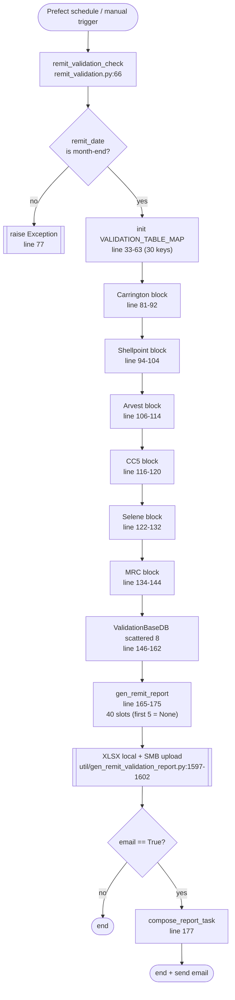
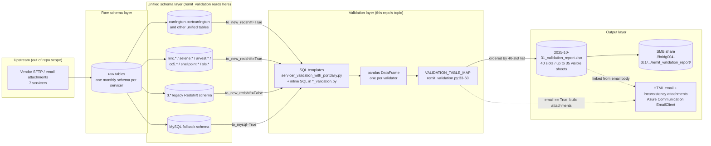
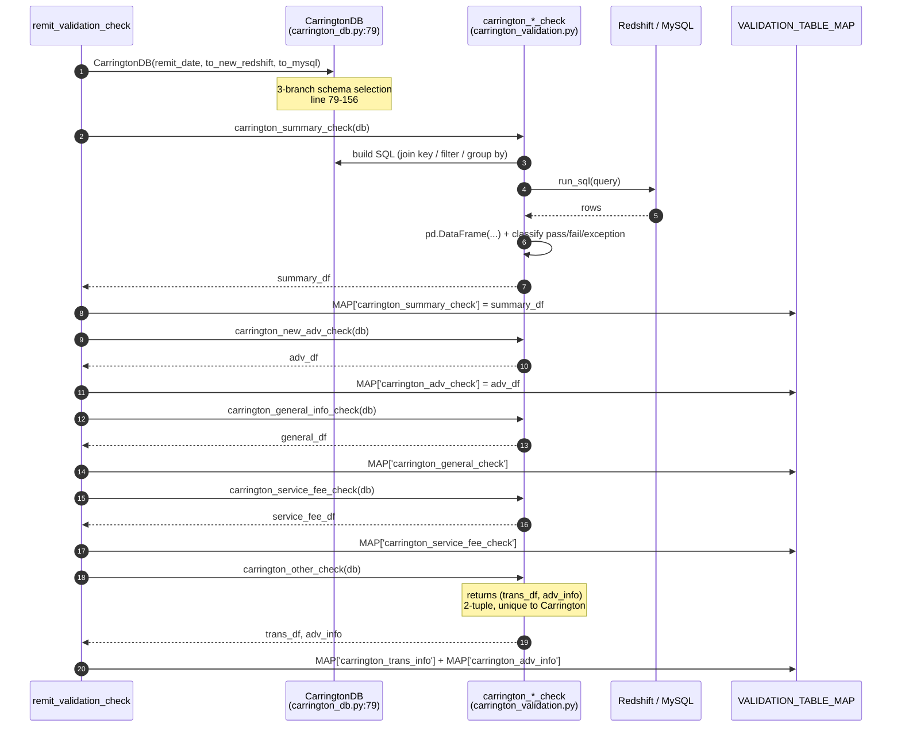
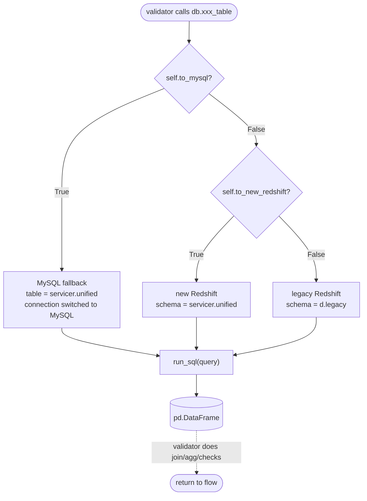
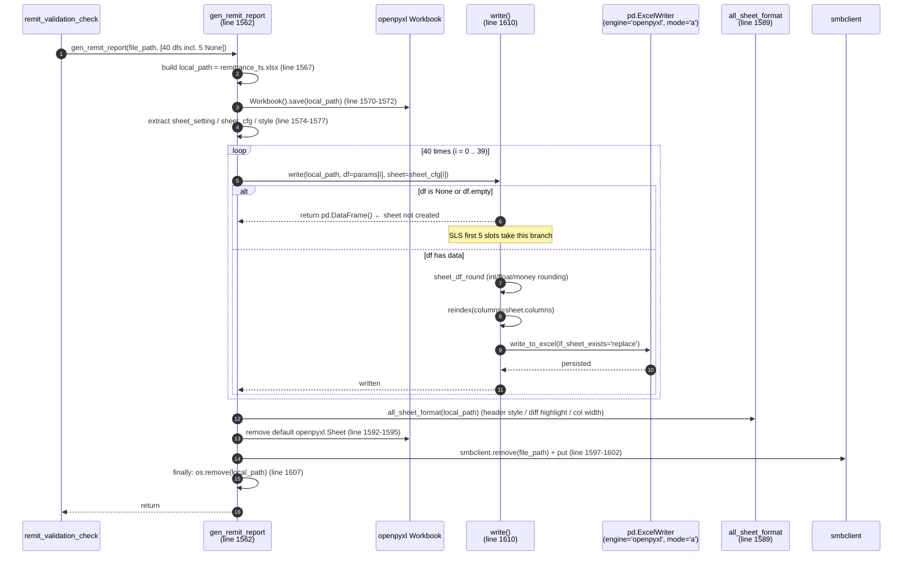
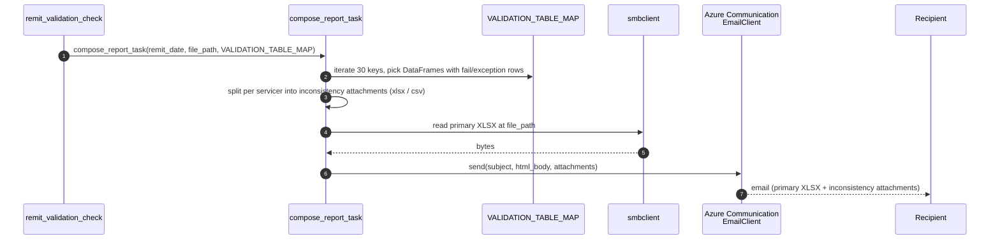

# 1.1 Overall generation flow of the Validation Report

> This chapter corresponds to TOC section 1.1. Every fact below is traceable to
> `flow/remit_validation/remit_validation.py`,
> `util/gen_remit_validation_report.py`, `tasks/servicer_data/remit_config.py`
> and each servicer's `*_db.py`. No new-system design is introduced.
>
> Chinese version: `overall-flow.zh.md` (use the language switcher in the site header).

---

> **Purpose**: Reverse-engineer, from source code as the single source of truth, the end-to-end flow that turns a `remit_date` into the Validation Report XLSX produced by PrefectFlow `remit_validation`. This is the foundation for the per-servicer chapters (1.2.x) and the lineage chapter (1.3).
>
> **Intended audience**: (1) PrefectFlow engineers maintaining `remit_validation`; (2) onboarding engineers; (3) Stage 2 system designers who need a whitebox view of the existing logic; (4) business / QA reviewers cross-checking XLSX sheets against upstream data.
>
> **Revision history**
>
> | Date | Author | Change |
> |---|---|---|
> | 2026-05-16 | Copilot CLI agent | v1.1: per AGENTS.md § 6.7-5, inlined the 6 workflow / dataflow diagrams (previously in `diagrams.en.md`) back into § 1.1.7; deleted the standalone diagrams file; added captions and numbered step-by-step explanations for every diagram. |
> | 2026-05-16 | Copilot CLI agent | v1.0: initial split-bilingual version covering 1.1.1–1.1.7 (entry / data sources / VALIDATION_TABLE_MAP / file inventory / SQL templates / XLSX output / sequence diagram). |

---


## 1.1.1 Entry point

The entire report is produced by a single Prefect flow,
`remit_validation_check`, defined in
`flow/remit_validation/remit_validation.py:66-177` and decorated with
`@flow(name="remit_validation_check")`.

It takes 4 parameters (lines 67-68):

| Param             | Type              | Default | Meaning |
|-------------------|-------------------|---------|---------|
| `remit_date`      | `datetime.date`   | `None`  | The remit month-end date the report represents |
| `email`           | `bool`            | `False` | Whether to dispatch the email notification |
| `to_new_redshift` | `bool`            | `False` | Read from the new Redshift schemas (`carrington.*`, `mrc.*`, …) instead of the legacy `d.*` schemas |
| `to_mysql`        | `bool`            | `False` | Route DB calls to MySQL fallback instead of Redshift (consumed by `ValidationBaseDB.run_sql`) |

Default of `remit_date`: at lines 70-73, if the caller omits it the flow
back-computes "today minus one month, snapped to month end" via
`(curr_date - MonthEnd(1)).date()`, using `pandas.tseries.offsets.MonthEnd`.

A hard validation follows at lines 74-77: the month of `remit_date + 1 day`
must differ from the month of `remit_date`; otherwise the flow raises
`Exception('The date must be the last day of the month.')`. The flow therefore
only supports a true month-end `remit_date`, never a mid-month value.

The bottom of the entry module (lines 180-183) hard-codes three example calls,
the final being
`remit_validation_check(remit_date=datetime.date(2025, 10, 31), email=False, to_new_redshift=True, to_mysql=False)`.
This documents the production-typical call shape: explicit month-end, no email,
read new Redshift, do not use MySQL.

---

## 1.1.2 Data-source landscape

The actual data reads happen inside each servicer's `*_db.py`. The template is
`CarringtonDB` (`flow/remit_validation/carrington_db.py:79-156`); every other
servicer DB class follows the same three-branch schema-selection idiom:

```python
if self.to_mysql:        table = 'carrington.portcarrington'
elif self.to_new_redshift: table = 'carrington.portcarrington'
else:                     table = 'd.portcarrington'
```

These branches select the source DB / schema: MySQL uses
`<servicer>.<table>`, new Redshift uses `<servicer>.<table>`, legacy Redshift
uses the `d.<table>` form. SQL is dispatched through
`ValidationBaseDB.run_sql` (`carrington_db.py:16-27`), which picks between
`get_conn(DbTypeEnum.REDSHIFT, ...)` and `get_sqlalchemy_engine(MYSQL, ...)`.

Per-servicer raw-schema tables (from the respective `*_db.py` modules and the
`tasks/servicer_data/remit_config.py` table maps such as
`CARRINGTON_REMIT_TABLE_MAP_*`):

| Servicer | Key raw tables (new-Redshift names) |
|---|---|
| Carrington | `carrington.portcarrington`, `carrington.portcarringtonremit`, `carrington.portcarringtonremitadv`, `carrington.portcarringtontrans`, `carrington.portcarringtonremitfee`, `carrington.portcarringtonremitmod`, `carrington.portcarringtonremitaggmisc` |
| Shellpoint | a parallel set of `newrez.portnewrez*` tables |
| Arvest | `arvest.portarvest*` family |
| CC5 | `capecodfive.portcapecodfive_*` (trial_balance, activity, monthly_servicing, etc.) |
| Selene | `selene.portselene*` family |
| MRC | `mrc.portmrc*` family |
| SLS | `sls.portsls*` family (defined in `SlsDB`, currently not called from the flow) |
| Shared | `port.portmonth`, `port.portfunding`, `port.basic_data_daily_loan_common` — the unified portfolio-daily / portfolio-month tables |

`port.basic_data_daily_loan_common` is the cross-servicer spine: scattered
validators and every `*_adv_validation` / `*_general_check` SQL template join
against it (see `servicer_validation_with_portdaily.py`).

---

## 1.1.3 Intermediate DataFrames: full `VALIDATION_TABLE_MAP` dictionary

`VALIDATION_TABLE_MAP` is declared at `remit_validation.py:33-63` with 29
placeholder `None` keys; the flow body (lines 81-162) then writes each
validator's DataFrame into it as soon as the validator returns. The key order
and write moment below mirror the flow's true execution sequence and total 30
keys — note `carrington_summary_check` is added in the flow body (line 83) and
does not appear in the initial dictionary.

| # | Line | Key                                 | Written by |
|---|------|-------------------------------------|------------|
| 1 | 83   | `carrington_summary_check`          | `carrington_summary_check`   |
| 2 | 85   | `carrington_adv_check`              | `carrington_new_adv_check`   |
| 3 | 87   | `carrington_general_check`          | `carrington_general_info_check` |
| 4 | 89   | `carrington_service_fee_check`      | `carrington_service_fee_check` |
| 5 | 91   | `carrington_trans_info`             | `carrington_other_check` (1st return) |
| 6 | 92   | `carrington_adv_info`               | `carrington_other_check` (2nd return) |
| 7 | 96   | `shellpoint_summary_check`          | `shellpoint_summary_check`   |
| 8 | 98   | `shellpoint_adv_check`              | `shellpoint_check_avd_balance` |
| 9 | 100  | `shellpoint_general_check`          | `shellpoint_check_general_info` |
| 10 | 102 | `shellpoint_service_fee_check`      | `shellpoint_service_fee_check` |
| 11 | 104 | `shellpoint_adv_info`               | `shellpoint_other_check`     |
| 12 | 108 | `arvest_remit_info`                 | `arvest_get_sub_and_tot_remit` |
| 13 | 110 | `arvest_bal_chg_info`               | `arvest_compare_bal_chg`     |
| 14 | 112 | `arvest_pandi_compare_info`         | `arvest_pandi_info_check`    |
| 15 | 114 | `arvest_service_fee_info`           | `arvest_service_fee_check`   |
| 16 | 118 | `cc5_service_fee_info`              | `cc5_service_fee_check`      |
| 17 | 120 | `cc5_bal_check_info`                | `cc5_principal_bal_check`    |
| 18 | 124 | `selene_summary_check`              | `selene_summary_check`       |
| 19 | 126 | `selene_general_check`              | `selene_check_general_info`  |
| 20 | 128 | `selene_adv_check`                  | `selene_check_adv_balance`   |
| 21 | 130 | `selene_service_fee_check`          | `selene_service_fee_check`   |
| 22 | 132 | `selene_adv_info`                   | `selene_other_check`         |
| 23 | 136 | `mrc_summary_check`                 | `mrc_summary_check`          |
| 24 | 138 | `mrc_general_check`                 | `mrc_check_general_info`     |
| 25 | 140 | `mrc_adv_check`                     | `mrc_check_adv_balance`      |
| 26 | 142 | `mrc_service_fee_check`             | `mrc_service_fee_check`      |
| 27 | 144 | `mrc_adv_info`                      | `mrc_other_check`            |
| 28 | 148 | `adv_month_vs_funding`              | `adv_month_vs_funding`       |
| 29 | 150 | `pandi_vs_next_due_date`            | `check_pandi_nextduedate_logic` |
| 30 | 152 | `all_servicer_fee`                  | `all_servicer_fee_check`     |
| 31 | 154 | `paid_off_loans_info`               | `check_paid_off_loans`       |
| 32 | 156 | `modi_loans_info`                   | `check_modi_loan_info`       |
| 33 | 158 | `loans_scale_info`                  | `check_loans_scale_info`     |
| 34 | 160 | `pandi_compare_info`                | `compare_pandi`              |
| 35 | 162 | `check_paidoff_loans_deffer_info`   | `check_paidoff_loans_deffer` |

**The 5 SLS keys (`sls_adv_check`, `sls_general_check`,
`sls_service_fee_check`, `sls_other_fee_check`, `sls_summary_check`, lines
34-37) always retain their initial `None`** — no write statement exists in the
flow body. The email composer (`compose_email`) reads these `None` values, so
SLS sections in the email body show empty header rows.

The only consumer of `VALIDATION_TABLE_MAP` is `compose_report_task` (line 177),
which builds email attachments and embedded HTML tables. The XLSX writer does
**not** read `VALIDATION_TABLE_MAP`; it receives a positional list of 35 named
DataFrames plus 5 `None` placeholders (lines 166-175) — see 1.1.6.

---

## 1.1.4 Inventory of relevant Python files

Organized by call graph:

```
remit_validation.py  (entry @flow)
├── flow/remit_validation/
│   ├── carrington_db.py        ← ValidationBaseDB + CarringtonDB
│   ├── carrington_validation.py← 5 task fns
│   ├── shellpoint_db.py        ← ShellpointDB
│   ├── shellpoint_validation.py← 5 task fns
│   ├── arvest_db.py            ← ArvestDB
│   ├── arvest_validation.py    ← 4 task fns
│   ├── cc5_db.py               ← Cc5DB
│   ├── cc5_validation.py       ← 2 task fns
│   ├── selene_db.py            ← SeleneDB
│   ├── selene_validation.py    ← 5 task fns
│   ├── mrc_db.py               ← MrcDB
│   ├── mrc_validation.py       ← 5 task fns
│   ├── sls_db.py               ← SlsDB (defined but flow does NOT call)
│   ├── sls_validation.py       ← 5 task fns (defined but flow does NOT call)
│   ├── scattered_validation.py ← 8 cross-servicer task fns
│   ├── servicer_validation_with_portdaily.py ← shared SQL string templates
│   ├── utils.py                ← get_fctrdt helper
│   └── report_email_tasks/compose_email.py ← compose_report_task (email path)
├── util/gen_remit_validation_report.py
│   ├── setting (sheet_setting + style)         ← single source of truth for 40 sheet schemas
│   ├── gen_remit_report(file_path, params)     ← XLSX writer entry
│   ├── write(...) / write_to_excel(...)        ← per-sheet write with openpyxl + pandas.ExcelWriter
│   └── sheet_df_round / all_sheet_format       ← rounding + cell-styling
└── tasks/servicer_data/remit_config.py
    └── VALIDATION_REPORT_ROUTE  = f'{SMB_OUTPUT_PATH}/remit_validation_report/'
```

| File | Role |
|---|---|
| `remit_validation.py` | Flow entry; validator orchestration order; assembles `VALIDATION_TABLE_MAP`; invokes `gen_remit_report` |
| `<servicer>_db.py` | Chooses schema and DB connection; selects raw servicer tables into DataFrames |
| `<servicer>_validation.py` | True calculation + validation logic (join / filter / compute diffs / compare daily-vs-remit) |
| `scattered_validation.py` | 8 cross-servicer validators (service-fee aggregation, paid-off loans, …) |
| `servicer_validation_with_portdaily.py` | Holds the 8 reusable SQL templates consumed by advance / general validators (see 1.1.5) |
| `utils.py` | `get_fctrdt(remit_date)` maps `remit_date` to the 1st of the following month, used as `fctrdt` |
| `gen_remit_validation_report.py` | Registers all 40 sheet schemas; writes / formats / uploads the full XLSX |
| `report_email_tasks/compose_email.py` | When `email=True` builds the HTML email plus inconsistency attachments (consumes `VALIDATION_TABLE_MAP`) |
| `tasks/servicer_data/remit_config.py` | Output route `VALIDATION_REPORT_ROUTE` and per-servicer upload-path constants |

---

## 1.1.5 Inventory of relevant SQL files / blocks

The bulk of the SQL lives as **string templates** in
`flow/remit_validation/servicer_validation_with_portdaily.py`. Templates use
sentinels such as `'input_pre_month_end'`, `'input_curr_month_end'`,
`'input_fctrdt'` as date placeholders; validators substitute them at call time
via `.replace(...)`.

| Line | Template variable                  | Consumer                                  | DB              |
|------|------------------------------------|-------------------------------------------|-----------------|
| 2    | `carrington_adv_validation`        | `carrington_new_adv_check`                | Redshift        |
| 52   | `mysql_carrington_adv_validation`  | same (MySQL path)                         | MySQL           |
| 103  | `carrington_general_check`         | `carrington_general_info_check`           | Redshift        |
| 157  | `mysql_carrington_general_check`   | same (MySQL)                              | MySQL           |
| 200  | `newrez_adv_validation`            | `shellpoint_check_avd_balance`            | Redshift        |
| 257  | `mysql_newrez_adv_validation`      | same (MySQL)                              | MySQL           |
| 313  | `newrez_general_check`             | `shellpoint_check_general_info`           | Redshift        |
| 378  | `mysql_newrez_general_check`       | same (MySQL)                              | MySQL           |
| 450  | `selene_adv_validation`            | `selene_check_adv_balance`                | Redshift only   |
| 511  | `selene_general_check`             | `selene_check_general_info`               | Redshift only   |
| 583  | `mrc_adv_validation`               | `mrc_check_adv_balance`                   | Redshift only   |
| 635  | `mrc_general_check`                | `mrc_check_general_info`                  | Redshift only   |

Note Selene and MRC have no `mysql_*` twin templates: when `to_mysql=True` the
advance / general validators for these two servicers fall through to the same
Redshift SQL string and therefore **do not support the MySQL path** in practice.

Other SQL strings (Arvest sum_remit / bal_chg, CC5 service_fee / bal_check, the
8 scattered blocks, plus the service_fee / other / summary validators for each
servicer) live inline inside the respective `*_validation.py` modules rather
than being centralized. This chapter only lists file locations; per-SQL join /
filter analysis belongs to the per-sheet generation logic in chapters 1.2.x.

---

## 1.1.6 Final XLSX output

**Path construction** — `remit_validation.py:163-164`:

```python
date_path = ''.join(str(remit_date).split('-'))   # 2025-10-31 -> '20251031'
remittance_file_path = VALIDATION_REPORT_ROUTE + date_path + '/' + str(remit_date) + '_validation_report.xlsx'
```

`VALIDATION_REPORT_ROUTE` resolves to
`f'{SMB_OUTPUT_PATH}/remit_validation_report/'`
(`tasks/servicer_data/remit_config.py:379`) where
`SMB_OUTPUT_PATH = f"//bridg004-dc1.corp.bridgerpartners.com/shared/PrefectFlow/{BUILDENV}/output"`.
The resulting path therefore takes the form:

```
//bridg004-dc1.corp.bridgerpartners.com/shared/PrefectFlow/<env>/output/remit_validation_report/20251031/2025-10-31_validation_report.xlsx
```

**Physical sheet write order**: the order is dictated purely by positions in
the list passed to `gen_remit_report` (`remit_validation.py:166-175`), which
mirrors the insertion order of `setting["sheet_setting"]`:

```
SLS(5 None) → Carrington(6) → Shellpoint(5) → Arvest(4) → CC5(2)
            → Scattered(8) → Selene(5) → MRC(5)
```

`carrington_summary_df` is the 6th item in the list (line 167) right after 5
`None` values, so the first 5 sheets (SLS family) ship as empty header-only
tables and the first sheet with data is `Carrington_Summary_check`.

**Writer pipeline** (`gen_remit_report`,
`util/gen_remit_validation_report.py:1562-1607`):

1. Line 1567 mints a local temp filename `remittance_<unix_ts>.xlsx`; the flow writes locally and uploads to SMB afterwards.
2. Lines 1570-1572 create an empty workbook via `openpyxl.Workbook().save(local_path)`.
3. Lines 1574-1577 extract `get_all_sheet`, `get_cfg`, `get_style` from `setting` to obtain the sheet-name list, per-sheet column config, and styling.
4. Lines 1582-1586 loop 40 times; for each index it picks `params[i]` plus the matching `sheet_cfg` and calls `write(...)` to push the DataFrame into the sheet.
5. Inside `write` (lines 1610-1634): `sheet_df_round` rounds int / float / money columns; `reindex(columns=sheet.columns)` aligns the DataFrame to the declared schema; `write_to_excel` then opens an `openpyxl` writer in append mode with `if_sheet_exists='replace'` and writes the sheet.
6. Line 1589 `all_sheet_format` re-opens the workbook and applies header styling, diff-column highlight, automatic column width, etc.
7. Lines 1592-1595 remove the default `Sheet` that openpyxl creates if it is still present.
8. Lines 1597-1602 use `smbclient` to upload the local file to `file_path`, removing any existing file first.
9. Line 1607 deletes the local temp file in `finally`.

If a sheet's DataFrame is `None` or `.empty` (e.g. the 5 SLS sheets), `write`
short-circuits at line 1612 with `return pd.DataFrame()`. `write_to_excel` is
not called for that index, so the sheet **never gets created in the workbook**.
This is why the physically visible sheet count in the final XLSX is below 40.

---

## 1.1.7 Workflow & Dataflow Diagrams

This section ties §§ 1.1.1–1.1.6 together with 6 diagrams:

| # | Sub-section | Type | Scope |
|---|---|---|---|
| 1 | 1.1.7.1 Overall workflow | flowchart | end-to-end overview |
| 2 | 1.1.7.2 Overall dataflow (lineage) | flowchart | data lineage |
| 3 | 1.1.7.3 Per-servicer template (Carrington) | sequenceDiagram | detailed |
| 4 | 1.1.7.4 SQL routing decision | flowchart | detailed |
| 5 | 1.1.7.5 `gen_remit_report` write sequence | sequenceDiagram | detailed |
| 6 | 1.1.7.6 Email branch | sequenceDiagram | detailed |

> Table 1.1.7-0: Diagram inventory for this section. Source: `flow/remit_validation/remit_validation.py:66-177` and `util/gen_remit_validation_report.py:1562-1634`.

---

### 1.1.7.1 Overall workflow



> Figure 1.1.7-1: End-to-end overview of `remit_validation_check` from trigger to XLSX on SMB and the optional email path. Source: `remit_validation.py:66-177`.

**Step-by-step (in arrow order):**

1. **Trigger**: Prefect schedule or `__main__` manually invokes `remit_validation_check(remit_date, email, to_new_redshift, to_mysql)`. Source: `remit_validation.py:66-68`.
2. **Month-end check**: `(remit_date + 1 day).month != remit_date.month` else `raise Exception`. Source: `remit_validation.py:74-77`.
3. **Init global dict**: `VALIDATION_TABLE_MAP` (30 keys) is created at module load; each run overwrites entries. Source: `remit_validation.py:33-63`.
4. **Carrington block**: instantiate `CarringtonDB` → call 5 validators serially → 6 keys written (because `other_check` returns a 2-tuple). Source: `remit_validation.py:81-92`.
5. **Shellpoint block**: same pattern, 5 validators → 5 keys. Source: `remit_validation.py:94-104`.
6. **Arvest block**: 4 validators → 4 keys. Source: `remit_validation.py:106-114`.
7. **CC5 block**: 2 validators → 2 keys. Source: `remit_validation.py:116-120`.
8. **Selene block**: 5 validators → 5 keys. Source: `remit_validation.py:122-132`.
9. **MRC block**: 5 validators → 5 keys. Source: `remit_validation.py:134-144`.
10. **Scattered 8**: uses `ValidationBaseDB` (no servicer binding) for cross-servicer aggregation / checks. Source: `remit_validation.py:146-162`.
11. **Assemble 40-slot list + call `gen_remit_report`**: first 5 slots are hard-coded `None` (SLS placeholders); the rest are DataFrames in sheet order. Source: `remit_validation.py:165-175`.
12. **XLSX local + SMB upload**: after local file is written, `smbclient.put` copies it to the SMB share. Source: `util/gen_remit_validation_report.py:1597-1602`.
13. **Email branch**: only when `email=True` → `compose_report_task(...)`. Source: `remit_validation.py:176-177`.

Key facts: the 7 servicer blocks run **strictly sequentially** (no `.submit()`); the in-flow compute order (Carrington → … → MRC → scattered) **differs from** the XLSX sheet order (SLS → Carrington → … → scattered → Selene → MRC) — the latter is driven by step 11's list position.

---

### 1.1.7.2 Overall dataflow (lineage)



> Figure 1.1.7-2: The 5-hop lineage from vendor file to a final XLSX cell (S0 → S1 → S2 → S3 → S4). Source: each `*_db.py` + the SQL files + `gen_remit_report`.

**Step-by-step (in data-flow direction):**

1. **S0 → S1**: upstream flows (out of this repo) land vendor SFTP / email attachments into raw monthly schemas.
2. **S1 → S2**: another set of flows transforms raw into unified schemas (3 of the 4 S2 branches). This repo's documentation boundary begins at S2.
3. **S2 → S3 routing**: 4 branches selected by entry parameters `to_new_redshift` / `to_mysql` (see 1.1.7.4).
4. **Inside S3**: SQL template runs → `pd.DataFrame` → validator does join/agg/checks → result written to `VALIDATION_TABLE_MAP` key. Source: `remit_validation.py:81-162`.
5. **MAP → XLSX**: `gen_remit_report` writes by 40-slot list position (not dict insertion order). Source: `remit_validation.py:163-175`.
6. **XLSX → SMB**: local file uploaded via `smbclient.put`. Source: `util/gen_remit_validation_report.py:1597-1602`.
7. **MAP → Mail (dashed)**: the email path does **not** re-read the XLSX; it re-filters fail/exception rows from in-memory MAP into separate attachments (see 1.1.7.6).

Key facts: the only "compute order ≠ output order" point is step 5. S0 / S1 are out of this repo's scope.

---

### 1.1.7.3 Per-servicer validator template (Carrington detailed sequence)



> Figure 1.1.7-3: Execution sequence of the Carrington block's 5 validators and the resulting `VALIDATION_TABLE_MAP` writes; the other 6 servicers follow this same template. Source: `remit_validation.py:81-92` + `carrington_db.py:79-156` + `carrington_validation.py`.

**Step-by-step (autonumber 1–16):**

1. **Instantiate DB**: `CarringtonDB(remit_date, to_new_redshift, to_mysql)`; the 3-branch schema selection runs in the constructor. Source: `carrington_db.py:79-156`.
2–5. **Summary check**: flow calls validator → validator builds SQL → `run_sql` against Redshift/MySQL → rows returned → validator turns rows into a DataFrame and classifies pass/fail/exception. Source: `carrington_validation.py:carrington_summary_check`.
6. **Write MAP**: `MAP['carrington_summary_check'] = summary_df`. Source: `remit_validation.py:82-83`.
7–8. **Adv check + MAP write**: `carrington_new_adv_check`. Source: `remit_validation.py:84-85`.
9–10. **General check + MAP write**: `carrington_general_info_check`. Source: `remit_validation.py:86-87`.
11–12. **Service-fee check + MAP write**: `carrington_service_fee_check`. Source: `remit_validation.py:88-89`.
13–16. **Other check**: `carrington_other_check` returns a 2-tuple `(trans_df, adv_info)`; flow writes both MAP keys (`carrington_trans_info` + `carrington_adv_info`). Source: `remit_validation.py:90-92`.

Key facts: Carrington produces **6** sheets (not 5) precisely because of the 2-tuple in steps 13–16. All validators are synchronous blocking calls; exceptions propagate straight to the Prefect flow run. SLS is the exception among 7 servicers: 5 validator functions are defined but the flow **never calls them** — the 5 corresponding slots are hard-coded `None`.

---

### 1.1.7.4 SQL routing decision (Redshift / new Redshift / MySQL)



> Figure 1.1.7-4: The three-branch decision each validator takes when picking SQL template and DB connection. Source: `carrington_db.py:80-90` (the same location exists in every other servicer's `*_db.py`).

**Step-by-step:**

1. **Entry**: validator obtains target table name via `db.xxx_table` and/or runs SQL via `db.run_sql`.
2. **Branch 1**: if `self.to_mysql == True` → MySQL fallback; table name matches new Redshift but the connection switches to MySQL.
3. **Branch 2**: else if `self.to_new_redshift == True` → new Redshift (`<servicer>.<unified>` schema).
4. **Branch 3**: else legacy `d.*` Redshift schema.
5. **Execute SQL**: all 3 branches converge on `run_sql(query)`.
6. **Return DataFrame**: validator does join/agg/checks and returns to flow.

Key facts: 8 of the 12 SQL templates have `mysql_` twins (Carrington / Shellpoint adv & general); 4 do not (Selene / MRC adv & general). The latter group is never exercised in production, so the MySQL path is effectively dead code for those 2 servicers.

---

### 1.1.7.5 `gen_remit_report` 40-slot write sequence



> Figure 1.1.7-5: Every step from "40 DataFrame slots" to "≤35 visible sheets uploaded to SMB" inside `gen_remit_report`. Source: `util/gen_remit_validation_report.py:1562-1634`.

**Step-by-step (autonumber 1–12):**

1. **Entry**: flow calls `gen_remit_report(file_path, params)` with a 40-slot list. Source: `remit_validation.py:165-175`.
2. **Build local temp name**: `remittance_<unix_ts>.xlsx`. Source: `gen_remit_validation_report.py:1567`.
3. **Create empty workbook**: `openpyxl.Workbook().save(local_path)`. Source: lines 1570-1572.
4. **Extract config**: from `setting` obtain sheet names / per-sheet column config / style. Source: lines 1574-1577.
5. **Loop 40 times**: each iteration calls `write(local_path, df=params[i], sheet=sheet_cfg[i])`. Source: lines 1582-1586.
6. **Short-circuit branch**: if `df is None or df.empty` → `write` returns at line 1612 → no sheet is created (this is exactly why the 5 SLS slots produce no sheet).
7. **Normal branch**: `sheet_df_round` → `reindex(columns=...)` → `pd.ExcelWriter(mode='a', if_sheet_exists='replace')` writes.
8. **Write**: `write_to_excel` calls `to_excel`.
9. **Apply styles**: `all_sheet_format` post-processes header / diff highlight / col width after all sheets are written. Source: line 1589.
10. **Remove default Sheet**: drop the empty 'Sheet' openpyxl creates by default. Source: lines 1592-1595.
11. **SMB upload**: `remove(file_path)` first, then `put(local_path)`. Source: lines 1597-1602.
12. **finally clean local**: `os.remove(local_path)`. Source: line 1607.

Key facts: the "40 in / ≤35 out" gap is entirely due to step 6's short-circuit. `if_sheet_exists='replace'` + "SMB remove-then-put" together make same-month re-runs idempotent.

---

### 1.1.7.6 Email branch (`compose_report_task`)



> Figure 1.1.7-6: Email-branch sequence (only when `email=True`); attachments are re-built from MAP, not from XLSX sheets. Source: `remit_validation.py:176-177` + `report_email_tasks/compose_email.py`.

**Step-by-step (autonumber 1–6):**

1. **Flow calls task**: passes `remit_date` / `file_path` / `MAP`. Source: `remit_validation.py:177`.
2. **Filter fail/exception**: iterate the 30 MAP keys, keep DataFrames that contain inconsistency rows.
3. **Split attachments**: per-servicer split into separate xlsx / csv files.
4. **Read primary XLSX**: pull `file_path` bytes from SMB (for body link or attachment).
5. **Send email**: call Azure Communication `EmailClient.send(...)`.
6. **Delivery**: recipient receives the HTML email with primary XLSX + inconsistency attachments.

Key facts: email attachments **do not reuse** XLSX sheets; they are re-filtered from in-memory MAP, so column order / field names may diverge from the XLSX view. When `email=False` (production default) the whole email branch is skipped.

---

### 1.1.7.7 Source citation index

Combined source map for every node in § 1.1.7:

| Node | File | Lines |
|---|---|---|
| flow entry / month-end check | `remit_validation.py` | `66-77` |
| `VALIDATION_TABLE_MAP` init | `remit_validation.py` | `33-63` |
| 7 servicer blocks (serial) | `remit_validation.py` | `81-144` |
| scattered 8 validators | `remit_validation.py` | `146-162` |
| 40-slot list + `gen_remit_report` call | `remit_validation.py` | `163-175` |
| email branch | `remit_validation.py` | `176-177` |
| `CarringtonDB` 3-branch schema selection | `carrington_db.py` | `79-156` |
| 12 SQL templates | `servicer_validation_with_portdaily.py` | `2, 52, 103, 157, 200, 257, 313, 378, 450, 511, 583, 635` |
| `gen_remit_report` main | `util/gen_remit_validation_report.py` | `1562-1607` |
| `write()` short-circuit + ExcelWriter | `util/gen_remit_validation_report.py` | `1610-1634` |
| `all_sheet_format` | `util/gen_remit_validation_report.py` | `1589` |
| XLSX path root | `tasks/servicer_data/remit_config.py` | `379` |

> Table 1.1.7-7: Combined source-location summary for everything cited above.

---

## Items to review

1. The 1.1.2 raw-table inventory is a high-level summary derived from the `remit_config.py` TABLE_MAP entries and hard-coded table names in `*_db.py`. Per-table / per-field detail is deferred to chapters 1.2.x.
2. 1.1.5 only lists template locations and does not expand SQL bodies; per-SQL join / filter analysis belongs to the per-sheet generation logic in chapters 1.2.x.
3. The email branch only fires when `email=True`; the production-typical call uses `email=False` (see `remit_validation.py:183`).
