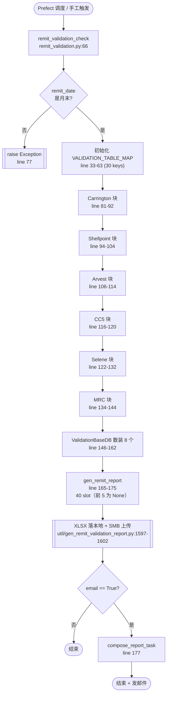
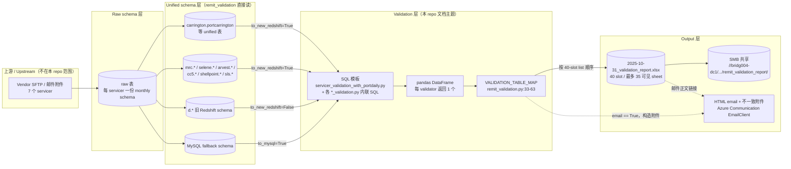
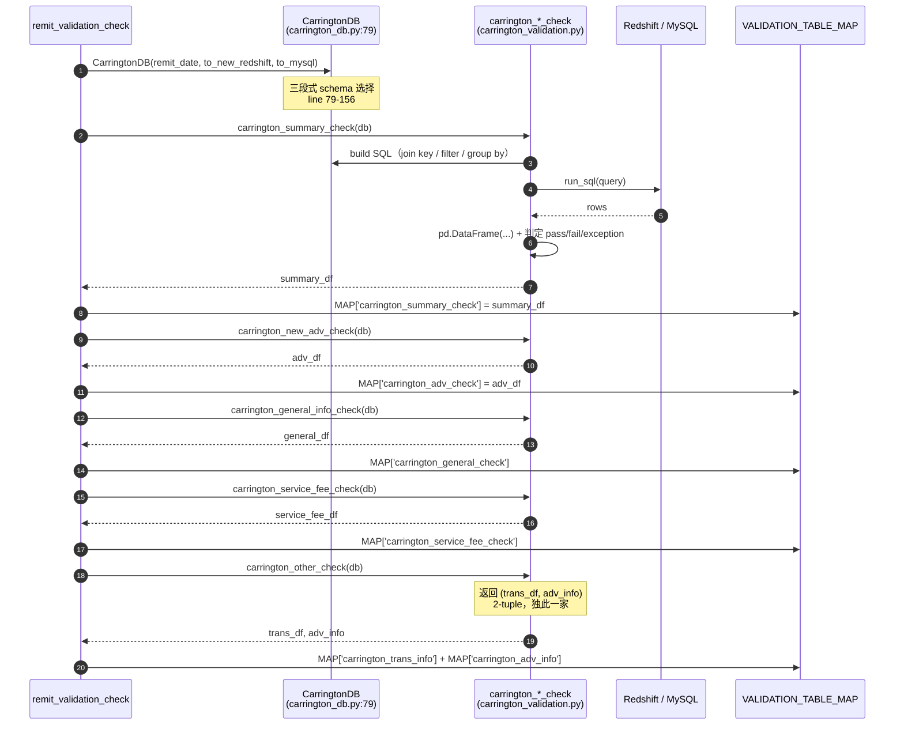
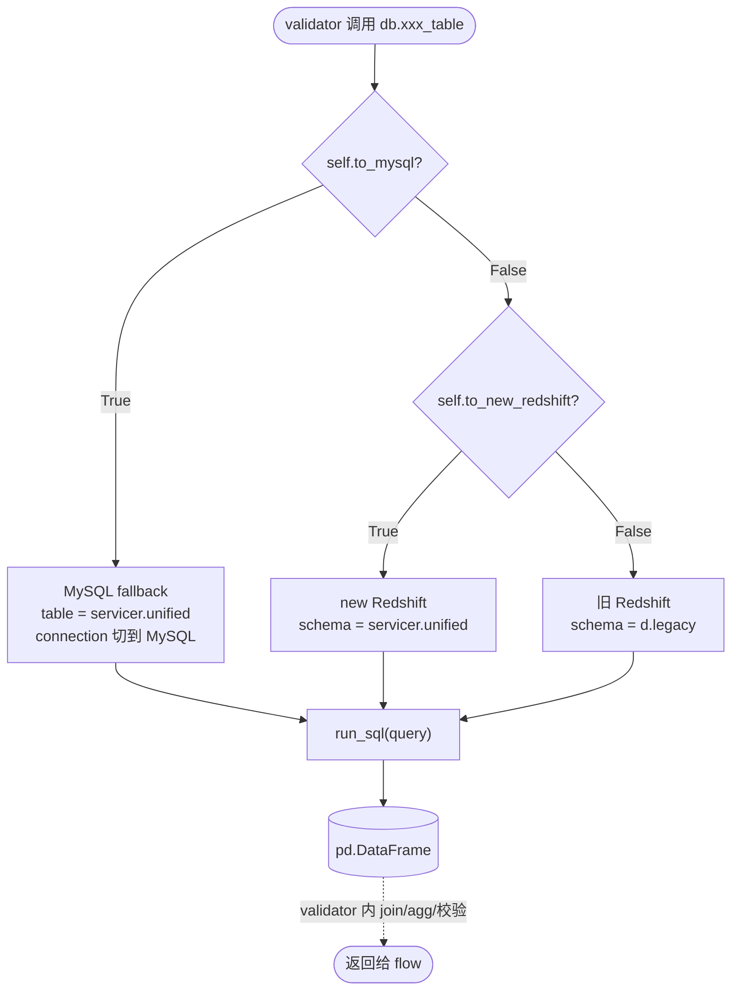
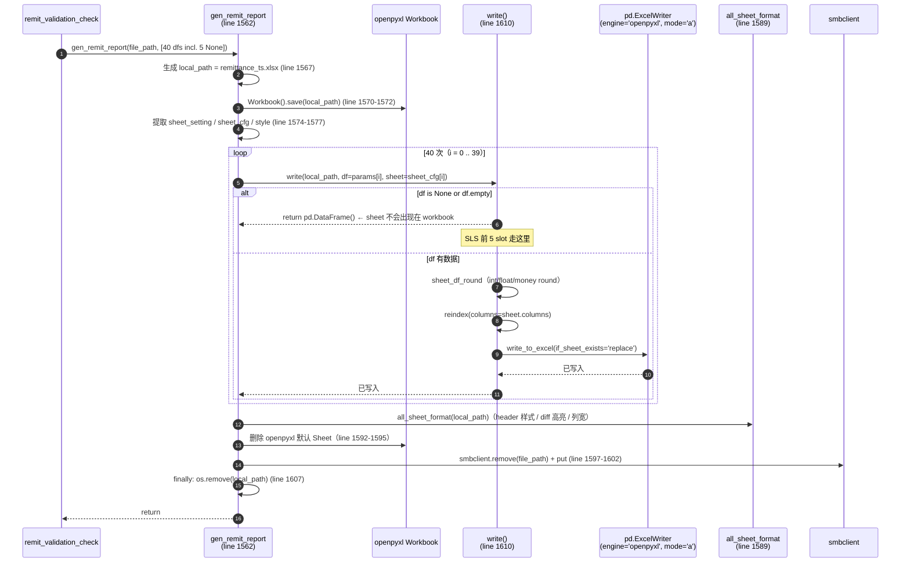
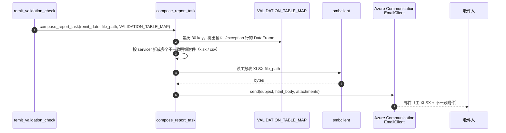

# 1.1 Validation Report 整体生成流程

> 本章对应 TOC 章节 1.1。所有事实均来自 `flow/remit_validation/remit_validation.py`、
> `util/gen_remit_validation_report.py`、`tasks/servicer_data/remit_config.py` 与各 servicer 的 `*_db.py`，
> 不引入任何新系统设计。
>
> 英文版见 `overall-flow.en.md`（使用站点顶栏的语言切换器）。

---

> **Purpose / 目的**：以源码为唯一事实来源，反推 PrefectFlow `remit_validation` 端到端"生成 Validation Report XLSX"的整体流程，作为 Stage 1 各 servicer 章节（1.2.x）和数据流章节（1.3）的总览底座。
>
> **Intended audience / 目标读者**：(1) 维护 `remit_validation` 的 PrefectFlow 工程师；(2) Onboarding 的新工程师；(3) Stage 2 新系统设计阶段需要"白盒化展示"原系统逻辑的设计者；(4) 业务方 / QA，对照 XLSX sheet 与上游数据是否一致时的参考。
>
> **Revision history / 版本历史**
>
> | 日期 / Date | 作者 / Author | 变更 / Change |
> |---|---|---|
> | 2026-05-16 | Copilot CLI agent | v1.1：把 6 张工作流 / 数据流图（原 `diagrams.zh.md`）按 AGENTS.md § 6.7-5 内联回 1.1.7，删除独立 diagrams 文件；为每张图补 caption + numbered step-by-step。 |
> | 2026-05-16 | Copilot CLI agent | v1.0：首版（zh/en 拆分），覆盖 1.1.1-1.1.7（入口 / 数据来源 / VALIDATION_TABLE_MAP / 文件清单 / SQL 模板 / XLSX 输出 / 时序图）。 |

---


## 1.1.1 触发入口

整张报表由一个 Prefect flow 触发：`remit_validation_check`，
定义在 `flow/remit_validation/remit_validation.py:66-177`，
装饰器为 `@flow(name="remit_validation_check")`。

它接收 4 个参数（line 67-68）：

| 参数              | 类型             | 默认  | 含义 |
|-------------------|------------------|-------|------|
| `remit_date`      | `datetime.date`  | `None`| 报表所属的 remit 月末日期 |
| `email`           | `bool`           | `False`| 是否发送邮件通知 |
| `to_new_redshift` | `bool`           | `False`| 走"new Redshift" schema（`carrington.*` / `mrc.*` 等）还是旧的 `d.*` schema |
| `to_mysql`        | `bool`           | `False`| 走 MySQL fallback 而非 Redshift（被 `ValidationBaseDB.run_sql` 用来切换连接）|

`remit_date` 的默认值推导：line 70-73 中，如果用户未传，则取"今天前推 1 个月并对齐到月末" —— `(curr_date - MonthEnd(1)).date()`，其中 `MonthEnd` 来自 `pandas.tseries.offsets`。

随后 line 74-77 做强校验：`remit_date + 1 day` 的月份必须**不等于** `remit_date` 的月份，否则抛 `Exception('The date must be the last day of the month.')`。也就是说 flow 强制要求 `remit_date` 是某月最后一天，没有月中支持。

入口模块底部（line 180-183）写死了三组示例调用 —— `remit_validation_check(remit_date=datetime.date(2025, 10, 31), email=False, to_new_redshift=True, to_mysql=False)`，说明生产惯用形态是：手工指定月末日期、不发邮件、走新 Redshift、不走 MySQL。

---

## 1.1.2 数据来源全景

flow 真正读取数据的位置是各 servicer 的 `*_db.py`。Carrington 的 `CarringtonDB`（`flow/remit_validation/carrington_db.py:79-156`）是模板示范，其它 servicer 的 DB 类都用相同三段式 schema 选择逻辑：

```python
if self.to_mysql:        table = 'carrington.portcarrington'
elif self.to_new_redshift: table = 'carrington.portcarrington'
else:                     table = 'd.portcarrington'
```

三个分支决定从哪个数据库 / schema 取数：MySQL 走 `<servicer>.<table>`、新 Redshift 走 `<servicer>.<table>`、旧 Redshift 走 `d.<table>`。最终 SQL 在 `ValidationBaseDB.run_sql`（`carrington_db.py:16-27`）执行，`get_conn(DbTypeEnum.REDSHIFT, ...)` 或 `get_sqlalchemy_engine(MYSQL, ...)` 二选一。

按 servicer 罗列的入仓表（来自各 `*_db.py` 与 `tasks/servicer_data/remit_config.py:CARRINGTON_REMIT_TABLE_MAP_*` 等映射）：

| Servicer | 关键 raw 表（new Redshift 名） |
|---|---|
| Carrington | `carrington.portcarrington`、`carrington.portcarringtonremit`、`carrington.portcarringtonremitadv`、`carrington.portcarringtontrans`、`carrington.portcarringtonremitfee`、`carrington.portcarringtonremitmod`、`carrington.portcarringtonremitaggmisc` |
| Shellpoint | `newrez.portnewrez*`（一组类似命名的 remit/adv/fee 表）|
| Arvest | `arvest.portarvest*` 系列 |
| CC5 | `capecodfive.portcapecodfive_*`（trial_balance / activity / monthly_servicing 等）|
| Selene | `selene.portselene*` 系列 |
| MRC | `mrc.portmrc*` 系列 |
| SLS | `sls.portsls*` 系列（虽然 flow 当前未调用，但 `SlsDB` 已定义）|
| 共享 | `port.portmonth`、`port.portfunding`、`port.basic_data_daily_loan_common` —— 即所谓 portfolio-daily / portfolio-month 统一表 |

`port.basic_data_daily_loan_common` 是跨 servicer 校验的 spine —— scattered validator 与所有 `*_adv_validation` / `*_general_check` SQL 都会拿它做 join（见 `servicer_validation_with_portdaily.py`）。

---

## 1.1.3 中间 DataFrame：`VALIDATION_TABLE_MAP` 全列表

`VALIDATION_TABLE_MAP` 在 `remit_validation.py:33-63` 用 `None` 占位声明 29 个 key，随后在 flow body（line 81-162）每完成一个 validator 立刻把返回的 DataFrame 回填进去。Key 顺序与回填时机如下（按 flow 真实执行顺序），共 30 个 key（其中 `carrington_summary_check` 是 flow body 里新增的、未在初始 dict 列出的第 30 个 key，line 83 写入）。

| # | Line | Key                                 | 写入源 validator |
|---|------|-------------------------------------|------------------|
| 1 | 83   | `carrington_summary_check`          | `carrington_summary_check`   |
| 2 | 85   | `carrington_adv_check`              | `carrington_new_adv_check`   |
| 3 | 87   | `carrington_general_check`          | `carrington_general_info_check` |
| 4 | 89   | `carrington_service_fee_check`      | `carrington_service_fee_check` |
| 5 | 91   | `carrington_trans_info`             | `carrington_other_check` (1st return) |
| 6 | 92   | `carrington_adv_info`               | `carrington_other_check` (2nd return) |
| 7 | 96   | `shellpoint_summary_check`          | `shellpoint_summary_check`   |
| 8 | 98   | `shellpoint_adv_check`              | `shellpoint_check_avd_balance` |
| 9 | 100  | `shellpoint_general_check`          | `shellpoint_check_general_info` |
| 10 | 102 | `shellpoint_service_fee_check`      | `shellpoint_service_fee_check` |
| 11 | 104 | `shellpoint_adv_info`               | `shellpoint_other_check`     |
| 12 | 108 | `arvest_remit_info`                 | `arvest_get_sub_and_tot_remit` |
| 13 | 110 | `arvest_bal_chg_info`               | `arvest_compare_bal_chg`     |
| 14 | 112 | `arvest_pandi_compare_info`         | `arvest_pandi_info_check`    |
| 15 | 114 | `arvest_service_fee_info`           | `arvest_service_fee_check`   |
| 16 | 118 | `cc5_service_fee_info`              | `cc5_service_fee_check`      |
| 17 | 120 | `cc5_bal_check_info`                | `cc5_principal_bal_check`    |
| 18 | 124 | `selene_summary_check`              | `selene_summary_check`       |
| 19 | 126 | `selene_general_check`              | `selene_check_general_info`  |
| 20 | 128 | `selene_adv_check`                  | `selene_check_adv_balance`   |
| 21 | 130 | `selene_service_fee_check`          | `selene_service_fee_check`   |
| 22 | 132 | `selene_adv_info`                   | `selene_other_check`         |
| 23 | 136 | `mrc_summary_check`                 | `mrc_summary_check`          |
| 24 | 138 | `mrc_general_check`                 | `mrc_check_general_info`     |
| 25 | 140 | `mrc_adv_check`                     | `mrc_check_adv_balance`      |
| 26 | 142 | `mrc_service_fee_check`             | `mrc_service_fee_check`      |
| 27 | 144 | `mrc_adv_info`                      | `mrc_other_check`            |
| 28 | 148 | `adv_month_vs_funding`              | `adv_month_vs_funding`       |
| 29 | 150 | `pandi_vs_next_due_date`            | `check_pandi_nextduedate_logic` |
| 30 | 152 | `all_servicer_fee`                  | `all_servicer_fee_check`     |
| 31 | 154 | `paid_off_loans_info`               | `check_paid_off_loans`       |
| 32 | 156 | `modi_loans_info`                   | `check_modi_loan_info`       |
| 33 | 158 | `loans_scale_info`                  | `check_loans_scale_info`     |
| 34 | 160 | `pandi_compare_info`                | `compare_pandi`              |
| 35 | 162 | `check_paidoff_loans_deffer_info`   | `check_paidoff_loans_deffer` |

**SLS 5 个 key（`sls_adv_check / sls_general_check / sls_service_fee_check / sls_other_fee_check / sls_summary_check`，line 34-37）始终保持初始 `None`** —— flow body 里没有任何写入语句。邮件通知（`compose_email`）会读这些 `None`，因此 SLS 部分对应到邮件正文里是空表头。

`VALIDATION_TABLE_MAP` 的唯一用途是传给 `compose_report_task` 做邮件附件 / HTML 内嵌表（line 177）。XLSX 落盘**不读** `VALIDATION_TABLE_MAP`，而是直接把 35 个具名 DataFrame 与 5 个 `None` 共 40 个按位置塞进 `gen_remit_report` 的 list（line 166-175）—— 详见 1.1.6。

---

## 1.1.4 关键 Python 文件清单

按调用图：

```
remit_validation.py  (entry @flow)
├── flow/remit_validation/
│   ├── carrington_db.py        ← ValidationBaseDB + CarringtonDB
│   ├── carrington_validation.py← 5 task fns
│   ├── shellpoint_db.py        ← ShellpointDB
│   ├── shellpoint_validation.py← 5 task fns
│   ├── arvest_db.py            ← ArvestDB
│   ├── arvest_validation.py    ← 4 task fns
│   ├── cc5_db.py               ← Cc5DB
│   ├── cc5_validation.py       ← 2 task fns
│   ├── selene_db.py            ← SeleneDB
│   ├── selene_validation.py    ← 5 task fns
│   ├── mrc_db.py               ← MrcDB
│   ├── mrc_validation.py       ← 5 task fns
│   ├── sls_db.py               ← SlsDB (定义但 flow 未调用)
│   ├── sls_validation.py       ← 5 task fns (定义但 flow 未调用)
│   ├── scattered_validation.py ← 8 cross-servicer task fns
│   ├── servicer_validation_with_portdaily.py ← shared SQL string templates
│   ├── utils.py                ← get_fctrdt helper
│   └── report_email_tasks/compose_email.py ← compose_report_task (email path)
├── util/gen_remit_validation_report.py
│   ├── setting (sheet_setting + style)         ← 40 sheet schema 唯一来源
│   ├── gen_remit_report(file_path, params)     ← XLSX writer entry
│   ├── write(...) / write_to_excel(...)        ← per-sheet write with openpyxl + pandas.ExcelWriter
│   └── sheet_df_round / all_sheet_format       ← rounding + cell-styling
└── tasks/servicer_data/remit_config.py
    └── VALIDATION_REPORT_ROUTE  = f'{SMB_OUTPUT_PATH}/remit_validation_report/'
```

| 文件 | 角色 |
|---|---|
| `remit_validation.py` | flow 入口、validator 调度顺序、`VALIDATION_TABLE_MAP` 装配、`gen_remit_report` 调用 |
| `<servicer>_db.py` | 选 schema / 选 DB 连接、把原始 servicer 表 select 成 DataFrame |
| `<servicer>_validation.py` | 真实计算 / 校验逻辑（包含 join / filter / 算差 / 比对 daily 与 remit）|
| `scattered_validation.py` | 8 个跨 servicer validator（service fee 全汇总、paid-off loans 等）|
| `servicer_validation_with_portdaily.py` | 给 advance/general 类 validator 复用的 8 段 SQL 模板（见 1.1.5）|
| `utils.py` | `get_fctrdt(remit_date)`：把 remit_date 映射到下个月的第 1 天作为 fctrdt |
| `gen_remit_validation_report.py` | 40 个 sheet 的 schema 注册 + 整本 XLSX 的 write / format / 上传 |
| `report_email_tasks/compose_email.py` | `email=True` 时生成 HTML 邮件 + 不一致明细附件（消费 `VALIDATION_TABLE_MAP`）|
| `tasks/servicer_data/remit_config.py` | 输出路径 `VALIDATION_REPORT_ROUTE`、各 servicer 上传文件路径常量 |

---

## 1.1.5 关键 SQL 文件 / SQL 块清单

绝大多数 SQL 以**字符串模板**形式集中在 `flow/remit_validation/servicer_validation_with_portdaily.py`。模板中以 `'input_pre_month_end'`、`'input_curr_month_end'`、`'input_fctrdt'` 等 sentinel 字段做占位，validator 在调用时用 `.replace(...)` 填充真实日期。

| Line | 模板变量                              | 谁用                                       | 数据库      |
|------|---------------------------------------|--------------------------------------------|-------------|
| 2    | `carrington_adv_validation`           | `carrington_new_adv_check`                 | Redshift    |
| 52   | `mysql_carrington_adv_validation`     | 同上（MySQL 路径）                         | MySQL       |
| 103  | `carrington_general_check`            | `carrington_general_info_check`            | Redshift    |
| 157  | `mysql_carrington_general_check`      | 同上（MySQL）                              | MySQL       |
| 200  | `newrez_adv_validation`               | `shellpoint_check_avd_balance`             | Redshift    |
| 257  | `mysql_newrez_adv_validation`         | 同上（MySQL）                              | MySQL       |
| 313  | `newrez_general_check`                | `shellpoint_check_general_info`            | Redshift    |
| 378  | `mysql_newrez_general_check`          | 同上（MySQL）                              | MySQL       |
| 450  | `selene_adv_validation`               | `selene_check_adv_balance`                 | Redshift only |
| 511  | `selene_general_check`                | `selene_check_general_info`                | Redshift only |
| 583  | `mrc_adv_validation`                  | `mrc_check_adv_balance`                    | Redshift only |
| 635  | `mrc_general_check`                   | `mrc_check_general_info`                   | Redshift only |

注意 Selene 与 MRC 没有 `mysql_*` 双胞胎 —— 即 `to_mysql=True` 时这两个 servicer 的 advance / general validator 会回落到同一段 Redshift SQL，因此实际上**不支持 MySQL 路径**。

其它 SQL（Arvest 的 sum_remit / bal_chg、CC5 的 service_fee / bal_check、scattered 的 8 段、各 servicer 的 service_fee / other / summary）都内联在对应 `*_validation.py` 文件里，不集中存放。本章只列文件位置；逐段 SQL 的 join / filter / group by 留到 1.2.x 章节展开。

---

## 1.1.6 最终输出 XLSX

**路径规则** —— `remit_validation.py:163-164`：

```python
date_path = ''.join(str(remit_date).split('-'))   # 2025-10-31 -> '20251031'
remittance_file_path = VALIDATION_REPORT_ROUTE + date_path + '/' + str(remit_date) + '_validation_report.xlsx'
```

其中 `VALIDATION_REPORT_ROUTE = f'{SMB_OUTPUT_PATH}/remit_validation_report/'`（`tasks/servicer_data/remit_config.py:379`），`SMB_OUTPUT_PATH = f"//bridg004-dc1.corp.bridgerpartners.com/shared/PrefectFlow/{BUILDENV}/output"`。所以最终路径形如：

```
//bridg004-dc1.corp.bridgerpartners.com/shared/PrefectFlow/<env>/output/remit_validation_report/20251031/2025-10-31_validation_report.xlsx
```

**40 sheet 的物理写入顺序**：完全由 `gen_remit_report` 接收的 list 的位置 (`remit_validation.py:166-175`) 决定，与 `setting["sheet_setting"]` 的 dict 插入顺序一一对应，即：

```
SLS(5 None) → Carrington(6) → Shellpoint(5) → Arvest(4) → CC5(2)
            → Scattered(8) → Selene(5) → MRC(5)
```

注意 `carrington_summary_df` 紧跟 5 个 `None` 之后被传入（line 167），所以前 5 个 sheet（SLS 系列）都是空表头；第 6 个 sheet 起才有数据。

**写入流程** —— `gen_remit_report`（`util/gen_remit_validation_report.py:1562-1607`）：

1. line 1567 生成本地临时文件名 `remittance_<unix_ts>.xlsx` —— 先写本地再上传 SMB。
2. line 1570-1572 用 `openpyxl.Workbook().save(local_path)` 建空工作簿。
3. line 1574-1577 从 `setting` 提取 `get_all_sheet` / `get_cfg` / `get_style`，得到 sheet 名列表、每 sheet 列配置、样式。
4. line 1582-1586 循环 40 次，每次取 `params[i]` 与对应 `sheet_cfg`，调 `write(...)` 把 DataFrame 写到对应 sheet。
5. `write`（line 1610-1634）内部用 `sheet_df_round` 做数据类型 round（int / float / money）、`reindex(columns=sheet.columns)` 对齐 schema，然后 `write_to_excel` 用 `pd.ExcelWriter(file, engine='openpyxl', mode='a', if_sheet_exists='replace')` 写入。
6. line 1589 `all_sheet_format` 重新打开工作簿，对每个 sheet 应用 header 样式、diff 列高亮、列宽自动等。
7. line 1592-1595 删除 openpyxl 默认建的 `Sheet`（如果还在）。
8. line 1597-1602 用 `smbclient` 把本地文件上传到 `file_path`（先 remove 旧文件再写）。
9. line 1607 `finally` 清掉本地临时文件。

当某 sheet 的 DataFrame 为 `None` 或 `.empty`（如 SLS 5 张），`write` 在 line 1612 提前 `return pd.DataFrame()`，此时 sheet 不会有任何数据行 —— 但因为 `write_to_excel` 没被调用，该 sheet **也不会出现在 workbook 里**。这就是为何最终 XLSX 实际可见 sheet 数 < 40。

---

## 1.1.7 工作流与数据流图谱（Workflow & Dataflow Diagrams）

本节用 6 张图把前面 1.1.1–1.1.6 的文字串起来：

| # | 子节 | 类型 | 视角 |
|---|---|---|---|
| 1 | 1.1.7.1 整体工作流总览 | flowchart | 端到端总览 |
| 2 | 1.1.7.2 整体数据流（lineage） | flowchart | 数据血缘 |
| 3 | 1.1.7.3 单 servicer 验证模板（Carrington） | sequenceDiagram | 详细 |
| 4 | 1.1.7.4 SQL 路由决策 | flowchart | 详细 |
| 5 | 1.1.7.5 `gen_remit_report` 写入时序 | sequenceDiagram | 详细 |
| 6 | 1.1.7.6 邮件分支 | sequenceDiagram | 详细 |

> 表 1.1.7-0：本节图清单。Source：`flow/remit_validation/remit_validation.py:66-177` 与 `util/gen_remit_validation_report.py:1562-1634`。

---

### 1.1.7.1 整体工作流总览



> 图 1.1.7-1：`remit_validation_check` flow 从触发到 XLSX 落盘 / 可选发邮件的端到端总览。Source：`remit_validation.py:66-177`。

**逐步说明（按上图箭头顺序）：**

1. **触发**：Prefect schedule 或 `__main__` 手工调用 `remit_validation_check(remit_date, email, to_new_redshift, to_mysql)`。源码：`remit_validation.py:66-68`。
2. **月末校验**：`(remit_date + 1 day).month != remit_date.month` → 否则 `raise Exception`。源码：`remit_validation.py:74-77`。
3. **初始化全局 dict**：`VALIDATION_TABLE_MAP`（30 key）在 module load 时已建好，但每次 flow 跑会被 validator 覆盖写入。源码：`remit_validation.py:33-63`。
4. **Carrington 块**：实例化 `CarringtonDB` → 串行调 5 个 validator → 6 个 key 写入 MAP（`other_check` 返回 2-tuple）。源码：`remit_validation.py:81-92`。
5. **Shellpoint 块**：同模式，5 个 validator → 5 key。源码：`remit_validation.py:94-104`。
6. **Arvest 块**：4 个 validator → 4 key。源码：`remit_validation.py:106-114`。
7. **CC5 块**：2 个 validator → 2 key。源码：`remit_validation.py:116-120`。
8. **Selene 块**：5 个 validator → 5 key。源码：`remit_validation.py:122-132`。
9. **MRC 块**：5 个 validator → 5 key。源码：`remit_validation.py:134-144`。
10. **散装 8 个**：用 `ValidationBaseDB`（不绑 servicer），跨 servicer 校验 / 聚合。源码：`remit_validation.py:146-162`。
11. **组装 40-slot list 并调 `gen_remit_report`**：前 5 slot 写死 `None`（SLS 占位），随后按 sheet 顺序传 DataFrame。源码：`remit_validation.py:165-175`。
12. **XLSX 落盘 + SMB 上传**：本地写完后 `smbclient.put` 到 SMB 共享。源码：`util/gen_remit_validation_report.py:1597-1602`。
13. **邮件分支**：仅当 `email=True` 才 `compose_report_task(...)`。源码：`remit_validation.py:176-177`。

要点：7 个 servicer 块**严格串行**（无 `.submit()`）；flow 内计算顺序（Carrington → ... → MRC → 散装）与 XLSX 内 sheet 顺序（SLS → Carrington → ... → 散装 → Selene → MRC）**不同**，后者由 step 11 的 list 位置决定。

---

### 1.1.7.2 整体数据流（Lineage 总览）



> 图 1.1.7-2：一行数据从 vendor 文件到最终 XLSX cell 的 5 段血缘（S0 → S1 → S2 → S3 → S4）。Source：各 `*_db.py` + 各 SQL 文件 + `gen_remit_report`。

**逐步说明（按数据流方向）：**

1. **S0 → S1**：上游 flow（不在本 repo）把 vendor SFTP / 邮件附件落到 raw monthly schema。
2. **S1 → S2**：另一组 flow 把 raw 转换为 unified schema（4 种来源中的 3 种）。本 repo 文档边界从 S2 开始。
3. **S2 → S3 路由**：4 个分支由入口参数 `to_new_redshift` / `to_mysql` 决定（详见 1.1.7.4）。
4. **S3 内部**：SQL 模板执行 → `pd.DataFrame` → validator 内 join/agg/校验 → 写入 `VALIDATION_TABLE_MAP` 对应 key。源码：`remit_validation.py:81-162`。
5. **MAP → XLSX**：`gen_remit_report` 按 40-slot list 位置（不是 dict 插入顺序）写盘。源码：`remit_validation.py:163-175`。
6. **XLSX → SMB**：本地写完后 `smbclient.put`。源码：`util/gen_remit_validation_report.py:1597-1602`。
7. **MAP → Mail（虚线）**：邮件不重读 XLSX，而是从内存 MAP 重新筛 fail/exception 行另存附件（详见 1.1.7.6）。

要点：唯一"flow 计算顺序 vs 输出顺序"不一致的位置在步骤 5。S0 / S1 不属本 repo 范围。

---

### 1.1.7.3 单 servicer 验证模板（Carrington 详细时序）



> 图 1.1.7-3：Carrington 块 5 个 validator 的执行时序与 `VALIDATION_TABLE_MAP` 写入路径；其它 6 个 servicer 沿用此模式。Source：`remit_validation.py:81-92` + `carrington_db.py:79-156` + `carrington_validation.py`。

**逐步说明（autonumber 1–16）：**

1. **实例化 DB**：`CarringtonDB(remit_date, to_new_redshift, to_mysql)`，三段式 schema 选择在构造里执行。源码：`carrington_db.py:79-156`。
2–5. **Summary 校验**：flow 调 validator → validator 构造 SQL → 走 `run_sql` 到 Redshift/MySQL → 返回 rows → validator 转 DataFrame 并分类 pass/fail/exception。源码：`carrington_validation.py:carrington_summary_check`。
6. **写 MAP**：`MAP['carrington_summary_check'] = summary_df`。源码：`remit_validation.py:82-83`。
7–8. **Adv 校验 + 写 MAP**：`carrington_new_adv_check`。源码：`remit_validation.py:84-85`。
9–10. **General 校验 + 写 MAP**：`carrington_general_info_check`。源码：`remit_validation.py:86-87`。
11–12. **Service Fee 校验 + 写 MAP**：`carrington_service_fee_check`。源码：`remit_validation.py:88-89`。
13–16. **Other 校验**：`carrington_other_check` 返回 2-tuple `(trans_df, adv_info)`，flow 把两个 key 同时写入 MAP（`carrington_trans_info` + `carrington_adv_info`）。源码：`remit_validation.py:90-92`。

要点：Carrington 输出 **6** 张 sheet（不是 5）就是因为 step 13-16 的 2-tuple。所有 validator 同步阻塞，异常会直接抛到 Prefect flow run。SLS 例外：5 个 validator 函数已定义但 flow **未调用**，对应 5 个 slot 直接传 `None`。

---

### 1.1.7.4 SQL 路由决策（Redshift / new Redshift / MySQL）



> 图 1.1.7-4：每个 validator 在选 SQL 模板与连接时走的三分支决策。Source：`carrington_db.py:80-90`（其它 servicer 同位置）。

**逐步说明：**

1. **入口**：validator 通过 `db.xxx_table` 取目标表名 / 通过 `db.run_sql` 跑 SQL。
2. **分支 1**：若 `self.to_mysql == True` → 走 MySQL fallback，table 名同 new Redshift，但连接切到 MySQL。
3. **分支 2**：否则若 `self.to_new_redshift == True` → 走 new Redshift（`<servicer>.<unified>` schema）。
4. **分支 3**：否则走旧 `d.*` schema（legacy Redshift）。
5. **执行 SQL**：3 个分支汇合到 `run_sql(query)`。
6. **返回 DataFrame**：validator 拿到结果做 join/agg/校验后返给 flow。

要点：12 个 SQL 模板中 8 个有 `mysql_` 孪生（Carrington / Shellpoint 的 adv & general），4 个没有（Selene / MRC 的 adv & general）。后者在 `to_mysql=True` 时实际未被生产使用 → MySQL 路径在这 2 个 servicer 上是潜在死代码。

---

### 1.1.7.5 `gen_remit_report` 40-slot 写入时序



> 图 1.1.7-5：`gen_remit_report` 从 40 DataFrame slot 到最终 ≤35 sheet 上传 SMB 的完整步骤。Source：`util/gen_remit_validation_report.py:1562-1634`。

**逐步说明（autonumber 1–12）：**

1. **入口**：flow 用 40-slot list 调 `gen_remit_report(file_path, params)`。源码：`remit_validation.py:165-175`。
2. **生成本地临时文件名**：`remittance_<unix_ts>.xlsx`。源码：`gen_remit_validation_report.py:1567`。
3. **建空 workbook**：`openpyxl.Workbook().save(local_path)`。源码：line 1570-1572。
4. **提取配置**：从 `setting` 拿 sheet name 列表 / 每 sheet 列配置 / 样式。源码：line 1574-1577。
5. **循环 40 次**：每次取 `params[i]` 与 `sheet_cfg[i]` 调 `write(...)`。源码：line 1582-1586。
6. **短路分支**：若 `df is None or df.empty` → `write` 在 line 1612 提前 return → 该 slot 不会创建任何 sheet（SLS 5 张正是因此为空）。
7. **正常分支**：`sheet_df_round` → `reindex(columns=...)` → `pd.ExcelWriter(mode='a', if_sheet_exists='replace')` 写入。
8. **写入**：`write_to_excel` 调 `to_excel`。
9. **应用样式**：`all_sheet_format` 在所有 sheet 写完后统一处理 header / diff 高亮 / 列宽。源码：line 1589。
10. **删默认 Sheet**：删 openpyxl 默认建的空 'Sheet'。源码：line 1592-1595。
11. **SMB 上传**：先 `remove(file_path)` 再 `put(local_path)`。源码：line 1597-1602。
12. **finally 清本地**：`os.remove(local_path)`。源码：line 1607。

要点："40 进 / ≤35 出"差额完全来自步骤 6 的短路。`if_sheet_exists='replace'` + "SMB 先 remove 再 put" 保证同月重跑幂等。

---

### 1.1.7.6 邮件分支（`compose_report_task`）



> 图 1.1.7-6：`email=True` 时邮件分支的时序，附件不复用 XLSX sheet 而从 MAP 重新筛行。Source：`remit_validation.py:176-177` + `report_email_tasks/compose_email.py`。

**逐步说明（autonumber 1–6）：**

1. **flow 调 task**：传 `remit_date` / `file_path` / `MAP` 三参数。源码：`remit_validation.py:177`。
2. **筛 fail/exception**：遍历 30 个 MAP key，过滤每个 DataFrame 的不一致行。
3. **拆附件**：按 servicer 维度把不一致行另存成多份 xlsx / csv。
4. **读主 XLSX**：从 SMB 拉 `file_path` 字节（用于邮件附件或正文链接）。
5. **发邮件**：调用 Azure Communication `EmailClient.send(...)`。
6. **送达**：收件人收到包含主 XLSX + 不一致附件的 HTML 邮件。

要点：邮件附件**不复用** XLSX sheet，而是从内存 MAP 重新筛行 → 列顺序 / 字段名可能与 XLSX 不一致。`email=False`（生产默认）时整条邮件链路完全跳过。

---

### 1.1.7.7 引用源码索引

本 1.1.7 所有图节点的源码定位汇总：

| 节点 | 文件 | 行号 |
|---|---|---|
| flow 入口 / 月末校验 | `remit_validation.py` | `66-77` |
| `VALIDATION_TABLE_MAP` 初始化 | `remit_validation.py` | `33-63` |
| 7 个 servicer 块串行调用 | `remit_validation.py` | `81-144` |
| 散装 8 个 validator | `remit_validation.py` | `146-162` |
| 40-slot list + 调 `gen_remit_report` | `remit_validation.py` | `163-175` |
| 邮件分支 | `remit_validation.py` | `176-177` |
| `CarringtonDB` 三段式 schema 选择 | `carrington_db.py` | `79-156` |
| 12 SQL 模板 | `servicer_validation_with_portdaily.py` | `2, 52, 103, 157, 200, 257, 313, 378, 450, 511, 583, 635` |
| `gen_remit_report` 主流程 | `util/gen_remit_validation_report.py` | `1562-1607` |
| `write()` 短路 + ExcelWriter | `util/gen_remit_validation_report.py` | `1610-1634` |
| `all_sheet_format` | `util/gen_remit_validation_report.py` | `1589` |
| XLSX 路径根 | `tasks/servicer_data/remit_config.py` | `379` |

> 表 1.1.7-7：本节图谱涉及的全部源码定位（汇总表）。Source：本表所列文件 / 行号即为定位本身。

---

## 待 review 项

1. 1.1.2 raw 表清单为高层归纳（来自 `remit_config.py` 的 TABLE_MAP 与 `*_db.py` 的硬编码 table 名），如需"逐表逐字段"还原，留到 1.2.x 各 servicer 章节做。
2. 1.1.5 只列模板位置，未展开 SQL —— 因为每段 SQL 的 join / filter 属于"sheet 级生成逻辑"，会在 1.2.x 对应 sheet 章节里逐 SQL 拆解。
3. 邮件分支只在 `email=True` 时触发，生产惯用调用是 `email=False`（参考 `remit_validation.py:183`）。
