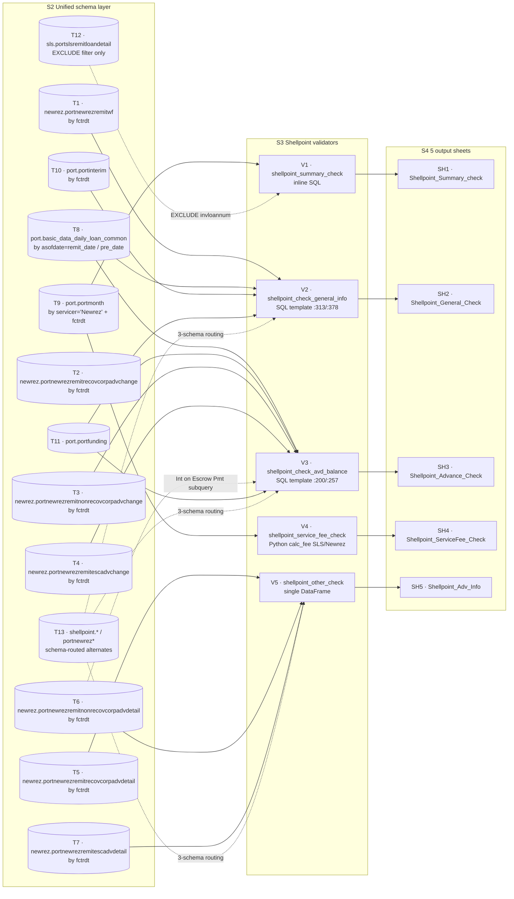

# 1.2.2 Shellpoint Chapter

> **Purpose**: Reverse-engineer, using source code as the single source of truth, the complete generation logic of the Shellpoint servicer in PrefectFlow `remit_validation` — how 5 validators turn upstream unified tables into 5 Excel sheets (`Shellpoint_Summary_check` / `Shellpoint_General_Check` / `Shellpoint_Advance_Check` / `Shellpoint_ServiceFee_Check` / `Shellpoint_Adv_Info`), along with the column-level field mapping and calculation formula for every output column.
>
> **Intended audience**: (1) PrefectFlow engineers maintaining the Shellpoint validators; (2) new engineers onboarding; (3) Stage 2 designers needing Shellpoint as a template; (4) business users cross-checking the 5 Shellpoint sheets.
>
> **Revision history**
>
> | Date | Author | Change |
> |---|---|---|
> | 2026-05-17 | Copilot CLI agent | v1.0 first release (zh/en bilingual): covers full generation logic + field mapping + dataflow branch + known pitfalls for all 5 sheets. |

---

## 1.2.2.1 Servicer overview

Shellpoint is a sub-brand of Newrez. In source code the servicer name often appears as `'Newrez'` (NOT `'Shellpoint'`) — this is the most common "semantic dislocation" pitfall when reading Shellpoint code: unified tables use the `newrez.*` prefix, `port.portmonth` filters by `servicer = 'Newrez'`, but sheet names / function names / DB class name all say Shellpoint.

| Validator function | Input data | Output sheet | Type |
|---|---|---|---|
| `shellpoint_summary_check` | `port.portmonth` (filter servicer='Newrez' + EXCLUDE SLS-derived) | `Shellpoint_Summary_check` | 1-row summary |
| `shellpoint_check_general_info` | SQL template `newrez_general_check` (joins remitwf / daily curr+pre / interim / funding) | `Shellpoint_General_Check` | 1 row per loan |
| `shellpoint_check_avd_balance` | SQL template `newrez_adv_validation` (joins daily pre/curr + 3 remit adv-change tables + adv-detail subquery + funding) | `Shellpoint_Advance_Check` | 1 row per loan |
| `shellpoint_service_fee_check` | `port.portmonth` + Python rule `calc_fee` (**2 branches: SLS / Newrez**) | `Shellpoint_ServiceFee_Check` | abnormal rows only |
| `shellpoint_other_check` | 3 adv-detail tables (recov / nonrecov / esc), curr + prev month | `Shellpoint_Adv_Info` | aggregated table (single DataFrame) |

Source locations:

- Flow entry block: `flow/remit_validation/remit_validation.py:94-104` (5 validator calls + 5 MAP key writes)
- DB layer: `flow/remit_validation/shellpoint_db.py:1-128`
- Validator layer: `flow/remit_validation/shellpoint_validation.py:1-280`
- SQL templates: `flow/remit_validation/servicer_validation_with_portdaily.py:200,257,313,378`
- Sheet column definitions: `util/gen_remit_validation_report.py:586-837`

`ShellpointDB.__init__` at `remit_validation.py:94` instantiates with the same 4 derived date / table-name variables as Carrington: `remit_date` / `pre_date` / `fctrdt` / `fctrdt_1m` (`shellpoint_db.py:9-13` + `flow/remit_validation/utils.py:get_fctrdt`). The `fctrdt = remit_date + 1 day` relationship also holds.

**Essential differences from Carrington (5 things to remember)**:

1. **5 sheets, not 6**: `shellpoint_other_check` returns a **single DataFrame** (not a 2-tuple), producing only `Shellpoint_Adv_Info`, **no Trans_Info** counterpart.
2. **3-schema routing**: every Shellpoint DB getter has **3 branches** (`to_mysql` / `to_new_redshift` / default legacy `shellpoint.*`), while Carrington has only 2 (`to_new_redshift` toggle). The MySQL path doesn't even carry a schema prefix (just `portnewrezpmt`).
3. **Service-fee rule has 2 branches**: `calc_fee` contains `if row['data_servicer'] == 'SLS': ... elif row['data_servicer'] == 'Newrez': ...` — some loans came from SLS ("SLS-derived") and still get charged at SLS rates (very similar to Carrington's rule); others (native Newrez) get charged via `delinq + svcpaymthist` (a completely different rule set).
4. **Reuses shared SQL templates**: general/adv use `newrez_general_check` / `newrez_adv_validation` (NOT templates named `shellpoint_*`) — because the same template may be reused by another servicer (see Selene chapter 1.2.5).
5. **summary explicitly excludes SLS-derived loans**: via subquery `loanid not in (select invloannum from sls.portslsremitloandetail where fctrdt = ...)`, preventing SLS-from loans from being double-counted in the Newrez summary.

---

## 1.2.2.2 Shellpoint dataflow branch



> Figure 1.2.2-1: End-to-end dataflow from Shellpoint's 7 `newrez.*` unified tables + 5 auxiliary tables → 5 validators → 5 sheets. Source: `shellpoint_db.py:1-128` + `shellpoint_validation.py:1-280` + `servicer_validation_with_portdaily.py:200-381`.

**Legend (node-ID naming convention):**

| Prefix | Meaning | Range in this figure | How it appears in the prose |
|---|---|---|---|
| `T#` | **T**able — upstream source table (unified / auxiliary) | `T1`–`T13` | Appears in the step-by-step text by its real table name, e.g. `port.portmonth`, `newrez.portnewrezremitwf` |
| `V#` | **V**alidator — Prefect `@task` validation function | `V1`–`V5` | `V1 = shellpoint_summary_check`, `V2 = shellpoint_check_general_info`, `V3 = shellpoint_advance_check`, `V4 = shellpoint_service_fee_check`, `V5 = shellpoint_other_check` |
| `SH#` | **SH**eet — final XLSX worksheet | `SH1`–`SH5` | `SH1 = Shellpoint_Summary_check`, `SH2 = Shellpoint_General_Check`, `SH3 = Shellpoint_Advance_Check`, `SH4 = Shellpoint_ServiceFee_Check`, `SH5 = Shellpoint_Adv_Info` |

Node IDs exist only as cross-references between the diagram and the prose; they are **not** identifiers in the source code. The real name of each node appears inside its box after `·` (e.g. `SH1 · Shellpoint_Summary_check`) and in the step-by-step explanation below.

**Step-by-step explanation (in validator call order):**

1. **summary**: `V1` pulls `port.portmonth WHERE servicer='Newrez' AND fctrdt=<fctrdt> AND loanid NOT IN (SLS subquery)`, computes `sum()` over `principalreceived / interestreceived / escrowadv_chg / corpadvrec_chg / corpadvnonrec_chg / servicefee / otherfees / subremit`, plus a derived column `totalservicefee = sum(servicefee+otherfees)` → outputs `SH1`. Source: `shellpoint_validation.py:14-40`.
2. **general**: `V2` uses a SQL template that joins `newrez.portnewrezremitwf` (by fctrdt) + `port.basic_data_daily_loan_common` (by asofdate = `<curr_month_end>`, i.e. remit_date) + same table (by `<pre_month_end>`, i.e. pre_date) + `port.portinterim` (by fctrdt + loanid) + `port.portfunding` → 1 row per loanid → `SH2`. Source: `shellpoint_validation.py:77-94` + `servicer_validation_with_portdaily.py:313-375`.
3. **adv**: `V3` uses a SQL template joining daily (p1 pre / p2 curr) + 3 remit `*_change` tables (recov / nonrecov / esc, all by fctrdt) + a subquery on `nonrecovcorpadvdetail` (taking `int_on_escrow` where `description = 'Int on Escrow Pmt'`) + funding → 1 row per loanid → `SH3`. Source: `shellpoint_validation.py:43-60` + `servicer_validation_with_portdaily.py:200-254`.
4. **service_fee**: `V4` does NOT use a SQL template. First pulls `port.portmonth` (through `get_port_month_data('Newrez')`), then in Python computes `calc_servicefee` via the dual-branch `calc_fee(row)` (SLS / Newrez), filters `servicefee != calc_servicefee`, and appends a `fee_difference = servicefee - calc_servicefee` column → `SH4`. Source: `shellpoint_validation.py:97-205`.
5. **other**: `V5` sequentially pulls the 3 adv-detail tables (recov / nonrecov / esc), groups each by `description` and computes `sum(transactionamt)`, adds a bucket column; then **temporarily mutates `shellpoint_db.fctrdt = fctrdt_1m`**, repeats for prev month, restores fctrdt; left-merges curr and prev on `(description, bucket)`, computes `amt_MoM = amt / amt_1m - 1` → `SH5` (single DataFrame, not a tuple). Source: `shellpoint_validation.py:226-265`.
6. **schema routing**: 3-way pick, priority `to_mysql > to_new_redshift > legacy`. MySQL templates use `mysql_newrez_*` names (no schema prefix); new Redshift uses `newrez.*` prefix; legacy Redshift uses `shellpoint.portshellpoint*` prefix. Production path runs `newrez.*`. Source: `shellpoint_db.py:17-128`.

Key takeaway: Shellpoint shares the "daily(pre/curr) + remit + funding" four-source join backbone with Carrington, but in the adv check it **explicitly splits** the 3 advance types (recov / nonrecov / esc) into separate join targets via their `*_change` tables (whereas Carrington uses `case when adv_bucket in (...)` in a subquery to split buckets). This reflects the fact that the Newrez vendor schema is more "bucket-cleanly partitioned" than Carrington's.

---

## 1.2.2.3 Per-sheet generation logic

### 1.2.2.3.1 Shellpoint_Summary_check (1-row summary)

**Basic info**

| Item | Value |
|---|---|
| Sheet name (XLSX literal) | `Shellpoint_Summary_check` (lowercase c) |
| Producing function | `shellpoint_summary_check` (`shellpoint_validation.py:14-40`) |
| Output row count | 1 |
| Header rows | 1 |
| Highlight column | none |

**Data sources + SQL**

inline SQL (no template reuse):

- main table `port.portmonth` — filter `servicer = 'Newrez' AND fctrdt = <shellpoint_db.fctrdt>`.
- **EXCLUDE subquery**: `AND loanid NOT IN (SELECT invloannum FROM sls.portslsremitloandetail WHERE fctrdt = <fctrdt>)` — deducts all SLS-derived loans from the Newrez summary.
- no join; pure aggregation.

**Field table (10 columns)**

| Output column | Source column | Calculation / Transform | Data type | Business meaning | Edge cases |
|---|---|---|---|---|---|
| `principalreceived` | `portmonth.principalreceived` | `sum(...)` | money | total principal collected (SLS-derived excluded) | empty SLS subquery → degenerates to plain servicer='Newrez' filter |
| `interestreceived` | `portmonth.interestreceived` | `sum(...)` | money | total interest collected | — |
| `escrowadvactivity` | `portmonth.escrowadv_chg` | `sum(escrowadv_chg)` | money | net escrow advance change | — |
| `corpadvrecactivity` | `portmonth.corpadvrec_chg` | `sum(corpadvrec_chg)` | money | net recov corp advance change | — |
| `corpadvnonrecactivity` | `portmonth.corpadvnonrec_chg` | `sum(corpadvnonrec_chg)` | money | net nonrecov corp advance change | — |
| `servicefee` | `portmonth.servicefee` | `sum(...)` | money | service fee | — |
| `otherfees` | `portmonth.otherfees` | `sum(...)` | money | other fees | — |
| `totalservicefee` | `portmonth.servicefee + portmonth.otherfees` | `sum(servicefee + otherfees)` | money | derived total | — |
| `totalremit` | `portmonth.subremit` | `sum(subremit)` | money | total sub-remit amount | column name is `subremit` not `totremit` (diff vs Carrington) |
| `asofdate` | assigned in Python layer | `data_df['asofdate'] = shellpoint_db.remit_date` | date | report's month-end | always = remit_date |

> Table 1.2.2-2: Shellpoint_Summary_check 10-column field mapping. Source: `shellpoint_validation.py:18-35` + `util/gen_remit_validation_report.py:586-603`.

**Validation rule**: pure display, no per-row pass/fail. `try/except Exception` backstop, on failure returns `None` → slot short-circuited.

**Known pitfalls**: (1) `servicer = 'Newrez'` (NOT `'Shellpoint'`) — business naming dislocation. (2) The SLS subquery above is the **only** EXCLUDE subquery across the 7 servicer summaries; it must be preserved to prevent SLS-derived loans being double-booked.

---

### 1.2.2.3.2 Shellpoint_General_Check (1 row per loan, ~24 sub-columns)

**Basic info**

| Item | Value |
|---|---|
| Sheet name | `Shellpoint_General_Check` |
| Producing function | `shellpoint_check_general_info` (`shellpoint_validation.py:77-94`) |
| Output row count | equal to the row count of `newrez.portnewrezremitwf` for the month (1 per loan) |
| Header rows | 2 (multi-level header) |
| Highlight column | **7 diff columns** (any nonzero triggers highlight) |
| SQL template | `newrez_general_check` (`servicer_validation_with_portdaily.py:313-375`) + MySQL twin `mysql_newrez_general_check` (`:378+`) |

**Data sources + join**

| Alias | Table | Filter / Join condition |
|---|---|---|
| `r` | `newrez.portnewrezremitwf` | `r.fctrdt = '<fctrdt>'` |
| `p` | `port.basic_data_daily_loan_common` | `r.loanid = p.loanid AND p.asofdate = '<curr_month_end>'` (= remit_date) |
| `p2` | `port.basic_data_daily_loan_common` (same table joined twice) | `r.loanid = p2.loanid AND p2.asofdate = '<pre_month_end>'` (= pre_date) |
| `i` | `port.portinterim` | left join, `r.loanid = i.loanid AND r.fctrdt = i.fctrdt` |
| `f` | `port.portfunding` | left join, `r.loanid = f.loanid` |

**SQL template substitution** (`shellpoint_validation.py:85-86`, 3 placeholders):

```python
sql.replace('input_fctrdt', str(shellpoint_db.fctrdt))
   .replace('input_curr_month_end', str(shellpoint_db.remit_date))
   .replace('input_pre_month_end', str(shellpoint_db.pre_date))
```

**Field table (selected highlights; full column list in `util/gen_remit_validation_report.py:604-722`)**

| Output column | Top-level group | Calculation | Data type | Business meaning |
|---|---|---|---|---|
| `loanid` / `shellpoint_ln` / `dealid` | ID | direct (`r.loanid` / `r.shellpoint_ln` / `f.dealid`) | str | ID group |
| `interim_flag` | ID | `case when i.principalreceived≠0 or i.interestreceived≠0 then 'Y' else 'N' end` | str | whether the loan had interim payments this month |
| `intrate_diff_remitvsdaily` | Interest Rate Diff | `r.net_int_rate - p.interest_rate` | float | **expected = 0** |
| `nextduedate_diff_remitvsdaily` | Next Due Date Diff | `case when p.nextduedate = r.borr_next_pay_due_date then 0 else 1` | int (0/1) | **expected = 0** (note: 0/1 flag, NOT a day count!) |
| `endbal_diff_remitvsdaily` | End Balance Diff | `endbal_remit - endbal_daily` = `r.actl_end_prin_bal - p.principalbalance` | money | **expected = 0** |
| `deferredprincipal_diff_remitvsdaily` | Deferred Principal Diff | `deferredprincipal_remit - deferredprincipal_daily` = `r.ending_non_interest_bearing_deferred_principal_bal - p.deferredprincipalbalance` | money | **expected = 0** |
| `deferredint_diff_remitvsdaily` | Deferred Interest Diff | `r.endingdeferredinterestbalance - p.deferredinterestbalance` | money | **expected = 0** |
| `pandi_diff_remitvsdaily` | P and I Diff | `pandi_remit - pandireceived_daily` where `pandi_remit = principal_remit + interest_remit + coalesce(i.principalreceived,0) + coalesce(i.interestreceived,0)`; `pandireceived_daily = p.principalpaidmtd + p.interestpaidmtd` | money | **expected = 0** |
| `prin_bal_diff_remit` | Principal Balance Difference in Remit | `begbal_remit - endbal_remit - principal_remit` = `r.actl_beg_prin_bal - r.actl_end_prin_bal - principal_remit` | money | remit internal consistency; **expected = 0** |
| `principal_remit` | Principal Balance Difference in Remit | `r.actl_prin_amt + serv_curt_amt_1+2+3 + pif_amt + non_interest_bearing_deferred_principal_curt_amt + non_interest_bearing_deferred_paid_in_full_amount` | money | total principal collected this month (incl. PIF + 3 servicer curtailments + 2 deferred terms) |
| `interest_remit` | (blank divider column) | `r.actl_net_int` | money | remit interest collected |
| `principalreceived_daily` | (blank divider column) | `p.principalpaidmtd` | money | daily principal collected |
| `interestreceived_daily` | (blank divider column) | `p.interestpaidmtd` | money | daily interest collected |
| `pandiexpected_daily` | (blank divider column) | `p.schedule_pandi_daily` | money | daily expected P&I |
| `pandi_calc` | (blank divider column) | `p.bal_prin_original / ((1-(1/(1+intrate_daily/1200)^p.originalterm))/(intrate_daily/1200))` | money | amortization-formula-derived P&I (vs schedule_pandi_daily) |
| `delinquency_status_mba` | (blank divider column) | `p.delq_status` | str | MBA delinquency stage |
| `pandi_paid_times_remit` | (blank divider column) | `pandi_remit / pandiexpected_daily` (div 0 → null) | float | remit P&I / expected P&I multiplier |
| `pandi_paid_times_daily` | (blank divider column) | `pandireceived_daily / pandiexpected_daily` (div 0 → null) | float | daily P&I / expected P&I multiplier |
| `deferredprincipal_chg_daily` | Principal Balance Difference in Remit | `p2.deferredprincipalbalance - p.deferredprincipalbalance` | money | daily-side deferred principal change (pre - curr) |
| `begbal_remit` / `endbal_in_remit` | Principal Balance Difference in Remit | direct | money | echo of begbal_remit / endbal_remit above |

> Table 1.2.2-3: Shellpoint_General_Check field mapping. Source: `servicer_validation_with_portdaily.py:313-375` + `util/gen_remit_validation_report.py:604-722`.

**Validation rule (7 diff columns, threshold = 0)**

```python
[intrate_diff_remitvsdaily, nextduedate_diff_remitvsdaily, endbal_diff_remitvsdaily,
 deferredprincipal_diff_remitvsdaily, deferredint_diff_remitvsdaily,
 pandi_diff_remitvsdaily, prin_bal_diff_remit]
```

Any ≠ 0 → cell is highlighted. No row filtering.

**Known pitfalls**: (1) `nextduedate_diff_remitvsdaily` is a 0/1 flag, NOT a day count — differs from Carrington (which uses day count). (2) `principal_remit` formula has **8 addends** (actl_prin + 3 serv_curt + pif + 2 deferred terms) — any column rename will silently break the reconciliation. (3) `pandi_remit` introduces a left join on `portinterim`: interim represents "money the vendor wired mid-month"; must be counted. The MySQL twin behaves the same here. (4) `pandi_calc` uses the amortization formula; if `intrate_daily = 0` it raises div-by-zero. Real data shouldn't have 0 rate but stay alert.

---

### 1.2.2.3.3 Shellpoint_Advance_Check (1 row per loan, ~25 sub-columns)

**Basic info**

| Item | Value |
|---|---|
| Sheet name | `Shellpoint_Advance_Check` |
| Producing function | `shellpoint_check_avd_balance` (`shellpoint_validation.py:43-60`) |
| Output row count | size of inner-joined daily p1×p2 + 3 remit *_change tables loan set |
| Header rows | 2 |
| Highlight column | **4 diff columns** |
| SQL template | `newrez_adv_validation` (`servicer_validation_with_portdaily.py:200-254`) + MySQL twin (`:257-310`) |

**Data sources + join**

| Alias | Table | Filter / Join condition |
|---|---|---|
| `p1` | `port.basic_data_daily_loan_common` | `asofdate = '<pre_month_end>'` |
| `p2` | `port.basic_data_daily_loan_common` | `asofdate = '<curr_month_end>'`, inner join on `p1.loanid = p2.loanid` |
| `r` | `newrez.portnewrezremitrecovcorpadvchange` | inner join, `r.fctrdt = '<fctrdt>'`, `p1.loanid = r.loanid` |
| `n` | `newrez.portnewrezremitnonrecovcorpadvchange` | inner join, `n.fctrdt = r.fctrdt`, `p1.loanid = n.loanid` |
| `e` | `newrez.portnewrezremitescadvchange` | inner join, `e.fctrdt = r.fctrdt`, `p1.loanid = e.loanid` |
| `e2` (subquery) | `newrez.portnewrezremitnonrecovcorpadvdetail` | left join, by loanid, `sum(transactionamt) WHERE description = 'Int on Escrow Pmt'` aliased as `int_on_escrow` |
| `f` | `port.portfunding` | left join on loanid |

**SQL template substitution** (`shellpoint_validation.py:51-53`, 3 placeholders):

```python
sql.replace('input_fctrdt', str(shellpoint_db.fctrdt))
   .replace('input_pre_month_end', str(shellpoint_db.pre_date))
   .replace('input_curr_month_end', str(shellpoint_db.remit_date))
```

**Field table (selected highlights; full column list in `util/gen_remit_validation_report.py:724-797`)**

Note: in Shellpoint's daily side `reccorpadvance` / `nonrecovadvance` columns are **uniformly multiplied by -1** (`-1 * coalesce(p1.reccorpadvance, 0) as reccorpadvance_prev_daily`), because the vendor records "receivable advance" as negative in the daily table; flipping it lets it match the sign of remit's `netchange`.

| Output column | Calculation (Redshift version with alias back-ref) | Data type | Business meaning |
|---|---|---|---|
| `loanid` / `shellpoint_ln` / `dealid` / `delq_status` | `p1.loanid` / `p1.svcloanid as shellpoint_ln` / `f.dealid` / `p1.delq_status` | str | ID group |
| `escrowadv_prev_daily` / `escrowadv_curr_daily` | `coalesce(p1/p2.escrow_advance_balance, 0)` | money | daily prev/curr escrow advance balance |
| `escrowadv_chg_daily` | `escrowadv_curr_daily - escrowadv_prev_daily` | money | daily-side escrow advance change |
| `reccorpadvance_prev_daily` / `_curr_daily` | `-1 * coalesce(p1/p2.reccorpadvance, 0)` | money | daily prev/curr recov corp adv (sign-flipped) |
| `thirdpartyrecovadv_prev_daily` / `_curr_daily` | `-1 * coalesce(p1/p2.nonrecovadvance, 0)` | money | daily prev/curr nonrecov (vendor naming: thirdparty) |
| `totalcorpadv_prev_daily` / `_curr_daily` | `recc_*_prev/curr + thirdparty_*_prev/curr` | money | daily prev/curr total corp adv |
| `reccorpadvance_chg_daily` | `reccorpadvance_curr_daily - reccorpadvance_prev_daily` | money | daily recov change |
| `thirdpartyrecovadv_chg_daily` | `thirdpartyrecovadv_curr_daily - thirdpartyrecovadv_prev_daily` | money | daily nonrecov change |
| `totalcorpadv_chg_daily` | `totalcorpadv_curr_daily - totalcorpadv_prev_daily` | money | daily total corp adv change |
| `reccorpadvance_remit` | `r.netchange` | money | remit-side recov net change |
| `nonrecovadvance_remit` | `n.netchange` | money | remit-side nonrecov net change |
| `escadv_remit` | `e.netchange` | money | remit-side esc adv net change |
| `totalcorpadvance_remit` | `reccorpadvance_remit + nonrecovadvance_remit` | money | remit-side total corp adv |
| `int_on_escrow` | `e2.int_on_escrow` (subquery) | money | escrow interest paid to mortgagor |
| `escadv_diff_remitvsdaily` | `escrowadv_chg_daily + escadv_remit` | money | escrow adv delta; **expected = 0** (note: sum, because vendor records them with opposite signs) |
| `recovcorpadv_diff_remitvsdaily` | `reccorpadvance_chg_daily + reccorpadvance_remit` | money | recov adv delta; **expected = 0** (also sum) |
| `nonrecovcorpadv_diff_remitvsdaily` | `thirdpartyrecovadv_chg_daily + nonrecovadvance_remit` | money | nonrecov adv delta; **expected = 0** |
| `totalcorpadv_diff_remitvsdaily` | `totalcorpadv_chg_daily + totalcorpadvance_remit` | money | total corp adv delta; **expected = 0** |

> Table 1.2.2-4: Shellpoint_Advance_Check field mapping (selected key columns). Source: `servicer_validation_with_portdaily.py:200-254` + `util/gen_remit_validation_report.py:724-797`.

**Validation rule (4 diff columns, threshold = 0)**

```python
[recovcorpadv_diff_remitvsdaily, nonrecovcorpadv_diff_remitvsdaily,
 totalcorpadv_diff_remitvsdaily, escadv_diff_remitvsdaily]
```

Any ≠ 0 → highlight.

**Known pitfalls**: (1) Shellpoint's diff formulas are all `daily_chg + remit_netchange` (sum), while Carrington's are `remit_chg - daily_chg` (subtraction) — because the vendor records advances as negative in the daily table (see the `-1 * coalesce(...)` flipping); after sign-normalization, the diff becomes a sum. Do NOT "correct" the sign even if it looks wrong. (2) The MySQL twin template inlines all alias back-references (MySQL select doesn't support alias back-ref), so expressions get very long, e.g. `(-1 * coalesce(p2.reccorpadvance, 0) -1 * coalesce(p2.nonrecovadvance, 0)) - ...`. (3) `int_on_escrow` comes from the `nonrecovcorpadvdetail` subquery filtered by literal `description = 'Int on Escrow Pmt'` — if the vendor renames this string the column silently becomes NULL.

---

### 1.2.2.3.4 Shellpoint_ServiceFee_Check (abnormal rows only, dual-branch rule)

**Basic info**

| Item | Value |
|---|---|
| Sheet name | `Shellpoint_ServiceFee_Check` |
| Producing function | `shellpoint_service_fee_check` (`shellpoint_validation.py:97-205`) |
| Output row count | only loans where `servicefee != calc_servicefee` (**filtered**) |
| Header rows | 1 |
| Highlight column | none |
| Compute mode | **Python rule with dual branch** (SLS / Newrez), not a SQL template |

**Data source**: `port.portmonth` via `shellpoint_db.get_port_month_data('Newrez')`, filtered by `fctrdt == shellpoint_db.fctrdt`.

**Core `calc_fee(row)` rule**

**Branch A: `data_servicer == 'SLS'`** (loans migrated from SLS, still charged at SLS rates, source: `shellpoint_validation.py:104-126`)

| Condition (evaluated in order) | base | Notes |
|---|---|---|
| `bankruptcy='Y' AND prevdelinq in ('C','D30','D60','D90','D120P')` | -60 | + additon_fee |
| `prevdelinq=='C'` | -10 | + additon_fee (**note: differs from Carrington's -9!**) |
| `prevdelinq=='D30'` | -25 | + additon_fee |
| `prevdelinq=='D60'` | -35 | + additon_fee |
| `prevdelinq in ('D90','D120P')` | -80 | + additon_fee |
| `prevdelinq=='FCL'` | -110 | + additon_fee |
| `prevdelinq=='REO'` | -35 | + additon_fee |
| otherwise | 0 | — |

`additon_fee` bumps are the same as Carrington: `agency in ('FHA','VA','USDA')` +1; `amorttype=='ARM'` +1. Final `calc_servicefee = base - additon_fee` (base is already negative; subtracting the bump makes the absolute value larger).

**Branch B: `data_servicer == 'Newrez'`** (native Newrez loans, uses `delinq` NOT `prevdelinq`, source: `shellpoint_validation.py:127-173`)

| Condition (evaluated in order) | base | additon_fee bump |
|---|---|---|
| `bankruptcy=='Y'` | -45 | **no additon** |
| `delinq=='C'` | -8.5 | + additon_fee (triggered by `svcpaymthist`, see below) |
| `delinq=='D30'` | -20 | no additon |
| `delinq=='D60'` | -50 | no additon |
| `delinq=='D90'` | -75 | no additon |
| `delinq=='D120P'` | -90 | no additon |
| `delinq=='FCL'` | -115 | no additon |
| `delinq=='REO'` | -35 | no additon |
| `delinq in ('P','D')` → sub-rule by prevdelinq | various -8.5/-20/-50/-75/-90/-115/-35 | only 'C' tier gets + additon_fee |
| otherwise | 0 | — |

**Newrez branch `additon_fee` rule** (only `svcpaymthist` triggers it, totally different from SLS branch):

```python
if row['svcpaymthist']:
    if len(row['svcpaymthist']) >= 7:
        if set(row['svcpaymthist'][:7]) - {'0', 'X'}:   # any non-0/X char in first 7
            additon_fee += 2
    else:
        if len(set(row['svcpaymthist'])) - {'0', 'X'}:
            additon_fee += 2
```

Meaning: check the recent 7 months (incl. current) of servicer payment history string; if any "non-0 and non-X" mark appears (i.e. any delinquency in the last 7 months), charge an extra $2 service fee. Original comment: `# less than 6 months clean pay`.

**Deprecated logic in comments** (do NOT revive):

In source code `if row['agency'] in ('FHA','VA')` / `if row['amorttype']=='ARM'` are commented out in the Newrez branch with the comment `# 从文档说明中会针对agency收费，通过实际数据验证并没有收费 -- 7727001282(VA)` — business used a specific VA loan to disprove that the vendor actually charges per the documentation.

**Field table (17 columns)**

| Output column | Source | Business meaning |
|---|---|---|
| `fctrdt` | `portmonth.fctrdt` | month partition |
| `loanid` | `portmonth.loanid` | internal loan id |
| `shellpoint_ln` | `portmonth.svcloanid` (rename) | servicer-side loan id |
| `dealid` | `portmonth.dealid` | asset pool id |
| `prevservicer` | `portmonth.data_servicer` (rename: `data_servicer → prevservicer`) | previous servicer ('SLS' / 'Newrez' / other) |
| `svcpaymthist` | `portmonth.svcpaymthist` | servicer payment history string (24-36 chars) |
| `paymthist` | `portmonth.paymthist` | main payment history string |
| `agency` | `portmonth.agency` | FHA/VA/USDA/conventional |
| `amorttype` | `portmonth.amorttype` | ARM/FIX |
| `delinq` / `prevdelinq` | `portmonth.*` | current / prev delinquency stage |
| `bankruptcy` | `portmonth.bankruptcy` | Y/N |
| `calc_servicefee` | Python `calc_fee(row)` | expected service fee |
| `servicefee` | `portmonth.servicefee` | actual servicefee booked |
| `fee_difference` | Python `servicefee - calc_servicefee` | delta (**Shellpoint-unique derived column**) |
| `nextduedate` | `portmonth.nextduedate` | next due date |
| `asofdate` | written in Python = `remit_date` | report date |

> Table 1.2.2-5: Shellpoint_ServiceFee_Check 17-column field mapping. Source: `shellpoint_validation.py:180-200` + `util/gen_remit_validation_report.py:799-823`.

**Validation rule**: Python filter `servicefee != calc_servicefee`; sheet shows only abnormal rows; no highlight columns; empty abnormal → slot short-circuited.

**Known pitfalls**: (1) **The SLS branch `prevdelinq='C'` is -10, NOT Carrington's -9** — Carrington and Shellpoint's "SLS branches" are structurally very similar but differ by $1. (2) The Newrez branch uses `delinq` (not `prevdelinq`) — "current month" vs "previous month" semantics. (3) The Newrez branch's `delinq in ('P','D')` falls back to `prevdelinq` for lookup, handling the special "paid off 'P' or 'D' this month" case. (4) `svcpaymthist[:7]` slice INCLUDES the current month → actually checks "last 7 months including current".

---

### 1.2.2.3.5 Shellpoint_Adv_Info (aggregated table, 3 buckets × curr vs prev month)

**Basic info**

| Item | Value |
|---|---|
| Sheet name | `Shellpoint_Adv_Info` |
| Producing function | `shellpoint_other_check` (`shellpoint_validation.py:226-265`) |
| Output row count | count of distinct `(description, bucket)` combinations across the 3 curr-month detail tables |
| Header rows | 1 |
| Highlight column | none |
| Return type | **single DataFrame** (not a tuple) |

**Data sources**

| Subset | Table | bucket label |
|---|---|---|
| non_re | `newrez.portnewrezremitnonrecovcorpadvdetail` (filter fctrdt) | `'nonrecovcorpadv'` |
| recov | `newrez.portnewrezremitrecovcorpadvdetail` (filter fctrdt) | `'recovcorpadv'` |
| escadv | `newrez.portnewrezremitescadvdetail` (filter fctrdt) | `'escadv'` |

**Python compute pipeline**

1. Curr month: pull each of the 3 detail tables (selecting only `description` + `transactionamt`), group by `description` summing `transactionamt as amt`, add `bucket` column; `pd.concat` into a single table; write `asofdate = remit_date`.
2. **Temporarily mutate fctrdt**: `orig_fctrdt = shellpoint_db.fctrdt; shellpoint_db.fctrdt = shellpoint_db.fctrdt_1m` — then repeat 3-table pull, rename agg col to `amt_1m`, `pd.concat` into `df_1m`. Finally `shellpoint_db.fctrdt = orig_fctrdt` to restore.
3. **Merge**: `pd.merge(df, df_1m, on=['description','bucket'], how='left')` — combinations not in prev month are NOT included.
4. **MoM**: `amt_MoM = amt / amt_1m - 1`.

**Field table (6 columns)**

| Output column | Source | Calculation | Data type | Business meaning |
|---|---|---|---|---|
| `description` | detail table `description` col | group key | str | text description (e.g. 'Property Tax', 'Int on Escrow Pmt') |
| `amt` | curr 3-table concat aggregate | `sum(transactionamt)` | money | curr-month total |
| `bucket` | assigned in Python | 'nonrecovcorpadv' / 'recovcorpadv' / 'escadv' | str | bucket label |
| `asofdate` | assigned in Python | `= remit_date` | date | report date |
| `amt_1m` | prev 3-table concat aggregate (after merge) | `sum(transactionamt)` of prev month | money | prev-month total |
| `amt_MoM` | Python formula | `amt / amt_1m - 1` | percentage | MoM change ratio |

> Table 1.2.2-6: Shellpoint_Adv_Info 6-column field mapping. Source: `shellpoint_validation.py:228-263` + `util/gen_remit_validation_report.py:824-836`.

**Validation rule**: none; pure display.

**Known pitfalls**: (1) Different schema vs Carrington Adv_Info: Shellpoint has only **3 key+value+bucket columns** while Carrington has a 3-dim key `(adv_bucket, adv_type, advance_description)` — so Shellpoint Adv_Info is coarser-grained. (2) The temp-mutate-fctrdt pattern is again single-thread-safe, not concurrency-safe. (3) `how='left'` → descriptions present in prev month but vanished this month do NOT appear, matching Carrington's behavior.

---

## 1.2.2.4 Cross-sheet field index

| Sheet | Field | Expected | Actual expression |
|---|---|---|---|
| Shellpoint_General_Check | `intrate_diff_remitvsdaily` | 0 | `r.net_int_rate - p.interest_rate` |
| Shellpoint_General_Check | `nextduedate_diff_remitvsdaily` | 0 (flag) | `case when p.nextduedate=r.borr_next_pay_due_date then 0 else 1 end` |
| Shellpoint_General_Check | `endbal_diff_remitvsdaily` | 0 | `r.actl_end_prin_bal - p.principalbalance` |
| Shellpoint_General_Check | `deferredprincipal_diff_remitvsdaily` | 0 | `r.ending_non_interest_bearing_deferred_principal_bal - p.deferredprincipalbalance` |
| Shellpoint_General_Check | `deferredint_diff_remitvsdaily` | 0 | `r.endingdeferredinterestbalance - p.deferredinterestbalance` |
| Shellpoint_General_Check | `pandi_diff_remitvsdaily` | 0 | `pandi_remit - (p.principalpaidmtd + p.interestpaidmtd)` |
| Shellpoint_General_Check | `prin_bal_diff_remit` | 0 | `r.actl_beg_prin_bal - r.actl_end_prin_bal - principal_remit` |
| Shellpoint_Advance_Check | `recovcorpadv_diff_remitvsdaily` | 0 | `reccorpadvance_chg_daily + r.netchange` |
| Shellpoint_Advance_Check | `nonrecovcorpadv_diff_remitvsdaily` | 0 | `thirdpartyrecovadv_chg_daily + n.netchange` |
| Shellpoint_Advance_Check | `totalcorpadv_diff_remitvsdaily` | 0 | `totalcorpadv_chg_daily + (r.netchange + n.netchange)` |
| Shellpoint_Advance_Check | `escadv_diff_remitvsdaily` | 0 | `escrowadv_chg_daily + e.netchange` |
| Shellpoint_ServiceFee_Check | (row-level) | `servicefee == calc_servicefee` | Python `calc_fee(row)` dual-branch |

> Table 1.2.2-7: All validation-class fields across Shellpoint's 5 sheets. Source: the per-sheet sections above.

---

## 1.2.2.5 Known pitfalls / historical decisions

1. **Servicer naming dislocation**: all SQL / `port.portmonth` uses `'Newrez'`, but sheet / function / db class all say Shellpoint.
2. **3-schema routing**: every db getter is 3-way pick `to_mysql > to_new_redshift > legacy shellpoint.*`; MySQL path table names have no schema prefix. Carrington has only 2 ways.
3. **summary explicitly EXCLUDEs SLS-derived loans**: `AND loanid NOT IN (SELECT invloannum FROM sls.portslsremitloandetail WHERE fctrdt=...)` — only one among the 7 servicer summaries doing this.
4. **adv check diff formula is a sum**: daily-side advance is already sign-flipped via -1, so `daily_chg + remit_netchange = 0` means reconciled. Do NOT change `+` to `-`.
5. **`shellpoint_other_check` returns a single DataFrame**: unlike Carrington's 2-tuple, **produces only 1 sheet** (Adv_Info). That's why Shellpoint has "5 sheets".
6. **`calc_fee` dual branch**: SLS branch uses `prevdelinq` + agency/ARM bumps; Newrez branch uses `delinq` (or falls back to `prevdelinq` when `'P'/'D'`) + `svcpaymthist` last-7-month bump. SLS branch `prevdelinq='C'` is -10, differing from Carrington's -9 by $1.
7. **`pandi_calc` amortization formula**: `bal_prin_original / ((1-(1/(1+i/1200)^N))/(i/1200))` — raises div-by-zero if `intrate_daily=0`.
8. **`int_on_escrow` literal match**: depends on `description = 'Int on Escrow Pmt'` literal; vendor rename will silently break.
9. **`pandi_remit` MUST include interim**: `+ coalesce(i.principalreceived,0) + coalesce(i.interestreceived,0)` cannot be omitted.
10. **`other_check` temporarily mutates fctrdt**: single-thread safe; same as Carrington.
11. **Half of `shellpoint_db.py`'s getters are NOT called by the current validators** (`get_daily_mt` / `get_daily_general` / `get_reco_corp_adv_change` / `get_non_corp_adv_change` / `get_esc_adv_change` / `get_remit_wf`) — these look like "reserved for later or external scripts"; **do NOT clean them up as dead code** until you've traced cross-repo usage.

---

## 1.2.2.6 Source citation index

| Node | File | Lines |
|---|---|---|
| Shellpoint block in flow | `remit_validation.py` | `94-104` |
| `ShellpointDB` class | `shellpoint_db.py` | `8-128` |
| `ShellpointDB.__init__` | `shellpoint_db.py` | `9-15` |
| `get_daily_mt` | `shellpoint_db.py` | `17-30` |
| `get_daily_general` | `shellpoint_db.py` | `32-45` |
| `get_reco_corp_adv_change` | `shellpoint_db.py` | `47-57` |
| `get_non_corp_adv_change` | `shellpoint_db.py` | `59-68` |
| `get_esc_adv_change` | `shellpoint_db.py` | `70-80` |
| `get_remit_wf` | `shellpoint_db.py` | `82-92` |
| `get_nonrecovcorpadvdetail` | `shellpoint_db.py` | `94-104` |
| `get_recov_corpa` | `shellpoint_db.py` | `106-116` |
| `get_escadvdetail` | `shellpoint_db.py` | `118-128` |
| `shellpoint_summary_check` | `shellpoint_validation.py` | `14-40` |
| `shellpoint_check_avd_balance` | `shellpoint_validation.py` | `43-60` |
| `shellpoint_check_general_info` | `shellpoint_validation.py` | `77-94` |
| `shellpoint_service_fee_check` | `shellpoint_validation.py` | `97-205` |
| `shellpoint_service_fee_check` SLS branch | `shellpoint_validation.py` | `104-126` |
| `shellpoint_service_fee_check` Newrez branch | `shellpoint_validation.py` | `127-173` |
| `shellpoint_other_check` | `shellpoint_validation.py` | `226-265` |
| SQL template `newrez_adv_validation` | `servicer_validation_with_portdaily.py` | `200-254` |
| SQL template `mysql_newrez_adv_validation` | `servicer_validation_with_portdaily.py` | `257-310` |
| SQL template `newrez_general_check` | `servicer_validation_with_portdaily.py` | `313-375` |
| SQL template `mysql_newrez_general_check` | `servicer_validation_with_portdaily.py` | `378-440` |
| Shellpoint_Summary_check sheet columns | `util/gen_remit_validation_report.py` | `586-603` |
| Shellpoint_General_Check sheet columns | `util/gen_remit_validation_report.py` | `604-723` |
| Shellpoint_Advance_Check sheet columns | `util/gen_remit_validation_report.py` | `724-798` |
| Shellpoint_ServiceFee_Check sheet columns | `util/gen_remit_validation_report.py` | `799-823` |
| Shellpoint_Adv_Info sheet columns | `util/gen_remit_validation_report.py` | `824-837` |

> Table 1.2.2-8: All source citations referenced in this chapter.
