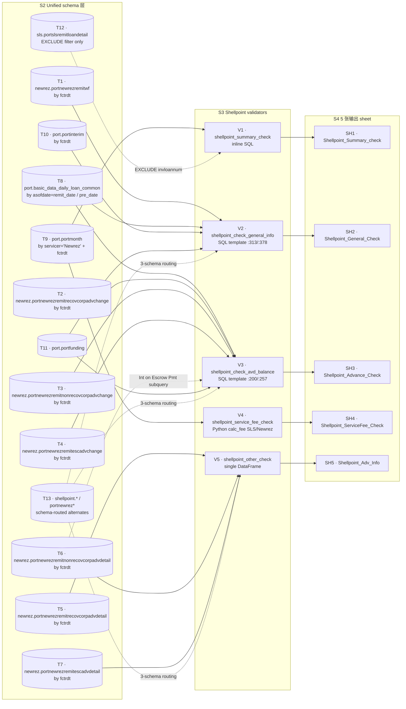

# 1.2.2 Shellpoint 章节（Shellpoint Chapter）

> **Purpose / 目的**：以源码为唯一事实来源，反推 PrefectFlow `remit_validation` 中 Shellpoint servicer 的全部生成逻辑 —— 5 个 validator 如何把上游 unified 表算成 5 张 Excel sheet（`Shellpoint_Summary_check` / `Shellpoint_General_Check` / `Shellpoint_Advance_Check` / `Shellpoint_ServiceFee_Check` / `Shellpoint_Adv_Info`），以及每一列的字段映射与计算公式。
>
> **Intended audience / 目标读者**：(1) 维护 Shellpoint validator 的 PrefectFlow 工程师；(2) Onboarding 新工程师；(3) Stage 2 设计阶段需要 Shellpoint 模板的设计者；(4) 业务方对照 Shellpoint 5 张 sheet 时的参考。
>
> **Revision history / 版本历史**
>
> | 日期 / Date | 作者 / Author | 变更 / Change |
> |---|---|---|
> | 2026-05-17 | Copilot CLI agent | v1.0 首版（中英双份）：覆盖 5 张 sheet 的完整生成逻辑 + 字段映射 + 数据流分支 + 已知坑。 |

---

## 1.2.2.1 Servicer overview / Servicer 概览

Shellpoint 是 Newrez 旗下的 sub-brand，在源码里 servicer 名常常出现为 `'Newrez'`（不是 `'Shellpoint'`）—— 这是阅读 Shellpoint 代码时最常踩的"语义错位"坑：unified table 用 `newrez.*` 前缀，`port.portmonth` 用 `servicer = 'Newrez'` 过滤，但 sheet name / function name / DB class name 都叫 Shellpoint。

| Validator 函数 | 输入数据 | 输出 sheet | 类型 |
|---|---|---|---|
| `shellpoint_summary_check` | `port.portmonth`（filter servicer='Newrez' + 排除 SLS 子集） | `Shellpoint_Summary_check` | 汇总 1 行 |
| `shellpoint_check_general_info` | SQL 模板 `newrez_general_check`（合 remitwf / daily curr+pre / interim / funding） | `Shellpoint_General_Check` | 每 loan 1 行 |
| `shellpoint_check_avd_balance` | SQL 模板 `newrez_adv_validation`（合 daily pre/curr + remit 3 个 adv-change 表 + adv-detail 子查询 + funding） | `Shellpoint_Advance_Check` | 每 loan 1 行 |
| `shellpoint_service_fee_check` | `port.portmonth` + Python 规则 `calc_fee`（**2 分支：SLS / Newrez**） | `Shellpoint_ServiceFee_Check` | 仅异常行 |
| `shellpoint_other_check` | 3 张 adv-detail 表（recov / nonrecov / esc），当月 + 上月 | `Shellpoint_Adv_Info` | 聚合表（单 DataFrame） |

源码定位：

- Flow 入口段：`flow/remit_validation/remit_validation.py:94-104`（5 个 validator 调用 + 5 个 MAP key 写入）
- DB 层：`flow/remit_validation/shellpoint_db.py:1-128`
- Validator 层：`flow/remit_validation/shellpoint_validation.py:1-280`
- SQL 模板：`flow/remit_validation/servicer_validation_with_portdaily.py:200,257,313,378`
- Sheet 列配置：`util/gen_remit_validation_report.py:586-837`

`ShellpointDB.__init__` 在 `remit_validation.py:94` 实例化时同样计算 4 个派生日期 / 表名变量（与 Carrington 完全相同）：`remit_date` / `pre_date` / `fctrdt` / `fctrdt_1m`（`shellpoint_db.py:9-13` + `flow/remit_validation/utils.py:get_fctrdt`）。`fctrdt = remit_date + 1 day` 这一关系也成立。

**与 Carrington 的本质差异（5 处必须记住）**：

1. **5 张 sheet 而非 6 张**：`shellpoint_other_check` 返回**单个 DataFrame**（不是 2-tuple），只产生 `Shellpoint_Adv_Info`，**没有 Trans_Info** 对应 sheet。
2. **3-schema 路由**：`shellpoint_db` 的每个 table getter 都有 **3 个分支**（`to_mysql` / `to_new_redshift` / 默认 legacy `shellpoint.*`），而 Carrington 只有 2 个分支（`to_new_redshift` 开关）。MySQL 路径甚至不带 schema 前缀（直接 `portnewrezpmt`）。
3. **服务费规则是双分支**：`calc_fee` 函数内 `if row['data_servicer'] == 'SLS': ... elif row['data_servicer'] == 'Newrez': ...` —— 因为部分 loan 是从 SLS 转过来的（"SLS-derived"），仍按 SLS 的费率收（与 Carrington 规则非常类似）；其余 native Newrez loan 按 `delinq + svcpaymthist` 规则收（与 Carrington 完全不同的规则集）。
4. **复用共享 SQL 模板**：general/adv 用的是 `newrez_general_check` / `newrez_adv_validation`（不是 `shellpoint_*` 名字的模板）—— 因为同一份模板可能被另一个 servicer 也复用（参考 1.2.5 Selene 章节）。
5. **summary 中显式排除 SLS-derived loan**：通过子查询 `loanid not in (select invloannum from sls.portslsremitloandetail where fctrdt = ...)`，防止 SLS-from 的 loan 在 Newrez summary 里重复计入。

---

## 1.2.2.2 Shellpoint 数据流分支（Shellpoint dataflow branch）



> 图 1.2.2-1：Shellpoint 7 张 newrez.* unified 表 + 5 张辅助表 → 5 个 validator → 5 张 sheet 的端到端数据流。Source：`shellpoint_db.py:1-128` + `shellpoint_validation.py:1-280` + `servicer_validation_with_portdaily.py:200-381`。

**图例（节点 ID 命名约定）：**

| 前缀 | 含义 | 在本图中的范围 | 在正文中出现的方式 |
|---|---|---|---|
| `T#` | **T**able — 上游源表（unified / 辅助表） | `T1`–`T13` | 在「逐步说明」里以 `port.portmonth`、`newrez.portnewrezremitwf` 等真实表名出现 |
| `V#` | **V**alidator — Prefect `@task` 校验函数 | `V1`–`V5` | `V1 = shellpoint_summary_check`，`V2 = shellpoint_check_general_info`，`V3 = shellpoint_advance_check`，`V4 = shellpoint_service_fee_check`，`V5 = shellpoint_other_check` |
| `SH#` | **SH**eet — 最终 XLSX 工作表 | `SH1`–`SH5` | `SH1 = Shellpoint_Summary_check`，`SH2 = Shellpoint_General_Check`，`SH3 = Shellpoint_Advance_Check`，`SH4 = Shellpoint_ServiceFee_Check`，`SH5 = Shellpoint_Adv_Info` |

节点 ID 仅用于图与正文之间的交叉引用，**不是**源码里的标识符；源码里的真实名字写在每个节点框内 `·` 之后（例如 `SH1 · Shellpoint_Summary_check`）以及下方「逐步说明」中。

**逐步说明（按 validator 调用顺序）：**

1. **summary**：`V1` 拉 `port.portmonth WHERE servicer='Newrez' AND fctrdt=<fctrdt> AND loanid NOT IN (SLS 子查询)`，对 `principalreceived / interestreceived / escrowadv_chg / corpadvrec_chg / corpadvnonrec_chg / servicefee / otherfees / subremit` 等做 `sum()`，外加一个派生列 `totalservicefee = sum(servicefee+otherfees)` → 输出 `SH1`。源码：`shellpoint_validation.py:14-40`。
2. **general**：`V2` 用 SQL 模板把 `newrez.portnewrezremitwf`（按 fctrdt）+ `port.basic_data_daily_loan_common`（按 asofdate = `<curr_month_end>`，即 remit_date）+ 同表（按 `<pre_month_end>`，即 pre_date）+ `port.portinterim`（按 fctrdt + loanid）+ `port.portfunding` join 在一起 → 每个 loanid 输出 1 行 → `SH2`。源码：`shellpoint_validation.py:77-94` + `servicer_validation_with_portdaily.py:313-375`。
3. **adv**：`V3` 用 SQL 模板把 daily（p1 pre / p2 curr）+ 3 张 remit `*_change` 表（recov / nonrecov / esc，皆按 fctrdt）+ `nonrecovcorpadvdetail` 的子查询（取 `description = 'Int on Escrow Pmt'` 的 `int_on_escrow`）+ funding join → 每 loanid 输出 1 行 → `SH3`。源码：`shellpoint_validation.py:43-60` + `servicer_validation_with_portdaily.py:200-254`。
4. **service_fee**：`V4` 不走 SQL 模板。先拉 `port.portmonth`（through `get_port_month_data('Newrez')`），再在 Python 里按 `calc_fee(row)` 双分支（SLS / Newrez）算 `calc_servicefee`，过滤 `servicefee != calc_servicefee` 后追加 `fee_difference = servicefee - calc_servicefee` 列 → `SH4`。源码：`shellpoint_validation.py:97-205`。
5. **other**：`V5` 顺序拉 3 张 adv-detail 表（recov / nonrecov / esc），每张按 `description` group by 求 `sum(transactionamt)`，加 bucket 列；再**临时改 `shellpoint_db.fctrdt = fctrdt_1m`** 重复一遍取上月，最后恢复 fctrdt；按 `(description, bucket)` left merge curr 和 prev，算 `amt_MoM = amt / amt_1m - 1` → `SH5`（单 DataFrame，不是 tuple）。源码：`shellpoint_validation.py:226-265`。
6. **schema 路由**：3 选 1。优先级 `to_mysql > to_new_redshift > legacy`。MySQL 模板用 `mysql_newrez_*` 表名（无 schema 前缀）；new Redshift 用 `newrez.*` 前缀；legacy Redshift 用 `shellpoint.portshellpoint*` 前缀。生产路径走 `newrez.*`。源码：`shellpoint_db.py:17-128`。

要点：Shellpoint 与 Carrington 共享"daily(pre/curr) + remit + funding"四源合并骨架，但 adv check 部分把 3 类 advance（recov / nonrecov / esc）的 *_change 表**显式拆开** join（而 Carrington 用 `case when adv_bucket in (...)` 在子查询里拆 bucket），这是 Newrez vendor 侧 schema 比 Carrington 更"分桶清晰"的反映。

---

## 1.2.2.3 5 张 sheet 详细生成逻辑（per-sheet logic）

### 1.2.2.3.1 Shellpoint_Summary_check（1 行汇总）

**基本信息**

| 项 | 值 |
|---|---|
| Sheet name（XLSX 原名） | `Shellpoint_Summary_check`（小写 c） |
| 生成函数 | `shellpoint_summary_check`（`shellpoint_validation.py:14-40`） |
| 输出行数 | 1 行 |
| Header row 数 | 1 |
| Highlight column | 无 |

**数据源 + SQL**

inline SQL（无模板复用）：

- 主表 `port.portmonth` —— 过滤 `servicer = 'Newrez' AND fctrdt = <shellpoint_db.fctrdt>`。
- **EXCLUDE 子查询**：`AND loanid NOT IN (SELECT invloannum FROM sls.portslsremitloandetail WHERE fctrdt = <fctrdt>)` —— 把当月 SLS-derived loan 全部从 Newrez summary 中扣除。
- 无 join；纯聚合。

**字段表（10 列）**

| 输出列 | 来源 / 源列 | 计算 / Transform | 数据类型 | 业务含义 | 边界 / 边界 case |
|---|---|---|---|---|---|
| `principalreceived` | `portmonth.principalreceived` | `sum(...)` | money | 当月本金回收（剔除 SLS-derived） | SLS 子查询为空 → 退化为 servicer='Newrez' 单条件 |
| `interestreceived` | `portmonth.interestreceived` | `sum(...)` | money | 当月利息回收 | — |
| `escrowadvactivity` | `portmonth.escrowadv_chg` | `sum(escrowadv_chg)` | money | escrow advance 净变动 | — |
| `corpadvrecactivity` | `portmonth.corpadvrec_chg` | `sum(corpadvrec_chg)` | money | recov corp advance 净变动 | — |
| `corpadvnonrecactivity` | `portmonth.corpadvnonrec_chg` | `sum(corpadvnonrec_chg)` | money | nonrecov corp advance 净变动 | — |
| `servicefee` | `portmonth.servicefee` | `sum(...)` | money | 服务费 | — |
| `otherfees` | `portmonth.otherfees` | `sum(...)` | money | 其它费用 | — |
| `totalservicefee` | `portmonth.servicefee + portmonth.otherfees` | `sum(servicefee + otherfees)` | money | 派生：合计 | — |
| `totalremit` | `portmonth.subremit` | `sum(subremit)` | money | 总 sub-remit 金额 | 列名是 `subremit` 不是 `totremit`（与 Carrington 差异） |
| `asofdate` | Python 层赋值 | `data_df['asofdate'] = shellpoint_db.remit_date` | date | 报表所属月末 | 永远 = remit_date |

> 表 1.2.2-2：Shellpoint_Summary_check 10 列字段映射。Source：`shellpoint_validation.py:18-35` + `util/gen_remit_validation_report.py:586-603`。

**校验规则**：纯展示，无行级 pass/fail。`try/except Exception` 兜底，失败返回 `None` → slot 短路。

**已知坑**：(1) `servicer = 'Newrez'`（不是 `'Shellpoint'`）—— 业务命名错位。(2) 上面提到的 SLS 子查询是 7 个 servicer 的 summary 中**唯一**带 EXCLUDE 子查询的，目的是防 SLS-derived loan 重复入账，必须保持。

---

### 1.2.2.3.2 Shellpoint_General_Check（每 loan 1 行，~24 sub-columns）

**基本信息**

| 项 | 值 |
|---|---|
| Sheet name | `Shellpoint_General_Check` |
| 生成函数 | `shellpoint_check_general_info`（`shellpoint_validation.py:77-94`） |
| 输出行数 | 等于 `newrez.portnewrezremitwf` 当月行数（每 loan 1 行） |
| Header row 数 | 2（多级表头） |
| Highlight column | **7 列 diff**（任一非 0 触发高亮） |
| SQL 模板 | `newrez_general_check`（`servicer_validation_with_portdaily.py:313-375`）+ MySQL 孪生 `mysql_newrez_general_check`（`:378+`） |

**数据源 + Join**

| 别名 | 表 | 过滤 / Join 条件 |
|---|---|---|
| `r` | `newrez.portnewrezremitwf` | `r.fctrdt = '<fctrdt>'` |
| `p` | `port.basic_data_daily_loan_common` | `r.loanid = p.loanid AND p.asofdate = '<curr_month_end>'`（= remit_date） |
| `p2` | `port.basic_data_daily_loan_common`（同表二次 join） | `r.loanid = p2.loanid AND p2.asofdate = '<pre_month_end>'`（= pre_date） |
| `i` | `port.portinterim` | left join，`r.loanid = i.loanid AND r.fctrdt = i.fctrdt` |
| `f` | `port.portfunding` | left join，`r.loanid = f.loanid` |

**SQL 模板替换**（`shellpoint_validation.py:85-86`，3 个占位）：

```python
sql.replace('input_fctrdt', str(shellpoint_db.fctrdt))
   .replace('input_curr_month_end', str(shellpoint_db.remit_date))
   .replace('input_pre_month_end', str(shellpoint_db.pre_date))
```

**字段表（精选；完整列见 `util/gen_remit_validation_report.py:604-722`）**

| 输出列 | 顶层分组 | 计算 | 数据类型 | 业务含义 |
|---|---|---|---|---|
| `loanid` / `shellpoint_ln` / `dealid` | ID | direct（`r.loanid` / `r.shellpoint_ln` / `f.dealid`） | str | ID 组 |
| `interim_flag` | ID | `case when i.principalreceived≠0 or i.interestreceived≠0 then 'Y' else 'N' end` | str | 是否当月有 interim 付款 |
| `intrate_diff_remitvsdaily` | Interest Rate Diff | `r.net_int_rate - p.interest_rate` | float | **期望 = 0** |
| `nextduedate_diff_remitvsdaily` | Next Due Date Diff | `case when p.nextduedate = r.borr_next_pay_due_date then 0 else 1` | int (0/1) | **期望 = 0**（注意是 0/1 标志，不是天数差！）|
| `endbal_diff_remitvsdaily` | End Balance Diff | `endbal_remit - endbal_daily` = `r.actl_end_prin_bal - p.principalbalance` | money | **期望 = 0** |
| `deferredprincipal_diff_remitvsdaily` | Deferred Principal Diff | `deferredprincipal_remit - deferredprincipal_daily` = `r.ending_non_interest_bearing_deferred_principal_bal - p.deferredprincipalbalance` | money | **期望 = 0** |
| `deferredint_diff_remitvsdaily` | Deferred Interest Diff | `r.endingdeferredinterestbalance - p.deferredinterestbalance` | money | **期望 = 0** |
| `pandi_diff_remitvsdaily` | P and I Diff | `pandi_remit - pandireceived_daily` 其中 `pandi_remit = principal_remit + interest_remit + coalesce(i.principalreceived,0) + coalesce(i.interestreceived,0)`；`pandireceived_daily = p.principalpaidmtd + p.interestpaidmtd` | money | **期望 = 0** |
| `prin_bal_diff_remit` | Principal Balance Difference in Remit | `begbal_remit - endbal_remit - principal_remit` = `r.actl_beg_prin_bal - r.actl_end_prin_bal - principal_remit` | money | Remit 内部一致性；**期望 = 0** |
| `principal_remit` | Principal Balance Difference in Remit | `r.actl_prin_amt + serv_curt_amt_1+2+3 + pif_amt + non_interest_bearing_deferred_principal_curt_amt + non_interest_bearing_deferred_paid_in_full_amount` | money | 本月本金回收总和（包含 PIF + 3 段服务商 curtailment + 2 段 deferred） |
| `interest_remit` | （空列分隔） | `r.actl_net_int` | money | Remit 利息收入 |
| `principalreceived_daily` | （空列分隔） | `p.principalpaidmtd` | money | Daily 本金回收 |
| `interestreceived_daily` | （空列分隔） | `p.interestpaidmtd` | money | Daily 利息回收 |
| `pandiexpected_daily` | （空列分隔） | `p.schedule_pandi_daily` | money | Daily 预期 P&I |
| `pandi_calc` | （空列分隔） | `p.bal_prin_original / ((1-(1/(1+intrate_daily/1200)^p.originalterm))/(intrate_daily/1200))` | money | 摊销公式反算 P&I（用于对比 schedule_pandi_daily） |
| `delinquency_status_mba` | （空列分隔） | `p.delq_status` | str | MBA 违约阶段 |
| `pandi_paid_times_remit` | （空列分隔） | `pandi_remit / pandiexpected_daily`（除 0 → null） | float | Remit P&I / 预期 P&I 倍数 |
| `pandi_paid_times_daily` | （空列分隔） | `pandireceived_daily / pandiexpected_daily`（除 0 → null） | float | Daily P&I / 预期 P&I 倍数 |
| `deferredprincipal_chg_daily` | Principal Balance Difference in Remit | `p2.deferredprincipalbalance - p.deferredprincipalbalance` | money | Daily 侧 deferred principal 变动（pre - curr） |
| `begbal_remit` / `endbal_in_remit` | Principal Balance Difference in Remit | direct | money | 上文 begbal_remit / endbal_remit 的回显 |

> 表 1.2.2-3：Shellpoint_General_Check 字段映射。Source：`servicer_validation_with_portdaily.py:313-375` + `util/gen_remit_validation_report.py:604-722`。

**校验规则（7 列 diff，threshold = 0）**

```python
[intrate_diff_remitvsdaily, nextduedate_diff_remitvsdaily, endbal_diff_remitvsdaily,
 deferredprincipal_diff_remitvsdaily, deferredint_diff_remitvsdaily,
 pandi_diff_remitvsdaily, prin_bal_diff_remit]
```

任一 ≠ 0 → 高亮 cell。不过滤行。

**已知坑**：(1) `nextduedate_diff_remitvsdaily` 是 0/1 flag 而不是天数差 —— 与 Carrington（按天数差）不同。(2) `principal_remit` 公式有 **8 个加数**（actl_prin + 3 段 serv_curt + pif + 2 段 deferred）—— 任一字段命名变动会破坏对账。(3) `pandi_remit` 引入 `portinterim` 表的 left join：interim 表代表"vendor 在月中临时打来的钱"，必须算入；MySQL 孪生模板里此处行为一致。(4) `pandi_calc` 用摊销公式反算，若 `intrate_daily = 0` 会除 0 报错 —— 真实数据中应该不会出现 0 利率但要警惕。

---

### 1.2.2.3.3 Shellpoint_Advance_Check（每 loan 1 行，~25 sub-columns）

**基本信息**

| 项 | 值 |
|---|---|
| Sheet name | `Shellpoint_Advance_Check` |
| 生成函数 | `shellpoint_check_avd_balance`（`shellpoint_validation.py:43-60`） |
| 输出行数 | 等于 inner join 的 daily p1×p2 + 3 张 remit *_change 表的 loan 集合 |
| Header row 数 | 2 |
| Highlight column | **4 列 diff** |
| SQL 模板 | `newrez_adv_validation`（`servicer_validation_with_portdaily.py:200-254`）+ MySQL 孪生（`:257-310`） |

**数据源 + Join**

| 别名 | 表 | 过滤 / Join 条件 |
|---|---|---|
| `p1` | `port.basic_data_daily_loan_common` | `asofdate = '<pre_month_end>'` |
| `p2` | `port.basic_data_daily_loan_common` | `asofdate = '<curr_month_end>'`，inner join on `p1.loanid = p2.loanid` |
| `r` | `newrez.portnewrezremitrecovcorpadvchange` | inner join，`r.fctrdt = '<fctrdt>'`，`p1.loanid = r.loanid` |
| `n` | `newrez.portnewrezremitnonrecovcorpadvchange` | inner join，`n.fctrdt = r.fctrdt`，`p1.loanid = n.loanid` |
| `e` | `newrez.portnewrezremitescadvchange` | inner join，`e.fctrdt = r.fctrdt`，`p1.loanid = e.loanid` |
| `e2`（子查询） | `newrez.portnewrezremitnonrecovcorpadvdetail` | left join，按 loanid 求 `sum(transactionamt) WHERE description = 'Int on Escrow Pmt'`，取 `int_on_escrow` |
| `f` | `port.portfunding` | left join on loanid |

**SQL 模板替换**（`shellpoint_validation.py:51-53`，3 个占位）：

```python
sql.replace('input_fctrdt', str(shellpoint_db.fctrdt))
   .replace('input_pre_month_end', str(shellpoint_db.pre_date))
   .replace('input_curr_month_end', str(shellpoint_db.remit_date))
```

**字段表（精选；完整列见 `util/gen_remit_validation_report.py:724-797`）**

注意：Shellpoint 的 daily 侧 reccorpadvance / nonrecovadvance 列在 SQL 里被**统一乘 -1**（`-1 * coalesce(p1.reccorpadvance, 0) as reccorpadvance_prev_daily`），因为 vendor 侧 daily 表把"应收 advance"记成负数，需要翻转才能跟 remit 的 netchange 同号比较。

| 输出列 | 计算（Redshift 版本，含 alias 反向引用） | 数据类型 | 业务含义 |
|---|---|---|---|
| `loanid` / `shellpoint_ln` / `dealid` / `delq_status` | `p1.loanid` / `p1.svcloanid as shellpoint_ln` / `f.dealid` / `p1.delq_status` | str | ID 组 |
| `escrowadv_prev_daily` / `escrowadv_curr_daily` | `coalesce(p1/p2.escrow_advance_balance, 0)` | money | Daily 上/当月末 escrow advance 余额 |
| `escrowadv_chg_daily` | `escrowadv_curr_daily - escrowadv_prev_daily` | money | Daily 侧 escrow advance 变动 |
| `reccorpadvance_prev_daily` / `_curr_daily` | `-1 * coalesce(p1/p2.reccorpadvance, 0)` | money | Daily 上/当月末 recov corp adv（已翻号） |
| `thirdpartyrecovadv_prev_daily` / `_curr_daily` | `-1 * coalesce(p1/p2.nonrecovadvance, 0)` | money | Daily 上/当月末 nonrecov（vendor 命名为 thirdparty）|
| `totalcorpadv_prev_daily` / `_curr_daily` | `recc_*_prev/curr + thirdparty_*_prev/curr` | money | Daily 上/当月末总 corp adv |
| `reccorpadvance_chg_daily` | `reccorpadvance_curr_daily - reccorpadvance_prev_daily` | money | Daily recov 变动 |
| `thirdpartyrecovadv_chg_daily` | `thirdpartyrecovadv_curr_daily - thirdpartyrecovadv_prev_daily` | money | Daily nonrecov 变动 |
| `totalcorpadv_chg_daily` | `totalcorpadv_curr_daily - totalcorpadv_prev_daily` | money | Daily 总 corp adv 变动 |
| `reccorpadvance_remit` | `r.netchange` | money | Remit 侧 recov 净变动 |
| `nonrecovadvance_remit` | `n.netchange` | money | Remit 侧 nonrecov 净变动 |
| `escadv_remit` | `e.netchange` | money | Remit 侧 esc adv 净变动 |
| `totalcorpadvance_remit` | `reccorpadvance_remit + nonrecovadvance_remit` | money | Remit 侧总 corp adv |
| `int_on_escrow` | `e2.int_on_escrow`（子查询） | money | escrow 利息支付给 mortgagor |
| `escadv_diff_remitvsdaily` | `escrowadv_chg_daily + escadv_remit` | money | escrow adv 差；**期望 = 0**（注意是相加，因为 vendor 把它们记成异号） |
| `recovcorpadv_diff_remitvsdaily` | `reccorpadvance_chg_daily + reccorpadvance_remit` | money | recov adv 差；**期望 = 0**（同样相加） |
| `nonrecovcorpadv_diff_remitvsdaily` | `thirdpartyrecovadv_chg_daily + nonrecovadvance_remit` | money | nonrecov adv 差；**期望 = 0** |
| `totalcorpadv_diff_remitvsdaily` | `totalcorpadv_chg_daily + totalcorpadvance_remit` | money | 总 corp adv 差；**期望 = 0** |

> 表 1.2.2-4：Shellpoint_Advance_Check 字段映射（精选关键列）。Source：`servicer_validation_with_portdaily.py:200-254` + `util/gen_remit_validation_report.py:724-797`。

**校验规则（4 列 diff，threshold = 0）**

```python
[recovcorpadv_diff_remitvsdaily, nonrecovcorpadv_diff_remitvsdaily,
 totalcorpadv_diff_remitvsdaily, escadv_diff_remitvsdaily]
```

任一 ≠ 0 → 高亮。

**已知坑**：(1) Shellpoint 的差异公式都是 `daily_chg + remit_netchange`（相加）而 Carrington 是 `remit_chg - daily_chg`（相减）—— 因为 vendor 在 daily 表里把 advance 记成负数（看 `-1 * coalesce(...)`），同号化后再求差就变成相加。任何"乍一看像 bug"的反号都不要改。(2) MySQL 孪生模板把所有 alias 反向引用 inline 化（MySQL select 不支持 alias 反引），所以表达式特别冗长，例如 `(-1 * coalesce(p2.reccorpadvance, 0) -1 * coalesce(p2.nonrecovadvance, 0)) - ...`。(3) `int_on_escrow` 来自 `nonrecovcorpadvdetail` 子查询且按 `description = 'Int on Escrow Pmt'` 文字匹配 —— 这个字符串若被 vendor 改名将悄无声息地把列变 NULL。

---

### 1.2.2.3.4 Shellpoint_ServiceFee_Check（仅异常行，规则双分支）

**基本信息**

| 项 | 值 |
|---|---|
| Sheet name | `Shellpoint_ServiceFee_Check` |
| 生成函数 | `shellpoint_service_fee_check`（`shellpoint_validation.py:97-205`） |
| 输出行数 | 仅 `servicefee != calc_servicefee` 的 loan（**已过滤**） |
| Header row 数 | 1 |
| Highlight column | 无 |
| 计算方式 | **Python 规则双分支**（SLS / Newrez），不是 SQL 模板 |

**数据源**：`port.portmonth` 通过 `shellpoint_db.get_port_month_data('Newrez')`，按 `fctrdt == shellpoint_db.fctrdt` 过滤。

**核心计算 `calc_fee(row)` 规则**

**分支 A：`data_servicer == 'SLS'`**（从 SLS 转过来的 loan，仍按 SLS 费率，源码：`shellpoint_validation.py:104-126`）

| 条件（顺序判断） | base | 备注 |
|---|---|---|
| `bankruptcy='Y' AND prevdelinq in ('C','D30','D60','D90','D120P')` | -60 | + additon_fee |
| `prevdelinq=='C'` | -10 | + additon_fee（**注意：与 Carrington 的 -9 不同！**） |
| `prevdelinq=='D30'` | -25 | + additon_fee |
| `prevdelinq=='D60'` | -35 | + additon_fee |
| `prevdelinq in ('D90','D120P')` | -80 | + additon_fee |
| `prevdelinq=='FCL'` | -110 | + additon_fee |
| `prevdelinq=='REO'` | -35 | + additon_fee |
| 其它 | 0 | — |

`additon_fee` 加成同 Carrington：`agency in ('FHA','VA','USDA')` +1；`amorttype=='ARM'` +1。最终 `calc_servicefee = base - additon_fee`（base 已为负，减加成绝对值更大）。

**分支 B：`data_servicer == 'Newrez'`**（native Newrez loan，按 `delinq`，不是 `prevdelinq`，源码：`shellpoint_validation.py:127-173`）

| 条件（顺序判断） | base | additon_fee 加成 |
|---|---|---|
| `bankruptcy=='Y'` | -45 | **不加 additon** |
| `delinq=='C'` | -8.5 | + additon_fee（仅 `svcpaymthist` 触发，见下） |
| `delinq=='D30'` | -20 | 不加 additon |
| `delinq=='D60'` | -50 | 不加 additon |
| `delinq=='D90'` | -75 | 不加 additon |
| `delinq=='D120P'` | -90 | 不加 additon |
| `delinq=='FCL'` | -115 | 不加 additon |
| `delinq=='REO'` | -35 | 不加 additon |
| `delinq in ('P','D')` → 按 prevdelinq 子规则 | 各档 -8.5/-20/-50/-75/-90/-115/-35 | 仅 'C' 档 + additon_fee |
| 其它 | 0 | — |

**Newrez 分支的 `additon_fee` 规则**（仅 `svcpaymthist` 触发，与 SLS 分支完全不同）：

```python
if row['svcpaymthist']:
    if len(row['svcpaymthist']) >= 7:
        if set(row['svcpaymthist'][:7]) - {'0', 'X'}:   # 前 7 个字符出现非 0/X
            additon_fee += 2
    else:
        if len(set(row['svcpaymthist'])) - {'0', 'X'}:
            additon_fee += 2
```

含义：检查近 7 个月（含当月）服务商付款历史串，若有任何"非 0 也非 X"的标记（即近 7 个月内有过 delinq），则额外加 2 美元服务费。原注释 `# less than 6 months clean pay`。

**注释中的废弃逻辑**（不要复活）：

源码中 `if row['agency'] in ('FHA','VA')` / `if row['amorttype']=='ARM'` 在 Newrez 分支被注释掉，注释里写着 `# 从文档说明中会针对agency收费，通过实际数据验证并没有收费 -- 7727001282(VA)` —— 业务侧用一个具体 VA loan 反证 vendor 实际没按文档收费。

**字段表（17 列）**

| 输出列 | 来源 | 业务含义 |
|---|---|---|
| `fctrdt` | `portmonth.fctrdt` | 当月分区 |
| `loanid` | `portmonth.loanid` | 内部 loan id |
| `shellpoint_ln` | `portmonth.svcloanid`（rename） | servicer 侧 loan id |
| `dealid` | `portmonth.dealid` | 资产包 id |
| `prevservicer` | `portmonth.data_servicer`（rename：`data_servicer → prevservicer`） | 之前的 servicer（'SLS' / 'Newrez' / 其它） |
| `svcpaymthist` | `portmonth.svcpaymthist` | 服务商付款历史串（24-36 字符） |
| `paymthist` | `portmonth.paymthist` | 主付款历史串 |
| `agency` | `portmonth.agency` | FHA/VA/USDA/常规 |
| `amorttype` | `portmonth.amorttype` | ARM/FIX |
| `delinq` / `prevdelinq` | `portmonth.*` | 当前 / 上月违约阶段 |
| `bankruptcy` | `portmonth.bankruptcy` | Y/N |
| `calc_servicefee` | Python `calc_fee(row)` | 期望服务费 |
| `servicefee` | `portmonth.servicefee` | 实际 servicefee |
| `fee_difference` | Python `servicefee - calc_servicefee` | 差额（**Shellpoint 独有的衍生列**） |
| `nextduedate` | `portmonth.nextduedate` | 下一付款日 |
| `asofdate` | Python 后写 = `remit_date` | 报表日期 |

> 表 1.2.2-5：Shellpoint_ServiceFee_Check 17 列字段映射。Source：`shellpoint_validation.py:180-200` + `util/gen_remit_validation_report.py:799-823`。

**校验规则**：Python 过滤 `servicefee != calc_servicefee`；sheet 只展示异常行；无高亮列；空 abnormal → slot 短路。

**已知坑**：(1) **SLS 分支 `prevdelinq='C'` 是 -10 而非 Carrington 的 -9** —— Carrington 与 Shellpoint 的"SLS 分支"虽然结构非常相似但有 1 美元差异。(2) Newrez 分支用 `delinq` 而非 `prevdelinq` —— "本月" vs "上月"语义不同。(3) Newrez 分支 `delinq in ('P','D')` 会回落用 `prevdelinq` 查表，这是处理"当月已付清 'P' 或 'D'"的特殊情况。(4) `svcpaymthist` 切片 `[:7]` 包含当月 → 实际看的是"近 7 个月含本月"。

---

### 1.2.2.3.5 Shellpoint_Adv_Info（聚合表，3 bucket 当月 vs 上月对比）

**基本信息**

| 项 | 值 |
|---|---|
| Sheet name | `Shellpoint_Adv_Info` |
| 生成函数 | `shellpoint_other_check`（`shellpoint_validation.py:226-265`） |
| 输出行数 | 当月 3 张 detail 表中 `(description, bucket)` 不同组合数 |
| Header row 数 | 1 |
| Highlight column | 无 |
| 返回类型 | **单 DataFrame**（不是 tuple） |

**数据源**

| 子集 | 表 | bucket 标记 |
|---|---|---|
| non_re | `newrez.portnewrezremitnonrecovcorpadvdetail`（filter fctrdt） | `'nonrecovcorpadv'` |
| recov | `newrez.portnewrezremitrecovcorpadvdetail`（filter fctrdt） | `'recovcorpadv'` |
| escadv | `newrez.portnewrezremitescadvdetail`（filter fctrdt） | `'escadv'` |

**Python 计算流水线**

1. 当月：分别拉 3 张 detail 表（仅取 `description` + `transactionamt` 两列），按 `description` group by 求 `sum(transactionamt) as amt`，加 `bucket` 列；`pd.concat` 成单表；写 `asofdate = remit_date`。
2. **临时改 fctrdt**：`orig_fctrdt = shellpoint_db.fctrdt; shellpoint_db.fctrdt = shellpoint_db.fctrdt_1m` —— 然后重复 3 张 detail 表抓取，agg 列重命名为 `amt_1m`，`pd.concat` 成 `df_1m`。最后 `shellpoint_db.fctrdt = orig_fctrdt` 恢复。
3. **Merge**：`pd.merge(df, df_1m, on=['description','bucket'], how='left')` —— 上月没出现的组合不进。
4. **MoM**：`amt_MoM = amt / amt_1m - 1`。

**字段表（6 列）**

| 输出列 | 来源 | 计算 | 数据类型 | 业务含义 |
|---|---|---|---|---|
| `description` | detail 表 `description` 列 | group key | str | 文字描述（如 'Property Tax', 'Int on Escrow Pmt'） |
| `amt` | curr 三表合 concat 聚合 | `sum(transactionamt)` | money | 当月总额 |
| `bucket` | Python 后赋值 | 'nonrecovcorpadv' / 'recovcorpadv' / 'escadv' | str | bucket 标记 |
| `asofdate` | Python 后赋值 | `= remit_date` | date | 报表日期 |
| `amt_1m` | prev 三表合 concat 聚合（merge 后） | `sum(transactionamt)` of prev month | money | 上月总额 |
| `amt_MoM` | Python 公式 | `amt / amt_1m - 1` | percentage | 环比变化率 |

> 表 1.2.2-6：Shellpoint_Adv_Info 6 列字段映射。Source：`shellpoint_validation.py:228-263` + `util/gen_remit_validation_report.py:824-836`。

**校验规则**：无；纯展示。

**已知坑**：(1) 与 Carrington Adv_Info 不同的 schema：Shellpoint **只有 3 列 key+value+bucket** 而 Carrington 有 `(adv_bucket, adv_type, advance_description)` 3 维 key——所以 Shellpoint Adv_Info 信息粒度更粗。(2) 临时改 fctrdt 同样是单线程安全、并发不安全。(3) `how='left'` → 上月有但本月没有的描述不会出现，符合 Carrington 同样行为。

---

## 1.2.2.4 跨 sheet 字段索引（cross-sheet field index）

| Sheet | 字段 | 期望值 | 实际值表达式 |
|---|---|---|---|
| Shellpoint_General_Check | `intrate_diff_remitvsdaily` | 0 | `r.net_int_rate - p.interest_rate` |
| Shellpoint_General_Check | `nextduedate_diff_remitvsdaily` | 0 (flag) | `case when p.nextduedate=r.borr_next_pay_due_date then 0 else 1 end` |
| Shellpoint_General_Check | `endbal_diff_remitvsdaily` | 0 | `r.actl_end_prin_bal - p.principalbalance` |
| Shellpoint_General_Check | `deferredprincipal_diff_remitvsdaily` | 0 | `r.ending_non_interest_bearing_deferred_principal_bal - p.deferredprincipalbalance` |
| Shellpoint_General_Check | `deferredint_diff_remitvsdaily` | 0 | `r.endingdeferredinterestbalance - p.deferredinterestbalance` |
| Shellpoint_General_Check | `pandi_diff_remitvsdaily` | 0 | `pandi_remit - (p.principalpaidmtd + p.interestpaidmtd)` |
| Shellpoint_General_Check | `prin_bal_diff_remit` | 0 | `r.actl_beg_prin_bal - r.actl_end_prin_bal - principal_remit` |
| Shellpoint_Advance_Check | `recovcorpadv_diff_remitvsdaily` | 0 | `reccorpadvance_chg_daily + r.netchange` |
| Shellpoint_Advance_Check | `nonrecovcorpadv_diff_remitvsdaily` | 0 | `thirdpartyrecovadv_chg_daily + n.netchange` |
| Shellpoint_Advance_Check | `totalcorpadv_diff_remitvsdaily` | 0 | `totalcorpadv_chg_daily + (r.netchange + n.netchange)` |
| Shellpoint_Advance_Check | `escadv_diff_remitvsdaily` | 0 | `escrowadv_chg_daily + e.netchange` |
| Shellpoint_ServiceFee_Check | （行级） | `servicefee == calc_servicefee` | Python `calc_fee(row)` 双分支 |

> 表 1.2.2-7：Shellpoint 5 张 sheet 的全部校验类字段一览。Source：上方各 sheet 章节。

---

## 1.2.2.5 已知坑 / 历史决策（known pitfalls）

1. **servicer 命名错位**：所有 SQL / `port.portmonth` 用 `'Newrez'`，但 sheet / function / db class 都叫 Shellpoint。
2. **3-schema 路由**：每个 db getter 都是 `to_mysql > to_new_redshift > legacy shellpoint.*` 三选一；MySQL 路径表名无 schema 前缀。Carrington 只有 2 路。
3. **summary 显式 EXCLUDE SLS-derived loan**：`AND loanid NOT IN (SELECT invloannum FROM sls.portslsremitloandetail WHERE fctrdt=...)` —— 7 个 servicer summary 中唯一这么做的。
4. **adv check 差异公式是相加**：Daily 侧 advance 已经乘 -1 翻号化，所以 `daily_chg + remit_netchange = 0` 才表示对账。看到 `+` 不要改成 `-`。
5. **`shellpoint_other_check` 返回单 DataFrame**：与 Carrington 的 2-tuple 不同，**仅产 1 张 sheet**（Adv_Info）。这就是 Shellpoint "5 张 sheet" 的根因。
6. **`calc_fee` 双分支**：SLS 分支按 `prevdelinq` + agency/ARM 加成；Newrez 分支按 `delinq`（或 `'P'/'D'` 时回落 `prevdelinq`）+ `svcpaymthist` 近 7 月加成。SLS 分支 `prevdelinq='C'` 是 -10，与 Carrington 的 -9 差 1 美元。
7. **`pandi_calc` 摊销公式**：`bal_prin_original / ((1-(1/(1+i/1200)^N))/(i/1200))` —— 若 `intrate_daily=0` 报错。
8. **`int_on_escrow` 文字匹配**：依赖 `description = 'Int on Escrow Pmt'` 字面值，vendor 改名将 silent break。
9. **`pandi_remit` 必含 interim**：`+ coalesce(i.principalreceived,0) + coalesce(i.interestreceived,0)` 不可省。
10. **`other_check` 临时改 fctrdt**：单线程安全；与 Carrington 同。
11. **`shellpoint_db.py` 中半数 getter 在当前 validator 里未被调用**（`get_daily_mt` / `get_daily_general` / `get_reco_corp_adv_change` / `get_non_corp_adv_change` / `get_esc_adv_change` / `get_remit_wf`）—— 它们看起来是为以后或外部脚本预留的，**不要因为"看似 dead code" 就清理**，未跨仓库追溯前保留。

---

## 1.2.2.6 源码引用索引（source citation index）

| 节点 | 文件 | 行号 |
|---|---|---|
| Flow 中的 Shellpoint 块 | `remit_validation.py` | `94-104` |
| `ShellpointDB` 类 | `shellpoint_db.py` | `8-128` |
| `ShellpointDB.__init__` | `shellpoint_db.py` | `9-15` |
| `get_daily_mt` | `shellpoint_db.py` | `17-30` |
| `get_daily_general` | `shellpoint_db.py` | `32-45` |
| `get_reco_corp_adv_change` | `shellpoint_db.py` | `47-57` |
| `get_non_corp_adv_change` | `shellpoint_db.py` | `59-68` |
| `get_esc_adv_change` | `shellpoint_db.py` | `70-80` |
| `get_remit_wf` | `shellpoint_db.py` | `82-92` |
| `get_nonrecovcorpadvdetail` | `shellpoint_db.py` | `94-104` |
| `get_recov_corpa` | `shellpoint_db.py` | `106-116` |
| `get_escadvdetail` | `shellpoint_db.py` | `118-128` |
| `shellpoint_summary_check` | `shellpoint_validation.py` | `14-40` |
| `shellpoint_check_avd_balance` | `shellpoint_validation.py` | `43-60` |
| `shellpoint_check_general_info` | `shellpoint_validation.py` | `77-94` |
| `shellpoint_service_fee_check` | `shellpoint_validation.py` | `97-205` |
| `shellpoint_service_fee_check` SLS 分支 | `shellpoint_validation.py` | `104-126` |
| `shellpoint_service_fee_check` Newrez 分支 | `shellpoint_validation.py` | `127-173` |
| `shellpoint_other_check` | `shellpoint_validation.py` | `226-265` |
| SQL 模板 `newrez_adv_validation` | `servicer_validation_with_portdaily.py` | `200-254` |
| SQL 模板 `mysql_newrez_adv_validation` | `servicer_validation_with_portdaily.py` | `257-310` |
| SQL 模板 `newrez_general_check` | `servicer_validation_with_portdaily.py` | `313-375` |
| SQL 模板 `mysql_newrez_general_check` | `servicer_validation_with_portdaily.py` | `378-440` |
| Shellpoint_Summary_check sheet 列 | `util/gen_remit_validation_report.py` | `586-603` |
| Shellpoint_General_Check sheet 列 | `util/gen_remit_validation_report.py` | `604-723` |
| Shellpoint_Advance_Check sheet 列 | `util/gen_remit_validation_report.py` | `724-798` |
| Shellpoint_ServiceFee_Check sheet 列 | `util/gen_remit_validation_report.py` | `799-823` |
| Shellpoint_Adv_Info sheet 列 | `util/gen_remit_validation_report.py` | `824-837` |

> 表 1.2.2-8：本章引用的全部源码定位。
