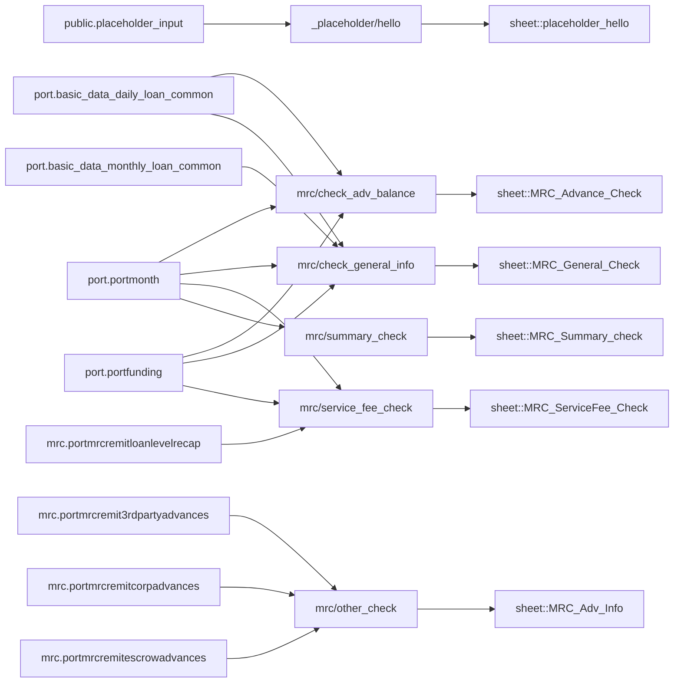

# Lineage

Dataset-level lineage: source tables → validators → produced sheets.
Column-level lineage lives on each sheet's column page (auto-extracted via `sqlglot`).

```mermaid
graph LR
    public_placeholder_input["public.placeholder_input"] --> _placeholder_hello["_placeholder/hello"]
    _placeholder_hello["_placeholder/hello"] --> sheet_placeholder_hello["sheet::placeholder_hello"]
    port_portmonth["port.portmonth"] --> mrc_check_adv_balance["mrc/check_adv_balance"]
    port_basic_data_daily_loan_common["port.basic_data_daily_loan_common"] --> mrc_check_adv_balance["mrc/check_adv_balance"]
    port_portfunding["port.portfunding"] --> mrc_check_adv_balance["mrc/check_adv_balance"]
    mrc_check_adv_balance["mrc/check_adv_balance"] --> sheet_MRC_Advance_Check["sheet::MRC_Advance_Check"]
    port_portmonth["port.portmonth"] --> mrc_check_general_info["mrc/check_general_info"]
    port_basic_data_daily_loan_common["port.basic_data_daily_loan_common"] --> mrc_check_general_info["mrc/check_general_info"]
    port_basic_data_monthly_loan_common["port.basic_data_monthly_loan_common"] --> mrc_check_general_info["mrc/check_general_info"]
    port_portfunding["port.portfunding"] --> mrc_check_general_info["mrc/check_general_info"]
    mrc_check_general_info["mrc/check_general_info"] --> sheet_MRC_General_Check["sheet::MRC_General_Check"]
    mrc_portmrcremit3rdpartyadvances["mrc.portmrcremit3rdpartyadvances"] --> mrc_other_check["mrc/other_check"]
    mrc_portmrcremitcorpadvances["mrc.portmrcremitcorpadvances"] --> mrc_other_check["mrc/other_check"]
    mrc_portmrcremitescrowadvances["mrc.portmrcremitescrowadvances"] --> mrc_other_check["mrc/other_check"]
    mrc_other_check["mrc/other_check"] --> sheet_MRC_Adv_Info["sheet::MRC_Adv_Info"]
    mrc_portmrcremitloanlevelrecap["mrc.portmrcremitloanlevelrecap"] --> mrc_service_fee_check["mrc/service_fee_check"]
    port_portmonth["port.portmonth"] --> mrc_service_fee_check["mrc/service_fee_check"]
    port_portfunding["port.portfunding"] --> mrc_service_fee_check["mrc/service_fee_check"]
    mrc_service_fee_check["mrc/service_fee_check"] --> sheet_MRC_ServiceFee_Check["sheet::MRC_ServiceFee_Check"]
    port_portmonth["port.portmonth"] --> mrc_summary_check["mrc/summary_check"]
    mrc_summary_check["mrc/summary_check"] --> sheet_MRC_Summary_check["sheet::MRC_Summary_check"]
```
