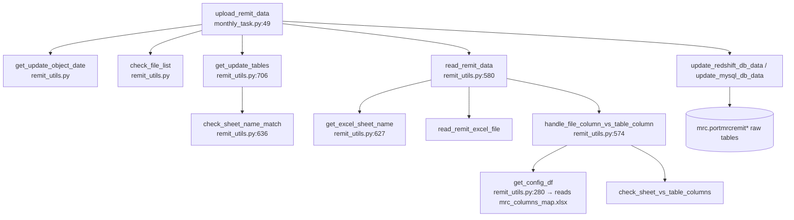

# 1.1 Raw Data Layer / 原始数据层

> **Purpose**: Reverse-engineer and document the raw-data layer for the MRC Validation Report — vendor source files, ingestion path, loader code, raw tables, and key field mappings — so sub-chapters 1.2–1.6 can reference a single authoritative description of "what the validators read from".
>
> **Audience**: Current and future-session Copilot CLI agents; project maintainers reviewing Stage 1.
>
> **Revision history**
>
> | Date | Author | Change |
> |---|---|---|
> | 2026-05-17 | Copilot CLI agent | v1 — first version. Source-verified against `tasks/servicer_data/remit_config.py`, `tasks/servicer_data/remit_utils.py`, `tasks/servicer_data/monthly_task.py`, `flow/remit_validation/mrc_db.py`, `flow/remit_validation/mrc_validation.py`, `flow/remit_validation/utils.py`, and `flow/basic_data/transfer_monthly_data_config/monthly_data_loan_common_config.py`. |

> **MRC chapter index** (`docs/mrc/`) — full definition in [`_chapter-index.md`](_chapter-index.md)
>
> | # | Title | File | Scope |
> |---|---|---|---|
> | 1.0 | TOC & Scope / 章节地图与范围 | `1.0-toc.en.md` | Entry & contract |
> | 1.1 | Raw Data Layer / 原始数据层 | `1.1-rawdata.en.md` | Upstream tables + time anchors |
> | 1.2 | Dataflow Layer / 数据流层 | `1.2-dataflow.en.md` | End-to-end execution pipeline |
> | 1.3 | Sheet Rendering Layer / Sheet 渲染层 | `1.3-sheets.en.md` | openpyxl rendering contract |
> | 1.4 | Field Definitions / 字段定义 | `1.4-fields.en.md` | Field-level lineage + business meaning |
> | 1.5 | Validation Rules / 验证规则 | `1.5-rules.en.md` | Rule catalogue |
> | 1.6 | Baseline XLSX Behavior / Baseline XLSX 行为 | `1.6-baseline.en.md` | Baseline truth |
> | 1.7 | User Review Gate / 用户走读评审 | (user action) | Stage 2 gate |

---

## 1. Document role

This is sub-chapter **1.1** of the MRC chapter. It answers the single
question: **what raw data does the MRC Validation Report consume, and how
does it get from a vendor file into the rows the 5 validators read?**

It does **not**:

- Describe the per-sheet generation logic (that's 1.3 `sheets`).
- Decompose the 2 SQL templates' join topology (that's 1.2 `dataflow`).
- Catalog every output column (that's 1.4 `fields`).
- Document validation rule semantics (that's 1.5 `rules`).

## 2. Scope

**In scope**

- The vendor Excel files the MRC servicer posts to SMB share.
- The 13 `mrc.portmrcremit*` raw tables and the 2 auxiliary `port.*`
  tables that the 5 MRC validators read at execution time.
- The loader entry points and helper functions in
  `tasks/servicer_data/` that ingest those Excel files into the raw
  tables, with line-level citations.
- The key field mappings used during ingestion: Excel sheet → DB table,
  Excel "Loan #" column → canonical `loanid`, and the centralized
  Excel-column → DB-column rename file.
- Concrete values of the time anchors (`fctrdt`, `pre_date`, …) for the
  baseline `remit_date = 2026-04-30`.

**Out of scope**

- The intermediate ETL flow `basic_data_monthly_loan_common` that
  rebuilds the wide `basic_data_monthly_loan_common_base` table from
  `mrc.portmrcremit*` (we only name it; § 8).
- Cross-servicer or non-MRC ingestion paths.
- New-system design choices (Stage 2).

## 3. Stage 1 baseline `remit_date` and concrete time anchors

Baseline `remit_date = 2026-04-30` (pinned by plan v9.1).

The `MrcDB` constructor derives 3 additional anchors
(`flow/remit_validation/mrc_db.py:7-14`):

```python
class MrcDB(ValidationBaseDB):
    def __init__(self, remit_date, to_new_redshift, to_mysql):
        self.remit_date = remit_date
        self.pre_date = (remit_date - MonthEnd(1)).date()
        self.fctrdt = get_fctrdt(remit_date)
        self.fctrdt_1m = get_fctrdt(self.pre_date)
```

`get_fctrdt` (`flow/remit_validation/utils.py:7-11`) takes any date,
normalizes to the first day of that month, then adds 1 month — i.e. it
returns the first day of the **next** month:

```python
def get_fctrdt(remit_date):
    str_date = str(remit_date)
    remit_date = str_date[:4] + '-' + str_date[5:7] + '-01'
    fctrdt = (datetime.datetime.strptime(remit_date, '%Y-%m-%d')
              + relativedelta.relativedelta(months=1)).date()
    return fctrdt
```

Concrete values for the baseline:

| Anchor | Formula | Concrete value at baseline |
|---|---|---|
| `remit_date` | input parameter | `2026-04-30` |
| `pre_date` | `remit_date - MonthEnd(1)` | `2026-03-31` |
| `fctrdt` | `get_fctrdt(remit_date)` | `2026-05-01` |
| `fctrdt_1m` | `get_fctrdt(pre_date)` | `2026-04-01` |
| `input_curr_month_end` | `remit_date` | `2026-04-30` |
| `input_pre_month_end` | `pre_date` | `2026-03-31` |

> Note: `fctrdt` is the "factor date" — semantically the snapshot key of
> the monthly remit cycle. In MRC raw tables (`mrc.portmrcremit*`) and in
> `port.portmonth`, rows for the April 2026 remit cycle are keyed by
> `fctrdt = 2026-05-01` (the first day of the month **after** the
> reporting period). Any SQL filter the validators issue uses `fctrdt`,
> not `remit_date`.

## 4. Vendor file ingestion path

### 4.1 SMB upload location

MRC posts monthly remittance workbooks to a Bridger-shared SMB tree.
The base path is built in `tasks/servicer_data/remit_config.py:8` and
`:179`:

```python
SMB_BASE_PATH = f"//bridg004-dc1.corp.bridgerpartners.com/shared/PrefectFlow/{BUILDENV}/input"
MRC_REMIT_UPLOAD_FILE_PATH = f"{SMB_BASE_PATH}/portremit/MRC/remittance upload/"
```

Files are organized **by year** under that prefix, e.g.
`.../remittance upload/2026/<file_name>.xlsx`. The year segment is
computed from the input `remit_update_date` by `get_update_object_date`
and re-appended in `tasks/servicer_data/monthly_task.py:72`:

```python
full_path = MRC_REMIT_UPLOAD_FILE_PATH + file_year
```

A separate workbook on the same share defines the Excel-column → DB-column
rename map (`remit_config.py:225`):

```python
MRC_REMIT_COLUMNS_MAP_ROUTE = f'{SMB_BASE_PATH}/portremit/MRC/mrc_columns_map.xlsx'
```

### 4.2 Sheet → raw table map

The vendor workbook is multi-sheet. Each sheet feeds one
`mrc.portmrcremit*` raw table. Map at `remit_config.py:180-194`
(Redshift target) and `:195-209` (MySQL target — identical sheet names,
unqualified table names):

| Sheet name (Excel) | Redshift table | MySQL table |
|---|---|---|
| `3rd Party Advances` | `mrc.portmrcremit3rdpartyadvances` | `portmrcremit3rdpartyadvances` |
| `Corp Advances` | `mrc.portmrcremitcorpadvances` | `portmrcremitcorpadvances` |
| `Deferred Interest` | `mrc.portmrcremitdeferredinterest` | `portmrcremitdeferredinterest` |
| `Escrow Advances` | `mrc.portmrcremitescrowadvances` | `portmrcremitescrowadvances` |
| `Invoices` | `mrc.portmrcremitinvoices` | `portmrcremitinvoices` |
| `Liquidations` | `mrc.portmrcremitliquidations` | `portmrcremitliquidations` |
| `Loan Level Recap` | `mrc.portmrcremitloanlevelrecap` | `portmrcremitloanlevelrecap` |
| `Loan Modification` | `mrc.portmrcremitloanmodification` | `portmrcremitloanmodification` |
| `PIF` | `mrc.portmrcremitpif` | `portmrcremitpif` |
| `Remittance Detail` | `mrc.portmrcremitremittancedetail` | `portmrcremitremittancedetail` |
| `Supplemental Funds` | `mrc.portmrcremitsupplementalfunds` | `portmrcremitsupplementalfunds` |
| `Trial Balance` | `mrc.portmrcremittrialbalance` | `portmrcremittrialbalance` |
| `UPB Roll-Forward` | `mrc.portmrcremitupbrollforward` | `portmrcremitupbrollforward` |

All 13 sheets are marked with the `True` "check required" flag in the
config (the `[..., True]` value), so they're all checked for presence
when the workbook arrives (`remit_utils.py:673-678`).

### 4.3 Loan-id index column per sheet

The `MRC_REMIT_IDX_MAP` (`remit_config.py:210-224`) tells the loader
which Excel column to use as the loan key when projecting to the
canonical `loanid`:

| Sheet | Excel id column |
|---|---|
| `3rd Party Advances` | `Loan #` |
| `Corp Advances` | `Loan #` |
| `Deferred Interest` | `Loan Number` |
| `Escrow Advances` | `Loan Number` |
| `Invoices` | `Loan #` |
| `Liquidations` | `Loan Number` |
| `Loan Level Recap` | `Loan Number` |
| `Loan Modification` | `Loan#` |
| `PIF` | `Loan Number` |
| `Remittance Detail` | `Loan Number` |
| `Supplemental Funds` | `Loan #` |
| `Trial Balance` | `Loan Number` |
| `UPB Roll-Forward` | `Loan Number` |

> Naming inconsistency in the source workbook is preserved by the
> config — `Loan #`, `Loan Number`, and `Loan#` all appear. The loader
> dispatches on sheet name only; do not assume any single canonical
> column header.

## 5. Loader code (entry points and citations)

The full ingestion path, top-down:



**Figure 1.1.5 — MRC ingestion call graph (vendor file → raw tables).**
Boxes are Python functions with file:line anchors; the cylinder is the
target database. The entry point `upload_remit_data(remit_update_date,
to_new_redshift, to_mysql, flow='mrc')` is invoked once per remit cycle.
Steps run sequentially top-to-bottom: ➊ resolve the year folder, ➋ scan
the SMB share and diff against the prior-run log table, ➌ pick the
correct `MRC_REMIT_TABLE_MAP_*` based on target DB, ➍ verify all
required sheets are present, ➎ read each sheet, rename columns using
`mrc_columns_map.xlsx`, attach the canonical `loanid`, and ➏ delete +
re-insert the rows for this `fctrdt` into the target DB.

**Legend / Legend table**

| Node id | Code reference |
|---|---|
| A | `tasks/servicer_data/monthly_task.py:49` `upload_remit_data` |
| B | `tasks/servicer_data/remit_utils.py` `get_update_object_date` |
| C | `tasks/servicer_data/remit_utils.py` `check_file_list` |
| D | `tasks/servicer_data/remit_utils.py:706` `get_update_tables` |
| E | `tasks/servicer_data/remit_utils.py:636` `check_sheet_name_match` |
| F | `tasks/servicer_data/remit_utils.py:580` `read_remit_data` |
| G | `tasks/servicer_data/remit_utils.py:627` `get_excel_sheet_name` |
| H | `tasks/servicer_data/remit_utils.py` `read_remit_excel_file` (called at `:612`) |
| I | `tasks/servicer_data/remit_utils.py:574` `handle_file_column_vs_table_column` |
| J | `tasks/servicer_data/remit_utils.py:280` `get_config_df` |
| K | `tasks/servicer_data/remit_utils.py` `check_sheet_vs_table_columns` |
| L | `tasks/servicer_data/remit_utils.py` `update_redshift_db_data` / `update_mysql_db_data` |
| M | Redshift schema `mrc.*` (or MySQL equivalents) |

> Node ids `A`–`M` are display-only cross-references for the figure, not
> source-code identifiers.

### 5.1 MRC-specific branch in the loader

The dispatching logic for `flow == 'mrc'` appears in 5 places — keep
these citations together so future changes can be located fast:

| Function | File / line | What it does for MRC |
|---|---|---|
| `get_config_df` | `remit_utils.py:294-295` | Selects `MRC_REMIT_COLUMNS_MAP_ROUTE` as the rename workbook. |
| `add_loanid_column` (Excel → `loanid` projection) | `remit_utils.py:546-549` | Looks up `MRC_REMIT_IDX_MAP[sheet_name]` and calls `safe_map_loanid(..., 'mrc')`. |
| `read_remit_data` | `remit_utils.py:593-594` | Selects the SMB base path `MRC_REMIT_UPLOAD_FILE_PATH`. |
| `check_sheet_name_match` | `remit_utils.py:673-678` | Picks Redshift or MySQL table map for the presence check. |
| `get_update_tables` | `remit_utils.py:753-757` | Picks Redshift or MySQL table map for the upload itself. |
| `upload_remit_data` | `monthly_task.py:71-72` | Builds `full_path = MRC_REMIT_UPLOAD_FILE_PATH + file_year`. |

## 6. Raw tables consumed by the 5 MRC validators

Of the 13 ingested tables, only **5** are read directly by the
`mrc_*_check` validators at validation-report time. The other 8 feed
the wider `basic_data_monthly_loan_common` ETL (§ 8) but do not appear
in any `MRC_*` Validation-Report sheet's primary source SQL.

| Raw table | Read by validator | Source citation |
|---|---|---|
| `mrc.portmrcremitloanlevelrecap` | `mrc_service_fee_check` | `mrc_validation.py:88` |
| `mrc.portmrcremit3rdpartyadvances` | `mrc_other_check` (via `_mrc_adv_info_sql`) | `mrc_validation.py:112` |
| `mrc.portmrcremitcorpadvances` | `mrc_other_check` (via `_mrc_adv_info_sql`) | `mrc_validation.py:121` |
| `mrc.portmrcremitescrowadvances` | `mrc_other_check` (via `_mrc_adv_info_sql`) | `mrc_validation.py:130` |
| `port.portmonth` (aux) | `mrc_summary_check`, `mrc_service_fee_check`, and the two SQL templates `mrc_adv_validation` / `mrc_general_check` | `mrc_validation.py:27`, `:89-92` |
| `port.portfunding` (aux) | `mrc_service_fee_check` (left join fallback for `dealid`) | `mrc_validation.py:93-94` |

> The two SQL templates (`mrc_adv_validation`, `mrc_general_check`,
> imported at `mrc_validation.py:4`) live in
> `flow/remit_validation/servicer_validation_with_portdaily.py`. Their
> full source, table list, and join topology will be unpacked in
> sub-1.2 Dataflow Layer (1.2-dataflow.en.md) dataflow.

## 7. Key field mappings

Ingestion performs three categories of renames / projections:

1. **Sheet → table** (§ 4.2). Driven by `MRC_REMIT_TABLE_MAP_REDSHIFT`
   / `MRC_REMIT_TABLE_MAP_MYSQL`.
2. **Per-sheet Excel id column → `loanid`** (§ 4.3). Driven by
   `MRC_REMIT_IDX_MAP` and the `safe_map_loanid('mrc', ...)` helper
   (`remit_utils.py:548`). The helper takes the raw text in the
   id column, looks it up in a `loanid_map` (Bridger's
   investor-loan-id → internal-loanid mapping) and, on miss, applies a
   per-flow fallback. For MRC no fallback strategy is registered
   (compare to Arvest's `lambda t: [t[1:]]` at `:535` or Carrington's
   `lambda t: ['0' + t]` at `:564`); unmatched ids therefore remain
   un-mapped and surface in the loader's miss log.
3. **Per-sheet Excel column headers → DB column names**. Driven by
   `mrc_columns_map.xlsx` (one sheet per ingested sheet name), read
   via `get_config_df` (`remit_utils.py:280-307`) and applied by
   `check_sheet_vs_table_columns` (called from
   `handle_file_column_vs_table_column` at `:574-577`). The exact cell
   contents of `mrc_columns_map.xlsx` are not analyzed here — they're
   per-sheet column-rename pairs and live on the SMB share. Sub-1.4 Field Definitions (1.4-fields.en.md) fields will quote the relevant rows for every output column it
   traces.

Additionally, the loader injects a `fctrdt` column on each ingested
DataFrame so that downstream SQL can filter by snapshot key. The
concrete value matches what `get_fctrdt(remit_date)` would return for
the cycle being uploaded (§ 3).

## 8. Intermediate / derived tables (named only)

The wider PrefectFlow build also runs a monthly job
`basic_data_monthly_loan_common` (`flow/basic_data/transfer_monthly_data_config/monthly_data_loan_common_config.py:1426-1623`)
that re-aggregates 8 of the 13 ingested MRC tables — plus a
daily-snapshot table `mrc.portmrcloan` and an internal adjustment table
`mrc.portmrcremitadvadj` — into a single wide row per loan-month in
`{REDSHIFT_PORT}.basic_data_monthly_loan_common_base` (servicer column
hard-coded to `'MRC'` at `:1523`).

**The MRC Validation Report does not read this wide table.** The five
validators in `mrc_validation.py` go straight to `mrc.portmrcremit*` and
`port.portmonth` / `port.portfunding`. The wide table is mentioned here
only so that future agents (or a Stage-2 design discussion) don't
mistake it for an intermediate the Validation Report depends on.

If future work proves that any MRC sheet implicitly depends on
`basic_data_monthly_loan_common_base` (e.g. via the way `port.portmonth`
itself is built), sub-1.2 Dataflow Layer (1.2-dataflow.en.md) dataflow must record that finding and
this section must be updated.

## 9. Assumptions and unresolved gaps

1. **`mrc_columns_map.xlsx` content is not inlined.** The workbook lives
   on the SMB share and is not in source control. Sub-1.4 Field Definitions (1.4-fields.en.md) fields
   will quote the relevant rename rows per output column; until then
   assume the loader rename map is correct (no validator failure
   currently attributed to it).
2. **`loanid_map` source is not analyzed here.** The mapping table
   `loanid_map` consumed by `safe_map_loanid` is built elsewhere in the
   pipeline; for MRC purposes we assume every ingested loan in the
   baseline cycle resolves to a non-null `loanid`. Validating this
   assumption is deferred to sub-1.6 Baseline XLSX Behavior (1.6-baseline.en.md) baseline (where we'll
   compare row counts).
3. **`port.portmonth` upstream lineage is not analyzed here.** Three of
   the five validators (`mrc_summary_check`, `mrc_service_fee_check`,
   and indirectly the two SQL templates) read `port.portmonth` filtered
   on `servicer = 'MRC'`. Whether and how MRC remit data flows into
   `port.portmonth` is owned by sub-1.2 Dataflow Layer (1.2-dataflow.en.md) dataflow.
4. **No fallback id strategy for MRC**: unlike Arvest (strip leading
   char) and Carrington (prepend `'0'`), `safe_map_loanid` for `'mrc'`
   has no fallback (`remit_utils.py:546-549`). Unmatched ids therefore
   remain unmapped. Whether this ever produces NULL `loanid` rows in
   the baseline cycle is to be checked in 1.6 baseline.
5. **Sheet `Loan Modification` uses `Loan#` (no space)**, not
   `Loan #` or `Loan Number`. Preserved as-is in
   `MRC_REMIT_IDX_MAP['Loan Modification']`; do not "normalize".
6. **`get_fctrdt` only inspects `str(remit_date)[:7]`** — it ignores
   the day part. Any date in April 2026 yields `fctrdt = 2026-05-01`.
   This is intentional but worth flagging: if a future caller passes
   `2026-04-15`, the validators will silently read the same April
   snapshot as `2026-04-30`.

## 10. Source citation index

| File | Lines | Note |
|---|---|---|
| `tasks/servicer_data/remit_config.py` | `remit_config.py:8` | `SMB_BASE_PATH` |
| `tasks/servicer_data/remit_config.py` | `remit_config.py:178-225` | All MRC ingestion configs |
| `tasks/servicer_data/remit_utils.py` | `remit_utils.py:280-307` | `get_config_df` (column-map workbook lookup) |
| `tasks/servicer_data/remit_utils.py` | `remit_utils.py:546-549` | MRC branch of Excel-id → `loanid` projection |
| `tasks/servicer_data/remit_utils.py` | `remit_utils.py:574-577` | `handle_file_column_vs_table_column` |
| `tasks/servicer_data/remit_utils.py` | `remit_utils.py:580-624` | `read_remit_data` |
| `tasks/servicer_data/remit_utils.py` | `remit_utils.py:627-633` | `get_excel_sheet_name` |
| `tasks/servicer_data/remit_utils.py` | `remit_utils.py:636-703` | `check_sheet_name_match` |
| `tasks/servicer_data/remit_utils.py` | `remit_utils.py:706-757` | `get_update_tables` |
| `tasks/servicer_data/monthly_task.py` | `monthly_task.py:49-110` | `upload_remit_data` entry point |
| `flow/remit_validation/utils.py` | `utils.py:7-11` | `get_fctrdt` |
| `flow/remit_validation/mrc_db.py` | `mrc_db.py:1-14` | `MrcDB` time anchors |
| `flow/remit_validation/mrc_validation.py` | `mrc_validation.py:8-158` | 5 validators (raw-table reads) |
| `flow/basic_data/transfer_monthly_data_config/monthly_data_loan_common_config.py` | `monthly_data_loan_common_config.py:1426-1623` | Wide intermediate (named only, not on validation-report path) |
