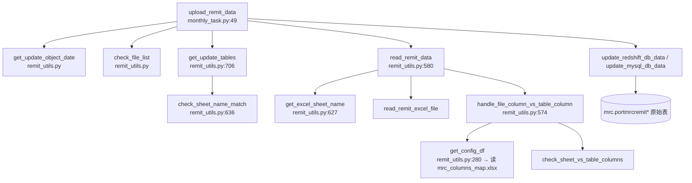

# 1.1 Raw Data Layer / 原始数据层

> **文档定位 / Purpose**：逆向并记录 MRC Validation Report 的**原始数据层**——供应商源文件、入仓路径、加载器代码、原始表、关键字段映射；以便 1.2–1.6 子章节共用一份关于"5 个 validator 究竟读什么"的权威说明。
>
> **目标读者 / Audience**：当前及未来 session 的 Copilot CLI agent；Stage 1 评审人。
>
> **修订历史 / Revision history**
>
> | 日期 | 作者 | 变更 |
> |---|---|---|
> | 2026-05-17 | Copilot CLI agent | v1 — 首版。源代码佐证文件：`tasks/servicer_data/remit_config.py`、`tasks/servicer_data/remit_utils.py`、`tasks/servicer_data/monthly_task.py`、`flow/remit_validation/mrc_db.py`、`flow/remit_validation/mrc_validation.py`、`flow/remit_validation/utils.py`、`flow/basic_data/transfer_monthly_data_config/monthly_data_loan_common_config.py`。 |

> **MRC 章节索引** （`docs/mrc/`）—— 完整定义见 [`_chapter-index.md`](_chapter-index.md)
>
> | # | 标题 | 文件 | 职责 |
> |---|---|---|---|
> | 1.0 | TOC & Scope / 章节地图与范围 | `1.0-toc.zh.md` | 入口与契约 |
> | 1.1 | Raw Data Layer / 原始数据层 | `1.1-rawdata.zh.md` | 上游表 + 时间锚 |
> | 1.2 | Dataflow Layer / 数据流层 | `1.2-dataflow.zh.md` | 端到端执行流水线 |
> | 1.3 | Sheet Rendering Layer / Sheet 渲染层 | `1.3-sheets.zh.md` | openpyxl 渲染契约 |
> | 1.4 | Field Definitions / 字段定义 | `1.4-fields.zh.md` | 字段级血缘 + 业务含义 |
> | 1.5 | Validation Rules / 验证规则 | `1.5-rules.zh.md` | 规则目录 |
> | 1.6 | Baseline XLSX Behavior / Baseline XLSX 行为 | `1.6-baseline.zh.md` | baseline 真值 |
> | 1.7 | User Review Gate / 用户走读评审 | （用户动作） | Stage 2 开闸点 |

---

## 1. Document role

本文是 MRC 章节的子章节 **1.1**。它只回答一个问题：**MRC Validation
Report 消费哪些原始数据？这些数据如何从供应商发布的 Excel 文件流入 5 个
validator 真正读取的行集？**

它**不**：

- 描述每张 sheet 的生成逻辑（属于 1.3 `sheets`）。
- 拆解 2 份 SQL template 的 join 拓扑（属于 1.2 `dataflow`）。
- 罗列每一个输出列（属于 1.4 `fields`）。
- 解释校验规则语义（属于 1.5 `rules`）。

## 2. Scope

**在范围内**

- MRC 供应商每月发布到 SMB 共享盘的 Excel 工作簿。
- 5 个 validator 在执行时直接读取的 13 张 `mrc.portmrcremit*` 原始表，以及
  2 张辅助 `port.*` 表。
- 位于 `tasks/servicer_data/` 的加载器入口与辅助函数，附带行级引用。
- 入仓过程中的关键字段映射：Excel sheet → DB 表名；Excel 的 `Loan #` /
  `Loan Number` → 统一 `loanid`；以及集中存放的 Excel 列名 → DB 列名重命名工作簿。
- 基线 `remit_date = 2026-04-30` 对应的时间锚点的具体取值（`fctrdt`、
  `pre_date` 等）。

**不在范围内**

- 用 `mrc.portmrcremit*` 重建宽表 `basic_data_monthly_loan_common_base`
  的中间 ETL flow（仅命名提及，见 § 8）。
- 跨 servicer 或非 MRC 的入仓路径。
- 新系统的设计选择（属于 Stage 2）。

## 3. Stage 1 baseline `remit_date` 与具体时间锚点

基线 `remit_date = 2026-04-30`（由 plan v9.1 钉死）。

`MrcDB` 构造函数派生出另外 3 个时间锚点
（`flow/remit_validation/mrc_db.py:7-14`）：

```python
class MrcDB(ValidationBaseDB):
    def __init__(self, remit_date, to_new_redshift, to_mysql):
        self.remit_date = remit_date
        self.pre_date = (remit_date - MonthEnd(1)).date()
        self.fctrdt = get_fctrdt(remit_date)
        self.fctrdt_1m = get_fctrdt(self.pre_date)
```

`get_fctrdt`（`flow/remit_validation/utils.py:7-11`）的规则是：把任意日期归到
"该月 1 号"，再加 1 个月——亦即返回**下一个月的 1 号**：

```python
def get_fctrdt(remit_date):
    str_date = str(remit_date)
    remit_date = str_date[:4] + '-' + str_date[5:7] + '-01'
    fctrdt = (datetime.datetime.strptime(remit_date, '%Y-%m-%d')
              + relativedelta.relativedelta(months=1)).date()
    return fctrdt
```

基线对应的具体取值：

| 锚点 | 公式 | 基线取值 |
|---|---|---|
| `remit_date` | 输入参数 | `2026-04-30` |
| `pre_date` | `remit_date - MonthEnd(1)` | `2026-03-31` |
| `fctrdt` | `get_fctrdt(remit_date)` | `2026-05-01` |
| `fctrdt_1m` | `get_fctrdt(pre_date)` | `2026-04-01` |
| `input_curr_month_end` | `remit_date` | `2026-04-30` |
| `input_pre_month_end` | `pre_date` | `2026-03-31` |

> 说明：`fctrdt` 是"factor date"，语义上是月度 remit 周期的快照键。
> MRC 原始表 `mrc.portmrcremit*` 以及 `port.portmonth` 中，**2026 年 4 月**
> 这个 remit 周期的行的键值为 `fctrdt = 2026-05-01`（亦即报送周期之后的
> 第一天）。validator 发出的所有 SQL 过滤都用 `fctrdt`，不用 `remit_date`。

## 4. Vendor file ingestion path

### 4.1 SMB 上传位置

MRC 每月把 remittance 工作簿上传到 Bridger 共享 SMB 盘的固定路径，路径在
`tasks/servicer_data/remit_config.py:8` 与 `:179` 拼出：

```python
SMB_BASE_PATH = f"//bridg004-dc1.corp.bridgerpartners.com/shared/PrefectFlow/{BUILDENV}/input"
MRC_REMIT_UPLOAD_FILE_PATH = f"{SMB_BASE_PATH}/portremit/MRC/remittance upload/"
```

文件**按年分目录**，例如
`.../remittance upload/2026/<file_name>.xlsx`。年份段由
`get_update_object_date` 从入参 `remit_update_date` 算出，并在
`tasks/servicer_data/monthly_task.py:72` 拼回：

```python
full_path = MRC_REMIT_UPLOAD_FILE_PATH + file_year
```

同一共享盘还有另一份工作簿，用来定义 Excel 列名 → DB 列名的重命名映射
（`remit_config.py:225`）：

```python
MRC_REMIT_COLUMNS_MAP_ROUTE = f'{SMB_BASE_PATH}/portremit/MRC/mrc_columns_map.xlsx'
```

### 4.2 Sheet → 原始表 映射

供应商工作簿是多 sheet 的，每张 sheet 对应一张 `mrc.portmrcremit*` 原始
表。映射定义在 `remit_config.py:180-194`（Redshift 目标）以及 `:195-209`
（MySQL 目标 —— sheet 名相同，表名不带 schema）：

| Sheet 名（Excel） | Redshift 表 | MySQL 表 |
|---|---|---|
| `3rd Party Advances` | `mrc.portmrcremit3rdpartyadvances` | `portmrcremit3rdpartyadvances` |
| `Corp Advances` | `mrc.portmrcremitcorpadvances` | `portmrcremitcorpadvances` |
| `Deferred Interest` | `mrc.portmrcremitdeferredinterest` | `portmrcremitdeferredinterest` |
| `Escrow Advances` | `mrc.portmrcremitescrowadvances` | `portmrcremitescrowadvances` |
| `Invoices` | `mrc.portmrcremitinvoices` | `portmrcremitinvoices` |
| `Liquidations` | `mrc.portmrcremitliquidations` | `portmrcremitliquidations` |
| `Loan Level Recap` | `mrc.portmrcremitloanlevelrecap` | `portmrcremitloanlevelrecap` |
| `Loan Modification` | `mrc.portmrcremitloanmodification` | `portmrcremitloanmodification` |
| `PIF` | `mrc.portmrcremitpif` | `portmrcremitpif` |
| `Remittance Detail` | `mrc.portmrcremitremittancedetail` | `portmrcremitremittancedetail` |
| `Supplemental Funds` | `mrc.portmrcremitsupplementalfunds` | `portmrcremitsupplementalfunds` |
| `Trial Balance` | `mrc.portmrcremittrialbalance` | `portmrcremittrialbalance` |
| `UPB Roll-Forward` | `mrc.portmrcremitupbrollforward` | `portmrcremitupbrollforward` |

config 里 13 张 sheet 都带 `True` 的"必须存在"标志（即 `[..., True]` 那
一位），因此到货时全部参与缺 sheet 校验
（`remit_utils.py:673-678`）。

### 4.3 每张 sheet 的 loan id 列

`MRC_REMIT_IDX_MAP`（`remit_config.py:210-224`）告诉加载器：每张 sheet
应该用 Excel 里哪一列作为 loan key，再投影成统一的 `loanid`。

| Sheet | Excel id 列 |
|---|---|
| `3rd Party Advances` | `Loan #` |
| `Corp Advances` | `Loan #` |
| `Deferred Interest` | `Loan Number` |
| `Escrow Advances` | `Loan Number` |
| `Invoices` | `Loan #` |
| `Liquidations` | `Loan Number` |
| `Loan Level Recap` | `Loan Number` |
| `Loan Modification` | `Loan#` |
| `PIF` | `Loan Number` |
| `Remittance Detail` | `Loan Number` |
| `Supplemental Funds` | `Loan #` |
| `Trial Balance` | `Loan Number` |
| `UPB Roll-Forward` | `Loan Number` |

> 源工作簿里列名命名是不一致的（`Loan #`、`Loan Number`、`Loan#` 三种都
> 有），config 完整保留了这种不一致。加载器**仅按 sheet 名**分派，不要
> 假设存在某个统一的列名。

## 5. Loader code (entry points and citations)

入仓完整调用链，自上而下：



**图 1.1.5 — MRC 入仓调用图（供应商文件 → 原始表）。**
节点为 Python 函数（标注 file:line），圆柱体为目标数据库。入口
`upload_remit_data(remit_update_date, to_new_redshift, to_mysql, flow='mrc')`
每个 remit 周期调一次。步骤按图自上而下顺序执行：➊ 解析年份目录；➋ 扫
SMB 共享并与上次记录表 diff；➌ 根据目标库选择正确的
`MRC_REMIT_TABLE_MAP_*`；➍ 校验所有必需 sheet 是否到齐；➎ 读取每张
sheet，按 `mrc_columns_map.xlsx` 重命名列，绑定统一 `loanid`；➏ 删除并
重插当前 `fctrdt` 的行到目标库。

**图例 / Legend**

| Node id | 代码引用 |
|---|---|
| A | `tasks/servicer_data/monthly_task.py:49` `upload_remit_data` |
| B | `tasks/servicer_data/remit_utils.py` `get_update_object_date` |
| C | `tasks/servicer_data/remit_utils.py` `check_file_list` |
| D | `tasks/servicer_data/remit_utils.py:706` `get_update_tables` |
| E | `tasks/servicer_data/remit_utils.py:636` `check_sheet_name_match` |
| F | `tasks/servicer_data/remit_utils.py:580` `read_remit_data` |
| G | `tasks/servicer_data/remit_utils.py:627` `get_excel_sheet_name` |
| H | `tasks/servicer_data/remit_utils.py` `read_remit_excel_file`（在 `:612` 被调用） |
| I | `tasks/servicer_data/remit_utils.py:574` `handle_file_column_vs_table_column` |
| J | `tasks/servicer_data/remit_utils.py:280` `get_config_df` |
| K | `tasks/servicer_data/remit_utils.py` `check_sheet_vs_table_columns` |
| L | `tasks/servicer_data/remit_utils.py` `update_redshift_db_data` / `update_mysql_db_data` |
| M | Redshift schema `mrc.*`（或对应的 MySQL） |

> 节点 id `A`–`M` 仅是图内交叉引用，不是源码标识符。

### 5.1 MRC 在加载器中的专用分支

`flow == 'mrc'` 的分派逻辑出现在 5 个位置，集中列出以便未来修改时一次性
定位：

| 函数 | 文件/行 | 对 MRC 的作用 |
|---|---|---|
| `get_config_df` | `remit_utils.py:294-295` | 选择 `MRC_REMIT_COLUMNS_MAP_ROUTE` 作为重命名工作簿。 |
| `add_loanid_column`（Excel → `loanid` 投影） | `remit_utils.py:546-549` | 查 `MRC_REMIT_IDX_MAP[sheet_name]`，调用 `safe_map_loanid(..., 'mrc')`。 |
| `read_remit_data` | `remit_utils.py:593-594` | 选 SMB 路径 `MRC_REMIT_UPLOAD_FILE_PATH`。 |
| `check_sheet_name_match` | `remit_utils.py:673-678` | 选 Redshift 还是 MySQL 表映射做缺 sheet 校验。 |
| `get_update_tables` | `remit_utils.py:753-757` | 选 Redshift 还是 MySQL 表映射做实际上传。 |
| `upload_remit_data` | `monthly_task.py:71-72` | 拼 `full_path = MRC_REMIT_UPLOAD_FILE_PATH + file_year`。 |

## 6. Raw tables consumed by the 5 MRC validators

入仓的 13 张表里，只有 **5 张** 在生成 Validation Report 时被
`mrc_*_check` validator 直接读取；另外 8 张服务于更宽的
`basic_data_monthly_loan_common` ETL（见 § 8），但**不**出现在任何
`MRC_*` 报表 sheet 的主源 SQL 里。

| 原始表 | 被哪个 validator 读取 | 代码佐证 |
|---|---|---|
| `mrc.portmrcremitloanlevelrecap` | `mrc_service_fee_check` | `mrc_validation.py:88` |
| `mrc.portmrcremit3rdpartyadvances` | `mrc_other_check`（经 `_mrc_adv_info_sql`） | `mrc_validation.py:112` |
| `mrc.portmrcremitcorpadvances` | `mrc_other_check`（经 `_mrc_adv_info_sql`） | `mrc_validation.py:121` |
| `mrc.portmrcremitescrowadvances` | `mrc_other_check`（经 `_mrc_adv_info_sql`） | `mrc_validation.py:130` |
| `port.portmonth`（辅助） | `mrc_summary_check`、`mrc_service_fee_check`，以及两份 SQL template `mrc_adv_validation` / `mrc_general_check` | `mrc_validation.py:27`、`:89-92` |
| `port.portfunding`（辅助） | `mrc_service_fee_check`（left join 兜底取 `dealid`） | `mrc_validation.py:93-94` |

> 2 份 SQL template（`mrc_adv_validation`、`mrc_general_check`，import
> 自 `mrc_validation.py:4`）的源代码位于
> `flow/remit_validation/servicer_validation_with_portdaily.py`。其完整
> SQL、所涉及的表清单和 join 拓扑由子章节 1.2 dataflow 拆解。

## 7. Key field mappings

入仓过程做了 3 类列重命名/投影：

1. **Sheet → 表**（§ 4.2）。由 `MRC_REMIT_TABLE_MAP_REDSHIFT` /
   `MRC_REMIT_TABLE_MAP_MYSQL` 驱动。
2. **每张 sheet 的 Excel id 列 → `loanid`**（§ 4.3）。由
   `MRC_REMIT_IDX_MAP` 与 `safe_map_loanid('mrc', ...)` 协作完成
   （`remit_utils.py:548`）。`safe_map_loanid` 读取 id 列原始文本，先去
   `loanid_map`（Bridger 的 investor-loan-id → 内部 loanid 的映射表）查；
   miss 时再按 servicer 走兜底策略。**MRC 没有注册兜底策略**（对比
   Arvest 的 `lambda t: [t[1:]]`（`:535`）或 Carrington 的
   `lambda t: ['0' + t]`（`:564`））——MRC miss 的 id 会直接保留为未匹配
   状态并在加载器日志中体现。
3. **每张 sheet 的 Excel 列名 → DB 列名**。由 `mrc_columns_map.xlsx`
   驱动（每张 sheet 一个表），经 `get_config_df`
   （`remit_utils.py:280-307`）读取，再由 `check_sheet_vs_table_columns`
   应用（被 `:574-577` 的 `handle_file_column_vs_table_column` 调用）。
   `mrc_columns_map.xlsx` 的具体单元格内容本文不展开——它们是按 sheet 罗
   列的列名重命名对，存放在 SMB 盘。1.4 fields 在追溯每一个输出列时再按
   需要引用相关行。

此外，加载器在每个 ingest 后的 DataFrame 上注入一列 `fctrdt`，使下游 SQL
可以按快照键过滤；具体取值与该入仓周期的 `get_fctrdt(remit_date)` 结果
一致（§ 3）。

## 8. Intermediate / derived tables (named only)

PrefectFlow 的另一个月度任务 `basic_data_monthly_loan_common`
（`flow/basic_data/transfer_monthly_data_config/monthly_data_loan_common_config.py:1426-1623`）
会把 13 张入仓 MRC 表里的 8 张——再加上一张日快照表 `mrc.portmrcloan`、
一张内部调整表 `mrc.portmrcremitadvadj`——汇聚成 `loan × month` 的宽行，
写入 `{REDSHIFT_PORT}.basic_data_monthly_loan_common_base`（其中
servicer 列在 `:1523` 被硬编码为 `'MRC'`）。

**MRC Validation Report 并不读这张宽表。** `mrc_validation.py` 里的 5 个
validator 直接读 `mrc.portmrcremit*` 与 `port.portmonth` /
`port.portfunding`。本节提到这张宽表，只是为了避免未来 agent（或 Stage 2
设计讨论）误以为它是 Validation Report 依赖的中间态。

如果将来发现某张 MRC sheet 隐式依赖
`basic_data_monthly_loan_common_base`（例如经由 `port.portmonth` 自身的
构建路径），子章节 1.2 dataflow 必须记录此发现，本节也必须随之更新。

## 9. Assumptions and unresolved gaps

1. **`mrc_columns_map.xlsx` 的内容未内联**。该工作簿位于 SMB 盘，未纳入
   源码管理。1.4 fields 在追溯每一个输出列时按需要引用具体重命名行；在
   此之前默认加载器的列名重命名是正确的（目前没有 validator 失败归因到
   它）。
2. **`loanid_map` 的来源不在本文分析**。`safe_map_loanid` 消费的映射表
   `loanid_map` 在管线别处构建；对 MRC 而言，假定基线周期里每条 ingest
   loan 都能解析出非空 `loanid`。验证此假设的工作放到 1.6 baseline（届
   时会比对行数）。
3. **`port.portmonth` 的上游血缘不在本文分析**。5 个 validator 中有 3 个
   （`mrc_summary_check`、`mrc_service_fee_check`，以及间接地两份 SQL
   template）会读 `port.portmonth where servicer = 'MRC'`。MRC remit 数
   据**是否**以及**如何**流入 `port.portmonth`，归 1.2 dataflow 拆解。
4. **MRC 没有 id 兜底策略**：不同于 Arvest（去掉首字符）和 Carrington
   （前缀补 `'0'`），`safe_map_loanid` 在 `'mrc'` 分支下没有 fallback
   （`remit_utils.py:546-549`）。miss 的 id 会保持未匹配。基线周期是否
   出现 NULL `loanid` 行，放到 1.6 baseline 检查。
5. **Sheet `Loan Modification` 用的列名是 `Loan#`（不带空格）**，不是
   `Loan #` 也不是 `Loan Number`。`MRC_REMIT_IDX_MAP['Loan Modification']`
   原样保留，**不要"统一化"**。
6. **`get_fctrdt` 只看 `str(remit_date)[:7]`** —— 忽略日。任何 2026 年 4
   月的日期都得到 `fctrdt = 2026-05-01`。这是有意为之，但值得标注：未来
   若有调用方传入 `2026-04-15`，validator 会静默读到与 `2026-04-30` 完
   全相同的 4 月快照。

## 10. Source citation index

| 文件 | 行范围 | 备注 |
|---|---|---|
| `tasks/servicer_data/remit_config.py` | `remit_config.py:8` | `SMB_BASE_PATH` |
| `tasks/servicer_data/remit_config.py` | `remit_config.py:178-225` | 全部 MRC 入仓 config |
| `tasks/servicer_data/remit_utils.py` | `remit_utils.py:280-307` | `get_config_df`（重命名工作簿查找） |
| `tasks/servicer_data/remit_utils.py` | `remit_utils.py:546-549` | MRC 分支的 Excel id → `loanid` 投影 |
| `tasks/servicer_data/remit_utils.py` | `remit_utils.py:574-577` | `handle_file_column_vs_table_column` |
| `tasks/servicer_data/remit_utils.py` | `remit_utils.py:580-624` | `read_remit_data` |
| `tasks/servicer_data/remit_utils.py` | `remit_utils.py:627-633` | `get_excel_sheet_name` |
| `tasks/servicer_data/remit_utils.py` | `remit_utils.py:636-703` | `check_sheet_name_match` |
| `tasks/servicer_data/remit_utils.py` | `remit_utils.py:706-757` | `get_update_tables` |
| `tasks/servicer_data/monthly_task.py` | `monthly_task.py:49-110` | `upload_remit_data` 入口 |
| `flow/remit_validation/utils.py` | `utils.py:7-11` | `get_fctrdt` |
| `flow/remit_validation/mrc_db.py` | `mrc_db.py:1-14` | `MrcDB` 时间锚点 |
| `flow/remit_validation/mrc_validation.py` | `mrc_validation.py:8-158` | 5 个 validator（原始表读取） |
| `flow/basic_data/transfer_monthly_data_config/monthly_data_loan_common_config.py` | `monthly_data_loan_common_config.py:1426-1623` | 中间宽表（仅命名提及，不在 validation-report 路径上） |
