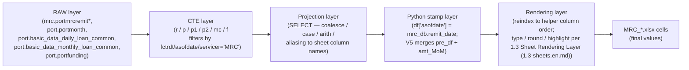
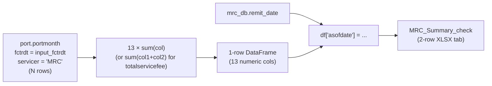
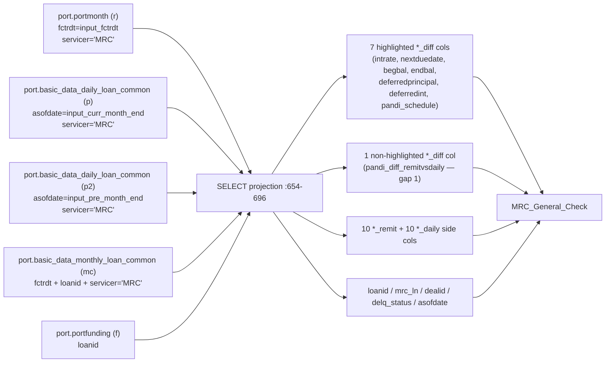
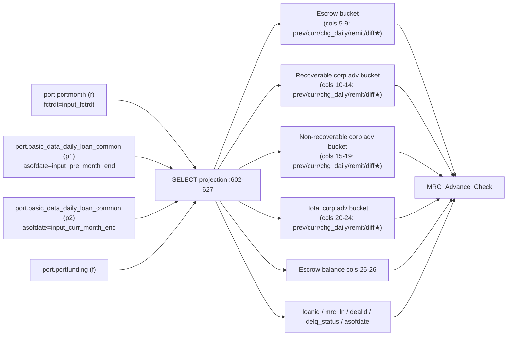
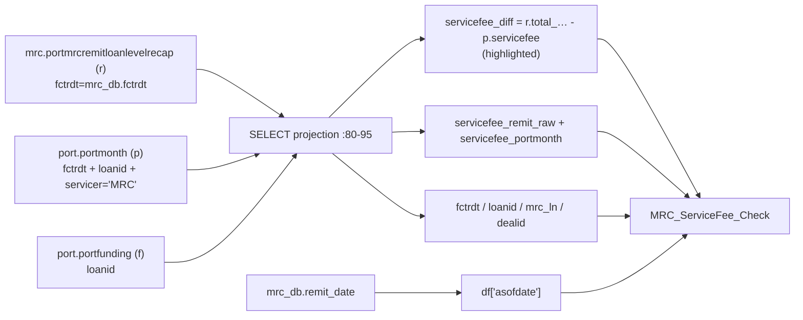
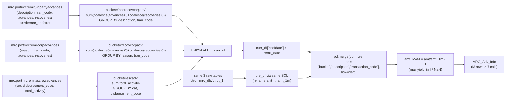

# 1.4 Field Definitions / 字段定义

> **Purpose**: For every output column on every MRC sheet, document the exact field-level lineage — which raw column from which source table, through which CTE / projection / `coalesce` / arithmetic, ends up as the cell value. This is the contract Stage 2 must reproduce; it is also the input to 1.5 Validation Rules (1.5-rules.en.md) (validation thresholds) and 1.6 Baseline XLSX Behavior (1.6-baseline.en.md) (baseline capture).
>
> **Audience**: Stage 1 reviewer; Stage 2 engineers writing the rebuilt MRC engine; future Copilot CLI agent picking up chapters 1.5 / 1.6.
>
> **Revision history**
>
> | Date | Author | Change |
> |---|---|---|
> | 2026-05-17 | Copilot CLI agent | v1 — first cut. Sources: `flow/remit_validation/mrc_validation.py` (V1, V4, V5 inline SQL + V5 pandas merge), `flow/remit_validation/servicer_validation_with_portdaily.py` (V2 `mrc_general_check`, V3 `mrc_adv_validation`), and `util/gen_remit_validation_report.py` (type / round contracts via 1.3 Sheet Rendering Layer (1.3-sheets.en.md)). |

> **MRC chapter index** (`docs/mrc/`) — full definition in [`_chapter-index.md`](_chapter-index.md)
>
> | # | Title | File | Scope |
> |---|---|---|---|
> | 1.0 | TOC & Scope / 章节地图与范围 | `1.0-toc.en.md` | Entry & contract |
> | 1.1 | Raw Data Layer / 原始数据层 | `1.1-rawdata.en.md` | Upstream tables + time anchors |
> | 1.2 | Dataflow Layer / 数据流层 | `1.2-dataflow.en.md` | End-to-end execution pipeline |
> | 1.3 | Sheet Rendering Layer / Sheet 渲染层 | `1.3-sheets.en.md` | openpyxl rendering contract |
> | 1.4 | Field Definitions / 字段定义 | `1.4-fields.en.md` | Field-level lineage + business meaning |
> | 1.5 | Validation Rules / 验证规则 | `1.5-rules.en.md` | Rule catalogue |
> | 1.6 | Baseline XLSX Behavior / Baseline XLSX 行为 | `1.6-baseline.en.md` | Baseline truth |
> | 1.7 | User Review Gate / 用户走读评审 | (user action) | Stage 2 gate |

---

## 1. Document role

This is sub-chapter **1.4** of the MRC chapter. It answers one question: **for each output cell on the 5 `MRC_*` sheets, which raw column(s) from which raw table(s), with which transformations, produces the value?**

It builds on 1.2 Dataflow Layer (1.2-dataflow.en.md) (which named the validators and their CTEs) and 1.3 Sheet Rendering Layer (1.3-sheets.en.md) (which gave the column order / type / round / highlight contract). 1.4 Field Definitions (1.4-fields.en.md) fills in the **per-column compute logic** that 1.2 abstracted away. The output of 1.4 is the lineage knowledge needed to (a) reproduce every cell in Stage 2, (b) define validation thresholds in 1.5 Validation Rules (1.5-rules.en.md) with a clear understanding of input semantics, and (c) interpret diffs found in 1.6 Baseline XLSX Behavior (1.6-baseline.en.md) baseline.

It does **not**:

- Re-state the SQL CTE topology — see 1.2 Dataflow Layer (1.2-dataflow.en.md).
- Re-state the cell rendering / highlight contract — see 1.3 Sheet Rendering Layer (1.3-sheets.en.md).
- Define validation thresholds or rule semantics — 1.5 Validation Rules (1.5-rules.en.md).

## 2. Scope and conventions

**Per-column row format** used in §§ 4–8:

| Col # | Output column | Business Meaning | Source | Transform | Calculation Logic | Type / round | Notes |
|---|---|---|---|---|---|---|---|

- **Col #** matches the column position from 1.3 Sheet Rendering Layer (1.3-sheets.en.md) (so this file and 1.3 Sheet Rendering Layer (1.3-sheets.en.md) can be read side by side).
- **Output column** is the literal column name written to the XLSX (the helper-declared name from 1.3 Sheet Rendering Layer (1.3-sheets.en.md) § 4–9).
- **Business Meaning** explains the business intent: *what number / fact does this cell represent, and how does a remittance / portfolio analyst interpret it?* This is the column to read first if you don't speak SQL.
- **Source table.column** uses the CTE alias from 1.2 Dataflow Layer (1.2-dataflow.en.md) (`r` = `port.portmonth`; `p` = current-month `port.basic_data_daily_loan_common`; `p1` = previous-month `…common`; `p2` = … see § 2.1 below; `mc` = `port.basic_data_monthly_loan_common`; `f` = `port.portfunding`; for V4: `r` = `mrc.portmrcremitloanlevelrecap`, `p` = `port.portmonth`, `f` = `port.portfunding`; for V5: `mrc.portmrcremit3rdpartyadvances` / `…corpadvances` / `…escrowadvances`).
- **Transform** captures the SQL expression literally when short; for `case` / `coalesce` blocks, summarized in one line and cited to source line(s).
- **Calculation Logic** restates the Transform in plain language / pseudocode / set notation / mathematical formula — explicitly listing source fields, the order of operations, rounding behavior, NULL handling, fallback rules, and the assumption boundary. This column makes the derivation auditable without reading source SQL. Notation used: `∑` (SUM), `∩` (logical AND), `∪` (logical OR), `−` (subtraction / set difference), `⟶` (mapping), `≔` (assignment).
- **Type / round** echoes 1.3 Sheet Rendering Layer (1.3-sheets.en.md) § 4–9 (the helper-declared contract): `money` columns round to 2 dp and render `$#,##0.00` (or `$#,##0` for integer values); `float` columns round to 2 dp but receive no number_format; `date` and `str` are pass-through.
- **Notes** captures null-handling, the high-lighted-vs-not asymmetry, type / round mismatches with semantic meaning, and references to 1.3 Sheet Rendering Layer (1.3-sheets.en.md) § 10 gaps.

### 2.1 CTE-alias compatibility warning (recap from 1.2 Dataflow Layer (1.2-dataflow.en.md))

The two SQL templates use **opposite** aliases for the previous-month / current-month daily snapshot:

| Template | Previous month | Current month | Notes |
|---|---|---|---|
| `mrc_adv_validation` (V3) | `p1` | `p2` | both `port.basic_data_daily_loan_common` filtered by `asofdate` |
| `mrc_general_check` (V2) | `p2` | `p` | `mc` = `port.basic_data_monthly_loan_common` (extra join for `sched_pandi`) |

This is documented but **not fixed** (1.2 Dataflow Layer (1.2-dataflow.en.md) § 4.2 + § 5.2). The tables below use whichever alias the source SQL uses, so the V2 column "source = p" means the *current*-month snapshot, while the V3 column "source = p1" means the *previous*-month snapshot. Do not transfer the convention between sheets without checking.

### 2.2 Parameter substitution

All three SQL templates that take parameters substitute three values at call time (see 1.2 Dataflow Layer (1.2-dataflow.en.md) § 4.1 / § 5.1):

| Placeholder | Value (baseline 2026-04-30) | Source |
|---|---|---|
| `input_fctrdt` | `2026-05-01` | `mrc_db.fctrdt` |
| `input_curr_month_end` | `2026-04-30` | `mrc_db.remit_date` |
| `input_pre_month_end` | `2026-03-31` | `mrc_db.pre_date` |
| (V5 only) `fctrdt_1m` | `2026-04-01` | `mrc_db.fctrdt_1m` |

The `asofdate` column appended in every validator is `mrc_db.remit_date` = `input_curr_month_end` = `2026-04-30` at baseline.

## 3. Lineage overview

### 3.1 Lineage layers

**Figure 1.4.3 — Five-layer lineage from raw tables to final XLSX cells.**
Source: `mrc_validation.py:8-158`, `servicer_validation_with_portdaily.py:583-705`, `gen_remit_validation_report.py:1180-1293, 1610-1810`.

**Explanation (per § 6.10)**

- **Business purpose / 业务目的**: makes the 5 transformation layers explicit so any one cell's value can be reasoned about end-to-end. Stage 2 must reproduce all 5 layers; 1.5 Validation Rules (1.5-rules.en.md) rules attach thresholds to the **projection** layer outputs (diff columns); 1.6 Baseline XLSX Behavior (1.6-baseline.en.md) baseline captures the **render** layer outputs.
- **Execution flow**: raw row → CTE filter (by `fctrdt` / `asofdate` / `servicer='MRC'`) → projection (`coalesce` / `case` / arithmetic with **left-join** semantics — missing right-side rows become NULL then often `coalesce`-d to `0`) → Python stamps the `asofdate` column (and for V5 merges previous month + computes MoM) → renderer reindexes to helper order, rounds, formats, highlights.
- **Input / output**: **input** = raw rows in the 5 source tables for the given `fctrdt` / `asofdate`; **output** = per-sheet DataFrame with columns matching 1.3 Sheet Rendering Layer (1.3-sheets.en.md) helpers (after the renderer reindexes; helper-declared columns missing from the DataFrame are filled with `np.nan`, but for MRC the validators always emit exactly the helper-declared set).
- **Key transformations**: `coalesce(x, 0)` is the dominant NULL handler on the SQL side — many `*_remit` and `*_daily` columns coalesce to 0 so the downstream diff is always defined even when one side is missing; `case` blocks are used to **preserve NULL** when both sides of the diff are missing (so the diff cell stays blank rather than 0); `mc.sched_pandi` falls back to `r.pandi` when monthly data is missing.
- **Dependencies / assumptions**: assumes raw tables for `fctrdt` and `asofdate` exist before the flow runs (1.1 Raw Data Layer (1.1-rawdata.en.md) § 8 listed loader prerequisites); assumes the `port.portfunding` lookup is well-defined (left-join → NULL `dealid` if missing); assumes the monthly `mc` table is present (otherwise `pandi_schedule_diff_remitvsdaily` silently falls back to `r.pandi`); assumes `mrc_db.remit_date`, `mrc_db.pre_date`, `mrc_db.fctrdt`, `mrc_db.fctrdt_1m` are all derived from the same anchor (1.1 Raw Data Layer (1.1-rawdata.en.md) § 7).

### 3.2 Reading the per-sheet tables

Each of §§ 4–8 contains two pieces:

1. **Field lineage table** — one row per output column, in the helper column order from 1.3 Sheet Rendering Layer (1.3-sheets.en.md).
2. **Lineage diagram** (Figures 1.4.4 – 1.4.8) — visual grouping of columns by source / transform family, with a 5-bullet explanation per § 6.10.

When a row's transform spans multiple SQL lines, the row cites the **first** line and the transform column uses the literal source-text excerpt. Anywhere the 1.3 Sheet Rendering Layer (1.3-sheets.en.md) gap list (§ 10 there) intersects a column, the Notes column says `→ gap N`.

## 4. `MRC_Summary_check` fields

<!-- BUSINESS-PURPOSE-V1 -->
### Business purpose / 业务用途

this section provides **per-column lineage** for the
  13 portfolio-level money sums plus the `asofdate` stamp — which SQL
  projection produced each column, what aggregation was applied, and how
  the column renders in 1.3 Sheet Rendering Layer (1.3-sheets.en.md) § 5. The
  target reader is the engineer / auditor / rewriter who wants to ask
  "where does this column actually come from?".
- **Business question it answers**: when a summary number "looks wrong",
  can you locate the exact upstream SQL projection line in under 30
  seconds? Can you explain why this column is `money` rather than `float`?
- **Division with 1.3-sheets.en.md**: 1.3-sheets.en.md § 5 describes "what the page
  looks like and who it serves"; this section describes "which SQL
  expression produced each number" — when reverse-engineering, read this
  first; when business-analysing, read sheets first.
- **Population**: each column = one SQL `SUM(...)` projection, scope =
  entire MRC portfolio for the current period.
- **Audience**: Stage 2 rewriters (must preserve cell-identity), data audit
  team, reviewers of upstream SQL changes.
- **Risk motivation**: the 13 money columns carry the full set of reporting
  and treasury-reconciliation dependencies; a lineage break in any column
  (SQL rename, projection reorder, round-strategy change) immediately
  breaks the cell-identity test.

### 4.1 Field lineage table

Source: `mrc_validation.py:8-36`. All 13 numeric columns are `SUM(...)` aggregates from `port.portmonth` filtered by `servicer = 'MRC'` and `fctrdt = mrc_db.fctrdt`. The 14th column `asofdate` is a Python stamp.

| # | Output column | Business Meaning | Source | Transform | Calculation Logic | Type / round | Notes |
|---|---|---|---|---|---|---|---|
| 1 | `principalreceived` | Portfolio-total scheduled principal collected from borrowers and reported to the investor for this remit period across all MRC-serviced loans. Analyst uses this as the headline principal cashflow figure. | `port.portmonth.principalreceived` | `sum(principalreceived)` `:15` | ∑ `principalreceived` over rows where `servicer='MRC'` ∩ `fctrdt=input_fctrdt`. SQL SUM ignores NULL rows; if the filtered set is empty, returns NULL → rendered as `$0` by 1.3 Sheet Rendering Layer (1.3-sheets.en.md) § 4.2. | money / 2 | rollup over all MRC loans in `fctrdt` |
| 2 | `interestreceived` | Portfolio-total scheduled interest collected from borrowers this remit period. Pairs with col 1 for total cash-in. | `port.portmonth.interestreceived` | `sum(interestreceived)` `:16` | ∑ `interestreceived` over same filter as col 1. | money / 2 | — |
| 3 | `escrowadv_chg` | Net change in escrow advances (servicer-funded escrow shortfall coverage) during the period — positive ≈ more advances pushed out, negative ≈ recoveries. | `port.portmonth.escrowadv_chg` | `sum(escrowadv_chg)` `:17` | ∑ `escrowadv_chg`. Sign convention preserved from raw column (per-loan sign already encodes direction). | money / 2 | escrow advance net change rollup |
| 4 | `corpadvrec_chg` | Net change in **recoverable** corporate advances — advances expected to be recouped from borrower or proceeds. | `port.portmonth.corpadvrec_chg` | `sum(corpadvrec_chg)` `:18` | ∑ `corpadvrec_chg`. | money / 2 | recoverable corp advance change |
| 5 | `corpadvnonrec_chg` | Net change in **non-recoverable** corporate advances — absorbed by servicer (P&L impact). | `port.portmonth.corpadvnonrec_chg` | `sum(corpadvnonrec_chg)` `:19` | ∑ `corpadvnonrec_chg`. | money / 2 | non-recoverable corp advance change |
| 6 | `corpadvtotal_chg` | Net change in **total** corporate advances (rec + nonrec) as recorded by the servicer at portmonth level. Should ≈ col 4 + col 5 modulo source-reporting nuances. | `port.portmonth.corpadvtotal_chg` | `sum(corpadvtotal_chg)` `:20` | ∑ `corpadvtotal_chg`. **Not** derived from cols 4+5 — comes directly from a separate raw column, so reconciling it to (col 4 + col 5) is a useful sanity check. | money / 2 | total corp advance change |
| 7 | `servicefee` | Total core servicing fee owed to the servicer this period (does not include ancillary fees). | `port.portmonth.servicefee` | `sum(servicefee)` `:21` | ∑ `servicefee`. NULL rows excluded by SUM semantics. | money / 2 | servicer fee component |
| 8 | `otherfees` | Total ancillary fees outside the core servicing fee (late fees, NSF, ancillary income). | `port.portmonth.otherfees` | `sum(otherfees)` `:22` | ∑ `otherfees`. | money / 2 | non-fee components grouped here |
| 9 | `totalservicefee` | Combined servicer compensation (servicing fee + other fees) for the period, computed with **per-row** summation. Differs from col 7 + col 8 when any input is NULL. | `port.portmonth.{servicefee,otherfees}` | `sum(servicefee + otherfees)` `:23` — **computed before sum** | **Step 1**: per row compute `servicefee + otherfees`. PostgreSQL semantics: `a + b` is NULL whenever either side is NULL → row dropped from sum. **Step 2**: ∑ the per-row results. No `coalesce` applied. Algebraically: `total ≔ ∑_{r: r.servicefee ≠ NULL ∩ r.otherfees ≠ NULL} (r.servicefee + r.otherfees)` — distinct from `∑ servicefee + ∑ otherfees` whenever any row has exactly one NULL. See § 10 gap 8 — confirm with business whether this exclusion is intentional. | money / 2 | not `servicefee + otherfees` of column 7 + 8; algebraically equivalent because `sum` is linear only when no NULL is present; the SQL form means a row with NULL on either side yields NULL inside the sum (no `coalesce`) |
| 10 | `subremit` | Sub-remittance amount (subordinate / junior tranche cashflow). | `port.portmonth.subremit` | `sum(subremit)` `:24` | ∑ `subremit`. | money / 2 | sub-remittance amount |
| 11 | `totremit` | Total remittance amount sent to investor this period (headline payable figure). | `port.portmonth.totremit` | `sum(totremit)` `:25` | ∑ `totremit`. | money / 2 | total remittance |
| 12 | `beginningbalance` | Aggregate unpaid principal balance at the start of the remit period = end-of-prior-month UPB across all MRC loans. | `port.portmonth.prevbal` | `sum(prevbal) as beginningbalance` `:26` | ∑ `prevbal`, aliased to `beginningbalance`. Source column is `prevbal` — name renamed at projection time. | money / 2 | aliased: source = `prevbal` |
| 13 | `endingbalance` | Aggregate unpaid principal balance at the end of the remit period across all MRC loans. | `port.portmonth.balance` | `sum(balance) as endingbalance` `:27` | ∑ `balance`, aliased to `endingbalance`. Source column is `balance` — name renamed at projection time. | money / 2 | aliased: source = `balance` |
| 14 | `asofdate` | The "as-of" anchor date for the report — same value on every row of every MRC sheet for a given run. Anchors the entire remit cycle. | (Python) | `data_df['asofdate'] = mrc_db.remit_date` `:32` | `asofdate ≔ mrc_db.remit_date` (Python assignment after SQL, no SQL contribution). Baseline value = `2026-04-30`. | date / — | = `2026-04-30` at baseline |

### 4.2 Lineage diagram

**Figure 1.4.4 — `MRC_Summary_check` per-column lineage.**
Source: `mrc_validation.py:8-36`.

**Explanation (per § 6.10)**

- **Business purpose**: portfolio-level rollup of cash flows and balances for the month — the analyst's first check that the headline totals reconcile to general ledger / accounting feed.
- **Execution flow**: a single SQL query against `port.portmonth` with `servicer='MRC'` and the chosen `fctrdt` produces 13 sums; Python appends `asofdate` and the sheet renders 1 data row.
- **Input / output**: **input** = all `port.portmonth` rows for MRC at the given `fctrdt`; **output** = 1 × 14 DataFrame.
- **Key transformations**: only `sum`; the `totalservicefee` column uses `sum(servicefee + otherfees)` rather than `sum(servicefee) + sum(otherfees)` — distinct in the presence of NULLs on either component because PostgreSQL `+` returns NULL on any NULL input, so a row with `otherfees IS NULL` is **excluded** from `totalservicefee` but **included** in column 7. Stage 2 must preserve this nuance for cell identity.
- **Dependencies / assumptions**: assumes `port.portmonth` is loaded for the target `fctrdt` (1.1 Raw Data Layer (1.1-rawdata.en.md) § 4); zero rows would yield 13 NULLs rendered as `$0` (1.3 Sheet Rendering Layer (1.3-sheets.en.md) § 4.2 — empty money cells coerced to 0).

## 5. `MRC_General_Check` fields

<!-- BUSINESS-PURPOSE-V1 -->
### Business purpose / 业务用途

this section provides **per-column lineage +
  transform formula + business meaning** for all 35 columns (including the
  7 highlighted diff columns) — the authoritative answer to "why is this
  column on the General sheet?".
- **Business questions answered**:
    - What is the calculation formula for each of the 7 highlighted diff
      columns? Why does `pandi_diff_remitvsdaily` exist but stay
      un-highlighted?
    - Is `intrate_diff` a percentage-point delta or a relative delta?
      Rounded to how many decimals?
    - Why is `nextduedate_diff` declared `float` when it's really a
      day-count delta? (gap 2.)
- **Division with 1.3-sheets.en.md**: 1.3-sheets.en.md § 6 describes the rendering
  layer (which columns highlight, what style); this section describes the
  upstream source and transform formula (which CTE each column comes from,
  which join, which transform) — the two sides cross-reference tightly.
- **Population**: each column = one attribute / difference for one loan;
  row count = MRC portfolio loan count.
- **Audience**: Stage 2 rewriters, validator-logic reviewers, designers
  adding a new diff column.
- **Risk motivation**: the 7 highlighted columns are the source of ~80% of
  real-world ops tickets; the transform formulas here are the
  legal-of-record explanation for "why is this red?" in any ticket — **any
  formula change** must be recorded in decisions.md.

### 5.1 Field lineage table

Source: `servicer_validation_with_portdaily.py:635-705`. CTEs: `r` = `port.portmonth` (filtered by `fctrdt`, MRC); `p` = `port.basic_data_daily_loan_common` at `input_curr_month_end`, MRC; `p2` = same at `input_pre_month_end`, MRC; `mc` = `port.basic_data_monthly_loan_common` (joined on `fctrdt + loanid + servicer='MRC'`); `f` = `port.portfunding` (joined on `loanid`).

| # | Output column | Business Meaning | Source | Transform | Calculation Logic | Type / round | Notes |
|---|---|---|---|---|---|---|---|
| 1 | `loanid` | Internal unique loan identifier — the primary key the analyst uses to drill into a specific loan across sources. | `r.loanid` | direct `:654` | `loanid ≔ r.loanid`. Passthrough; no transform. | str / — | join key |
| 2 | `mrc_ln` | Servicer-side loan number as known to MRC — the analyst uses it to cross-reference MRC's own systems. | `r.svcloanid` | `r.svcloanid as mrc_ln` `:655` | `mrc_ln ≔ r.svcloanid`. Renamed at projection time. | str / — | servicer loan id |
| 3 | `dealid` | Deal / pool / securitization identifier the loan belongs to. Falls back to portfunding when portmonth's `dealid` is NULL. | `r.dealid` / `f.dealid` | `coalesce(r.dealid, f.dealid)` `:656` | `dealid ≔ first non-NULL of (r.dealid, f.dealid)`. Lookup order: portmonth → portfunding. If both NULL, cell is blank. | str / — | fallback to portfunding when `r.dealid` is NULL |
| 4 | `intrate_remit` | Note interest rate as reported on the remit. | `r.intrate` | direct `:657` | `intrate_remit ≔ r.intrate`. Passthrough. | float / 2 | declared `float`, not `percentage` — see 1.3 Sheet Rendering Layer (1.3-sheets.en.md) § 10 gap-list-adjacent |
| 5 | `intrate_daily` | Note interest rate from the current-month daily portfolio snapshot. | `p.interest_rate` | `p.interest_rate as intrate_daily` `:678` | `intrate_daily ≔ p.interest_rate`. Renamed. | float / 2 | current-month daily snapshot |
| 6 | `intrate_diff_remitvsdaily` ★ | **Highlighted** mismatch indicator — any non-zero value means the remit's rate disagrees with the daily snapshot for this loan. | `r.intrate` – `p.interest_rate` | `r.intrate - p.interest_rate` `:685` | `intrate_diff ≔ r.intrate − p.interest_rate`. NULL-safe SQL `−`: if either operand is NULL the result is NULL (cell blank, not highlighted). No coalesce. | float / 2 | **highlighted**; NULL if either side NULL |
| 7 | `nextduedate_remit` | Next scheduled payment due date per the remit. | `r.nextduedate` | direct `:658` | `nextduedate_remit ≔ r.nextduedate`. Passthrough. | date / — | — |
| 8 | `nextduedate_daily` | Next scheduled payment due date per the daily portfolio snapshot. | `p.nextduedate` | direct `:666` | `nextduedate_daily ≔ p.nextduedate`. Passthrough. | date / — | — |
| 9 | `nextduedate_diff_remitvsdaily` ★ | **Highlighted** binary date-equality flag — `1.00` means dates disagree, `0.00` means they match. NOT a day count. | `r.nextduedate`, `p.nextduedate` | `case when r.nextduedate = p.nextduedate then 0 else 1 end` `:686` | `nextduedate_diff ≔ (r.nextduedate = p.nextduedate) ? 0 : 1`. Stored as `float`, rendered as `0.00` / `1.00`. NULL inputs: SQL `=` with NULL yields NULL (not TRUE), `CASE` matches the ELSE branch → `1`. So missing daily snapshot renders as `1.00` (mismatch). | float / 2 | **highlighted**; binary 0/1 indicator — NOT day count; type `float` + `round_to=2` will render as `0.00`/`1.00` (1.3 Sheet Rendering Layer (1.3-sheets.en.md) § 10 gap 2) |
| 10 | `begbal_remit` | Principal balance at the start of the remit period (per remit). | `r.prevbal` | `r.prevbal as begbal_remit` `:659` | `begbal_remit ≔ r.prevbal`. Renamed. | money / 2 | — |
| 11 | `begbal_daily` | Principal balance at the start of the period per daily snapshot — sourced from the **previous-month** daily snapshot (end-of-prior-month = start-of-current-month). | `p2.principalbalance` | `p2.principalbalance as begbal_daily` `:667` | `begbal_daily ≔ p2.principalbalance` where `p2` = daily snapshot at `input_pre_month_end`. Aliased. | money / 2 | uses **previous**-month CTE (`p2`) — naming surprise: "begbal" is the bal at start of the remit period = end of prior month |
| 12 | `begbal_diff_remitvsdaily` ★ | **Highlighted** opening-balance mismatch (remit vs prior-month-end daily). | `r.prevbal`, `p2.principalbalance` | `r.prevbal - p2.principalbalance` `:681` | `begbal_diff ≔ r.prevbal − p2.principalbalance`. NULL-safe `−`: NULL if either side NULL → blank → not highlighted. | money / 2 | **highlighted**; NULL if either side NULL |
| 13 | `endbal_remit` | Principal balance at the end of the remit period (per remit). | `r.balance` | `r.balance as endbal_remit` `:660` | `endbal_remit ≔ r.balance`. Renamed. | money / 2 | — |
| 14 | `endbal_daily` | Principal balance at the end of the period per current-month daily snapshot. | `p.principalbalance` | `p.principalbalance as endbal_daily` `:668` | `endbal_daily ≔ p.principalbalance` where `p` = daily snapshot at `input_curr_month_end`. Aliased. | money / 2 | current-month daily |
| 15 | `endbal_diff_remitvsdaily` ★ | **Highlighted** closing-balance mismatch (remit vs current-month-end daily). | `r.balance`, `p.principalbalance` | `r.balance - p.principalbalance` `:682` | `endbal_diff ≔ r.balance − p.principalbalance`. NULL-safe `−`. | money / 2 | **highlighted** |
| 16 | `principal_remit` | Per-loan principal received this remit (per-loan version of summary col 1). | `r.principalreceived` | `r.principalreceived as principal_remit` `:661` | `principal_remit ≔ r.principalreceived`. Aliased. | money / 2 | — |
| 17 | `interest_remit` | Per-loan interest received this remit (per-loan version of summary col 2). | `r.interestreceived` | `r.interestreceived as interest_remit` `:662` | `interest_remit ≔ r.interestreceived`. Aliased. | money / 2 | — |
| 18 | `prin_bal_diff_remit` | Remit-internal sanity check — should equal 0 if the remit's principal roll-forward is internally consistent: `(begin balance) − (end balance) − (principal received) = 0`. Non-zero ⇒ the remit row is self-inconsistent before any cross-source comparison. | `r.prevbal`, `r.balance`, `r.principalreceived` | `r.prevbal - r.balance - coalesce(r.principalreceived, 0)` `:680` | `prin_bal_diff_remit ≔ r.prevbal − r.balance − coalesce(r.principalreceived, 0)`. The `coalesce` makes the diff defined even when no principal received (NULL → 0). Not highlighted. | money / 2 | self-check on the remit side: principal balance roll-forward identity |
| 19 | `deferredprincipal_remit` | Deferred principal balance per remit. | `r.deferredprin` | `r.deferredprin as deferredprincipal_remit` `:664` | `deferredprincipal_remit ≔ r.deferredprin`. Aliased. | money / 2 | — |
| 20 | `deferredprincipal_daily` | Deferred principal balance per current-month daily snapshot. | `p.deferredprincipalbalance` | direct `:669` | `deferredprincipal_daily ≔ p.deferredprincipalbalance`. Passthrough. | money / 2 | — |
| 21 | `deferredprincipal_diff_remitvsdaily` ★ | **Highlighted** deferred-principal mismatch. **NULL→0 on both sides** — missing data masquerades as "match", which is a known semantic risk. | `r.deferredprin`, `p.deferredprincipalbalance` | `coalesce(r.deferredprin, 0) - coalesce(p.deferredprincipalbalance, 0)` `:683` | `deferredprincipal_diff ≔ coalesce(r.deferredprin, 0) − coalesce(p.deferredprincipalbalance, 0)`. NULL becomes 0 on both sides ⇒ diff is always numeric ⇒ a loan with no deferred-principal data on either side shows `0.00` (silent "match"). 1.5 Validation Rules (1.5-rules.en.md) § 10 policy 5. | money / 2 | **highlighted**; NULL→0 on both sides |
| 22 | `deferredint_remit` | Deferred interest balance per remit. | `r.deferredint` | direct `:665` | `deferredint_remit ≔ r.deferredint`. Passthrough. | money / 2 | — |
| 23 | `deferredint_daily` | Deferred interest balance per current-month daily snapshot. | `p.deferredinterestbalance` | direct `:670` | `deferredint_daily ≔ p.deferredinterestbalance`. Passthrough. | money / 2 | — |
| 24 | `deferredint_diff_remitvsdaily` ★ | **Highlighted** deferred-interest mismatch. Same NULL→0 caveat as col 21. | `r.deferredint`, `p.deferredinterestbalance` | `coalesce(r.deferredint, 0) - coalesce(p.deferredinterestbalance, 0)` `:684` | `deferredint_diff ≔ coalesce(r.deferredint, 0) − coalesce(p.deferredinterestbalance, 0)`. Same NULL-mask-as-match pattern as col 21. | money / 2 | **highlighted** |
| 25 | `pandi_remit` | Total P&I (principal + interest) received per remit. Distinct from col 30 `pandireceived_daily` despite similar naming. | `r.pandireceived` | `r.pandireceived as pandi_remit` `:663` | `pandi_remit ≔ r.pandireceived`. Aliased. Source = `pandireceived`; output = `pandi_remit`. | money / 2 | aliased: source is `pandireceived`, output name is `pandi_remit` (different from `pandireceived_daily`) — Stage 2 caution |
| 26 | `pandiexpected_daily` | Scheduled P&I per daily snapshot — what the loan is *supposed* to pay this period. | `p.schedule_pandi_daily` | `p.schedule_pandi_daily as pandiexpected_daily` `:671` | `pandiexpected_daily ≔ p.schedule_pandi_daily`. Aliased. | money / 2 | — |
| 27 | `pandi_schedule_diff_remitvsdaily` ★ | **Highlighted** scheduled-vs-actual P&I mismatch. **Fallback semantics**: when the monthly source is missing, falls back to the remit-side schedule — switching from "monthly vs daily schedule" to "remit vs daily schedule" silently. | `mc.sched_pandi` / `r.pandi`, `p.schedule_pandi_daily` | `coalesce(mc.sched_pandi, r.pandi) - p.schedule_pandi_daily` `:691` | `pandi_schedule_diff ≔ first-non-NULL(mc.sched_pandi, r.pandi) − p.schedule_pandi_daily`. **Fallback ladder**: try monthly first, then remit. When `mc` row missing for this `(loanid, fctrdt)`, the diff silently changes meaning. 1.5 Validation Rules (1.5-rules.en.md) § 10 policy 3 — Stage 2 should count fallback occurrences. | money / 2 | **highlighted**; falls back to `r.pandi` when monthly `mc` row is missing — silent fallback worth documenting for 1.6 Baseline XLSX Behavior (1.6-baseline.en.md) |
| 28 | `principalreceived_daily` | MTD principal paid per daily snapshot (month-to-date as of current-month-end). | `p.principalpaidmtd` | `p.principalpaidmtd as principalreceived_daily` `:672` | `principalreceived_daily ≔ p.principalpaidmtd`. Aliased. | money / 2 | aliased |
| 29 | `interestreceived_daily` | MTD interest paid per daily snapshot. | `p.interestpaidmtd` | `p.interestpaidmtd as interestreceived_daily` `:673` | `interestreceived_daily ≔ p.interestpaidmtd`. Aliased. | money / 2 | aliased |
| 30 | `pandireceived_daily` | MTD P&I paid per daily snapshot, **NULL-preserving**: blank when both component payments are unreported (distinguishes "unreported" from "paid 0"). | `p.principalpaidmtd`, `p.interestpaidmtd` | `case when both NULL then NULL else coalesce(p,0)+coalesce(i,0)` `:674-677` | `pandireceived_daily ≔ IF (p.principalpaidmtd IS NULL ∩ p.interestpaidmtd IS NULL) THEN NULL ELSE coalesce(p.principalpaidmtd,0) + coalesce(p.interestpaidmtd,0)`. NULL-preserving guard prevents silent "0 paid" masquerading as data. | money / 2 | NULL-preserving |
| 31 | `pandi_diff_remitvsdaily` | Remit-vs-daily P&I diff at the MTD-paid grain. **Intentionally not highlighted** — `pandi_schedule_diff` (col 27) is the canonical signal; this column legitimately drifts at month boundaries. | `r.pandireceived`, `p.principalpaidmtd`, `p.interestpaidmtd` | `case when both NULL then NULL else coalesce(r.pandireceived,0)-(coalesce(p,0)+coalesce(i,0))` `:687-690` | `pandi_diff ≔ IF (p.principalpaidmtd IS NULL ∩ p.interestpaidmtd IS NULL) THEN NULL ELSE coalesce(r.pandireceived,0) − (coalesce(p.principalpaidmtd,0) + coalesce(p.interestpaidmtd,0))`. Same NULL-preserving guard as col 30. Cell rendered but **never** highlighted regardless of magnitude — 1.5 Validation Rules (1.5-rules.en.md) R9. | money / 2 | **not highlighted** despite being a remit-vs-daily diff — 1.3 Sheet Rendering Layer (1.3-sheets.en.md) § 10 gap 1 |
| 32 | `pandi_paid_times_remit` | Ratio of remit-reported P&I paid to scheduled P&I — `1.0` means paid in full per schedule; `>1` overpaid; `<1` short-paid. Blank when scheduled is 0 (would divide by zero). | `r.pandireceived`, `p.schedule_pandi_daily` | `case when coalesce(p.schedule_pandi_daily,0)=0 then null else r.pandireceived / p.schedule_pandi_daily` `:692` | `pandi_paid_times_remit ≔ IF coalesce(p.schedule_pandi_daily,0) = 0 THEN NULL ELSE r.pandireceived / p.schedule_pandi_daily`. Zero-denominator guard. NULL `r.pandireceived` propagates through `/` to NULL. | float / 2 | times-paid ratio; NULL when denominator 0 |
| 33 | `pandi_paid_times_daily` | Ratio of MTD-paid P&I (daily snapshot) to scheduled P&I — daily-side analog of col 32. | `p.principalpaidmtd`, `p.interestpaidmtd`, `p.schedule_pandi_daily` | `case when denom=0 or (both NULL) then null else (coalesce(p,0)+coalesce(i,0)) / p.schedule_pandi_daily` `:693-696` | `pandi_paid_times_daily ≔ IF coalesce(p.schedule_pandi_daily,0) = 0 ∪ (p.principalpaidmtd IS NULL ∩ p.interestpaidmtd IS NULL) THEN NULL ELSE (coalesce(p.principalpaidmtd,0) + coalesce(p.interestpaidmtd,0)) / p.schedule_pandi_daily`. Two-condition NULL guard. | float / 2 | times-paid ratio (daily side) |
| 34 | `delinquency_status_mba` | MBA-coded delinquency bucket (e.g. `0`/`30`/`60`/`90`/`120+`) — passes through verbatim from daily snapshot. | `p.delq_status` | `p.delq_status as delinquency_status_mba` `:679` | `delinquency_status_mba ≔ p.delq_status`. Aliased. No mapping / normalization. | str / — | MBA-coded status |
| 35 | `asofdate` | Remit "as-of" anchor date — identical on every row of this sheet. | (Python) | `re_df['asofdate'] = mrc_db.remit_date` `mrc_validation.py:65` | `asofdate ≔ mrc_db.remit_date` (Python assignment after SQL). Baseline = `2026-04-30`. | date / — | = `2026-04-30` at baseline |

Highlighted (★): see 1.3 Sheet Rendering Layer (1.3-sheets.en.md) § 6.1 — `intrate_diff_remitvsdaily`, `nextduedate_diff_remitvsdaily`, `begbal_diff_remitvsdaily`, `endbal_diff_remitvsdaily`, `deferredprincipal_diff_remitvsdaily`, `deferredint_diff_remitvsdaily`, `pandi_schedule_diff_remitvsdaily`. `pandi_diff_remitvsdaily` is intentionally **not** highlighted.

### 5.2 Lineage diagram

**Figure 1.4.5 — `MRC_General_Check` per-column lineage.**
Source: `servicer_validation_with_portdaily.py:635-705`; 1.2 Dataflow Layer (1.2-dataflow.en.md) § 5.

**Explanation (per § 6.10)**

- **Business purpose**: per-loan reconciliation of interest rate, next-due date, principal balance (begin / end), deferred principal, deferred interest, scheduled P&I, and received P&I between the monthly remit and the daily portfolio snapshot — the workhorse loan-level diff sheet.
- **Execution flow**: 5-way LEFT JOIN on `r`, `p`, `p2`, `mc`, `f` by `loanid`; the projection emits 34 columns; Python appends `asofdate`; the renderer reindexes to the 35-column helper and highlights 7 diff columns (1.3 Sheet Rendering Layer (1.3-sheets.en.md) § 6.2).
- **Input / output**: **input** = MRC rows in 5 source tables for the chosen anchors; **output** = N-loan × 35-col DataFrame where N is the count of MRC loans in `port.portmonth` at `fctrdt`.
- **Key transformations**: `coalesce(x, 0)` on the deferred and `pandi_diff` lines makes diffs computable when one side is 0/NULL; `case … is null` on `pandi_diff_remitvsdaily` and `pandireceived_daily` **preserves NULL** when both `p.principalpaidmtd` and `p.interestpaidmtd` are NULL (so the diff stays blank instead of falsely equal to `r.pandireceived`); `pandi_schedule_diff` uses monthly `mc.sched_pandi` first, falling back to `r.pandi` (the remit-side schedule) when monthly is missing; `nextduedate_diff` is a **0/1 binary indicator** not a day count.
- **Dependencies / assumptions**: assumes `p2` and `p` snapshots exist for the two anchor dates; assumes `mc` is present for the `fctrdt` (otherwise the silent fallback masks missing monthly data); assumes `loanid` is the unambiguous primary key across all 5 sources; left-join semantics propagate NULL to `*_daily` columns when no `p` / `p2` row matches — those rows still appear in the sheet but with blank diff cells.

### 5.3 Edge-case columns

Three columns deserve special attention because their type / round / highlight choice does not match their compute semantics:

1. **`nextduedate_diff_remitvsdaily`** — semantically a **binary** 0/1 indicator (date equality), but stored as `float` and rounded to 2 dp by the renderer. Cells render as `0.00` / `1.00`. 1.3 Sheet Rendering Layer (1.3-sheets.en.md) § 10 gap 2.
2. **`pandi_diff_remitvsdaily`** — semantically a remit-vs-daily diff (would normally be highlighted along with the other 7), but **excluded** from the highlight list. The intended on-screen signal for P&I mismatch is `pandi_schedule_diff_remitvsdaily` (which compares to the monthly schedule); `pandi_diff_remitvsdaily` compares to MTD daily paid amounts and may legitimately differ at month boundaries. 1.3 Sheet Rendering Layer (1.3-sheets.en.md) § 10 gap 1.
3. **`pandi_schedule_diff_remitvsdaily`** — silently falls back from `mc.sched_pandi` to `r.pandi` when monthly is missing. When the fallback triggers the diff is `r.pandi - p.schedule_pandi_daily`, comparing the remit-stamped schedule to the daily-stamped schedule (two different snapshots of the *same* concept). 1.6 Baseline XLSX Behavior (1.6-baseline.en.md) baseline should capture how often the fallback triggers.

## 6. `MRC_Advance_Check` fields

<!-- BUSINESS-PURPOSE-V1 -->
### Business purpose / 业务用途

this section provides **per-column lineage +
  calculation formula + business meaning** for all 27 columns (including
  the 4 highlighted advance-bucket diff columns) — with special focus on
  clarifying the accounting distinction between advance buckets (recov vs
  non-recov vs escrow vs total).
- **Business questions answered**:
    - What is the calculation grain for the 4 advance diff columns? Is it
      `remit − daily_curr` or `remit − daily_chg`?
    - What does the prefix asymmetry between col 14 `recovcorpadv_diff_*`
      and cols 10–13 `reccorpadvance_*` actually mean? (gap 3.)
    - Which columns come only from daily, which only from remit, and which
      are calculated?
- **Division with 1.3-sheets.en.md**: 1.3-sheets.en.md § 7 explains "why these 4
  columns are highlighted" (business rationale); this section explains
  "how those 4 columns are actually computed" (formula).
- **Population**: each column = one advance-bucket attribute / diff for one
  loan that has advance activity.
- **Audience**: engineering counterpart of the advance-recovery team,
  mediators of accounting-classification disputes, impact assessors for
  bucket renaming.
- **Risk motivation**: advance bucket classification directly drives P&L
  and loss-reserve calc; the transform formulas in this section are the
  objective evidence in accounting-classification disputes — **bucket
  formula changes require a decisions.md entry + investor communication**.

### 6.1 Field lineage table

Source: `servicer_validation_with_portdaily.py:583-632`. CTEs: `r` = `port.portmonth` filtered by MRC and `fctrdt`; `p1` = `port.basic_data_daily_loan_common` at `input_pre_month_end`; `p2` = same at `input_curr_month_end`; `f` = `port.portfunding`. **Note the alias flip vs V2** (1.2 Dataflow Layer (1.2-dataflow.en.md) § 4.2): in V3 `p1`=prev, `p2`=curr; in V2 `p2`=prev, `p`=curr.

| # | Output column | Business Meaning | Source | Transform | Calculation Logic | Type / round | Notes |
|---|---|---|---|---|---|---|---|
| 1 | `loanid` | Internal loan identifier — primary key for drill-down. | `r.loanid` | direct `:602` | `loanid ≔ r.loanid`. Passthrough. | str / — | — |
| 2 | `mrc_ln` | Servicer-side loan number per MRC. | `r.svcloanid` | aliased `:603` | `mrc_ln ≔ r.svcloanid`. Renamed. | str / — | — |
| 3 | `dealid` | Deal / pool / securitization identifier, falling back to portfunding when portmonth's `dealid` is NULL. | `r.dealid` / `f.dealid` | `coalesce(r.dealid, f.dealid)` `:604` | `dealid ≔ first-non-NULL(r.dealid, f.dealid)`. | str / — | — |
| 4 | `delq_status` | MBA delinquency bucket from the **previous-month** daily snapshot — useful for tracking how a loan rolled forward. | `p1.delq_status` | `p1.delq_status as delq_status` `:605` | `delq_status ≔ p1.delq_status` where `p1` = daily snapshot at `input_pre_month_end`. **Note**: V3 uses `p1`=prev (opposite alias convention from V2). | str / — | from **previous**-month daily |
| 5 | `escrowadv_prev_daily` | Escrow advance balance at start of period (previous-month-end), defaulted to 0 when missing. | `p1.escrow_advance_balance` | `coalesce(p1.escrow_advance_balance, 0)` `:606` | `escrowadv_prev_daily ≔ coalesce(p1.escrow_advance_balance, 0)`. NULL → 0. | money / 2 | NULL→0 |
| 6 | `escrowadv_curr_daily` | Escrow advance balance at end of period (current-month-end), defaulted to 0. | `p2.escrow_advance_balance` | `coalesce(p2.escrow_advance_balance, 0)` `:607` | `escrowadv_curr_daily ≔ coalesce(p2.escrow_advance_balance, 0)`. | money / 2 | NULL→0 |
| 7 | `escrowadv_chg_daily` | Per-loan daily-side change in escrow advance balance during the period. Blank when the loan is not present in **both** snapshots (cannot compute change). | (column 5 & 6) | `case when p1.loanid is null or p2.loanid is null then null else escrowadv_curr_daily - escrowadv_prev_daily` `:608` | `escrowadv_chg_daily ≔ IF (p1.loanid IS NULL ∪ p2.loanid IS NULL) THEN NULL ELSE escrowadv_curr_daily − escrowadv_prev_daily`. Snapshot-existence guard ensures the change is only computed when the loan exists in both daily snapshots. | money / 2 | NULL when either snapshot is missing |
| 8 | `escadv_remit` | Escrow advance change as reported on the remit (sign convention is opposite of daily). | `r.escrowadv_chg` | `coalesce(r.escrowadv_chg, 0) as escadv_remit` `:620` | `escadv_remit ≔ coalesce(r.escrowadv_chg, 0)`. NULL → 0. | money / 2 | aliased |
| 9 | `escadv_diff_remitvsdaily` ★ | **Highlighted** escrow-advance bucket reconciliation: if recording is correct, the daily-side change and the remit-side change net to 0 (because they encode the same activity from opposite directions). Non-zero ⇒ mismatch. | columns 7 & 8 | `escrowadv_chg_daily + escadv_remit` `:622` | `escadv_diff ≔ escrowadv_chg_daily + escadv_remit` — **ADDITION**, not subtraction. Sign convention: daily change positive = balance grew; remit change negative for the same activity (advance reduces investor payable) — so when correctly recorded the two sum to 0. NULL `chg_daily` cascades to NULL diff (no highlight). | money / 2 | **highlighted**; **addition** not subtraction — sign convention: daily change is positive when balance grew; remit change is negative for the same activity (advance reduces a payable to investor) — so their sum is the residual. Stage 2 must preserve sign. |
| 10 | `reccorpadvance_prev_daily` | Recoverable corporate advance balance at start of period. | `p1.reccorpadvance` | `coalesce(p1.reccorpadvance, 0)` `:609` | `reccorpadvance_prev_daily ≔ coalesce(p1.reccorpadvance, 0)`. | money / 2 | — |
| 11 | `reccorpadvance_curr_daily` | Recoverable corporate advance balance at end of period. | `p2.reccorpadvance` | `coalesce(p2.reccorpadvance, 0)` `:610` | `reccorpadvance_curr_daily ≔ coalesce(p2.reccorpadvance, 0)`. | money / 2 | — |
| 12 | `reccorpadvance_chg_daily` | Per-loan daily-side change in recoverable corp advance. Snapshot-existence guard as col 7. | (col 10 & 11) | `case when p1.loanid is null or p2.loanid is null then null else reccorpadvance_curr_daily - reccorpadvance_prev_daily` `:615` | `reccorpadvance_chg_daily ≔ IF (p1.loanid IS NULL ∪ p2.loanid IS NULL) THEN NULL ELSE reccorpadvance_curr_daily − reccorpadvance_prev_daily`. | money / 2 | NULL when snapshot missing |
| 13 | `reccorpadvance_remit` | Recoverable corp advance change per remit, defaulted to 0. | `r.corpadvrec_chg` | `coalesce(r.corpadvrec_chg, 0) as reccorpadvance_remit` `:618` | `reccorpadvance_remit ≔ coalesce(r.corpadvrec_chg, 0)`. | money / 2 | aliased |
| 14 | `recovcorpadv_diff_remitvsdaily` ★ | **Highlighted** recoverable-corp-advance bucket reconciliation (same addition convention as col 9). | cols 12 & 13 | `reccorpadvance_chg_daily + reccorpadvance_remit` `:624` | `recovcorpadv_diff ≔ reccorpadvance_chg_daily + reccorpadvance_remit`. **Naming caveat**: output uses `recov`- prefix while inputs use `rec`- prefix (verbatim from source — 1.3 Sheet Rendering Layer (1.3-sheets.en.md) § 10 gap 3). | money / 2 | **highlighted**; naming asymmetry (`recov`- output vs `rec`- inputs) → 1.3 Sheet Rendering Layer (1.3-sheets.en.md) § 10 gap 3 |
| 15 | `nonrecovcorpadv_prev_daily` | Non-recoverable corporate advance balance at start of period. | `p1.nonrecovadvance` | `coalesce(p1.nonrecovadvance, 0)` `:611` | `nonrecovcorpadv_prev_daily ≔ coalesce(p1.nonrecovadvance, 0)`. | money / 2 | — |
| 16 | `nonrecovcorpadv_curr_daily` | Non-recoverable corp advance balance at end of period. | `p2.nonrecovadvance` | `coalesce(p2.nonrecovadvance, 0)` `:612` | `nonrecovcorpadv_curr_daily ≔ coalesce(p2.nonrecovadvance, 0)`. | money / 2 | — |
| 17 | `nonrecovcorpadv_chg_daily` | Per-loan daily-side change in non-recoverable corp advance. | (col 15 & 16) | `case when … null else nonrecovcorpadv_curr_daily - nonrecovcorpadv_prev_daily` `:616` | `nonrecovcorpadv_chg_daily ≔ IF (p1.loanid IS NULL ∪ p2.loanid IS NULL) THEN NULL ELSE nonrecovcorpadv_curr_daily − nonrecovcorpadv_prev_daily`. | money / 2 | — |
| 18 | `nonrecovadvance_remit` | Non-recoverable corp advance change per remit, defaulted to 0. | `r.corpadvnonrec_chg` | `coalesce(r.corpadvnonrec_chg, 0) as nonrecovadvance_remit` `:619` | `nonrecovadvance_remit ≔ coalesce(r.corpadvnonrec_chg, 0)`. | money / 2 | aliased |
| 19 | `nonrecovcorpadv_diff_remitvsdaily` ★ | **Highlighted** non-recoverable corp advance bucket reconciliation. | cols 17 & 18 | `nonrecovcorpadv_chg_daily + nonrecovadvance_remit` `:623` | `nonrecovcorpadv_diff ≔ nonrecovcorpadv_chg_daily + nonrecovadvance_remit`. Addition convention. | money / 2 | **highlighted** |
| 20 | `totalcorpadv_prev_daily` | Total corp advance balance at start of period — computed as `rec + nonrec` at the SQL projection layer. | (col 10 & 15) | `reccorpadvance_prev_daily + nonrecovcorpadv_prev_daily` `:613` | `totalcorpadv_prev_daily ≔ reccorpadvance_prev_daily + nonrecovcorpadv_prev_daily`. Since both inputs already had NULL → 0, sum is always numeric. | money / 2 | computed before-aggregation |
| 21 | `totalcorpadv_curr_daily` | Total corp advance balance at end of period (= rec + nonrec). | (col 11 & 16) | `reccorpadvance_curr_daily + nonrecovcorpadv_curr_daily` `:614` | `totalcorpadv_curr_daily ≔ reccorpadvance_curr_daily + nonrecovcorpadv_curr_daily`. | money / 2 | — |
| 22 | `totalcorpadv_chg_daily` | Daily-side total corp advance change. | (col 20 & 21) | `case when … null else totalcorpadv_curr_daily - totalcorpadv_prev_daily` `:617` | `totalcorpadv_chg_daily ≔ IF (p1.loanid IS NULL ∪ p2.loanid IS NULL) THEN NULL ELSE totalcorpadv_curr_daily − totalcorpadv_prev_daily`. | money / 2 | — |
| 23 | `totalcorpadvance_remit` | Total corp advance change per remit, with **rec+nonrec fallback** when MRC's total field is unreported. | `r.corpadvtotal_chg` / sum | `coalesce(r.corpadvtotal_chg, coalesce(r.corpadvrec_chg, 0) + coalesce(r.corpadvnonrec_chg, 0))` `:621` | `totalcorpadvance_remit ≔ IF r.corpadvtotal_chg IS NOT NULL THEN r.corpadvtotal_chg ELSE coalesce(r.corpadvrec_chg, 0) + coalesce(r.corpadvnonrec_chg, 0)`. **Fallback ladder**: prefer MRC's reported total, else reconstruct as rec + nonrec (both NULL → 0). Means even if MRC underreports the total field, the diff in col 24 is still computable. | money / 2 | falls back to rec+nonrec when total NULL |
| 24 | `totalcorpadv_diff_remitvsdaily` ★ | **Highlighted** total corp advance bucket reconciliation. | cols 22 & 23 | `totalcorpadv_chg_daily + totalcorpadvance_remit` `:625` | `totalcorpadv_diff ≔ totalcorpadv_chg_daily + totalcorpadvance_remit`. Addition convention. | money / 2 | **highlighted** |
| 25 | `escrow_balance_prev` | Escrow balance (NOT advance) at start of period. INFO-only column — not differenced anywhere. | `p1.escrowbalance` | `coalesce(p1.escrowbalance, 0)` `:626` | `escrow_balance_prev ≔ coalesce(p1.escrowbalance, 0)`. | money / 2 | escrow balance (not advance) |
| 26 | `escrow_balance_curr` | Escrow balance at end of period. INFO-only. | `p2.escrowbalance` | `coalesce(p2.escrowbalance, 0)` `:627` | `escrow_balance_curr ≔ coalesce(p2.escrowbalance, 0)`. | money / 2 | — |
| 27 | `asofdate` | Remit "as-of" anchor date. | (Python) | `re_df['asofdate'] = mrc_db.remit_date` `mrc_validation.py:47` | `asofdate ≔ mrc_db.remit_date`. Baseline = `2026-04-30`. | date / — | — |

### 6.2 Lineage diagram

**Figure 1.4.6 — `MRC_Advance_Check` per-column lineage, grouped by advance bucket.**
Source: `servicer_validation_with_portdaily.py:583-632`; 1.2 Dataflow Layer (1.2-dataflow.en.md) § 4.

**Explanation (per § 6.10)**

- **Business purpose**: per-loan reconciliation of 4 advance buckets (escrow, recoverable corporate, non-recoverable corporate, total corporate) plus escrow balances. Each bucket has a "prev / curr / change-daily / remit / diff" pattern; the diff is what gets highlighted.
- **Execution flow**: 4-way LEFT JOIN on `r`, `p1`, `p2`, `f`; for each bucket the projection materializes 4 daily fields + 1 remit field + 1 diff field; Python appends `asofdate`; renderer reindexes to 27 cols, highlights 4 diff cells.
- **Input / output**: **input** = MRC rows in `r`, `p1`, `p2`, `f`; **output** = N-loan × 27-col DataFrame.
- **Key transformations**: `coalesce(x, 0)` blankets all `*_daily` snapshot reads so per-bucket subtractions are always numeric; `case when p1.loanid is null or p2.loanid is null then null` preserves NULL on `*_chg_daily` columns when **either** snapshot is missing (i.e. the loan didn't exist in one of the two months); the diff column is **ADDITION** (`chg_daily + remit`), reflecting opposite sign conventions; the `totalcorpadvance_remit` column has a `coalesce(...total_chg, rec+nonrec)` fallback, so if MRC's total field is unreported the sum of components is used.
- **Dependencies / assumptions**: assumes both daily snapshots exist (otherwise `*_chg_daily` is NULL and the diff cascades to NULL); assumes the sign convention on `r.escrowadv_chg` / `r.corpadv*_chg` matches the analytical model (positive = advance pushed out, opposite sign vs the daily delta); the naming asymmetry `rec`- (input) vs `recov`- (diff output) is preserved verbatim for cell identity.

## 7. `MRC_ServiceFee_Check` fields

<!-- BUSINESS-PURPOSE-V1 -->
### Business purpose / 业务用途

this section provides **per-column lineage** for
  the 8 columns (only 1 highlighted diff column) — the core deliverable is
  making the `servicefee_diff` formula and the `port.portmonth` outer-join
  NULL-producing branch explicit.
- **Business questions answered**:
    - Is `servicefee_diff` = `servicefee_remit_raw − servicefee_portmonth`
      or the reverse? Rounding rule?
    - Where exactly in the SQL is the path that produces `diff = NULL` when
      portmonth is missing the loan? (Code location of gap 4.)
    - What is the relationship between `fctrdt` (SQL filter value) and
      `asofdate` (remit_date stamp)?
- **Division with 1.3-sheets.en.md**: 1.3-sheets.en.md § 8 explains "this is the
  only revenue-side reconciliation page" (business framing); this section
  explains "how the diff column is computed and how NULLs arise" (formula
  + edge cases).
- **Population**: each row = one loan present in both remit and portmonth;
  outer-join misses appear in the sheet with `diff = NULL`.
- **Audience**: engineering counterpart of the servicer-fee A/P team,
  authors of the NULL-report safety-net script, reviewers of portmonth
  data quality.
- **Risk motivation**: service fee is cash the servicer withholds directly;
  the diff formula and NULL path documented here are the legal-of-record
  explanation for the monthly A/P reconciliation — **changes require dual
  sign-off** (revenue ops + investor reporting).

### 7.1 Field lineage table

Source: `mrc_validation.py:75-102`. Tables: `r` = `mrc.portmrcremitloanlevelrecap` filtered by `fctrdt`; `p` = `port.portmonth` joined on `fctrdt + loanid` with `servicer='MRC'`; `f` = `port.portfunding` joined on `loanid`. Note that **here `r` is an MRC-side raw table, not `port.portmonth`** — alias overlap with V2/V3 is unfortunate but verbatim.

| # | Output column | Business Meaning | Source | Transform | Calculation Logic | Type / round | Notes |
|---|---|---|---|---|---|---|---|
| 1 | `fctrdt` | SQL "factor date" filter parameter — the anchor date used to query the MRC raw recap (typically `remit_date + 1`, e.g. `2026-05-01` at baseline). | `r.fctrdt` | direct `:81` | `fctrdt ≔ r.fctrdt` (which equals the SQL parameter `mrc_db.fctrdt` since `r` is filtered on `fctrdt = mrc_db.fctrdt`). | date / — | SQL parameter value (`2026-05-01` at baseline) |
| 2 | `loanid` | Internal loan identifier — primary key for drill-down. | `r.loanid` | direct `:82` | `loanid ≔ r.loanid`. Passthrough. | str / — | join key |
| 3 | `mrc_ln` | Servicer-side loan number — directly available on MRC raw recap (no rename needed, unlike V2/V3 where `svcloanid → mrc_ln`). | `r.mrc_ln` | direct `:83` | `mrc_ln ≔ r.mrc_ln`. Passthrough. | str / — | already an `mrc_ln` column on the raw MRC table — no `svcloanid` rename needed |
| 4 | `dealid` | Deal / pool identifier; falls back to portfunding when portmonth's `dealid` is NULL. | `p.dealid` / `f.dealid` | `coalesce(p.dealid, f.dealid)` `:84` | `dealid ≔ first-non-NULL(p.dealid, f.dealid)`. Lookup order: portmonth → portfunding. | str / — | falls back to portfunding when portmonth `dealid` is NULL |
| 5 | `servicefee_remit_raw` | The servicing fee as reported on the MRC raw remit recap — the "what MRC says we owe" figure. | `r.total_accrued_earned_servicing_fees` | aliased `:85` | `servicefee_remit_raw ≔ r.total_accrued_earned_servicing_fees`. Aliased to a shorter analyst-friendly name. | money / 2 | the MRC-reported service fee figure |
| 6 | `servicefee_portmonth` | The servicing fee from `port.portmonth` (servicer-agnostic portfolio table) — the "what our system computed" figure. | `p.servicefee` | direct `:86` | `servicefee_portmonth ≔ p.servicefee`. Passthrough. NULL when loan absent from portmonth at `fctrdt`. | money / 2 | the figure from `port.portmonth` (`servicefee` column 7 on summary sheet) |
| 7 | `servicefee_diff` ★ | **Highlighted** mismatch flag. Non-zero ⇒ MRC's reported fee disagrees with portmonth's computed fee — likely needs investigation. Blank ⇒ either matched exactly, or **the loan is in MRC raw but missing from portmonth** (silent miss — see § 10 gap 6). | cols 5 & 6 | `r.total_accrued_earned_servicing_fees - p.servicefee` `:87` | `servicefee_diff ≔ r.total_accrued_earned_servicing_fees − p.servicefee`. No `coalesce`. NULL `p.servicefee` (e.g. loan present in MRC raw but missing from portmonth) ⇒ diff NULL ⇒ cell blank ⇒ **not highlighted** ⇒ silent miss. 1.5 Validation Rules (1.5-rules.en.md) R3 / policy 6. | money / 2 | **highlighted**; NULL when `p.servicefee` is NULL (loan present in MRC raw but absent in portmonth) — silent no-highlight ⇒ 1.6 Baseline XLSX Behavior (1.6-baseline.en.md) must check |
| 8 | `asofdate` | The remit "as-of" date (`mrc_db.remit_date`, e.g. `2026-04-30`). Semantically duplicates `fctrdt` but with a different date — fctrdt is the SQL filter parameter (`2026-05-01`), asofdate is the remit period date (`2026-04-30`). Both written; semantic distinction not explained in source. | (Python) | `data_df['asofdate'] = mrc_db.remit_date` `:98` | `asofdate ≔ mrc_db.remit_date`. Python assignment after SQL. | date / — | duplicates `fctrdt` semantically — 1.3 Sheet Rendering Layer (1.3-sheets.en.md) § 10 gap 4 |

### 7.2 Lineage diagram

**Figure 1.4.7 — `MRC_ServiceFee_Check` per-column lineage.**
Source: `mrc_validation.py:75-102`; 1.2 Dataflow Layer (1.2-dataflow.en.md) § 6.2.

**Explanation (per § 6.10)**

- **Business purpose**: per-loan check that the servicer-reported service fee (raw MRC remit) matches the portfolio month accrual; non-zero `servicefee_diff` signals a mismatch worth investigating.
- **Execution flow**: 3-way LEFT JOIN on `r`, `p`, `f`; the projection emits 7 columns; Python appends `asofdate`; renderer highlights `servicefee_diff` cells where `abs(value) > 0`.
- **Input / output**: **input** = MRC rows in `mrc.portmrcremitloanlevelrecap` at `fctrdt`, plus matching `port.portmonth` and `port.portfunding`; **output** = N-loan × 8-col DataFrame (N = loan count in the MRC raw recap).
- **Key transformations**: arithmetic only — `r.total_accrued_earned_servicing_fees - p.servicefee`; no `coalesce` is applied, so a missing `port.portmonth` row produces a NULL diff (and `NaN` is **not** highlighted, see 1.3 Sheet Rendering Layer (1.3-sheets.en.md) § 4.3).
- **Dependencies / assumptions**: assumes `mrc.portmrcremitloanlevelrecap` is the authoritative loan-set for the MRC remit at the `fctrdt`; the join to `port.portmonth` requires that loan to be present in the portfolio at the same `fctrdt`; `fctrdt` (SQL parameter) and `asofdate` (Python stamp from `mrc_db.remit_date`) are documented as **redundant but different** (e.g. `2026-05-01` vs `2026-04-30` at baseline).

## 8. `MRC_Adv_Info` fields

<!-- BUSINESS-PURPOSE-V1 -->
### Business purpose / 业务用途

this section provides **per-column lineage +
  aggregation formula** for the 7 columns (bucket / description /
  transaction_code / amt / amt_1m / amt_MoM / asofdate) — the core
  deliverable is making `amt_MoM`'s divide-by-zero behaviour (which
  produces `±inf`) and the (bucket, description, transaction_code) source
  mapping explicit.
- **Business questions answered**:
    - How is `amt_MoM` (`amt / amt_1m − 1`) handled when `amt_1m = 0`?
    - Which `(bucket, description, transaction_code)` tuples are the known
      legal set? How are newly-appearing tuples surfaced?
    - From which CTEs do `amt` and `amt_1m` come? Are they the same
      aggregation key snapshotted in different months?
- **Division with 1.3-sheets.en.md**: 1.3-sheets.en.md § 9 explains "this is a
  trend page, not a reconciliation page" (business framing + highlight
  strategy); this section explains "how each column is computed"
  (aggregation + divide-by-zero).
- **Population**: per-period activity aggregated by (bucket, description,
  transaction_code); a different grain from the per-loan dimension on the
  preceding 4 sheets.
- **Audience**: designers of anomaly-detection logic, maintainers of the
  upstream transaction_code dictionary, debuggers of `±inf` rendering
  issues.
- **Risk motivation**: this section pins down the source of `amt_MoM`'s
  `±inf`, which is the authoritative answer downstream to "why is there
  a giant number in Excel?"; any change to the divide-by-zero strategy
  requires a decisions.md entry.

### 8.1 Field lineage table

Source: `mrc_validation.py:105-158`. Three UNION-ALL branches from three MRC raw tables, each grouped by `description + transaction_code`, sum to `amt`. Then a pandas merge with the previous-month snapshot (rerun of the same SQL with `fctrdt = mrc_db.fctrdt_1m`), aliased `amt_1m`, computes `amt_MoM = amt / amt_1m - 1`.

| # | Output column | Business Meaning | Source | Transform | Calculation Logic | Type / round | Notes |
|---|---|---|---|---|---|---|---|
| 1 | `bucket` | Literal label identifying which of the 3 MRC raw activity tables a row came from — analyst uses it to disambiguate identical (description, transaction_code) tuples across tables. Values: `'nonrecovcorpadv'`, `'recovcorpadv'`, `'escadv'`. | (literal) | `'nonrecovcorpadv'` / `'recovcorpadv'` / `'escadv'` (one per UNION branch) `:108, 117, 126` | `bucket ≔ literal-per-branch`. Branch 1 (`mrc.portmrcremit3rdpartyadvances`) → `'nonrecovcorpadv'`; branch 2 (`…corpadvances`) → `'recovcorpadv'`; branch 3 (`…escrowadvances`) → `'escadv'`. **Caveat**: `'nonrecovcorpadv'` literal here labels the *3rd-party* advances table — naming convention here does not match the V3 sheet's `nonrecov` semantics. | str / — | identifies the source table; tie-breaks identical (description, transaction_code) across tables |
| 2 | `description` | Unified human-readable activity description — what *kind* of advance / disbursement. Source field name **differs by table** but all three aliased to `description` for uniform display. | `mrc.portmrcremit3rdpartyadvances.description` / `…corpadvances.reason` / `…escrowadvances.cat` | aliased to `description` `:109, 118, 127` | `description ≔ source.{description \| reason \| cat}` depending on branch. UNION ALL reconciles 3 different raw names under one unified column. No transformation beyond rename. | str / — | **field name differs by table** (`description` / `reason` / `cat`); aliased uniformly |
| 3 | `transaction_code` | Unified transaction code — granular sub-classifier within a description. Source field name **differs by table**. | `tran_code` / `tran_code` / `disbursement_code` | aliased to `transaction_code` `:110, 119, 128` | `transaction_code ≔ source.{tran_code \| tran_code \| disbursement_code}`. Branches 1+2 use `tran_code`; branch 3 uses `disbursement_code`. | str / — | **field name differs by table**; aliased uniformly |
| 4 | `amt` | Current-month total amount for this (bucket, description, transaction_code) tuple. For corp/3rd-party branches: net `advances − recoveries`-style flow (sum of `advances + recoveries`, both NULL→0). For escrow branch: total monthly activity (single column). | `sum(coalesce(advances,0) + coalesce(recoveries,0))` (first two branches) / `sum(total_activity)` (escrow branch) | `:111, 120, 129` | **For branches 1, 2** (corp / 3rd party): `amt ≔ ∑ (coalesce(advances, 0) + coalesce(recoveries, 0))` grouped by (description, tran_code). **For branch 3** (escrow): `amt ≔ ∑ total_activity` grouped by (cat, disbursement_code). Filter: `fctrdt = mrc_db.fctrdt`. Sum is the SQL-side group-by aggregation; per-row NULL handled via `coalesce` for branches 1+2; branch 3 has no `coalesce` (assumed never NULL). | money / 2 | current-month amount; per (bucket, description, transaction_code) |
| 5 | `amt_1m` | Prior-month equivalent of col 4 — same query re-run with `fctrdt = fctrdt_1m`, then left-joined onto current month. NULL when this tuple did not exist last month. | same SQL re-run with `fctrdt = fctrdt_1m` | renamed by pandas `:146` | **Step 1**: re-run the 3-branch UNION ALL SQL with `fctrdt = mrc_db.fctrdt_1m` → `pre_df`. **Step 2**: rename `pre_df.amt → amt_1m`. **Step 3**: `pd.merge(curr_df, pre_df, on=['bucket','description','transaction_code'], how='left')`. **Step 4**: `amt_1m` on rows present this month but missing last month → NaN. **Empty fallback**: if `pre_df` empty (rare), `mrc_validation.py:144-145` synthesizes an empty DataFrame so the merge still works (all `amt_1m` become NaN). | money / 2 | NULL when the (bucket, description, transaction_code) didn't exist last month (pandas left-merge) |
| 6 | `amt_MoM` | Month-over-month ratio of activity change — `1.0 = +100%`, `0 = unchanged`, `−1.0 = −100%`. **Edge cases**: `±inf` when prior was 0 but current isn't; `NaN` when both 0 or prior is NaN (new tuple this month). | cols 4 & 5 | `merged_df['amt'] / merged_df['amt_1m'] - 1` `:154` | `amt_MoM ≔ amt / amt_1m − 1` using Python float arithmetic (not SQL). **Edge cases**: (a) `amt_1m = 0` ∩ `amt ≠ 0` ⇒ `±inf`; (b) `amt_1m = 0` ∩ `amt = 0` ⇒ `NaN` (0/0); (c) `amt_1m = NaN` (new tuple) ⇒ `NaN` (NaN propagation); (d) otherwise numeric ratio change. No rendering normalization applied — Excel may display `inf` / `NaN` verbatim or with implementation-defined behavior. 1.5 Validation Rules (1.5-rules.en.md) § 10 policy 8. | float / 2 | **may yield `±inf` or `NaN`** — 1.3 Sheet Rendering Layer (1.3-sheets.en.md) § 10 gap 5; `float` type means no number_format applied; 1.6 Baseline XLSX Behavior (1.6-baseline.en.md) must capture the actual Excel rendering |
| 7 | `asofdate` | Remit "as-of" anchor date — set only on the current-month side before the merge. | (Python) | `curr_df['asofdate'] = mrc_db.remit_date` `:141` | `asofdate ≔ mrc_db.remit_date`, assigned to `curr_df` only (not `pre_df`). After `pd.merge(..., how='left')` the column survives intact for every row. Baseline = `2026-04-30`. | date / — | only set on `curr_df` (pre_df has no `asofdate`); after left-merge `asofdate` survives intact |

### 8.2 Lineage diagram

**Figure 1.4.8 — `MRC_Adv_Info` per-column lineage with UNION ALL + pandas merge.**
Source: `mrc_validation.py:105-158`; 1.2 Dataflow Layer (1.2-dataflow.en.md) § 6.3.

**Explanation (per § 6.10)**

- **Business purpose**: bucket × description × transaction-code grain rollup of three advance-activity raw tables, with month-over-month comparison — supports drill-down into which bucket / code combinations moved unusually.
- **Execution flow**: SQL runs twice (current month + prior month with different `fctrdt`); each run is a 3-branch UNION ALL grouped by (description, transaction_code) per branch with a literal `bucket` label; pandas merges the two on (bucket, description, transaction_code) with `how='left'` (current is the driver); `amt_MoM` arithmetic computes the ratio change.
- **Input / output**: **input** = 3 MRC raw tables × 2 `fctrdt` values; **output** = M-row × 7-col DataFrame where M is the count of distinct (bucket, description, transaction_code) tuples in the current month.
- **Key transformations**: aliasing reconciles different field names across the three tables (`description`/`reason`/`cat` → `description`; `tran_code`/`tran_code`/`disbursement_code` → `transaction_code`); the escrow branch sums a **single** column (`total_activity`) while the other two sum a **coalesced two-column** combo; `pd.merge` `how='left'` means tuples that existed last month but not this month are **dropped**, and tuples new this month have `amt_1m = NaN` (and consequently `amt_MoM = NaN`); `amt / 0` yields `±inf` (Python float semantics).
- **Dependencies / assumptions**: assumes all three raw tables are present for both `fctrdt` values (otherwise `pre_df` falls back to an empty DataFrame at `mrc_validation.py:144-145`); pandas merge ordering is unstable — Stage 2 should pin a sort key for reproducible row order (1.6 Baseline XLSX Behavior (1.6-baseline.en.md) baseline will reveal whether the existing system depends on this); `amt_MoM`'s `±inf` / `NaN` rendering inside Excel is **not** locked down by `data_type_format` (1.3 Sheet Rendering Layer (1.3-sheets.en.md) § 4.2) and must be captured by 1.6 Baseline XLSX Behavior (1.6-baseline.en.md).

## 9. Cross-sheet field reuse and naming

A small number of raw columns from `port.portmonth` feed **multiple** sheets:

| Raw `port.portmonth` column | Used on |
|---|---|
| `escrowadv_chg` | Summary (col 3, as-is); Advance (col 8, aliased `escadv_remit`) |
| `corpadvrec_chg` | Summary (col 4); Advance (col 13, aliased `reccorpadvance_remit`) |
| `corpadvnonrec_chg` | Summary (col 5); Advance (col 18, aliased `nonrecovadvance_remit`) |
| `corpadvtotal_chg` | Summary (col 6); Advance (col 23, aliased `totalcorpadvance_remit` with rec+nonrec fallback) |
| `servicefee` | Summary (col 7); ServiceFee (col 6, aliased `servicefee_portmonth`) |
| `principalreceived` | Summary (col 1, sum); General (col 16, aliased `principal_remit` — per-loan) |
| `interestreceived` | Summary (col 2, sum); General (col 17, aliased `interest_remit` — per-loan) |
| `prevbal` | Summary (col 12, aliased `beginningbalance`); General (col 10, aliased `begbal_remit`) |
| `balance` | Summary (col 13, aliased `endingbalance`); General (col 13, aliased `endbal_remit`) |
| `dealid` | General (col 3); Advance (col 3); ServiceFee (col 4) — always via `coalesce(…, f.dealid)` |
| `loanid` | every per-loan sheet |
| `svcloanid` | General (col 2); Advance (col 2); aliased to `mrc_ln` |
| `pandi` | General (col 27 — `coalesce(mc.sched_pandi, r.pandi)` fallback) |
| `pandireceived` | General (col 25 aliased `pandi_remit`; col 31 in `pandi_diff_…`; col 32 in `pandi_paid_times_remit`) |

Naming patterns to preserve for cell identity:

- **`remit` vs `daily` suffix**: side columns on General + Advance use `_remit` for `r.*` (`port.portmonth`) and `_daily` for `p` / `p1` / `p2` (`port.basic_data_daily_loan_common`).
- **`_diff_remitvsdaily` suffix**: the per-bucket diff column always uses this exact suffix. Whether it is **subtraction** (General: `r.* - p.*`) or **addition** (Advance: `chg_daily + remit`, due to opposite sign convention) depends on the sheet.
- **`rec`- vs `recov`-** asymmetry on the Advance sheet (1.3 Sheet Rendering Layer (1.3-sheets.en.md) § 10 gap 3): preserved verbatim.

## 10. Assumptions and unresolved gaps

1. **`pandi_diff_remitvsdaily` no-highlight choice** (1.3 Sheet Rendering Layer (1.3-sheets.en.md) § 10 gap 1 re-stated): mathematically a remit-vs-daily diff, but excluded from the highlight set because the "real" signal is `pandi_schedule_diff_remitvsdaily`. **To confirm with business in 1.5 Validation Rules (1.5-rules.en.md)**: is this intentional, or a silent bug?
2. **`nextduedate_diff_remitvsdaily` type / round** (1.3 Sheet Rendering Layer (1.3-sheets.en.md) § 10 gap 2 re-stated): produces a 0/1 binary indicator, stored as `float`, rounded to 2 dp → renders as `0.00` / `1.00`. Stage 2 must reproduce the `0.00` / `1.00` literally.
3. **`pandi_schedule_diff_remitvsdaily` silent fallback**: `coalesce(mc.sched_pandi, r.pandi)` switches reference when monthly is missing. 1.6 Baseline XLSX Behavior (1.6-baseline.en.md) baseline must report row count where fallback triggers.
4. **`amt_MoM` `±inf` / `NaN` rendering** (1.3 Sheet Rendering Layer (1.3-sheets.en.md) § 10 gap 5 re-stated): not locked by `data_type_format`. 1.6 Baseline XLSX Behavior (1.6-baseline.en.md) baseline must screenshot the actual Excel cell content for a known `±inf` / `NaN` row.
5. **`fctrdt` vs `asofdate` redundancy on ServiceFee** (1.3 Sheet Rendering Layer (1.3-sheets.en.md) § 10 gap 4 re-stated): `fctrdt` = SQL filter value (`2026-05-01`); `asofdate` = `mrc_db.remit_date` (`2026-04-30`). Both written. Confirm whether downstream consumers need both columns.
6. **Sign convention on Advance diff columns**: the diff is **addition** (`*_chg_daily + *_remit`) not subtraction, reflecting opposite sign conventions on the remit and daily sides. Stage 2 must preserve this addition (and the sign of inputs) — otherwise diff numbers will negate.
7. **Alias overlap between V2 / V3**: V3 uses `p1` (prev) / `p2` (curr); V2 uses `p2` (prev) / `p` (curr). Documented but not refactored. Stage 2 redesign should rename consistently (e.g. `daily_prev` / `daily_curr`).
8. **`totalservicefee` summation order on Summary**: `sum(servicefee + otherfees)` vs `sum(servicefee) + sum(otherfees)` differ when any input is NULL. The form used drops rows where either component is NULL. Confirm with business in 1.5 Validation Rules (1.5-rules.en.md).
9. **`MRC_Adv_Info` row order non-deterministic**: pandas merge does not guarantee row order, no `ORDER BY` in SQL. 1.6 Baseline XLSX Behavior (1.6-baseline.en.md) baseline must record the observed order; Stage 2 should pin an explicit sort key.

## 11. Source citation index

| File | Line(s) | Content |
|---|---|---|
| `flow/remit_validation/mrc_validation.py` | `mrc_validation.py:8-36` | V1 `mrc_summary_check` — 13 sum aggregates from `port.portmonth` + `asofdate` stamp |
| `flow/remit_validation/mrc_validation.py` | `mrc_validation.py:39-54` | V3 wrapper `mrc_check_adv_balance` — substitutes 3 placeholders into `mrc_adv_validation` |
| `flow/remit_validation/mrc_validation.py` | `mrc_validation.py:57-72` | V2 wrapper `mrc_check_general_info` — substitutes 3 placeholders into `mrc_general_check` |
| `flow/remit_validation/mrc_validation.py` | `mrc_validation.py:75-102` | V4 `mrc_service_fee_check` — 3-way LEFT JOIN on MRC raw recap + portmonth + portfunding |
| `flow/remit_validation/mrc_validation.py` | `mrc_validation.py:105-133` | V5 helper `_mrc_adv_info_sql` — 3-branch UNION ALL from MRC raw advance tables |
| `flow/remit_validation/mrc_validation.py` | `mrc_validation.py:136-158` | V5 `mrc_other_check` — runs `_mrc_adv_info_sql` twice + pandas left-merge + `amt_MoM` |
| `flow/remit_validation/servicer_validation_with_portdaily.py` | `servicer_validation_with_portdaily.py:583-632` | V3 SQL template `mrc_adv_validation` — 27-col projection from r/p1/p2/f |
| `flow/remit_validation/servicer_validation_with_portdaily.py` | `servicer_validation_with_portdaily.py:635-705` | V2 SQL template `mrc_general_check` — 34-col projection from r/p/p2/mc/f |
| `util/gen_remit_validation_report.py` | `gen_remit_validation_report.py:1180-1293` | 5 column-list helpers — type / round / highlight per 1.3 Sheet Rendering Layer (1.3-sheets.en.md) |
| `util/gen_remit_validation_report.py` | `gen_remit_validation_report.py:1327-1356` | 5 MRC sheet-registry entries (sheet_name, helper, highlight cols) |
| `util/gen_remit_validation_report.py` | `gen_remit_validation_report.py:1721-1798` | Rendering pipeline (data_type_format / header_format / diff_cell_format) — 1.3 Sheet Rendering Layer (1.3-sheets.en.md) § 4 |
