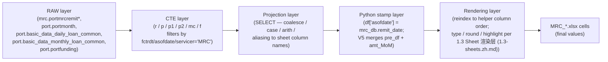
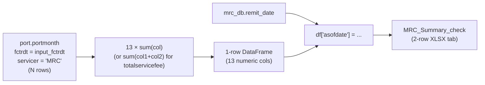
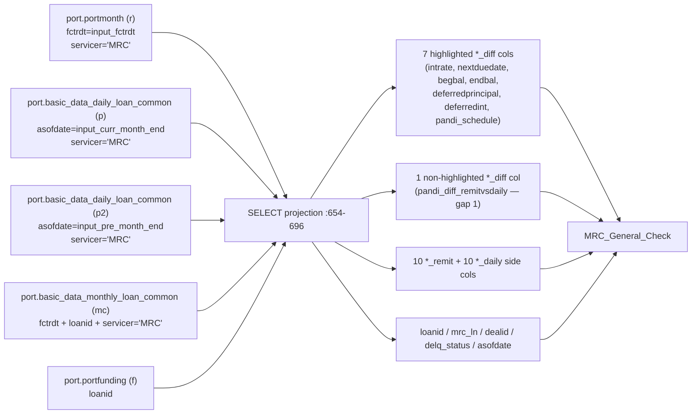
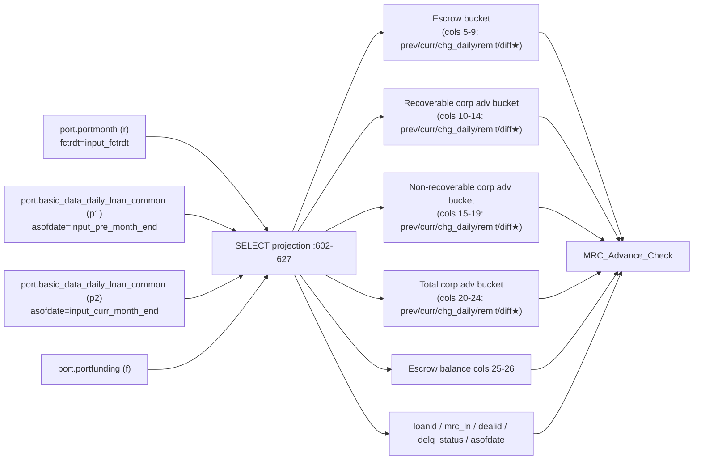
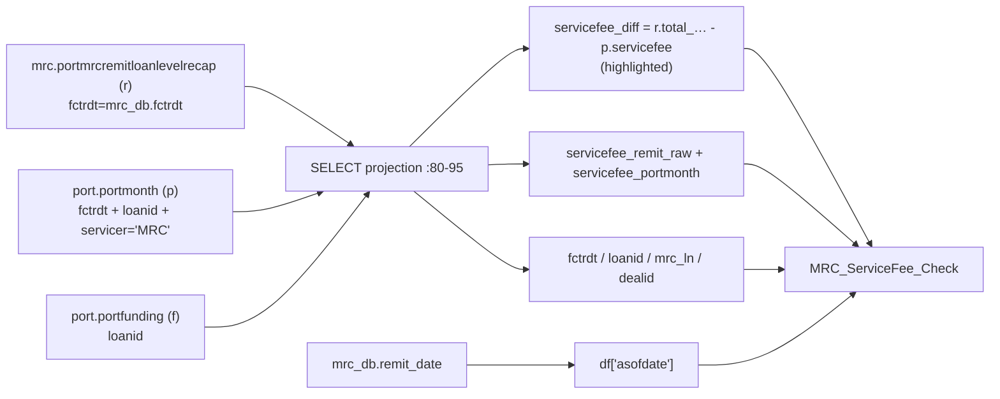
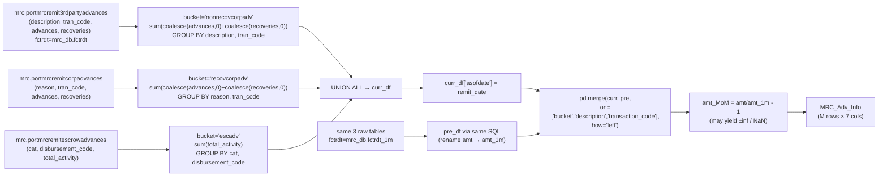

# 1.4 Field Definitions / 字段定义

> **文档定位 / Purpose**：对每张 MRC sheet 的每一个输出列，记录精确的字段级血缘——来自哪张源表的哪一列、经过哪个 CTE / 投影 / `coalesce` / 算术，最终成为单元格的值。这是 Stage 2 必须复现的契约；也是 1.5 验证规则 (1.5-rules.zh.md)（校验阈值）与 1.6 Baseline XLSX 行为 (1.6-baseline.zh.md)（基线捕获）的输入。
>
> **目标读者 / Audience**：Stage 1 评审人；未来基于本章写 Stage 2 MRC 重构引擎的工程师；接力 1.5 验证规则 (1.5-rules.zh.md) / 1.6 的 Copilot CLI agent。
>
> **修订历史 / Revision history**
>
> | 日期 | 作者 | 变更 |
> |---|---|---|
> | 2026-05-17 | Copilot CLI agent | v1 — 首版。源代码佐证：`flow/remit_validation/mrc_validation.py`（V1、V4、V5 内联 SQL + V5 pandas 合并）、`flow/remit_validation/servicer_validation_with_portdaily.py`（V2 `mrc_general_check`、V3 `mrc_adv_validation`），以及 `util/gen_remit_validation_report.py`（通过 1.3 Sheet 渲染层 (1.3-sheets.zh.md) 给出类型 / 取整契约）。 |

> **MRC 章节索引** （`docs/mrc/`）—— 完整定义见 [`_chapter-index.md`](_chapter-index.md)
>
> | # | 标题 | 文件 | 职责 |
> |---|---|---|---|
> | 1.0 | TOC & Scope / 章节地图与范围 | `1.0-toc.zh.md` | 入口与契约 |
> | 1.1 | Raw Data Layer / 原始数据层 | `1.1-rawdata.zh.md` | 上游表 + 时间锚 |
> | 1.2 | Dataflow Layer / 数据流层 | `1.2-dataflow.zh.md` | 端到端执行流水线 |
> | 1.3 | Sheet Rendering Layer / Sheet 渲染层 | `1.3-sheets.zh.md` | openpyxl 渲染契约 |
> | 1.4 | Field Definitions / 字段定义 | `1.4-fields.zh.md` | 字段级血缘 + 业务含义 |
> | 1.5 | Validation Rules / 验证规则 | `1.5-rules.zh.md` | 规则目录 |
> | 1.6 | Baseline XLSX Behavior / Baseline XLSX 行为 | `1.6-baseline.zh.md` | baseline 真值 |
> | 1.7 | User Review Gate / 用户走读评审 | （用户动作） | Stage 2 开闸点 |

---

## 1. Document role

本文是 MRC 章节的子章节 **1.4**。它只回答一个问题：**对 5 张 `MRC_*` sheet 上的每个输出单元格，由哪些原始表的哪些原始列、经过怎样的变换，产出最终值？**

它基于 1.2 数据流层 (1.2-dataflow.zh.md)（命名了 validator 和它们的 CTE）与 1.3 Sheet 渲染层 (1.3-sheets.zh.md)（给出列顺序 / 类型 / 取整 / 高亮契约）。1.4 字段定义 (1.4-fields.zh.md) 补足 1.2 抽象掉的**逐列计算逻辑**。1.4 的输出就是用来 (a) 在 Stage 2 复现每一个单元格、(b) 在 1.5 验证规则 (1.5-rules.zh.md) 定义校验阈值时清楚输入语义、以及 (c) 解读 1.6 Baseline XLSX 行为 (1.6-baseline.zh.md) 基线中发现 diff 的血缘知识。

它**不**：

- 重述 SQL CTE 拓扑——见 1.2 数据流层 (1.2-dataflow.zh.md)。
- 重述单元格渲染 / 高亮契约——见 1.3 Sheet 渲染层 (1.3-sheets.zh.md)。
- 定义校验阈值或 rule 语义——1.5 验证规则 (1.5-rules.zh.md)。

## 2. Scope and conventions

§§ 4–8 中使用的**逐列行格式**：

| Col # | Output column | Business Meaning | Source | Transform | Calculation Logic | Type / round | Notes |
|---|---|---|---|---|---|---|---|

- **Col #** 与 1.3 Sheet 渲染层 (1.3-sheets.zh.md) 可对照阅读）。
- **Output column** 是写入 XLSX 的列名（1.3 Sheet 渲染层 (1.3-sheets.zh.md) § 4–9 中 helper 声明的列名）。
- **Business Meaning** 解释字段业务含义：*这个单元格代表什么数 / 什么事实？分析人员怎样解读？* 不懂 SQL 的读者应该首先看这一列。
- **Source table.column** 使用 1.2 数据流层 (1.2-dataflow.zh.md) 的 CTE 别名（`r` = `port.portmonth`；`p` = 当月 `port.basic_data_daily_loan_common`；`p1` = 上月 `…common`；`p2` = ……见 § 2.1；`mc` = `port.basic_data_monthly_loan_common`；`f` = `port.portfunding`；V4 中 `r` = `mrc.portmrcremitloanlevelrecap`，`p` = `port.portmonth`，`f` = `port.portfunding`；V5 中 `mrc.portmrcremit3rdpartyadvances` / `…corpadvances` / `…escrowadvances`）。
- **Transform** 在表达式短时原样写出 SQL；`case` / `coalesce` 块一行内总结，并标注源代码行号。
- **Calculation Logic** 用自然语言 / 伪代码 / 集合记号 / 数学公式重述 Transform——明确列出源字段、运算顺序、取整、NULL 处理、回退规则、假设边界。让不读源码也能审计取值逻辑。记号约定：`∑`（SUM）、`∩`（逻辑 AND）、`∪`（逻辑 OR）、`−`（减法 / 集合差）、`⟶`（映射）、`≔`（赋值）。
- **Type / round** 复述 1.3 Sheet 渲染层 (1.3-sheets.zh.md) § 4–9 的 helper 声明契约：`money` 列 round 2dp、渲染为 `$#,##0.00`（整数值渲染为 `$#,##0`）；`float` 列 round 2dp 但**不**套 number_format；`date` 与 `str` 原样通过。
- **Notes** 记录 NULL 处理、"高亮 vs 不高亮"的不对称、类型 / 取整与语义不匹配的情况，以及对 1.3 Sheet 渲染层 (1.3-sheets.zh.md) § 10 各 gap 的指针。

### 2.1 CTE-alias compatibility warning (recap from 1.2 数据流层 (1.2-dataflow.zh.md))

两个 SQL 模板对"上月 / 当月"的 daily 快照用了**相反**的别名：

| Template | Previous month | Current month | Notes |
|---|---|---|---|
| `mrc_adv_validation` (V3) | `p1` | `p2` | 都是 `port.basic_data_daily_loan_common`，按 `asofdate` 过滤 |
| `mrc_general_check` (V2) | `p2` | `p` | `mc` = `port.basic_data_monthly_loan_common`（多一个 join 用于 `sched_pandi`） |

这一点已记录但**未修正**（1.2 数据流层 (1.2-dataflow.zh.md) § 4.2 + § 5.2）。下表用哪个别名就跟随源 SQL，所以 V2 的"source = p"意味着*当月*快照，而 V3 的"source = p1"意味着*上月*快照。**不要跨 sheet 套用这个约定**。

### 2.2 Parameter substitution

三个带参数的 SQL 模板都在调用时替换 3 个值（见 1.2 数据流层 (1.2-dataflow.zh.md) § 4.1 / § 5.1）：

| Placeholder | Value (baseline 2026-04-30) | Source |
|---|---|---|
| `input_fctrdt` | `2026-05-01` | `mrc_db.fctrdt` |
| `input_curr_month_end` | `2026-04-30` | `mrc_db.remit_date` |
| `input_pre_month_end` | `2026-03-31` | `mrc_db.pre_date` |
| (V5 only) `fctrdt_1m` | `2026-04-01` | `mrc_db.fctrdt_1m` |

每个 validator 末尾追加的 `asofdate` 列就是 `mrc_db.remit_date` = `input_curr_month_end` = baseline 的 `2026-04-30`。

## 3. Lineage overview

### 3.1 Lineage layers

**图 1.4.3 — 从原始表到最终 XLSX 单元格的 5 层血缘。**
来源：`mrc_validation.py:8-158`、`servicer_validation_with_portdaily.py:583-705`、`gen_remit_validation_report.py:1180-1293, 1610-1810`。

**说明（依规则 § 6.10）**

- **业务目的 / Business purpose**：把 5 层变换显式化，让任何一个单元格的值都能端到端被推理。Stage 2 必须复现这 5 层；1.5 验证规则 (1.5-rules.zh.md) 把阈值挂在**投影层**输出（diff 列）上；1.6 Baseline XLSX 行为 (1.6-baseline.zh.md) 基线捕获**渲染层**输出。
- **执行流程 / Execution flow**：原始行 → CTE 过滤（按 `fctrdt` / `asofdate` / `servicer='MRC'`）→ 投影（`coalesce` / `case` / 算术，带 **left-join** 语义——右侧缺行变 NULL，然后通常被 `coalesce` 成 `0`）→ Python 追加 `asofdate` 列（V5 还合并上月并算 MoM）→ 渲染器按 helper 列重排序、取整、格式化、高亮。
- **输入 / 输出 / Input / output**：**输入** = 5 张源表中给定 `fctrdt` / `asofdate` 的原始行；**输出** = 每张 sheet 的 DataFrame，列匹配 1.3 Sheet 渲染层 (1.3-sheets.zh.md) helper 声明（渲染器会重排序；helper 声明但 DataFrame 缺失的列会被填 `np.nan`，不过 MRC 的 validator 总是输出 helper 声明的全集）。
- **关键变换 / Key transformations**：`coalesce(x, 0)` 是 SQL 侧最常见的 NULL 处理——很多 `*_remit` 和 `*_daily` 列被 coalesce 到 0，让下游 diff 在一侧缺失时仍可定义；`case` 块用来在两侧都缺时**保留 NULL**（让 diff 单元格留空而不是错误地等于 0）；`mc.sched_pandi` 在 monthly 缺失时回退到 `r.pandi`。
- **依赖 / 假设 / Dependencies / assumptions**：假设 `fctrdt` / `asofdate` 对应的原始表已加载（1.1 原始数据层 (1.1-rawdata.zh.md) § 7）。

### 3.2 Reading the per-sheet tables

§§ 4–8 中每节包含两块：

1. **字段血缘表** — 每列一行，按 1.3 Sheet 渲染层 (1.3-sheets.zh.md) helper 列顺序。
2. **血缘图**（图 1.4.4 – 1.4.8）— 按来源 / 变换 family 对列做视觉分组，附依 § 6.10 的 5 条说明。

当某行的 transform 横跨多行 SQL 时，引用**首行**行号，transform 列写原始 SQL 摘录。任何与 1.3 Sheet 渲染层 (1.3-sheets.zh.md) gap 列表（那里 § 10）交叉的列，Notes 里写 `→ gap N`。

## 4. `MRC_Summary_check` fields

<!-- BUSINESS-PURPOSE-V1 -->
### 业务用途 / Business purpose

本节给 13 个 portfolio-level money sum 加 1
  个 `asofdate` stamp 提供**逐列血缘**——上游对应 SQL 哪一列、走的哪种聚合、
  在 1.3 Sheet 渲染层 (1.3-sheets.zh.md) § 5 里如何渲染。它的目标读者是想反问
  "这一列到底从哪儿来"的工程师 / auditor / 重写者。
- **它要回答的业务问题 / Business question it answers**：当 Summary 页某个汇总
  数字"看着不对"时，能否在 30 秒内定位到上游 SQL 的具体投影行？能否解释为什么
  这一列是 money 而不是 float？
- **与 1.3-sheets.zh.md 的分工 / Division with 1.3-sheets.zh.md**：1.3-sheets.zh.md § 5 描
  述"页面长什么样、为谁服务"；本节描述"每个数字是哪个 SQL 表达式产生的"——
  reverse-engineering 时优先读本节，业务分析时优先读 1.3-sheets.zh.md。
- **数据口径 / Population**：每列对应 SQL 的一个 `SUM(...)` 投影，作用域
  = 整个 MRC 投资组合的当期。
- **典型读者 / Audience**：Stage 2 重写者（要保持 cell-identity）、数据 audit
  组、上游 SQL 改动的 reviewer。
- **风险 / 对账动机 / Risk motivation**：13 个 money 列承载 reporting 与 treasury
  对账的全部依赖；任一列血缘断裂（SQL 改名 / 投影顺序变化 / round 策略变化）
  都会导致 cell-identity 测试失败。

### 4.1 Field lineage table

来源：`mrc_validation.py:8-36`。13 个数值列全部是来自 `port.portmonth` 的 `SUM(...)` 聚合，按 `servicer = 'MRC'` 与 `fctrdt = mrc_db.fctrdt` 过滤。第 14 列 `asofdate` 是 Python stamp。

| # | Output column | Business Meaning | Source | Transform | Calculation Logic | Type / round | Notes |
|---|---|---|---|---|---|---|---|
| 1 | `principalreceived` | 当期向投资人上报的、所有 MRC 服务贷款的应收本金总额（资产组合级 headline 现金流入）。 | `port.portmonth.principalreceived` | `sum(principalreceived)` `:15` | ∑ `principalreceived`，过滤 `servicer='MRC'` ∩ `fctrdt=input_fctrdt`。SQL SUM 忽略 NULL 行；筛集为空时返回 NULL → 由 1.3 Sheet 渲染层 (1.3-sheets.zh.md) § 4.2 渲染为 `$0`。 | money / 2 | 该 `fctrdt` 下所有 MRC loan 的 rollup |
| 2 | `interestreceived` | 当期应收利息总额。与第 1 列一起构成总现金流入。 | `port.portmonth.interestreceived` | `sum(interestreceived)` `:16` | ∑ `interestreceived`，同筛选条件。 | money / 2 | — |
| 3 | `escrowadv_chg` | 当期 escrow 垫款的净变动（servicer 替借款人垫付的 escrow 短缺）。正号 ≈ 多推垫付，负号 ≈ 回收。 | `port.portmonth.escrowadv_chg` | `sum(escrowadv_chg)` `:17` | ∑ `escrowadv_chg`。符号约定从原始列继承（单笔贷款的符号已编码方向）。 | money / 2 | escrow 垫款净变动 rollup |
| 4 | `corpadvrec_chg` | 当期**可回收**公司垫款的净变动（预期能从借款人 / 处置款回收）。 | `port.portmonth.corpadvrec_chg` | `sum(corpadvrec_chg)` `:18` | ∑ `corpadvrec_chg`。 | money / 2 | 可回收 corp 垫款变动 |
| 5 | `corpadvnonrec_chg` | 当期**不可回收**公司垫款的净变动（由 servicer 承担、影响 P&L）。 | `port.portmonth.corpadvnonrec_chg` | `sum(corpadvnonrec_chg)` `:19` | ∑ `corpadvnonrec_chg`。 | money / 2 | 不可回收 corp 垫款变动 |
| 6 | `corpadvtotal_chg` | 当期**总**公司垫款净变动（rec + nonrec），按 portmonth 记录。理论上 ≈ 第 4 + 第 5 列，差异是有用的一致性检查。 | `port.portmonth.corpadvtotal_chg` | `sum(corpadvtotal_chg)` `:20` | ∑ `corpadvtotal_chg`。**不是**由第 4 + 第 5 列推导——直接来自一个独立原始列，所以对 (col 4 + col 5) 的对账是有意义的一致性检查。 | money / 2 | 全部 corp 垫款变动 |
| 7 | `servicefee` | servicer 当期应得核心服务费（不含其他费用）。 | `port.portmonth.servicefee` | `sum(servicefee)` `:21` | ∑ `servicefee`。SUM 语义下 NULL 行被排除。 | money / 2 | servicer fee 分项 |
| 8 | `otherfees` | 核心服务费外的其他费用合计（滞纳金、NSF、辅助收入）。 | `port.portmonth.otherfees` | `sum(otherfees)` `:22` | ∑ `otherfees`。 | money / 2 | 非 fee 项归到这里 |
| 9 | `totalservicefee` | servicer 当期总报酬（服务费 + 其他费用），按**逐行**先加再 SUM 计算。任一输入 NULL 时与 (col 7 + col 8) 不等。 | `port.portmonth.{servicefee,otherfees}` | `sum(servicefee + otherfees)` `:23` — **先加再 sum** | **步骤 1**：每行算 `servicefee + otherfees`。PostgreSQL 语义：任一侧 NULL 则 `a + b` = NULL → 该行从 sum 中丢弃。**步骤 2**：对每行结果做 ∑。未应用 `coalesce`。代数表达：`total ≔ ∑_{r: r.servicefee ≠ NULL ∩ r.otherfees ≠ NULL} (r.servicefee + r.otherfees)`——任一行恰好一侧 NULL 时与 `∑ servicefee + ∑ otherfees` 不等。1.5 验证规则 (1.5-rules.zh.md) § 10 政策 8——需与业务确认这种排除是否有意。 | money / 2 | 不是第 7 列 + 第 8 列；只有没有 NULL 时 `sum` 才线性，所以代数等价；SQL 形式意味着任一侧为 NULL 的行会让 sum 里这一项变 NULL（没 `coalesce`） |
| 10 | `subremit` | 子级（次级 / junior tranche）汇款金额。 | `port.portmonth.subremit` | `sum(subremit)` `:24` | ∑ `subremit`。 | money / 2 | 子汇款金额 |
| 11 | `totremit` | 当期向投资人汇出的总金额（headline 应付）。 | `port.portmonth.totremit` | `sum(totremit)` `:25` | ∑ `totremit`。 | money / 2 | 总汇款 |
| 12 | `beginningbalance` | 汇款期初的总未偿本金 = 上月末 UPB（所有 MRC loan）。 | `port.portmonth.prevbal` | `sum(prevbal) as beginningbalance` `:26` | ∑ `prevbal`，输出别名 `beginningbalance`。源列名是 `prevbal`，在投影时重命名。 | money / 2 | 重命名：源 = `prevbal` |
| 13 | `endingbalance` | 汇款期末的总未偿本金（所有 MRC loan）。 | `port.portmonth.balance` | `sum(balance) as endingbalance` `:27` | ∑ `balance`，输出别名 `endingbalance`。源列名是 `balance`。 | money / 2 | 重命名：源 = `balance` |
| 14 | `asofdate` | 报告的 "as-of" 锚定日——对一次 run 的所有 MRC sheet 每行相同。锚定整个 remit 周期。 | (Python) | `data_df['asofdate'] = mrc_db.remit_date` `:32` | `asofdate ≔ mrc_db.remit_date`（SQL 之后的 Python 赋值，无 SQL 贡献）。baseline = `2026-04-30`。 | date / — | baseline 下 = `2026-04-30` |

### 4.2 Lineage diagram

**图 1.4.4 — `MRC_Summary_check` 逐列血缘。**
来源：`mrc_validation.py:8-36`。

**说明（依规则 § 6.10）**

- **业务目的 / Business purpose**：当月现金流与余额的资产组合级 rollup——分析人员首先用来确认头部合计能与总账 / 会计源对得上的页。
- **执行流程 / Execution flow**：一次 SQL，`port.portmonth` 上按 `servicer='MRC'` 与所选 `fctrdt` 过滤，产出 13 个 sum；Python 追加 `asofdate`；sheet 渲染 1 数据行。
- **输入 / 输出 / Input / output**：**输入** = `port.portmonth` 上该 `fctrdt` 的所有 MRC 行；**输出** = 1 × 14 DataFrame。
- **关键变换 / Key transformations**：仅 `sum`；`totalservicefee` 用 `sum(servicefee + otherfees)` 而不是 `sum(servicefee) + sum(otherfees)`——任一分项为 NULL 时两者不同，因为 PostgreSQL 的 `+` 任一为 NULL 即 NULL，所以 `otherfees IS NULL` 的行会从 `totalservicefee` 中被**排除**但仍被**计入**第 7 列。Stage 2 必须保留这个细节以保 cell identity。
- **依赖 / 假设 / Dependencies / assumptions**：假设 `port.portmonth` 已为目标 `fctrdt` 加载（1.1 原始数据层 (1.1-rawdata.zh.md) § 4）；零行会让 13 个 NULL 渲染成 `$0`（1.3 Sheet 渲染层 (1.3-sheets.zh.md) § 4.2——空 money 单元格强转 0）。

## 5. `MRC_General_Check` fields

<!-- BUSINESS-PURPOSE-V1 -->
### 业务用途 / Business purpose

本节给 35 列（含 7 个高亮 diff 列）提供
  **逐列血缘 + transform 公式 + 业务含义**——是"为什么这一列在 General sheet
  上"问题的权威答案。
- **它要回答的业务问题 / Business question it answers**：
    - 高亮的 7 个 diff 列各自的计算公式是什么？为什么 `pandi_diff_remitvsdaily`
      存在但不高亮？
    - `intrate_diff` 是百分点差还是相对差？取整到几位？
    - `nextduedate_diff` 为什么声明为 `float` 但其实是天数差？（gap 2）
- **与 1.3-sheets.zh.md 的分工 / Division with 1.3-sheets.zh.md**：1.3-sheets.zh.md § 6 描
  述渲染层（哪列高亮、用什么样式）；本节描述上游来源与变换公式（哪列来自哪个
  CTE、走哪种 join、用什么 transform）——两侧 cross-reference 紧密耦合。
- **数据口径 / Population**：每列对应一笔贷款的一个属性 / 差异；行数 = MRC 投资
  组合贷款数。
- **典型读者 / Audience**：Stage 2 重写者、validator-逻辑 reviewer、加新 diff 列
  时的设计者。
- **风险 / 对账动机 / Risk motivation**：7 个高亮列承载 ~80% 实际 ops 工单的源头；
  本节的 Transform 公式是 ops 工单中"为什么红"的法律依据，**任何 transform
  公式变更**都必须在 decisions.md 留痕。

### 5.1 Field lineage table

来源：`servicer_validation_with_portdaily.py:635-705`。CTE：`r` = `port.portmonth`（按 `fctrdt`、MRC 过滤）；`p` = `port.basic_data_daily_loan_common`，`asofdate = input_curr_month_end`、MRC；`p2` = 同上但 `input_pre_month_end`、MRC；`mc` = `port.basic_data_monthly_loan_common`（按 `fctrdt + loanid + servicer='MRC'` 连接）；`f` = `port.portfunding`（按 `loanid` 连接）。

| # | Output column | Business Meaning | Source | Transform | Calculation Logic | Type / round | Notes |
|---|---|---|---|---|---|---|---|
| 1 | `loanid` | 内部唯一贷款 ID——分析人员钻取单笔贷款时的主键。 | `r.loanid` | direct `:654` | `loanid ≔ r.loanid`。原样通过。 | str / — | join key |
| 2 | `mrc_ln` | MRC 侧的服务贷款号——便于与 MRC 自身系统交叉比对。 | `r.svcloanid` | `r.svcloanid as mrc_ln` `:655` | `mrc_ln ≔ r.svcloanid`。投影时重命名。 | str / — | servicer loan id |
| 3 | `dealid` | 贷款所属的 deal / 资产池 / 证券化标识。portmonth 的 `dealid` 为 NULL 时回退到 portfunding。 | `r.dealid` / `f.dealid` | `coalesce(r.dealid, f.dealid)` `:656` | `dealid ≔ first-non-NULL(r.dealid, f.dealid)`。查找顺序：portmonth → portfunding。两侧都 NULL 时单元格留空。 | str / — | `r.dealid` 为 NULL 时回退 portfunding |
| 4 | `intrate_remit` | remit 上报的票面利率。 | `r.intrate` | direct `:657` | `intrate_remit ≔ r.intrate`。原样通过。 | float / 2 | 声明为 `float`，不是 `percentage`——见 1.3 Sheet 渲染层 (1.3-sheets.zh.md) § 10 gap 相邻 |
| 5 | `intrate_daily` | 当月 daily 资产快照中的票面利率。 | `p.interest_rate` | `p.interest_rate as intrate_daily` `:678` | `intrate_daily ≔ p.interest_rate`。重命名。 | float / 2 | 当月 daily 快照 |
| 6 | `intrate_diff_remitvsdaily` ★ | **高亮**利率不匹配标志——非零即代表该 loan 的 remit 利率与 daily 快照不一致。 | `r.intrate` – `p.interest_rate` | `r.intrate - p.interest_rate` `:685` | `intrate_diff ≔ r.intrate − p.interest_rate`。NULL-safe SQL `−`：任一侧 NULL → 结果 NULL（单元格空、不高亮）。无 coalesce。 | float / 2 | **高亮**；任一侧 NULL 则 NULL |
| 7 | `nextduedate_remit` | remit 上的下次应付到期日。 | `r.nextduedate` | direct `:658` | `nextduedate_remit ≔ r.nextduedate`。原样通过。 | date / — | — |
| 8 | `nextduedate_daily` | daily 快照中的下次应付到期日。 | `p.nextduedate` | direct `:666` | `nextduedate_daily ≔ p.nextduedate`。原样通过。 | date / — | — |
| 9 | `nextduedate_diff_remitvsdaily` ★ | **高亮**日期一致性二值标志——`1.00` 表不一致、`0.00` 表一致。**不是天数**。 | `r.nextduedate`、`p.nextduedate` | `case when r.nextduedate = p.nextduedate then 0 else 1 end` `:686` | `nextduedate_diff ≔ (r.nextduedate = p.nextduedate) ? 0 : 1`。存为 `float`，渲染成 `0.00` / `1.00`。NULL 输入：NULL 与值的 `=` 结果是 NULL（不是 TRUE）→ `CASE` 走 ELSE 分支 → `1`。所以 daily 缺失会渲染为 `1.00`（标为不匹配）。 | float / 2 | **高亮**；二元 0/1 指示器——**不是天数**；类型 `float` + `round_to=2` 会渲染成 `0.00`/`1.00`（1.3 Sheet 渲染层 (1.3-sheets.zh.md) § 10 gap 2） |
| 10 | `begbal_remit` | 汇款期初的本金余额（按 remit）。 | `r.prevbal` | `r.prevbal as begbal_remit` `:659` | `begbal_remit ≔ r.prevbal`。重命名。 | money / 2 | — |
| 11 | `begbal_daily` | 汇款期初的本金余额（按 daily 快照）——取自**上月末** daily 快照（上月末 = 当月初）。 | `p2.principalbalance` | `p2.principalbalance as begbal_daily` `:667` | `begbal_daily ≔ p2.principalbalance`，其中 `p2` = `input_pre_month_end` 时点的 daily 快照。重命名。 | money / 2 | 取**上月** CTE（`p2`）——命名意外："begbal" 是汇款期初余额 = 上月期末 |
| 12 | `begbal_diff_remitvsdaily` ★ | **高亮**期初余额不一致（remit vs 上月末 daily）。 | `r.prevbal`、`p2.principalbalance` | `r.prevbal - p2.principalbalance` `:681` | `begbal_diff ≔ r.prevbal − p2.principalbalance`。NULL-safe `−`：任一侧 NULL → NULL → 空白 → 不高亮。 | money / 2 | **高亮**；任一侧 NULL 则 NULL |
| 13 | `endbal_remit` | 汇款期末本金余额（按 remit）。 | `r.balance` | `r.balance as endbal_remit` `:660` | `endbal_remit ≔ r.balance`。重命名。 | money / 2 | — |
| 14 | `endbal_daily` | 汇款期末本金余额（按当月 daily 快照）。 | `p.principalbalance` | `p.principalbalance as endbal_daily` `:668` | `endbal_daily ≔ p.principalbalance`，其中 `p` = `input_curr_month_end` 时点的 daily 快照。重命名。 | money / 2 | 当月 daily |
| 15 | `endbal_diff_remitvsdaily` ★ | **高亮**期末余额不一致（remit vs 当月末 daily）。 | `r.balance`、`p.principalbalance` | `r.balance - p.principalbalance` `:682` | `endbal_diff ≔ r.balance − p.principalbalance`。NULL-safe `−`。 | money / 2 | **高亮** |
| 16 | `principal_remit` | 单 loan 当期 remit 已收本金（与 Summary 第 1 列同性质但 loan 粒度）。 | `r.principalreceived` | `r.principalreceived as principal_remit` `:661` | `principal_remit ≔ r.principalreceived`。重命名。 | money / 2 | — |
| 17 | `interest_remit` | 单 loan 当期 remit 已收利息（与 Summary 第 2 列同性质但 loan 粒度）。 | `r.interestreceived` | `r.interestreceived as interest_remit` `:662` | `interest_remit ≔ r.interestreceived`。重命名。 | money / 2 | — |
| 18 | `prin_bal_diff_remit` | remit 侧自检：本金 roll-forward 等式应为 0：`(期初) − (期末) − (已收本金) = 0`。非零 ⇒ remit 行在做任何跨源对比之前就已经自相矛盾。 | `r.prevbal`、`r.balance`、`r.principalreceived` | `r.prevbal - r.balance - coalesce(r.principalreceived, 0)` `:680` | `prin_bal_diff_remit ≔ r.prevbal − r.balance − coalesce(r.principalreceived, 0)`。`coalesce` 让没有本金已收（NULL → 0）时 diff 仍可定义。不高亮。 | money / 2 | 汇款侧自检：本金余额 roll-forward 等式 |
| 19 | `deferredprincipal_remit` | 递延本金余额（按 remit）。 | `r.deferredprin` | `r.deferredprin as deferredprincipal_remit` `:664` | `deferredprincipal_remit ≔ r.deferredprin`。重命名。 | money / 2 | — |
| 20 | `deferredprincipal_daily` | 递延本金余额（按当月 daily 快照）。 | `p.deferredprincipalbalance` | direct `:669` | `deferredprincipal_daily ≔ p.deferredprincipalbalance`。原样通过。 | money / 2 | — |
| 21 | `deferredprincipal_diff_remitvsdaily` ★ | **高亮**递延本金不一致。**两侧 NULL→0**——缺数据时伪装为 "match"，是已知语义风险。 | `r.deferredprin`、`p.deferredprincipalbalance` | `coalesce(r.deferredprin, 0) - coalesce(p.deferredprincipalbalance, 0)` `:683` | `deferredprincipal_diff ≔ coalesce(r.deferredprin, 0) − coalesce(p.deferredprincipalbalance, 0)`。两侧 NULL 都变 0 ⇒ diff 始终是数值 ⇒ 两侧都缺数据的 loan 会显示 `0.00`（静默"match"）。1.5 验证规则 (1.5-rules.zh.md) § 10 政策 5。 | money / 2 | **高亮**；两侧 NULL→0 |
| 22 | `deferredint_remit` | 递延利息余额（按 remit）。 | `r.deferredint` | direct `:665` | `deferredint_remit ≔ r.deferredint`。原样通过。 | money / 2 | — |
| 23 | `deferredint_daily` | 递延利息余额（按当月 daily 快照）。 | `p.deferredinterestbalance` | direct `:670` | `deferredint_daily ≔ p.deferredinterestbalance`。原样通过。 | money / 2 | — |
| 24 | `deferredint_diff_remitvsdaily` ★ | **高亮**递延利息不一致。同第 21 列的 NULL→0 注意点。 | `r.deferredint`、`p.deferredinterestbalance` | `coalesce(r.deferredint, 0) - coalesce(p.deferredinterestbalance, 0)` `:684` | `deferredint_diff ≔ coalesce(r.deferredint, 0) − coalesce(p.deferredinterestbalance, 0)`。同第 21 列的 NULL-mask-as-match 模式。 | money / 2 | **高亮** |
| 25 | `pandi_remit` | remit 上的 P&I（本金+利息）已收总额。与第 30 列 `pandireceived_daily` 命名相近但不同源。 | `r.pandireceived` | `r.pandireceived as pandi_remit` `:663` | `pandi_remit ≔ r.pandireceived`。重命名。源 = `pandireceived`；输出 = `pandi_remit`。 | money / 2 | 重命名：源是 `pandireceived`，输出名是 `pandi_remit`（与 `pandireceived_daily` 不同）——Stage 2 注意 |
| 26 | `pandiexpected_daily` | daily 快照中的 scheduled P&I——该 loan 当期*本应*支付多少。 | `p.schedule_pandi_daily` | `p.schedule_pandi_daily as pandiexpected_daily` `:671` | `pandiexpected_daily ≔ p.schedule_pandi_daily`。重命名。 | money / 2 | — |
| 27 | `pandi_schedule_diff_remitvsdaily` ★ | **高亮** scheduled-vs-actual P&I 不一致。**回退语义**：monthly 缺失时从 monthly schedule 静默回退到 remit-side schedule——含义从"月度 vs daily schedule"切换为"remit vs daily schedule"。 | `mc.sched_pandi` / `r.pandi`、`p.schedule_pandi_daily` | `coalesce(mc.sched_pandi, r.pandi) - p.schedule_pandi_daily` `:691` | `pandi_schedule_diff ≔ first-non-NULL(mc.sched_pandi, r.pandi) − p.schedule_pandi_daily`。**回退梯子**：先 monthly，缺则 remit。一旦 `mc` 在该 `(loanid, fctrdt)` 缺失，diff 含义静默改变。1.5 验证规则 (1.5-rules.zh.md) § 10 政策 3——Stage 2 应统计回退触发次数。 | money / 2 | **高亮**；monthly `mc` 行缺失时回退到 `r.pandi`——1.6 Baseline XLSX 行为 (1.6-baseline.zh.md) 需关注的静默回退 |
| 28 | `principalreceived_daily` | daily 快照中的 MTD 已收本金（截至当月末）。 | `p.principalpaidmtd` | `p.principalpaidmtd as principalreceived_daily` `:672` | `principalreceived_daily ≔ p.principalpaidmtd`。重命名。 | money / 2 | 重命名 |
| 29 | `interestreceived_daily` | daily 快照中的 MTD 已收利息。 | `p.interestpaidmtd` | `p.interestpaidmtd as interestreceived_daily` `:673` | `interestreceived_daily ≔ p.interestpaidmtd`。重命名。 | money / 2 | 重命名 |
| 30 | `pandireceived_daily` | daily 快照中的 MTD 已收 P&I，**NULL 保留**：两个分项都未上报时单元格空白（区分"未上报"与"付了 0"）。 | `p.principalpaidmtd`、`p.interestpaidmtd` | `case when both NULL then NULL else coalesce(p,0)+coalesce(i,0)` `:674-677` | `pandireceived_daily ≔ IF (p.principalpaidmtd IS NULL ∩ p.interestpaidmtd IS NULL) THEN NULL ELSE coalesce(p.principalpaidmtd,0) + coalesce(p.interestpaidmtd,0)`。NULL 保留守卫防止"0 paid"静默伪装为有数据。 | money / 2 | NULL 保留 |
| 31 | `pandi_diff_remitvsdaily` | remit-vs-daily 在 MTD-paid 粒度的 P&I diff。**故意不高亮**——`pandi_schedule_diff`（第 27 列）才是规范信号，本列在月末边界上合理漂移。 | `r.pandireceived`、`p.principalpaidmtd`、`p.interestpaidmtd` | `case when both NULL then NULL else coalesce(r.pandireceived,0)-(coalesce(p,0)+coalesce(i,0))` `:687-690` | `pandi_diff ≔ IF (p.principalpaidmtd IS NULL ∩ p.interestpaidmtd IS NULL) THEN NULL ELSE coalesce(r.pandireceived,0) − (coalesce(p.principalpaidmtd,0) + coalesce(p.interestpaidmtd,0))`。同第 30 列的 NULL 保留守卫。单元格渲染但**始终**不高亮——1.5 验证规则 (1.5-rules.zh.md) R9。 | money / 2 | 尽管是 remit-vs-daily diff 但**不高亮**——1.3 Sheet 渲染层 (1.3-sheets.zh.md) § 10 gap 1 |
| 32 | `pandi_paid_times_remit` | remit 上报已付 P&I 与 scheduled P&I 的比值——`1.0` 表按计划付清；`>1` 超付；`<1` 少付。scheduled 为 0 时空白（避免除零）。 | `r.pandireceived`、`p.schedule_pandi_daily` | `case when coalesce(p.schedule_pandi_daily,0)=0 then null else r.pandireceived / p.schedule_pandi_daily` `:692` | `pandi_paid_times_remit ≔ IF coalesce(p.schedule_pandi_daily,0) = 0 THEN NULL ELSE r.pandireceived / p.schedule_pandi_daily`。除零守卫。NULL `r.pandireceived` 透过 `/` 传播为 NULL。 | float / 2 | 付款倍数；分母 0 则 NULL |
| 33 | `pandi_paid_times_daily` | daily 侧已付 P&I 与 scheduled P&I 的比值（第 32 列的 daily 镜像）。 | `p.principalpaidmtd`、`p.interestpaidmtd`、`p.schedule_pandi_daily` | `case when denom=0 or (both NULL) then null else (coalesce(p,0)+coalesce(i,0)) / p.schedule_pandi_daily` `:693-696` | `pandi_paid_times_daily ≔ IF coalesce(p.schedule_pandi_daily,0) = 0 ∪ (p.principalpaidmtd IS NULL ∩ p.interestpaidmtd IS NULL) THEN NULL ELSE (coalesce(p.principalpaidmtd,0) + coalesce(p.interestpaidmtd,0)) / p.schedule_pandi_daily`。双条件 NULL 守卫。 | float / 2 | 付款倍数（daily 侧） |
| 34 | `delinquency_status_mba` | MBA 编码的逾期分桶（如 `0`/`30`/`60`/`90`/`120+`）——daily 快照原样透传。 | `p.delq_status` | `p.delq_status as delinquency_status_mba` `:679` | `delinquency_status_mba ≔ p.delq_status`。重命名。无映射 / 规范化。 | str / — | MBA 编码状态 |
| 35 | `asofdate` | 汇款 "as-of" 锚定日——该 sheet 每行同值。 | (Python) | `re_df['asofdate'] = mrc_db.remit_date` `mrc_validation.py:65` | `asofdate ≔ mrc_db.remit_date`（SQL 之后 Python 赋值）。baseline = `2026-04-30`。 | date / — | baseline 下 = `2026-04-30` |

高亮列（★）：见 1.3 Sheet 渲染层 (1.3-sheets.zh.md) § 6.1——`intrate_diff_remitvsdaily`、`nextduedate_diff_remitvsdaily`、`begbal_diff_remitvsdaily`、`endbal_diff_remitvsdaily`、`deferredprincipal_diff_remitvsdaily`、`deferredint_diff_remitvsdaily`、`pandi_schedule_diff_remitvsdaily`。`pandi_diff_remitvsdaily` 故意**不**高亮。

### 5.2 Lineage diagram

**图 1.4.5 — `MRC_General_Check` 逐列血缘。**
来源：`servicer_validation_with_portdaily.py:635-705`；1.2 数据流层 (1.2-dataflow.zh.md) § 5。

**说明（依规则 § 6.10）**

- **业务目的 / Business purpose**：逐 loan 对账利率、下次到期日、本金余额（期初 / 期末）、deferred principal、deferred interest、scheduled P&I 与已收 P&I 在月度 remit 与 daily 资产快照之间的差异——是工作流核心的 loan 级 diff sheet。
- **执行流程 / Execution flow**：5 表 LEFT JOIN（`r`/`p`/`p2`/`mc`/`f`，按 `loanid`）；投影产出 34 列；Python 追加 `asofdate`；渲染器按 35 列 helper 重排序并高亮 7 个 diff 列（1.3 Sheet 渲染层 (1.3-sheets.zh.md) § 6.2）。
- **输入 / 输出 / Input / output**：**输入** = 5 张源表所选锚点下的 MRC 行；**输出** = N-loan × 35-col DataFrame，N 为 `port.portmonth` 上该 `fctrdt` 下 MRC loan 数。
- **关键变换 / Key transformations**：deferred 与 `pandi_diff` 行的 `coalesce(x, 0)` 让一侧为 0/NULL 时 diff 仍可计算；`pandi_diff_remitvsdaily` 与 `pandireceived_daily` 的 `case … is null` 在 `p.principalpaidmtd` 与 `p.interestpaidmtd` 都 NULL 时**保留 NULL**（让 diff 留空而不是错误等于 `r.pandireceived`）；`pandi_schedule_diff` 优先用 monthly `mc.sched_pandi`，缺失时回退到 `r.pandi`（remit 侧 schedule）；`nextduedate_diff` 是**二元 0/1 指示器**，不是天数。
- **依赖 / 假设 / Dependencies / assumptions**：假设 `p2` 与 `p` 快照在两个锚点日都存在；假设 `mc` 在该 `fctrdt` 上存在（否则静默回退会掩盖缺失的 monthly 数据）；假设 `loanid` 在 5 张表中是无歧义主键；左连接语义会在 `p` / `p2` 行无匹配时把 `*_daily` 列填 NULL——这些行仍出现在 sheet 上，只是 diff 单元格留空。

### 5.3 Edge-case columns

下面三列的类型 / 取整 / 高亮选择与计算语义不完全匹配，值得专门关注：

1. **`nextduedate_diff_remitvsdaily`** — 语义上是**二元** 0/1 指示器（日期是否相等），但存储为 `float` 并被渲染器 round 2dp。单元格渲染成 `0.00` / `1.00`。1.3 Sheet 渲染层 (1.3-sheets.zh.md) § 10 gap 2。
2. **`pandi_diff_remitvsdaily`** — 语义上是 remit-vs-daily diff（按理应与另 7 列一起高亮），但被**排除**出高亮列表。屏幕上"P&I 不一致"的预设信号是 `pandi_schedule_diff_remitvsdaily`（与月度 schedule 对比）；`pandi_diff_remitvsdaily` 是与 MTD daily 已收金额对比，月末边界上可能合理不同。1.3 Sheet 渲染层 (1.3-sheets.zh.md) § 10 gap 1。
3. **`pandi_schedule_diff_remitvsdaily`** — 在 monthly 缺失时从 `mc.sched_pandi` 静默回退到 `r.pandi`。一旦回退触发，diff 变成 `r.pandi - p.schedule_pandi_daily`，是 remit-stamped schedule 与 daily-stamped schedule（*同一概念的两次快照*）之间对比。1.6 Baseline XLSX 行为 (1.6-baseline.zh.md) 基线应统计回退触发的行数。

## 6. `MRC_Advance_Check` fields

<!-- BUSINESS-PURPOSE-V1 -->
### 业务用途 / Business purpose

本节给 27 列（含 4 个高亮 advance-bucket diff
  列）提供**逐列血缘 + 计算公式 + 业务含义**——着重澄清 advance bucket 之间的
  会计含义差异（recov vs non-recov vs escrow vs total）。
- **它要回答的业务问题 / Business question it answers**：
    - 4 个 advance diff 列的计算口径是什么？是 `remit − daily_curr` 还是
      `remit − daily_chg`？
    - 第 14 列 `recovcorpadv_diff_*` 与第 10-13 列的 `reccorpadvance_*` 前缀
      不同到底是什么意思？（gap 3）
    - 哪些列只来自 daily 系统？哪些列只来自 remit？哪些是计算列？
- **与 1.3-sheets.zh.md 的分工 / Division with 1.3-sheets.zh.md**：1.3-sheets.zh.md § 7 解
  释"为什么这 4 列要高亮"（业务理由）；本节解释"这 4 列具体怎么算出来"（公式）。
- **数据口径 / Population**：每列对应一笔有 advance 活动的贷款的一个 advance
  bucket 属性 / 差异。
- **典型读者 / Audience**：advance recovery 团队的工程对接人、会计分类争议
  调解人、bucket 重命名时的影响评估者。
- **风险 / 对账动机 / Risk motivation**：advance bucket 分类直接决定 P&L 与
  loss reserve 计算；本节的 Transform 公式是会计分类争议的客观依据，
  **bucket 公式改动必须经 decisions.md 留痕 + investor 沟通**。

### 6.1 Field lineage table

来源：`servicer_validation_with_portdaily.py:583-632`。CTE：`r` = `port.portmonth`（按 MRC + `fctrdt` 过滤）；`p1` = `port.basic_data_daily_loan_common`，`asofdate=input_pre_month_end`；`p2` = 同上但 `input_curr_month_end`；`f` = `port.portfunding`。**注意 V3 与 V2 别名相反**（1.2 数据流层 (1.2-dataflow.zh.md) § 4.2）：V3 中 `p1`=prev、`p2`=curr；V2 中 `p2`=prev、`p`=curr。

| # | Output column | Business Meaning | Source | Transform | Calculation Logic | Type / round | Notes |
|---|---|---|---|---|---|---|---|
| 1 | `loanid` | 内部唯一贷款 ID——钻取主键。 | `r.loanid` | direct `:602` | `loanid ≔ r.loanid`。原样通过。 | str / — | — |
| 2 | `mrc_ln` | MRC 侧的服务贷款号。 | `r.svcloanid` | aliased `:603` | `mrc_ln ≔ r.svcloanid`。重命名。 | str / — | — |
| 3 | `dealid` | deal / 资产池标识；portmonth 的 `dealid` 为 NULL 时回退 portfunding。 | `r.dealid` / `f.dealid` | `coalesce(r.dealid, f.dealid)` `:604` | `dealid ≔ first-non-NULL(r.dealid, f.dealid)`。 | str / — | — |
| 4 | `delq_status` | MBA 逾期分桶，取自**上月** daily 快照——便于跟踪 loan roll-forward。 | `p1.delq_status` | `p1.delq_status as delq_status` `:605` | `delq_status ≔ p1.delq_status`，`p1` = `input_pre_month_end` 时点的 daily 快照。**注意**：V3 用 `p1`=prev（与 V2 别名约定相反）。 | str / — | 取**上月** daily |
| 5 | `escrowadv_prev_daily` | 期初（上月末）escrow 垫款余额，缺值默认为 0。 | `p1.escrow_advance_balance` | `coalesce(p1.escrow_advance_balance, 0)` `:606` | `escrowadv_prev_daily ≔ coalesce(p1.escrow_advance_balance, 0)`。NULL → 0。 | money / 2 | NULL→0 |
| 6 | `escrowadv_curr_daily` | 期末（当月末）escrow 垫款余额，缺值默认为 0。 | `p2.escrow_advance_balance` | `coalesce(p2.escrow_advance_balance, 0)` `:607` | `escrowadv_curr_daily ≔ coalesce(p2.escrow_advance_balance, 0)`。 | money / 2 | NULL→0 |
| 7 | `escrowadv_chg_daily` | 单 loan daily 侧 escrow 垫款余额的期内变动。loan 不同时出现在两个快照时空白。 | (col 5 & 6) | `case when p1.loanid is null or p2.loanid is null then null else escrowadv_curr_daily - escrowadv_prev_daily` `:608` | `escrowadv_chg_daily ≔ IF (p1.loanid IS NULL ∪ p2.loanid IS NULL) THEN NULL ELSE escrowadv_curr_daily − escrowadv_prev_daily`。快照存在性守卫。 | money / 2 | 任一快照缺失则 NULL |
| 8 | `escadv_remit` | remit 上报的 escrow 垫款变动（符号约定与 daily 相反），缺值默认为 0。 | `r.escrowadv_chg` | `coalesce(r.escrowadv_chg, 0) as escadv_remit` `:620` | `escadv_remit ≔ coalesce(r.escrowadv_chg, 0)`。 | money / 2 | 重命名 |
| 9 | `escadv_diff_remitvsdaily` ★ | **高亮** escrow 垫款桶对账：若记录正确，daily 侧变动与 remit 侧变动之和为 0（因为它们从相反方向编码同一活动）。 | cols 7 & 8 | `escrowadv_chg_daily + escadv_remit` `:622` | `escadv_diff ≔ escrowadv_chg_daily + escadv_remit`——**加法**，不是减法。符号约定：daily 余额增长记正；remit 同笔活动记负——正确记录时和应为 0。 | money / 2 | **高亮**；用的是**加法**不是减法——符号约定：daily 侧余额增长记正、remit 侧同笔活动记负（垫付减少 payable）——两者之和即残差。Stage 2 必须保留正负号 |
| 10 | `reccorpadvance_prev_daily` | 期初可回收公司垫款余额。 | `p1.reccorpadvance` | `coalesce(p1.reccorpadvance, 0)` `:609` | `reccorpadvance_prev_daily ≔ coalesce(p1.reccorpadvance, 0)`。 | money / 2 | — |
| 11 | `reccorpadvance_curr_daily` | 期末可回收公司垫款余额。 | `p2.reccorpadvance` | `coalesce(p2.reccorpadvance, 0)` `:610` | `reccorpadvance_curr_daily ≔ coalesce(p2.reccorpadvance, 0)`。 | money / 2 | — |
| 12 | `reccorpadvance_chg_daily` | 单 loan daily 侧可回收公司垫款期内变动。 | (col 10 & 11) | `case when … null else reccorpadvance_curr_daily - reccorpadvance_prev_daily` `:615` | `reccorpadvance_chg_daily ≔ IF (p1.loanid IS NULL ∪ p2.loanid IS NULL) THEN NULL ELSE reccorpadvance_curr_daily − reccorpadvance_prev_daily`。 | money / 2 | 快照缺失则 NULL |
| 13 | `reccorpadvance_remit` | remit 上报的可回收公司垫款变动。 | `r.corpadvrec_chg` | `coalesce(r.corpadvrec_chg, 0) as reccorpadvance_remit` `:618` | `reccorpadvance_remit ≔ coalesce(r.corpadvrec_chg, 0)`。 | money / 2 | 重命名 |
| 14 | `recovcorpadv_diff_remitvsdaily` ★ | **高亮**可回收公司垫款桶对账（同第 9 列加法约定）。 | cols 12 & 13 | `reccorpadvance_chg_daily + reccorpadvance_remit` `:624` | `recovcorpadv_diff ≔ reccorpadvance_chg_daily + reccorpadvance_remit`。**命名**：输出用 `recov`-，输入用 `rec`-（1.3 Sheet 渲染层 (1.3-sheets.zh.md) § 10 gap 3 |
| 15 | `nonrecovcorpadv_prev_daily` | 期初不可回收公司垫款余额。 | `p1.nonrecovadvance` | `coalesce(p1.nonrecovadvance, 0)` `:611` | `nonrecovcorpadv_prev_daily ≔ coalesce(p1.nonrecovadvance, 0)`。 | money / 2 | — |
| 16 | `nonrecovcorpadv_curr_daily` | 期末不可回收公司垫款余额。 | `p2.nonrecovadvance` | `coalesce(p2.nonrecovadvance, 0)` `:612` | `nonrecovcorpadv_curr_daily ≔ coalesce(p2.nonrecovadvance, 0)`。 | money / 2 | — |
| 17 | `nonrecovcorpadv_chg_daily` | 单 loan daily 侧不可回收公司垫款期内变动。 | (col 15 & 16) | `case when … null else nonrecovcorpadv_curr_daily - nonrecovcorpadv_prev_daily` `:616` | `nonrecovcorpadv_chg_daily ≔ IF (p1.loanid IS NULL ∪ p2.loanid IS NULL) THEN NULL ELSE nonrecovcorpadv_curr_daily − nonrecovcorpadv_prev_daily`。 | money / 2 | — |
| 18 | `nonrecovadvance_remit` | remit 上报的不可回收公司垫款变动。 | `r.corpadvnonrec_chg` | `coalesce(r.corpadvnonrec_chg, 0) as nonrecovadvance_remit` `:619` | `nonrecovadvance_remit ≔ coalesce(r.corpadvnonrec_chg, 0)`。 | money / 2 | 重命名 |
| 19 | `nonrecovcorpadv_diff_remitvsdaily` ★ | **高亮**不可回收公司垫款桶对账。 | cols 17 & 18 | `nonrecovcorpadv_chg_daily + nonrecovadvance_remit` `:623` | `nonrecovcorpadv_diff ≔ nonrecovcorpadv_chg_daily + nonrecovadvance_remit`。加法约定。 | money / 2 | **高亮** |
| 20 | `totalcorpadv_prev_daily` | 期初公司垫款总额（= rec + nonrec）。 | (col 10 & 15) | `reccorpadvance_prev_daily + nonrecovcorpadv_prev_daily` `:613` | `totalcorpadv_prev_daily ≔ reccorpadvance_prev_daily + nonrecovcorpadv_prev_daily`。 | money / 2 | 在聚合前算 |
| 21 | `totalcorpadv_curr_daily` | 期末公司垫款总额（= rec + nonrec）。 | (col 11 & 16) | `reccorpadvance_curr_daily + nonrecovcorpadv_curr_daily` `:614` | `totalcorpadv_curr_daily ≔ reccorpadvance_curr_daily + nonrecovcorpadv_curr_daily`。 | money / 2 | — |
| 22 | `totalcorpadv_chg_daily` | daily 侧公司垫款总额期内变动。 | (col 20 & 21) | `case when … null else totalcorpadv_curr_daily - totalcorpadv_prev_daily` `:617` | `totalcorpadv_chg_daily ≔ IF (p1.loanid IS NULL ∪ p2.loanid IS NULL) THEN NULL ELSE totalcorpadv_curr_daily − totalcorpadv_prev_daily`。 | money / 2 | — |
| 23 | `totalcorpadvance_remit` | remit 上报的公司垫款总额变动，MRC 未上报 total 字段时**回退到 rec+nonrec**。 | `r.corpadvtotal_chg` / sum | `coalesce(r.corpadvtotal_chg, coalesce(r.corpadvrec_chg, 0) + coalesce(r.corpadvnonrec_chg, 0))` `:621` | `totalcorpadvance_remit ≔ IF r.corpadvtotal_chg IS NOT NULL THEN r.corpadvtotal_chg ELSE coalesce(r.corpadvrec_chg, 0) + coalesce(r.corpadvnonrec_chg, 0)`。**回退梯子**：先 MRC 上报 total，缺则用 rec + nonrec 重构。 | money / 2 | total 为 NULL 时回退到 rec+nonrec |
| 24 | `totalcorpadv_diff_remitvsdaily` ★ | **高亮**公司垫款总额桶对账。 | cols 22 & 23 | `totalcorpadv_chg_daily + totalcorpadvance_remit` `:625` | `totalcorpadv_diff ≔ totalcorpadv_chg_daily + totalcorpadvance_remit`。加法约定。 | money / 2 | **高亮** |
| 25 | `escrow_balance_prev` | 期初 escrow 余额（不是 advance）。仅 INFO 列——不参与任何 diff。 | `p1.escrowbalance` | `coalesce(p1.escrowbalance, 0)` `:626` | `escrow_balance_prev ≔ coalesce(p1.escrowbalance, 0)`。 | money / 2 | escrow 余额（不是 advance） |
| 26 | `escrow_balance_curr` | 期末 escrow 余额。仅 INFO。 | `p2.escrowbalance` | `coalesce(p2.escrowbalance, 0)` `:627` | `escrow_balance_curr ≔ coalesce(p2.escrowbalance, 0)`。 | money / 2 | — |
| 27 | `asofdate` | 汇款 "as-of" 锚定日。 | (Python) | `re_df['asofdate'] = mrc_db.remit_date` `mrc_validation.py:47` | `asofdate ≔ mrc_db.remit_date`。baseline = `2026-04-30`。 | date / — | — |

### 6.2 Lineage diagram

**图 1.4.6 — `MRC_Advance_Check` 逐列血缘，按 advance bucket 分组。**
来源：`servicer_validation_with_portdaily.py:583-632`；1.2 数据流层 (1.2-dataflow.zh.md) § 4。

**说明（依规则 § 6.10）**

- **业务目的 / Business purpose**：逐 loan 对账 4 个 advance bucket（escrow、recoverable corp、non-recoverable corp、total corp）以及 escrow 余额。每个 bucket 都有 "prev / curr / change-daily / remit / diff" 五元结构；diff 列是要高亮的那一列。
- **执行流程 / Execution flow**：4 表 LEFT JOIN（`r`/`p1`/`p2`/`f`）；每个 bucket 投影出 4 个 daily 字段 + 1 个 remit 字段 + 1 个 diff 字段；Python 追加 `asofdate`；渲染器重排序到 27 列、高亮 4 个 diff 单元格。
- **输入 / 输出 / Input / output**：**输入** = 4 张源表中的 MRC 行；**输出** = N-loan × 27-col DataFrame。
- **关键变换 / Key transformations**：`coalesce(x, 0)` 覆盖所有 `*_daily` 快照读取，所以每个 bucket 的相减总是数值；`case when p1.loanid is null or p2.loanid is null then null` 在**任一**快照缺失时把 `*_chg_daily` 列保留 NULL（即该 loan 在两个月之一不存在）；diff 列是**加法**（`chg_daily + remit`），反映相反符号约定；`totalcorpadvance_remit` 有 `coalesce(...total_chg, rec+nonrec)` 回退，所以 MRC 没上报 total 字段时用分项之和。
- **依赖 / 假设 / Dependencies / assumptions**：假设两个 daily 快照都存在（否则 `*_chg_daily` 为 NULL，diff 级联 NULL）；假设 `r.escrowadv_chg` / `r.corpadv*_chg` 的符号约定与分析模型匹配（正 = 垫付推出去，与 daily delta 相反）；命名不对称 `rec`-（输入）vs `recov`-（diff 输出）保留原状以保 cell identity。

## 7. `MRC_ServiceFee_Check` fields

<!-- BUSINESS-PURPOSE-V1 -->
### 业务用途 / Business purpose

本节给 8 列（仅 1 个高亮 diff 列）提供
  **逐列血缘**——核心是讲清 `servicefee_diff` 的计算公式与 `port.portmonth`
  外连缺失会产生 NULL 的逻辑分支。
- **它要回答的业务问题 / Business question it answers**：
    - `servicefee_diff` = `servicefee_remit_raw − servicefee_portmonth` 还是
      反向？取整规则？
    - portmonth 缺 loan 时 diff = NULL 的具体 SQL 路径在哪？（gap 4 的代码位置）
    - `fctrdt`（SQL 过滤值）与 `asofdate`（remit_date stamp）的关系是什么？
- **与 1.3-sheets.zh.md 的分工 / Division with 1.3-sheets.zh.md**：1.3-sheets.zh.md § 8 解
  释"这页是 revenue-side 唯一的对账页"（业务定位）；本节解释"diff 列是怎么
  算的、NULL 怎么来的"（公式 + 边界）。
- **数据口径 / Population**：每行对应一笔同时存在于 remit 与 portmonth 的贷款；
  外连缺失会出现在 sheet 但 diff = NULL。
- **典型读者 / Audience**：servicer 应付账款组的工程对接人、NULL-report 兜底
  脚本的作者、portmonth 数据质量的 reviewer。
- **风险 / 对账动机 / Risk motivation**：service fee 是 servicer 直接扣留的现金，
  本节的 diff 公式与 NULL 路径是月度应付账款核对的法律依据，**改动需双签**
  （revenue ops + investor reporting）。

### 7.1 Field lineage table

来源：`mrc_validation.py:75-102`。表：`r` = `mrc.portmrcremitloanlevelrecap`（按 `fctrdt` 过滤）；`p` = `port.portmonth` 按 `fctrdt + loanid` 连接、`servicer='MRC'`；`f` = `port.portfunding` 按 `loanid` 连接。注意**这里 `r` 是 MRC 侧原始表，不是 `port.portmonth`**——与 V2/V3 别名冲突很不幸但是原样。

| # | Output column | Business Meaning | Source | Transform | Calculation Logic | Type / round | Notes |
|---|---|---|---|---|---|---|---|
| 1 | `fctrdt` | SQL "factor date" 过滤参数——查询 MRC 原始 recap 的锚定日（通常 = `remit_date + 1`，baseline 下 `2026-05-01`）。 | `r.fctrdt` | direct `:81` | `fctrdt ≔ r.fctrdt`（因 `r` 已按 `fctrdt = mrc_db.fctrdt` 过滤，等价于 SQL 参数 `mrc_db.fctrdt`）。 | date / — | SQL 参数值（baseline 下 `2026-05-01`） |
| 2 | `loanid` | 内部唯一贷款 ID——钻取主键。 | `r.loanid` | direct `:82` | `loanid ≔ r.loanid`。原样通过。 | str / — | join key |
| 3 | `mrc_ln` | MRC 侧的服务贷款号——直接来自 MRC 原始 recap（与 V2/V3 不同，不需要从 `svcloanid` 重命名）。 | `r.mrc_ln` | direct `:83` | `mrc_ln ≔ r.mrc_ln`。原样通过。 | str / — | MRC 原始表本身已有 `mrc_ln` 列——不用 `svcloanid` 重命名 |
| 4 | `dealid` | deal / 资产池标识；portmonth 的 `dealid` 为 NULL 时回退 portfunding。 | `p.dealid` / `f.dealid` | `coalesce(p.dealid, f.dealid)` `:84` | `dealid ≔ first-non-NULL(p.dealid, f.dealid)`。查找顺序：portmonth → portfunding。 | str / — | portmonth `dealid` 为 NULL 时回退 portfunding |
| 5 | `servicefee_remit_raw` | MRC 原始 remit recap 上报的服务费——"MRC 说我们欠多少"。 | `r.total_accrued_earned_servicing_fees` | aliased `:85` | `servicefee_remit_raw ≔ r.total_accrued_earned_servicing_fees`。重命名为分析友好的短名。 | money / 2 | MRC 上报的服务费 |
| 6 | `servicefee_portmonth` | `port.portmonth`（servicer 无关组合表）的服务费——"我们系统算的"。 | `p.servicefee` | direct `:86` | `servicefee_portmonth ≔ p.servicefee`。原样通过。loan 在该 `fctrdt` 缺 portmonth 行时 NULL。 | money / 2 | `port.portmonth` 侧数值（即 Summary sheet 第 7 列） |
| 7 | `servicefee_diff` ★ | **高亮**不一致标志。非零 ⇒ MRC 上报与 portmonth 算出不符——需要排查。空白 ⇒ 要么精确匹配，要么 **loan 在 MRC raw 但 portmonth 缺**（静默漏检——见 § 10 gap 6）。 | cols 5 & 6 | `r.total_accrued_earned_servicing_fees - p.servicefee` `:87` | `servicefee_diff ≔ r.total_accrued_earned_servicing_fees − p.servicefee`。无 `coalesce`。`p.servicefee` 为 NULL（如 loan 在 MRC raw 但 portmonth 缺）⇒ diff NULL ⇒ 空白 ⇒ **不高亮** ⇒ 静默漏检。1.5 验证规则 (1.5-rules.zh.md) R3 / 政策 6。 | money / 2 | **高亮**；`p.servicefee` 为 NULL 时 diff 为 NULL（loan 出现在 MRC raw 但 portmonth 缺）——静默不高亮 ⇒ 1.6 Baseline XLSX 行为 (1.6-baseline.zh.md) 须复核 |
| 8 | `asofdate` | 汇款 "as-of" 日（`mrc_db.remit_date`，baseline `2026-04-30`）。与 `fctrdt` 语义重复但取值不同——fctrdt 是 SQL 过滤参数（`2026-05-01`），asofdate 是汇款期日（`2026-04-30`）。两者都写入；源码未解释语义差。 | (Python) | `data_df['asofdate'] = mrc_db.remit_date` `:98` | `asofdate ≔ mrc_db.remit_date`。SQL 之后 Python 赋值。 | date / — | 与 `fctrdt` 语义重复——1.3 Sheet 渲染层 (1.3-sheets.zh.md) § 10 gap 4 |

### 7.2 Lineage diagram

**图 1.4.7 — `MRC_ServiceFee_Check` 逐列血缘。**
来源：`mrc_validation.py:75-102`；1.2 数据流层 (1.2-dataflow.zh.md) § 6.2。

**说明（依规则 § 6.10）**

- **业务目的 / Business purpose**：逐 loan 检查 servicer 上报服务费（MRC remit raw）与组合月度计提是否一致；非零 `servicefee_diff` 提示需要排查。
- **执行流程 / Execution flow**：3 表 LEFT JOIN（`r`/`p`/`f`）；投影产 7 列；Python 追加 `asofdate`；渲染器对 `servicefee_diff` 单元格按 `abs(value) > 0` 高亮。
- **输入 / 输出 / Input / output**：**输入** = `mrc.portmrcremitloanlevelrecap` 该 `fctrdt` 的 MRC 行，加上匹配的 `port.portmonth` 与 `port.portfunding`；**输出** = N-loan × 8-col DataFrame（N = MRC raw recap 中的 loan 数）。
- **关键变换 / Key transformations**：仅算术 `r.total_accrued_earned_servicing_fees - p.servicefee`；没有 `coalesce`，所以 `port.portmonth` 缺行会产生 NULL diff（`NaN` **不**高亮，见 1.3 Sheet 渲染层 (1.3-sheets.zh.md) § 4.3）。
- **依赖 / 假设 / Dependencies / assumptions**：假设 `mrc.portmrcremitloanlevelrecap` 是该 `fctrdt` MRC remit 的权威 loan set；joining `port.portmonth` 要求该 loan 在该 `fctrdt` 也出现在 portfolio 中；`fctrdt`（SQL 参数）与 `asofdate`（Python stamp，来自 `mrc_db.remit_date`）已被记录为**冗余但取值不同**（baseline 下 `2026-05-01` vs `2026-04-30`）。

## 8. `MRC_Adv_Info` fields

<!-- BUSINESS-PURPOSE-V1 -->
### 业务用途 / Business purpose

本节给 7 列（bucket / description /
  transaction_code / amt / amt_1m / amt_MoM / asofdate）提供**逐列血缘 + 聚合
  公式**——核心是讲清 `amt_MoM` 的除零行为（产生 `±inf`）与 bucket / txn_code
  的来源映射。
- **它要回答的业务问题 / Business question it answers**：
    - `amt_MoM` 的公式（`amt / amt_1m − 1`）在 `amt_1m = 0` 时如何处理？
    - 哪些 (bucket, description, transaction_code) 组合是已知合法集合？新出现
      的组合从哪发现？
    - `amt` 与 `amt_1m` 分别来自哪个 CTE？是同一聚合 key 在不同月份的快照吗？
- **与 1.3-sheets.zh.md 的分工 / Division with 1.3-sheets.zh.md**：1.3-sheets.zh.md § 9 解
  释"这页是趋势页，不做对账"（业务定位 + 高亮策略）；本节解释"每列怎么算"
  （聚合 + 除零）。
- **数据口径 / Population**：按 (bucket, description, transaction_code) 聚合
  的当期活动行；与前 4 页"贷款级"维度不同。
- **典型读者 / Audience**：anomaly detection 的设计者、上游 transaction_code
  字典维护者、`±inf` 渲染问题的排查者。
- **风险 / 对账动机 / Risk motivation**：本节明确 `amt_MoM` 的 `±inf` 来源，
  是下游"为什么 Excel 里出现极大数字"问题的权威答案；改动除零策略需在
  decisions.md 留痕。

### 8.1 Field lineage table

来源：`mrc_validation.py:105-158`。来自 3 张 MRC 原始表的三段 UNION ALL，按 `description + transaction_code` 分组，sum 到 `amt`。然后用 pandas merge 与上月快照（同一 SQL 跑一次，`fctrdt = mrc_db.fctrdt_1m`，列重命名为 `amt_1m`）算出 `amt_MoM = amt / amt_1m - 1`。

| # | Output column | Business Meaning | Source | Transform | Calculation Logic | Type / round | Notes |
|---|---|---|---|---|---|---|---|
| 1 | `bucket` | 字面标签——标识该行来自 3 张 MRC 原始活动表中的哪一张。取值：`'nonrecovcorpadv'`、`'recovcorpadv'`、`'escadv'`。 | (literal) | `'nonrecovcorpadv'` / `'recovcorpadv'` / `'escadv'`（每个 UNION 分支一个） `:108, 117, 126` | `bucket ≔ 各分支字面值`：3rd-party→`'nonrecovcorpadv'`；corp→`'recovcorpadv'`；escrow→`'escadv'`。 | str / — | 标识源表；跨表区分相同 (description, transaction_code) 时用 |
| 2 | `description` | 统一的人类可读活动描述。源字段名各表不同，UNION 后统一别名为 `description`。 | `mrc.portmrcremit3rdpartyadvances.description` / `…corpadvances.reason` / `…escrowadvances.cat` | aliased to `description` `:109, 118, 127` | `description ≔ source.{description \| reason \| cat}`（按分支）。UNION ALL 统一别名。 | str / — | **字段名各表不同**（`description` / `reason` / `cat`）；统一别名 |
| 3 | `transaction_code` | 统一交易码——在 description 下细分。 | `tran_code` / `tran_code` / `disbursement_code` | aliased to `transaction_code` `:110, 119, 128` | `transaction_code ≔ source.{tran_code \| tran_code \| disbursement_code}`。 | str / — | **字段名各表不同**；统一别名 |
| 4 | `amt` | 当月在该 (bucket, description, transaction_code) 元组下的总额。 | `sum(coalesce(advances,0) + coalesce(recoveries,0))`（前两支） / `sum(total_activity)`（escrow 支） | `:111, 120, 129` | **分支 1、2**：`amt ≔ ∑ (coalesce(advances, 0) + coalesce(recoveries, 0))`，GROUP BY (description, tran_code)。**分支 3**：`amt ≔ ∑ total_activity`，GROUP BY (cat, disbursement_code)。过滤：`fctrdt = mrc_db.fctrdt`。 | money / 2 | 当月金额，按 (bucket, description, transaction_code) |
| 5 | `amt_1m` | 第 4 列的上月版本——同 SQL 用 `fctrdt = fctrdt_1m` 再跑一次再 left-join。 | 同一 SQL 用 `fctrdt = fctrdt_1m` 再跑一次 | pandas 重命名 `:146` | **步骤 1**：用 `fctrdt = mrc_db.fctrdt_1m` 再跑同 SQL → `pre_df`。**步骤 2**：`pre_df.amt` 重命名为 `amt_1m`。**步骤 3**：`pd.merge(curr_df, pre_df, on=['bucket','description','transaction_code'], how='left')`。**空回退**：`pre_df` 为空时 `mrc_validation.py:144-145` 合成空 DF（`amt_1m` 全 NaN）。 | money / 2 | 上月该 (bucket, description, transaction_code) 不存在时 NULL（pandas left-merge） |
| 6 | `amt_MoM` | 活动量月环比——`1.0 = +100%`、`0 = 不变`、`−1.0 = −100%`。**边界**：上月 0 当月非零 ⇒ `±inf`；两月皆 0 或上月 NaN ⇒ `NaN`。 | cols 4 & 5 | `merged_df['amt'] / merged_df['amt_1m'] - 1` `:154` | `amt_MoM ≔ amt / amt_1m − 1`（Python 浮点）。**边界**：(a) `amt_1m=0 ∩ amt≠0` ⇒ `±inf`；(b) `amt_1m=0 ∩ amt=0` ⇒ `NaN`；(c) `amt_1m=NaN` ⇒ `NaN`；(d) 其余为数值。`±inf` / `NaN` Excel 渲染未规范化。 | float / 2 | **可能产生 `±inf` 或 `NaN`**——1.3 Sheet 渲染层 (1.3-sheets.zh.md) § 10 gap 5；`float` 类型意味着不套 number_format；1.6 Baseline XLSX 行为 (1.6-baseline.zh.md) 须捕获实际 Excel 渲染 |
| 7 | `asofdate` | 汇款 "as-of" 锚定日——merge 前只在当月侧设置。 | (Python) | `curr_df['asofdate'] = mrc_db.remit_date` `:141` | `asofdate ≔ mrc_db.remit_date`，只赋给 `curr_df`。`how='left'` merge 后每行保留该值。baseline = `2026-04-30`。 | date / — | 仅在 `curr_df` 上设（`pre_df` 没有 `asofdate`）；left-merge 后 `asofdate` 保留 |

### 8.2 Lineage diagram

**图 1.4.8 — `MRC_Adv_Info` 逐列血缘（UNION ALL + pandas merge）。**
来源：`mrc_validation.py:105-158`；1.2 数据流层 (1.2-dataflow.zh.md) § 6.3。

**说明（依规则 § 6.10）**

- **业务目的 / Business purpose**：bucket × description × transaction-code 粒度的活动 rollup，覆盖 3 张原始表，并提供月环比——支撑对 bucket / code 组合异常变动的下钻分析。
- **执行流程 / Execution flow**：SQL 跑两次（当月 + 上月，不同 `fctrdt`）；每次三段 UNION ALL，每段按 (description, transaction_code) 分组并加上 literal `bucket` 标签；pandas merge 把两次结果按 (bucket, description, transaction_code) 合并（`how='left'`，当月驱动）；`amt_MoM` 算出比率变化。
- **输入 / 输出 / Input / output**：**输入** = 3 张 MRC 原始表 × 2 个 `fctrdt`；**输出** = M-row × 7-col DataFrame，M = 当月不同 (bucket, description, transaction_code) 组合数。
- **关键变换 / Key transformations**：别名统一三表字段名差异（`description`/`reason`/`cat` → `description`；`tran_code`/`tran_code`/`disbursement_code` → `transaction_code`）；escrow 支 sum **单**列（`total_activity`），前两支 sum **两列 coalesce 后相加**；`pd.merge` `how='left'` 意味着上月存在但当月没有的 tuple 会被**丢弃**，当月新出现的 tuple `amt_1m = NaN`（继而 `amt_MoM = NaN`）；`amt / 0` 产生 `±inf`（Python float 语义）。
- **依赖 / 假设 / Dependencies / assumptions**：假设两个 `fctrdt` 都有 3 张原始表（否则 `pre_df` 走 `mrc_validation.py:144-145` 的空 DataFrame 回退）；pandas merge 顺序不稳定——Stage 2 应锁定 sort key 以保证行序可复现（1.6 Baseline XLSX 行为 (1.6-baseline.zh.md) 基线会揭示旧系统是否依赖于此顺序）；`amt_MoM` 的 `±inf` / `NaN` Excel 渲染**未**被 `data_type_format` 锁定（1.3 Sheet 渲染层 (1.3-sheets.zh.md) § 4.2），必须由 1.6 Baseline XLSX 行为 (1.6-baseline.zh.md) 捕获。

## 9. Cross-sheet field reuse and naming

少数 `port.portmonth` 原始列喂多张 sheet：

| 原始 `port.portmonth` 列 | 出现在 |
|---|---|
| `escrowadv_chg` | Summary（第 3 列，原样）；Advance（第 8 列，重命名 `escadv_remit`） |
| `corpadvrec_chg` | Summary（第 4 列）；Advance（第 13 列，重命名 `reccorpadvance_remit`） |
| `corpadvnonrec_chg` | Summary（第 5 列）；Advance（第 18 列，重命名 `nonrecovadvance_remit`） |
| `corpadvtotal_chg` | Summary（第 6 列）；Advance（第 23 列，重命名 `totalcorpadvance_remit`，带 rec+nonrec 回退） |
| `servicefee` | Summary（第 7 列）；ServiceFee（第 6 列，重命名 `servicefee_portmonth`） |
| `principalreceived` | Summary（第 1 列，sum）；General（第 16 列，重命名 `principal_remit`——逐 loan） |
| `interestreceived` | Summary（第 2 列，sum）；General（第 17 列，重命名 `interest_remit`——逐 loan） |
| `prevbal` | Summary（第 12 列，重命名 `beginningbalance`）；General（第 10 列，重命名 `begbal_remit`） |
| `balance` | Summary（第 13 列，重命名 `endingbalance`）；General（第 13 列，重命名 `endbal_remit`） |
| `dealid` | General（第 3 列）；Advance（第 3 列）；ServiceFee（第 4 列）——总是经 `coalesce(…, f.dealid)` |
| `loanid` | 每张 per-loan sheet |
| `svcloanid` | General（第 2 列）；Advance（第 2 列）；重命名 `mrc_ln` |
| `pandi` | General（第 27 列——`coalesce(mc.sched_pandi, r.pandi)` 回退） |
| `pandireceived` | General（第 25 列重命名 `pandi_remit`；第 31 列 `pandi_diff_…` 中；第 32 列 `pandi_paid_times_remit` 中） |

需为 cell identity 保留的命名模式：

- **`remit` vs `daily` 后缀**：General + Advance 上的 side 列对 `r.*`（`port.portmonth`）用 `_remit`，对 `p` / `p1` / `p2`（`port.basic_data_daily_loan_common`）用 `_daily`。
- **`_diff_remitvsdaily` 后缀**：每个 bucket 的 diff 列都用这个后缀。是**减法**（General：`r.* - p.*`）还是**加法**（Advance：`chg_daily + remit`，因符号约定相反）取决于 sheet。
- **`rec`- vs `recov`-** 在 Advance sheet 上的不对称（1.3 Sheet 渲染层 (1.3-sheets.zh.md) § 10 gap 3）：保留原样。

## 10. Assumptions and unresolved gaps

1. **`pandi_diff_remitvsdaily` 不高亮的选择**（1.3 Sheet 渲染层 (1.3-sheets.zh.md) § 10 gap 1 复述）：数学上是 remit-vs-daily diff，但因为"真正的"信号是 `pandi_schedule_diff_remitvsdaily` 而被排除。**1.5 验证规则 (1.5-rules.zh.md) 中与业务方确认**：这是故意还是静默 bug？
2. **`nextduedate_diff_remitvsdaily` 类型 / 取整**（1.3 Sheet 渲染层 (1.3-sheets.zh.md) § 10 gap 2 复述）：产出 0/1 二元指示器，存为 `float`，round 2dp → 渲染成 `0.00` / `1.00`。Stage 2 必须按字面复现 `0.00` / `1.00`。
3. **`pandi_schedule_diff_remitvsdaily` 静默回退**：`coalesce(mc.sched_pandi, r.pandi)` 在 monthly 缺失时切换参考。1.6 Baseline XLSX 行为 (1.6-baseline.zh.md) 基线必须报告回退触发的行数。
4. **`amt_MoM` `±inf` / `NaN` 渲染**（1.3 Sheet 渲染层 (1.3-sheets.zh.md) § 10 gap 5 复述）：未被 `data_type_format` 锁定。1.6 Baseline XLSX 行为 (1.6-baseline.zh.md) 基线必须截图记录一行已知 `±inf` / `NaN` 的实际 Excel 单元格内容。
5. **ServiceFee 上 `fctrdt` 与 `asofdate` 冗余**（1.3 Sheet 渲染层 (1.3-sheets.zh.md) § 10 gap 4 复述）：`fctrdt` = SQL 过滤值（`2026-05-01`）；`asofdate` = `mrc_db.remit_date`（`2026-04-30`）。两者都写。确认下游消费者是否都需要。
6. **Advance diff 列的符号约定**：diff 是**加法**（`*_chg_daily + *_remit`）不是减法，反映 remit 与 daily 侧相反的符号约定。Stage 2 必须保留这种加法（与输入符号）——否则 diff 数会反号。
7. **V2 / V3 别名冲突**：V3 用 `p1`（prev）/ `p2`（curr）；V2 用 `p2`（prev）/ `p`（curr）。已记录但未重构。Stage 2 重设计应统一命名（如 `daily_prev` / `daily_curr`）。
8. **Summary 上 `totalservicefee` 的求和顺序**：`sum(servicefee + otherfees)` vs `sum(servicefee) + sum(otherfees)` 在任一输入 NULL 时不同。当前形式会丢掉任一分项 NULL 的行。1.5 验证规则 (1.5-rules.zh.md) 与业务方确认。
9. **`MRC_Adv_Info` 行序不确定**：pandas merge 不保证行顺序，SQL 中也无 `ORDER BY`。1.6 Baseline XLSX 行为 (1.6-baseline.zh.md) 基线必须记录实际观察到的顺序；Stage 2 应锁定显式 sort key。

## 11. Source citation index

| 文件 | 行号 | 说明 |
|---|---|---|
| `flow/remit_validation/mrc_validation.py` | `mrc_validation.py:8-36` | V1 `mrc_summary_check`——`port.portmonth` 上 13 个 sum 聚合 + `asofdate` stamp |
| `flow/remit_validation/mrc_validation.py` | `mrc_validation.py:39-54` | V3 wrapper `mrc_check_adv_balance`——替换 `mrc_adv_validation` 的 3 个占位符 |
| `flow/remit_validation/mrc_validation.py` | `mrc_validation.py:57-72` | V2 wrapper `mrc_check_general_info`——替换 `mrc_general_check` 的 3 个占位符 |
| `flow/remit_validation/mrc_validation.py` | `mrc_validation.py:75-102` | V4 `mrc_service_fee_check`——MRC raw recap + portmonth + portfunding 的 3 表 LEFT JOIN |
| `flow/remit_validation/mrc_validation.py` | `mrc_validation.py:105-133` | V5 helper `_mrc_adv_info_sql`——3 张 MRC raw advance 表的三段 UNION ALL |
| `flow/remit_validation/mrc_validation.py` | `mrc_validation.py:136-158` | V5 `mrc_other_check`——`_mrc_adv_info_sql` 跑两次 + pandas left-merge + `amt_MoM` |
| `flow/remit_validation/servicer_validation_with_portdaily.py` | `servicer_validation_with_portdaily.py:583-632` | V3 SQL 模板 `mrc_adv_validation`——r/p1/p2/f 的 27 列投影 |
| `flow/remit_validation/servicer_validation_with_portdaily.py` | `servicer_validation_with_portdaily.py:635-705` | V2 SQL 模板 `mrc_general_check`——r/p/p2/mc/f 的 34 列投影 |
| `util/gen_remit_validation_report.py` | `gen_remit_validation_report.py:1180-1293` | 5 个列清单 helper——类型 / 取整 / 高亮（1.3 Sheet 渲染层 (1.3-sheets.zh.md) 一致） |
| `util/gen_remit_validation_report.py` | `gen_remit_validation_report.py:1327-1356` | 5 个 MRC sheet 注册条目（sheet_name、helper、高亮列） |
| `util/gen_remit_validation_report.py` | `gen_remit_validation_report.py:1721-1798` | 渲染流水线（data_type_format / header_format / diff_cell_format）——1.3 Sheet 渲染层 (1.3-sheets.zh.md) § 4 |
