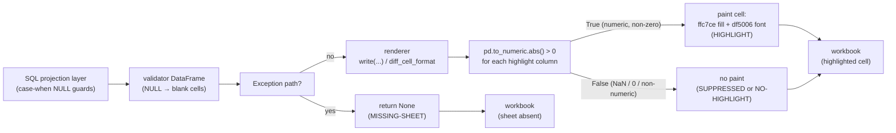
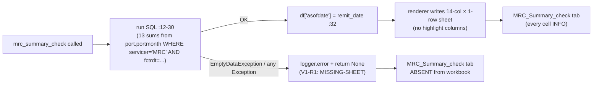
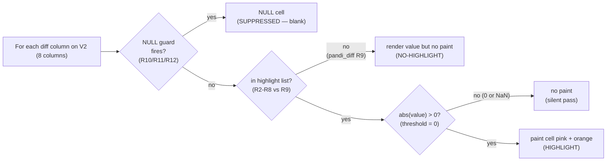
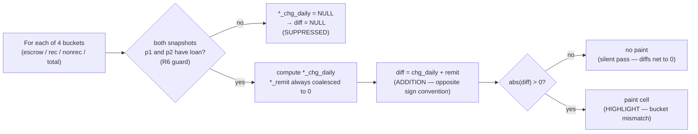
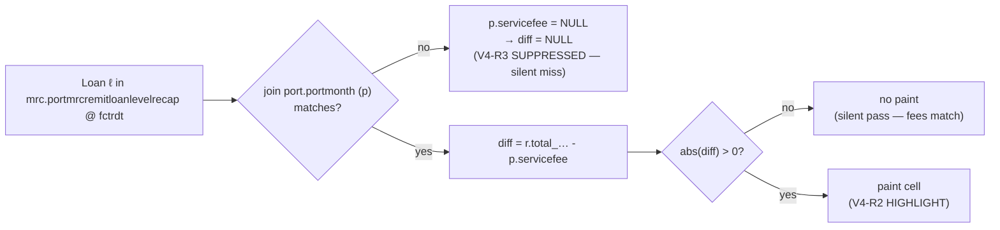
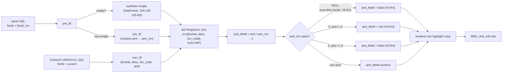

# 1.5 Validation Rules / 验证规则

> **Purpose**: Catalog every rule applied during MRC validation — explicit (`highlight_column`, `threshold`, validator-level `case-when NULL`) and implicit (validator returns `None` on exception → sheet silently dropped; `pd.to_numeric(errors='coerce')` silently drops non-numeric highlight values). This chapter resolves 1.4 Field Definitions (1.4-fields.en.md)'s open policy questions for 1.7 User Review Gate review and is the design input for 1.6 Baseline XLSX Behavior (1.6-baseline.en.md) baseline interpretation.
>
> **Audience**: Stage 1 reviewer; Stage 2 engineers implementing the rebuilt MRC rule engine; 1.7 User Review Gate reviewer making policy go/no-go decisions.
>
> **Revision history**
>
> | Date | Author | Change |
> |---|---|---|
> | 2026-05-17 | Copilot CLI agent | v1 — first cut. Sources: `flow/remit_validation/mrc_validation.py` (validator-level `try / except → return None`), `flow/remit_validation/servicer_validation_with_portdaily.py` (SQL `case-when NULL` rules), `flow/remit_validation/remit_validation.py` (MRC validator orchestration + None storage in `VALIDATION_TABLE_MAP`), `util/gen_remit_validation_report.py` (render-level rules: threshold / coerce / `df is None or empty` skip). |

> **MRC chapter index** (`docs/mrc/`) — full definition in [`_chapter-index.md`](_chapter-index.md)
>
> | # | Title | File | Scope |
> |---|---|---|---|
> | 1.0 | TOC & Scope / 章节地图与范围 | `1.0-toc.en.md` | Entry & contract |
> | 1.1 | Raw Data Layer / 原始数据层 | `1.1-rawdata.en.md` | Upstream tables + time anchors |
> | 1.2 | Dataflow Layer / 数据流层 | `1.2-dataflow.en.md` | End-to-end execution pipeline |
> | 1.3 | Sheet Rendering Layer / Sheet 渲染层 | `1.3-sheets.en.md` | openpyxl rendering contract |
> | 1.4 | Field Definitions / 字段定义 | `1.4-fields.en.md` | Field-level lineage + business meaning |
> | 1.5 | Validation Rules / 验证规则 | `1.5-rules.en.md` | Rule catalogue |
> | 1.6 | Baseline XLSX Behavior / Baseline XLSX 行为 | `1.6-baseline.en.md` | Baseline truth |
> | 1.7 | User Review Gate / 用户走读评审 | (user action) | Stage 2 gate |

---

## 1. Document role

This is sub-chapter **1.5** of the MRC chapter. It answers one question: **what makes a cell, a row, a sheet, or the entire MRC flow "pass" or "fail" in the existing system?**

The existing PrefectFlow system has **no explicit pass/fail boolean** anywhere on the MRC path. What it has instead is:

- **Render-level signals**: cells in 12 highlight columns (1.3 Sheet Rendering Layer (1.3-sheets.en.md)) are painted pink / orange when `abs(value) > 0`.
- **SQL-level NULL guards**: `case when … is null then null else …` blocks that *suppress* the diff cell when an input is missing (so the highlight does not fire).
- **Validator-level exceptions**: every validator wraps its body in `try / except` and returns `None` on any error; the renderer silently skips `None` / empty DataFrames.

1.5 Validation Rules (1.5-rules.en.md) lifts those three signal layers into an explicit rule catalog so 1.6 Baseline XLSX Behavior (1.6-baseline.en.md) baseline can be diffed deterministically, 1.7 User Review Gate review has concrete policy questions to answer, and Stage 2 has an unambiguous rebuild target.

It does **not**:

- Re-state per-column lineage — see 1.4 Field Definitions (1.4-fields.en.md).
- Re-state per-sheet rendering machinery — see 1.3 Sheet Rendering Layer (1.3-sheets.en.md).
- Define **new** rules — only catalogs existing behavior. Suggested defaults for open policy questions are explicitly labeled `[PROPOSED]`.

## 2. Scope and rule taxonomy

### 2.1 Three layers of "rule" in the existing system

| Layer | Rule expression | Fires when | Visible effect |
|---|---|---|---|
| **SQL projection layer** | `case when <NULL guard> then null else <diff expr> end` (1.4 Field Definitions (1.4-fields.en.md) — 5 such guards in V2; 4 in V3; 0 in V1/V4/V5) | Either input side is NULL / a snapshot row is missing | Diff cell value = NULL → renders blank → **never highlighted** |
| **Render layer (highlight)** | `pd.to_numeric(highlight_col, errors='coerce').abs() > threshold` with `threshold = 0` (1.3 Sheet Rendering Layer (1.3-sheets.en.md) § 4.3) | Numeric, non-NaN, non-zero | Cell painted pink (`ffc7ce`) + orange font (`df5006`); header of the column likewise repainted |
| **Validator layer (exception)** | `try: <body> except (EmptyDataException \| Exception) as e: logger.error(...); return None` (`mrc_validation.py:11/41/59/77/138`) | Any exception during SQL exec, DataFrame transform, or Python merge | Validator returns `None`; orchestrator stores `None` in `VALIDATION_TABLE_MAP` (`remit_validation.py:135-144`); renderer's `write(...)` short-circuits with `if df is None or df.empty: return pd.DataFrame()` (`gen_remit_validation_report.py:1612-1613`); **sheet is silently absent from the workbook** |

There is **no** fourth layer (e.g. an explicit "pass/fail" registry, a thresholding step that returns a counted alert, or an alert dispatch). The combination of the three layers above **is** the full MRC rule surface.

### 2.2 Severity / status vocabulary used in this chapter

Because the source code has no shared vocabulary, the catalog below introduces six labels — used only within this chapter and 1.7 User Review Gate:

| Label | Meaning |
|---|---|
| `HIGHLIGHT` | Cell painted by `diff_cell_format` when triggered; nothing else happens (no count, no escalation). |
| `SUPPRESSED` | A SQL `case-when NULL` guard intentionally produces NULL so the cell never highlights even if math would. |
| `NO-HIGHLIGHT` | A diff column exists but is **not** in the highlight list — by design or by oversight (see 1.4 Field Definitions (1.4-fields.en.md) § 10 gap 1). |
| `INFO` | Side / context column — not a rule subject. |
| `MISSING-SHEET` | Validator exception path → entire sheet absent from workbook. |
| `OPEN-POLICY` | Behavior depends on a business decision not yet made; tagged for 1.7 User Review Gate. |

A "rule" in this chapter is a tuple of `(scope, trigger, label, business intent, gaps)`.

## 3. Shared rule machinery

### 3.1 Threshold semantics (always 0, strict `>`)

Source: `gen_remit_validation_report.py:1764-1798`, with all MRC sheet-registry entries setting `threshold=0` (`gen_remit_validation_report.py:1331-1354`).

```python
# diff_cell_format pseudocode
mask = pd.to_numeric(df[c], errors='coerce').abs() > threshold  # threshold = 0 for every MRC column
```

Implications:

- `0` is **never** highlighted (strict `>`, not `>=`).
- `NaN` from `pd.to_numeric` coercion is **never** highlighted (boolean comparison with `NaN` returns False).
- Any non-zero numeric value — even `0.001` — **is** highlighted. There is no "near-zero tolerance" band.
- The threshold cannot vary per column on the MRC path: the registry hard-codes `threshold=0` via `_validation_report_sheet(...)` helper (`gen_remit_validation_report.py:1170-1176`).

### 3.2 Type coercion via `pd.to_numeric`

`pd.to_numeric(s, errors='coerce')` is the gate. For string-typed columns that happen to be on the highlight list, all values would coerce to NaN and **nothing would ever highlight** — silently. No MRC highlight column is string-typed today; this is a latent foot-gun for Stage 2 (if a future schema change types a money column as `str`, highlighting silently stops working).

### 3.3 `relation_column` unused by MRC

Source: 1.3 Sheet Rendering Layer (1.3-sheets.en.md) § 4.3. Every MRC highlight entry has `relation_column=[]`. The grey overlay machinery (`gen_remit_validation_report.py:1764-1798`, the part painting paired cells grey) is dead code on the MRC path.



**Figure 1.5.3 — MRC rule application pipeline: 3 layers → 3 outcomes (`MISSING-SHEET` / `HIGHLIGHT` / blank).**
Source: `mrc_validation.py:8-158`, `servicer_validation_with_portdaily.py:583-705`, `gen_remit_validation_report.py:1610-1798`.

**Explanation (per § 6.10)**

- **Business purpose**: makes explicit the 3-layer rule application so an analyst seeing a blank cell on the report knows whether it means "input was NULL" (`SUPPRESSED` — common, expected) or "diff was exactly 0" (clean — expected) or "sheet missing entirely" (`MISSING-SHEET` — alarming); the same disambiguation applies for Stage 2's redesign.
- **Execution flow**: each validator runs SQL → projection layer may emit NULL → on Python exception path the validator returns `None` (sheet vanishes); otherwise the renderer applies `pd.to_numeric.abs() > 0` per highlight column. There is **no** rolled-up flow-level pass/fail step.
- **Input / output**: **input** = projected DataFrame (or `None`); **output** = workbook cell state: `MISSING-SHEET` (no tab), `HIGHLIGHT` (painted), or `blank` / unpainted (silent pass).
- **Key transformations**: the NULL guard layer and the `pd.to_numeric.coerce → NaN → not > 0` layer **both** silence the highlight — but for different reasons. 1.6 Baseline XLSX Behavior (1.6-baseline.en.md) baseline must count both flavors of "silent suppression" to distinguish design intent from latent bugs.
- **Dependencies / assumptions**: assumes downstream consumers (humans reading the XLSX, the email composer in `compose_report_task`) treat a missing tab and an all-blank diff column **the same** (both "no issue"); this assumption is the root of `OPEN-POLICY` 4 below.

## 4. V1 `mrc_summary_check` rules

### 4.1 Rule catalog

V1 has **0 highlight columns** (1.3 Sheet Rendering Layer (1.3-sheets.en.md) § 5; `gen_remit_validation_report.py:1327`). So every output column on this sheet is `INFO` at the render layer — no per-row pass/fail signal exists.

Rules that still apply:

| # | Rule scope | Trigger | Label | Business intent | Gaps |
|---|---|---|---|---|---|
| V1-R1 | Sheet existence | `mrc_validation.py:8-36` raises | `MISSING-SHEET` | Surface catastrophic data loading failure (e.g. `port.portmonth` empty for `fctrdt`). Currently silent — only a `logger.error` line, no flow-level alert. | `OPEN-POLICY` 1 |
| V1-R2 | `totalservicefee` summation order | `sum(servicefee + otherfees)` excludes rows where either component is NULL (1.4 Field Definitions (1.4-fields.en.md) § 4 col 9 + § 10 gap 8) | `INFO` (no highlight, but cell value may surprise) | Either: (a) intentionally drop rows with incomplete reporting from total; or (b) bug — should `coalesce`. | `OPEN-POLICY` 2 |

### 4.2 Decision diagram



**Figure 1.5.4 — V1 `mrc_summary_check` decision tree.**
Source: `mrc_validation.py:8-36`; `gen_remit_validation_report.py:1180-1196, 1327, 1610-1798`.

**Explanation (per § 6.10)**

- **Business purpose**: V1 is a passive headline rollup; its only rule is "sheet must exist". The rollup itself has no highlight semantics because the totals are not compared to anything.
- **Execution flow**: SQL → optional Python `asofdate` stamp → render; on exception, return `None` and the sheet silently vanishes from the workbook.
- **Input / output**: **input** = all MRC rows in `port.portmonth` at `fctrdt`; **output** = either a 1-row sheet or no sheet.
- **Key transformations**: only `SUM`. The `sum(a + b)` form (vs `sum(a) + sum(b)`) is a subtle semantic choice flagged as `OPEN-POLICY` 2.
- **Dependencies / assumptions**: `port.portmonth` is loaded for the target `fctrdt`; if it isn't, the SQL returns 0 rows (not an exception), so the sheet *does* render — with 13 NULL cells coerced to `$0` by `data_type_format`. This is **failure that looks like success** and is the strongest argument for adding an explicit non-empty assertion in Stage 2.

## 5. V2 `mrc_check_general_info` rules

### 5.1 Rule catalog

V2 has 35 columns: **7 highlight** + 1 `NO-HIGHLIGHT` diff + 27 `INFO`. Source: `servicer_validation_with_portdaily.py:635-705`; `gen_remit_validation_report.py:1199-1236, 1328-1340`.

| # | Rule scope | Trigger | Label | Business intent | Gaps |
|---|---|---|---|---|---|
| V2-R1 | Sheet existence | `mrc_check_general_info` exception path | `MISSING-SHEET` | catastrophic | `OPEN-POLICY` 1 |
| V2-R2 | `intrate_diff_remitvsdaily` cell | `r.intrate - p.interest_rate \!= 0` AND both non-NULL | `HIGHLIGHT` | interest rate mismatch | — |
| V2-R3 | `nextduedate_diff_remitvsdaily` cell | `r.nextduedate \!= p.nextduedate` (binary 0/1 indicator) | `HIGHLIGHT` (renders `1.00`) | next due date mismatch | 1.4 Field Definitions (1.4-fields.en.md) § 10 gap 2 (type/round) |
| V2-R4 | `begbal_diff_remitvsdaily` cell | `r.prevbal - p2.principalbalance \!= 0` AND both non-NULL | `HIGHLIGHT` | beginning balance mismatch | — |
| V2-R5 | `endbal_diff_remitvsdaily` cell | `r.balance - p.principalbalance \!= 0` AND both non-NULL | `HIGHLIGHT` | ending balance mismatch | — |
| V2-R6 | `deferredprincipal_diff_remitvsdaily` cell | non-zero (NULL→0 on both sides via coalesce) | `HIGHLIGHT` | deferred principal mismatch | sign convention: NULL coalesced to 0 means missing data flagged as "match" |
| V2-R7 | `deferredint_diff_remitvsdaily` cell | non-zero (NULL→0 on both sides) | `HIGHLIGHT` | deferred interest mismatch | same as V2-R6 |
| V2-R8 | `pandi_schedule_diff_remitvsdaily` cell | `coalesce(mc.sched_pandi, r.pandi) - p.schedule_pandi_daily \!= 0` | `HIGHLIGHT` | scheduled P&I mismatch with silent fallback when monthly `mc` is missing | 1.4 Field Definitions (1.4-fields.en.md) § 10 gap 3 (silent fallback); `OPEN-POLICY` 3 |
| V2-R9 | `pandi_diff_remitvsdaily` cell | math says it's a diff column but **excluded** from highlight list | `NO-HIGHLIGHT` | (intent unclear — see policy) | 1.4 Field Definitions (1.4-fields.en.md) § 10 gap 1; `OPEN-POLICY` 4 |
| V2-R10 | `pandi_diff_remitvsdaily` NULL guard | when both `p.principalpaidmtd` and `p.interestpaidmtd` are NULL | `SUPPRESSED` (NULL cell) | distinguish "loan has not paid yet" from "paid 0" | — |
| V2-R11 | `pandi_paid_times_remit` NULL guard | when `coalesce(p.schedule_pandi_daily, 0) = 0` | `SUPPRESSED` (NULL cell) | avoid div-by-zero | — |
| V2-R12 | `pandi_paid_times_daily` NULL guard | when denominator 0 OR both pmts NULL | `SUPPRESSED` (NULL cell) | avoid div-by-zero / unreported | — |

### 5.2 Decision diagram



**Figure 1.5.5 — V2 `mrc_check_general_info` per-cell decision tree.**
Source: `servicer_validation_with_portdaily.py:635-705`; `gen_remit_validation_report.py:1331-1339, 1764-1798`.

**Explanation (per § 6.10)**

- **Business purpose**: V2 is the workhorse loan-level reconciliation; 7 highlight columns flag any non-zero mismatch on the most-watched fields (rate, due date, balances, deferred, scheduled P&I); the 8th diff column `pandi_diff_remitvsdaily` is intentionally **not** highlighted (R9) because its sibling R8 already covers the schedule-side check.
- **Execution flow**: each diff column passes through a (potential) SQL NULL guard, then the highlight-list membership filter, then the `>0` threshold; only the union (in-list AND non-NULL AND non-zero) actually paints.
- **Input / output**: **input** = 8 diff columns × N loans; **output** = a sparse mask of painted cells.
- **Key transformations**: 3 of the 8 diff cols (R10/R11/R12) carry explicit NULL guards that *suppress* highlighting on missing data; deferred columns (R6/R7) use `coalesce(..., 0)` which has the opposite effect (NULL becomes 0, so the diff is computable but missing data is masquerading as "match" — `OPEN-POLICY` 5 below); R3 produces a binary 0/1 instead of a magnitude, rendering `1.00` for any mismatch.
- **Dependencies / assumptions**: assumes `mc` is present (else R8 silently switches from "monthly schedule vs daily schedule" to "remit schedule vs daily schedule" — different semantics); assumes `pd.to_numeric` always succeeds on the 8 numeric diff columns (they are all SQL-typed numeric, so the coerce gate is effectively a no-op here).

## 6. V3 `mrc_check_adv_balance` rules

### 6.1 Rule catalog

V3 has 27 columns: **4 highlight** + 23 `INFO`. Source: `servicer_validation_with_portdaily.py:583-632`; `gen_remit_validation_report.py:1239-1268, 1341-1350`.

| # | Rule scope | Trigger | Label | Business intent | Gaps |
|---|---|---|---|---|---|
| V3-R1 | Sheet existence | `mrc_check_adv_balance` exception path | `MISSING-SHEET` | catastrophic | `OPEN-POLICY` 1 |
| V3-R2 | `escadv_diff_remitvsdaily` cell | `escrowadv_chg_daily + escadv_remit \!= 0` (note: addition, not subtraction — sign convention) | `HIGHLIGHT` | escrow advance mismatch | 1.4 Field Definitions (1.4-fields.en.md) § 10 gap 6 (sign convention) |
| V3-R3 | `recovcorpadv_diff_remitvsdaily` cell | `reccorpadvance_chg_daily + reccorpadvance_remit \!= 0` | `HIGHLIGHT` | recoverable corp adv mismatch | 1.4 Field Definitions (1.4-fields.en.md) § 10 gap 3 (rec vs recov naming) |
| V3-R4 | `nonrecovcorpadv_diff_remitvsdaily` cell | `nonrecovcorpadv_chg_daily + nonrecovadvance_remit \!= 0` | `HIGHLIGHT` | non-recoverable corp adv mismatch | — |
| V3-R5 | `totalcorpadv_diff_remitvsdaily` cell | `totalcorpadv_chg_daily + totalcorpadvance_remit \!= 0` | `HIGHLIGHT` | total corp adv mismatch | `totalcorpadvance_remit` has rec+nonrec fallback (1.4 Field Definitions (1.4-fields.en.md) § 6 col 23) |
| V3-R6 | `*_chg_daily` NULL guard | `case when p1.loanid is null or p2.loanid is null then null` (4 such guards) | `SUPPRESSED` (NULL cell cascades into NULL diff) | loan not present in one of two daily snapshots | the diff cell is also blank, so highlight cannot fire — 1.6 Baseline XLSX Behavior (1.6-baseline.en.md) must count |

### 6.2 Decision diagram



**Figure 1.5.6 — V3 `mrc_check_adv_balance` per-bucket decision tree.**
Source: `servicer_validation_with_portdaily.py:602-625`; `gen_remit_validation_report.py:1345-1348, 1764-1798`.

**Explanation (per § 6.10)**

- **Business purpose**: per-loan, per-bucket reconciliation that the change recorded in the daily snapshot equals the negative of the corresponding remit-side change (the two should sum to 0 if recorded correctly).
- **Execution flow**: for each of 4 buckets, the SQL projects 4 daily fields + 1 remit field + 1 diff field; the diff uses `+` not `-`; render-side highlights non-zero.
- **Input / output**: **input** = 2 daily snapshots × per-bucket fields + remit row per loan; **output** = 4 highlighted cells per loan max.
- **Key transformations**: `coalesce(..., 0)` on the daily snapshot reads makes daily change always numeric; `coalesce(..., 0)` on the remit fields makes the addition always defined; **but** the `*_chg_daily` NULL guard (R6) trumps both when a loan is in only one of the two snapshots — diff cascades to NULL, no highlight. The `totalcorpadvance_remit` `coalesce(total_chg, rec+nonrec)` fallback (1.4 Field Definitions (1.4-fields.en.md) § 6 col 23) means even if MRC under-reports the total, the diff is still computable.
- **Dependencies / assumptions**: assumes the sign convention on `r.escrowadv_chg` / `r.corpadv*_chg` (positive = advance pushed out, opposite sign from daily delta) — Stage 2 must not refactor signs without recomputing every diff; assumes both daily snapshots are loaded for the two anchor dates; assumes `escrow_balance_prev` / `escrow_balance_curr` columns 25-26 are `INFO`-only (not differenced) — confirm with business in 1.7 User Review Gate.

## 7. V4 `mrc_service_fee_check` rules

### 7.1 Rule catalog

V4 has 8 columns: **1 highlight** + 7 `INFO`. Source: `mrc_validation.py:75-102`; `gen_remit_validation_report.py:1271-1281, 1351-1355`.

| # | Rule scope | Trigger | Label | Business intent | Gaps |
|---|---|---|---|---|---|
| V4-R1 | Sheet existence | `mrc_service_fee_check` exception path | `MISSING-SHEET` | catastrophic | `OPEN-POLICY` 1 |
| V4-R2 | `servicefee_diff` cell | `r.total_accrued_earned_servicing_fees - p.servicefee \!= 0` AND both non-NULL | `HIGHLIGHT` | service fee mismatch between MRC raw recap and portmonth | — |
| V4-R3 | `servicefee_diff` NULL behavior | when `p.servicefee` is NULL (loan in MRC raw but absent in `port.portmonth`) | `SUPPRESSED` (NULL cell) | implicit; missing portmonth row → blank diff → no highlight → **silent miss** | `OPEN-POLICY` 6 |
| V4-R4 | `fctrdt` vs `asofdate` duplication | both columns written, different dates (`2026-05-01` vs `2026-04-30` at baseline) | `INFO` (no rule) | unclear — 1.7 User Review Gate to resolve | 1.4 Field Definitions (1.4-fields.en.md) § 10 gap 5; `OPEN-POLICY` 7 |

### 7.2 Decision diagram



**Figure 1.5.7 — V4 `mrc_service_fee_check` per-cell decision tree.**
Source: `mrc_validation.py:80-95`; `gen_remit_validation_report.py:1354, 1764-1798`.

**Explanation (per § 6.10)**

- **Business purpose**: simplest of the 5 — one diff column, one rule (R2). The single business question is "does the MRC-reported service fee match the portfolio-month accrual per loan?"
- **Execution flow**: 3-way LEFT JOIN → subtraction → render-side highlight if non-zero.
- **Input / output**: **input** = N rows in MRC raw recap × matching portmonth + portfunding; **output** = N rows; highlighted iff R2 fires.
- **Key transformations**: pure subtraction, no `coalesce` — which means R3 (silent miss when portmonth lacks the loan) is a real behavior. Stage 2 should consider whether a missing portmonth row should fire a *different* signal (e.g. paint a different color, or add a separate "unmatched loans" tab).
- **Dependencies / assumptions**: assumes MRC raw recap is the authoritative loan set; assumes portmonth completeness is enforced upstream (1.1 Raw Data Layer (1.1-rawdata.en.md) § 3 raw loader); the `fctrdt` / `asofdate` duplication (R4) is documented but not explained.

## 8. V5 `mrc_other_check` rules

### 8.1 Rule catalog

V5 has 7 columns: **0 highlight** + 7 `INFO`. Source: `mrc_validation.py:105-158`; `gen_remit_validation_report.py:1284-1293, 1356`.

| # | Rule scope | Trigger | Label | Business intent | Gaps |
|---|---|---|---|---|---|
| V5-R1 | Sheet existence | `mrc_other_check` exception path | `MISSING-SHEET` | catastrophic | `OPEN-POLICY` 1 |
| V5-R2 | `amt_1m` NULL via left-merge | tuple new this month (not in `fctrdt_1m`) | `INFO` (NULL cell) | implicit; new bucket / description / transaction_code | — |
| V5-R3 | `amt_MoM` `±inf` | `amt_1m == 0 AND amt != 0` (Python float div) | `INFO` (`inf` / `-inf` rendered as-is) | tuple jumped from 0 to non-zero MoM | 1.4 Field Definitions (1.4-fields.en.md) § 10 gap 4; `OPEN-POLICY` 8 |
| V5-R4 | `amt_MoM` `NaN` | `amt_1m IS NaN` OR `amt_1m == 0 AND amt == 0` | `INFO` (`NaN` rendered as-is) | undefined ratio | `OPEN-POLICY` 8 |
| V5-R5 | empty pre_df fallback | previous month tables empty | `INFO` (synthetic empty DataFrame at `:144-145` → all `amt_1m` NULL) | rare — silently degrades MoM column | — |
| V5-R6 | row order non-determinism | no SQL `ORDER BY`, pandas merge unstable | `INFO` | implicit | 1.4 Field Definitions (1.4-fields.en.md) § 10 gap 9; `OPEN-POLICY` 9 |

### 8.2 Decision diagram



**Figure 1.5.8 — V5 `mrc_other_check` per-row decision tree.**
Source: `mrc_validation.py:105-158`; `gen_remit_validation_report.py:1356, 1764-1798`.

**Explanation (per § 6.10)**

- **Business purpose**: bucket × description × transaction-code activity with month-over-month change. Zero highlight columns means *no per-row pass/fail signal* — analysts use the sheet as an exploratory tool, not a check sheet.
- **Execution flow**: SQL twice → optional empty fallback → pandas left-merge → Python MoM arithmetic → render.
- **Input / output**: **input** = 6 reads of 3 MRC raw tables (3 × 2 fctrdt); **output** = M-row × 7-col DataFrame with possible `±inf` / `NaN` in `amt_MoM`.
- **Key transformations**: `pd.merge(..., how='left')` drops tuples present last month but not this month (silent loss — `OPEN-POLICY` 9); `amt / amt_1m - 1` uses Python float division so `0` denominator yields `±inf` (R3) and `NaN` denominator propagates `NaN` (R4); `data_type_format` does not normalize `float` so the actual Excel cell representation of `inf` / `NaN` is implementation-defined (`OPEN-POLICY` 8).
- **Dependencies / assumptions**: assumes the 3 MRC raw tables exist for both `fctrdt` values (else empty fallback at R5); assumes downstream tools tolerate `±inf` / `NaN` cells; assumes row ordering is not load-bearing for any consumer.

## 9. Cross-validator failure semantics

### 9.1 Validator-level exceptions (return `None`)

Every MRC validator implements the same exception envelope:

```python
@task(name='mrc_...')
def mrc_...(mrc_db):
    logger = get_run_logger()
    try:
        # SQL exec, DataFrame transform, optional pandas merge
        ...
    except EmptyDataException as e:           # V3, V2 only
        logger.error("e: %s", e)
        return None
    except Exception as e:
        logger.error("mrc ... check, e: %s", e)
        return None
    return data_df / re_df / merged_df
```

(`mrc_validation.py:11-35`, `:41-53`, `:59-71`, `:77-101`, `:138-157`.)

Three implications:

1. **No exception escapes** — Prefect sees the task succeed in all cases. The flow does **not** fail when an MRC validator fails.
2. **The flow stores `None`** in `VALIDATION_TABLE_MAP[<key>]` for the failed validator (`remit_validation.py:135-144`); the orchestrator passes that `None` into `gen_remit_report(...)` at `remit_validation.py:175`.
3. **The renderer silently drops** the absent sheet at `gen_remit_validation_report.py:1612-1613` (`if df is None or df.empty: return pd.DataFrame()`). No log line, no header, no placeholder row — the corresponding tab simply does not appear in the XLSX.

This is the `MISSING-SHEET` label used throughout the catalog.

### 9.2 Render-level: highlighted cell ≠ flow failure

The render-layer rules in §§ 4–8 only paint cells — they do **not**:

- count highlighted cells;
- raise a Python exception;
- mark the validator as failed;
- attach metadata to the workbook indicating "rules fired";
- influence whether the email composer (`compose_report_task` at `remit_validation.py:177`) sends the report.

So **a workbook full of highlighted cells reaches the inbox identically to a clean one**. Stage 1.7 review must decide whether Stage 2 should introduce an explicit alert count / threshold / escalation path or preserve the current behavior verbatim.

## 10. Open policy questions for 1.7 User Review Gate review

The 9 policy questions below are the actionable output of 1.5 Validation Rules (1.5-rules.en.md) — every one requires a business / reviewer decision before Stage 2 implementation.

| # | Question | Affected rule(s) | Suggested default `[PROPOSED]` |
|---|---|---|---|
| 1 | Should a `MISSING-SHEET` event raise a flow-level failure (or at least an alert) rather than silently dropping the tab? | V1-R1 / V2-R1 / V3-R1 / V4-R1 / V5-R1 | **[PROPOSED]** YES for Stage 2: any `MISSING-SHEET` raises a P0 alert in the UI and a placeholder tab is written into the XLSX explaining the failure. Reproduce silent behavior **only** behind a feature flag for cell-identity testing. |
| 2 | Should `totalservicefee` on V1 be `sum(servicefee) + sum(otherfees)` (coalesce-friendly) or stay `sum(servicefee + otherfees)` (NULL-dropping)? | V1-R2 | **[PROPOSED]** keep `sum(servicefee + otherfees)` for cell identity; surface a separate "rows with NULL components" metric in Stage 2 UI. |
| 3 | Should `pandi_schedule_diff` silent fallback (`coalesce(mc.sched_pandi, r.pandi)`) be flagged when it triggers? | V2-R8 | **[PROPOSED]** YES: Stage 2 logs every fallback and surfaces a counter in 1.7 User Review Gate review UI; the on-XLSX cell value is identical to current. |
| 4 | Should `pandi_diff_remitvsdaily` (V2-R9) be highlighted, or remain excluded? | V2-R9 | **[PROPOSED]** REMAIN EXCLUDED (current behavior); `pandi_schedule_diff` is the canonical signal, and `pandi_diff` legitimately drifts at month boundaries. Document the policy in 1.7 User Review Gate. |
| 5 | Should deferred-principal / deferred-interest diffs (V2-R6/R7) **suppress** the highlight when either input was NULL (currently NULL→0 silently)? | V2-R6 / V2-R7 | **[PROPOSED]** keep current behavior for cell identity; add a separate metric in Stage 2 UI showing "NULL→0 coerced rows" so missing data does not masquerade as match. |
| 6 | Should V4-R3 (loan in MRC raw but absent in portmonth) fire a separate signal? | V4-R3 | **[PROPOSED]** YES: Stage 2 adds an "unmatched loans" tab listing every such loan; current `servicefee_diff` cell stays NULL for cell identity. |
| 7 | Should `fctrdt` and `asofdate` both be kept on V4? | V4-R4 | **[PROPOSED]** keep both for cell identity; document the semantic difference (SQL filter date vs remit date) in the column header tooltip in Stage 2 UI. |
| 8 | How should `amt_MoM` `±inf` / `NaN` render in Excel on V5? | V5-R3 / V5-R4 | **[PROPOSED]** capture observed rendering in 1.6 Baseline XLSX Behavior (1.6-baseline.en.md) baseline and pin Stage 2 to reproduce verbatim; do **not** normalize to a string like `"N/A"` in Stage 1 (would break cell identity). |
| 9 | Should V5 sort rows deterministically? | V5-R6 | **[PROPOSED]** YES for Stage 2: pin to `ORDER BY bucket, description, transaction_code`; 1.6 Baseline XLSX Behavior (1.6-baseline.en.md) baseline captures pre-sort order for reference but Stage 2 ships sorted (mark as **acceptable cell-identity break** in 1.7 User Review Gate). |

Each of the 9 entries is a `OPEN-POLICY` flag tagged in the per-validator catalogs above. 1.7 User Review Gate review is responsible for accepting / overriding each `[PROPOSED]` default.

## 11. Source citation index

| File | Line(s) | Content |
|---|---|---|
| `flow/remit_validation/mrc_validation.py` | `mrc_validation.py:8-36` | V1 `mrc_summary_check` — `try / except → return None` envelope (V1-R1) |
| `flow/remit_validation/mrc_validation.py` | `mrc_validation.py:39-54` | V3 `mrc_check_adv_balance` — `EmptyDataException` + generic Exception (V3-R1) |
| `flow/remit_validation/mrc_validation.py` | `mrc_validation.py:57-72` | V2 `mrc_check_general_info` — `EmptyDataException` + generic Exception (V2-R1) |
| `flow/remit_validation/mrc_validation.py` | `mrc_validation.py:75-102` | V4 `mrc_service_fee_check` — single Exception envelope (V4-R1); `r.total_… - p.servicefee` (V4-R2); silent NULL (V4-R3); `asofdate` stamp (V4-R4) |
| `flow/remit_validation/mrc_validation.py` | `mrc_validation.py:105-158` | V5 `mrc_other_check` — UNION ALL SQL × 2; empty `pre_df` fallback (V5-R5); pandas left-merge (V5-R2); `amt / amt_1m - 1` (V5-R3/R4) |
| `flow/remit_validation/servicer_validation_with_portdaily.py` | `servicer_validation_with_portdaily.py:608, 615-617` | V3-R6 NULL guard on `*_chg_daily` columns (4 occurrences) |
| `flow/remit_validation/servicer_validation_with_portdaily.py` | `servicer_validation_with_portdaily.py:622-625` | V3-R2/R3/R4/R5 — 4 diff columns (addition form) |
| `flow/remit_validation/servicer_validation_with_portdaily.py` | `servicer_validation_with_portdaily.py:681-691` | V2-R4/R5/R6/R7/R8 — 5 diff projections (with coalesce variants) |
| `flow/remit_validation/servicer_validation_with_portdaily.py` | `servicer_validation_with_portdaily.py:685-686` | V2-R2 (`intrate_diff`) + V2-R3 (`nextduedate_diff` binary 0/1) |
| `flow/remit_validation/servicer_validation_with_portdaily.py` | `servicer_validation_with_portdaily.py:687-690` | V2-R10 (`pandi_diff_remitvsdaily` NULL guard) — the **R9** no-highlight column |
| `flow/remit_validation/servicer_validation_with_portdaily.py` | `servicer_validation_with_portdaily.py:692-696` | V2-R11 + V2-R12 (`pandi_paid_times_*` NULL guards) |
| `flow/remit_validation/remit_validation.py` | `remit_validation.py:33-63` | `VALIDATION_TABLE_MAP` declaration with 5 MRC keys initialized to `None` |
| `flow/remit_validation/remit_validation.py` | `remit_validation.py:134-144` | MRC validator orchestration — each validator call followed by `VALIDATION_TABLE_MAP[key] = result` (None propagates) |
| `flow/remit_validation/remit_validation.py` | `remit_validation.py:165-175` | `gen_remit_report(...)` call site — passes the 5 MRC DataFrames (possibly `None`) into the renderer |
| `util/gen_remit_validation_report.py` | `gen_remit_validation_report.py:1170-1176` | `_validation_report_sheet` helper hard-coding `threshold=0` and `relation_column=[]` for every entry |
| `util/gen_remit_validation_report.py` | `gen_remit_validation_report.py:1327-1356` | 5 MRC sheet-registry entries with the 12 total highlight columns (Summary 0 / General 7 / Advance 4 / ServiceFee 1 / AdvInfo 0) |
| `util/gen_remit_validation_report.py` | `gen_remit_validation_report.py:1612-1616, 1685-1686` | `write(...)` / `all_sheet_format` skip path: `if df is None or df.empty` → silently drop sheet |
| `util/gen_remit_validation_report.py` | `gen_remit_validation_report.py:1764-1798` | `diff_cell_format` — `pd.to_numeric(errors='coerce').abs() > 0` for every highlight column |
