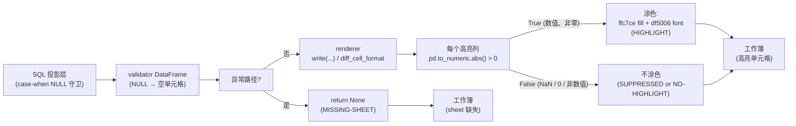
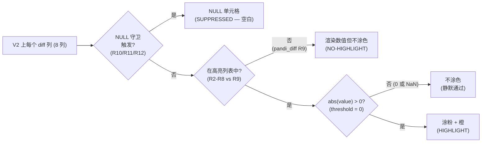
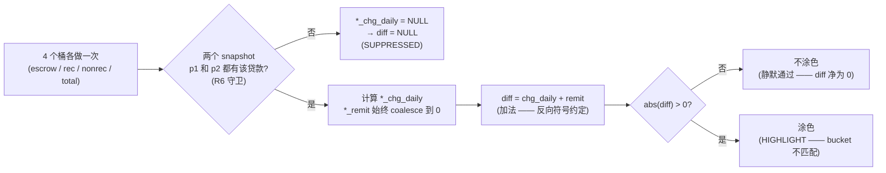
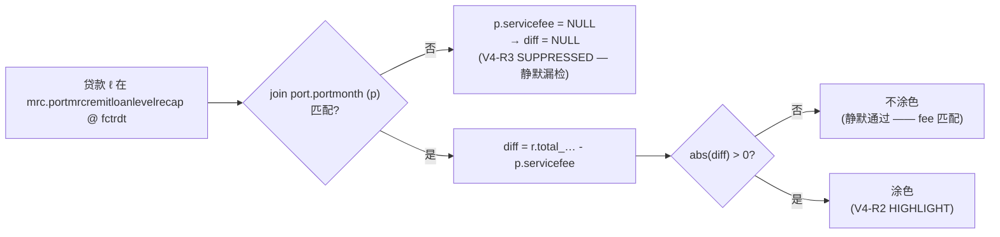
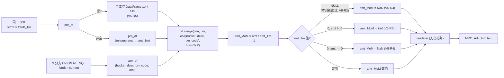

# 1.5 Validation Rules / 验证规则

> **目的**: 把 MRC 验证流程中应用的所有规则整理成目录 —— 包括显式规则（`highlight_column`、`threshold`、validator 级 `case-when NULL`）与隐式规则（异常时返回 `None` → sheet 静默缺失；`pd.to_numeric(errors='coerce')` 静默丢弃非数值高亮值）。本章解决 1.4 字段定义 (1.4-fields.zh.md) 遗留的政策问题，是 1.6 Baseline XLSX 行为 (1.6-baseline.zh.md) baseline 解读与 Stage 2 重写的设计输入。
>
> **受众**: Stage 1 reviewer；Stage 2 实现 MRC 规则引擎的工程师；做政策 go/no-go 决策的 1.7 用户走读评审 reviewer。
>
> **修订历史**
>
> | 日期 | 作者 | 变更 |
> |---|---|---|
> | 2026-05-17 | Copilot CLI agent | v1 — 首版。源码: `flow/remit_validation/mrc_validation.py`（validator 级 `try / except → return None`）、`flow/remit_validation/servicer_validation_with_portdaily.py`（SQL `case-when NULL` 规则）、`flow/remit_validation/remit_validation.py`（MRC validator orchestration + 在 `VALIDATION_TABLE_MAP` 中存 None）、`util/gen_remit_validation_report.py`（render 级规则: threshold / coerce / `df is None or empty` skip）。 |

> **MRC 章节索引** （`docs/mrc/`）—— 完整定义见 [`_chapter-index.md`](_chapter-index.md)
>
> | # | 标题 | 文件 | 职责 |
> |---|---|---|---|
> | 1.0 | TOC & Scope / 章节地图与范围 | `1.0-toc.zh.md` | 入口与契约 |
> | 1.1 | Raw Data Layer / 原始数据层 | `1.1-rawdata.zh.md` | 上游表 + 时间锚 |
> | 1.2 | Dataflow Layer / 数据流层 | `1.2-dataflow.zh.md` | 端到端执行流水线 |
> | 1.3 | Sheet Rendering Layer / Sheet 渲染层 | `1.3-sheets.zh.md` | openpyxl 渲染契约 |
> | 1.4 | Field Definitions / 字段定义 | `1.4-fields.zh.md` | 字段级血缘 + 业务含义 |
> | 1.5 | Validation Rules / 验证规则 | `1.5-rules.zh.md` | 规则目录 |
> | 1.6 | Baseline XLSX Behavior / Baseline XLSX 行为 | `1.6-baseline.zh.md` | baseline 真值 |
> | 1.7 | User Review Gate / 用户走读评审 | （用户动作） | Stage 2 开闸点 |

---

## 1. Document role

本文是 MRC 章节的子章节 **1.5**。它只回答一个问题：**在现有系统中，什么决定了一个 cell、一行、一张 sheet、乃至整个 MRC 流程的"通过"或"失败"？**

现有 PrefectFlow 系统在 MRC 路径上 **没有任何显式的 pass/fail 布尔值**。它有的是：

- **Render 级信号**: 12 个高亮列（1.3 Sheet 渲染层 (1.3-sheets.zh.md)）上当 `abs(value) > 0` 时将单元格涂为粉色 / 橙色。
- **SQL 级 NULL 守卫**: `case when … is null then null else …` 块，当输入缺失时 *压制* 差值单元格（这样高亮就不会触发）。
- **Validator 级异常**: 每个 validator 把主体包在 `try / except` 中，任何错误都返回 `None`；renderer 静默跳过 `None` / 空 DataFrame。

1.5 验证规则 (1.5-rules.zh.md) 把这三层信号提升为显式规则目录，以便 1.6 Baseline XLSX 行为 (1.6-baseline.zh.md) baseline 可以做确定性 diff、1.7 用户走读评审 review 拿到具体的政策问题、Stage 2 拿到明确的重建目标。

本章 **不**:

- 重述每列血缘 —— 见 1.4 字段定义 (1.4-fields.zh.md)。
- 重述每张 sheet 的渲染机制 —— 见 1.3 Sheet 渲染层 (1.3-sheets.zh.md)。
- 定义 **新** 规则 —— 只对现有行为做目录化。对未决政策问题给出的默认建议会显式标注为 `[PROPOSED]`。

## 2. Scope and rule taxonomy

### 2.1 Three layers of "rule" in the existing system

| 层 | 规则表达 | 触发条件 | 可见效果 |
|---|---|---|---|
| **SQL 投影层** | `case when <NULL guard> then null else <diff expr> end`（1.4 字段定义 (1.4-fields.zh.md) —— V2 有 5 个；V3 有 4 个；V1/V4/V5 为 0） | 任一输入为 NULL / snapshot 行缺失 | diff 单元格值 = NULL → 渲染为空 → **永不高亮** |
| **Render 层（highlight）** | `pd.to_numeric(highlight_col, errors='coerce').abs() > threshold`，`threshold = 0`（1.3 Sheet 渲染层 (1.3-sheets.zh.md) § 4.3） | 数值、非 NaN、非零 | 单元格涂粉（`ffc7ce`）+ 橙字（`df5006`）；该列表头同样重涂 |
| **Validator 层（异常）** | `try: <body> except (EmptyDataException \| Exception) as e: logger.error(...); return None`（`mrc_validation.py:11/41/59/77/138`） | SQL exec / DataFrame transform / Python merge 中任何异常 | validator 返回 `None`；orchestrator 把 `None` 存入 `VALIDATION_TABLE_MAP`（`remit_validation.py:135-144`）；renderer 的 `write(...)` 在 `if df is None or df.empty: return pd.DataFrame()` 处短路（`gen_remit_validation_report.py:1612-1613`）；**整张 sheet 静默地从工作簿中消失** |

**没有** 第四层（例如显式的 "pass/fail" registry、返回计数告警的阈值步骤、告警分发机制）。上述三层的组合 **就是** MRC 规则的全部表面。

### 2.2 Severity / status vocabulary used in this chapter

源码本身没有统一术语，因此下面的目录引入 6 个标签 —— 仅在本章和 1.7 用户走读评审使用：

| 标签 | 含义 |
|---|---|
| `HIGHLIGHT` | `diff_cell_format` 触发时涂色；除此之外什么都不发生（不计数、不上报）。 |
| `SUPPRESSED` | SQL `case-when NULL` 守卫有意产生 NULL，因此即使运算上会出值，也永不高亮。 |
| `NO-HIGHLIGHT` | diff 列存在但 **不在** 高亮列表中 —— 有意或疏忽（见 1.4 字段定义 (1.4-fields.zh.md) § 10 gap 1）。 |
| `INFO` | 旁注 / 上下文列 —— 不属于规则对象。 |
| `MISSING-SHEET` | validator 异常路径 → 整张 sheet 从工作簿中缺失。 |
| `OPEN-POLICY` | 行为取决于尚未做出的业务决策；标记交给 1.7 用户走读评审。 |

本章中的 "一条规则" = `(scope, trigger, label, business intent, gaps)` 元组。

## 3. Shared rule machinery

### 3.1 Threshold semantics (always 0, strict `>`)

源码: `gen_remit_validation_report.py:1764-1798`，所有 MRC sheet registry 条目都设置 `threshold=0`（`gen_remit_validation_report.py:1331-1354`）。

```python
# diff_cell_format 伪代码
mask = pd.to_numeric(df[c], errors='coerce').abs() > threshold  # MRC 每列都是 threshold = 0
```

含义：

- `0` **永远不** 被高亮（严格 `>`，不是 `>=`）。
- `pd.to_numeric` coerce 出的 `NaN` **永远不** 被高亮（与 NaN 的布尔比较返回 False）。
- 任何非零数值 —— 哪怕 `0.001` —— **都** 会被高亮。没有"零容忍带"。
- threshold 在 MRC 路径上不能按列变化：`_validation_report_sheet(...)` 辅助函数硬编码 `threshold=0`（`gen_remit_validation_report.py:1170-1176`）。

### 3.2 Type coercion via `pd.to_numeric`

`pd.to_numeric(s, errors='coerce')` 是关卡。对碰巧列在高亮列表里的字符串类型列，所有值都会被 coerce 成 NaN，**永远不会** 高亮 —— 静默。今天 MRC 没有 string 类型的高亮列；这是 Stage 2 的潜在陷阱（如果未来 schema 变更把某金额列改成 `str`，高亮会静默失效）。

### 3.3 `relation_column` unused by MRC

源码: 1.3 Sheet 渲染层 (1.3-sheets.zh.md) § 4.3。每个 MRC 高亮条目都是 `relation_column=[]`。灰色配对叠加机制（`gen_remit_validation_report.py:1764-1798` 中那部分把配对单元涂灰的代码）在 MRC 路径上是死代码。



**图 1.5.3 — MRC 规则应用管线: 3 层 → 3 种结果 (`MISSING-SHEET` / `HIGHLIGHT` / 空白)。**
源码: `mrc_validation.py:8-158`、`servicer_validation_with_portdaily.py:583-705`、`gen_remit_validation_report.py:1610-1798`。

**说明（按 § 6.10）**

- **业务目的**: 明确这 3 层规则应用，使得分析员看到空白单元格时能判断它到底是 "input 是 NULL"（`SUPPRESSED` —— 常见、预期内）、"diff 恰好为 0"（干净 —— 预期内），还是 "整张 sheet 缺失"（`MISSING-SHEET` —— 报警）；同样的去歧化在 Stage 2 重新设计时也适用。
- **执行流**: 每个 validator 跑 SQL → 投影层可能产 NULL → Python 异常路径上 validator 返回 `None`（sheet 消失）；否则 renderer 对每个高亮列应用 `pd.to_numeric.abs() > 0`。**没有** 任何 flow 级别的 rollup pass/fail 步骤。
- **输入 / 输出**: **输入** = 投影后的 DataFrame（或 `None`）；**输出** = 工作簿单元格状态: `MISSING-SHEET`（无 tab）、`HIGHLIGHT`（已涂色）、或空白 / 未涂色（静默通过）。
- **关键转换**: NULL 守卫层和 `pd.to_numeric.coerce → NaN → not > 0` 层 **都** 会让高亮静音 —— 但原因不同。1.6 Baseline XLSX 行为 (1.6-baseline.zh.md) baseline 必须分别计数两种"静默压制"，以区分设计意图 vs 潜在 bug。
- **依赖 / 假设**: 假设下游消费者（看 XLSX 的人、`compose_report_task` 邮件 composer）对缺失 tab 与全空 diff 列做 **同样** 处理（都视作"无问题"）；这个假设是 `OPEN-POLICY` 4 的根因。

## 4. V1 `mrc_summary_check` rules

### 4.1 Rule catalog

V1 有 **0 个高亮列**（1.3 Sheet 渲染层 (1.3-sheets.zh.md) § 5；`gen_remit_validation_report.py:1327`）。所以这张 sheet 在 render 层上每个输出列都是 `INFO` —— 不存在 per-row pass/fail 信号。

仍然适用的规则:

| # | 规则范围 | 触发条件 | 标签 | 业务意图 | gaps |
|---|---|---|---|---|---|
| V1-R1 | sheet 存在性 | `mrc_validation.py:8-36` 抛异常 | `MISSING-SHEET` | 暴露数据加载灾难性失败（如 `port.portmonth` 在 `fctrdt` 为空）。目前静默 —— 只有一行 `logger.error`，无 flow 级告警。 | `OPEN-POLICY` 1 |
| V1-R2 | `totalservicefee` 求和顺序 | `sum(servicefee + otherfees)` 排除任一组件为 NULL 的行（1.4 字段定义 (1.4-fields.zh.md) § 4 col 9 + § 10 gap 8） | `INFO`（不高亮，但单元格值可能反常） | 要么 (a) 有意把上报不全的行从总和剔除；要么 (b) bug —— 应当 `coalesce`。 | `OPEN-POLICY` 2 |

### 4.2 Decision diagram


**图 1.5.4 — V1 `mrc_summary_check` 决策树。**
源码: `mrc_validation.py:8-36`；`gen_remit_validation_report.py:1180-1196, 1327, 1610-1798`。

**说明（按 § 6.10）**

- **业务目的**: V1 是被动的 headline rollup；它唯一的规则是 "sheet 必须存在"。rollup 本身没有高亮语义，因为这些总和不与任何东西做比较。
- **执行流**: SQL → 可选的 Python `asofdate` 戳 → render；异常时 return `None`，sheet 从工作簿静默消失。
- **输入 / 输出**: **输入** = `port.portmonth` 在 `fctrdt` 的所有 MRC 行；**输出** = 一张 1 行的 sheet，或没有 sheet。
- **关键转换**: 只有 `SUM`。`sum(a + b)` 形式（vs `sum(a) + sum(b)`）是个微妙的语义选择，标记为 `OPEN-POLICY` 2。
- **依赖 / 假设**: `port.portmonth` 在目标 `fctrdt` 已加载；如果没加载，SQL 返回 0 行（不是异常），所以 sheet *确实* 渲染 —— 带 13 个 NULL 单元格，被 `data_type_format` coerce 成 `$0`。这是 **看起来像成功的失败**，也是 Stage 2 必须加显式非空断言的最强论据。

## 5. V2 `mrc_check_general_info` rules

### 5.1 Rule catalog

V2 有 35 列: **7 高亮** + 1 `NO-HIGHLIGHT` diff + 27 `INFO`。源码: `servicer_validation_with_portdaily.py:635-705`；`gen_remit_validation_report.py:1199-1236, 1328-1340`。

| # | 规则范围 | 触发条件 | 标签 | 业务意图 | gaps |
|---|---|---|---|---|---|
| V2-R1 | sheet 存在性 | `mrc_check_general_info` 异常路径 | `MISSING-SHEET` | 灾难性 | `OPEN-POLICY` 1 |
| V2-R2 | `intrate_diff_remitvsdaily` 单元格 | `r.intrate - p.interest_rate \!= 0` 且两侧非 NULL | `HIGHLIGHT` | 利率不匹配 | — |
| V2-R3 | `nextduedate_diff_remitvsdaily` 单元格 | `r.nextduedate \!= p.nextduedate`（0/1 二值指示） | `HIGHLIGHT`（渲染为 `1.00`） | 下次到期日不匹配 | 1.4 字段定义 (1.4-fields.zh.md) § 10 gap 2 (类型 / 取整) |
| V2-R4 | `begbal_diff_remitvsdaily` 单元格 | `r.prevbal - p2.principalbalance \!= 0` 且两侧非 NULL | `HIGHLIGHT` | 期初余额不匹配 | — |
| V2-R5 | `endbal_diff_remitvsdaily` 单元格 | `r.balance - p.principalbalance \!= 0` 且两侧非 NULL | `HIGHLIGHT` | 期末余额不匹配 | — |
| V2-R6 | `deferredprincipal_diff_remitvsdaily` 单元格 | 非零（两侧 NULL→0 via coalesce） | `HIGHLIGHT` | 递延本金不匹配 | 符号约定: NULL coalesce 到 0 意味着缺失数据被标记为 "match" |
| V2-R7 | `deferredint_diff_remitvsdaily` 单元格 | 非零（两侧 NULL→0） | `HIGHLIGHT` | 递延利息不匹配 | 同 V2-R6 |
| V2-R8 | `pandi_schedule_diff_remitvsdaily` 单元格 | `coalesce(mc.sched_pandi, r.pandi) - p.schedule_pandi_daily \!= 0` | `HIGHLIGHT` | scheduled P&I 不匹配；月度 `mc` 缺失时静默回退 | 1.4 字段定义 (1.4-fields.zh.md) § 10 gap 3 (静默回退)；`OPEN-POLICY` 3 |
| V2-R9 | `pandi_diff_remitvsdaily` 单元格 | 数学上算是 diff 列但 **被排除** 在高亮列表外 | `NO-HIGHLIGHT` | （意图不明 —— 见政策） | 1.4 字段定义 (1.4-fields.zh.md) § 10 gap 1；`OPEN-POLICY` 4 |
| V2-R10 | `pandi_diff_remitvsdaily` NULL 守卫 | `p.principalpaidmtd` 和 `p.interestpaidmtd` 同时为 NULL 时 | `SUPPRESSED`（NULL 单元格） | 区分 "该贷款尚未付款" vs "付了 0" | — |
| V2-R11 | `pandi_paid_times_remit` NULL 守卫 | `coalesce(p.schedule_pandi_daily, 0) = 0` 时 | `SUPPRESSED`（NULL 单元格） | 避免除零 | — |
| V2-R12 | `pandi_paid_times_daily` NULL 守卫 | 分母为 0 或两个 pmt 均 NULL 时 | `SUPPRESSED`（NULL 单元格） | 避免除零 / 未上报 | — |

### 5.2 Decision diagram



**图 1.5.5 — V2 `mrc_check_general_info` per-cell 决策树。**
源码: `servicer_validation_with_portdaily.py:635-705`；`gen_remit_validation_report.py:1331-1339, 1764-1798`。

**说明（按 § 6.10）**

- **业务目的**: V2 是核心的贷款级对账；7 个高亮列对最受关注的字段（利率、到期日、余额、递延、scheduled P&I）的任何非零差异做标记；第 8 个 diff 列 `pandi_diff_remitvsdaily` 有意 **不** 高亮（R9），因为其姐妹 R8 已覆盖了 schedule 侧的检查。
- **执行流**: 每个 diff 列经过（可能的）SQL NULL 守卫、再经过高亮列表成员过滤、再经过 `>0` threshold；只有交集（in-list AND 非 NULL AND 非零）才会实际涂色。
- **输入 / 输出**: **输入** = 8 个 diff 列 × N 笔贷款；**输出** = 一个稀疏的涂色单元格掩码。
- **关键转换**: 8 个 diff 列中有 3 个（R10/R11/R12）显式带 NULL 守卫，缺失数据时压制高亮；递延列（R6/R7）用 `coalesce(..., 0)`，效果相反（NULL 变成 0，差值可算但缺失数据伪装成 "match" —— 下文 `OPEN-POLICY` 5）；R3 产生二值 0/1 而不是量纲，任何不匹配都渲染为 `1.00`。
- **依赖 / 假设**: 假设 `mc` 存在（否则 R8 从 "monthly schedule vs daily schedule" 静默切换为 "remit schedule vs daily schedule" —— 语义不同）；假设 `pd.to_numeric` 在 8 个数值 diff 列上始终成功（它们都是 SQL 数值类型，所以 coerce 关卡这里事实上是 no-op）。

## 6. V3 `mrc_check_adv_balance` rules

### 6.1 Rule catalog

V3 有 27 列: **4 高亮** + 23 `INFO`。源码: `servicer_validation_with_portdaily.py:583-632`；`gen_remit_validation_report.py:1239-1268, 1341-1350`。

| # | 规则范围 | 触发条件 | 标签 | 业务意图 | gaps |
|---|---|---|---|---|---|
| V3-R1 | sheet 存在性 | `mrc_check_adv_balance` 异常路径 | `MISSING-SHEET` | 灾难性 | `OPEN-POLICY` 1 |
| V3-R2 | `escadv_diff_remitvsdaily` 单元格 | `escrowadv_chg_daily + escadv_remit \!= 0`（注意: 加法，不是减法 —— 符号约定） | `HIGHLIGHT` | 托管 advance 不匹配 | 1.4 字段定义 (1.4-fields.zh.md) § 10 gap 6 (符号约定) |
| V3-R3 | `recovcorpadv_diff_remitvsdaily` 单元格 | `reccorpadvance_chg_daily + reccorpadvance_remit \!= 0` | `HIGHLIGHT` | 可回收公司 advance 不匹配 | 1.4 字段定义 (1.4-fields.zh.md) § 10 gap 3 (rec vs recov 命名) |
| V3-R4 | `nonrecovcorpadv_diff_remitvsdaily` 单元格 | `nonrecovcorpadv_chg_daily + nonrecovadvance_remit \!= 0` | `HIGHLIGHT` | 不可回收公司 advance 不匹配 | — |
| V3-R5 | `totalcorpadv_diff_remitvsdaily` 单元格 | `totalcorpadv_chg_daily + totalcorpadvance_remit \!= 0` | `HIGHLIGHT` | 总公司 advance 不匹配 | `totalcorpadvance_remit` 有 rec+nonrec 回退（1.4 字段定义 (1.4-fields.zh.md) § 6 col 23） |
| V3-R6 | `*_chg_daily` NULL 守卫 | `case when p1.loanid is null or p2.loanid is null then null`（4 处） | `SUPPRESSED`（NULL 单元格级联进 NULL diff） | 贷款只在两个 daily snapshot 之一中存在 | diff 单元格也是空白，所以高亮无法触发 —— 1.6 Baseline XLSX 行为 (1.6-baseline.zh.md) baseline 必须计数 |

### 6.2 Decision diagram



**图 1.5.6 — V3 `mrc_check_adv_balance` per-bucket 决策树。**
源码: `servicer_validation_with_portdaily.py:602-625`；`gen_remit_validation_report.py:1345-1348, 1764-1798`。

**说明（按 § 6.10）**

- **业务目的**: per-loan、per-bucket 对账，验证 daily snapshot 中记录的变化与 remit 侧对应变化互为相反数（如果记录正确两者应当净为 0）。
- **执行流**: 4 个桶各自 SQL 投影 4 个 daily 字段 + 1 个 remit 字段 + 1 个 diff 字段；diff 用 `+` 不是 `-`；render 侧对非零做高亮。
- **输入 / 输出**: **输入** = 每笔贷款 2 个 daily snapshot × 桶字段 + 1 个 remit 行；**输出** = 每笔贷款最多 4 个高亮单元格。
- **关键转换**: 对 daily snapshot 读出值的 `coalesce(..., 0)` 使 daily 变化始终为数值；对 remit 字段的 `coalesce(..., 0)` 使加法始终有定义；**但** `*_chg_daily` 的 NULL 守卫（R6）压过两者 —— 贷款只在两个 snapshot 之一存在时，diff 级联到 NULL，不高亮。`totalcorpadvance_remit` 的 `coalesce(total_chg, rec+nonrec)` 回退（1.4 字段定义 (1.4-fields.zh.md) § 6 col 23）意味着即便 MRC 上报的总值缺失，diff 仍然可算。
- **依赖 / 假设**: 假设 `r.escrowadv_chg` / `r.corpadv*_chg` 的符号约定（正 = advance 推出，反向于 daily delta） —— Stage 2 不能在不重算每个 diff 的情况下重构符号；假设两个 daily snapshot 在两个锚定日期都已加载；假设 `escrow_balance_prev` / `escrow_balance_curr` 列 25-26 仅是 `INFO`（不做差） —— 在 1.7 用户走读评审与业务确认。

## 7. V4 `mrc_service_fee_check` rules

### 7.1 Rule catalog

V4 有 8 列: **1 高亮** + 7 `INFO`。源码: `mrc_validation.py:75-102`；`gen_remit_validation_report.py:1271-1281, 1351-1355`。

| # | 规则范围 | 触发条件 | 标签 | 业务意图 | gaps |
|---|---|---|---|---|---|
| V4-R1 | sheet 存在性 | `mrc_service_fee_check` 异常路径 | `MISSING-SHEET` | 灾难性 | `OPEN-POLICY` 1 |
| V4-R2 | `servicefee_diff` 单元格 | `r.total_accrued_earned_servicing_fees - p.servicefee \!= 0` 且两侧非 NULL | `HIGHLIGHT` | MRC 原始 recap 与 portmonth 间的 servicing fee 不匹配 | — |
| V4-R3 | `servicefee_diff` NULL 行为 | `p.servicefee` 为 NULL 时（贷款在 MRC 原始里但 portmonth 缺失） | `SUPPRESSED`（NULL 单元格） | 隐式；缺 portmonth 行 → 空白 diff → 不高亮 → **静默漏检** | `OPEN-POLICY` 6 |
| V4-R4 | `fctrdt` vs `asofdate` 重复 | 两列都写，日期不同（baseline 下 `2026-05-01` vs `2026-04-30`） | `INFO`（无规则） | 不明 —— 1.7 用户走读评审解决 | 1.4 字段定义 (1.4-fields.zh.md) § 10 gap 5；`OPEN-POLICY` 7 |

### 7.2 Decision diagram



**图 1.5.7 — V4 `mrc_service_fee_check` per-cell 决策树。**
源码: `mrc_validation.py:80-95`；`gen_remit_validation_report.py:1354, 1764-1798`。

**说明（按 § 6.10）**

- **业务目的**: 5 个 validator 中最简单的 —— 一个 diff 列、一条规则（R2）。唯一的业务问题是 "MRC 上报的 servicing fee 是否与每笔贷款的 portfolio-month 累计匹配？"
- **执行流**: 3 路 LEFT JOIN → 减法 → render 侧对非零做高亮。
- **输入 / 输出**: **输入** = MRC 原始 recap 的 N 行 × 匹配的 portmonth + portfunding；**输出** = N 行；R2 触发时高亮。
- **关键转换**: 纯减法，无 `coalesce` —— 也就是说 R3（贷款在 MRC 原始但 portmonth 缺失时静默漏检）是真实行为。Stage 2 应考虑缺 portmonth 行是否要触发 *不同* 信号（如涂不同颜色、或加一个"未匹配贷款"独立 tab）。
- **依赖 / 假设**: 假设 MRC 原始 recap 是权威贷款集；假设 portmonth 完整性由上游保证（1.1 原始数据层 (1.1-rawdata.zh.md) § 3 raw loader）；`fctrdt` / `asofdate` 重复（R4）已记录但未解释。

## 8. V5 `mrc_other_check` rules

### 8.1 Rule catalog

V5 有 7 列: **0 高亮** + 7 `INFO`。源码: `mrc_validation.py:105-158`；`gen_remit_validation_report.py:1284-1293, 1356`。

| # | 规则范围 | 触发条件 | 标签 | 业务意图 | gaps |
|---|---|---|---|---|---|
| V5-R1 | sheet 存在性 | `mrc_other_check` 异常路径 | `MISSING-SHEET` | 灾难性 | `OPEN-POLICY` 1 |
| V5-R2 | `amt_1m` 因 left-merge 为 NULL | tuple 本月新出现（不在 `fctrdt_1m` 中） | `INFO`（NULL 单元格） | 隐式; 新桶 / 描述 / transaction_code | — |
| V5-R3 | `amt_MoM` `±inf` | `amt_1m == 0 AND amt != 0`（Python float 除法） | `INFO`（按原样渲染 `inf` / `-inf`） | tuple MoM 从 0 跳到非零 | 1.4 字段定义 (1.4-fields.zh.md) § 10 gap 4；`OPEN-POLICY` 8 |
| V5-R4 | `amt_MoM` `NaN` | `amt_1m IS NaN` 或 `amt_1m == 0 AND amt == 0` | `INFO`（按原样渲染 `NaN`） | 比值未定义 | `OPEN-POLICY` 8 |
| V5-R5 | 空 pre_df 回退 | 上月表为空 | `INFO`（在 `:144-145` 合成空 DataFrame → 所有 `amt_1m` NULL） | 罕见 —— 静默降级 MoM 列 | — |
| V5-R6 | 行序非确定 | SQL 无 `ORDER BY`，pandas merge 不稳定 | `INFO` | 隐式 | 1.4 字段定义 (1.4-fields.zh.md) § 10 gap 9；`OPEN-POLICY` 9 |

### 8.2 Decision diagram



**图 1.5.8 — V5 `mrc_other_check` per-row 决策树。**
源码: `mrc_validation.py:105-158`；`gen_remit_validation_report.py:1356, 1764-1798`。

**说明（按 § 6.10）**

- **业务目的**: 按 bucket × description × transaction-code 的活动 + 月环比。零高亮列意味着 *没有 per-row pass/fail 信号* —— 分析员把这张 sheet 当探索性工具用，不是检查表。
- **执行流**: SQL 跑两次 → 可选空回退 → pandas left-merge → Python MoM 算术 → render。
- **输入 / 输出**: **输入** = 3 张 MRC 原始表的 6 次读取（3 × 2 fctrdt）；**输出** = M 行 × 7 列 DataFrame，`amt_MoM` 可能含 `±inf` / `NaN`。
- **关键转换**: `pd.merge(..., how='left')` 丢弃只在上月存在本月不存在的 tuple（静默丢失 —— `OPEN-POLICY` 9）；`amt / amt_1m - 1` 用 Python 浮点除法，所以分母 `0` 得 `±inf`（R3）、分母 `NaN` 传播 `NaN`（R4）；`data_type_format` 不规范化 `float`，所以 Excel 单元格中 `inf` / `NaN` 的真实表现取决于实现（`OPEN-POLICY` 8）。
- **依赖 / 假设**: 假设 3 张 MRC 原始表在两个 `fctrdt` 值都存在（否则走 R5 的空回退）；假设下游工具容忍 `±inf` / `NaN` 单元格；假设行序对任何消费者都不是承重的。

## 9. Cross-validator failure semantics

### 9.1 Validator-level exceptions (return `None`)

每个 MRC validator 实现同一个异常壳:

```python
@task(name='mrc_...')
def mrc_...(mrc_db):
    logger = get_run_logger()
    try:
        # SQL exec、DataFrame transform、可选 pandas merge
        ...
    except EmptyDataException as e:           # 只有 V3、V2
        logger.error("e: %s", e)
        return None
    except Exception as e:
        logger.error("mrc ... check, e: %s", e)
        return None
    return data_df / re_df / merged_df
```

（`mrc_validation.py:11-35`、`:41-53`、`:59-71`、`:77-101`、`:138-157`。）

三个含义:

1. **没有异常逃出** —— Prefect 在所有情况下都看到 task 成功。MRC validator 失败时，flow **不会** 失败。
2. **flow 把 `None` 存入** `VALIDATION_TABLE_MAP[<key>]`（`remit_validation.py:135-144`）；orchestrator 在 `remit_validation.py:175` 把该 `None` 传入 `gen_remit_report(...)`。
3. **renderer 静默丢弃** 缺失的 sheet 于 `gen_remit_validation_report.py:1612-1613`（`if df is None or df.empty: return pd.DataFrame()`）。没有日志、没有表头、没有占位行 —— 对应 tab 直接不出现在 XLSX 中。

这就是整个目录里所用的 `MISSING-SHEET` 标签。

### 9.2 Render-level: highlighted cell ≠ flow failure

§§ 4–8 中的 render 层规则只 *涂色* —— 它们 **不**:

- 对高亮单元格计数；
- 抛 Python 异常；
- 把 validator 标记为失败；
- 在工作簿里加 "rules fired" 之类的 metadata；
- 影响 email composer（`compose_report_task` 在 `remit_validation.py:177`）是否发报告。

所以 **一个满是高亮单元格的工作簿与一个干净的工作簿同样进收件箱**。Stage 1.7 review 必须决定 Stage 2 是否要引入显式的告警计数 / 阈值 / 升级路径，还是逐字保留当前行为。

## 10. Open policy questions for 1.7 用户走读评审 review

下面 9 个政策问题是 1.5 验证规则 (1.5-rules.zh.md) 的可执行产出 —— 每一个都要求在 Stage 2 实现前由业务 / reviewer 做出决定。

| # | 问题 | 涉及规则 | 建议默认 `[PROPOSED]` |
|---|---|---|---|
| 1 | `MISSING-SHEET` 事件是否应当抛 flow 级 failure（或至少 alert），而不是静默丢弃 tab？ | V1-R1 / V2-R1 / V3-R1 / V4-R1 / V5-R1 | **[PROPOSED]** Stage 2: YES，任何 `MISSING-SHEET` 在 UI 抛 P0 告警，并在 XLSX 写一个解释失败的占位 tab。仅在 feature flag 之后复现 silent 行为以做 cell-identity 测试。 |
| 2 | V1 上 `totalservicefee` 应当是 `sum(servicefee) + sum(otherfees)`（coalesce 友好）还是保持 `sum(servicefee + otherfees)`（丢 NULL）？ | V1-R2 | **[PROPOSED]** 保持 `sum(servicefee + otherfees)` 以保 cell 同一性；在 Stage 2 UI 单独暴露一个 "rows with NULL components" 指标。 |
| 3 | `pandi_schedule_diff` 静默回退（`coalesce(mc.sched_pandi, r.pandi)`）触发时是否要标记？ | V2-R8 | **[PROPOSED]** YES: Stage 2 记录每次回退并在 1.7 用户走读评审 review UI 暴露计数器；XLSX 上的单元格值与现状一致。 |
| 4 | `pandi_diff_remitvsdaily`（V2-R9）应当高亮还是继续排除？ | V2-R9 | **[PROPOSED]** 继续排除（当前行为）；`pandi_schedule_diff` 是规范信号，`pandi_diff` 在月末边界合法漂移。在 1.7 用户走读评审中记录此政策。 |
| 5 | 当任一输入是 NULL 时（当前 NULL→0 静默），递延本金 / 递延利息 diff（V2-R6/R7）是否应当 **压制** 高亮？ | V2-R6 / V2-R7 | **[PROPOSED]** 保持当前行为以保 cell 同一性；在 Stage 2 UI 加一个独立指标显示 "NULL→0 coerced rows"，避免缺失数据伪装为匹配。 |
| 6 | V4-R3（贷款在 MRC 原始里但 portmonth 缺失）是否应当触发独立信号？ | V4-R3 | **[PROPOSED]** YES: Stage 2 加 "未匹配贷款" tab 列出所有此类贷款；当前 `servicefee_diff` 单元格保持 NULL 以保 cell 同一性。 |
| 7 | V4 上 `fctrdt` 与 `asofdate` 是否都保留？ | V4-R4 | **[PROPOSED]** 都保留以保 cell 同一性；在 Stage 2 UI 列头 tooltip 中记录语义差异（SQL 过滤日 vs remit 日）。 |
| 8 | V5 上 `amt_MoM` `±inf` / `NaN` 在 Excel 中应当怎样渲染？ | V5-R3 / V5-R4 | **[PROPOSED]** 在 1.6 Baseline XLSX 行为 (1.6-baseline.zh.md) baseline 中捕捉实际渲染并固定 Stage 2 逐字复现；Stage 1 **不要** 规范化为 `"N/A"` 之类字符串（会破坏 cell 同一性）。 |
| 9 | V5 是否应当对行做确定性排序？ | V5-R6 | **[PROPOSED]** Stage 2: YES，固定为 `ORDER BY bucket, description, transaction_code`；1.6 Baseline XLSX 行为 (1.6-baseline.zh.md) baseline 仍捕捉未排序顺序作参考，但 Stage 2 出排序后的版本（在 1.7 用户走读评审标记为 **可接受的 cell-identity break**）。 |

每一条都在上文 per-validator 目录中以 `OPEN-POLICY` 标签呼应。1.7 用户走读评审 review 负责接受 / 推翻每个 `[PROPOSED]` 默认值。

## 11. Source citation index

| 文件 | 行 | 内容 |
|---|---|---|
| `flow/remit_validation/mrc_validation.py` | `mrc_validation.py:8-36` | V1 `mrc_summary_check` —— `try / except → return None` 壳（V1-R1） |
| `flow/remit_validation/mrc_validation.py` | `mrc_validation.py:39-54` | V3 `mrc_check_adv_balance` —— `EmptyDataException` + 通用 Exception（V3-R1） |
| `flow/remit_validation/mrc_validation.py` | `mrc_validation.py:57-72` | V2 `mrc_check_general_info` —— `EmptyDataException` + 通用 Exception（V2-R1） |
| `flow/remit_validation/mrc_validation.py` | `mrc_validation.py:75-102` | V4 `mrc_service_fee_check` —— 单 Exception 壳（V4-R1）；`r.total_… - p.servicefee`（V4-R2）；静默 NULL（V4-R3）；`asofdate` 戳（V4-R4） |
| `flow/remit_validation/mrc_validation.py` | `mrc_validation.py:105-158` | V5 `mrc_other_check` —— UNION ALL SQL × 2；空 `pre_df` 回退（V5-R5）；pandas left-merge（V5-R2）；`amt / amt_1m - 1`（V5-R3/R4） |
| `flow/remit_validation/servicer_validation_with_portdaily.py` | `servicer_validation_with_portdaily.py:608, 615-617` | V3-R6 NULL 守卫，作用于 `*_chg_daily` 列（4 处） |
| `flow/remit_validation/servicer_validation_with_portdaily.py` | `servicer_validation_with_portdaily.py:622-625` | V3-R2/R3/R4/R5 —— 4 个 diff 列（加法形式） |
| `flow/remit_validation/servicer_validation_with_portdaily.py` | `servicer_validation_with_portdaily.py:681-691` | V2-R4/R5/R6/R7/R8 —— 5 个 diff 投影（带 coalesce 变体） |
| `flow/remit_validation/servicer_validation_with_portdaily.py` | `servicer_validation_with_portdaily.py:685-686` | V2-R2（`intrate_diff`）+ V2-R3（`nextduedate_diff` 二值 0/1） |
| `flow/remit_validation/servicer_validation_with_portdaily.py` | `servicer_validation_with_portdaily.py:687-690` | V2-R10（`pandi_diff_remitvsdaily` NULL 守卫）—— 即 **R9** 不高亮列 |
| `flow/remit_validation/servicer_validation_with_portdaily.py` | `servicer_validation_with_portdaily.py:692-696` | V2-R11 + V2-R12（`pandi_paid_times_*` NULL 守卫） |
| `flow/remit_validation/remit_validation.py` | `remit_validation.py:33-63` | `VALIDATION_TABLE_MAP` 声明，5 个 MRC key 初始化为 `None` |
| `flow/remit_validation/remit_validation.py` | `remit_validation.py:134-144` | MRC validator orchestration —— 每个 validator 调用后 `VALIDATION_TABLE_MAP[key] = result`（None 传播） |
| `flow/remit_validation/remit_validation.py` | `remit_validation.py:165-175` | `gen_remit_report(...)` 调用点 —— 把 5 个 MRC DataFrame（可能 `None`）传给 renderer |
| `util/gen_remit_validation_report.py` | `gen_remit_validation_report.py:1170-1176` | `_validation_report_sheet` 辅助函数，对每个条目硬编码 `threshold=0` 与 `relation_column=[]` |
| `util/gen_remit_validation_report.py` | `gen_remit_validation_report.py:1327-1356` | 5 个 MRC sheet registry 条目，含 12 个高亮列（Summary 0 / General 7 / Advance 4 / ServiceFee 1 / AdvInfo 0） |
| `util/gen_remit_validation_report.py` | `gen_remit_validation_report.py:1612-1616, 1685-1686` | `write(...)` / `all_sheet_format` skip 路径: `if df is None or df.empty` → 静默丢 sheet |
| `util/gen_remit_validation_report.py` | `gen_remit_validation_report.py:1764-1798` | `diff_cell_format` —— 每个高亮列 `pd.to_numeric(errors='coerce').abs() > 0` |
