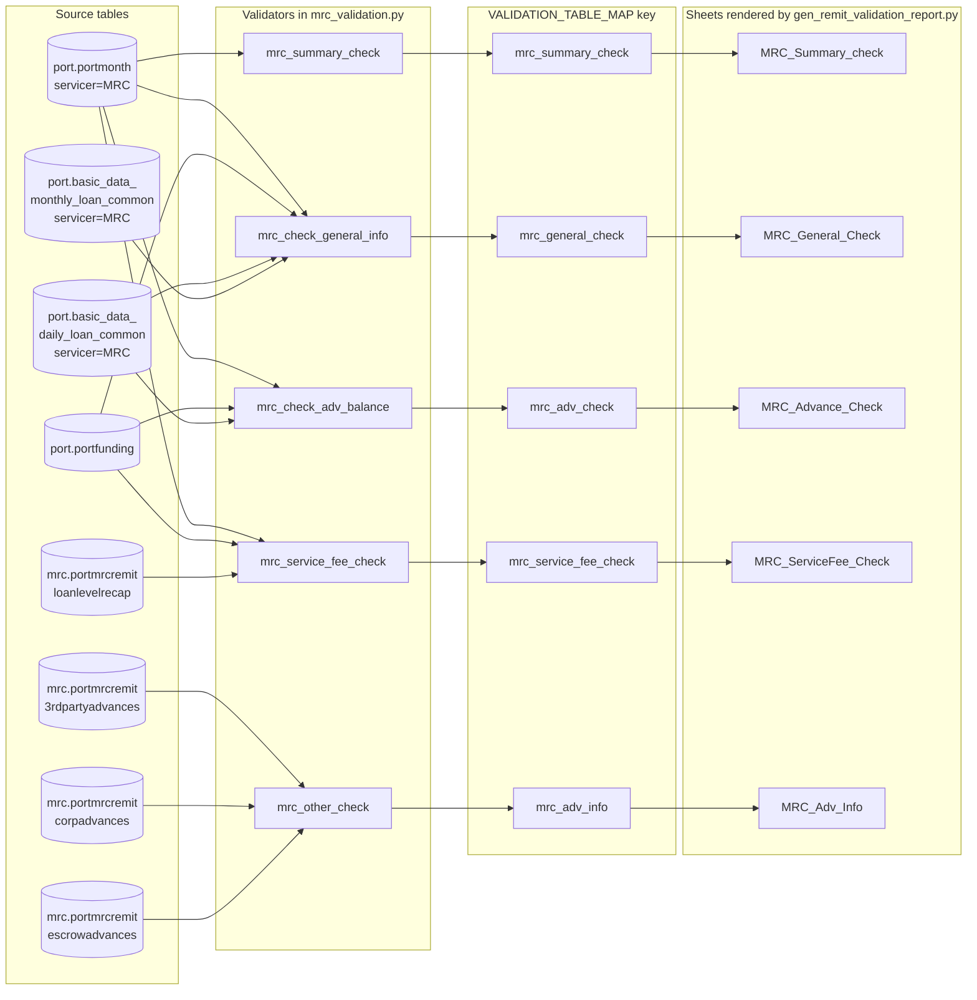
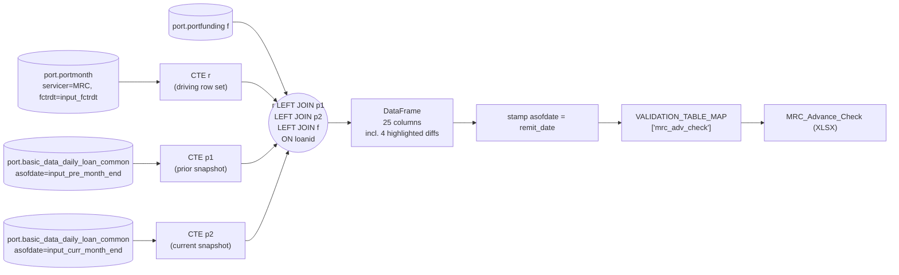
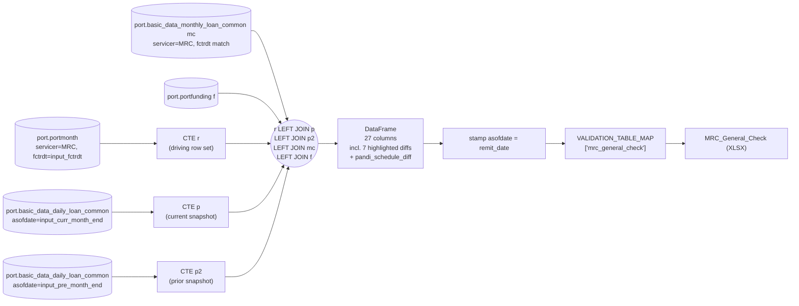
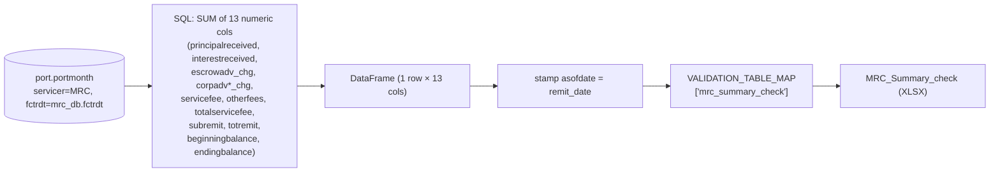
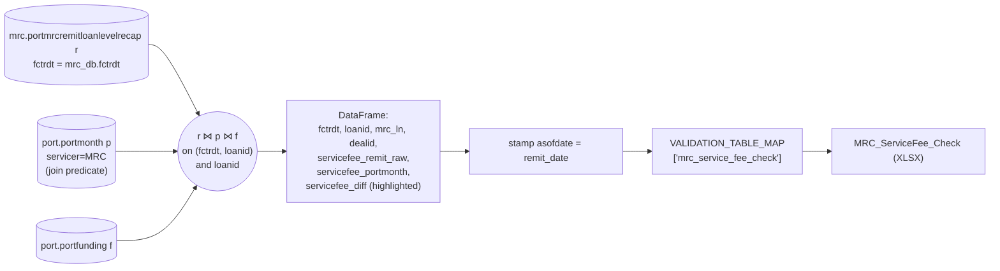
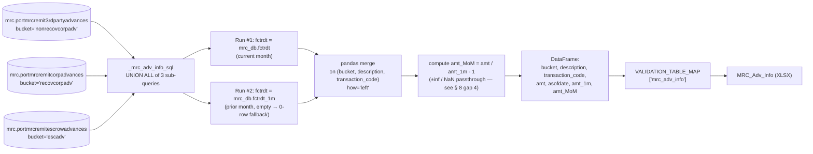
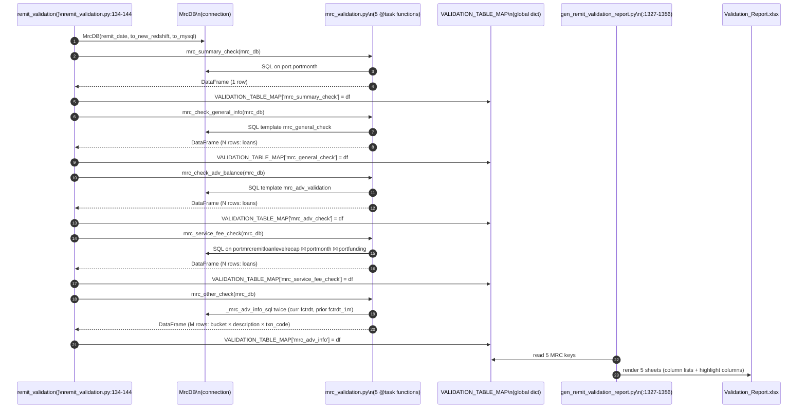

# 1.2 Dataflow Layer / 数据流层

> **Purpose**: Reverse-engineer the end-to-end MRC Validation-Report dataflow — every SQL the 5 validators issue, the tables those SQLs join, the DataFrames they produce, and the keys / column lists by which `gen_remit_validation_report.py` turns those DataFrames into the 5 `MRC_*` XLSX sheets.
>
> **Audience**: Current and future-session Copilot CLI agents; Stage 1 reviewers; the engineer who will use this chapter to write Stage 2's MRC engine.
>
> **Revision history**
>
> | Date | Author | Change |
> |---|---|---|
> | 2026-05-17 | Copilot CLI agent | v2 — apply user-/project-rule § 6.10 (diagram + text co-requirement). Added the 5-bullet textual explanation block under every figure; added 5 decomposed per-validator sub-flow diagrams (Figures 1.2.4 – 1.2.8) so each major sub-process has its own low-level diagram; renumbered the validator-to-sheet sequence diagram to Figure 1.2.9. |
> | 2026-05-17 | Copilot CLI agent | v1 — first version. Source-verified against `flow/remit_validation/mrc_validation.py`, `flow/remit_validation/servicer_validation_with_portdaily.py`, `flow/remit_validation/remit_validation.py`, `util/gen_remit_validation_report.py`. |

> **MRC chapter index** (`docs/mrc/`) — full definition in [`_chapter-index.md`](_chapter-index.md)
>
> | # | Title | File | Scope |
> |---|---|---|---|
> | 1.0 | TOC & Scope / 章节地图与范围 | `toc.en.md` | Entry & contract |
> | 1.1 | Raw Data Layer / 原始数据层 | `rawdata.en.md` | Upstream tables + time anchors |
> | 1.2 | Dataflow Layer / 数据流层 | `dataflow.en.md` | End-to-end execution pipeline |
> | 1.3 | Sheet Rendering Layer / Sheet 渲染层 | `sheets.en.md` | openpyxl rendering contract |
> | 1.4 | Field Definitions / 字段定义 | `fields.en.md` | Field-level lineage + business meaning |
> | 1.5 | Validation Rules / 验证规则 | `rules.en.md` | Rule catalogue |
> | 1.6 | Baseline XLSX Behavior / Baseline XLSX 行为 | `baseline.en.md` | Baseline truth |
> | 1.7 | User Review Gate / 用户走读评审 | (user action) | Stage 2 gate |

---

## 1. Document role

This is sub-chapter **1.2** of the MRC chapter. It answers: **for each
of the 5 `MRC_*` XLSX sheets, what is the exact dataflow — which
tables → which SQL → which DataFrame → which `VALIDATION_TABLE_MAP` key
→ which sheet?**

It assumes the reader has already read 1.1 (raw data layer); it does
**not** repeat the table-source list, the time-anchor derivations, or
the loader call graph.

It does **not**:

- Catalog every output column of every sheet (that's 1.3 sheets +
  1.4 fields).
- Explain the validation-rule semantics or highlight thresholds
  (that's 1.5 rules).
- Capture the baseline XLSX (that's 1.6 baseline).

## 2. Scope

**In scope**

- The 2 SQL templates `mrc_adv_validation` and `mrc_general_check`
  (full source structure, table list, join topology, parameters,
  emitted columns).
- The 3 inline SQL strings built inside `mrc_validation.py`
  (`mrc_summary_check`, `mrc_service_fee_check`, `_mrc_adv_info_sql`).
- The "boundary" between validator output (a pandas DataFrame) and
  XLSX sheet (a row in `gen_remit_validation_report.py`'s sheet
  registry): the `VALIDATION_TABLE_MAP` key and the `asofdate` column
  that every validator stamps onto its result.
- An end-to-end dataflow diagram + per-sheet sequence diagram showing
  the call chain from `MrcDB` to the XLSX cell.

**Out of scope**

- Highlight-column lists are mentioned (they're part of the
  validator → sheet contract) but the highlighting **logic** is in 1.5.
- The wider `port.basic_data_daily_loan_common` and
  `port.basic_data_monthly_loan_common` upstream ETL is treated as
  black-box "snapshot tables" — what flows in, not how they're built.

## 3. Overall MRC validation-report dataflow

**Figure 1.2.3 — MRC Validation Report end-to-end dataflow.**
Left column: 4 `mrc.*` raw tables + 4 `port.*` aux tables (the 4 daily/monthly snapshot tables collapsed for visual density). Middle: the 5 validators in dataflow order. Right: the 5 XLSX sheets, indexed by the intermediate `VALIDATION_TABLE_MAP` keys that decouple validator names from sheet names. Each validator runs once per `remit_date`; results flow strictly left-to-right with no cross-validator dependencies.

**Legend / Legend table**

| Node id | Meaning | Source citation |
|---|---|---|
| PM | `port.portmonth` filtered `servicer='MRC' and fctrdt=<input_fctrdt>` | `mrc_validation.py:27`, `servicer_validation_with_portdaily.py:586-588`, `:638-640` |
| PF | `port.portfunding`, left-joined for `dealid` fallback | `mrc_validation.py:93-94`, `servicer_validation_with_portdaily.py:631`, `:704` |
| PDLC | `port.basic_data_daily_loan_common` filtered `servicer='MRC' and asofdate in (input_pre_month_end, input_curr_month_end)` | `servicer_validation_with_portdaily.py:591-600`, `:642-652` |
| PMLC | `port.basic_data_monthly_loan_common` filtered `servicer='MRC' and fctrdt=<input_fctrdt>` | `servicer_validation_with_portdaily.py:699-702` |
| LLR | `mrc.portmrcremitloanlevelrecap` | `mrc_validation.py:88` |
| TPA | `mrc.portmrcremit3rdpartyadvances` | `mrc_validation.py:112` |
| CPA | `mrc.portmrcremitcorpadvances` | `mrc_validation.py:121` |
| ESA | `mrc.portmrcremitescrowadvances` | `mrc_validation.py:130` |
| V1–V5 | The 5 validator `@task` functions | `mrc_validation.py:8-158` |
| K1–K5 | `VALIDATION_TABLE_MAP` keys (string literals) | `remit_validation.py:136, 138, 140, 142, 144` |
| S1–S5 | XLSX sheet names | `gen_remit_validation_report.py:1327-1356` |

> Node ids `PM`/`PF`/`PDLC`/`PMLC`/`LLR`/`TPA`/`CPA`/`ESA`/`V1`–`V5`/`K1`–`K5`/`S1`–`S5` are display-only cross-references for this figure; they are not source-code identifiers.

**Explanation (per § 6.10 diagram + text rule)**

- **Business purpose**: prove, at a glance, that the MRC Validation Report is produced by exactly 5 validators reading 8 distinct upstream tables and writing 5 fixed XLSX sheets; no other inputs and no other outputs are in play.
- **Execution flow**: for one `remit_date`, `remit_validation()` builds a single `MrcDB` connection, then calls V1 → V2 → V3 → V4 → V5 sequentially (`remit_validation.py:134-144`); each writes its result to `VALIDATION_TABLE_MAP` under a fixed key; `gen_remit_validation_report.py` later reads those 5 keys to render the 5 sheets.
- **Input / output**: **inputs** = 8 upstream tables (4 `mrc.*` + `port.portmonth` + `port.portfunding` + `port.basic_data_daily_loan_common` + `port.basic_data_monthly_loan_common`), all filtered to `servicer='MRC'` and the appropriate time anchor (see 1.1 Raw Data Layer (rawdata.en.md) § 3); **outputs** = 5 in-memory DataFrames keyed under `mrc_summary_check` / `mrc_general_check` / `mrc_adv_check` / `mrc_service_fee_check` / `mrc_adv_info`.
- **Key transformations**: each validator embeds its own SQL (template or inline), each adds an `asofdate = mrc_db.remit_date` stamp column, and V5 additionally performs a pandas-side merge to compute month-over-month deltas (see § 6.3 and Figure 1.2.8).
- **Dependencies / assumptions**: upstream snapshot tables (`port.basic_data_*_loan_common`) are treated as black-box ground truth (their ETL is out of scope, see 1.1 Raw Data Layer (rawdata.en.md) § 8 and § 8 below); the 5 validators have no cross-validator data dependency and may be parallelized by a Stage 2 engine; the validator → key → sheet binding (§ 7.1) is fixed and is the cell-identity contract that Stage 2 must preserve.

## 4. SQL template `mrc_adv_validation`

**Source**: `servicer_validation_with_portdaily.py:583-632` (50 lines).
**Consumed by**: `mrc_check_adv_balance` validator (V3 above).
**Parameters** (placeholder → runtime substitution at `mrc_validation.py:43-45`):

| Placeholder | Substituted with | Baseline value |
|---|---|---|
| `input_fctrdt` | `mrc_db.fctrdt` | `2026-05-01` |
| `input_pre_month_end` | `mrc_db.pre_date` | `2026-03-31` |
| `input_curr_month_end` | `mrc_db.remit_date` | `2026-04-30` |

### 4.1 Table list

**Figure 1.2.4 — `mrc_check_adv_balance` (V3) sub-flow.**

Source: `servicer_validation_with_portdaily.py:583-632` (SQL template), `mrc_validation.py:39-54` (validator wrapper).

**Explanation (per § 6.10)**

- **Business purpose**: reconcile the MRC remit advance balances with the daily-snapshot-derived advance balances at month-over-month granularity, so that any divergence shows up as a non-zero `*_diff_remitvsdaily` value on `MRC_Advance_Check`.
- **Execution flow**: build CTEs `r` (driver from `port.portmonth`), `p1` (prior month-end daily snapshot), `p2` (current month-end daily snapshot); left-join all three on `loanid` plus `port.portfunding` for the `dealid` fallback; project 25 columns; the Python wrapper then stamps `asofdate = mrc_db.remit_date`.
- **Input / output**: **inputs** = `port.portmonth` (MRC × `fctrdt`), `port.basic_data_daily_loan_common` (MRC × two month-end dates), `port.portfunding`; **output** = one DataFrame, one row per MRC loan present in `port.portmonth`, 25 columns (identity, daily-snapshot balances, remit-side balances, 4 highlighted diff columns, escrow balances).
- **Key transformations**: month-over-month deltas computed inside the SQL with explicit `coalesce(..., 0)` for sums and a `case when p1.loanid is null or p2.loanid is null then null end` guard for `*_chg_daily` columns (`:608, :615-617`); remit-vs-daily diffs at `:622-625`; `dealid = coalesce(r.dealid, f.dealid)` at `:603-604`.
- **Dependencies / assumptions**: assumes both daily snapshots are populated for the prior and current month-end; loans missing from a snapshot produce `NULL` for that snapshot's columns (handled by the guards above); CTE-naming convention here is `p1=prior, p2=current` — the **opposite** of `mrc_general_check` (see § 5.2 note and § 8 gap 3).

| CTE | Underlying table | Filter |
|---|---|---|
| `r` | `port.portmonth` | `servicer = 'MRC' and fctrdt = input_fctrdt` |
| `p1` | `port.basic_data_daily_loan_common` | `asofdate = input_pre_month_end and servicer = 'MRC'` |
| `p2` | `port.basic_data_daily_loan_common` | `asofdate = input_curr_month_end and servicer = 'MRC'` |
| (outer) | `port.portfunding f` | left join `on r.loanid = f.loanid` |

### 4.2 Join topology

`r LEFT JOIN p1 ON r.loanid = p1.loanid LEFT JOIN p2 ON r.loanid = p2.loanid LEFT JOIN port.portfunding f ON r.loanid = f.loanid` (citation `:628-631`).

Driving row set: **one row per `loanid` in `port.portmonth where servicer='MRC' and fctrdt=<input_fctrdt>`**. Loans absent from the daily snapshots produce `NULL` for the `p1.*` / `p2.*` columns; the SQL uses an explicit `coalesce(..., 0)` + a `case when p1.loanid is null or p2.loanid is null then null else ...` guard for every derived "_chg_daily" column (citation `:608, :615-617`).

### 4.3 Emitted columns (the V3 result DataFrame)

Group the 25 emitted columns by purpose:

| Group | Columns | Source lines |
|---|---|---|
| Identity | `loanid`, `mrc_ln` (= `r.svcloanid`), `dealid` (= `coalesce(r.dealid, f.dealid)`) | `:602-604` |
| Delinquency | `delq_status` (from `p1.delq_status`) | `:605` |
| Escrow balances (daily) | `escrowadv_prev_daily`, `escrowadv_curr_daily`, `escrowadv_chg_daily` | `:606-608` |
| Corp advances — recoverable (daily) | `reccorpadvance_prev_daily`, `reccorpadvance_curr_daily`, `reccorpadvance_chg_daily` | `:609, :615` |
| Corp advances — non-recoverable (daily) | `nonrecovcorpadv_prev_daily`, `nonrecovcorpadv_curr_daily`, `nonrecovcorpadv_chg_daily` | `:611, :616` |
| Corp advances — total (daily) | `totalcorpadv_prev_daily`, `totalcorpadv_curr_daily`, `totalcorpadv_chg_daily` | `:613-614, :617` |
| Remit-side advance deltas | `reccorpadvance_remit`, `nonrecovadvance_remit`, `escadv_remit`, `totalcorpadvance_remit` | `:618-621` |
| **Remit vs daily diffs (highlighted)** | `escadv_diff_remitvsdaily`, `nonrecovcorpadv_diff_remitvsdaily`, `recovcorpadv_diff_remitvsdaily`, `totalcorpadv_diff_remitvsdaily` | `:622-625` |
| Escrow balance snapshots | `escrow_balance_prev`, `escrow_balance_curr` | `:626-627` |

The 4 highlighted diff columns (`escadv_diff_remitvsdaily`, `recovcorpadv_diff_remitvsdaily`, `nonrecovcorpadv_diff_remitvsdaily`, `totalcorpadv_diff_remitvsdaily`) are the ones the XLSX renderer marks with conditional formatting on the `MRC_Advance_Check` sheet (`gen_remit_validation_report.py:1344-1349`). The rule semantics for "what counts as a violation" live in 1.5 rules.

After the SQL returns, the validator stamps `asofdate = mrc_db.remit_date` onto the DataFrame (`mrc_validation.py:47`).

## 5. SQL template `mrc_general_check`

**Source**: `servicer_validation_with_portdaily.py:635-705` (71 lines).
**Consumed by**: `mrc_check_general_info` validator (V2 above).
**Parameters** (placeholders, substitution at `mrc_validation.py:61-63`):

| Placeholder | Substituted with | Baseline value |
|---|---|---|
| `input_fctrdt` | `mrc_db.fctrdt` | `2026-05-01` |
| `input_curr_month_end` | `mrc_db.remit_date` | `2026-04-30` |
| `input_pre_month_end` | `mrc_db.pre_date` | `2026-03-31` |

### 5.1 Table list

**Figure 1.2.5 — `mrc_check_general_info` (V2) sub-flow.**

Source: `servicer_validation_with_portdaily.py:635-705` (SQL template), `mrc_validation.py:57-72` (validator wrapper).

**Explanation (per § 6.10)**

- **Business purpose**: reconcile remit-side loan-level general info (rates, balances, scheduled P&I, next due date) with both the current daily snapshot and the prior daily snapshot, plus the monthly schedule, so that divergences show up as the 7 highlighted diff columns on `MRC_General_Check`.
- **Execution flow**: build CTEs `r` / `p` / `p2`; left-join to monthly `mc` on `(fctrdt, loanid, servicer='MRC')` and to `port.portfunding` on `loanid`; project 27+ columns; Python wrapper stamps `asofdate`.
- **Input / output**: **inputs** = `port.portmonth`, `port.basic_data_daily_loan_common` (two month-end snapshots), `port.basic_data_monthly_loan_common` (for `sched_pandi`), `port.portfunding`; **output** = DataFrame, one row per MRC loan in `port.portmonth`, 27 columns (identity, remit balances, daily-snapshot balances, within-remit invariant `prin_bal_diff_remit`, 7 highlighted remit-vs-daily diffs, schedule reconciliation).
- **Key transformations**: within-remit invariant `prin_bal_diff_remit = prevbal - balance - principalreceived` (`:680`); 7 remit-vs-daily diff columns (`:681-690`); `pandi_schedule_diff_remitvsdaily` reconciliation against `mc.sched_pandi` (`:691`).
- **Dependencies / assumptions**: assumes `port.basic_data_monthly_loan_common` is populated for the same `fctrdt` as `port.portmonth`; CTE-naming here is `p=current, p2=prior` — **opposite** of `mrc_adv_validation` (§ 8 gap 3); always rely on the `asofdate` filter, not the CTE name.

| CTE | Underlying table | Filter |
|---|---|---|
| `r` | `port.portmonth` | `servicer = 'MRC' and fctrdt = input_fctrdt` |
| `p` | `port.basic_data_daily_loan_common` | `asofdate = input_curr_month_end and servicer = 'MRC'` |
| `p2` | `port.basic_data_daily_loan_common` | `asofdate = input_pre_month_end and servicer = 'MRC'` |
| (outer) | `port.basic_data_monthly_loan_common mc` | left join `on r.fctrdt=mc.fctrdt and r.loanid=mc.loanid and mc.servicer='MRC'` |
| (outer) | `port.portfunding f` | left join `on r.loanid = f.loanid` |

### 5.2 Join topology

`r LEFT JOIN p ON r.loanid=p.loanid LEFT JOIN p2 ON r.loanid=p2.loanid LEFT JOIN port.basic_data_monthly_loan_common mc ON (r.fctrdt=mc.fctrdt AND r.loanid=mc.loanid AND mc.servicer='MRC') LEFT JOIN port.portfunding f ON r.loanid=f.loanid` (citation `:697-704`).

Driving row set: same as § 4 — one row per MRC loan in `port.portmonth` for the input `fctrdt`. Note the **asymmetric naming** versus § 4: here `p` is the **current** month-end snapshot and `p2` is the **prior** month-end snapshot; in `mrc_adv_validation` it's the opposite (`p1`=prior, `p2`=current). When reading the SQL by eye this is easy to invert — always rely on the `asofdate` filter, not the CTE name.

### 5.3 Emitted columns (the V2 result DataFrame)

Categorically (citations point to definition lines):

| Group | Columns | Source lines |
|---|---|---|
| Identity | `loanid`, `mrc_ln`, `dealid` | `:654-656` |
| Remit-side balances / rates | `intrate_remit`, `nextduedate_remit`, `begbal_remit`, `endbal_remit`, `principal_remit`, `interest_remit`, `pandi_remit`, `deferredprincipal_remit`, `deferredint_remit` | `:657-665` |
| Daily-snapshot side | `nextduedate_daily`, `begbal_daily`, `endbal_daily`, `deferredprincipal_daily`, `deferredint_daily`, `pandiexpected_daily`, `principalreceived_daily`, `interestreceived_daily`, `pandireceived_daily`, `intrate_daily`, `delinquency_status_mba` | `:666-679` |
| Within-remit invariant | `prin_bal_diff_remit` (= `prevbal - balance - principalreceived`) | `:680` |
| **Remit vs daily diffs (7 highlighted)** | `begbal_diff_remitvsdaily`, `endbal_diff_remitvsdaily`, `deferredprincipal_diff_remitvsdaily`, `deferredint_diff_remitvsdaily`, `intrate_diff_remitvsdaily`, `nextduedate_diff_remitvsdaily`, `pandi_diff_remitvsdaily` | `:681-690` |
| Schedule reconciliation | `pandi_schedule_diff_remitvsdaily` (uses `port.basic_data_monthly_loan_common.sched_pandi`), `pandi_paid_times_remit`, `pandi_paid_times_daily` | `:691-696` |

The 7 highlighted diffs map exactly to the highlight column list at `gen_remit_validation_report.py:1332-1338` (`intrate_diff_remitvsdaily`, `nextduedate_diff_remitvsdaily`, `begbal_diff_remitvsdaily`, `endbal_diff_remitvsdaily`, `deferredprincipal_diff_remitvsdaily`, `deferredint_diff_remitvsdaily`, `pandi_schedule_diff_remitvsdaily`). The validator stamps `asofdate = mrc_db.remit_date` at `mrc_validation.py:65`.

## 6. Inline SQL strings in `mrc_validation.py`

The other 3 validators build their SQL inline (no template). For completeness, summarized here so 1.4 fields and 1.6 baseline have a single reference.

### 6.1 `mrc_summary_check` — aggregate over `port.portmonth`

Source: `mrc_validation.py:8-36`. SQL aggregates 13 numeric columns from `port.portmonth where servicer='MRC' and fctrdt=<mrc_db.fctrdt>` using `sum(...)`. Produces a **1-row DataFrame** with: `principalreceived`, `interestreceived`, `escrowadv_chg`, `corpadvrec_chg`, `corpadvnonrec_chg`, `corpadvtotal_chg`, `servicefee`, `otherfees`, `totalservicefee` (= `sum(servicefee + otherfees)`), `subremit`, `totremit`, `beginningbalance` (= `sum(prevbal)`), `endingbalance` (= `sum(balance)`). Then stamps `asofdate`.

**Figure 1.2.6 — `mrc_summary_check` (V1) sub-flow.**

Source: `mrc_validation.py:8-36`.

**Explanation (per § 6.10)**

- **Business purpose**: produce the single-row, all-MRC-portfolio rollup that drives the top-level `MRC_Summary_check` sheet — the "are the headline totals consistent" tab of the report.
- **Execution flow**: one SQL statement aggregates 13 sums over the entire MRC slice of `port.portmonth` for the input `fctrdt`; the wrapper stamps `asofdate`; result is stored under key `mrc_summary_check`.
- **Input / output**: **input** = `port.portmonth` filtered to MRC × `fctrdt`; **output** = a 1-row × 13-column DataFrame (no per-loan grain — fully aggregated).
- **Key transformations**: pure SQL `sum(...)`; `totalservicefee` is computed as `sum(servicefee + otherfees)`; `beginningbalance` and `endingbalance` rename `sum(prevbal)` and `sum(balance)` respectively.
- **Dependencies / assumptions**: assumes `port.portmonth` for MRC × `fctrdt` is complete (any missing loans silently lower the sums); no highlight columns on the resulting sheet (per § 7.1) — this sheet is read by humans, not by the highlighter.

### 6.2 `mrc_service_fee_check` — per-loan service fee diff

Source: `mrc_validation.py:75-102`. SQL joins `mrc.portmrcremitloanlevelrecap r` to `port.portmonth p` on `(fctrdt, loanid)` filtered `p.servicer='MRC'`, and to `port.portfunding f` on `loanid`. Filter: `r.fctrdt = <mrc_db.fctrdt>`. Emitted columns: `fctrdt`, `loanid`, `mrc_ln`, `dealid` (= `coalesce(p.dealid, f.dealid)`), `servicefee_remit_raw` (= `r.total_accrued_earned_servicing_fees`), `servicefee_portmonth` (= `p.servicefee`), **`servicefee_diff`** (= `r.total_accrued_earned_servicing_fees - p.servicefee`, the single highlighted column per `gen_remit_validation_report.py:1354`). Then stamps `asofdate`.

**Figure 1.2.7 — `mrc_service_fee_check` (V4) sub-flow.**

Source: `mrc_validation.py:75-102`.

**Explanation (per § 6.10)**

- **Business purpose**: per loan, compare the service fee that the servicer's remit file claims (`r.total_accrued_earned_servicing_fees`) against what `port.portmonth` records (`p.servicefee`); any non-zero `servicefee_diff` is the single highlighted column on `MRC_ServiceFee_Check`.
- **Execution flow**: drive from `mrc.portmrcremitloanlevelrecap` filtered to `fctrdt`; left-join `port.portmonth` (MRC predicate inside the join condition) and `port.portfunding` for the `dealid` fallback; wrapper stamps `asofdate`.
- **Input / output**: **inputs** = `mrc.portmrcremitloanlevelrecap`, `port.portmonth`, `port.portfunding`; **output** = DataFrame with one row per remit-recap loan, 7 columns including the single highlighted `servicefee_diff`.
- **Key transformations**: simple subtraction `servicefee_diff = r.total_accrued_earned_servicing_fees - p.servicefee`; `dealid = coalesce(p.dealid, f.dealid)`.
- **Dependencies / assumptions**: the `p.servicer='MRC'` predicate is placed inside the **join condition**, not in a `WHERE` clause — functionally equivalent for the left join (see § 8 gap 5); loans absent from `port.portmonth` will produce `servicefee_portmonth = NULL` and therefore `servicefee_diff = NULL` (silent miss, not flagged).

### 6.3 `_mrc_adv_info_sql` + `mrc_other_check` — bucketed advances with month-over-month

Source: `mrc_validation.py:105-158`. The helper `_mrc_adv_info_sql(fctrdt)` returns a `UNION ALL` of 3 sub-queries — one per "bucket":

| Bucket literal | Underlying table | `description` source | `transaction_code` source | Aggregation |
|---|---|---|---|---|
| `'nonrecovcorpadv'` | `mrc.portmrcremit3rdpartyadvances` | `description` | `tran_code` | `sum(coalesce(advances, 0) + coalesce(recoveries, 0))` |
| `'recovcorpadv'` | `mrc.portmrcremitcorpadvances` | `reason` | `tran_code` | `sum(coalesce(advances, 0) + coalesce(recoveries, 0))` |
| `'escadv'` | `mrc.portmrcremitescrowadvances` | `cat` | `disbursement_code` | `sum(total_activity)` |

All three filter on `fctrdt = '<input>'` and `GROUP BY description, tran_code` (or `reason, tran_code` / `cat, disbursement_code`).

`mrc_other_check` (`:136-158`) runs this SQL **twice**: once with `mrc_db.fctrdt` (curr) and once with `mrc_db.fctrdt_1m` (prior). If the prior result is empty it substitutes an empty DataFrame with the 4 expected columns (`:144-145`). It then `pd.merge(curr, pre, on=['bucket','description','transaction_code'], how='left')` and computes `amt_MoM = amt / amt_1m - 1` (`:148-154`). Final columns: `bucket`, `description`, `transaction_code`, `amt`, `asofdate`, `amt_1m`, `amt_MoM`. No highlight columns (`gen_remit_validation_report.py:1356`).

> Edge case: when `amt_1m` is 0 or NaN, `amt_MoM` becomes `±inf` / `NaN` respectively. The validator does not currently mask either case — they pass through to the XLSX cell. Whether the renderer formats `inf` deterministically must be verified during 1.6 baseline capture.

**Figure 1.2.8 — `mrc_other_check` (V5) sub-flow.**

Source: `mrc_validation.py:105-158`.

**Explanation (per § 6.10)**

- **Business purpose**: produce a bucketed, descriptor-level view of MRC advances (3rd-party, corporate, escrow) with month-over-month change, so analysts can spot bucket-level shifts on `MRC_Adv_Info`.
- **Execution flow**: build the 3-bucket `UNION ALL` SQL once; run it twice (current `fctrdt`, prior `fctrdt_1m`); apply a 4-column empty-frame fallback when the prior result is empty; pandas-side `merge(how='left')` on `(bucket, description, transaction_code)`; compute `amt_MoM`; stamp `asofdate`.
- **Input / output**: **inputs** = `mrc.portmrcremit3rdpartyadvances`, `mrc.portmrcremitcorpadvances`, `mrc.portmrcremitescrowadvances` (each at 2 `fctrdt` values); **output** = DataFrame with M rows where M = current-period (bucket × description × transaction_code) cardinality; 7 columns (including `amt_MoM`).
- **Key transformations**: the SQL-side `sum(coalesce(advances,0) + coalesce(recoveries,0))` (3rd-party + corp) and `sum(total_activity)` (escrow) per `(bucket, description, txn_code)`; the pandas-side left merge guarantees current-period rows are preserved even when no prior match exists; `amt_MoM = amt / amt_1m - 1`.
- **Dependencies / assumptions**: assumes the 3 source tables expose stable column names across `fctrdt`s; **MoM may be `±inf` or `NaN`** when prior `amt_1m` is zero or absent — not masked (§ 8 gap 4); the prior empty-frame fallback is the only safety net for missing prior data; sheet has no highlight columns (§ 7.1).

## 7. Validator → key → sheet binding

**Figure 1.2.9 — Per-`remit_date` validator-to-sheet call sequence.**
Vertical = time; horizontal = participant. The orchestrator (`remit_validation()`) drives 5 validators sequentially against a single `MrcDB` connection; each validator returns a pandas DataFrame; the orchestrator stores it in the module-global `VALIDATION_TABLE_MAP` under a fixed string key; `gen_remit_validation_report.py` then iterates 5 (sheet-name, columns, highlights) tuples and writes them to the workbook.

**Step-by-step explanation**

1. `MrcDB(remit_date, ...)` builds the time anchors (`fctrdt`, `fctrdt_1m`, `pre_date`) — see 1.1 Raw Data Layer (rawdata.en.md) § 3.
2. `mrc_summary_check` runs first; returns a **1-row** DataFrame.
3. The orchestrator stores the result under the key `'mrc_summary_check'` in the module-global `VALIDATION_TABLE_MAP` (`remit_validation.py:136`).
4. Same pattern for `mrc_check_general_info` → key `'mrc_general_check'` (`:138`).
5. Same for `mrc_check_adv_balance` → key `'mrc_adv_check'` (`:140`).
6. Same for `mrc_service_fee_check` → key `'mrc_service_fee_check'` (`:142`).
7. Same for `mrc_other_check` → key `'mrc_adv_info'` (`:144`). Note this validator runs **two** queries (curr + prior `fctrdt`) and does a pandas-side merge.
8. After **all** servicers complete, `gen_remit_validation_report.py:1327-1356` reads the 5 MRC keys from `VALIDATION_TABLE_MAP` and renders each as one XLSX sheet using a fixed column list (defined via the `_summary_columns()` / `_general_columns()` / `_advance_columns()` / `_service_fee_columns()` / `_adv_info_columns()` helpers) and an optional highlight-column list.

**Explanation (per § 6.10)**

- **Business purpose**: make the orchestration contract explicit — show the strict sequence in which `remit_validation()` calls the 5 validators, the place where each result lands (`VALIDATION_TABLE_MAP[<key>]`), and the point at which `gen_remit_validation_report.py` later consumes those keys. This is the level of detail a reader needs to trace any sheet cell back to its writer.
- **Execution flow**: 5 validator calls execute strictly sequentially against a single `MrcDB`; each one returns and the orchestrator immediately assigns the result to `VALIDATION_TABLE_MAP`; sheet rendering happens later, after **all** servicers (not only MRC) finish.
- **Input / output**: **input** = a `remit_date` (and the `MrcDB(remit_date, ...)` connection it builds); **output** = 5 fresh entries in the module-global `VALIDATION_TABLE_MAP` (keys: `mrc_summary_check`, `mrc_general_check`, `mrc_adv_check`, `mrc_service_fee_check`, `mrc_adv_info`).
- **Key transformations**: none performed by the orchestrator itself — it is a pure dispatcher; all transformations live inside the individual validators (Figures 1.2.4–1.2.8) and inside the renderer (§ 7.1 helpers, detailed in 1.3 Sheet Rendering Layer (sheets.en.md)).
- **Dependencies / assumptions**: the 5 calls are written sequentially in source but have **no inter-validator data dependency**, so a Stage 2 engine may parallelize them safely; `VALIDATION_TABLE_MAP` is module-global, which is the implicit handoff channel between validators and the renderer — Stage 2 must preserve either the same key names or an equivalent abstraction.

### 7.1 Key-to-sheet table (the cell-identity contract)

| Validator (`@task` name) | `VALIDATION_TABLE_MAP` key | XLSX sheet name | Column-list helper | Highlight columns |
|---|---|---|---|---|
| `mrc_summary_check` | `mrc_summary_check` | `MRC_Summary_check` | `_summary_columns()` | (none) |
| `mrc_check_general_info` | `mrc_general_check` | `MRC_General_Check` | `_general_columns("mrc_ln")` | 7 (see § 5.3) |
| `mrc_check_adv_balance` | `mrc_adv_check` | `MRC_Advance_Check` | `_advance_columns("mrc_ln")` | 4 (see § 4.3) |
| `mrc_service_fee_check` | `mrc_service_fee_check` | `MRC_ServiceFee_Check` | `_service_fee_columns("mrc_ln")` | `["servicefee_diff"]` |
| `mrc_other_check` | `mrc_adv_info` | `MRC_Adv_Info` | `_adv_info_columns()` | (none) |

Citations: `remit_validation.py:134-144` (assignment); `gen_remit_validation_report.py:1327-1356` (sheet registry).

> This table **is** the boundary contract that Stage 2 must reproduce: any new engine that produces the same 5 keys → DataFrames with the same column ordering / cell values will render the same 5 sheets when fed through `gen_remit_validation_report.py`.

## 8. Assumptions and unresolved gaps

1. **`port.basic_data_daily_loan_common` / `port.basic_data_monthly_loan_common` upstream lineage** is **not** analyzed here. We treat them as snapshot tables keyed by `(asofdate, servicer, loanid)` and `(fctrdt, servicer, loanid)` respectively. Both are populated by other flows under `flow/basic_data/`; their build is out of scope for the Stage 1 Validation-Report whitebox.
2. **`port.portmonth` build path is also out of scope.** Its content for MRC at `fctrdt = 2026-05-01` is taken as ground truth for Stage 1 baseline.
3. **CTE-naming asymmetry between `mrc_adv_validation` and `mrc_general_check`** (§ 5.2 note): in `mrc_adv_validation`, `p1=prior, p2=current`; in `mrc_general_check`, `p=current, p2=prior`. Documented but **not "fixed"** — Stage 1 documents as-is.
4. **`mrc_other_check` `amt_MoM` edge cases** (§ 6.3 note): division by zero → `inf`; missing prior → `NaN`. Renderer behavior on these values must be verified in 1.6 baseline.
5. **`mrc_service_fee_check` join key**: the join `port.portmonth p ON r.fctrdt=p.fctrdt AND r.loanid=p.loanid AND p.servicer='MRC'` puts the `servicer='MRC'` predicate in the **join condition**, not in a `WHERE` clause. Functionally equivalent for a left join (a non-MRC row would not satisfy the predicate and `p.servicefee` would be null), but worth noting if the SQL is ever rewritten.
6. **Order of validators is fixed** at `remit_validation.py:134-144` and there are **no cross-validator data dependencies** (each reads from `MrcDB` independently). Stage 2 engines may therefore parallelize the 5 validators safely.

## 9. Source citation index

| File | Lines | Note |
|---|---|---|
| `flow/remit_validation/mrc_validation.py` | `mrc_validation.py:1-6` | imports (the 2 SQL templates) |
| `flow/remit_validation/mrc_validation.py` | `mrc_validation.py:8-36` | `mrc_summary_check` (inline SQL) |
| `flow/remit_validation/mrc_validation.py` | `mrc_validation.py:39-54` | `mrc_check_adv_balance` (uses template) |
| `flow/remit_validation/mrc_validation.py` | `mrc_validation.py:57-72` | `mrc_check_general_info` (uses template) |
| `flow/remit_validation/mrc_validation.py` | `mrc_validation.py:75-102` | `mrc_service_fee_check` (inline SQL) |
| `flow/remit_validation/mrc_validation.py` | `mrc_validation.py:105-133` | `_mrc_adv_info_sql` helper (3-way UNION ALL) |
| `flow/remit_validation/mrc_validation.py` | `mrc_validation.py:136-158` | `mrc_other_check` (runs helper twice + merge) |
| `flow/remit_validation/servicer_validation_with_portdaily.py` | `servicer_validation_with_portdaily.py:583-632` | SQL template `mrc_adv_validation` |
| `flow/remit_validation/servicer_validation_with_portdaily.py` | `servicer_validation_with_portdaily.py:635-705` | SQL template `mrc_general_check` |
| `flow/remit_validation/remit_validation.py` | `remit_validation.py:134-144` | MRC orchestration block (5 calls + 5 `VALIDATION_TABLE_MAP` assignments) |
| `util/gen_remit_validation_report.py` | `gen_remit_validation_report.py:1327-1356` | 5 MRC sheet registry entries (column lists + highlight columns) |
