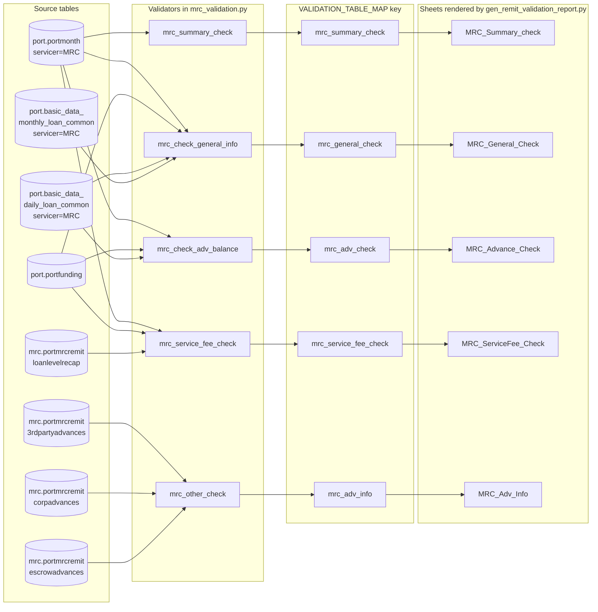
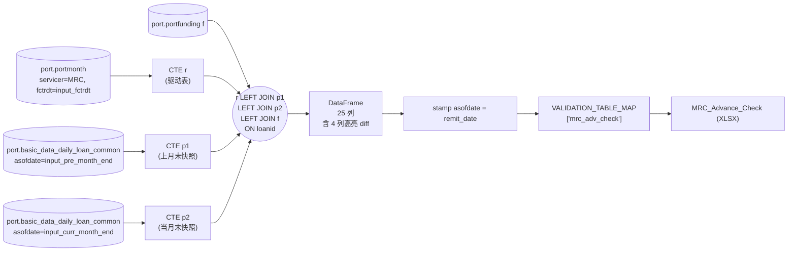
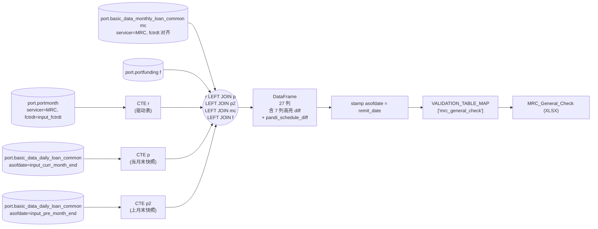
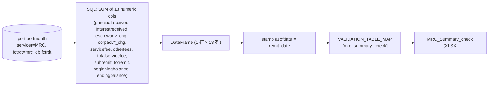
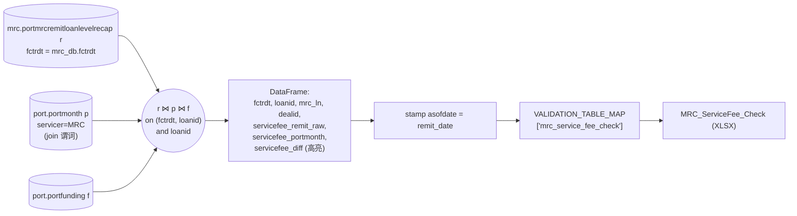
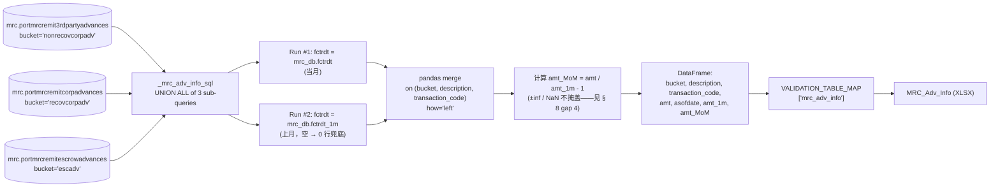
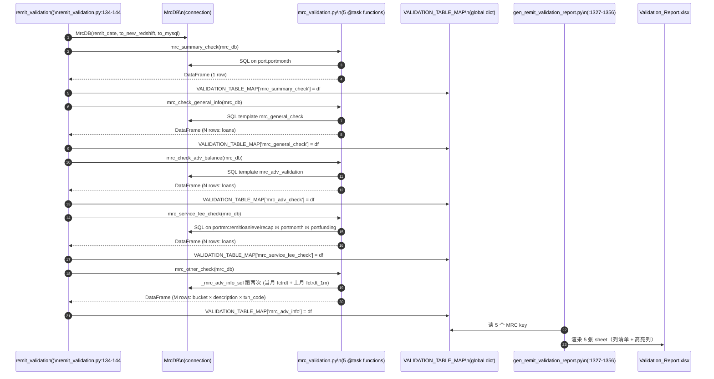

# 1.2 Dataflow Layer / 数据流层

> **文档定位 / Purpose**：逆向并记录 MRC Validation Report 的端到端数据流——5 个 validator 发出的每一条 SQL、这些 SQL 涉及的表与 join 拓扑、它们产出的 DataFrame，以及 `gen_remit_validation_report.py` 把这些 DataFrame 渲染成 5 张 `MRC_*` XLSX sheet 时所使用的 key 与列清单。
>
> **目标读者 / Audience**：当前及未来 session 的 Copilot CLI agent；Stage 1 评审人；未来基于本章写 Stage 2 MRC 引擎的工程师。
>
> **修订历史 / Revision history**
>
> | 日期 | 作者 | 变更 |
> |---|---|---|
> | 2026-05-17 | Copilot CLI agent | v2 — 按用户级 / 项目级规则 § 6.10（图 + 文双要求）刷新。每张图后补齐 5 条要点的文字说明；新增 5 张按 validator 拆解的子流程图（图 1.2.4 – 1.2.8），让每个主要子过程都有自己的低层图；validator → sheet 时序图编号从 1.2.7 调整为 1.2.9。 |
> | 2026-05-17 | Copilot CLI agent | v1 — 首版。源代码佐证文件：`flow/remit_validation/mrc_validation.py`、`flow/remit_validation/servicer_validation_with_portdaily.py`、`flow/remit_validation/remit_validation.py`、`util/gen_remit_validation_report.py`。 |

> **MRC 章节索引** （`docs/mrc/`）—— 完整定义见 [`_chapter-index.md`](_chapter-index.md)
>
> | # | 标题 | 文件 | 职责 |
> |---|---|---|---|
> | 1.0 | TOC & Scope / 章节地图与范围 | `toc.zh.md` | 入口与契约 |
> | 1.1 | Raw Data Layer / 原始数据层 | `rawdata.zh.md` | 上游表 + 时间锚 |
> | 1.2 | Dataflow Layer / 数据流层 | `dataflow.zh.md` | 端到端执行流水线 |
> | 1.3 | Sheet Rendering Layer / Sheet 渲染层 | `sheets.zh.md` | openpyxl 渲染契约 |
> | 1.4 | Field Definitions / 字段定义 | `fields.zh.md` | 字段级血缘 + 业务含义 |
> | 1.5 | Validation Rules / 验证规则 | `rules.zh.md` | 规则目录 |
> | 1.6 | Baseline XLSX Behavior / Baseline XLSX 行为 | `baseline.zh.md` | baseline 真值 |
> | 1.7 | User Review Gate / 用户走读评审 | （用户动作） | Stage 2 开闸点 |

---

## 1. Document role

本文是 MRC 章节的子章节 **1.2**。它只回答一个问题：**对于 5 张
`MRC_*` XLSX sheet 中的每一张，端到端数据流究竟是什么——哪些表 → 哪条
SQL → 哪个 DataFrame → 哪个 `VALIDATION_TABLE_MAP` key → 哪张
sheet？**

它假定读者已读过 1.1（原始数据层），不重复表来源清单、时间锚点的推导，
或加载器调用图。

它**不**：

- 罗列每张 sheet 的每一个输出列（属于 1.3 sheets + 1.4 fields）。
- 解释校验规则语义或高亮阈值（属于 1.5 rules）。
- 捕获基线 XLSX（属于 1.6 baseline）。

## 2. Scope

**在范围内**

- 2 份 SQL template `mrc_adv_validation` 与 `mrc_general_check`
  （完整源结构、表清单、join 拓扑、入参、产出列）。
- `mrc_validation.py` 中内联拼出的 3 段 SQL
  （`mrc_summary_check`、`mrc_service_fee_check`、`_mrc_adv_info_sql`）。
- validator 输出（pandas DataFrame）与 XLSX sheet
  （`gen_remit_validation_report.py` 中 sheet 注册表的一行）之间的"边
  界"：`VALIDATION_TABLE_MAP` key 与每个 validator 给 DataFrame 打上的
  `asofdate` 列。
- 一张端到端数据流图加一张每张 sheet 的时序图，展示从 `MrcDB` 一路到
  XLSX 单元格的调用链。

**不在范围内**

- 高亮列清单只是顺带提到（作为 validator → sheet 契约的一部分），高亮
  **逻辑**属于 1.5。
- 更上游的 `port.basic_data_daily_loan_common` /
  `port.basic_data_monthly_loan_common` ETL 视为黑盒"快照表"——只看流
  入的内容，不看构建过程。

## 3. Overall MRC validation-report dataflow

**图 1.2.3 — MRC Validation Report 端到端数据流。**
左列：4 张 `mrc.*` 原始表 + 4 张 `port.*` 辅助表（4 张日/月快照表为视觉
密度做了折叠）。中间：5 个按数据流顺序排列的 validator。右列：5 张
XLSX sheet，以中间的 `VALIDATION_TABLE_MAP` key 索引——该 key 把
validator 名与 sheet 名解耦。每个 validator 每个 `remit_date` 跑一次；
数据严格左到右流动，无跨 validator 依赖。

**图例 / Legend**

| Node id | 含义 | 代码佐证 |
|---|---|---|
| PM | `port.portmonth`，过滤 `servicer='MRC' and fctrdt=<input_fctrdt>` | `mrc_validation.py:27`、`servicer_validation_with_portdaily.py:586-588`、`:638-640` |
| PF | `port.portfunding`，left join 用作 `dealid` 兜底 | `mrc_validation.py:93-94`、`servicer_validation_with_portdaily.py:631`、`:704` |
| PDLC | `port.basic_data_daily_loan_common`，过滤 `servicer='MRC' and asofdate in (input_pre_month_end, input_curr_month_end)` | `servicer_validation_with_portdaily.py:591-600`、`:642-652` |
| PMLC | `port.basic_data_monthly_loan_common`，过滤 `servicer='MRC' and fctrdt=<input_fctrdt>` | `servicer_validation_with_portdaily.py:699-702` |
| LLR | `mrc.portmrcremitloanlevelrecap` | `mrc_validation.py:88` |
| TPA | `mrc.portmrcremit3rdpartyadvances` | `mrc_validation.py:112` |
| CPA | `mrc.portmrcremitcorpadvances` | `mrc_validation.py:121` |
| ESA | `mrc.portmrcremitescrowadvances` | `mrc_validation.py:130` |
| V1–V5 | 5 个 validator `@task` 函数 | `mrc_validation.py:8-158` |
| K1–K5 | `VALIDATION_TABLE_MAP` key（字符串字面量） | `remit_validation.py:136, 138, 140, 142, 144` |
| S1–S5 | XLSX sheet 名 | `gen_remit_validation_report.py:1327-1356` |

> 节点 id `PM`/`PF`/`PDLC`/`PMLC`/`LLR`/`TPA`/`CPA`/`ESA`/`V1`–`V5`/`K1`–`K5`/`S1`–`S5` 仅是图内交叉引用，不是源码标识符。

**说明（依规则 § 6.10 图 + 文双要求）**

- **业务目的 / Business purpose**：一眼可见 MRC Validation Report 由 5 个 validator 读取 8 张上游表、写出 5 张固定的 XLSX sheet 来生成；没有其他输入、也没有其他输出。
- **执行流程 / Execution flow**：对单个 `remit_date`，`remit_validation()` 建立唯一一条 `MrcDB` 连接，依次调用 V1 → V2 → V3 → V4 → V5（`remit_validation.py:134-144`）；每个 validator 把结果以固定 key 写入 `VALIDATION_TABLE_MAP`；`gen_remit_validation_report.py` 之后读取这 5 个 key 渲染 5 张 sheet。
- **输入 / 输出 / Input / output**：**输入** = 8 张上游表（4 张 `mrc.*` + `port.portmonth` + `port.portfunding` + `port.basic_data_daily_loan_common` + `port.basic_data_monthly_loan_common`），全部过滤到 `servicer='MRC'` 并使用对应时间锚点（见 1.1 原始数据层 (rawdata.zh.md) § 3）；**输出** = 5 份内存 DataFrame，分别挂在 `mrc_summary_check` / `mrc_general_check` / `mrc_adv_check` / `mrc_service_fee_check` / `mrc_adv_info` 这 5 个 key 下。
- **关键变换 / Key transformations**：每个 validator 内嵌自己的 SQL（模板或内联拼接）；每个都给 DataFrame 加一列 `asofdate = mrc_db.remit_date`；V5 还会额外做 pandas 侧 merge 计算月环比（见 § 6.3 与图 1.2.8）。
- **依赖 / 假设 / Dependencies / assumptions**：上游快照表（`port.basic_data_*_loan_common`）按黑盒真相处理（其 ETL 不在范围内，详见 1.1 原始数据层 (rawdata.zh.md) § 8 与本章 § 8）；5 个 validator 之间无数据依赖，Stage 2 引擎可并行；validator → key → sheet 绑定（§ 7.1）固定不变，是 Stage 2 必须复现的单元格一致性契约。

## 4. SQL template `mrc_adv_validation`

**源**：`servicer_validation_with_portdaily.py:583-632`（50 行）。
**被谁用**：`mrc_check_adv_balance` validator（上图 V3）。
**入参**（占位符 → 运行期替换，替换发生在 `mrc_validation.py:43-45`）：

| 占位符 | 替换为 | 基线取值 |
|---|---|---|
| `input_fctrdt` | `mrc_db.fctrdt` | `2026-05-01` |
| `input_pre_month_end` | `mrc_db.pre_date` | `2026-03-31` |
| `input_curr_month_end` | `mrc_db.remit_date` | `2026-04-30` |

### 4.1 Table list

**图 1.2.4 — `mrc_check_adv_balance`（V3）子流程图。**

来源：`servicer_validation_with_portdaily.py:583-632`（SQL 模板）；`mrc_validation.py:39-54`（validator 外壳）。

**说明（依规则 § 6.10）**

- **业务目的 / Business purpose**：把 MRC 当月 remit 端的"垫付余额"与"日快照推出的垫付余额"做月环比对账，使任何差异以非零的 `*_diff_remitvsdaily` 出现在 `MRC_Advance_Check` 上。

- **执行流程 / Execution flow**：构建 CTE `r`（来自 `port.portmonth` 的驱动表）、`p1`（上月末日快照）、`p2`（当月末日快照）；三者按 `loanid` 左联，再左联 `port.portfunding` 用作 `dealid` 兜底；投影 25 列；Python 外壳给结果加 `asofdate = mrc_db.remit_date`。

- **输入 / 输出 / Input / output**：**输入** = `port.portmonth`（MRC × `fctrdt`）、`port.basic_data_daily_loan_common`（MRC × 两个月末日期）、`port.portfunding`；**输出** = 一份 DataFrame，每个 MRC loan 一行（loan 必须出现在 `port.portmonth` 中），共 25 列（身份、日快照余额、remit 端余额、4 列高亮 diff、escrow 余额）。

- **关键变换 / Key transformations**：SQL 内部用 `coalesce(..., 0)` 与 `case when p1.loanid is null or p2.loanid is null then null end` 守护 `*_chg_daily` 月环比列（`:608, :615-617`）；remit-vs-daily diff 列在 `:622-625`；`dealid = coalesce(r.dealid, f.dealid)` 在 `:603-604`。

- **依赖 / 假设 / Dependencies / assumptions**：假设上月末与当月末两个日快照都已 ingest；缺失 loan 的列被守护表达式置 NULL；本模板 CTE 命名约定为 `p1=prior, p2=current`，与 `mrc_general_check` **相反**（详见 § 5.2 备注与 § 8 gap 3）。

  ( ingest: 上个月月底的数据快照  本月月底的数据快已经被导入数据库/数据仓库了。)

| CTE | 底层表 | 过滤 |
|---|---|---|
| `r` | `port.portmonth` | `servicer = 'MRC' and fctrdt = input_fctrdt` |
| `p1` | `port.basic_data_daily_loan_common` | `asofdate = input_pre_month_end and servicer = 'MRC'` |
| `p2` | `port.basic_data_daily_loan_common` | `asofdate = input_curr_month_end and servicer = 'MRC'` |
| （外层） | `port.portfunding f` | left join `on r.loanid = f.loanid` |

### 4.2 Join topology

`r LEFT JOIN p1 ON r.loanid = p1.loanid LEFT JOIN p2 ON r.loanid = p2.loanid LEFT JOIN port.portfunding f ON r.loanid = f.loanid`（佐证 `:628-631`）。

驱动行集：**每个 `loanid` 一行，取自 `port.portmonth where servicer='MRC' and fctrdt=<input_fctrdt>`**。日快照中找不到的 loan，其 `p1.*` / `p2.*` 列结果为 `NULL`；SQL 对每个派生的 "_chg_daily" 列都显式加了 `coalesce(..., 0)` 与 `case when p1.loanid is null or p2.loanid is null then null else ...` 兜底（佐证 `:608, :615-617`）。

### 4.3 Emitted columns（V3 结果 DataFrame）

按用途分组展示这 25 个产出列：

| 组 | 列 | 源代码行 |
|---|---|---|
| Identity | `loanid`、`mrc_ln`（= `r.svcloanid`）、`dealid`（= `coalesce(r.dealid, f.dealid)`） | `:602-604` |
| Delinquency | `delq_status`（来自 `p1.delq_status`） | `:605` |
| Escrow balances (daily) | `escrowadv_prev_daily`、`escrowadv_curr_daily`、`escrowadv_chg_daily` | `:606-608` |
| Corp advances — recoverable (daily) | `reccorpadvance_prev_daily`、`reccorpadvance_curr_daily`、`reccorpadvance_chg_daily` | `:609, :615` |
| Corp advances — non-recoverable (daily) | `nonrecovcorpadv_prev_daily`、`nonrecovcorpadv_curr_daily`、`nonrecovcorpadv_chg_daily` | `:611, :616` |
| Corp advances — total (daily) | `totalcorpadv_prev_daily`、`totalcorpadv_curr_daily`、`totalcorpadv_chg_daily` | `:613-614, :617` |
| Remit-side advance deltas | `reccorpadvance_remit`、`nonrecovadvance_remit`、`escadv_remit`、`totalcorpadvance_remit` | `:618-621` |
| **Remit vs daily diffs（高亮）** | `escadv_diff_remitvsdaily`、`nonrecovcorpadv_diff_remitvsdaily`、`recovcorpadv_diff_remitvsdaily`、`totalcorpadv_diff_remitvsdaily` | `:622-625` |
| Escrow balance snapshots | `escrow_balance_prev`、`escrow_balance_curr` | `:626-627` |

这 4 个高亮 diff 列（`escadv_diff_remitvsdaily`、`recovcorpadv_diff_remitvsdaily`、`nonrecovcorpadv_diff_remitvsdaily`、`totalcorpadv_diff_remitvsdaily`）即 XLSX 渲染器在 `MRC_Advance_Check` sheet 上加条件格式的列（`gen_remit_validation_report.py:1344-1349`）。"什么算违规"的规则语义放在 1.5 rules。

SQL 返回后，validator 给 DataFrame 加列 `asofdate = mrc_db.remit_date`（`mrc_validation.py:47`）。

## 5. SQL template `mrc_general_check`

**源**：`servicer_validation_with_portdaily.py:635-705`（71 行）。
**被谁用**：`mrc_check_general_info` validator（上图 V2）。
**入参**（占位符替换发生在 `mrc_validation.py:61-63`）：

| 占位符 | 替换为 | 基线取值 |
|---|---|---|
| `input_fctrdt` | `mrc_db.fctrdt` | `2026-05-01` |
| `input_curr_month_end` | `mrc_db.remit_date` | `2026-04-30` |
| `input_pre_month_end` | `mrc_db.pre_date` | `2026-03-31` |

### 5.1 Table list

**图 1.2.5 — `mrc_check_general_info`（V2）子流程图。**

来源：`servicer_validation_with_portdaily.py:635-705`（SQL 模板）；`mrc_validation.py:57-72`（validator 外壳）。

**说明（依规则 § 6.10）**

- **业务目的 / Business purpose**：把 remit 端 loan-level 通用信息（利率、余额、计划 P&I、下一笔到期日）与当月日快照、上月日快照、月度计划做对账，差异以 7 列高亮 diff 呈现在 `MRC_General_Check` 上。
- **执行流程 / Execution flow**：构建 CTE `r` / `p` / `p2`；按 `loanid` 左联到三者；再左联月度 `mc`（`fctrdt, loanid, servicer='MRC'`）与 `port.portfunding`；投影 27+ 列；Python 外壳 stamp `asofdate`。
- **输入 / 输出 / Input / output**：**输入** = `port.portmonth`、`port.basic_data_daily_loan_common`（两个月末快照）、`port.basic_data_monthly_loan_common`（取 `sched_pandi`）、`port.portfunding`；**输出** = DataFrame，每个 MRC loan 一行，共 27 列（身份、remit 余额、日快照余额、remit 内部不变量 `prin_bal_diff_remit`、7 列高亮 remit-vs-daily diff、计划对账）。
- **关键变换 / Key transformations**：remit 内部不变量 `prin_bal_diff_remit = prevbal - balance - principalreceived`（`:680`）；7 列 remit-vs-daily diff（`:681-690`）；`pandi_schedule_diff_remitvsdaily` 与 `mc.sched_pandi` 对账（`:691`）。
- **依赖 / 假设 / Dependencies / assumptions**：假设 `port.basic_data_monthly_loan_common` 在同一 `fctrdt` 已 ingest；本模板 CTE 命名为 `p=current, p2=prior`，与 `mrc_adv_validation` **相反**（§ 8 gap 3）；判断时永远以 `asofdate` 过滤为准，不要看 CTE 名字。

| CTE | 底层表 | 过滤 |
|---|---|---|
| `r` | `port.portmonth` | `servicer = 'MRC' and fctrdt = input_fctrdt` |
| `p` | `port.basic_data_daily_loan_common` | `asofdate = input_curr_month_end and servicer = 'MRC'` |
| `p2` | `port.basic_data_daily_loan_common` | `asofdate = input_pre_month_end and servicer = 'MRC'` |
| （外层） | `port.basic_data_monthly_loan_common mc` | left join `on r.fctrdt=mc.fctrdt and r.loanid=mc.loanid and mc.servicer='MRC'` |
| （外层） | `port.portfunding f` | left join `on r.loanid = f.loanid` |

### 5.2 Join topology

`r LEFT JOIN p ON r.loanid=p.loanid LEFT JOIN p2 ON r.loanid=p2.loanid LEFT JOIN port.basic_data_monthly_loan_common mc ON (r.fctrdt=mc.fctrdt AND r.loanid=mc.loanid AND mc.servicer='MRC') LEFT JOIN port.portfunding f ON r.loanid=f.loanid`（佐证 `:697-704`）。

驱动行集同 § 4——每个 MRC loan 一行（来自给定 `fctrdt` 下的 `port.portmonth`）。**注意 CTE 命名的不对称**：这里 `p` 是**当前**月末快照、`p2` 是**前一**月末快照；而 `mrc_adv_validation` 中是反的（`p1`=前、`p2`=当）。肉眼读 SQL 时极易反过来——始终以 `asofdate` 过滤为准，不要以 CTE 名为准。

### 5.3 Emitted columns（V2 结果 DataFrame）

按类（行号指列定义行）：

| 组 | 列 | 源代码行 |
|---|---|---|
| Identity | `loanid`、`mrc_ln`、`dealid` | `:654-656` |
| Remit-side 余额/利率 | `intrate_remit`、`nextduedate_remit`、`begbal_remit`、`endbal_remit`、`principal_remit`、`interest_remit`、`pandi_remit`、`deferredprincipal_remit`、`deferredint_remit` | `:657-665` |
| Daily-snapshot 端 | `nextduedate_daily`、`begbal_daily`、`endbal_daily`、`deferredprincipal_daily`、`deferredint_daily`、`pandiexpected_daily`、`principalreceived_daily`、`interestreceived_daily`、`pandireceived_daily`、`intrate_daily`、`delinquency_status_mba` | `:666-679` |
| Remit 内部一致性 | `prin_bal_diff_remit`（= `prevbal - balance - principalreceived`） | `:680` |
| **Remit vs daily diffs（7 列高亮）** | `begbal_diff_remitvsdaily`、`endbal_diff_remitvsdaily`、`deferredprincipal_diff_remitvsdaily`、`deferredint_diff_remitvsdaily`、`intrate_diff_remitvsdaily`、`nextduedate_diff_remitvsdaily`、`pandi_diff_remitvsdaily` | `:681-690` |
| Schedule reconciliation | `pandi_schedule_diff_remitvsdaily`（使用 `port.basic_data_monthly_loan_common.sched_pandi`）、`pandi_paid_times_remit`、`pandi_paid_times_daily` | `:691-696` |

这 7 个高亮 diff 与 `gen_remit_validation_report.py:1332-1338` 的高亮列清单（`intrate_diff_remitvsdaily`、`nextduedate_diff_remitvsdaily`、`begbal_diff_remitvsdaily`、`endbal_diff_remitvsdaily`、`deferredprincipal_diff_remitvsdaily`、`deferredint_diff_remitvsdaily`、`pandi_schedule_diff_remitvsdaily`）一一对应。validator 在 `mrc_validation.py:65` 给 DataFrame 加 `asofdate = mrc_db.remit_date`。

## 6. Inline SQL strings in `mrc_validation.py`

另外 3 个 validator 是在函数内部直接拼 SQL（不走 template）。完整罗列在
这里，便于 1.4 fields 和 1.6 baseline 单点引用。

### 6.1 `mrc_summary_check` — aggregate over `port.portmonth`

源：`mrc_validation.py:8-36`。SQL 对 `port.portmonth where servicer='MRC' and fctrdt=<mrc_db.fctrdt>` 的 13 列做 `sum(...)`。产出**一行** DataFrame：`principalreceived`、`interestreceived`、`escrowadv_chg`、`corpadvrec_chg`、`corpadvnonrec_chg`、`corpadvtotal_chg`、`servicefee`、`otherfees`、`totalservicefee`（= `sum(servicefee + otherfees)`）、`subremit`、`totremit`、`beginningbalance`（= `sum(prevbal)`）、`endingbalance`（= `sum(balance)`）。然后打 `asofdate`。

**图 1.2.6 — `mrc_summary_check`（V1）子流程图。**

来源：`mrc_validation.py:8-36`。

**说明（依规则 § 6.10）**

- **业务目的 / Business purpose**：产出整个 MRC 资产组合的单行 rollup，驱动 `MRC_Summary_check`——即"头部合计是否对得上"那一页。
- **执行流程 / Execution flow**：一条 SQL 对 `port.portmonth` 的 MRC × `fctrdt` 切片做 13 个聚合；外壳 stamp `asofdate`；以 key `mrc_summary_check` 入 map。
- **输入 / 输出 / Input / output**：**输入** = `port.portmonth` 过滤到 MRC × `fctrdt`；**输出** = 1 行 × 13 列 DataFrame（无 loan 粒度，完全聚合）。
- **关键变换 / Key transformations**：纯 SQL `sum(...)`；`totalservicefee = sum(servicefee + otherfees)`；`beginningbalance` / `endingbalance` 分别是 `sum(prevbal)` / `sum(balance)` 的重命名。
- **依赖 / 假设 / Dependencies / assumptions**：假设 `port.portmonth` 对 MRC × `fctrdt` 完整（缺失 loan 会静默降低合计）；本 sheet 无高亮列（§ 7.1）——给人看的，不给高亮器看。

### 6.2 `mrc_service_fee_check` — 单 loan service fee 差

源：`mrc_validation.py:75-102`。SQL 把 `mrc.portmrcremitloanlevelrecap r` 与 `port.portmonth p` 在 `(fctrdt, loanid)` 上 join 并过滤 `p.servicer='MRC'`，再左联 `port.portfunding f` on `loanid`。过滤：`r.fctrdt = <mrc_db.fctrdt>`。产出列：`fctrdt`、`loanid`、`mrc_ln`、`dealid`（= `coalesce(p.dealid, f.dealid)`）、`servicefee_remit_raw`（= `r.total_accrued_earned_servicing_fees`）、`servicefee_portmonth`（= `p.servicefee`）、**`servicefee_diff`**（= `r.total_accrued_earned_servicing_fees - p.servicefee`，唯一的高亮列，佐证 `gen_remit_validation_report.py:1354`）。然后打 `asofdate`。

**图 1.2.7 — `mrc_service_fee_check`（V4）子流程图。**

来源：`mrc_validation.py:75-102`。

**说明（依规则 § 6.10）**

- **业务目的 / Business purpose**：按 loan 比对 servicer remit 文件声明的 service fee（`r.total_accrued_earned_servicing_fees`）与 `port.portmonth` 记录的（`p.servicefee`）；非零的 `servicefee_diff` 是 `MRC_ServiceFee_Check` 上唯一的高亮列。
- **执行流程 / Execution flow**：以 `mrc.portmrcremitloanlevelrecap`（按 `fctrdt` 过滤）为驱动，左联 `port.portmonth`（MRC 谓词放在 join 条件里）与 `port.portfunding`（用于 `dealid` 兜底）；外壳 stamp `asofdate`。
- **输入 / 输出 / Input / output**：**输入** = `mrc.portmrcremitloanlevelrecap`、`port.portmonth`、`port.portfunding`；**输出** = DataFrame，每个 remit-recap loan 一行，7 列，含唯一高亮列 `servicefee_diff`。
- **关键变换 / Key transformations**：简单减法 `servicefee_diff = r.total_accrued_earned_servicing_fees - p.servicefee`；`dealid = coalesce(p.dealid, f.dealid)`。
- **依赖 / 假设 / Dependencies / assumptions**：`p.servicer='MRC'` 谓词写在 **join 条件**而非 `WHERE`——对左联功能等价（详见 § 8 gap 5）；`port.portmonth` 中缺失的 loan 会产生 `servicefee_portmonth = NULL`、进而 `servicefee_diff = NULL`（静默漏报，不被高亮）。

### 6.3 `_mrc_adv_info_sql` + `mrc_other_check` — bucket 化的 advances 加月环比

源：`mrc_validation.py:105-158`。辅助函数 `_mrc_adv_info_sql(fctrdt)` 返回 3 段子查询的 `UNION ALL`——每个 "bucket" 一段：

| Bucket 字面量 | 底层表 | `description` 来源 | `transaction_code` 来源 | 聚合 |
|---|---|---|---|---|
| `'nonrecovcorpadv'` | `mrc.portmrcremit3rdpartyadvances` | `description` | `tran_code` | `sum(coalesce(advances, 0) + coalesce(recoveries, 0))` |
| `'recovcorpadv'` | `mrc.portmrcremitcorpadvances` | `reason` | `tran_code` | `sum(coalesce(advances, 0) + coalesce(recoveries, 0))` |
| `'escadv'` | `mrc.portmrcremitescrowadvances` | `cat` | `disbursement_code` | `sum(total_activity)` |

3 段都用 `fctrdt = '<input>'` 过滤，并 `GROUP BY description, tran_code`（或 `reason, tran_code` / `cat, disbursement_code`）。

`mrc_other_check`（`:136-158`）把这段 SQL 跑**两遍**：一次用 `mrc_db.fctrdt`（当月），一次用 `mrc_db.fctrdt_1m`（上月）。若上月结果为空，用一个空 DataFrame（带 4 个预期列）替代（`:144-145`）。然后做 `pd.merge(curr, pre, on=['bucket','description','transaction_code'], how='left')` 并算 `amt_MoM = amt / amt_1m - 1`（`:148-154`）。最终列：`bucket`、`description`、`transaction_code`、`amt`、`asofdate`、`amt_1m`、`amt_MoM`。无高亮列（`gen_remit_validation_report.py:1356`）。

> 边界情况：`amt_1m` 为 0 时 `amt_MoM` 会是 `±inf`、为 NaN 时是 `NaN`。validator 不做掩盖，原样落入 XLSX 单元格。渲染器对 `inf` 是否有确定性格式化，需在 1.6 baseline 捕获时验证。

**图 1.2.8 — `mrc_other_check`（V5）子流程图。**

来源：`mrc_validation.py:105-158`。

**说明（依规则 § 6.10）**

- **业务目的 / Business purpose**：产出 MRC advances（3rd-party / 公司 / escrow）的 bucket × 描述粒度视图，并带月环比，供分析人员在 `MRC_Adv_Info` 上识别 bucket 级别的异常。
- **执行流程 / Execution flow**：构建一份 3-bucket 的 `UNION ALL` SQL；跑两遍（当月 `fctrdt` + 上月 `fctrdt_1m`）；上月结果空时使用 4 列空 frame 兜底；pandas 左联合并 `(bucket, description, transaction_code)`；算 `amt_MoM`；stamp `asofdate`。
- **输入 / 输出 / Input / output**：**输入** = `mrc.portmrcremit3rdpartyadvances`、`mrc.portmrcremitcorpadvances`、`mrc.portmrcremitescrowadvances`（每张表 2 个 `fctrdt`）；**输出** = DataFrame，M 行（M = 当期 bucket × description × transaction_code 基数）、7 列（含 `amt_MoM`）。
- **关键变换 / Key transformations**：SQL 侧 `sum(coalesce(advances,0) + coalesce(recoveries,0))`（3rd-party + corp）与 `sum(total_activity)`（escrow），按 `(bucket, description, txn_code)` 聚合；pandas 侧 left merge 保留当期行；`amt_MoM = amt / amt_1m - 1`。
- **依赖 / 假设 / Dependencies / assumptions**：假设 3 张源表的列名跨 `fctrdt` 稳定；当 `amt_1m` 为 0 或缺失时 **`amt_MoM` 为 `±inf` / `NaN`**，**不被掩盖**（§ 8 gap 4）；上月空 frame 兜底是唯一的安全网；sheet 无高亮列（§ 7.1）。

## 7. Validator → key → sheet binding

**图 1.2.9 — 每个 `remit_date` 周期 validator → sheet 的调用时序图。**
纵向为时间，横向为参与者。orchestrator（`remit_validation()`）顺序调用 5 个 validator，全部使用同一个 `MrcDB` 连接；每个 validator 返回一个 pandas DataFrame；orchestrator 将其以固定字符串 key 存入模块级全局 `VALIDATION_TABLE_MAP`；之后 `gen_remit_validation_report.py` 迭代 5 组 (sheet 名, 列清单, 高亮列) 元组，把它们写入工作簿。

**Step-by-step explanation**

1. `MrcDB(remit_date, ...)` 构造时间锚点（`fctrdt`、`fctrdt_1m`、`pre_date`）——见 1.1 原始数据层 (rawdata.zh.md) § 3。
2. `mrc_summary_check` 先跑，返回 **1 行** DataFrame。
3. orchestrator 把结果以 key `'mrc_summary_check'` 存入模块级全局 `VALIDATION_TABLE_MAP`（`remit_validation.py:136`）。
4. `mrc_check_general_info` 同样模式 → key `'mrc_general_check'`（`:138`）。
5. `mrc_check_adv_balance` → key `'mrc_adv_check'`（`:140`）。
6. `mrc_service_fee_check` → key `'mrc_service_fee_check'`（`:142`）。
7. `mrc_other_check` → key `'mrc_adv_info'`（`:144`）。注意此 validator 跑**两条** SQL（当月 + 上月 `fctrdt`），并在 pandas 端做 merge。
8. 全部 servicer 完成**之后**，`gen_remit_validation_report.py:1327-1356` 从 `VALIDATION_TABLE_MAP` 中读 5 个 MRC key，按预定义的列清单（由 `_summary_columns()` / `_general_columns()` / `_advance_columns()` / `_service_fee_columns()` / `_adv_info_columns()` 辅助函数定义）与可选的高亮列清单，把每个 DataFrame 渲染成一张 XLSX sheet。

**说明（依规则 § 6.10）**

- **业务目的 / Business purpose**：把编排契约显式化——展示 `remit_validation()` 调用 5 个 validator 的严格顺序、每个结果落到哪里（`VALIDATION_TABLE_MAP[<key>]`）、以及 `gen_remit_validation_report.py` 何时读取这些 key。读到这一层，任何 sheet 单元格都能溯源回它的写入者。
- **执行流程 / Execution flow**：5 个 validator 在一条 `MrcDB` 上严格顺序调用；每个 validator 返回后 orchestrator 立刻把结果赋值进 `VALIDATION_TABLE_MAP`；sheet 渲染在所有 servicer（非仅 MRC）完成**之后**统一进行。
- **输入 / 输出 / Input / output**：**输入** = 一个 `remit_date`（以及它构造出的 `MrcDB(remit_date, ...)` 连接）；**输出** = 模块全局 `VALIDATION_TABLE_MAP` 中的 5 个新键（`mrc_summary_check` / `mrc_general_check` / `mrc_adv_check` / `mrc_service_fee_check` / `mrc_adv_info`）。
- **关键变换 / Key transformations**：orchestrator 自身不做任何变换——它是纯派发器；所有变换都在各个 validator 内（图 1.2.4–1.2.8）以及渲染器内（§ 7.1 辅助函数，详见 1.3）。
- **依赖 / 假设 / Dependencies / assumptions**：5 次调用在源码里顺序写下，但 **validator 之间无数据依赖**，Stage 2 引擎可安全并行；`VALIDATION_TABLE_MAP` 是模块全局变量，是 validator 与渲染器之间隐式的交接通道——Stage 2 必须保留同名 key 或等价的抽象。

### 7.1 Key-to-sheet table（cell-identity 契约）

| Validator（`@task` 名） | `VALIDATION_TABLE_MAP` key | XLSX sheet 名 | 列清单辅助函数 | 高亮列 |
|---|---|---|---|---|
| `mrc_summary_check` | `mrc_summary_check` | `MRC_Summary_check` | `_summary_columns()` | （无） |
| `mrc_check_general_info` | `mrc_general_check` | `MRC_General_Check` | `_general_columns("mrc_ln")` | 7（见 § 5.3） |
| `mrc_check_adv_balance` | `mrc_adv_check` | `MRC_Advance_Check` | `_advance_columns("mrc_ln")` | 4（见 § 4.3） |
| `mrc_service_fee_check` | `mrc_service_fee_check` | `MRC_ServiceFee_Check` | `_service_fee_columns("mrc_ln")` | `["servicefee_diff"]` |
| `mrc_other_check` | `mrc_adv_info` | `MRC_Adv_Info` | `_adv_info_columns()` | （无） |

佐证：`remit_validation.py:134-144`（赋值）；`gen_remit_validation_report.py:1327-1356`（sheet 注册表）。

> 这张表**就是** Stage 2 必须复现的边界契约：任何新的引擎，只要能产出同样的 5 个 key → 同列序、同单元格值的 DataFrame，喂给 `gen_remit_validation_report.py` 就能生成同样的 5 张 sheet。

## 8. Assumptions and unresolved gaps

1. **`port.basic_data_daily_loan_common` / `port.basic_data_monthly_loan_common` 的上游血缘**不在本文分析范围。本文把它们视为按 `(asofdate, servicer, loanid)` / `(fctrdt, servicer, loanid)` 索引的快照表。它们由 `flow/basic_data/` 下的其它 flow 构建；其构建过程超出 Stage 1 Validation-Report 白盒的范围。
2. **`port.portmonth` 的构建路径同样超出范围。** Stage 1 baseline 把 `port.portmonth` 在 `fctrdt = 2026-05-01` 时关于 MRC 的内容当作 ground truth。
3. **`mrc_adv_validation` 与 `mrc_general_check` 之间的 CTE 命名不对称**（§ 5.2 注）：在 `mrc_adv_validation` 中 `p1=prior, p2=current`；在 `mrc_general_check` 中 `p=current, p2=prior`。本文如实记录但**不"修正"**——Stage 1 文档原样保留。
4. **`mrc_other_check` `amt_MoM` 边界情形**（§ 6.3 注）：除以 0 → `inf`；缺上月 → `NaN`。渲染器对这些值的行为需在 1.6 baseline 验证。
5. **`mrc_service_fee_check` 的 join key**：`port.portmonth p ON r.fctrdt=p.fctrdt AND r.loanid=p.loanid AND p.servicer='MRC'` 把 `servicer='MRC'` 放在 **join 条件**里而不是 `WHERE`。对 left join 功能上等价（非 MRC 行不满足谓词，`p.servicefee` 为 null），但若 SQL 被重写要留意此点。
6. **5 个 validator 的执行顺序**在 `remit_validation.py:134-144` 是固定的，且彼此**无数据依赖**（都独立从 `MrcDB` 读）。因此 Stage 2 引擎可以安全地并行化这 5 个 validator。

## 9. Source citation index

| 文件 | 行范围 | 备注 |
|---|---|---|
| `flow/remit_validation/mrc_validation.py` | `mrc_validation.py:1-6` | imports（2 个 SQL template） |
| `flow/remit_validation/mrc_validation.py` | `mrc_validation.py:8-36` | `mrc_summary_check`（内联 SQL） |
| `flow/remit_validation/mrc_validation.py` | `mrc_validation.py:39-54` | `mrc_check_adv_balance`（使用 template） |
| `flow/remit_validation/mrc_validation.py` | `mrc_validation.py:57-72` | `mrc_check_general_info`（使用 template） |
| `flow/remit_validation/mrc_validation.py` | `mrc_validation.py:75-102` | `mrc_service_fee_check`（内联 SQL） |
| `flow/remit_validation/mrc_validation.py` | `mrc_validation.py:105-133` | `_mrc_adv_info_sql` 辅助（3 路 UNION ALL） |
| `flow/remit_validation/mrc_validation.py` | `mrc_validation.py:136-158` | `mrc_other_check`（跑辅助两次再 merge） |
| `flow/remit_validation/servicer_validation_with_portdaily.py` | `servicer_validation_with_portdaily.py:583-632` | SQL template `mrc_adv_validation` |
| `flow/remit_validation/servicer_validation_with_portdaily.py` | `servicer_validation_with_portdaily.py:635-705` | SQL template `mrc_general_check` |
| `flow/remit_validation/remit_validation.py` | `remit_validation.py:134-144` | MRC orchestration block（5 个调用 + 5 个 `VALIDATION_TABLE_MAP` 赋值） |
| `util/gen_remit_validation_report.py` | `gen_remit_validation_report.py:1327-1356` | 5 个 MRC sheet 的注册项（列清单 + 高亮列） |
