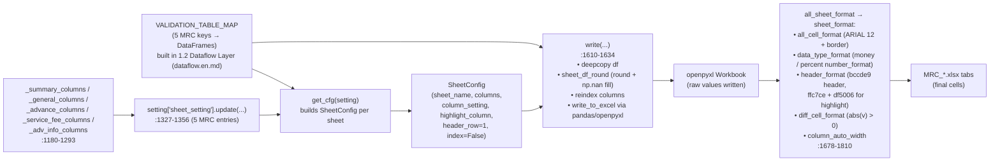
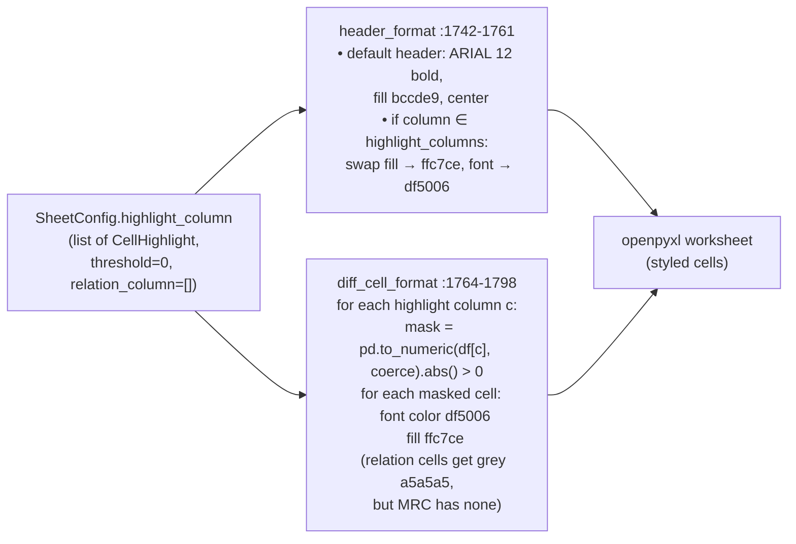
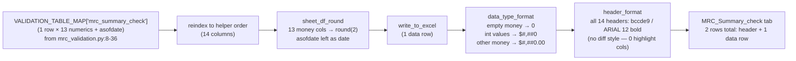
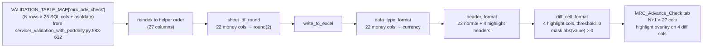
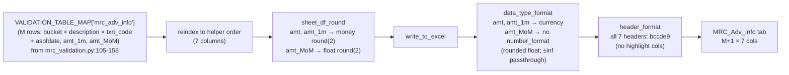

# 1.3 Sheet Rendering Layer / Sheet 渲染层

> **Purpose**: Reverse-engineer the per-sheet rendering layer of the MRC Validation Report — for each of the 5 `MRC_*` XLSX sheets, document the exact column ordering, data-type / rounding contract, highlight columns and visual style, and the openpyxl machinery that turns the validator DataFrames (from 1.2 Dataflow Layer (dataflow.en.md)) into the final workbook cells.
>
> **Audience**: Stage 1 reviewers; the engineer who will write Stage 2's MRC sheet renderer; future Copilot CLI agents resuming 1.3 Sheet Rendering Layer (sheets.en.md) / 1.4 / 1.6 work.
>
> **Revision history**
>
> | Date | Author | Change |
> |---|---|---|
> | 2026-05-17 | Copilot CLI agent | v1 — first version. Source-verified against `util/gen_remit_validation_report.py` (helpers + sheet registry + render pipeline). |

> **MRC chapter index** (`docs/mrc/`) — full definition in [`_chapter-index.md`](_chapter-index.md)
>
> | # | Title | File | Scope |
> |---|---|---|---|
> | 1.0 | TOC & Scope / 章节地图与范围 | `toc.en.md` | Entry & contract |
> | 1.1 | Raw Data Layer / 原始数据层 | `rawdata.en.md` | Upstream tables + time anchors |
> | 1.2 | Dataflow Layer / 数据流层 | `dataflow.en.md` | End-to-end execution pipeline |
> | 1.3 | Sheet Rendering Layer / Sheet 渲染层 | `sheets.en.md` | openpyxl rendering contract |
> | 1.4 | Field Definitions / 字段定义 | `fields.en.md` | Field-level lineage + business meaning |
> | 1.5 | Validation Rules / 验证规则 | `rules.en.md` | Rule catalogue |
> | 1.6 | Baseline XLSX Behavior / Baseline XLSX 行为 | `baseline.en.md` | Baseline truth |
> | 1.7 | User Review Gate / 用户走读评审 | (user action) | Stage 2 gate |

---

## 1. Document role

This is sub-chapter **1.3** of the MRC chapter. It answers: **for each
of the 5 `MRC_*` XLSX sheets, what is the exact column list (order +
types + rounding), what gets highlighted, and what does the openpyxl
rendering pipeline actually do to the cells?**

It assumes the reader has already read 1.1 (raw data layer) and 1.2
(dataflow). It is the bridge between "validator produces a DataFrame"
(end of 1.2) and "the cells inside the XLSX file" (input to 1.6
baseline).

It does **not**:

- Explain the business meaning of every column (that's 1.4 fields).
- Define validation thresholds or per-rule semantics (that's 1.5 rules).
- Capture the baseline XLSX (that's 1.6 baseline).

## 2. Scope

**In scope**

- The 5 column-list helpers in `util/gen_remit_validation_report.py`
  (`_summary_columns`, `_general_columns`, `_advance_columns`,
  `_service_fee_columns`, `_adv_info_columns`).
- The two wrapper helpers `_validation_report_col` and
  `_validation_report_sheet` and the shared style block (`setting["style"]`).
- The 5 MRC entries in the `setting["sheet_setting"].update(...)` block
  (sheet name, column-list helper, highlight columns).
- The rendering pipeline functions invoked per sheet: `sheet_df_round`,
  `data_type_format`, `header_format`, `diff_cell_format`,
  `column_auto_width`.

**Out of scope**

- The Selene mirror entries (same helpers, different `loan_column`)
  are noted for context but not analyzed.
- The "diff_relation_column_style" mechanism is present but **never
  used** by the MRC sheets (all 5 sheets pass empty `relation_column`
  lists — see § 4.3).
- Threshold semantics (always `0` for MRC) are noted; the underlying
  comparison logic moves to 1.5 Validation Rules (rules.en.md).

## 3. Overall rendering pipeline



**Figure 1.3.3 — End-to-end rendering pipeline from validator DataFrame to final XLSX cells.**
Source: `gen_remit_validation_report.py:1167-1177, 1180-1293, 1296-1357, 1429-1431, 1466-1509, 1610-1810`.

**Explanation (per § 6.10)**

- **Business purpose**: make explicit how a validator's in-memory DataFrame becomes the bytes inside the workbook — every Stage 2 candidate engine must reproduce these cells, so every stage (column ordering, rounding, money formatting, header coloring, highlight) is a contract that must be matched.
- **Execution flow**: at module import the `setting` dict is built from the 5 helpers and the registry entries; at run time `write(...)` is called once per `(sheet_name, DataFrame)` pair, which deep-copies the frame, applies `sheet_df_round` (round + add `np.nan` columns for any helper-declared column that's missing from the DataFrame), reindexes to the helper's column order, and writes via `pandas.to_excel` / openpyxl. After all sheets are written, `all_sheet_format` walks each sheet to apply the styles (all_cell, data_type, header, diff_cell, column_auto_width).
- **Input / output**: **inputs** = 5 DataFrames (from `VALIDATION_TABLE_MAP`), 5 `SheetConfig` objects, 1 `SheetStyle`; **output** = 5 worksheets in the workbook with raw values + number formats + cell styles + highlight overlays.
- **Key transformations**: `sheet_df_round` rounds `int/float/money` columns to `round_to` (default 2; uses `astype(int)` when `round_to == 0`) and fills missing columns with `np.nan`; `data_type_format` rewrites empty money cells to `0` and assigns the `money_int_format` / `money_format` named styles based on whether the value is an integer; `header_format` paints the header row with `bccde9` background and swaps to the diff-style (`ffc7ce` fill, `df5006` font) for highlight columns; `diff_cell_format` paints body cells whose absolute numeric value exceeds the threshold (always `0` for MRC) with the diff style.
- **Dependencies / assumptions**: column order in the DataFrame is irrelevant (the helper list wins via `reindex`); every helper-declared column either exists in the DataFrame or becomes an `np.nan` column; the highlight comparison casts via `pd.to_numeric(errors='coerce')` so non-numeric highlight values are silently dropped (no exception); threshold is **strict** `> 0` (zero or NaN never highlights); `relation_column` is empty for every MRC sheet, so the "grey row partner" visual is unused.

## 4. Shared rendering machinery

### 4.1 `_validation_report_col` and `_validation_report_sheet` helpers

```python
def _validation_report_col(column, data_type="str", round_status=False, round_to=2) -> Dict:
    return {"column": column, "original_column": column,
            "data_type": data_type, "round_status": round_status, "round_to": round_to}

def _validation_report_sheet(sheet_name, columns, highlight_columns=None) -> Dict:
    return {"sheet_name": sheet_name, "index": False, "header_row": 1,
            "column": columns,
            "highlight_column": [{"column": c, "relation_column": [], "threshold": 0}
                                 for c in (highlight_columns or [])]}
```

Source: `gen_remit_validation_report.py:1157-1177`.

Two contracts to remember:

1. `original_column == column` always (no DataFrame→XLSX rename for any
   MRC column).
2. Every highlight column for MRC has `relation_column = []` and
   `threshold = 0` — so the rule "highlight when `abs(value) > 0`" is
   the only rule in play, and no "partner cell" gets the grey overlay.

### 4.2 `data_type_format` — money / percentage / date handling

`data_type_format` (`gen_remit_validation_report.py:1721-1739`) walks
the body cells and:

- For `data_type == "money"` columns: empty cells are coerced to `0`;
  cells whose value equals `int(float(value))` get the integer money
  style (`money_int_format` = `$#,##0`); all other money cells get
  `money_format` = `$#,##0.00`.
- For `data_type == "percentage"` columns: cells get `percent_format` =
  `0.00%`. **No MRC column uses this type** — note that
  `intrate_*` columns are declared as `float` (plain number), not
  percentage; 1.4 Field Definitions (fields.en.md) will revisit this design choice.
- For all other types (`str`, `float`, `date`, `int`): no number-format
  styling — values are written as-is. Dates flow through `pandas`'s
  default Excel serialization (Python `date` / `datetime` → Excel
  serial).

Style block (`gen_remit_validation_report.py:19-86`):

| Style key | Format | Notes |
|---|---|---|
| `money_number_format` / `money_format` | `$#,##0.00` | non-integer money values |
| `money_int_format` | `$#,##0` | money values where `v == int(v)` (incl. blank → 0) |
| `percent_format` | `0.00%` | unused by MRC |
| `default_column_width` | 20 | `automatic_column_width: True` overrides to fit content |
| Default font | ARIAL, size 12, black, not bold | with thin black borders all sides |

### 4.3 `header_format` and `diff_cell_format` — highlight visuals



**Figure 1.3.4 — Highlight style cascade for MRC sheets.**
Source: `gen_remit_validation_report.py:58-85, 1742-1798`.

**Explanation (per § 6.10)**

- **Business purpose**: visually surface every cell where remit-side and daily-side disagree by **any** amount, so analysts can find anomalies without sorting; the same color scheme is also applied to the highlight column's header so the columns themselves stand out at a glance.
- **Execution flow**: `header_format` runs once per sheet, repainting the header row according to `highlight_columns`; `diff_cell_format` then iterates the body, casting each highlight column to numeric and applying the diff style to every row where `abs(value) > 0`.
- **Input / output**: **inputs** = `SheetConfig.highlight_column` (list of `CellHighlight(column, relation_column=[], threshold=0)`) and the body DataFrame; **outputs** = openpyxl cell mutations on the highlight column's header and on every body cell that breaches the threshold.
- **Key transformations**: `pd.to_numeric(errors='coerce')` so a non-numeric or `NaN` value never matches the mask (and so never highlights); strict `> 0` comparison means `0` and `NaN` are clean, even though `0` is technically "no diff" and `NaN` is "missing"; the `relation_column` grey overlay exists in the code but is dead for MRC (every entry passes `relation_column=[]`).
- **Dependencies / assumptions**: depends on `setting["style"]["diff_column_style"]` (fill `ffc7ce`, font `df5006`) and `header_style` (fill `bccde9`); assumes `SheetConfig.index == False` and `SheetConfig.header_row == 1` (true for all MRC sheets via `_validation_report_sheet`); breaking either of those would shift the row/column offsets used to locate cells.

### 4.4 The sheet-registry entry pattern for MRC

All 5 MRC entries live in
`gen_remit_validation_report.py:1327-1356` and follow the same
template:

```python
"MRC_<X>": _validation_report_sheet(
    "MRC_<X>",                               # sheet_name
    _<x>_columns(...),                       # column list helper (with optional "mrc_ln" param)
    [<highlight_col_1>, <highlight_col_2>],  # highlight list (optional)
)
```

Five concrete entries:

| Registry line | Sheet | Helper | Highlight cols |
|---|---|---|---|
| `:1327` | `MRC_Summary_check` | `_summary_columns()` | (none) |
| `:1328-1340` | `MRC_General_Check` | `_general_columns("mrc_ln")` | 7 (see § 6) |
| `:1341-1350` | `MRC_Advance_Check` | `_advance_columns("mrc_ln")` | 4 (see § 7) |
| `:1351-1355` | `MRC_ServiceFee_Check` | `_service_fee_columns("mrc_ln")` | `["servicefee_diff"]` |
| `:1356` | `MRC_Adv_Info` | `_adv_info_columns()` | (none) |

The `"mrc_ln"` literal is the **only** MRC-specific runtime parameter
passed through the renderer; everywhere else MRC reuses the
servicer-shared helpers verbatim (Selene passes `"selene_ln"` at
`:1300, :1313, :1323`; the helpers themselves are servicer-agnostic).

## 5. `MRC_Summary_check`


<!-- BUSINESS-PURPOSE-V1 -->
### Business purpose / 业务用途

cover page of the whole Validation Report — collapses
  the 13 portfolio-level monetary totals for the current remit period
  (principal received, interest received, escrow & corporate advance changes,
  service fee, other fees, sub-remit / total-remit, beginning / ending
  balance) into a single row, so ops / treasury / oversight can answer
  "did this remit roughly line up?" at first glance.
- **Business questions answered**:
    - Do this month's servicer-reported totals fall within expectation for
      this MRC portfolio?
    - Did the SQL aggregation itself complete cleanly (all 13 sums non-null
      and plausible)?
    - What is the macro context against which per-loan pages (General,
      Advance, ServiceFee) should be read?
- **Population**: every active loan where `servicer='MRC'`, aggregated at the
  `remit_date` month grain; **no per-loan dimension** — every row in this
  sheet = the entire MRC portfolio.
- **Audience**: servicing-oversight analyst doing a 5-second "totals sniff
  test"; treasury reconciling `subremit` / `totremit` against bank wires.
- **Why 0 highlight columns**: this sheet performs only portfolio-level
  summation; it does NOT perform remit-vs-daily per-loan comparison, so
  there are no diff columns and hence no highlights — by design, not a bug.
- **Common failure scenarios**:
    - SQL aggregation drops a column → some sum is null / 0 (does not trigger
      a highlight; readers have to eyeball "implausible total");
    - Ending balance fails to roll into next month's beginning balance
      (caught by an external cross-month script);
    - `subremit + totremit` ≠ servicer wire — caught downstream by treasury.
- **Risk / reconciliation motivation**: this single row is the first
  quality gate for "is the servicer remit macro-consistent with our books?"
  — if this row is wrong, no amount of per-loan drill-down on the next
  pages can recover the systemic miss.

### 5.1 Column catalog

Source: `gen_remit_validation_report.py:1180-1196` (helper),
`:1327` (registry entry). **14 columns, 0 highlight columns.**

| # | Column (= original) | data_type | round_status | round_to |
|---|---|---|---|---|
| 1 | `principalreceived` | money | True | 2 |
| 2 | `interestreceived` | money | True | 2 |
| 3 | `escrowadv_chg` | money | True | 2 |
| 4 | `corpadvrec_chg` | money | True | 2 |
| 5 | `corpadvnonrec_chg` | money | True | 2 |
| 6 | `corpadvtotal_chg` | money | True | 2 |
| 7 | `servicefee` | money | True | 2 |
| 8 | `otherfees` | money | True | 2 |
| 9 | `totalservicefee` | money | True | 2 |
| 10 | `subremit` | money | True | 2 |
| 11 | `totremit` | money | True | 2 |
| 12 | `beginningbalance` | money | True | 2 |
| 13 | `endingbalance` | money | True | 2 |
| 14 | `asofdate` | date | False | n/a |

### 5.2 Rendering specifics



**Figure 1.3.5 — `MRC_Summary_check` sheet structure.**
Source: `gen_remit_validation_report.py:1180-1196, 1327`; 1.2 Dataflow Layer (dataflow.en.md) § 6.1.

**Explanation (per § 6.10)**

- **Business purpose**: produce the single-row, all-MRC-portfolio rollup tab that humans read first to confirm headline totals.
- **Execution flow**: the 1-row DataFrame from `mrc_summary_check` is reindexed to the 14-column helper order, 13 money columns are rounded to 2 decimals, the row is written, the 13 money cells are formatted as currency (integer or 2dp), and the header row is painted blue (`bccde9`).
- **Input / output**: **input** = 1-row × 13-numeric DataFrame plus the `asofdate` column added by the validator; **output** = a 2-row XLSX tab (1 header + 1 data row) × 14 columns, all currency or date formatted.
- **Key transformations**: 13 money columns rounded to 2dp; empty money cells coerced to `0`; integer values render as `$#,##0`, non-integers as `$#,##0.00`; `asofdate` flows through pandas's default date serialization.
- **Dependencies / assumptions**: assumes the validator-side DataFrame already contains all 14 declared columns (it does — the SQL projects 13 named sums and the wrapper stamps `asofdate`); zero highlights means no `diff_cell_format` work for this sheet.

## 6. `MRC_General_Check`


<!-- BUSINESS-PURPOSE-V1 -->
### Business purpose / 业务用途

the **primary** per-loan reconciliation page —
  compares every loan across 7 core dimensions (interest rate, next-due
  date, beginning balance, ending balance, deferred principal, deferred
  interest, scheduled P&I) between the servicer remit and our internal
  daily snapshot. **Any non-zero difference is highlighted red**, signalling
  ops "this loan needs manual investigation".
- **Business questions answered**:
    - Is the rate reported by the servicer the same as the contract rate in
      our daily system? (catches reset bugs, missed modifications.)
    - Has the next-due date drifted? (deferment / bankruptcy-plan changes
      not propagated.)
    - Do beginning / ending balances reconcile against our amortization?
      (over- or under-applying principal.)
    - Does the **scheduled** P&I (`pandi_schedule_diff`) line up? — a more
      stable signal than actual P&I for "is the servicer collecting per
      contract?".
- **Population**: every active MRC loan in the period × 7 diff dimensions;
  row count = portfolio loan count.
- **Audience**: servicing oversight, loan accounting, investor reporting;
  any red cell → servicer ticket.
- **Why these 7 columns are highlighted (business rationale)**:
    - `intrate_diff` — wrong rate cascades into every downstream interest
      calc;
    - `nextduedate_diff` — wrong due date corrupts delinquency status;
    - `begbal_diff` / `endbal_diff` — balance mismatch is a master risk
      signal;
    - `deferredprincipal_diff` / `deferredint_diff` — reveals execution gaps
      in modification / forbearance;
    - `pandi_schedule_diff` — scheduled-receivable diff is the core "is
      the servicer collecting per contract?" indicator.
- **Why `pandi_diff_remitvsdaily` is NOT highlighted (gap 1)**: actual
  receipts legitimately deviate from schedule (partial pays, prepays), so
  highlighting that column would explode the noise floor; the schedule view
  is the stable signal. This is an **intentional business decision**, also
  flagged at § 6.1 gap 1 and 1.4 Field Definitions (fields.en.md) § 5.
- **Common failure scenarios**:
    - Servicer system resets a rate but daily wasn't refreshed → 7 rows
      light up simultaneously;
    - Bankruptcy plan modification not back-loaded into daily → due date +
      balances all flag together;
    - Month-end cut-off mismatch (servicer uses EOM, daily uses BoM+1) →
      systematic 1-day offset across all rows.
- **Risk motivation**: this page is the **heart** of MRC validation —
  roughly 80% of real-world ops tickets originate from red cells on this
  tab.

### 6.1 Column catalog

Source: `gen_remit_validation_report.py:1199-1236` (helper),
`:1328-1340` (registry entry). **35 columns, 7 highlight columns.**

| # | Column (= original) | data_type | round | Highlight |
|---|---|---|---|---|
| 1 | `loanid` | str | False | |
| 2 | `mrc_ln` (from `loan_column` parameter) | str | False | |
| 3 | `dealid` | str | False | |
| 4 | `intrate_remit` | float | True (2) | |
| 5 | `intrate_daily` | float | True (2) | |
| 6 | `intrate_diff_remitvsdaily` | float | True (2) | ★ |
| 7 | `nextduedate_remit` | date | False | |
| 8 | `nextduedate_daily` | date | False | |
| 9 | `nextduedate_diff_remitvsdaily` | float | True (2) | ★ |
| 10 | `begbal_remit` | money | True (2) | |
| 11 | `begbal_daily` | money | True (2) | |
| 12 | `begbal_diff_remitvsdaily` | money | True (2) | ★ |
| 13 | `endbal_remit` | money | True (2) | |
| 14 | `endbal_daily` | money | True (2) | |
| 15 | `endbal_diff_remitvsdaily` | money | True (2) | ★ |
| 16 | `principal_remit` | money | True (2) | |
| 17 | `interest_remit` | money | True (2) | |
| 18 | `prin_bal_diff_remit` | money | True (2) | |
| 19 | `deferredprincipal_remit` | money | True (2) | |
| 20 | `deferredprincipal_daily` | money | True (2) | |
| 21 | `deferredprincipal_diff_remitvsdaily` | money | True (2) | ★ |
| 22 | `deferredint_remit` | money | True (2) | |
| 23 | `deferredint_daily` | money | True (2) | |
| 24 | `deferredint_diff_remitvsdaily` | money | True (2) | ★ |
| 25 | `pandi_remit` | money | True (2) | |
| 26 | `pandiexpected_daily` | money | True (2) | |
| 27 | `pandi_schedule_diff_remitvsdaily` | money | True (2) | ★ |
| 28 | `principalreceived_daily` | money | True (2) | |
| 29 | `interestreceived_daily` | money | True (2) | |
| 30 | `pandireceived_daily` | money | True (2) | |
| 31 | `pandi_diff_remitvsdaily` | money | True (2) | |
| 32 | `pandi_paid_times_remit` | float | True (2) | |
| 33 | `pandi_paid_times_daily` | float | True (2) | |
| 34 | `delinquency_status_mba` | str | False | |
| 35 | `asofdate` | date | False | |

Highlighted columns (★): `intrate_diff_remitvsdaily`,
`nextduedate_diff_remitvsdaily`, `begbal_diff_remitvsdaily`,
`endbal_diff_remitvsdaily`, `deferredprincipal_diff_remitvsdaily`,
`deferredint_diff_remitvsdaily`, `pandi_schedule_diff_remitvsdaily`
(source: `:1331-1339`).

> **Note**: `pandi_diff_remitvsdaily` (column 31) is **not** in the
> highlight list, even though it is a remit-vs-daily diff. Use
> `pandi_schedule_diff_remitvsdaily` (column 27, which is the schedule-
> based reconciliation) as the highlighted one. Recorded as gap 1.

### 6.2 Rendering specifics

```mermaid
flowchart LR
    df["VALIDATION_TABLE_MAP['mrc_general_check']\n(N rows × ~28 SQL cols + asofdate)\nfrom servicer_validation_with_portdaily.py:635-705"] --> reindex["reindex to helper order\n(35 columns;\nmissing columns → np.nan)"]
    reindex --> round["sheet_df_round\nmoney + float cols rounded to 2dp\nstr + date untouched"]
    round --> write["write_to_excel\n(N data rows)"]
    write --> fmt["data_type_format\nmoney cells → currency\nfloat cells → no number_format\ndate cells → pandas default"]
    fmt --> hdr["header_format\n28 normal headers: bccde9\n7 highlight headers: ffc7ce + df5006"]
    hdr --> diff["diff_cell_format\nfor each of 7 highlight cols:\n  mask = abs(pd.to_numeric) > 0\n  paint masked cells ffc7ce + df5006"]
    diff --> sheet["MRC_General_Check tab\nN+1 rows × 35 cols\nhighlight overlay on 7 diff columns"]
```



**Figure 1.3.6 — `MRC_General_Check` sheet structure.**
Source: `gen_remit_validation_report.py:1199-1236, 1328-1340`; 1.2 Dataflow Layer (dataflow.en.md) § 5.

**Explanation (per § 6.10)**

- **Business purpose**: produce the per-loan reconciliation tab where every remit-vs-daily disagreement on rate, due date, balance, deferred amounts, or scheduled P&I is visually flagged.
- **Execution flow**: validator DataFrame → reindex to 35-column helper order → round money / float columns to 2dp → write → format money cells as currency → paint 28 normal headers blue and 7 diff headers pink → highlight body cells where `abs(diff) > 0`.
- **Input / output**: **input** = the V2 DataFrame (N rows × ~28 SQL columns) plus `asofdate`; **output** = a 35-column tab with N+1 rows and a 7-column-wide highlight overlay on the diff columns.
- **Key transformations**: any helper-declared column missing from the DataFrame is filled with `np.nan`; money columns rounded to 2dp and formatted as `$#,##0` / `$#,##0.00`; float columns rounded but **not** number-formatted (they render as plain numerics); diff columns trigger the pink-fill / orange-font diff style whenever the absolute value is `> 0`.
- **Dependencies / assumptions**: depends on 1.2 Dataflow Layer (dataflow.en.md) § 5's column projection being a superset of the helper's columns (verified: SQL projects all 35 except the renderer-stamped `asofdate`); `pandi_diff_remitvsdaily` is present but unhighlighted (use `pandi_schedule_diff_remitvsdaily` for cell-identity tests); `nextduedate_diff_remitvsdaily` is typed as `float` and rounded to 2dp even though the SQL computes a day-count diff — recorded as gap 2.

## 7. `MRC_Advance_Check`


<!-- BUSINESS-PURPOSE-V1 -->
### Business purpose / 业务用途

per-loan **advance** balance reconciliation page —
  tracks the money the servicer fronts to keep delinquent loans current
  (escrow advance, recoverable corporate advance, non-recoverable corporate
  advance, total) and diffs each of the 4 advance buckets between remit
  and daily.
- **Business questions answered**:
    - How much escrow (taxes & insurance) did the servicer advance this
      month? Does daily know?
    - Are recoverable corp advances (recoverable from the borrower later)
      vs. non-recoverable (a charge against the investor pool) classified
      correctly? Misclassification flows straight into loss allocation.
    - Has cumulative total advance hit a contractual cap? Should a
      servicer-override / stop-advance be triggered?
    - Does the prior→current daily delta (`*_chg_daily`) explain the
      `escadv_remit` / `nonrecovadvance_remit` reported in remit?
- **Population**: every loan with advance activity in the period (typically
  delinquent, REO, or bankruptcy loans); row count is far smaller than
  General_Check (most performing loans have no advance).
- **Audience**: advance-recovery team (chasing recoverable corp adv),
  treasury (cash impact), loss-mitigation (non-recov is direct loss).
- **Why these 4 diff columns are highlighted (business rationale)**: each
  advance bucket has a distinct accounting / loss-allocation treatment;
  misclassifying one bucket means P&L is mis-stated — more sensitive than
  a rate diff.
- **Common failure scenarios**:
    - Servicer reports non-recov as recov (understating loss);
    - Escrow advance misposted as corp advance (corrupts escrow-shortage
      calc);
    - Prior daily missed an update → `*_chg_daily` all 0, large diff vs
      `*_remit`.
- **Naming asymmetry note (gap 3)**: column 14 `recovcorpadv_diff_*` uses
  a different prefix than columns 10–13 (`reccorpadvance_*_daily`) —
  `recov` vs `rec`. The SQL side distinguishes them intentionally; see
  § 7.1 gap 3 and 1.4 Field Definitions (fields.en.md) § 6.
- **Risk motivation**: advances are the **single most cash-sensitive and
  most accounting-classification-sensitive** step in MRC servicing; this
  sheet is the reconciliation anchor for advance-recovery and loss-reserve
  workflows.

### 7.1 Column catalog

Source: `gen_remit_validation_report.py:1239-1268` (helper),
`:1341-1350` (registry entry). **27 columns, 4 highlight columns.**

| # | Column (= original) | data_type | round | Highlight |
|---|---|---|---|---|
| 1 | `loanid` | str | False | |
| 2 | `mrc_ln` (from `loan_column`) | str | False | |
| 3 | `dealid` | str | False | |
| 4 | `delq_status` | str | False | |
| 5 | `escrowadv_prev_daily` | money | True (2) | |
| 6 | `escrowadv_curr_daily` | money | True (2) | |
| 7 | `escrowadv_chg_daily` | money | True (2) | |
| 8 | `escadv_remit` | money | True (2) | |
| 9 | `escadv_diff_remitvsdaily` | money | True (2) | ★ |
| 10 | `reccorpadvance_prev_daily` | money | True (2) | |
| 11 | `reccorpadvance_curr_daily` | money | True (2) | |
| 12 | `reccorpadvance_chg_daily` | money | True (2) | |
| 13 | `reccorpadvance_remit` | money | True (2) | |
| 14 | `recovcorpadv_diff_remitvsdaily` | money | True (2) | ★ |
| 15 | `nonrecovcorpadv_prev_daily` | money | True (2) | |
| 16 | `nonrecovcorpadv_curr_daily` | money | True (2) | |
| 17 | `nonrecovcorpadv_chg_daily` | money | True (2) | |
| 18 | `nonrecovadvance_remit` | money | True (2) | |
| 19 | `nonrecovcorpadv_diff_remitvsdaily` | money | True (2) | ★ |
| 20 | `totalcorpadv_prev_daily` | money | True (2) | |
| 21 | `totalcorpadv_curr_daily` | money | True (2) | |
| 22 | `totalcorpadv_chg_daily` | money | True (2) | |
| 23 | `totalcorpadvance_remit` | money | True (2) | |
| 24 | `totalcorpadv_diff_remitvsdaily` | money | True (2) | ★ |
| 25 | `escrow_balance_prev` | money | True (2) | |
| 26 | `escrow_balance_curr` | money | True (2) | |
| 27 | `asofdate` | date | False | |

Highlighted (★): `escadv_diff_remitvsdaily`,
`recovcorpadv_diff_remitvsdaily`, `nonrecovcorpadv_diff_remitvsdaily`,
`totalcorpadv_diff_remitvsdaily` (source: `:1345-1348`).

### 7.2 Rendering specifics



**Figure 1.3.7 — `MRC_Advance_Check` sheet structure.**
Source: `gen_remit_validation_report.py:1239-1268, 1341-1350`; 1.2 Dataflow Layer (dataflow.en.md) § 4.

**Explanation (per § 6.10)**

- **Business purpose**: produce the per-loan advance-balance reconciliation tab; the 4 highlighted diff columns are the canonical "remit vs daily disagreed on this advance bucket" signal.
- **Execution flow**: V3 DataFrame → reindex to 27 columns → round all 22 money columns to 2dp → write → format money cells as currency → paint 23 normal headers blue and 4 diff headers pink → highlight diff cells where `abs(value) > 0`.
- **Input / output**: **input** = V3 DataFrame (N rows × 25 SQL columns) plus `asofdate`; **output** = 27-column tab with N+1 rows and a 4-column-wide highlight overlay.
- **Key transformations**: 22 money columns rounded + currency-formatted (integer values as `$#,##0`, others as `$#,##0.00`); `delq_status` left as raw string; `asofdate` written as date; diff highlights identical mechanism to general.
- **Dependencies / assumptions**: assumes SQL projects all 25 named columns (verified — 1.2 Dataflow Layer (dataflow.en.md) § 4.3); naming pair `recovcorpadv_diff_remitvsdaily` (column 14, highlighted) vs `reccorpadvance_*_daily` (columns 10-13, non-highlighted source) is asymmetric — `rec`-prefixed vs `recov`-prefixed names are intentional in the SQL, documented as gap 3.

## 8. `MRC_ServiceFee_Check`


<!-- BUSINESS-PURPOSE-V1 -->
### Business purpose / 业务用途

per-loan **service-fee** reconciliation page —
  compares the servicing fee the servicer reports in remit
  (`servicefee_remit_raw`) against the fee we expect to pay per our
  internal `port.portmonth` (`servicefee_portmonth`); **any non-zero diff
  is highlighted**. This is the **only revenue-side** reconciliation page
  in MRC validation (the only page about money WE owe THEM).
- **Business questions answered**:
    - How much service fee should we pay MRC this month? What did they
      actually report? What is the gap?
    - If servicer reported high (diff < 0), did our portmonth under-calculate,
      or did they apply the wrong fee rate?
    - If servicer reported low (diff > 0), did they miss loans, or did
      status changes legitimately stop fee accrual?
- **Population**: all loans that exist in both servicer remit AND
  `port.portmonth`; **outer-join misses produce `servicefee_diff = NULL`,
  which is NOT highlighted — known silent gap, see gap 4**.
- **Audience**: servicer-fee accounts payable team, revenue ops; any red
  row = must be explained before the monthly servicer invoice is paid.
- **Design intent**: only 1 diff column because service fee is a single
  "right / wrong" dimension; the other columns (`fctrdt`, `loanid`,
  `mrc_ln`, `dealid`, two raw amounts) are context for the auditor.
- **Common failure scenarios**:
    - Mid-month fee-rate change but servicer used the old rate;
    - Loan paid off so missing from `port.portmonth`, diff becomes NULL →
      not highlighted (gap 4, requires an external NULL-report safety net);
    - Servicer double-counts sub-servicing fee.
- **Risk motivation**: service fee is cash the servicer withholds directly
  from collections; this page is our line-item invoice check — if a red
  row isn't investigated, we are short cash.

### 8.1 Column catalog

Source: `gen_remit_validation_report.py:1271-1281` (helper),
`:1351-1355` (registry entry). **8 columns, 1 highlight column.**

| # | Column (= original) | data_type | round | Highlight |
|---|---|---|---|---|
| 1 | `fctrdt` | date | False | |
| 2 | `loanid` | str | False | |
| 3 | `mrc_ln` (from `loan_column`) | str | False | |
| 4 | `dealid` | str | False | |
| 5 | `servicefee_remit_raw` | money | True (2) | |
| 6 | `servicefee_portmonth` | money | True (2) | |
| 7 | `servicefee_diff` | money | True (2) | ★ |
| 8 | `asofdate` | date | False | |

Highlighted (★): `servicefee_diff` (source: `:1354`).

### 8.2 Rendering specifics


**Figure 1.3.8 — `MRC_ServiceFee_Check` sheet structure.**
Source: `gen_remit_validation_report.py:1271-1281, 1351-1355`; 1.2 Dataflow Layer (dataflow.en.md) § 6.2.

**Explanation (per § 6.10)**

- **Business purpose**: produce the per-loan tab where the only number that matters is `servicefee_diff` — every non-zero row is a fee discrepancy between the servicer remit and `port.portmonth`.
- **Execution flow**: V4 DataFrame → reindex to 8 columns → round 3 money columns → write → format money cells as currency → 1 header pink, 7 headers blue → highlight any non-zero `servicefee_diff` cell.
- **Input / output**: **input** = V4 DataFrame (N rows × 7 SQL columns + `asofdate`); **output** = 8-column tab with N+1 rows and a single highlight column.
- **Key transformations**: 3 money columns rounded to 2dp and currency-formatted; both `fctrdt` and `asofdate` written as dates; highlight via the standard `> 0` mechanism.
- **Dependencies / assumptions**: `servicefee_diff` is `NULL` whenever `port.portmonth` lacks the loan (1.2 Dataflow Layer (dataflow.en.md) § 6.2) — `NULL` does not highlight (silent miss); `fctrdt` is duplicated information vs `asofdate` (former is the SQL filter value, latter is `mrc_db.remit_date`) — documented as gap 4.

## 9. `MRC_Adv_Info`


<!-- BUSINESS-PURPOSE-V1 -->
### Business purpose / 业务用途

bucket × description × transaction-code
  **aggregate activity** page with month-over-month — NOT a per-loan
  reconciliation, but an ops-monitoring page that answers "is the mix of
  advance / disbursement activity this month consistent with historical
  pattern?"
- **Business questions answered**:
    - What is the total dollar amount per bucket (advance / recovery /
      disbursement / fee, etc.) this month?
    - How does it compare to last month? (`amt_MoM = amt / amt_1m − 1`.)
    - Are any new `transaction_code` values appearing? (New codes often
      signal a servicer system upgrade or new product activity.)
- **Population**: all MRC advance / activity flows in the period,
  aggregated by `(bucket, description, transaction_code)`; row count =
  number of buckets × number of txn codes, far smaller than the loan
  count.
- **Audience**: ops investigation, anomaly detection, portfolio analytics
  — looking for systemic anomalies, not single-loan tickets.
- **Why 0 highlight columns**: this sheet is **descriptive /
  informational**; there is no "right vs wrong" concept, so analysts
  eyeball the `amt_MoM` column for spikes (e.g. a bucket > 10× MoM is
  worth investigating).
- **Key technical note for readers (gap 5)**: `amt_MoM` preserves the
  validator-side `±inf` / `NaN` (occurring when `amt_1m = 0`), and
  `data_type_format` does NOT apply a number_format to float, so Excel
  lands `inf` per openpyxl default (exact representation to be confirmed
  in 1.6 Baseline XLSX Behavior (baseline.en.md)).
- **Common failure scenarios**:
    - Unfamiliar `transaction_code` appears → usually a servicer system
      change shipped without notice;
    - Bucket `amt_MoM` jumps (e.g. +500%) → triggers an ops investigation;
    - `amt_1m = 0` produces `amt_MoM = inf` → renders as a giant number
      in Excel (readers must recognize this as a divide-by-zero artifact).
- **Risk motivation**: this page provides **early signals of systemic
  drift**, complementary to the per-loan reconciliation on the previous
  4 sheets — the per-loan pages catch differences that have already
  happened; this page catches **patterns that are shifting**.

### 9.1 Column catalog

Source: `gen_remit_validation_report.py:1284-1293` (helper),
`:1356` (registry entry). **7 columns, 0 highlight columns.**

| # | Column (= original) | data_type | round | Highlight |
|---|---|---|---|---|
| 1 | `bucket` | str | False | |
| 2 | `description` | str | False | |
| 3 | `transaction_code` | str | False | |
| 4 | `amt` | money | True (2) | |
| 5 | `amt_1m` | money | True (2) | |
| 6 | `amt_MoM` | float | True (2) | |
| 7 | `asofdate` | date | False | |

### 9.2 Rendering specifics



**Figure 1.3.9 — `MRC_Adv_Info` sheet structure.**
Source: `gen_remit_validation_report.py:1284-1293, 1356`; 1.2 Dataflow Layer (dataflow.en.md) § 6.3.

**Explanation (per § 6.10)**

- **Business purpose**: produce the bucket × description × transaction-code activity tab with month-over-month delta; analysts use it to spot bucket-level shifts.
- **Execution flow**: V5 DataFrame → reindex to 7 columns → round `amt`/`amt_1m` (money) and `amt_MoM` (float) to 2dp → write → format `amt` and `amt_1m` as currency → no highlight pass (zero highlight columns).
- **Input / output**: **input** = V5 DataFrame (M rows of bucket × description × transaction_code with `amt`, `amt_1m`, `amt_MoM`, `asofdate`); **output** = 7-column tab with M+1 rows, no highlight overlay.
- **Key transformations**: `amt_MoM = amt / amt_1m - 1` retains `±inf` / `NaN` from the validator (1.2 Dataflow Layer (dataflow.en.md) § 6.3); `data_type_format` does **not** format `float`-typed cells, so `inf` / `NaN` flow through as openpyxl writes them (Excel's representation of `inf` is `1.7976931348623157e+308`-style — must be verified during 1.6 baseline capture, recorded as gap 5).
- **Dependencies / assumptions**: row order is whatever the pandas merge produces (no explicit sort); zero highlights means the diff style is never applied; `asofdate` is the only date column.

## 10. Assumptions and unresolved gaps

1. **`pandi_diff_remitvsdaily` (general column 31) is intentionally
   non-highlighted** — `pandi_schedule_diff_remitvsdaily` (column 27)
   is the highlighted one. To be confirmed with the business owner in
   1.5 rules whether both should highlight or only the schedule diff.
2. **`nextduedate_diff_remitvsdaily` is typed `float` with `round_to=2`**
   even though the SQL computes a `date_diff` in days; rounding a
   day-count to 2 decimals is harmless (the value is integer-valued)
   but the type/round_to choice is suspect. Confirm during 1.6
   baseline whether the cells render as `5.00` vs `5`.
3. **Naming asymmetry between `rec`- and `recov`-prefixed columns**
   on `MRC_Advance_Check`: `reccorpadvance_*_daily` (non-highlighted
   sources) vs `recovcorpadv_diff_remitvsdaily` (highlighted diff).
   Documented as-is; do not rename in Stage 2 — cell identity requires
   the exact existing names.
4. **`fctrdt` is duplicated by `asofdate` on `MRC_ServiceFee_Check`**:
   `fctrdt` is the SQL parameter value (e.g. `2026-05-01`); `asofdate`
   is `mrc_db.remit_date` (e.g. `2026-04-30`). Both appear as columns.
   Confirm with 1.6 baseline whether downstream consumers depend on
   both or only one.
5. **`amt_MoM` `±inf` / `NaN` Excel-cell representation** on
   `MRC_Adv_Info` is not deterministically specified by
   `data_type_format` (no formatter applied to `float`); must be
   captured during 1.6 baseline to lock the Stage 2 reproduction
   contract.
6. **`relation_column` is unused for MRC**: every highlight passes
   `relation_column=[]`. The grey overlay machinery
   (`diff_relation_column_style`, fill `a5a5a5`, white font) is
   therefore dead code on the MRC path. Stage 2 may omit it for MRC
   but must keep it for shared servicer code paths (Selene reuses the
   same helpers).

## 11. Source citation index

| File | Lines | Note |
|---|---|---|
| `util/gen_remit_validation_report.py` | `gen_remit_validation_report.py:19-86` | Shared `setting["style"]` block (formats, fonts, header/diff/highlight visuals) |
| `util/gen_remit_validation_report.py` | `gen_remit_validation_report.py:1157-1164` | `_validation_report_col` helper |
| `util/gen_remit_validation_report.py` | `gen_remit_validation_report.py:1167-1177` | `_validation_report_sheet` helper |
| `util/gen_remit_validation_report.py` | `gen_remit_validation_report.py:1180-1196` | `_summary_columns()` |
| `util/gen_remit_validation_report.py` | `gen_remit_validation_report.py:1199-1236` | `_general_columns(loan_column)` |
| `util/gen_remit_validation_report.py` | `gen_remit_validation_report.py:1239-1268` | `_advance_columns(loan_column)` |
| `util/gen_remit_validation_report.py` | `gen_remit_validation_report.py:1271-1281` | `_service_fee_columns(loan_column)` |
| `util/gen_remit_validation_report.py` | `gen_remit_validation_report.py:1284-1293` | `_adv_info_columns()` |
| `util/gen_remit_validation_report.py` | `gen_remit_validation_report.py:1296-1357` | `sheet_setting.update(...)` — MRC entries at `:1327-1356` |
| `util/gen_remit_validation_report.py` | `gen_remit_validation_report.py:1429-1431` | `get_cfg` builds `SheetConfig` dict |
| `util/gen_remit_validation_report.py` | `gen_remit_validation_report.py:1610-1634` | `write(...)` — per-sheet entry point |
| `util/gen_remit_validation_report.py` | `gen_remit_validation_report.py:1637-1670` | `sheet_df_round` (rounding + np.nan fill) |
| `util/gen_remit_validation_report.py` | `gen_remit_validation_report.py:1673-1675` | `write_to_excel` (pandas → openpyxl) |
| `util/gen_remit_validation_report.py` | `gen_remit_validation_report.py:1678-1712` | `all_sheet_format` / `sheet_format` driver |
| `util/gen_remit_validation_report.py` | `gen_remit_validation_report.py:1721-1739` | `data_type_format` (money/percent number formats) |
| `util/gen_remit_validation_report.py` | `gen_remit_validation_report.py:1742-1761` | `header_format` (header + highlight-header style) |
| `util/gen_remit_validation_report.py` | `gen_remit_validation_report.py:1764-1798` | `diff_cell_format` (body highlight) |
