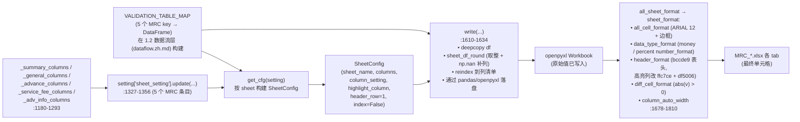
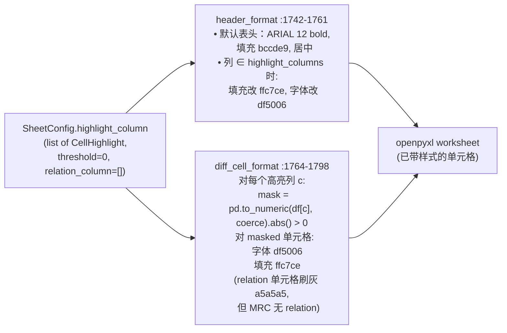
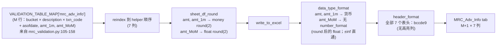

# 1.3 Sheet Rendering Layer / Sheet 渲染层

> **文档定位 / Purpose**：逆向并记录 MRC Validation Report 的每张 sheet 渲染层——对于 5 张 `MRC_*` XLSX sheet 中的每一张，写清楚精确的列顺序、数据类型 / 取整契约、高亮列与视觉风格，以及 openpyxl 是怎样把（1.2 数据流层 (dataflow.zh.md) 产出的）validator DataFrame 变成最终 workbook 单元格的。
>
> **目标读者 / Audience**：Stage 1 评审人；未来基于本章写 Stage 2 MRC sheet 渲染器的工程师；恢复 1.3 Sheet 渲染层 (sheets.zh.md) / 1.4 / 1.6 工作的 Copilot CLI agent。
>
> **修订历史 / Revision history**
>
> | 日期 | 作者 | 变更 |
> |---|---|---|
> | 2026-05-17 | Copilot CLI agent | v1 — 首版。源代码佐证：`util/gen_remit_validation_report.py`（helpers + sheet 注册表 + 渲染流水线）。 |

> **MRC 章节索引** （`docs/mrc/`）—— 完整定义见 [`_chapter-index.md`](_chapter-index.md)
>
> | # | 标题 | 文件 | 职责 |
> |---|---|---|---|
> | 1.0 | TOC & Scope / 章节地图与范围 | `toc.zh.md` | 入口与契约 |
> | 1.1 | Raw Data Layer / 原始数据层 | `rawdata.zh.md` | 上游表 + 时间锚 |
> | 1.2 | Dataflow Layer / 数据流层 | `dataflow.zh.md` | 端到端执行流水线 |
> | 1.3 | Sheet Rendering Layer / Sheet 渲染层 | `sheets.zh.md` | openpyxl 渲染契约 |
> | 1.4 | Field Definitions / 字段定义 | `fields.zh.md` | 字段级血缘 + 业务含义 |
> | 1.5 | Validation Rules / 验证规则 | `rules.zh.md` | 规则目录 |
> | 1.6 | Baseline XLSX Behavior / Baseline XLSX 行为 | `baseline.zh.md` | baseline 真值 |
> | 1.7 | User Review Gate / 用户走读评审 | （用户动作） | Stage 2 开闸点 |

---

## 1. Document role

本文是 MRC 章节的子章节 **1.3**。它只回答一个问题：**对每张 `MRC_*`
XLSX sheet，精确的列清单（顺序 + 类型 + 取整）是什么？哪些列被高亮？
openpyxl 渲染流水线对每个单元格到底做了什么？**

假定读者已读过 1.1（原始数据层）与 1.2（数据流）。本章是 "validator
产出 DataFrame"（1.2 末尾）与 "XLSX 文件内部的单元格"（1.6 baseline 的
输入）之间的桥梁。

它**不**：

- 解释每个字段的业务含义（属于 1.4 fields）。
- 定义校验阈值与逐 rule 语义（属于 1.5 rules）。
- 捕获基线 XLSX（属于 1.6 baseline）。

## 2. Scope

**在范围内**

- `util/gen_remit_validation_report.py` 中的 5 个列清单 helper
  （`_summary_columns`、`_general_columns`、`_advance_columns`、
  `_service_fee_columns`、`_adv_info_columns`）。
- 两个 wrapper helper `_validation_report_col` 与
  `_validation_report_sheet`，以及共享样式块（`setting["style"]`）。
- `setting["sheet_setting"].update(...)` 中的 5 个 MRC 条目（sheet
  名、列清单 helper、高亮列）。
- 每张 sheet 触发的渲染流水线函数：`sheet_df_round`、
  `data_type_format`、`header_format`、`diff_cell_format`、
  `column_auto_width`。

**不在范围内**

- Selene 那一组镜像条目（用相同 helper，传不同 `loan_column`）只
  作为对照提及，不分析。
- "diff_relation_column_style" 机制虽然存在，但 MRC 路径上**从未
  使用**（5 张 sheet 全部传 `relation_column=[]`，详见 § 4.3）。
- 阈值语义（MRC 全部为 `0`）这里只提及；底层比较逻辑放到 1.5 rules。

## 3. Overall rendering pipeline



**图 1.3.3 — 从 validator DataFrame 到最终 XLSX 单元格的端到端渲染流水线。**
来源：`gen_remit_validation_report.py:1167-1177, 1180-1293, 1296-1357, 1429-1431, 1466-1509, 1610-1810`。

**说明（依规则 § 6.10）**

- **业务目的 / Business purpose**：把 validator 的内存 DataFrame 如何变成 workbook 字节这件事写清楚——任何 Stage 2 候选引擎都必须复现这些单元格，所以每个阶段（列顺序、取整、money 格式、表头着色、高亮）都是必须复制的契约。
- **执行流程 / Execution flow**：模块导入时 `setting` 由 5 个 helper + 注册条目构建；运行时按 `(sheet_name, DataFrame)` 调用一次 `write(...)`：先 deepcopy frame，跑 `sheet_df_round`（取整 + 给 helper 声明但 DataFrame 缺失的列补 `np.nan`），按 helper 列顺序 reindex，再用 `pandas.to_excel` / openpyxl 写盘。所有 sheet 写完之后 `all_sheet_format` 逐 sheet 应用样式（all_cell、data_type、header、diff_cell、column_auto_width）。
- **输入 / 输出 / Input / output**：**输入** = 5 份 DataFrame（来自 `VALIDATION_TABLE_MAP`）、5 个 `SheetConfig`、1 份 `SheetStyle`；**输出** = workbook 中 5 个 worksheet，含原始值 + number_format + 单元格样式 + 高亮覆盖层。
- **关键变换 / Key transformations**：`sheet_df_round` 对 `int/float/money` 列按 `round_to` 取整（默认 2；`round_to==0` 时 `astype(int)`），并给缺列补 `np.nan`；`data_type_format` 把空 money 单元格改为 `0`，并按值是否为整数赋予 `money_int_format` / `money_format`；`header_format` 给表头行刷 `bccde9` 底色，高亮列表头改用 diff 样式（`ffc7ce` 底 + `df5006` 字）；`diff_cell_format` 对正文中绝对值超阈值（MRC 全部为 `0`）的高亮列单元格刷 diff 样式。
- **依赖 / 假设 / Dependencies / assumptions**：DataFrame 的列顺序无所谓（helper 列表通过 `reindex` 主导）；helper 声明但缺失的列会被补成 `np.nan` 列；高亮比较通过 `pd.to_numeric(errors='coerce')` 转数值，非数字高亮值会被静默丢弃（不抛异常）；阈值是**严格** `> 0`（`0` 与 `NaN` 都不会被高亮）；MRC 所有 sheet 的 `relation_column` 都是空的，所以"灰色配对行"视觉未被使用。

## 4. Shared rendering machinery

### 4.1 `_validation_report_col` and `_validation_report_sheet` helpers

```python
def _validation_report_col(column, data_type="str", round_status=False, round_to=2) -> Dict:
    return {"column": column, "original_column": column,
            "data_type": data_type, "round_status": round_status, "round_to": round_to}

def _validation_report_sheet(sheet_name, columns, highlight_columns=None) -> Dict:
    return {"sheet_name": sheet_name, "index": False, "header_row": 1,
            "column": columns,
            "highlight_column": [{"column": c, "relation_column": [], "threshold": 0}
                                 for c in (highlight_columns or [])]}
```

来源：`gen_remit_validation_report.py:1157-1177`。

两个值得记住的契约：

1. `original_column == column` 永远成立（MRC 所有列**没有任何**
   DataFrame→XLSX 列名重命名）。
2. 每个高亮列在 MRC 中都是 `relation_column=[]` 且 `threshold=0`——所以
   "abs(value) > 0 时高亮"是唯一在跑的规则，也没有"配对单元格"会被刷
   灰色。

### 4.2 `data_type_format` — money / percentage / date handling

`data_type_format`（`gen_remit_validation_report.py:1721-1739`）遍历
正文单元格：

- `data_type == "money"`：空单元格被强转为 `0`；当值等于
  `int(float(value))` 时套整数 money 样式（`money_int_format` =
  `$#,##0`）；其他 money 单元格套 `money_format` = `$#,##0.00`。
- `data_type == "percentage"`：单元格套 `percent_format` = `0.00%`。
  **MRC 没有任何列使用这种类型**——注意 `intrate_*` 列被声明为
  `float`（纯数字），不是 percentage；1.4 fields 会再讨论这个设计选择。
- 其它类型（`str`、`float`、`date`、`int`）：不做 number_format 样式
  ——值原样写入。日期通过 `pandas` 默认的 Excel 序列化（Python
  `date`/`datetime` → Excel 序列号）落入。

样式块（`gen_remit_validation_report.py:19-86`）：

| 样式 key | 格式 | 备注 |
|---|---|---|
| `money_number_format` / `money_format` | `$#,##0.00` | 非整数 money 值 |
| `money_int_format` | `$#,##0` | 整数 money 值（含空 → 0） |
| `percent_format` | `0.00%` | MRC 未使用 |
| `default_column_width` | 20 | `automatic_column_width: True` 实际按内容拉宽 |
| 默认字体 | ARIAL，12，黑，非粗体 | 四边细黑边框 |

### 4.3 `header_format` and `diff_cell_format` — highlight visuals



**图 1.3.4 — MRC sheet 的高亮样式级联。**
来源：`gen_remit_validation_report.py:58-85, 1742-1798`。

**说明（依规则 § 6.10）**

- **业务目的 / Business purpose**：把任何一处 remit 与 daily 不一致的单元格——无论差多少——视觉化出来，让分析人员不必排序也能直接发现异常；同样的配色也用到高亮列的**表头**上，使整列一眼可辨。
- **执行流程 / Execution flow**：`header_format` 每张 sheet 跑一次，按 `highlight_columns` 重绘表头行；`diff_cell_format` 然后遍历正文，把每个高亮列转成数值后，对绝对值大于阈值的行刷 diff 样式。
- **输入 / 输出 / Input / output**：**输入** = `SheetConfig.highlight_column`（`CellHighlight(column, relation_column=[], threshold=0)` 列表）与正文 DataFrame；**输出** = openpyxl 对高亮列表头与达标正文单元格的样式 mutation。
- **关键变换 / Key transformations**：`pd.to_numeric(errors='coerce')` 保证非数字或 `NaN` 永远不会命中 mask（也就不会被高亮）；严格 `> 0` 比较意味着 `0` 与 `NaN` 都干净，即便 `0` 严格意义上是"没差"，`NaN` 是"缺失"；`relation_column` 的灰色覆盖层代码存在但对 MRC 是死代码（所有条目都传 `relation_column=[]`）。
- **依赖 / 假设 / Dependencies / assumptions**：依赖 `setting["style"]["diff_column_style"]`（填充 `ffc7ce`、字体 `df5006`）与 `header_style`（填充 `bccde9`）；假设 `SheetConfig.index == False` 且 `SheetConfig.header_row == 1`（MRC 5 张 sheet 全都满足，源自 `_validation_report_sheet`）；若打破任一假设，定位单元格用的行 / 列偏移就会错位。

### 4.4 The sheet-registry entry pattern for MRC

5 个 MRC 条目都住在 `gen_remit_validation_report.py:1327-1356`，统一
模板：

```python
"MRC_<X>": _validation_report_sheet(
    "MRC_<X>",                               # sheet_name
    _<x>_columns(...),                       # 列清单 helper（可选 "mrc_ln" 参数）
    [<highlight_col_1>, <highlight_col_2>],  # 高亮列（可选）
)
```

5 个具体条目：

| 注册表行 | Sheet | Helper | 高亮列 |
|---|---|---|---|
| `:1327` | `MRC_Summary_check` | `_summary_columns()` | （无） |
| `:1328-1340` | `MRC_General_Check` | `_general_columns("mrc_ln")` | 7 个（见 § 6） |
| `:1341-1350` | `MRC_Advance_Check` | `_advance_columns("mrc_ln")` | 4 个（见 § 7） |
| `:1351-1355` | `MRC_ServiceFee_Check` | `_service_fee_columns("mrc_ln")` | `["servicefee_diff"]` |
| `:1356` | `MRC_Adv_Info` | `_adv_info_columns()` | （无） |

`"mrc_ln"` 字面量是**唯一**从 MRC 流过渲染器的运行期参数；其它所有
地方 MRC 都直接复用 servicer 共享 helper（Selene 在 `:1300, :1313,
:1323` 传 `"selene_ln"`；helper 本身与 servicer 解耦）。

## 5. `MRC_Summary_check`


<!-- BUSINESS-PURPOSE-V1 -->
### 业务用途 / Business purpose

整张 Validation Report 的"封面页"——把当期
  MRC 资产组合的 13 个汇总金额（principal received、interest received、escrow 与
  corporate advance 变化、service fee、other fees、sub-remit / total-remit、期初 /
  期末余额）压成一行，让 ops / treasury / 监管在打开 workbook 的第一眼就能判断
  "这份 remit 是否对得上"。
- **它要回答的业务问题 / Business question it answers**：
    - 本月 servicer 报来的合计数字是否落在我们对这个资产组合的预期范围内？
    - SQL 聚合本身是否跑通（13 个 sum 是否非空、是否合理）？
    - 后续 per-loan 页（General / Advance / ServiceFee）的"宏观背景"是什么？
- **数据口径 / Population**：所有 `servicer='MRC'` 的有效贷款，按 `remit_date` 的
  当月口径汇总，**没有** per-loan 维度——任何一行 = 整个 MRC 投资组合。
- **典型读者 / Audience**：servicing oversight 分析师做"先扫一眼合计"的快速检查；
  treasury 做现金对账时把 `subremit` / `totremit` 与银行入账对一遍。
- **为什么 0 高亮列 / Why no highlights**：本 sheet 只做"投资组合级汇总"，**不**做
  remit-vs-daily 的 per-loan 比对，没有 diff 列就没有高亮——这是设计意图，不是 bug。
- **常见失败场景 / Common failure scenarios**：
    - SQL 聚合丢列 → 某个 sum 为空 / 0（不是高亮触发，而是数字不合理需要人工眼）；
    - 期末余额与下月期初余额对不上（跨月连续性需在外部脚本对账）；
    - `subremit + totremit` 与 servicer wire 入账金额不符（落到 treasury 流程）。
- **风险 / 对账动机 / Risk and reconciliation motivation**：本表是 servicer remit
  与内部账本"宏观一致"的第一道质量门；这一行不对，下面 per-loan 页查得再细也只能
  发现局部异常，无法捕获系统性偏差。

### 5.1 Column catalog

来源：`gen_remit_validation_report.py:1180-1196`（helper）、
`:1327`（注册条目）。**14 列、0 高亮列。**

| # | 列（= original） | data_type | round_status | round_to |
|---|---|---|---|---|
| 1 | `principalreceived` | money | True | 2 |
| 2 | `interestreceived` | money | True | 2 |
| 3 | `escrowadv_chg` | money | True | 2 |
| 4 | `corpadvrec_chg` | money | True | 2 |
| 5 | `corpadvnonrec_chg` | money | True | 2 |
| 6 | `corpadvtotal_chg` | money | True | 2 |
| 7 | `servicefee` | money | True | 2 |
| 8 | `otherfees` | money | True | 2 |
| 9 | `totalservicefee` | money | True | 2 |
| 10 | `subremit` | money | True | 2 |
| 11 | `totremit` | money | True | 2 |
| 12 | `beginningbalance` | money | True | 2 |
| 13 | `endingbalance` | money | True | 2 |
| 14 | `asofdate` | date | False | n/a |

### 5.2 Rendering specifics


**图 1.3.5 — `MRC_Summary_check` sheet 结构。**
来源：`gen_remit_validation_report.py:1180-1196, 1327`；1.2 数据流层 (dataflow.zh.md) § 6.1。

**说明（依规则 § 6.10）**

- **业务目的 / Business purpose**：产出整个 MRC 资产组合的单行 rollup tab，是分析人员"先看头部合计是否对得上"的页。
- **执行流程 / Execution flow**：来自 `mrc_summary_check` 的 1 行 DataFrame 被 reindex 成 14 列 helper 顺序，13 个 money 列取整到 2 位小数，写入这一行，13 个 money 单元格被格式化为货币（整数或 2 位小数），表头行刷成蓝色（`bccde9`）。
- **输入 / 输出 / Input / output**：**输入** = 1 行 × 13 数值 DataFrame 加 validator stamp 的 `asofdate` 列；**输出** = 2 行 XLSX tab（1 表头 + 1 数据行）× 14 列，全部货币或日期格式。
- **关键变换 / Key transformations**：13 个 money 列取整到 2 位小数；空 money 单元格强转为 `0`；整数值渲染成 `$#,##0`，非整数渲染成 `$#,##0.00`；`asofdate` 走 pandas 默认日期序列化。
- **依赖 / 假设 / Dependencies / assumptions**：假设 validator 侧 DataFrame 已经包含全部 14 个声明列（确实如此——SQL 投影了 13 个命名 sum，外壳 stamp `asofdate`）；零高亮意味着本 sheet 不跑 `diff_cell_format`。

## 6. `MRC_General_Check`


<!-- BUSINESS-PURPOSE-V1 -->
### 业务用途 / Business purpose

per-loan 主对账页——把每笔贷款的 6 个核心维度
  （利率、下一付款日、期初余额、期末余额、deferred 本金、deferred 利息、计划 P&I）
  在 servicer remit 与内部 daily 快照之间逐列做差，**任何非零差异**都被涂红，指引
  ops 立刻知道"这笔贷款需要人工核查"。
- **它要回答的业务问题 / Business question it answers**：
    - servicer 报的利率是不是和我们 daily 系统里记录的合同利率一致？（reset bug、
      modification 没同步）
    - 下一付款日是否漂移？（deferment、bankruptcy plan 没同步）
    - 期初 / 期末余额是不是和内部 amortization 一致？（多扣 / 漏扣本金）
    - 计划 P&I（`pandi_schedule_diff`）是否吻合？——这是判断"servicer 是否按计划在收"
      的关键，比 actual P&I 更稳定。
- **数据口径 / Population**：当期 MRC 所有有效贷款 × 7 个差异维度；行数 = 投资
  组合贷款数。
- **典型读者 / Audience**：servicing oversight 分析师、loan accounting、investor
  reporting；任何一行红 → 触发 servicer 工单。
- **高亮规则的业务理由 / Why these 7 columns are highlighted**：
    - `intrate_diff` —— 利率错 = 后续所有 interest 计算都错；
    - `nextduedate_diff` —— 付款日错 = delinquency 状态错；
    - `begbal_diff` / `endbal_diff` —— 余额对不上是 master 风险信号；
    - `deferredprincipal_diff` / `deferredint_diff` —— 反映 modification / forbearance
      执行差异；
    - `pandi_schedule_diff` —— 计划应收差异是"servicer 是否按合同收账"的核心信号。
- **为什么 `pandi_diff_remitvsdaily` 不高亮（gap 1）/ Why actual-P&I diff is NOT
  highlighted**：actual 收款本身就会偏离计划（partial pay / prepay 都合法），高亮
  会噪音爆表；schedule view 才是稳定信号。这是**业务有意决策**，已在 § 6.1 gap 1
  与 1.4 字段定义 (fields.zh.md) § 5 中显式标注。
- **常见失败场景 / Common failure scenarios**：
    - servicer 系统 reset 重置利率但 daily 未刷 → 7 行同步亮红；
    - bankruptcy plan modification 没回灌 daily → due date + balances 联动亮红；
    - 月末 cut-off 不同（servicer 用 EOM，daily 用 BoM+1）→ 全表偏差 1 天。
- **风险 / 对账动机 / Risk motivation**：本表是 MRC validation 的"心脏"——
  ~ 80% 的实际 ops 工单来自这一页的红色 cell。

### 6.1 Column catalog

来源：`gen_remit_validation_report.py:1199-1236`（helper）、
`:1328-1340`（注册条目）。**35 列、7 高亮列。**

| # | 列（= original） | data_type | round | 高亮 |
|---|---|---|---|---|
| 1 | `loanid` | str | False | |
| 2 | `mrc_ln`（由 `loan_column` 参数传入） | str | False | |
| 3 | `dealid` | str | False | |
| 4 | `intrate_remit` | float | True (2) | |
| 5 | `intrate_daily` | float | True (2) | |
| 6 | `intrate_diff_remitvsdaily` | float | True (2) | ★ |
| 7 | `nextduedate_remit` | date | False | |
| 8 | `nextduedate_daily` | date | False | |
| 9 | `nextduedate_diff_remitvsdaily` | float | True (2) | ★ |
| 10 | `begbal_remit` | money | True (2) | |
| 11 | `begbal_daily` | money | True (2) | |
| 12 | `begbal_diff_remitvsdaily` | money | True (2) | ★ |
| 13 | `endbal_remit` | money | True (2) | |
| 14 | `endbal_daily` | money | True (2) | |
| 15 | `endbal_diff_remitvsdaily` | money | True (2) | ★ |
| 16 | `principal_remit` | money | True (2) | |
| 17 | `interest_remit` | money | True (2) | |
| 18 | `prin_bal_diff_remit` | money | True (2) | |
| 19 | `deferredprincipal_remit` | money | True (2) | |
| 20 | `deferredprincipal_daily` | money | True (2) | |
| 21 | `deferredprincipal_diff_remitvsdaily` | money | True (2) | ★ |
| 22 | `deferredint_remit` | money | True (2) | |
| 23 | `deferredint_daily` | money | True (2) | |
| 24 | `deferredint_diff_remitvsdaily` | money | True (2) | ★ |
| 25 | `pandi_remit` | money | True (2) | |
| 26 | `pandiexpected_daily` | money | True (2) | |
| 27 | `pandi_schedule_diff_remitvsdaily` | money | True (2) | ★ |
| 28 | `principalreceived_daily` | money | True (2) | |
| 29 | `interestreceived_daily` | money | True (2) | |
| 30 | `pandireceived_daily` | money | True (2) | |
| 31 | `pandi_diff_remitvsdaily` | money | True (2) | |
| 32 | `pandi_paid_times_remit` | float | True (2) | |
| 33 | `pandi_paid_times_daily` | float | True (2) | |
| 34 | `delinquency_status_mba` | str | False | |
| 35 | `asofdate` | date | False | |

高亮列（★）：`intrate_diff_remitvsdaily`、
`nextduedate_diff_remitvsdaily`、`begbal_diff_remitvsdaily`、
`endbal_diff_remitvsdaily`、`deferredprincipal_diff_remitvsdaily`、
`deferredint_diff_remitvsdaily`、`pandi_schedule_diff_remitvsdaily`
（来源：`:1331-1339`）。

> **注意**：`pandi_diff_remitvsdaily`（第 31 列）**不在**高亮列表里，
> 尽管它也是 remit-vs-daily diff。用 `pandi_schedule_diff_remitvsdaily`
> （第 27 列，schedule 对账）作为被高亮的那一列。记为 gap 1。

### 6.2 Rendering specifics


**图 1.3.6 — `MRC_General_Check` sheet 结构。**
来源：`gen_remit_validation_report.py:1199-1236, 1328-1340`；1.2 数据流层 (dataflow.zh.md) § 5。

**说明（依规则 § 6.10）**

- **业务目的 / Business purpose**：产出 per-loan 对账 tab；任何 remit 与 daily 在利率、到期日、余额、deferred 金额或计划 P&I 上的不一致都会被视觉化标红。
- **执行流程 / Execution flow**：validator DataFrame → reindex 到 35 列 helper 顺序 → money / float 列 round 2dp → 写入 → money 单元格格式化为货币 → 28 个普通表头刷蓝、7 个 diff 表头刷粉 → 正文 diff 单元格按 `abs(diff) > 0` 高亮。
- **输入 / 输出 / Input / output**：**输入** = V2 DataFrame（N 行 × ~28 SQL 列）加 `asofdate`；**输出** = 35 列 tab，N+1 行，7 列宽的 diff 高亮覆盖层。
- **关键变换 / Key transformations**：helper 声明但 DataFrame 缺失的列被补成 `np.nan`；money 列取整到 2dp 并格式化为 `$#,##0` / `$#,##0.00`；float 列也取整但**不**做 number_format（按纯数字渲染）；diff 列只要绝对值 > 0 就触发 pink-fill / orange-font diff 样式。
- **依赖 / 假设 / Dependencies / assumptions**：依赖 1.2 数据流层 (dataflow.zh.md) § 5 的 SQL 投影是 helper 列的超集（验证通过：SQL 投影了除 `asofdate` 之外的 34 列）；`pandi_diff_remitvsdaily` 存在但不高亮（cell-identity 测试用 `pandi_schedule_diff_remitvsdaily`）；`nextduedate_diff_remitvsdaily` 被声明为 `float` 并 round 到 2dp，尽管 SQL 算的是天数 diff——记为 gap 2。

## 7. `MRC_Advance_Check`


<!-- BUSINESS-PURPOSE-V1 -->
### 业务用途 / Business purpose

per-loan 的 advance 余额对账页——专门跟踪
  servicer 为了让违约贷款保持 current 而垫付的资金（escrow advance、recoverable
  corporate advance、non-recoverable corporate advance、total），并把 remit 报数
  与 daily 快照在 4 个 advance bucket 上逐笔做差。
- **它要回答的业务问题 / Business question it answers**：
    - servicer 当月垫了多少 escrow（taxes & insurance）？daily 系统知道吗？
    - recoverable corp advance（未来可向借款人追回）和 non-recoverable（要从
      investor pool 吃掉）分类是否正确？误分类直接影响损失分摊。
    - 累计 total advance 是否突破合同 cap？是否触发 servicer override / stop-advance？
    - prior daily 与 current daily 的差额（`*_chg_daily`）能不能解释 remit 报的
      `escadv_remit` / `nonrecovadvance_remit`？
- **数据口径 / Population**：当期所有有 advance 活动的贷款（一般是 delinquent、
  REO、bankruptcy 状态）；典型行数远小于 General_Check（绝大多数 performing loan
  没有 advance）。
- **典型读者 / Audience**：advance recovery 团队（追回 recoverable corp adv）、
  treasury（现金影响）、loss-mitigation（non-recov 直接计 loss）。
- **高亮规则的业务理由 / Why these 4 diff columns are highlighted**：每个 advance
  bucket 都对应不同的会计处理 / 损失分摊；分错一桶意味着 P&L 错位，比利率错更敏感。
- **常见失败场景 / Common failure scenarios**：
    - servicer 把 non-recov 报成 recov（少计 loss）；
    - escrow advance 被错记成 corp advance（影响 escrow shortage 计算）；
    - prior daily 漏更新 → `*_chg_daily` 全 0，与 `*_remit` 形成大 diff。
- **命名不对称提示 / Naming asymmetry note (gap 3)**：第 14 列 `recovcorpadv_diff_*`
  与第 10-13 列的 `reccorpadvance_*_daily` 前缀不同（`recov` vs `rec`）——这在 SQL
  侧是有意区分的，详见 § 7.1 gap 3 与 1.4 字段定义 (fields.zh.md) § 6。
- **风险 / 对账动机 / Risk motivation**：advance 是 servicing 流程中**现金影响最直接、
  会计分类最敏感**的环节；本表是 advance recovery 与 loss reserving 的对账锚点。

### 7.1 Column catalog

来源：`gen_remit_validation_report.py:1239-1268`（helper）、
`:1341-1350`（注册条目）。**27 列、4 高亮列。**

| # | 列（= original） | data_type | round | 高亮 |
|---|---|---|---|---|
| 1 | `loanid` | str | False | |
| 2 | `mrc_ln`（由 `loan_column` 传入） | str | False | |
| 3 | `dealid` | str | False | |
| 4 | `delq_status` | str | False | |
| 5 | `escrowadv_prev_daily` | money | True (2) | |
| 6 | `escrowadv_curr_daily` | money | True (2) | |
| 7 | `escrowadv_chg_daily` | money | True (2) | |
| 8 | `escadv_remit` | money | True (2) | |
| 9 | `escadv_diff_remitvsdaily` | money | True (2) | ★ |
| 10 | `reccorpadvance_prev_daily` | money | True (2) | |
| 11 | `reccorpadvance_curr_daily` | money | True (2) | |
| 12 | `reccorpadvance_chg_daily` | money | True (2) | |
| 13 | `reccorpadvance_remit` | money | True (2) | |
| 14 | `recovcorpadv_diff_remitvsdaily` | money | True (2) | ★ |
| 15 | `nonrecovcorpadv_prev_daily` | money | True (2) | |
| 16 | `nonrecovcorpadv_curr_daily` | money | True (2) | |
| 17 | `nonrecovcorpadv_chg_daily` | money | True (2) | |
| 18 | `nonrecovadvance_remit` | money | True (2) | |
| 19 | `nonrecovcorpadv_diff_remitvsdaily` | money | True (2) | ★ |
| 20 | `totalcorpadv_prev_daily` | money | True (2) | |
| 21 | `totalcorpadv_curr_daily` | money | True (2) | |
| 22 | `totalcorpadv_chg_daily` | money | True (2) | |
| 23 | `totalcorpadvance_remit` | money | True (2) | |
| 24 | `totalcorpadv_diff_remitvsdaily` | money | True (2) | ★ |
| 25 | `escrow_balance_prev` | money | True (2) | |
| 26 | `escrow_balance_curr` | money | True (2) | |
| 27 | `asofdate` | date | False | |

高亮（★）：`escadv_diff_remitvsdaily`、
`recovcorpadv_diff_remitvsdaily`、`nonrecovcorpadv_diff_remitvsdaily`、
`totalcorpadv_diff_remitvsdaily`（来源：`:1345-1348`）。

### 7.2 Rendering specifics


**图 1.3.7 — `MRC_Advance_Check` sheet 结构。**
来源：`gen_remit_validation_report.py:1239-1268, 1341-1350`；1.2 数据流层 (dataflow.zh.md) § 4。

**说明（依规则 § 6.10）**

- **业务目的 / Business purpose**：产出 per-loan 垫付余额对账 tab；4 个高亮 diff 列是 "remit 与 daily 在该 advance bucket 上对不上"的标志信号。
- **执行流程 / Execution flow**：V3 DataFrame → reindex 到 27 列 → 22 个 money 列 round 2dp → 写入 → money 单元格格式化为货币 → 23 个普通表头刷蓝、4 个 diff 表头刷粉 → diff 单元格按 `abs(value) > 0` 高亮。
- **输入 / 输出 / Input / output**：**输入** = V3 DataFrame（N 行 × 25 SQL 列）加 `asofdate`；**输出** = 27 列 tab，N+1 行，4 列宽 diff 高亮覆盖。
- **关键变换 / Key transformations**：22 个 money 列取整 + 货币格式化（整数 `$#,##0`，其它 `$#,##0.00`）；`delq_status` 保留为原始字符串；`asofdate` 写为日期；diff 高亮机制与 general 完全一样。
- **依赖 / 假设 / Dependencies / assumptions**：假设 SQL 投影了全部 25 个命名列（已验证——1.2 数据流层 (dataflow.zh.md) § 4.3）；命名对 `recovcorpadv_diff_remitvsdaily`（第 14 列，高亮）与 `reccorpadvance_*_daily`（第 10-13 列，非高亮来源）不对称——`rec` 前缀与 `recov` 前缀在 SQL 中是有意区分的，记为 gap 3。

## 8. `MRC_ServiceFee_Check`


<!-- BUSINESS-PURPOSE-V1 -->
### 业务用途 / Business purpose

per-loan 的 service-fee 对账页——把 servicer 在
  remit 里报的当月服务费（`servicefee_remit_raw`）与我们内部 `port.portmonth` 的
  应付服务费（`servicefee_portmonth`）逐笔做差，**任何非零差异**触发高亮。这是
  MRC validation 唯一一个**revenue side**（我们付钱给 servicer）的对账页。
- **它要回答的业务问题 / Business question it answers**：
    - 我们这个月应该付给 MRC 多少 service fee？实际报多少？差多少？
    - 如果 servicer 多收了（diff < 0），是不是我们 portmonth 算少了，还是 servicer
      用错费率？
    - 如果 servicer 少收了（diff > 0），是漏报，还是某些贷款因为 status 变化不再
      计费？
- **数据口径 / Population**：所有同时存在于 servicer remit 和 `port.portmonth` 的
  贷款；**外连缺失的 loan 会得到 `servicefee_diff = NULL`，NULL 不高亮（已知静默漏报，
  gap 4）**。
- **典型读者 / Audience**：servicer-fee 应付账款组、revenue ops；任何红行 = 在结
  servicer 月度账单前必须解释。
- **设计意图 / Design intent**：本页只有 1 个 diff 列，因为 service fee 只有"对 / 不对"
  一个维度；其它列（`fctrdt`、`loanid`、`mrc_ln`、`dealid`、两个 raw amount）都是
  上下文，给人审计用。
- **常见失败场景 / Common failure scenarios**：
    - 月中费率变更但 servicer 用了旧 rate；
    - portmonth 里 loan 因为 paid-off 不再有行，diff 变 NULL → 不高亮（已知 gap，
      需要外部 NULL-report 兜底）；
    - servicer 把 sub-servicing fee 重复计入。
- **风险 / 对账动机 / Risk motivation**：service fee 是 servicer 直接从 collections
  里扣留的现金，本表是我们对扣留金额的"账单核对"——红行不查，钱就少了。

### 8.1 Column catalog

来源：`gen_remit_validation_report.py:1271-1281`（helper）、
`:1351-1355`（注册条目）。**8 列、1 高亮列。**

| # | 列（= original） | data_type | round | 高亮 |
|---|---|---|---|---|
| 1 | `fctrdt` | date | False | |
| 2 | `loanid` | str | False | |
| 3 | `mrc_ln`（由 `loan_column` 传入） | str | False | |
| 4 | `dealid` | str | False | |
| 5 | `servicefee_remit_raw` | money | True (2) | |
| 6 | `servicefee_portmonth` | money | True (2) | |
| 7 | `servicefee_diff` | money | True (2) | ★ |
| 8 | `asofdate` | date | False | |

高亮（★）：`servicefee_diff`（来源：`:1354`）。

### 8.2 Rendering specifics


**图 1.3.8 — `MRC_ServiceFee_Check` sheet 结构。**
来源：`gen_remit_validation_report.py:1271-1281, 1351-1355`；1.2 数据流层 (dataflow.zh.md) § 6.2。

**说明（依规则 § 6.10）**

- **业务目的 / Business purpose**：产出 per-loan tab，本表唯一关键数字是 `servicefee_diff`——任何非零行都是 servicer remit 与 `port.portmonth` 之间的 service fee 不一致。
- **执行流程 / Execution flow**：V4 DataFrame → reindex 到 8 列 → 3 个 money 列取整 → 写入 → money 单元格格式化为货币 → 1 个表头粉、7 个表头蓝 → `servicefee_diff` 非零单元格被高亮。
- **输入 / 输出 / Input / output**：**输入** = V4 DataFrame（N 行 × 7 SQL 列 + `asofdate`）；**输出** = 8 列 tab，N+1 行，单列高亮。
- **关键变换 / Key transformations**：3 个 money 列取整到 2dp 并货币格式化；`fctrdt` 与 `asofdate` 都按日期写入；高亮走标准 `> 0` 机制。
- **依赖 / 假设 / Dependencies / assumptions**：当 `port.portmonth` 缺该 loan 时 `servicefee_diff` 为 `NULL`（1.2 数据流层 (dataflow.zh.md) § 6.2）——`NULL` 不高亮（静默漏报）；`fctrdt` 与 `asofdate` 是重复信息（前者是 SQL 过滤值，后者是 `mrc_db.remit_date`）——记为 gap 4。

## 9. `MRC_Adv_Info`


<!-- BUSINESS-PURPOSE-V1 -->
### 业务用途 / Business purpose

bucket × description × transaction-code 维度的
  **聚合活动**页，附带月环比 `amt_MoM`——不是 per-loan 对账，而是给 ops 看
  "这个月的 advance / disbursement 活动 mix 是否正常"的趋势页。
- **它要回答的业务问题 / Business question it answers**：
    - 本月各 bucket（advance / recovery / disbursement / fee 等）的总金额分别是
      多少？
    - 与上月相比变动多大？（`amt_MoM = amt / amt_1m - 1`）
    - 是否出现新的 `transaction_code`？（新 code 出现往往是 servicer 系统升级 /
      新业务上线信号）
- **数据口径 / Population**：当期所有 MRC advance / activity 流水按 (bucket,
  description, transaction_code) 聚合；典型行数 = bucket 数 × txn_code 种类，
  远小于贷款数。
- **典型读者 / Audience**：ops investigation、anomaly detection、portfolio
  analytics；用来检测系统性异常，而不是单笔工单。
- **为什么 0 高亮列 / Why no highlights**：本页是**描述性 / 信息性**的，没有"对 vs
  错"的概念——分析人员靠肉眼扫 `amt_MoM` 列发现异动（例如某 bucket MoM > 10×
  就值得查）。
- **关键技术注意 / Technical note for readers (gap 5)**：`amt_MoM` 保留 validator
  侧的 `±inf` / `NaN`（出现于 `amt_1m = 0` 时），且 `data_type_format` **不**给
  float 套 number_format，所以 Excel 里 `inf` 会按 openpyxl 默认方式落入（具体表达
  待 1.6 Baseline XLSX 行为 (baseline.zh.md) 时验证）。
- **常见失败场景 / Common failure scenarios**：
    - 出现陌生的 `transaction_code` → 业务上往往是 servicer 系统改造未通知；
    - 某 bucket `amt_MoM` 突变（如 +500%）→ 触发 ops 排查；
    - `amt_1m = 0` 导致 `amt_MoM = inf` → 在 Excel 里出现极大数字（需读者知道是
      除零产物）。
- **风险 / 对账动机 / Risk motivation**：本页提供"系统性异常的早期信号"，与前 4 页
  的"逐笔对账"互补——前 4 页查得到的是已经发生的差异，本页查得到的是"模式在
  漂移"。

### 9.1 Column catalog

来源：`gen_remit_validation_report.py:1284-1293`（helper）、
`:1356`（注册条目）。**7 列、0 高亮列。**

| # | 列（= original） | data_type | round | 高亮 |
|---|---|---|---|---|
| 1 | `bucket` | str | False | |
| 2 | `description` | str | False | |
| 3 | `transaction_code` | str | False | |
| 4 | `amt` | money | True (2) | |
| 5 | `amt_1m` | money | True (2) | |
| 6 | `amt_MoM` | float | True (2) | |
| 7 | `asofdate` | date | False | |

### 9.2 Rendering specifics



**图 1.3.9 — `MRC_Adv_Info` sheet 结构。**
来源：`gen_remit_validation_report.py:1284-1293, 1356`；1.2 数据流层 (dataflow.zh.md) § 6.3。

**说明（依规则 § 6.10）**

- **业务目的 / Business purpose**：产出 bucket × description × transaction-code 粒度的活动 tab，并带月环比；分析人员用来识别 bucket 级别的异动。
- **执行流程 / Execution flow**：V5 DataFrame → reindex 到 7 列 → `amt`/`amt_1m`（money）与 `amt_MoM`（float）round 2dp → 写入 → `amt` 与 `amt_1m` 格式化为货币 → 不跑高亮（零高亮列）。
- **输入 / 输出 / Input / output**：**输入** = V5 DataFrame（M 行，bucket × description × transaction_code，带 `amt`、`amt_1m`、`amt_MoM`、`asofdate`）；**输出** = 7 列 tab，M+1 行，无高亮覆盖。
- **关键变换 / Key transformations**：`amt_MoM = amt / amt_1m - 1` 保留 validator 侧的 `±inf` / `NaN`（1.2 数据流层 (dataflow.zh.md) § 6.3）；`data_type_format` **不**给 `float` 类型套 number_format，所以 `inf` / `NaN` 按 openpyxl 写入方式落入（Excel 的 `inf` 表达形如 `1.7976931348623157e+308`——需在 1.6 baseline 时验证，记为 gap 5）。
- **依赖 / 假设 / Dependencies / assumptions**：行顺序就是 pandas merge 产出的顺序（无显式 sort）；零高亮意味着 diff 样式永不触发；`asofdate` 是唯一日期列。

## 10. Assumptions and unresolved gaps

1. **`pandi_diff_remitvsdaily`（general 第 31 列）特意不高亮**——
   `pandi_schedule_diff_remitvsdaily`（第 27 列）才是被高亮的那一列。
   需在 1.5 rules 时与业务方确认到底应该都高亮还是只高亮 schedule diff。
2. **`nextduedate_diff_remitvsdaily` 被声明为 `float` + `round_to=2`**，
   尽管 SQL 算的是 `date_diff`（按天）；对整数值做 2 位小数取整无害
   （值本来是整数），但 type/round_to 的选择可疑。请在 1.6 baseline
   验证单元格是渲染成 `5.00` 还是 `5`。
3. **`rec`- 与 `recov`- 前缀列在 `MRC_Advance_Check` 上的命名不对称**：
   `reccorpadvance_*_daily`（非高亮来源）vs
   `recovcorpadv_diff_remitvsdaily`（高亮 diff）。按现状记录；Stage 2
   不要改名——cell identity 要求保留这些原名。
4. **`MRC_ServiceFee_Check` 上 `fctrdt` 与 `asofdate` 冗余**：`fctrdt`
   是 SQL 参数值（例如 `2026-05-01`），`asofdate` 是
   `mrc_db.remit_date`（例如 `2026-04-30`）。两列并存。请在 1.6
   baseline 与下游消费者确认两列都需要还是只需一列。
5. **`MRC_Adv_Info` 上 `amt_MoM` 的 `±inf` / `NaN` Excel 表达**未被
   `data_type_format` 显式定型（`float` 类型没套 formatter）；必须在
   1.6 baseline 捕获以锁死 Stage 2 复现契约。
6. **MRC 未使用 `relation_column`**：所有高亮 entry 都传
   `relation_column=[]`。灰色覆盖层机制（`diff_relation_column_style`、
   填充 `a5a5a5`、白字）在 MRC 路径上是死代码。Stage 2 在 MRC 路径
   可省略，但 servicer 共享代码仍需保留（Selene 复用同一组 helper）。

## 11. Source citation index

| 文件 | 行号 | 说明 |
|---|---|---|
| `util/gen_remit_validation_report.py` | `gen_remit_validation_report.py:19-86` | 共享 `setting["style"]` 块（格式、字体、表头 / diff / highlight 视觉） |
| `util/gen_remit_validation_report.py` | `gen_remit_validation_report.py:1157-1164` | `_validation_report_col` helper |
| `util/gen_remit_validation_report.py` | `gen_remit_validation_report.py:1167-1177` | `_validation_report_sheet` helper |
| `util/gen_remit_validation_report.py` | `gen_remit_validation_report.py:1180-1196` | `_summary_columns()` |
| `util/gen_remit_validation_report.py` | `gen_remit_validation_report.py:1199-1236` | `_general_columns(loan_column)` |
| `util/gen_remit_validation_report.py` | `gen_remit_validation_report.py:1239-1268` | `_advance_columns(loan_column)` |
| `util/gen_remit_validation_report.py` | `gen_remit_validation_report.py:1271-1281` | `_service_fee_columns(loan_column)` |
| `util/gen_remit_validation_report.py` | `gen_remit_validation_report.py:1284-1293` | `_adv_info_columns()` |
| `util/gen_remit_validation_report.py` | `gen_remit_validation_report.py:1296-1357` | `sheet_setting.update(...)`——MRC 条目在 `:1327-1356` |
| `util/gen_remit_validation_report.py` | `gen_remit_validation_report.py:1429-1431` | `get_cfg` 构建 `SheetConfig` 字典 |
| `util/gen_remit_validation_report.py` | `gen_remit_validation_report.py:1610-1634` | `write(...)`——每张 sheet 的入口 |
| `util/gen_remit_validation_report.py` | `gen_remit_validation_report.py:1637-1670` | `sheet_df_round`（取整 + np.nan 补列） |
| `util/gen_remit_validation_report.py` | `gen_remit_validation_report.py:1673-1675` | `write_to_excel`（pandas → openpyxl） |
| `util/gen_remit_validation_report.py` | `gen_remit_validation_report.py:1678-1712` | `all_sheet_format` / `sheet_format` 驱动 |
| `util/gen_remit_validation_report.py` | `gen_remit_validation_report.py:1721-1739` | `data_type_format`（money / percent number_format） |
| `util/gen_remit_validation_report.py` | `gen_remit_validation_report.py:1742-1761` | `header_format`（表头 + 高亮表头样式） |
| `util/gen_remit_validation_report.py` | `gen_remit_validation_report.py:1764-1798` | `diff_cell_format`（正文高亮） |
