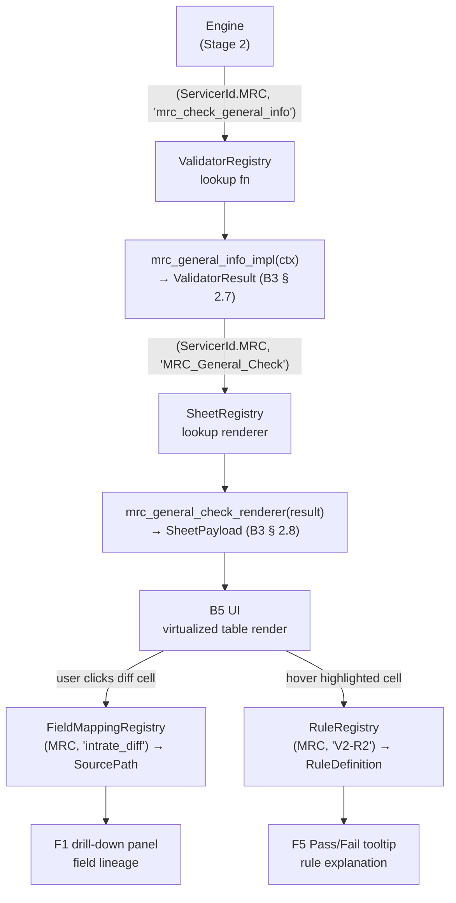
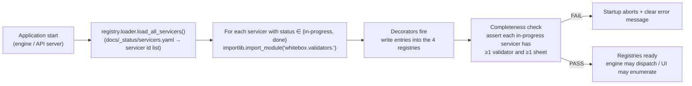

# 4.0 Stage 2 Validator Registry

> **Purpose**: Defines the shapes, registration API, discovery mechanism,
> override semantics, and testing contract for the four Stage 2 registries
> (`ValidatorRegistry`, `SheetRegistry`, `FieldMappingRegistry`,
> `RuleRegistry`). This document enables the engine and UI to dispatch
> validators, generate sheet payloads, and render styles **without
> hard-coding any servicer name** — the prerequisite for the B5 UI
> "servicer-agnostic rendering" design (B5 § 8) and B6 extensibility.
>
> **Intended audience**: Stage 2 engine implementers; validator and sheet
> maintainers; engineers onboarding new servicers; the user reviewing the
> B4 deliverable.
>
> **Revision history**
>
> | Date | Author | Change |
> |---|---|---|
> | 2026-05-28 | Copilot CLI agent | v1 — Initial version. Defines four registry shapes, registration API, MRC seed registrations (5 validators + 12 rules + 5 sheets), discovery and loading mechanism, override precedence, and testing contract. Aligned with B3 data models (`docs/stage2/3.0-data-model.en.md`) and B5 UI architecture (`docs/stage2/6.0-ui-architecture.en.md`). |

---

> **3-tier behavior marker (AGENTS § 6.11 mandatory)** — Every behavior
> assertion in this document carries exactly one of the following tier tags:
>
> | Tier | Tag | Meaning |
> |---|---|---|
> | 1 — Verified | `[FROM-CODE]` or `[CONFIRMED]` | Reverse-engineered from source with line-range citation **and** corroborated against the physical baseline XLSX |
> | 2 — Inferred | `[FROM-CODE]` (without physical confirmation) or `[VERIFY]` | Reverse-engineered from source only; no physical-artefact corroboration yet |
> | 3 — Newly discovered | `[FOUND-DURING-B4]` | Surfaced during B4 authoring; must include date, finder, and Stage 2 todo ref |

> **Gate dependencies** — This is a pure design document and may be authored
> before G2a / G2b / G3 close. No Stage 2 **registry code** may be merged
> until all three gates close (see `plan.md` § 4.2):
>
> | Gate | Description | Status |
> |---|---|---|
> | G2a | Input snapshot freeze (Redshift → local parquet) | ⏸ Pending operator action |
> | G2b | Physical baseline XLSX freeze | ⏸ Pending operator action |
> | G3 | Stage 1 chapter walkthrough review complete | ⏸ Pending user sign-off |

---

## 1. Purpose: Why a Registry

### 1.1 The root problem

In the existing PrefectFlow system, validator dispatch is implemented via
hard-coded string branches — `flow == 'mrc'` scattered across 5 locations
(ch 1.1 § 5.1 `[FROM-CODE]`). The renderer hard-codes all 5 MRC sheet
configurations at `gen_remit_validation_report.py:1327-1356` `[FROM-CODE]`.
This means:

- Adding a new servicer requires modifying multiple core files, risking
  regressions.
- Unit tests cannot independently assert "which sheets does V3 produce?".
- The UI cannot enumerate available servicers and sheets without restarting
  the backend.

### 1.2 The registry solution

A registry centralises the `servicer × feature_id → callable implementation`
mapping so the engine and UI dispatch exclusively through the registry —
no internal branching on servicer identity.

```
Engine call: ValidatorRegistry[(ServicerId.MRC, "mrc_check_general_info")](ctx)
                ↑ key lookup, no if/elif
```

This directly implements B3 Design Principle 1: "Servicer discriminator on
every shared model — Stage 2 must not hard-code the string `'MRC'`"
(`docs/stage2/3.0-data-model.en.md` § 1.1 `[VERIFY]`).

---

## 2. Registry Shapes

This section defines the type signatures of the four registries in
Python-flavored pseudocode — contract only, not implementation.

### 2.1 `ValidatorRegistry`

```python
from typing import Callable
from whitebox.models import ServicerId, ValidatorContext, ValidatorResult

# Key: (servicer_id, validator_id)
# Value: pure function (context) → result
ValidatorRegistry = dict[
    tuple[ServicerId, str],          # ("MRC", "mrc_check_general_info")
    Callable[[ValidatorContext], ValidatorResult]
]
```

- **`ValidatorContext`** — B3 § 2.6 immutable input frame reference
  (`docs/stage2/3.0-data-model.en.md`).
- **`ValidatorResult`** — B3 § 2.7 complete output: stamped DataFrame +
  `CellAnnotation[]`.
- `validator_id` aligns with `ValidatorResult.validator_id` and with the
  `VALIDATION_TABLE_MAP` keys (ch 1.2 § 7.1 `[FROM-CODE]`).

### 2.2 `SheetRegistry`

```python
from whitebox.models import SheetPayload

# Key: (servicer_id, sheet_id)
# Value: callable (ValidatorResult) → SheetPayload
SheetRegistry = dict[
    tuple[ServicerId, str],          # ("MRC", "MRC_General_Check")
    Callable[[ValidatorResult], SheetPayload]
]
```

- **`SheetPayload`** — B3 § 2.8, carrying pre-computed cell coordinates
  (`CellGrid`) and all metadata required for B5 UI rendering.
- `sheet_id` aligns with `SheetPayload.sheet_name` and the B5 UI tab ID
  (B5 § 2.1 `[CONFIRMED]`).

### 2.3 `FieldMappingRegistry`

```python
# SourcePath: logical field → physical origin
# Format: "<schema>.<table>.<column>"  or  "DERIVED(<expression>)"
SourcePath = str

# Key: (servicer_id, logical_field)
# Value: physical source path
FieldMappingRegistry = dict[
    tuple[ServicerId, str],          # ("MRC", "servicefee_diff")
    SourcePath
]
```

- Provides the B5 UI drill-down panel with per-column lineage:
  "which upstream field was used to compute this diff column?"
  (B5 § 7.2 `[VERIFY]`).
- Logical field names align with ch 1.4 field definitions.

### 2.4 `RuleRegistry`

```python
from dataclasses import dataclass

@dataclass(frozen=True)
class RuleDefinition:
    rule_id:          str        # e.g. "V2-R2"
    predicate:        str        # natural language or SQL: "abs(intrate_diff) > 0"
    label:            str        # HIGHLIGHT | SUPPRESSED | NO-HIGHLIGHT | INFO | MISSING-SHEET
    highlight_color:  str | None # hex, e.g. "ffc7ce"; non-None when HIGHLIGHT
    severity:         str        # P0-MISSING-SHEET | P1-HIGHLIGHT | INFO | SUPPRESSED
    source_location:  str        # "gen_remit_validation_report.py:1764-1798"

# Key: (servicer_id, rule_id)
RuleRegistry = dict[
    tuple[ServicerId, str],
    RuleDefinition
]
```

- The `label` enumeration is taken directly from ch 1.5 § 2.2 rule taxonomy
  `[FROM-CODE]`.
- `severity` drives colour coding and alert classification for B5 UI
  F5 "Pass/Fail Explanations" (B5 § 4 F5).

---

## 3. Registration API

### 3.1 Decorator style (recommended)

```python
# Register a validator
@register_validator(servicer="MRC", id="mrc_check_general_info")
def mrc_general_info_impl(ctx: ValidatorContext) -> ValidatorResult:
    ...

# Register a sheet renderer
@register_sheet(servicer="MRC", id="MRC_General_Check")
def mrc_general_check_renderer(result: ValidatorResult) -> SheetPayload:
    ...

# Register a field mapping
@register_field_mapping(servicer="MRC", field="intrate_diff_remitvsdaily")
def mrc_intrate_diff_source() -> SourcePath:
    return "DERIVED(r.intrate - p.interest_rate)"

# Register a rule
@register_rule(servicer="MRC", rule_id="V2-R2")
def mrc_v2_r2() -> RuleDefinition:
    return RuleDefinition(
        rule_id="V2-R2",
        predicate="abs(intrate_diff_remitvsdaily) > 0",
        label="HIGHLIGHT",
        highlight_color="ffc7ce",
        severity="P1-HIGHLIGHT",
        source_location="gen_remit_validation_report.py:1764-1798",
    )
```

### 3.2 Explicit registration function (fallback)

When decorators are not available (dynamic loading, test mocks):

```python
validator_registry.register(
    servicer=ServicerId.MRC,
    validator_id="mrc_check_general_info",
    fn=mrc_general_info_impl,
)
```

### 3.3 Lifecycle: import-time vs lazy loading

| Strategy | Description | When to use |
|---|---|---|
| **Import-time** (recommended) | Decorators fire immediately when the servicer module is imported | Production; startup completeness check |
| **Lazy loading** | Engine triggers `importlib.import_module` on first use of that servicer | Large multi-servicer deployments, reducing startup cost |

> `[VERIFY]` How lazy loading integrates with the existing static YAML
> loading in `tools/registry.py::load_all()` is deferred to stage B6
> (VR-OQ-1).

---

## 4. Data-flow Diagram



_Figure 4.0.4 — How the four registries cooperate to drive engine dispatch,
UI rendering, and drill-down lineage. Node IDs are display-only cross-references
between this figure and the prose; they are not source-code identifiers._

**Step-by-step explanation:**

1. **Engine** looks up `(ServicerId.MRC, "mrc_check_general_info")` in the
   `ValidatorRegistry` — no `if servicer == "MRC"` branch anywhere.
2. **Implementation function** accepts `ValidatorContext` (B3 § 2.6),
   returns `ValidatorResult` (B3 § 2.7) with stamped DataFrame and
   `CellAnnotation[]`.
3. **Engine** looks up `(ServicerId.MRC, "MRC_General_Check")` in the
   `SheetRegistry`, calls the renderer to produce `SheetPayload` (B3 § 2.8)
   with pre-computed cell coordinates.
4. **B5 UI** consumes `SheetPayload` to render the virtualised table
   (B5 § 8.1 `[PROPOSED]`).
5. **F1 drill-down** queries `FieldMappingRegistry` with
   `(ServicerId.MRC, logical_field)` and shows the field lineage chain.
6. **F5 tooltip** queries `RuleRegistry` with `(ServicerId.MRC, rule_id)`
   and presents the rule explanation with severity classification.

---

## 5. MRC Seed Registrations

### 5.1 Five MRC Validators

The following 5 entries will be registered at Stage 2 P2.0 (citing ch 1.5):

| validator_id | Planned function name | Output sheet | Highlight cols | Source |
|---|---|---|---|---|
| `mrc_summary_check` | `mrc_summary_check_impl` | `MRC_Summary_check` | 0 | `mrc_validation.py:8-36` `[FROM-CODE]` |
| `mrc_check_general_info` | `mrc_general_info_impl` | `MRC_General_Check` | 7 | `servicer_validation_with_portdaily.py:635-705` `[FROM-CODE]` |
| `mrc_check_adv_balance` | `mrc_adv_balance_impl` | `MRC_Advance_Check` | 4 | `servicer_validation_with_portdaily.py:583-632` `[FROM-CODE]` |
| `mrc_service_fee_check` | `mrc_service_fee_impl` | `MRC_ServiceFee_Check` | 1 | `mrc_validation.py:75-102` `[FROM-CODE]` |
| `mrc_other_check` | `mrc_other_check_impl` | `MRC_Adv_Info` | 0 | `mrc_validation.py:105-158` `[FROM-CODE]` |

_Table 4.0.5.1 — 5 MRC validator registry entries. "Highlight cols" = actual
length of `highlight_columns` in `gen_remit_validation_report.py:1327-1356`
`[FROM-CODE]`._

### 5.2 Twelve HIGHLIGHT Rules

The following 12 rules form the MRC seed for `RuleRegistry`
(HIGHLIGHT label only; MISSING-SHEET, SUPPRESSED, and INFO rules are
catalogued in ch 1.5 and omitted here for brevity):

| rule_id | Validator | Predicate | Source |
|---|---|---|---|
| V2-R2 | `mrc_check_general_info` | `abs(intrate_diff_remitvsdaily) > 0` | `servicer_validation_with_portdaily.py:685` `[FROM-CODE]` |
| V2-R3 | `mrc_check_general_info` | `nextduedate_diff_remitvsdaily != 0` (0/1 binary) | `servicer_validation_with_portdaily.py:686` `[FROM-CODE]` |
| V2-R4 | `mrc_check_general_info` | `abs(begbal_diff_remitvsdaily) > 0` | `servicer_validation_with_portdaily.py:681` `[FROM-CODE]` |
| V2-R5 | `mrc_check_general_info` | `abs(endbal_diff_remitvsdaily) > 0` | `servicer_validation_with_portdaily.py:683` `[FROM-CODE]` |
| V2-R6 | `mrc_check_general_info` | `abs(deferredprincipal_diff_remitvsdaily) > 0` (NULL→0 coalesce) | `servicer_validation_with_portdaily.py:687` `[FROM-CODE]` |
| V2-R7 | `mrc_check_general_info` | `abs(deferredint_diff_remitvsdaily) > 0` (NULL→0 coalesce) | `servicer_validation_with_portdaily.py:688` `[FROM-CODE]` |
| V2-R8 | `mrc_check_general_info` | `abs(pandi_schedule_diff_remitvsdaily) > 0` | `servicer_validation_with_portdaily.py:689-690` `[FROM-CODE]` |
| V3-R2 | `mrc_check_adv_balance` | `abs(escadv_diff_remitvsdaily) > 0` (addition sign convention) | `servicer_validation_with_portdaily.py:622` `[FROM-CODE]` |
| V3-R3 | `mrc_check_adv_balance` | `abs(recovcorpadv_diff_remitvsdaily) > 0` | `servicer_validation_with_portdaily.py:623` `[FROM-CODE]` |
| V3-R4 | `mrc_check_adv_balance` | `abs(nonrecovcorpadv_diff_remitvsdaily) > 0` | `servicer_validation_with_portdaily.py:624` `[FROM-CODE]` |
| V3-R5 | `mrc_check_adv_balance` | `abs(totalcorpadv_diff_remitvsdaily) > 0` | `servicer_validation_with_portdaily.py:625` `[FROM-CODE]` |
| V4-R2 | `mrc_service_fee_check` | `abs(servicefee_diff) > 0` | `mrc_validation.py:88-95` `[FROM-CODE]` |

_Table 4.0.5.2 — 12 MRC HIGHLIGHT rules, all with threshold = 0 (strict `>`).
Predicates sourced from ch 1.5 §§ 5–7 `[FROM-CODE]`._

### 5.3 Five MRC Sheets

| sheet_id | Tab order | Col count | Highlight cols | Producing validator_id |
|---|---|---|---|---|
| `MRC_Summary_check` | 1 | 14 | 0 | `mrc_summary_check` |
| `MRC_General_Check` | 2 | 35 | 7 | `mrc_check_general_info` |
| `MRC_Advance_Check` | 3 | 27 | 4 | `mrc_check_adv_balance` |
| `MRC_ServiceFee_Check` | 4 | 8 | 1 | `mrc_service_fee_check` |
| `MRC_Adv_Info` | 5 | 7 | 0 | `mrc_other_check` |

_Table 4.0.5.3 — 5 MRC sheet registry entries. Column counts and tab order
from ch 1.6 § 3.1 `[FROM-CODE]`. Highlight column counts from
`gen_remit_validation_report.py:1327-1356` `[FROM-CODE]`._

---

## 6. Discovery and Loading

### 6.1 Package layout convention

```
whitebox/
  validators/
    mrc/
      summary_check.py         # @register_validator(servicer="MRC", id="mrc_summary_check")
      general_info.py          # @register_validator(servicer="MRC", id="mrc_check_general_info")
      adv_balance.py
      service_fee.py
      other_check.py
      field_mappings.py        # @register_field_mapping(...)
      rules.py                 # @register_rule(...)
    arvest/                    # [VERIFY] pending analysis
      __init__.py              # raise NotImplementedError("pending analysis")
  sheets/
    mrc/
      mrc_general_check.py     # @register_sheet(servicer="MRC", id="MRC_General_Check")
      ...
  registry/
    __init__.py                # four registry singletons
    decorators.py              # register_validator / register_sheet / ... decorators
    loader.py                  # load_all_servicers(): imports validators/<servicer>/* to fire decorators
```

### 6.2 Startup discovery flow



_Figure 4.0.6.2 — Startup registry discovery flow. `servicers.yaml` (already
at `docs/_status/servicers.yaml`) drives import decisions; pending-analysis
servicer modules raise `NotImplementedError`, caught by the loader and
logged, without blocking startup (open policy VR-OQ-2)._

**Step-by-step explanation:**

1. **Application start** calls `registry.loader.load_all_servicers()`,
   reading the servicer list from `docs/_status/servicers.yaml`.
2. **Loader** calls `importlib.import_module('whitebox.validators.<id>')`
   for each servicer whose `status` is `in-progress` or `done`.
3. **Module import** triggers `@register_*` decorators, writing entries
   into the four registries (import-time registration strategy).
4. **Completeness check** asserts that each `in-progress` servicer has
   at least one registered validator and one registered sheet; startup
   terminates with a clear error message on failure.
5. **Registries ready** — the engine can dispatch by
   `(servicer_id, id)` and the UI can enumerate all available entries.

---

## 7. Override and Precedence

### 7.1 Scenarios

| Scenario | Recommended mechanism |
|---|---|
| Replace an MRC validator implementation (bug fix) | Re-register in the same module with `override=True` |
| Inject a mock validator for testing | `registry.register(..., fn=mock_fn, override=True)` |
| Downstream user customises a servicer without forking core | Create a `whitebox_plugins/<org>/validators/mrc/` package; declare `whitebox.validators` entry-point in `pyproject.toml`; loader discovers and registers with `override=True` automatically |

### 7.2 Precedence rule

```
core registration  <  entry-point plugin  <  test mock (highest)
```

Registering the same `(servicer_id, id)` key twice with `override=False`
(the default) raises `DuplicateRegistrationError`.

> `[VERIFY]` Whether multiple entry-point plugins overriding the same key
> have a deterministic ordering (CPython entry-point iteration order is not
> guaranteed; VR-OQ-3).

---

## 8. Testing Contract

### 8.1 Registry snapshot tests

Tests should assert the deterministic contents of the registry under a
known fixture:

```python
# tests/test_registry_snapshot.py
def test_mrc_validator_registry_snapshot(mrc_registry_fixture):
    keys = sorted(mrc_registry_fixture.validators.keys())
    assert keys == [
        (ServicerId.MRC, "mrc_check_adv_balance"),
        (ServicerId.MRC, "mrc_check_general_info"),
        (ServicerId.MRC, "mrc_other_check"),
        (ServicerId.MRC, "mrc_service_fee_check"),
        (ServicerId.MRC, "mrc_summary_check"),
    ]

def test_mrc_rule_registry_count(mrc_registry_fixture):
    mrc_rules = [k for k in mrc_registry_fixture.rules if k[0] == ServicerId.MRC]
    assert len(mrc_rules) >= 12  # 12 HIGHLIGHT rules + MISSING-SHEET / SUPPRESSED / INFO
```

### 8.2 Required assertions

| Assertion | Failure severity |
|---|---|
| Every registered validator's `validator_id` matches the `producing_validator_id` of at least one sheet in `SheetRegistry` | P0 |
| All 12 MRC HIGHLIGHT rules are registered (§ 5.2 complete list) | P0 |
| All 5 MRC sheets are registered with non-duplicate `tab_order` values (1–5) | P0 |
| `FieldMappingRegistry` covers every highlighted column name appearing in `ValidatorResult.cell_annotations` | P1 |
| Duplicate registration with `override=False` raises `DuplicateRegistrationError` | P1 |

---

## 9. Open Questions / `[VERIFY]`

| ID | Tag | Question | Owning gate |
|---|---|---|---|
| VR-OQ-1 | `[VERIFY]` | Does lazy loading require a dual-track design alongside the existing static YAML loading in `tools/registry.py::load_all()`? | B6 |
| VR-OQ-2 | `[VERIFY]` | Should a pending-analysis servicer module raise `NotImplementedError` on import, or silently skip? Affects B5 UI `PendingServicerHandler` behaviour (B5 § 8.1). | B5/B6 |
| VR-OQ-3 | `[VERIFY]` | Is there a deterministic ordering guarantee when multiple entry-point plugins override the same key? (CPython entry-point iteration is unordered) | B6 |
| VR-OQ-4 | `[VERIFY]` | Should `FieldMappingRegistry`'s `SourcePath` be a structured type (rather than `str`) to allow B5 UI to auto-generate lineage graphs? | B5 |
| VR-OQ-5 | `[VERIFY]` | `[FOUND-DURING-B4]` B3 § 2.1 states "non-MRC `ServicerId` enum values will be filled in once the B4 extensibility spec finalises servicer identifiers." Canonical identifiers for Arvest / CC5 / Selene / SLS must be confirmed in 5.0-extensibility-spec § 3.1. | B4 |
