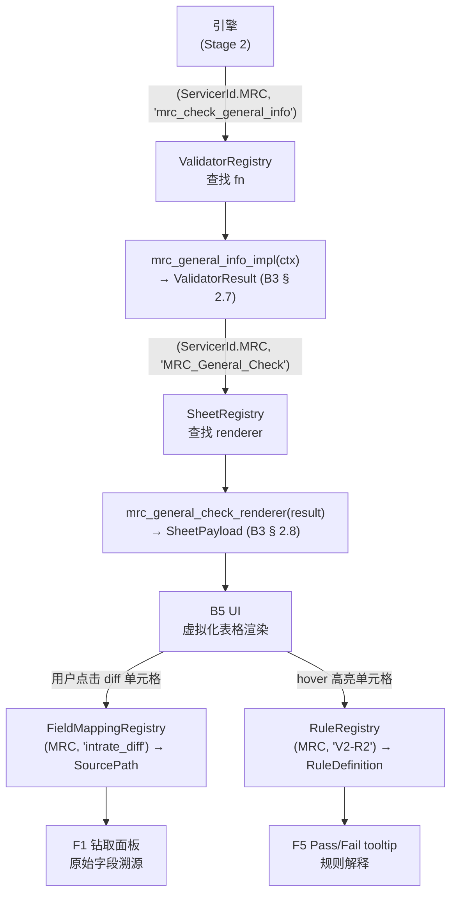

# 4.0 Stage 2 Validator Registry / 验证器注册表

> **目的**: 定义 Stage 2 四张注册表（`ValidatorRegistry`、`SheetRegistry`、
> `FieldMappingRegistry`、`RuleRegistry`）的 shape、注册 API、发现机制、覆盖语义
> 与测试契约。本文档使引擎和 UI 可以在 **不硬编码任何 servicer 名字** 的情况下
> 派发 validator、生成 sheet payload、渲染样式，是实现 B5 UI "servicer-agnostic
> rendering"（见 B5 § 8）和 B6 extensibility 的关键设计输入。
>
> **目标读者**: Stage 2 引擎实现者；validator/sheet 维护者；新 servicer 接入工程师；
> 审阅 B4 交付物的用户。
>
> **修订历史**
>
> | 日期 | 作者 | 变更 |
> |---|---|---|
> | 2026-05-28 | Copilot CLI agent | v1 — 首版。定义 4 张注册表 shape、注册 API、MRC seed 注册表（5 validators + 12 rules + 5 sheets）、发现与加载机制、覆盖优先级、测试契约。参照 B3 数据模型（`docs/stage2/3.0-data-model.zh.md`）和 B5 UI 架构（`docs/stage2/6.0-ui-architecture.zh.md`）。 |

---

> **3-tier 行为标记（AGENTS § 6.11 强制要求）** — 本文档中的每一个行为断言
> 都携带以下三级标记之一：
>
> | 层级 | 标记 | 含义 |
> |---|---|---|
> | 1 — 已验证 | `[FROM-CODE]` 或 `[CONFIRMED]` | 从源码逆向推导（带行号引用）并经物理 baseline XLSX 实测验证 |
> | 2 — 推断 | `[FROM-CODE]`（无物理验证）或 `[VERIFY]` | 仅从源码逆向推导；未经物理 artefact 核实 |
> | 3 — 新发现 | `[FOUND-DURING-B4]` | B4 构建过程中新发现；须包含日期、发现者及 Stage 2 todo 引用 |

> **G-gate 依赖** — 本文档为纯设计文档，可在 G2a / G2b / G3 关闭之前撰写。
> 任何 Stage 2 **注册表代码**都不得在以下三个 gate 全部关闭前合并（参见 `plan.md` § 4.2）：
>
> | Gate | 描述 | 状态 |
> |---|---|---|
> | G2a | 输入快照冻结（Redshift → local parquet） | ⏸ 待操作员执行 |
> | G2b | 物理 baseline XLSX 冻结 | ⏸ 待操作员执行 |
> | G3 | Stage 1 chapter 走读评审完成 | ⏸ 待用户确认 |

---

## 1. 目的：为什么需要注册表

### 1.1 问题根源

现有 PrefectFlow 系统中，validator 派发通过硬编码字符串分支实现——`flow == 'mrc'`
散落在 5 处（ch 1.1 § 5.1 `[FROM-CODE]`）。renderer 在 `gen_remit_validation_report.py:1327-1356`
硬编码 5 张 MRC sheet 配置 `[FROM-CODE]`。这使得：

- 添加新 servicer 需要修改多处核心代码，容易引入回归；
- 单元测试无法独立地断言"V3 注册了哪些 sheet"；
- UI 无法在不重启后端的情况下枚举可用的 servicer 与 sheet。

### 1.2 注册表方案

注册表把 **servicer × 功能 ID → 可调用实现** 的映射集中到一处，引擎与 UI 只通过注册表派发，不在业务逻辑中分支。

```
引擎调用: ValidatorRegistry[(ServicerId.MRC, "mrc_check_general_info")](ctx)
            ↑ 通过 key 查找实现，不走 if/elif
```

这与 B3 设计原则 1（"Servicer 判别字段无处不在，Stage 2 禁止硬编码 'MRC'"）直接对应（`docs/stage2/3.0-data-model.zh.md` § 1.1 `[VERIFY]`）。

---

## 2. 注册表 shape

本节定义四张注册表的类型签名（Python 伪代码；非实现，仅为契约）。

### 2.1 `ValidatorRegistry`

```python
from typing import Callable
from whitebox.models import ServicerId, ValidatorContext, ValidatorResult

# 键: (servicer_id, validator_id)
# 值: 纯函数 (context) → result
ValidatorRegistry = dict[
    tuple[ServicerId, str],          # ("MRC", "mrc_check_general_info")
    Callable[[ValidatorContext], ValidatorResult]
]
```

- **`ValidatorContext`** — B3 § 2.6 的不可变输入帧引用（`docs/stage2/3.0-data-model.zh.md`）。
- **`ValidatorResult`** — B3 § 2.7 的完整输出：stamped DataFrame + `CellAnnotation[]`。
- `validator_id` 与 B3 `ValidatorResult.validator_id` 字段对齐，也与 `VALIDATION_TABLE_MAP` key 一一对应（ch 1.2 § 7.1 `[FROM-CODE]`）。

### 2.2 `SheetRegistry`

```python
from whitebox.models import SheetPayload

# 键: (servicer_id, sheet_id)
# 值: 函数 (ValidatorResult) → SheetPayload
SheetRegistry = dict[
    tuple[ServicerId, str],          # ("MRC", "MRC_General_Check")
    Callable[[ValidatorResult], SheetPayload]
]
```

- **`SheetPayload`** — B3 § 2.8，持有预计算单元格坐标（`CellGrid`）与 B5 UI 渲染所需的全部元数据。
- `sheet_id` 与 B3 `SheetPayload.sheet_name` 以及 B5 UI 的 tab ID 对齐（B5 § 2.1 `[CONFIRMED]`）。

### 2.3 `FieldMappingRegistry`

```python
# SourcePath: 逻辑字段到物理来源的映射
# 例如 "mrc.portmonth.servicefee" 或 DERIVED("r.total_accrued - p.servicefee")
SourcePath = str  # 格式: "<schema>.<table>.<column>" 或 "DERIVED(<expr>)"

# 键: (servicer_id, logical_field)
# 值: 物理来源路径
FieldMappingRegistry = dict[
    tuple[ServicerId, str],          # ("MRC", "servicefee_diff")
    SourcePath
]
```

- 为 B5 UI 钻取面板提供"这个 diff 列由哪个上游字段计算而来"的逐列溯源（B5 § 7.2 `[VERIFY]`）。
- 与 ch 1.4 字段定义文档对齐：逻辑字段名即 1.4 中的列名。

### 2.4 `RuleRegistry`

```python
from dataclasses import dataclass

@dataclass(frozen=True)
class RuleDefinition:
    rule_id:          str       # e.g. "V2-R2"
    predicate:        str       # 自然语言或 SQL 表达式: "abs(intrate_diff) > 0"
    label:            str       # HIGHLIGHT | SUPPRESSED | NO-HIGHLIGHT | INFO | MISSING-SHEET
    highlight_color:  str | None  # hex, e.g. "ffc7ce"; HIGHLIGHT 时非 None
    severity:         str       # P0-MISSING-SHEET | P1-HIGHLIGHT | INFO | SUPPRESSED
    source_location:  str       # "gen_remit_validation_report.py:1764-1798"

# 键: (servicer_id, rule_id)
RuleRegistry = dict[
    tuple[ServicerId, str],
    RuleDefinition
]
```

- `label` 枚举直接来自 ch 1.5 § 2.2 rule taxonomy `[FROM-CODE]`。
- `severity` 为 B5 UI F5 "Pass/Fail explanations"（B5 § 4 F5）提供颜色编码和告警分级。

---

## 3. 注册 API

### 3.1 装饰器风格（推荐）

```python
# 注册 validator
@register_validator(servicer="MRC", id="mrc_check_general_info")
def mrc_general_info_impl(ctx: ValidatorContext) -> ValidatorResult:
    ...

# 注册 sheet renderer
@register_sheet(servicer="MRC", id="MRC_General_Check")
def mrc_general_check_renderer(result: ValidatorResult) -> SheetPayload:
    ...

# 注册字段映射
@register_field_mapping(servicer="MRC", field="intrate_diff_remitvsdaily")
def mrc_intrate_diff_source() -> SourcePath:
    return "DERIVED(r.intrate - p.interest_rate)"

# 注册规则
@register_rule(servicer="MRC", rule_id="V2-R2")
def mrc_v2_r2() -> RuleDefinition:
    return RuleDefinition(
        rule_id="V2-R2",
        predicate="abs(intrate_diff_remitvsdaily) > 0",
        label="HIGHLIGHT",
        highlight_color="ffc7ce",
        severity="P1-HIGHLIGHT",
        source_location="gen_remit_validation_report.py:1764-1798",
    )
```

### 3.2 显式注册函数（备用）

若无法使用装饰器（如动态加载、测试 mock），可直接调用：

```python
validator_registry.register(
    servicer=ServicerId.MRC,
    validator_id="mrc_check_general_info",
    fn=mrc_general_info_impl,
)
```

### 3.3 生命周期：导入时 vs 懒加载

| 策略 | 描述 | 适用场景 |
|---|---|---|
| **导入时注册**（推荐） | 每个 servicer 模块 `import` 时装饰器立即写入注册表 | 生产环境；启动时完整性校验 |
| **懒加载注册** | 引擎首次用到该 servicer 时触发 `importlib.import_module` | 大型多 servicer 部署，减少启动时间 |

> `[VERIFY]` 懒加载与 `tools/registry.py` 现有的 `load_all()` 静态 YAML 加载机制
> 的集成方式待 B6 阶段确定（VR-OQ-1）。

---

## 4. 数据流示意图



_图 4.0.4 — 四张注册表如何协同驱动引擎派发、UI 渲染与钻取溯源。节点 ID 为图内纯展示用交叉引用，非源码标识符。_

**按编号逐步解释：**

1. **引擎** 以 `(ServicerId.MRC, "mrc_check_general_info")` 为键查询 `ValidatorRegistry`，取回实现函数——无任何 `if servicer == "MRC"` 分支。
2. **实现函数** 接受 `ValidatorContext`（B3 § 2.6），返回 `ValidatorResult`（B3 § 2.7），包含 stamped DataFrame 与 `CellAnnotation[]`。
3. **引擎** 以 `(ServicerId.MRC, "MRC_General_Check")` 查询 `SheetRegistry`，取回 sheet renderer，生成 `SheetPayload`（B3 § 2.8）——预计算单元格坐标。
4. **B5 UI** 消费 `SheetPayload` 渲染虚拟化表格（B5 § 8.1 `[PROPOSED]`）。
5. **F1 钻取** 触发时，UI 以 `(ServicerId.MRC, logical_field)` 查询 `FieldMappingRegistry`，展示字段血缘链。
6. **F5 tooltip** 触发时，UI 以 `(ServicerId.MRC, rule_id)` 查询 `RuleRegistry`，展示规则解释与严重等级。

---

## 5. MRC seed 注册表

### 5.1 5 个 MRC Validators

以下 5 条将在 Stage 2 P2.0 注册（引用 ch 1.5）：

| validator_id | 函数名（规划） | 输出 sheet | 高亮列数 | 来源 |
|---|---|---|---|---|
| `mrc_summary_check` | `mrc_summary_check_impl` | `MRC_Summary_check` | 0 | `mrc_validation.py:8-36` `[FROM-CODE]` |
| `mrc_check_general_info` | `mrc_general_info_impl` | `MRC_General_Check` | 7 | `servicer_validation_with_portdaily.py:635-705` `[FROM-CODE]` |
| `mrc_check_adv_balance` | `mrc_adv_balance_impl` | `MRC_Advance_Check` | 4 | `servicer_validation_with_portdaily.py:583-632` `[FROM-CODE]` |
| `mrc_service_fee_check` | `mrc_service_fee_impl` | `MRC_ServiceFee_Check` | 1 | `mrc_validation.py:75-102` `[FROM-CODE]` |
| `mrc_other_check` | `mrc_other_check_impl` | `MRC_Adv_Info` | 0 | `mrc_validation.py:105-158` `[FROM-CODE]` |

_表 4.0.5.1 — 5 个 MRC validator 的注册表条目。"高亮列数" = 实际在 `gen_remit_validation_report.py:1327-1356` 中注册的 `highlight_columns` 长度 `[FROM-CODE]`。_

### 5.2 12 个 HIGHLIGHT rules

以下 12 条为 `RuleRegistry` 的 MRC seed（仅 `HIGHLIGHT` 类规则；`MISSING-SHEET`、`SUPPRESSED`、`INFO` 规则省略细节，均已在 ch 1.5 目录化）：

| rule_id | 所属 validator | 触发条件（谓词） | 来源 |
|---|---|---|---|
| V2-R2 | `mrc_check_general_info` | `abs(intrate_diff_remitvsdaily) > 0` | `servicer_validation_with_portdaily.py:685` `[FROM-CODE]` |
| V2-R3 | `mrc_check_general_info` | `nextduedate_diff_remitvsdaily != 0`（0/1 二值） | `servicer_validation_with_portdaily.py:686` `[FROM-CODE]` |
| V2-R4 | `mrc_check_general_info` | `abs(begbal_diff_remitvsdaily) > 0` | `servicer_validation_with_portdaily.py:681` `[FROM-CODE]` |
| V2-R5 | `mrc_check_general_info` | `abs(endbal_diff_remitvsdaily) > 0` | `servicer_validation_with_portdaily.py:683` `[FROM-CODE]` |
| V2-R6 | `mrc_check_general_info` | `abs(deferredprincipal_diff_remitvsdaily) > 0`（NULL→0 coalesce） | `servicer_validation_with_portdaily.py:687` `[FROM-CODE]` |
| V2-R7 | `mrc_check_general_info` | `abs(deferredint_diff_remitvsdaily) > 0`（NULL→0 coalesce） | `servicer_validation_with_portdaily.py:688` `[FROM-CODE]` |
| V2-R8 | `mrc_check_general_info` | `abs(pandi_schedule_diff_remitvsdaily) > 0` | `servicer_validation_with_portdaily.py:689-690` `[FROM-CODE]` |
| V3-R2 | `mrc_check_adv_balance` | `abs(escadv_diff_remitvsdaily) > 0`（加法符号约定） | `servicer_validation_with_portdaily.py:622` `[FROM-CODE]` |
| V3-R3 | `mrc_check_adv_balance` | `abs(recovcorpadv_diff_remitvsdaily) > 0` | `servicer_validation_with_portdaily.py:623` `[FROM-CODE]` |
| V3-R4 | `mrc_check_adv_balance` | `abs(nonrecovcorpadv_diff_remitvsdaily) > 0` | `servicer_validation_with_portdaily.py:624` `[FROM-CODE]` |
| V3-R5 | `mrc_check_adv_balance` | `abs(totalcorpadv_diff_remitvsdaily) > 0` | `servicer_validation_with_portdaily.py:625` `[FROM-CODE]` |
| V4-R2 | `mrc_service_fee_check` | `abs(servicefee_diff) > 0` | `mrc_validation.py:88-95` `[FROM-CODE]` |

_表 4.0.5.2 — 12 个 MRC HIGHLIGHT rules，全部 threshold = 0（严格 `>`）。谓词描述来自 ch 1.5 §§ 5–7 `[FROM-CODE]`。_

### 5.3 5 个 MRC Sheets

| sheet_id | tab 顺序 | 列数 | 高亮列 | 对应 validator_id |
|---|---|---|---|---|
| `MRC_Summary_check` | 1 | 14 | 0 | `mrc_summary_check` |
| `MRC_General_Check` | 2 | 35 | 7 | `mrc_check_general_info` |
| `MRC_Advance_Check` | 3 | 27 | 4 | `mrc_check_adv_balance` |
| `MRC_ServiceFee_Check` | 4 | 8 | 1 | `mrc_service_fee_check` |
| `MRC_Adv_Info` | 5 | 7 | 0 | `mrc_other_check` |

_表 4.0.5.3 — 5 个 MRC sheets 的注册表条目。列数与 tab 顺序来自 ch 1.6 § 3.1 `[FROM-CODE]`。高亮列数来自 `gen_remit_validation_report.py:1327-1356` `[FROM-CODE]`。_

---

## 6. 发现与加载机制

### 6.1 包布局约定

```
whitebox/
  validators/
    mrc/
      summary_check.py          # @register_validator(servicer="MRC", id="mrc_summary_check")
      general_info.py           # @register_validator(servicer="MRC", id="mrc_check_general_info")
      adv_balance.py
      service_fee.py
      other_check.py
      field_mappings.py         # @register_field_mapping(...)
      rules.py                  # @register_rule(...)
    arvest/                     # [VERIFY] 待分析
      __init__.py               # raise NotImplementedError("pending analysis")
  sheets/
    mrc/
      mrc_general_check.py      # @register_sheet(servicer="MRC", id="MRC_General_Check")
      ...
  registry/
    __init__.py                 # 四张注册表的单例
    decorators.py               # register_validator / register_sheet / ... 装饰器
    loader.py                   # load_all_servicers()：导入 validators/<servicer>/* 触发装饰器
```

### 6.2 启动时发现流程


_图 4.0.6.2 — 启动时注册表发现流程。`servicers.yaml`（已存在于 `docs/_status/servicers.yaml`）驱动 import 决策；pending-analysis servicer 的模块导入会触发 `NotImplementedError`，被 loader 捕获并记录，不阻断启动（`OPEN-POLICY`: VR-OQ-2）。_

**按编号逐步解释：**

1. **应用启动** 调用 `registry.loader.load_all_servicers()`，读取 `docs/_status/servicers.yaml` 中的 servicer 列表。
2. **Loader** 对每个 `status` 为 `in-progress` 或 `done` 的 servicer 执行 `importlib.import_module('whitebox.validators.<id>')`。
3. **模块导入** 触发 `@register_*` 装饰器，写入四张注册表（导入时注册策略）。
4. **完整性检查** 断言 `in-progress` servicer 至少注册了 1 个 validator 和 1 个 sheet；失败时启动终止并输出明确错误。
5. **注册表就绪** 后，引擎可按 `(servicer_id, id)` 派发，UI 可枚举所有可用条目。

---

## 7. 覆盖与优先级

### 7.1 场景

| 场景 | 推荐机制 |
|---|---|
| 替换 MRC validator 实现（bug fix） | 在同一模块重新调用 `register(override=True)` |
| 为测试注入 mock validator | `registry.register(..., fn=mock_fn, override=True)` |
| 下游用户自定义 servicer（无需 fork core） | 创建 `whitebox_plugins/<org>/validators/mrc/` 包，在 `pyproject.toml` entry-point `whitebox.validators` 下注册；loader 遍历 entry-points 时自动发现并以 `override=True` 写入 |

### 7.2 优先级规则

```
core 注册 < entry-point plugin 注册 < 测试 mock 注册（最高优先级）
```

同一 `(servicer_id, id)` 被注册两次且 `override=False`（默认）时，注册表抛 `DuplicateRegistrationError`。

> `[VERIFY]` entry-point 插件发现顺序在多 plugin 时是否确定性（VR-OQ-3）。

---

## 8. 测试契约

### 8.1 注册表快照测试（snapshot tests）

测试应断言注册表在给定 fixture 下的确定性内容：

```python
# tests/test_registry_snapshot.py
def test_mrc_validator_registry_snapshot(mrc_registry_fixture):
    keys = sorted(mrc_registry_fixture.validators.keys())
    assert keys == [
        (ServicerId.MRC, "mrc_check_adv_balance"),
        (ServicerId.MRC, "mrc_check_general_info"),
        (ServicerId.MRC, "mrc_other_check"),
        (ServicerId.MRC, "mrc_service_fee_check"),
        (ServicerId.MRC, "mrc_summary_check"),
    ]

def test_mrc_rule_registry_count(mrc_registry_fixture):
    mrc_rules = [k for k in mrc_registry_fixture.rules if k[0] == ServicerId.MRC]
    assert len(mrc_rules) >= 12  # 12 个 HIGHLIGHT rules + MISSING-SHEET / SUPPRESSED / INFO
```

### 8.2 必须通过的断言

| 断言 | 失败分级 |
|---|---|
| 每个已注册 validator 的 `validator_id` 与其 `SheetRegistry` 中至少一个 sheet 的 `producing_validator_id` 相匹配 | P0 |
| 12 个 MRC HIGHLIGHT rules 均已注册（§ 5.2 完整列表） | P0 |
| 5 个 MRC sheets 均已注册且 `tab_order` 无重复（1–5） | P0 |
| `FieldMappingRegistry` 覆盖 `ValidatorResult.cell_annotations` 中出现的每个高亮列名 | P1 |
| 重复注册（`override=False`）抛 `DuplicateRegistrationError` | P1 |

---

## 9. 开放问题 / `[VERIFY]`

| ID | 标记 | 问题 | 所属 gate |
|---|---|---|---|
| VR-OQ-1 | `[VERIFY]` | 懒加载策略与 `tools/registry.py` 现有 YAML 加载的集成方式（静态 YAML vs 运行时 Python 注册）是否需要双轨并行？ | B6 |
| VR-OQ-2 | `[VERIFY]` | pending-analysis servicer 的模块 import 时应抛 `NotImplementedError` 还是静默跳过？影响 B5 UI `PendingServicerHandler` 的行为（B5 § 8.1）。 | B5/B6 |
| VR-OQ-3 | `[VERIFY]` | 多个 entry-point plugins 覆盖同一 key 时的优先级是否有确定性保证？（CPython entry-point 迭代顺序非保证有序） | B6 |
| VR-OQ-4 | `[VERIFY]` | `FieldMappingRegistry` 的 `SourcePath` 格式（`"<schema>.<table>.<col>"` vs `"DERIVED(<expr>)"`）是否需要结构化类型（而不是 `str`），以便 B5 UI 自动生成血缘图？ | B5 |
| VR-OQ-5 | `[VERIFY]` | `[FOUND-DURING-B4]` B3 § 2.1 中 `ServicerId` 枚举值注释 "非 MRC servicer 的枚举值在 B4 extensibility-spec 完成后填写"——需在 5.0-extensibility-spec 中为 Arvest / CC5 / Selene / SLS 确定正式枚举标识符（见该文档 § 3.1）。 | B4 |
