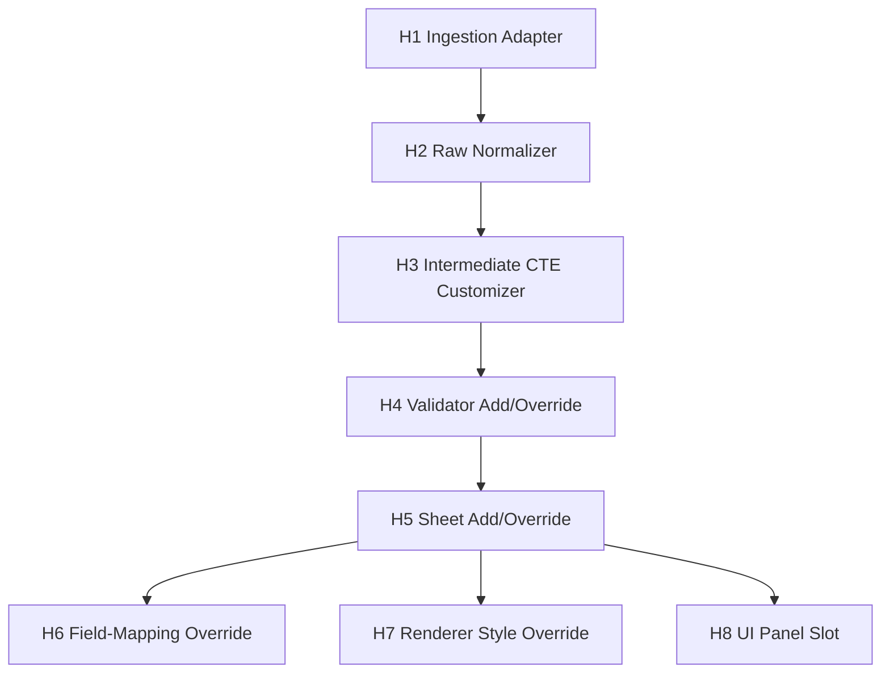
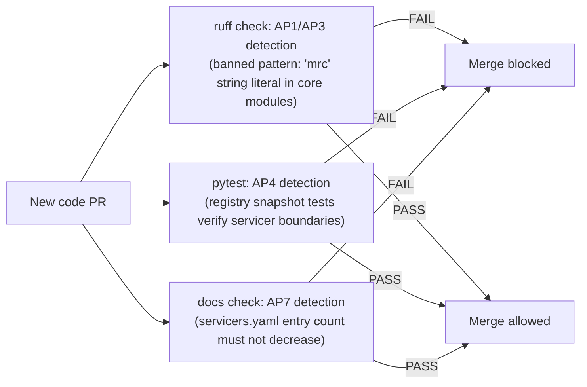

# 5.0 Stage 2 Extensibility Spec

> **Purpose**: Defines how to onboard a new servicer (Arvest, CC5, Selene,
> SLS, or any future servicer) **without modifying core engine code**.
> Covers the `ServicerId` discriminator propagation path, the per-servicer
> artifact checklist (MUST and NICE-TO-HAVE), the 8 extension hook points,
> compatibility guarantees, a step-by-step onboarding workflow, anti-patterns,
> and a pseudocode reference example (Arvest minimum-viable onboarding).
>
> **Intended audience**: Engineers onboarding new servicers; Stage 2 system
> designers; the user reviewing the B4 deliverable.
>
> **Revision history**
>
> | Date | Author | Change |
> |---|---|---|
> | 2026-05-28 | Copilot CLI agent | v1 — Initial version. Defines `ServicerId` propagation chain, MUST/NICE-TO-HAVE artifact checklist, 8 hook points, semver-style compatibility promises, and Arvest pseudocode example. Aligned with B3 data models, B4 registry spec, B5 UI architecture, `docs/_status/servicers.yaml`, and `docs/arvest/_pending.{zh,en}.md`. |

---

> **3-tier behavior marker (AGENTS § 6.11 mandatory)** — Every behavior
> assertion in this document carries exactly one of the following tier tags:
>
> | Tier | Tag | Meaning |
> |---|---|---|
> | 1 — Verified | `[FROM-CODE]` or `[CONFIRMED]` | Reverse-engineered from source with line-range citation **and** corroborated against the physical baseline XLSX |
> | 2 — Inferred | `[FROM-CODE]` (without physical confirmation) or `[VERIFY]` | Reverse-engineered from source only; no physical-artefact corroboration yet |
> | 3 — Newly discovered | `[FOUND-DURING-B4]` | Surfaced during B4 authoring; must include date, finder, and Stage 2 todo ref |

> **Gate dependencies** — This is a pure design document and may be authored
> before G2a / G2b / G3 close. No Stage 2 **onboarding implementation code**
> may be merged until all gates close:
>
> | Gate | Description | Status |
> |---|---|---|
> | G2a | Input snapshot freeze (Redshift → local parquet) | ⏸ Pending operator action |
> | G2b | Physical baseline XLSX freeze | ⏸ Pending operator action |
> | G3 | Stage 1 chapter walkthrough review complete | ⏸ Pending user sign-off |

---

## 1. Onboarding Goal

### 1.1 Core promise

> **Onboarding Arvest, CC5, Selene, SLS, or any future servicer must not
> require modifying the core engine, core data models, or B5 UI code.**

Onboarding is complete when:

1. Stage 1 analysis for the new servicer is finished (`docs/<servicer>/1.0–1.6`);
2. Validator, sheet, field-mapping, and rule entries for that servicer are
   registered in the B4 registries (see `docs/stage2/4.0-validator-registry.en.md`);
3. `docs/_status/servicers.yaml` is updated (AGENTS § 6.8 mandatory).

### 1.2 Servicers awaiting analysis

| servicer_id | Display name | Status | Est. sheets | Placeholder doc |
|---|---|---|---|---|
| `arvest` | Arvest | ⏳ pending-analysis | 4 (assumed) | `docs/arvest/_pending.{zh,en}.md` |
| `cc5` | CC5 | ⏳ pending-analysis | 2 (assumed) | `docs/cc5/_pending.{zh,en}.md` |
| `selene` | Selene | ⏳ pending-analysis | 5 (assumed) | `docs/selene/_pending.{zh,en}.md` |
| `sls` | SLS | ⏳ pending-analysis | 5 (assumed) | `docs/sls/_pending.{zh,en}.md` |
| `scattered` | Scattered (cross-servicer validators) | ⏳ pending-analysis | 0 | `docs/scattered/_pending.{zh,en}.md` |

---

## 2. Servicer-Discriminator Pattern

### 2.1 `ServicerId` propagation chain

B3 data models (`docs/stage2/3.0-data-model.en.md` § 2.1) define the
`ServicerId` enum. The field propagates through each pipeline layer:

```mermaid
flowchart LR
    sid["ServicerId\n(enum: MRC / ARVEST / …)"]
    sid --> raw["RawTableSnapshot\n.servicer: ServicerId\n(B3 § 2.2)"]
    raw --> frame["MrcRemitFrame / ArvestRemitFrame / …\n.servicer: ServicerId\n(B3 § 2.4 / § 3.2)"]
    frame --> ctes["MrcIntermediateCTEs / equiv.\n.servicer: ServicerId\n(B3 § 2.5)"]
    ctes --> ctx["ValidatorContext\n.servicer: ServicerId\n(B3 § 2.6)"]
    ctx --> vr["ValidatorResult\n.servicer: ServicerId\n(B3 § 2.7)"]
    vr --> sp["SheetPayload\n.servicer: ServicerId\n(B3 § 2.8)"]
    sp --> rj["XlsxRenderJob\n.servicer: ServicerId\n(B3 § 2.9)"]
    rj --> bc["BaselineComparison\n.servicer: ServicerId\n(B3 § 2.10)"]
```



_Figure 5.0.2.1 — `ServicerId` propagation from raw snapshot to the final
baseline comparison result. Every B3 data model carries this field; the
engine and UI dispatch through it — no hard-coded servicer strings anywhere.
Node IDs are display-only cross-references between this figure and the prose;
they are not source-code identifiers._

**Notes** (per § 6.10):

- **Business purpose**: ensures every pipeline output (every cell, every diff,
  every render job) carries a traceable servicer identity, supporting concurrent
  multi-servicer runs and mixed comparisons.
- **Execution flow**: `ServicerId` is written at ingestion time (`RawTableSnapshot`
  construction) and flows downstream unchanged; the engine and registries dispatch
  via it with **zero `if/elif` branches**.
- **Key constraint**: **hard-coding the string `"MRC"` is forbidden at every
  layer** (B3 § 1.1 `[VERIFY]`); adding a new servicer requires only a new enum
  value, no other core change.

### 2.2 Formal `ServicerId` enum values

The following table shows the canonical enum values as confirmed in B4
(non-MRC values upgrade from `[VERIFY]` to `[CONFIRMED]` upon completing
the corresponding Stage 1 analysis):

| Enum member | String value | Epistemic status |
|---|---|---|
| `ServicerId.MRC` | `"MRC"` | `[FROM-CODE]` ch 1.1 § 5.1 |
| `ServicerId.ARVEST` | `"ARVEST"` | `[VERIFY]` pending Stage 1 analysis |
| `ServicerId.CC5` | `"CC5"` | `[VERIFY]` pending Stage 1 analysis |
| `ServicerId.SELENE` | `"SELENE"` | `[VERIFY]` pending Stage 1 analysis |
| `ServicerId.SLS` | `"SLS"` | `[VERIFY]` pending Stage 1 analysis |
| `ServicerId.SCATTERED` | `"SCATTERED"` | `[VERIFY]` cross-servicer placeholder |

> `[FOUND-DURING-B4]` 2026-05-28: B3 § 2.1 states "non-MRC enum values will
> be filled in once B4 extensibility-spec finalises servicer identifiers."
> The five non-MRC values above are B4 placeholders; each upgrades to
> `[CONFIRMED]` when the corresponding servicer's Stage 1 analysis confirms
> the actual `servicer` column value in `port.portmonth`.

---

## 3. Per-Servicer Artifact Checklist (MUST)

### 3.1 Required artifacts

| # | Artifact | Description | Existing pattern |
|---|---|---|---|
| A1 | `docs/<servicer>/1.0-toc.{zh,en}.md` | Chapter map and scope declaration | MRC `docs/mrc/1.0-toc.*` |
| A2 | `docs/<servicer>/1.1-rawdata.{zh,en}.md` | Upstream tables, time anchors, snapshot plan | MRC `docs/mrc/1.1-rawdata.*` |
| A3 | `docs/<servicer>/1.2-dataflow.{zh,en}.md` | End-to-end execution pipeline | MRC `docs/mrc/1.2-dataflow.*` |
| A4 | `docs/<servicer>/1.3-sheets.{zh,en}.md` | openpyxl rendering contract (sheet order, columns, highlight) | MRC `docs/mrc/1.3-sheets.*` |
| A5 | `docs/<servicer>/1.4-fields.{zh,en}.md` | Field-level lineage and business meaning | MRC `docs/mrc/1.4-fields.*` |
| A6 | `docs/<servicer>/1.5-rules.{zh,en}.md` | Rule catalogue (HIGHLIGHT / SUPPRESSED / …) | MRC `docs/mrc/1.5-rules.*` |
| A7 | `docs/<servicer>/1.6-baseline.{zh,en}.md` | Baseline XLSX behaviour (V1–V12 checklist) | MRC `docs/mrc/1.6-baseline.*` |
| A8 | `baselines/<servicer>/<date>/input_snapshots/` | G2a pattern: frozen Parquet snapshots | `baselines/mrc/2026-04-30/` |
| A9 | `whitebox/field_mappings/<servicer>.yaml` | Logical field → `SourcePath` mapping (seed for `FieldMappingRegistry`) | New in B4 |
| A10 | Validator registrations `@register_validator(servicer=<id>, id=<vid>)` | Register all validators in the B4 `ValidatorRegistry` | MRC seed (4.0-validator-registry § 5.1) |
| A11 | Sheet renderer registrations `@register_sheet(servicer=<id>, id=<sid>)` | Register all sheets in the B4 `SheetRegistry` | MRC seed (4.0-validator-registry § 5.3) |
| A12 | `docs/_status/servicers.yaml` update | `status: pending-analysis → in-progress`; clear `placeholder_doc` | AGENTS § 6.8 mandatory |

> **Note**: A8 (frozen snapshots) depends on the G2a gate; prior to G2a,
> all code can be developed against mock data fixtures.

### 3.2 Nice-to-have artifacts

| # | Artifact | Description |
|---|---|---|
| B1 | Change-impact tests | Automatically detect which diff columns are affected when a servicer's Stage 1 chapter is updated |
| B2 | Lineage diagrams | `docs/<servicer>/lineage.{zh,en}.md` (mirroring `docs/lineage.*`) |
| B3 | Custom UI panels | Servicer-specific sub-panel in B5 UI F4 Validator Trace panel |
| B4 | Schema-level assertions | Verify new servicer's Parquet column list matches `SnapshotManifest` declarations |
| B5 | CI baseline comparison | Run `BaselineComparison` (B3 § 2.10) in CI to auto-detect regressions |

---

## 4. Hook Points

The following 8 hooks are the **exhaustive set of extension seams** in the
system. Onboarding a new servicer involves implementing the applicable hooks
— without touching any core code.



_Figure 5.0.4 — Logical topology of the 8 extension hook points. H1–H4 live
in the data pipeline; H5–H8 live in the rendering and UI layer. Arrows show
the typical data-flow direction, not a strict dependency ordering._

### H1 — Ingestion Adapter

**Interface**: `fn(servicer: ServicerId, remit_date: date) -> list[RawTableSnapshot]`

**Role**: Locates and loads Parquet snapshots for `(servicer, remit_date)`,
constructing a `RawTableSnapshot` (B3 § 2.2) for each file.

**MRC existing implementation**: scans `snapshots/<date>/raw/mrc/` for
`.parquet` files; `SnapshotManifest` (B3 § 2.3) provides metadata.

**New servicer must provide**: the same interface, changing only the path
pattern or Redshift schema prefix — the core engine is unchanged.

### H2 — Raw Normalizer

**Interface**: `fn(snapshots: list[RawTableSnapshot]) -> RemitFrame`

**Role**: Merges multiple `RawTableSnapshot` objects into a single
servicer-specific `RemitFrame` satisfying the `RemitFrame` protocol
(B3 § 3.2).

**MRC existing implementation**: constructs `MrcRemitFrame` (B3 § 2.4),
centralising derivation of the 4 time anchors.

**New servicer must provide**: a concrete frame class implementing the
`RemitFrame` protocol (`servicer`, `remit_date`, `source_snapshots`);
time-anchor logic may differ but the protocol shape must be identical.

### H3 — Intermediate CTE Customizer

**Interface**: optional — may be omitted if the servicer does not need
CTE-layer drill-down.

**Role**: Captures CTE-layer DataFrames after SQL join execution and before
the Python `asofdate` stamp, filling a `MrcIntermediateCTEs`-equivalent
object (B3 § 2.5) for UI drill-down tracing.

**New servicer should provide**: if the servicer has multi-table joins
similar to MRC, implementing this hook enables the F1 / F6 drill-down
features (B5 § 4). For inline-SQL validators (e.g. MRC V1/V5), `None` is
acceptable.

### H4 — Validator Add/Override

**Interface**: `@register_validator(servicer=<id>, id=<vid>)` (see B4 § 3)

**Role**: Writes `(servicer_id, validator_id) → fn` into `ValidatorRegistry`.

**Override**: use `override=True` to replace an existing MRC validator
without touching the MRC module — suitable for downstream extensions or A/B
testing.

### H5 — Sheet Add/Override

**Interface**: `@register_sheet(servicer=<id>, id=<sid>)` (see B4 § 3)

**Role**: Writes `(servicer_id, sheet_id) → fn` into `SheetRegistry`.

**Override**: downstream users can register additional sheets for MRC
(e.g. a debug-width sheet) without affecting the existing 5 sheets.

### H6 — Field-Mapping Override

**Interface**: `@register_field_mapping(servicer=<id>, field=<logical_field>)`

**Role**: Writes `(servicer_id, logical_field) → SourcePath` into
`FieldMappingRegistry`, providing lineage data for the B5 UI F1 drill-down
panel.

**Note**: if a new servicer reuses an MRC column name (e.g. `servicefee_diff`),
it can register a different `SourcePath` pointing to its own upstream tables
without affecting the MRC entry.

### H7 — Renderer Style Override

**Interface**: inject servicer-specific override values when constructing
`XlsxRenderJob` (B3 § 2.9).

**Role**: allows a new servicer to use different highlight colours, column
widths, or fonts without changing the MRC defaults.

**MRC current values**: `header_fill_normal_rgb = "bccde9"`,
`diff_fill_rgb = "ffc7ce"`, `diff_font_color_rgb = "df5006"`
(ch 1.6 § 4.1–§ 4.2 `[FROM-CODE]`).

### H8 — UI Panel Slot

**Interface**: `[PROPOSED]` — a reserved sub-panel slot in B5 UI F4
Validator Trace panel for servicer-specific content
(B5 § 8 servicer-agnostic rendering `[PROPOSED]`).

**Role**: allows a new servicer to surface custom explanatory content in the
drill-down panel (e.g. Arvest-specific field annotations).

> `[VERIFY]` The specific interface for H8 is deferred to the B5
> implementation phase (ES-OQ-1).

---

## 5. Compatibility Guarantees

The table below expresses stability promises for each hook in semver-style
terms:

| Hook | Stability | Notes |
|---|---|---|
| H1 Ingestion Adapter | `STABLE` | Interface shape will not change in a breaking way during the Stage 2 lifecycle |
| H2 Raw Normalizer | `STABLE` | The minimum `RemitFrame` protocol (`servicer`, `remit_date`, `source_snapshots`) is stable; forward extension allowed |
| H3 CTE Customizer | `BETA` | Interface may be adjusted after G3 review; existing MRC implementation is forward-compatible |
| H4 Validator Registry | `STABLE` | `(servicer_id, validator_id) → fn` signature stable; changes to `ValidatorContext`/`ValidatorResult` (B3) increment major version |
| H5 Sheet Registry | `STABLE` | `(servicer_id, sheet_id) → fn` signature stable; changes to `SheetPayload` (B3) increment major version |
| H6 Field-Mapping Registry | `BETA` | `SourcePath` format may evolve to a structured type (VR-OQ-4) |
| H7 Renderer Style Override | `STABLE` | `XlsxRenderJob` fields stable (B3 § 2.9 `[FROM-CODE+VERIFY]`); upgrades to `STABLE` once physical baseline confirms values |
| H8 UI Panel Slot | `EXPERIMENTAL` | Interface TBD during B5 implementation; no backward-compatibility guarantee |

> **Version-increment trigger**: deletion of or breaking type change to any
> field of a B3 data model (`docs/stage2/3.0-data-model.en.md`) increments
> the major version and requires a `decisions.md` entry.

---

## 6. Onboarding Workflow (Step-by-step)

The following is the complete step sequence for onboarding a new servicer
(illustrated with Arvest):

```mermaid
flowchart TD
    S1["Step 1\nRead MRC Stage 1 as reference\n(docs/mrc/1.0–1.6.{zh,en}.md)"]
    S2["Step 2\nReverse-engineer new servicer source\n(flow/remit_validation/<servicer>_validation.py\nutil/gen_remit_validation_report.py)"]
    S3["Step 3\nCreate docs/<servicer>/1.0–1.6.{zh,en}.md\n(copy MRC chapter template, fill actual content)"]
    S4["Step 4\nUpdate docs/_status/servicers.yaml\n(status: pending-analysis → in-progress)\nAlso update servicers-registry.md + plan.md + SQL todo\n(AGENTS § 6.8 mandatory four-artifact commit)"]
    S5["Step 5\nPrepare baselines/<servicer>/<date>/input_snapshots/\n(G2a pattern: freeze Parquet snapshots)\n(Use mock fixtures before G2a gate opens)"]
    S6["Step 6\nCreate whitebox/field_mappings/<servicer>.yaml\n(logical field → SourcePath mapping table)"]
    S7["Step 7\nImplement validator registrations\n(@register_validator + @register_rule × N)"]
    S8["Step 8\nImplement sheet renderer registrations\n(@register_sheet × N)"]
    S9["Step 9\nRun cell-identity test suite\n(pytest tests/test_cell_identity.py --servicer=<id>)\nVerify BaselineComparison.passed == True against frozen baseline"]
    S10["Step 10\nWrite test report to test_reports/<servicer-stage1-todo-id>_YYYY-MM-DD.md\n(AGENTS § 6.5 mandatory)"]
    S11["Step 11\nCommit: servicer chapters + registrations + yaml + status updates\n(single commit, includes all AGENTS § 6.8 four-artifact updates)"]

    S1 --> S2 --> S3 --> S4 --> S5 --> S6 --> S7 --> S8 --> S9 --> S10 --> S11
```



_Figure 5.0.6 — 11-step onboarding workflow for a new servicer. S1–S3 are
the analysis phase; S4 is the mandatory status update (AGENTS § 6.8); S5–S8
are the implementation phase; S9–S11 are the verification and commit phase._

**Step-by-step explanation:**

1. **S1**: Read MRC Stage 1 chapters (`docs/mrc/1.0–1.6`) to understand the
   required analysis depth and document structure.
2. **S2**: Reverse-engineer the new servicer's source code (validators, sheets,
   fields, rules) — same methodology as MRC ch 1.1–1.6.
3. **S3**: Create `docs/<servicer>/1.0–1.6.{zh,en}.md`, following the MRC
   chapter template.
4. **S4**: In the **same commit**, update the AGENTS § 6.8 mandatory four
   artifacts: `servicers.yaml` + `servicers-registry.md` + `plan.md` + SQL todo
   status.
5. **S5**: Prepare frozen Parquet snapshots under
   `baselines/<servicer>/<date>/input_snapshots/`; use mock fixtures before the
   G2a gate opens.
6. **S6**: Create `whitebox/field_mappings/<servicer>.yaml` listing every logical
   field → `SourcePath` mapping.
7. **S7**: Implement `@register_validator(servicer=<id>, id=<vid>)` × N and
   `@register_rule(servicer=<id>, rule_id=<rid>)` × M.
8. **S8**: Implement `@register_sheet(servicer=<id>, id=<sid>)` × N; each sheet
   renderer accepts `ValidatorResult` (B3 § 2.7) and returns `SheetPayload`
   (B3 § 2.8).
9. **S9**: Run the cell-identity test suite; assert `BaselineComparison.passed == True`
   (B3 § 2.10) against the frozen baseline.
10. **S10**: Write the test report (AGENTS §§ 6.5–6.6); the todo may only be
    marked `done` once all P0 checks pass.
11. **S11**: Commit all changes in a single commit containing all four
    AGENTS § 6.8 artifacts.

---

## 7. Anti-patterns

The following patterns are explicitly **forbidden**. Violating any one
invalidates the extensibility design:

| # | Anti-pattern | Harm | Correct approach |
|---|---|---|---|
| AP1 | `if servicer == "MRC":` in core engine code | Every new servicer requires a core change | Dispatch via `ValidatorRegistry[(servicer_id, vid)]` |
| AP2 | Hard-coding `["MRC_General_Check", …]` sheet list in UI code | UI tightly coupled to servicer | Enumerate via `SheetRegistry.keys_for_servicer(servicer_id)` |
| AP3 | `import mrc_validation` inside a non-MRC servicer module | Implicit dependency; MRC changes break Arvest | Keep servicer modules independent; shared logic in `whitebox/shared/` |
| AP4 | Modifying an MRC validator function to add an Arvest branch | "One function for multiple servicers" anti-pattern; tests become indistinguishable | Create a dedicated Arvest validator function and register it separately |
| AP5 | Re-deriving time anchors outside `SnapshotManifest` / `RemitFrame` | Breaks lineage; `ValidatorResult` cannot trace back to raw snapshots | Derive time anchors once inside `RemitFrame` construction (B3 § 1.5) |
| AP6 | Hard-coding servicer-specific column names in `BaselineComparison` diff logic | New servicers cannot reuse the comparison engine | Read column names dynamically from `SheetPayload.column_names` (B3 § 2.8) |
| AP7 | Deleting a pending servicer entry from `docs/_status/servicers.yaml` | Violates AGENTS § 6.8 "no silent servicer deletion" | Mark as 🔒 frozen with a reason; never delete the row |
| AP8 | Writing validator code before completing Stage 1 analysis | Validator logic has no documentation anchor; regressions are unexplainable | Complete A1–A7 artifacts (§ 3.1) before writing any implementation |

---

## 8. Anti-pattern Detection Diagram



_Figure 5.0.8 — Three automated guards detect common anti-patterns in CI,
blocking non-compliant PR merges._

---

## 9. Reference Example: Arvest Minimum-Viable Onboarding (Pseudocode)

The following pseudocode illustrates every step required to onboard Arvest
at a minimum-viable level. No actual Arvest business logic is shown — that
is filled in after Stage 1 analysis. The purpose is to show the interface
shapes only.

### 9.1 Step 1 — Add enum value to `ServicerId` (placeholder already in B3)

```python
# whitebox/models.py (or standalone service_ids.py)
class ServicerId(str, Enum):
    MRC    = "MRC"      # [FROM-CODE]
    ARVEST = "ARVEST"   # [VERIFY] — confirm canonical servicer id string from Stage 1
    # ... CC5 / SELENE / SLS
```

### 9.2 Step 2 — Implement `ArvestRemitFrame` (satisfying `RemitFrame` protocol)

```python
# whitebox/validators/arvest/frame.py
@dataclass(frozen=True)
class ArvestRemitFrame:
    """[VERIFY] Fields to be filled in after Arvest Stage 1 reverse-engineering."""
    servicer:         ServicerId        # = ServicerId.ARVEST
    remit_date:       date
    source_snapshots: tuple[RawTableSnapshot, ...]
    # ... Arvest-specific DataFrame fields (TBD after analysis)
```

### 9.3 Step 3 — Register a validator (minimum viable: 1 placeholder)

```python
# whitebox/validators/arvest/validators.py
@register_validator(servicer="ARVEST", id="arvest_check_placeholder")
def arvest_placeholder_impl(ctx: ValidatorContext) -> ValidatorResult:
    """[VERIFY] Placeholder — replace with real logic after Arvest Stage 1."""
    raise NotImplementedError(
        "Arvest validator not yet implemented — see docs/arvest/_pending.md"
    )
```

### 9.4 Step 4 — Register a sheet renderer (minimum viable: 1 placeholder)

```python
# whitebox/sheets/arvest/sheet_placeholder.py
@register_sheet(servicer="ARVEST", id="ARVEST_Placeholder")
def arvest_placeholder_renderer(result: ValidatorResult) -> SheetPayload:
    """[VERIFY] Placeholder renderer — replace after Arvest Stage 1."""
    raise NotImplementedError(
        "Arvest sheet renderer not yet implemented — see docs/arvest/_pending.md"
    )
```

### 9.5 Step 5 — Update `servicers.yaml`

```yaml
# docs/_status/servicers.yaml (showing changed lines only)
- id: arvest
  display_name: Arvest
  status: in-progress     # [VERIFY] → in-progress after Stage 1 complete
  placeholder_doc: null   # clear placeholder doc reference
```

> `[FOUND-DURING-B4]` 2026-05-28: Arvest Stage 1 analysis has not yet started.
> The steps above are **forward-looking pseudocode** showing interface shapes
> only. Arvest's actual validator count, sheet count, and field names are all
> subject to `flow/remit_validation/arvest_validation.py` reverse-engineering.

---

## 10. Open Questions / `[VERIFY]`

| ID | Tag | Question | Owning gate |
|---|---|---|---|
| ES-OQ-1 | `[VERIFY]` | Specific interface shape for the H8 UI panel slot to be defined during B5 implementation; need to clarify how servicer-specific sub-panels mount into the B5 F4 Validator Trace panel (B5 § 8). | B5 |
| ES-OQ-2 | `[VERIFY]` | Canonical `servicer` string values for Arvest / CC5 / Selene / SLS (the actual values in `port.portmonth.servicer`) must be confirmed by reading `flow/remit_validation/<servicer>_validation.py` before the `ServicerId` enum values are finalised. | Stage 1 per servicer |
| ES-OQ-3 | `[VERIFY]` | Should `scattered` servicer (~8 cross-servicer validators) register as an independent `ServicerId.SCATTERED`, or as override entries under each involved servicer? | Stage 1 scattered |
| ES-OQ-4 | `[VERIFY]` | Does `ArvestRemitFrame`'s time-anchor logic (`get_fctrdt` etc.) match MRC? If not, does the `RemitFrame` protocol need an abstract `time_anchors` field? | Stage 1 arvest |
| ES-OQ-5 | `[VERIFY]` | Does Stage 2 phase P2.0 support concurrent multi-servicer runs (e.g. `(MRC, 2026-04-30)` and `(ARVEST, 2026-04-30)` simultaneously), or does P2.0 process only MRC? Affects the engine's concurrency design. | B6 |
