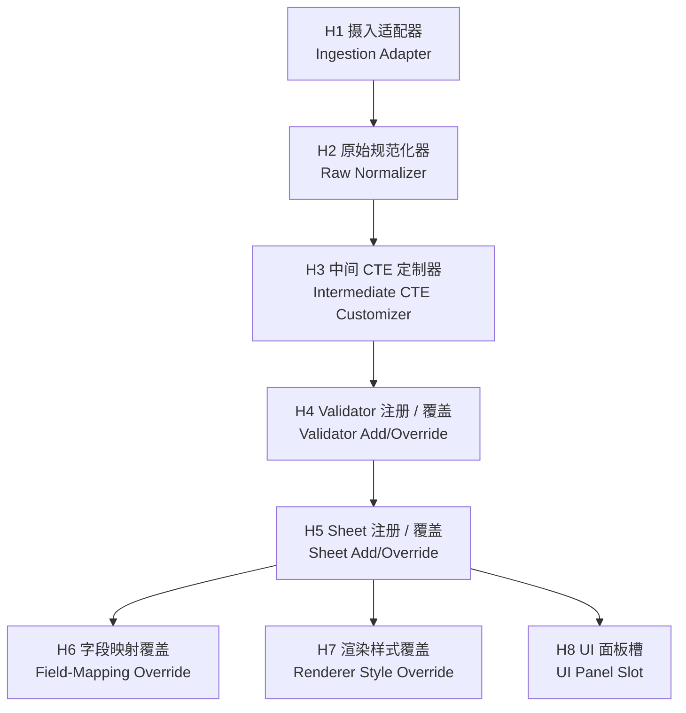
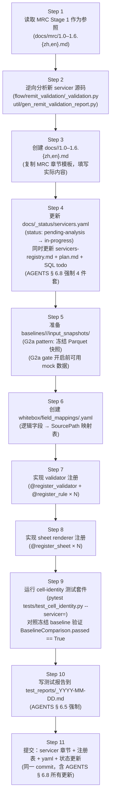
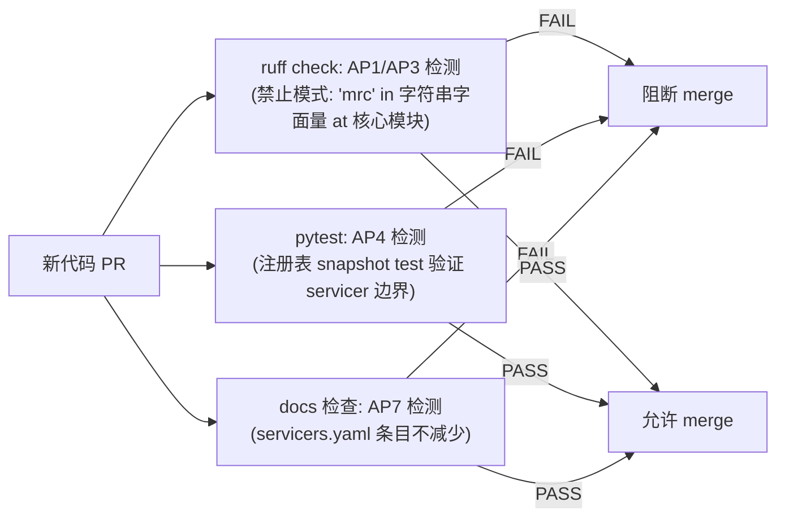

# 5.0 Stage 2 扩展性规格 / Stage 2 Extensibility Spec

> **目的**: 定义如何在 **不修改核心代码** 的情况下接入新 servicer（Arvest、CC5、
> Selene、SLS 及未来任何 servicer）。涵盖 servicer 判别字段的传递路径、每个新
> servicer 必须提供的制品清单、8 个扩展钩子点、兼容性承诺、分步上线工作流、
> 反模式和伪代码示例（以 Arvest 最小可行接入为例）。
>
> **目标读者**: 接入新 servicer 的工程师；Stage 2 系统设计师；审阅 B4 交付物的用户。
>
> **修订历史**
>
> | 日期 | 作者 | 变更 |
> |---|---|---|
> | 2026-05-28 | Copilot CLI agent | v1 — 首版。定义 servicer 判别字段传递链、MUST/NICE-TO-HAVE 制品清单、8 个钩子点、semver 式兼容性承诺、Arvest 伪代码示例。参照 B3 数据模型、B4 注册表规格、B5 UI 架构、`docs/_status/servicers.yaml`、`docs/arvest/_pending.{zh,en}.md`。 |

---

> **3-tier 行为标记（AGENTS § 6.11 强制要求）** — 本文档中的每一个行为断言
> 都携带以下三级标记之一：
>
> | 层级 | 标记 | 含义 |
> |---|---|---|
> | 1 — 已验证 | `[FROM-CODE]` 或 `[CONFIRMED]` | 从源码逆向推导（带行号引用）并经物理 baseline XLSX 实测验证 |
> | 2 — 推断 | `[FROM-CODE]`（无物理验证）或 `[VERIFY]` | 仅从源码逆向推导；未经物理 artefact 核实 |
> | 3 — 新发现 | `[FOUND-DURING-B4]` | B4 构建过程中新发现 |

> **G-gate 依赖** — 本文档为纯设计文档，可在 G2a / G2b / G3 关闭之前撰写。
> 任何 Stage 2 **可接入实现代码**都不得在以下 gate 全部关闭前合并：
>
> | Gate | 描述 | 状态 |
> |---|---|---|
> | G2a | 输入快照冻结 | ⏸ 待操作员执行 |
> | G2b | 物理 baseline XLSX 冻结 | ⏸ 待操作员执行 |
> | G3 | Stage 1 章节走读评审完成 | ⏸ 待用户确认 |

---

## 1. 上线目标

### 1.1 核心承诺

> **接入 Arvest、CC5、Selene、SLS 或任何未来 servicer，不得修改核心引擎代码、
> 核心数据模型或 B5 UI 代码。**

满足以下条件即可完成接入：

1. 为新 servicer 完成 Stage 1 分析（`docs/<servicer>/1.0–1.6`）；
2. 在 B4 注册表（`docs/stage2/4.0-validator-registry.*.md`）中为该 servicer
   注册 validator、sheet、field-mapping 和 rule 条目；
3. 更新 `docs/_status/servicers.yaml`（AGENTS § 6.8 强制要求）。

### 1.2 目前等待分析的 servicer

| servicer_id | 显示名 | 状态 | 估计 sheets | 占位文档 |
|---|---|---|---|---|
| `arvest` | Arvest | ⏳ pending-analysis | 4（assumed） | `docs/arvest/_pending.{zh,en}.md` |
| `cc5` | CC5 | ⏳ pending-analysis | 2（assumed） | `docs/cc5/_pending.{zh,en}.md` |
| `selene` | Selene | ⏳ pending-analysis | 5（assumed） | `docs/selene/_pending.{zh,en}.md` |
| `sls` | SLS | ⏳ pending-analysis | 5（assumed） | `docs/sls/_pending.{zh,en}.md` |
| `scattered` | Scattered（跨 servicer validators） | ⏳ pending-analysis | 0 | `docs/scattered/_pending.{zh,en}.md` |

---

## 2. Servicer 判别字段模式

### 2.1 `ServicerId` 的传递链

B3 数据模型（`docs/stage2/3.0-data-model.zh.md` § 2.1）定义了 `ServicerId`
枚举。该字段在各层的传递路径如下：


_图 5.0.2.1 — `ServicerId` 从原始快照到最终比对结果的完整传递链。每个 B3 数据模型都持有该字段；引擎与 UI 通过该字段而非硬编码字符串完成派发。节点 ID 为图内展示用交叉引用，非源码标识符。_

**说明（按 § 6.10）**

- **业务目的**: 使每一个管线产出（每个 cell、每个 diff、每个 render job）都携带
  可追溯的 servicer 身份，从而支持多 servicer 并发运行与混合比对。
- **执行流**: `ServicerId` 在数据摄入时（`RawTableSnapshot` 构造）写入，此后原样
  向下传递，引擎与注册表通过它完成 **0 个 if/elif** 的派发。
- **关键约束**: **任何层面均禁止硬编码 `"MRC"` 字符串**（B3 § 1.1 `[VERIFY]`）；
  新 servicer 只需在 `ServicerId` 枚举中新增一个值，无需其他核心变更。

### 2.2 `ServicerId` 的正式枚举值

以下为截至 B4 确定的枚举值（非 MRC 值从 `[VERIFY]` 升级为 `[CONFIRMED]` 需完成对应 Stage 1 分析）：

| 枚举值 | 字符串值 | 认识论状态 |
|---|---|---|
| `ServicerId.MRC` | `"MRC"` | `[FROM-CODE]` ch 1.1 § 5.1 |
| `ServicerId.ARVEST` | `"ARVEST"` | `[VERIFY]` 待 Stage 1 分析确认 |
| `ServicerId.CC5` | `"CC5"` | `[VERIFY]` 待 Stage 1 分析确认 |
| `ServicerId.SELENE` | `"SELENE"` | `[VERIFY]` 待 Stage 1 分析确认 |
| `ServicerId.SLS` | `"SLS"` | `[VERIFY]` 待 Stage 1 分析确认 |
| `ServicerId.SCATTERED` | `"SCATTERED"` | `[VERIFY]` 跨 servicer validator 占位 |

> `[FOUND-DURING-B4]` 2026-05-28：B3 § 2.1 注释"非 MRC servicer 的枚举值在 B4
> extensibility-spec 完成后填写"。以上 5 个非 MRC 枚举值为 B4 占位，需在对应
> servicer Stage 1 分析完成后升级为 `[CONFIRMED]`。

---

## 3. 每个新 servicer 必须提供的制品（MUST）

### 3.1 制品清单

| # | 制品 | 描述 | 对应现有模式 |
|---|---|---|---|
| A1 | `docs/<servicer>/1.0-toc.{zh,en}.md` | 章节地图与范围声明 | MRC `docs/mrc/1.0-toc.*` |
| A2 | `docs/<servicer>/1.1-rawdata.{zh,en}.md` | 上游表 + 时间锚 + 快照规划 | MRC `docs/mrc/1.1-rawdata.*` |
| A3 | `docs/<servicer>/1.2-dataflow.{zh,en}.md` | 端到端执行流水线 | MRC `docs/mrc/1.2-dataflow.*` |
| A4 | `docs/<servicer>/1.3-sheets.{zh,en}.md` | openpyxl 渲染契约（sheet 顺序、列、高亮） | MRC `docs/mrc/1.3-sheets.*` |
| A5 | `docs/<servicer>/1.4-fields.{zh,en}.md` | 字段级血缘 + 业务含义 | MRC `docs/mrc/1.4-fields.*` |
| A6 | `docs/<servicer>/1.5-rules.{zh,en}.md` | 规则目录（HIGHLIGHT / SUPPRESSED / …） | MRC `docs/mrc/1.5-rules.*` |
| A7 | `docs/<servicer>/1.6-baseline.{zh,en}.md` | baseline XLSX 行为（V1–V12 检查清单） | MRC `docs/mrc/1.6-baseline.*` |
| A8 | `baselines/<servicer>/<date>/input_snapshots/` | G2a 模式：冻结 Parquet 快照 | `baselines/mrc/2026-04-30/` |
| A9 | `whitebox/field_mappings/<servicer>.yaml` | 逻辑字段 → 物理来源映射（`FieldMappingRegistry` 种子） | 无现有文件，B4 新增 |
| A10 | Validator 注册 `@register_validator(servicer=<id>, id=<vid>)` | 在 B4 `ValidatorRegistry` 中注册所有 validators | MRC seed（4.0-validator-registry § 5.1） |
| A11 | Sheet renderer 注册 `@register_sheet(servicer=<id>, id=<sid>)` | 在 B4 `SheetRegistry` 中注册所有 sheets | MRC seed（4.0-validator-registry § 5.3） |
| A12 | `docs/_status/servicers.yaml` 更新 | `status: pending-analysis → in-progress`；清除 `placeholder_doc` | AGENTS § 6.8 强制 |

> **注意**: A8（冻结快照）依赖 G2a gate；在此之前所有代码可先用 mock 数据对接。

### 3.2 可选制品（NICE-TO-HAVE）

| # | 制品 | 描述 |
|---|---|---|
| B1 | 变更影响测试 | 当 servicer 的 Stage 1 章节更新时，自动检测哪些 diff 列受影响 |
| B2 | 血缘图 | `docs/<servicer>/lineage.{zh,en}.md`（模仿 `docs/lineage.*`） |
| B3 | 自定义 UI 面板 | 在 B5 UI 的 F4 Validator Trace 面板中加入 servicer 特定解释 |
| B4 | Schema-level 断言 | 检查新 servicer 的 Parquet 列列表是否与 `SnapshotManifest` 声明一致 |
| B5 | CI baseline 比对 | 在 CI 中运行 `BaselineComparison`（B3 § 2.10），自动检测回归 |

---

## 4. 扩展钩子点

以下 8 个钩子是系统的全部扩展接缝（extension seam）。接入新 servicer 应从中选取必要的钩子实现，不得直接修改核心代码。



_图 5.0.4 — 8 个扩展钩子点的逻辑拓扑。H1–H4 位于数据管线，H5–H8 位于渲染与 UI 层。箭头表示典型的数据流方向，非强制依赖顺序。_

### H1 — 摄入适配器（Ingestion Adapter）

**接口**: `fn(servicer: ServicerId, remit_date: date) -> list[RawTableSnapshot]`

**作用**: 根据 `(servicer, remit_date)` 定位并加载 Parquet 快照，构造
`RawTableSnapshot`（B3 § 2.2）列表。

**MRC 现有实现**: 扫描 `snapshots/<date>/raw/mrc/` 目录，每个 `.parquet` 文件
构造一个 `RawTableSnapshot`；`SnapshotManifest`（B3 § 2.3）提供元数据。

**新 servicer 需提供**: 实现同一接口；只需修改文件路径模式（或 Redshift schema
前缀），无需触碰核心引擎。

### H2 — 原始规范化器（Raw Normalizer）

**接口**: `fn(snapshots: list[RawTableSnapshot]) -> RemitFrame`

**作用**: 把多张 `RawTableSnapshot` 合并为单一 servicer-specific `RemitFrame`
（B3 § 3.2 的 `RemitFrame` 协议）。

**MRC 现有实现**: 构造 `MrcRemitFrame`（B3 § 2.4），集中推导 4 个时间锚点。

**新 servicer 需提供**: 实现 `RemitFrame` 协议（含 `servicer`、`remit_date`、
`source_snapshots`）；时间锚点逻辑可以不同，但接口形状必须相同。

### H3 — 中间 CTE 定制器（Intermediate CTE Customizer）

**接口**: 可选——若新 servicer 不需要 CTE 追踪，可以省略。

**作用**: 在 SQL join 执行后、Python stamp 之前捕获 CTE 层 DataFrame，填充
`MrcIntermediateCTEs` 或等价类型（B3 § 2.5），供 UI 钻取使用。

**新 servicer 需提供**: 若 servicer 有类似 MRC 的多表 join，建议实现；若
validator 用内联 SQL（如 MRC V1/V5），可直接填 `None`。

### H4 — Validator 注册 / 覆盖（Validator Add/Override）

**接口**: `@register_validator(servicer=<id>, id=<vid>)`（见 B4 § 3）

**作用**: 把 `(servicer_id, validator_id) → fn` 写入 `ValidatorRegistry`。

**覆盖**: 用 `override=True` 替换现有 MRC validator 而不修改 MRC 模块本身
（适用于 downstream 扩展、A/B 测试）。

### H5 — Sheet 注册 / 覆盖（Sheet Add/Override）

**接口**: `@register_sheet(servicer=<id>, id=<sid>)`（见 B4 § 3）

**作用**: 把 `(servicer_id, sheet_id) → fn` 写入 `SheetRegistry`。

**覆盖**: 下游用户可为 MRC 注册额外的 sheet（如调试用宽表），不影响现有 5 个 sheets。

### H6 — 字段映射覆盖（Field-Mapping Override）

**接口**: `@register_field_mapping(servicer=<id>, field=<logical_field>)`

**作用**: 把 `(servicer_id, logical_field) → SourcePath` 写入
`FieldMappingRegistry`，为 B5 UI F1 钻取面板提供血缘数据。

**注**: 若新 servicer 复用 MRC 字段名（如 `servicefee_diff`），可注册新的 `SourcePath`
指向不同的上游表，而不影响 MRC 条目。

### H7 — 渲染样式覆盖（Renderer Style Override）

**接口**: 在 `XlsxRenderJob`（B3 § 2.9）构造时注入 servicer-specific 覆盖值。

**作用**: 允许新 servicer 使用不同的高亮颜色、列宽、字体，而不改变 MRC 默认值。

**MRC 当前值**: `header_fill_normal_rgb = "bccde9"`、`diff_fill_rgb = "ffc7ce"`、
`diff_font_color_rgb = "df5006"`（ch 1.6 § 4.1–§ 4.2 `[FROM-CODE]`）。

### H8 — UI 面板槽（UI Panel Slot）

**接口**: `[PROPOSED]` 在 B5 UI F4 Validator Trace 面板中预留 servicer-specific
子面板槽（B5 § 8 servicer-agnostic rendering `[PROPOSED]`）。

**作用**: 允许新 servicer 在钻取面板中显示自定义内容（如 Arvest 特有的字段注释）。

> `[VERIFY]` H8 的具体接口设计待 B5 实现阶段确定（ES-OQ-1）。

---

## 5. 兼容性承诺

下表以 semver 风格描述每个钩子的稳定性承诺：

| 钩子 | 稳定等级 | 说明 |
|---|---|---|
| H1 Ingestion Adapter | `STABLE` | 接口形状在 Stage 2 生命周期内不破坏性变更 |
| H2 Raw Normalizer | `STABLE` | `RemitFrame` 协议最小字段集（`servicer`、`remit_date`、`source_snapshots`）稳定；可向前扩展 |
| H3 CTE Customizer | `BETA` | 接口可能在 G3 评审后调整；现有 MRC 实现向前兼容 |
| H4 Validator Registry | `STABLE` | `(servicer_id, validator_id)` → fn 签名稳定；`ValidatorContext`/`ValidatorResult`（B3）变更会递增 major 版本 |
| H5 Sheet Registry | `STABLE` | `(servicer_id, sheet_id)` → fn 签名稳定；`SheetPayload`（B3）变更会递增 major 版本 |
| H6 Field-Mapping Registry | `BETA` | `SourcePath` 格式可能演变为结构化类型（VR-OQ-4） |
| H7 Renderer Style Override | `STABLE` | `XlsxRenderJob` 字段稳定（B3 § 2.9 `[FROM-CODE+VERIFY]`）；物理 baseline 确认后升 `STABLE` |
| H8 UI Panel Slot | `EXPERIMENTAL` | 接口待 B5 实现时确定；不保证向后兼容 |

> **版本递增触发条件**: B3 数据模型（`docs/stage2/3.0-data-model.*.md`）中任何
> 模型字段的删除或类型变化均触发 major 版本递增，并须在 `decisions.md` 留记录。

---

## 6. 上线工作流（分步）

以下为接入一个新 servicer 的完整步骤序列（以 Arvest 为例）：



_图 5.0.6 — 新 servicer 上线的 11 步工作流。S1–S3 为分析阶段，S4 为状态更新（AGENTS § 6.8 强制），S5–S8 为实现阶段，S9–S11 为验证与提交阶段。_

**逐步说明：**

1. **S1**: 阅读 MRC Stage 1 章节（`docs/mrc/1.0–1.6`），理解分析深度和文档结构。
2. **S2**: 逆向分析新 servicer 源码，记录 validators、sheets、字段、规则（方法与 MRC ch 1.1–1.6 相同）。
3. **S3**: 创建 `docs/<servicer>/1.0–1.6.{zh,en}.md`，沿用 MRC 章节模板，填写 servicer 实际内容。
4. **S4**: **同一 commit** 更新 AGENTS § 6.8 强制的 4 件制品（`servicers.yaml`、`servicers-registry.md`、`plan.md`、SQL todo 状态）。
5. **S5**: 准备冻结 Parquet 快照到 `baselines/<servicer>/<date>/input_snapshots/`；G2a gate 未开启前可用 mock fixture。
6. **S6**: 创建 `whitebox/field_mappings/<servicer>.yaml`，列出所有逻辑字段到 `SourcePath` 的映射。
7. **S7**: 实现 `@register_validator(servicer=<id>, id=<vid>)` × N 和 `@register_rule(servicer=<id>, rule_id=<rid>)` × M。
8. **S8**: 实现 `@register_sheet(servicer=<id>, id=<sid>)` × N，每个 sheet renderer 接受 `ValidatorResult`（B3 § 2.7），返回 `SheetPayload`（B3 § 2.8）。
9. **S9**: 运行 cell-identity 测试套件，对照冻结 baseline 验证 `BaselineComparison.passed == True`（B3 § 2.10）。
10. **S10**: 写测试报告（AGENTS § 6.5 § 6.6），所有 P0 通过后才允许 todo `done`。
11. **S11**: 提交所有变更到同一 commit，包含 AGENTS § 6.8 四件套更新。

---

## 7. 反模式（Anti-patterns）

以下模式被明确 **禁止**，违反任何一条都会使扩展性设计失效：

| # | 反模式 | 危害 | 正确做法 |
|---|---|---|---|
| AP1 | 在核心引擎代码中 `if servicer == "MRC":` | 每加一个 servicer 就要改核心 | 通过 `ValidatorRegistry[(servicer_id, vid)]` 派发 |
| AP2 | 在 UI 代码中硬编码 `["MRC_General_Check", …]` sheet 列表 | UI 与 servicer 强耦合 | 通过 `SheetRegistry.keys_for_servicer(servicer_id)` 枚举 |
| AP3 | 直接 `import mrc_validation` 在非 MRC servicer 模块中 | 造成隐式依赖；MRC 变更会破坏 Arvest | 各 servicer 模块独立；公共逻辑放 `whitebox/shared/` |
| AP4 | 修改 MRC validator 函数以添加 Arvest 分支 | "一个函数管多个 servicer" 反模式；测试不可区分 | 为 Arvest 创建独立 validator 函数并注册 |
| AP5 | 在 `SnapshotManifest` 外部重新推导时间锚点 | 血缘断裂；`ValidatorResult` 无法回溯到原始快照 | 时间锚点只在 `RemitFrame` 构造时推导一次（B3 § 1.5） |
| AP6 | 把 servicer-specific 字段名写死在 `BaselineComparison` 对比逻辑中 | 新 servicer 无法复用比对引擎 | 字段名通过 `SheetPayload.column_names`（B3 § 2.8）动态获取 |
| AP7 | 删除 `docs/_status/servicers.yaml` 中的 pending servicer 条目 | 违反 AGENTS § 6.8 "禁止静默删除 servicer" | 改为 🔒 frozen 状态，附理由 |
| AP8 | 跳过 Stage 1 分析直接写 validator 代码 | validator 逻辑无文档支撑；回归无法解释 | 必须先完成 A1–A7 制品（§ 3.1） |

---

## 8. 反模式检测图



_图 5.0.8 — 三条自动化护栏检测常见反模式，在 CI 中阻断不合规的 PR 合并。_

---

## 9. 参考示例：Arvest 最小可行接入（伪代码）

以下伪代码展示了 Arvest 以最小可行方式接入 Stage 2 所需的每个步骤，不涉及任何 Arvest 具体业务逻辑（这些逻辑待 Stage 1 分析后填写）。

### 9.1 Step 1 — 在 `ServicerId` 中添加枚举值（已有占位 `[VERIFY]`）

```python
# whitebox/models.py（或独立 service_ids.py）
class ServicerId(str, Enum):
    MRC    = "MRC"      # [FROM-CODE]
    ARVEST = "ARVEST"   # [VERIFY] — 待 Stage 1 确认正式 servicer id 字符串
    # ... CC5 / SELENE / SLS
```

### 9.2 Step 2 — 实现 `ArvestRemitFrame`（满足 `RemitFrame` 协议）

```python
# whitebox/validators/arvest/frame.py
@dataclass(frozen=True)
class ArvestRemitFrame:
    """[VERIFY] 字段待 Arvest Stage 1 逆向后填写。"""
    servicer:         ServicerId        # = ServicerId.ARVEST
    remit_date:       date
    source_snapshots: tuple[RawTableSnapshot, ...]
    # ... Arvest 特有 DataFrame 字段（待分析）
```

### 9.3 Step 3 — 注册 validator（最小可行：1 个 validator）

```python
# whitebox/validators/arvest/validators.py
@register_validator(servicer="ARVEST", id="arvest_check_placeholder")
def arvest_placeholder_impl(ctx: ValidatorContext) -> ValidatorResult:
    """[VERIFY] 占位实现——Arvest Stage 1 完成后替换为真实逻辑。"""
    raise NotImplementedError(
        "Arvest validator not yet implemented — see docs/arvest/_pending.md"
    )
```

### 9.4 Step 4 — 注册 sheet（最小可行：1 个 sheet）

```python
# whitebox/sheets/arvest/sheet_placeholder.py
@register_sheet(servicer="ARVEST", id="ARVEST_Placeholder")
def arvest_placeholder_renderer(result: ValidatorResult) -> SheetPayload:
    """[VERIFY] 占位渲染——Arvest Stage 1 完成后替换。"""
    raise NotImplementedError(
        "Arvest sheet renderer not yet implemented — see docs/arvest/_pending.md"
    )
```

### 9.5 Step 5 — 更新 `servicers.yaml`

```yaml
# docs/_status/servicers.yaml（仅展示变更行）
- id: arvest
  display_name: Arvest
  status: in-progress        # [VERIFY] → in-progress（Stage 1 完成后）
  placeholder_doc: null      # 清除占位文档引用
```

> `[FOUND-DURING-B4]` 2026-05-28：Arvest Stage 1 分析尚未开始；以上步骤为接入
> 框架的 **前瞻性伪代码**，仅展示接口形状。Arvest 实际 validator 数量、sheet 数量、
> 字段名均待 `flow/remit_validation/arvest_validation.py` 逆向后确认。

---

## 10. 开放问题 / `[VERIFY]`

| ID | 标记 | 问题 | 所属 gate |
|---|---|---|---|
| ES-OQ-1 | `[VERIFY]` | H8 UI 面板槽的具体接口形状待 B5 实现时确定；需明确 servicer-specific 子面板如何挂载到 B5 F4 Validator Trace 面板（B5 § 8）。 | B5 |
| ES-OQ-2 | `[VERIFY]` | Arvest / CC5 / Selene / SLS 的正式 `servicer` 字符串值（在 `port.portmonth.servicer` 列中的实际值）需从源码 `flow/remit_validation/<servicer>_validation.py` 确认，才能最终确定 `ServicerId` 枚举值。 | Stage 1 各 servicer |
| ES-OQ-3 | `[VERIFY]` | `scattered` servicer（~8 个跨 servicer validators）是否应当注册为独立 `ServicerId.SCATTERED`，还是为每个涉及的 servicer 注册覆盖条目？ | Stage 1 scattered |
| ES-OQ-4 | `[VERIFY]` | `ArvestRemitFrame` 的时间锚点逻辑（`get_fctrdt` 等）是否与 MRC 相同？若不同，`RemitFrame` 协议是否需要加 `time_anchors` 抽象字段？ | Stage 1 arvest |
| ES-OQ-5 | `[VERIFY]` | Stage 2 第一阶段（P2.0）是否支持多 servicer 同时运行（例如 `(MRC, 2026-04-30)` 与 `(ARVEST, 2026-04-30)` 同时跑）？还是 P2.0 只跑 MRC？影响引擎并发设计。 | B6 |
