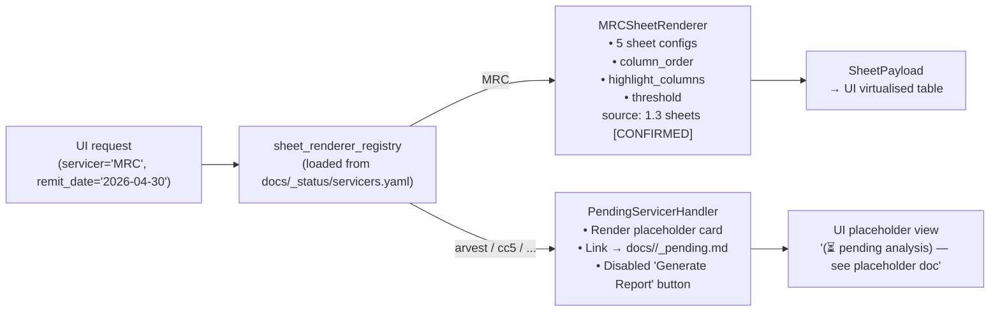

# 6.0 Stage 2 UI Architecture

> **Purpose**: Defines the complete information architecture, wireframes, 8-feature interaction specifications, tech-stack trade-off matrix, drill-down trace contract, and registry-driven servicer-agnostic rendering design for the Stage 2 interactive validation-report UI. This document is the deliverable of `stage2-mrc-ui-design` and the design input for `stage2-mrc-ui-impl`.
>
> **Intended audience**: Stage 2 UI implementation engineers; the user reviewing this design; Stage 2 API / engine engineers (must honour the drill-down contract); engineers onboarding new servicers.
>
> **Revision history**
>
> | Date | Author | Change |
> |---|---|---|
> | 2026-05-17 | Copilot CLI agent | v1 — First edition. 8 interactive features derived from prompt 19 / decisions.md entry 2026-05-17. Tech stack not yet locked (see § 6 trade-off matrix; awaiting user Q2 answer). |

---

> **MRC chapter index** (`docs/mrc/`) — full index in [`docs/mrc/_chapter-index.md`](../mrc/_chapter-index.md)
>
> | # | Title | File | Responsibility |
> |---|---|---|---|
> | 1.0 | TOC & Scope | `1.0-toc.en.md` | Entry point & contract |
> | 1.3 | Sheet Rendering Layer | `1.3-sheets.en.md` | openpyxl rendering contract |
> | 1.5 | Validation Rules | `1.5-rules.en.md` | Rule catalogue |
> | 1.6 | Baseline XLSX Behavior | `1.6-baseline.en.md` | Baseline ground truth |
> | **6.0** | **Stage 2 UI Architecture** | **this file** | **UI architecture design** |

---

## ⚠️ Banners

### 3-tier behavior markers (AGENTS.md § 6.11)

Every design assertion in this document carries exactly one of the following tier tags:

| Tag | Meaning |
|---|---|
| `[CONFIRMED]` | Corroborated by Stage 1 source code **and** physical baseline XLSX; Stage 2 implementation must honour this |
| `[VERIFY]` | Reverse-engineered from source code only; must be confirmed once the physical baseline is produced (G2b/G3) |
| `[PROPOSED]` | Design recommendation proposed by this document; not yet locked; may be adjusted during implementation |

### Gate dependencies

```
G2a  — mrc-snapshot (export Redshift inputs to local Parquet/CSV)   ⏸ pending
G2b  — mrc-source-baseline (run legacy code → produce baseline XLSX) ⏸ pending
G3   — stage1-mrc-baseline-verify (upgrade V1–V12 to [CONFIRMED])    ⏸ pending
```

> **This design layer (B5) is NOT blocked by G2/G3** — it can proceed immediately.
> However, the **implementation layer** (`stage2-mrc-ui-impl`) is blocked by G2 + G3 + `stage2-mrc-extensibility-spec`.

### Tech-stack deferred

> ⚠️ **Tech stack not locked.** User question **Q2** in `plan.md` § 5 — *"Do you want the UI to stay in a pure Python ecosystem, or are you open to a JS frontend?"* — has not yet been answered.
> § 6 provides a trade-off matrix with three candidates and a conditional default recommendation. Final choice depends on Q2.

---

## 1. Goals & Non-goals

### Goals

1. **Render the 5 MRC validation-report sheets**, with every cell corresponding exactly to `baselines/mrc/2026-04-30/validation_report.xlsx` (cell-identity contract — `[CONFIRMED]`, see 1.6 Baseline XLSX Behavior (../mrc/1.6-baseline.en.md)).
2. **Surface all 8 interactive features** (§ 5) so that both business and technical users can understand the computation origin of every row and every cell.
3. **Servicer-agnostic**: registry-driven rendering so that adding a new servicer requires only a configuration entry — no UI-code changes.
4. **End the black box**: every highlighted cell and every diff cell is traceable to a validator rule and an upstream raw-data row.
5. Export a cell-identical XLSX (format-identical to the legacy system output).

### Non-goals

- **No UI code or scaffolding** (`npm init`, `pip install streamlit`, etc.) — this document is design-only.
- **No tech-stack lock-in** (awaiting Q2).
- **No changes to Stage 1 docs** (`docs/mrc/`) or `tools/`.
- **No pending-servicer implementation** — only placeholder entries in the UI.
- No pixel-level UI design (wireframes use ASCII art / mermaid only).

---

## 2. Information Architecture

### 2.1 Navigation tree

```
PrefectFlow Whitebox (root)
└─ Validation Report
   ├─ Servicer selector (dropdown; MRC active; others show "⏳ pending" — disabled)
   └─ Remit Cycle selector (e.g. 2026-04-30)
      └─ Report Overview (5 Tabs)
         ├─ Tab: MRC_Summary_check
         ├─ Tab: MRC_General_Check
         ├─ Tab: MRC_Advance_Check
         ├─ Tab: MRC_ServiceFee_Check
         └─ Tab: MRC_Adv_Info
            └─ Sheet table (row × column)
               └─ Cell click → Drill-down Panel
                  ├─ Raw data lineage (raw_row_refs[])
                  ├─ Computation chain (computed_values{})
                  ├─ Validator trace panel (rule_explanation, validator_id)
                  └─ Baseline diff panel (vs baseline cell)
```

### 2.2 Core entity hierarchy

| Level | Entity | Source chapter |
|---|---|---|
| Servicer | MRC / Carrington / … (registry) | `docs/_status/servicers-registry.en.md` |
| Remit cycle | `remit_date = 2026-04-30` | 1.1 rawdata `[CONFIRMED]` |
| Sheet | 5 MRC sheets | 1.3 sheets `[CONFIRMED]` |
| Row | DataFrame row, natural key `loan_number` or `(loan_number, remit_date)` `[VERIFY]` | 1.4 fields |
| Cell | `(sheet_id, row_id, col_id)` triple; highlight flag from `diff_cell_format` | 1.3 sheets `[CONFIRMED]` |
| Drill-down | `CellTrace` JSON (§ 7); references B3 `ValidatorResult` / `SheetPayload` | B3 `stage2-mrc-data-model` (forward ref) |

---

## 3. Wireframes

### 3.1 Main Report View

```
╔═══════════════════════════════════════════════════════════════════════╗
║  PrefectFlow Whitebox — Validation Report                             ║
║                                                                       ║
║  Servicer: [▼ MRC ──────────────]  Remit Date: [▼ 2026-04-30 ──]    ║
║  [Generate Report]  [Export XLSX]  [Show Diff vs Baseline]           ║
╠═══════════════════════════════════════════════════════════════════════╣
║  [Summary] [General_Check] [Advance_Check] [ServiceFee_Check][Adv_Info]║
╠═══════════════════════════════════════════════════════════════════════╣
║  🔍 Filter/Search: [________________]  [ ] Highlighted rows only      ║
╠══════════════╦═══════════════╦══════════════╦════════════════════════╣
║ loan_number  ║ remit_amt     ║ prior_amt    ║ diff_amt        [HL]  ║
╠══════════════╬═══════════════╬══════════════╬════════════════════════╣
║ 1001         ║ 50,000.00     ║ 49,500.00    ║ ████ 500.00     [●]  ║  ← highlighted cell
║ 1002         ║ 32,000.00     ║ 32,000.00    ║       0.00           ║
║ 1003         ║ 18,000.00     ║ 0.00         ║ ████18,000.00   [●]  ║
╚══════════════╩═══════════════╩══════════════╩════════════════════════╝
  Legend: [HL] = highlight-column marker  [●] = clickable drill-down entry
```

_Figure 6.0.3.1 — Main report view wireframe: servicer picker + remit-date picker + 5-tab sheet view + filter bar + highlighted-cell click entry._

**Notes**:
- Highlighted column headers use `ffc7ce` background + `df5006` orange font (source: 1.3 sheets `[CONFIRMED]` § 4.3).
- Highlighted data cells are only coloured when `abs(value) > 0` (threshold hard-coded to `0`, source: 1.5 rules `[CONFIRMED]` § 3.1).
- `[●]` is the cell click hot-zone (triggers F1 Cell Drill-down, see § 5).

### 3.2 Cell Drill-down Panel

```
╔══════════════════════════════════════════════════════╗
║  ✕  Cell Trace — MRC_Advance_Check · loan 1001       ║
║     Column: diff_adv_bal  Value: 500.00  [HIGHLIGHT] ║
╠══════════════════════════════════════════════════════╣
║  📋 Raw Data Lineage                                  ║
║  ┌──────────────────────────────────────────────────┐ ║
║  │ mrc.portmrcremitloanlevelrecap (row 1001)        │ ║
║  │   adv_balance_cur  = 50,000.00                   │ ║
║  │   adv_balance_prev = 49,500.00                   │ ║
║  │ port.portmonth (row 2026-04-30)                  │ ║
║  │   fctrdt = 2026-03-20                            │ ║
║  └──────────────────────────────────────────────────┘ ║
╠══════════════════════════════════════════════════════╣
║  🔗 Computation Chain                                 ║
║  diff_adv_bal = adv_balance_cur - adv_balance_prev   ║
║               = 50,000.00 - 49,500.00 = 500.00       ║
╠══════════════════════════════════════════════════════╣
║  📌 Validator Trace  (see § 3.3)   [Open Full Trace] ║
║  Rule: abs(diff_adv_bal) > 0 → HIGHLIGHT             ║
╠══════════════════════════════════════════════════════╣
║  📊 Baseline Diff   (see § 3.4)    [Open Full Diff]  ║
║  Baseline: 500.00  │  Current: 500.00  │  Delta: 0   ║
╚══════════════════════════════════════════════════════╝
```

_Figure 6.0.3.2 — Cell drill-down panel: 4 sub-modules (raw lineage / computation chain / validator trace entry / baseline diff summary)._

### 3.3 Validator Trace Panel

```
╔══════════════════════════════════════════════════════╗
║  Validator Trace — mrc_check_adv_balance (V3)        ║
╠══════════════════════════════════════════════════════╣
║  Triggered: mrc_validation.py:39-54                   ║
║  SQL template: mrc_adv_validation                     ║
║    servicer_validation_with_portdaily.py:LINE         ║
║  Produces sheet: MRC_Advance_Check                    ║
║  Highlight columns: [diff_adv_bal, diff_adv_cur, …]  ║
║                                                       ║
║  📜 Rule Details                                      ║
║  ┌──────────────────────────────────────────────────┐ ║
║  │ R1  NULL guard: case when adv_bal IS NULL        │ ║
║  │     → diff = NULL → [SUPPRESSED] never highlight │ ║
║  │ R2  Non-zero diff: abs(diff_adv_bal) > 0         │ ║
║  │     → [HIGHLIGHT] ffc7ce bg / df5006 font        │ ║
║  │ R3  Validator exception: try/except → return None│ ║
║  │     → [MISSING-SHEET] entire sheet absent        │ ║
║  └──────────────────────────────────────────────────┘ ║
║  [Copy Trace JSON]  [View Raw SQL]                    ║
╚══════════════════════════════════════════════════════╝
```

_Figure 6.0.3.3 — Validator trace panel: shows which rule fired, source location, SQL template, and rule classification (HIGHLIGHT / SUPPRESSED / MISSING-SHEET from 1.5 rules `[CONFIRMED]` § 2.2)._

### 3.4 Baseline Diff View

```
╔════════════════════════════════════════════════════════════════════╗
║  Side-by-Side Diff — MRC_Advance_Check  vs  Baseline 2026-04-30   ║
╠═══════════════════════╦════════════════════════════════════════════╣
║  📦 Current (new sys)  ║  📂 Baseline (legacy frozen XLSX)         ║
╠═══════════╦═══════════╬═══════════════╦════════════════════════════╣
║ loan_num  ║ diff_adv  ║ loan_num      ║ diff_adv                  ║
╠═══════════╬═══════════╬═══════════════╬════════════════════════════╣
║ 1001      ║ 500.00 ✅ ║ 1001          ║ 500.00                    ║
║ 1002      ║ 0.00   ✅ ║ 1002          ║ 0.00                      ║
║ 1003      ║ ⚠️ 18k ❌ ║ 1003          ║ 0.00  ← baseline          ║
╚═══════════╩═══════════╩═══════════════╩════════════════════════════╝
  ✅ = cell-identical  ❌ = delta detected (click to view cell trace)
  Δ summary: 3 rows, 1 delta, 0 missing rows, 0 missing columns
```

_Figure 6.0.3.4 — Baseline diff view: new system on the left, legacy baseline on the right, ✅/❌ cell-identity markers, Δ summary, ❌ cells clickable for drill-down._

### 3.5 Filter / Search Bar

```
╔══════════════════════════════════════════════════════════════╗
║  🔍 Search: [loan_number / column name / value ...]          ║
║  [ ] Highlighted rows only  [ ] Diff rows only               ║
║  [ ] Rows with NULLs  [Reset]                                ║
║  Column visibility: [✅ Select all] [☐ loan_number] [✅ diff] ║
╚══════════════════════════════════════════════════════════════╝
```

_Figure 6.0.3.5 — Filter / search bar: text search + highlight-row filter + diff-row filter + NULL-row filter + column visibility controls._

---

## 4. Interaction Model — 8 Features

### Feature summary table

| ID | Feature | Trigger | UI affordance | Data source | Expected latency |
|---|---|---|---|---|---|
| F1 | Cell drill-down (raw data lineage) | Click any cell | Side panel slide-out | B3 `CellTrace` JSON (§ 7) | < 200 ms |
| F2 | Date / Servicer picker | Dropdown selection | Report reload | `servicers.yaml` + API enumerate | < 1 s |
| F3 | Per-sheet logic viewer | Tab switch | 5 tabs | B3 `SheetPayload` | < 100 ms (local render) |
| F4 | Validator trace panel | F1 → "Open Full Trace" | Modal or secondary panel | B3 `ValidatorTrace` | < 200 ms |
| F5 | Pass / Fail explanations | Hover highlighted cell | Tooltip / row expand | 1.5 rules catalogue → B3 `RuleExplanation` | < 100 ms |
| F6 | Data lineage view | F1 drill-down sub-module | Inline tree / table | B3 `raw_row_refs[]` + `computed_values{}` | < 200 ms |
| F7 | XLSX export | Click "Export XLSX" | Download trigger | B3 render engine → cell-identical XLSX | < 5 s |
| F8 | Baseline diff view | Click "Show Diff vs Baseline" | Full-page side-by-side or Tab | B3 `BaselineDiff` + `baselines/mrc/` | < 2 s |

---

### F1 — Cell Drill-down (Raw Data Lineage)

**Trigger**: user clicks any cell in the report table (row × column intersection).

**UI affordance**:
- Hover: cell shows `cursor: pointer` + light-blue focus border.
- Click: slide-out panel ~40% of the viewport from the right (see § 3.2 wireframe).
- Panel contains 4 sub-modules: raw lineage, computation chain, validator trace entry, baseline diff summary.

**Data source**:
- API call `GET /api/v1/cell-trace/{sheet_id}/{row_id}/{col_id}`.
- Response: `CellTrace` JSON (see § 7 for full contract); references B3 `stage2-mrc-data-model` `ValidatorResult` and `SheetPayload`.

**Expected latency**: < 200 ms (data pre-aggregated in B3 staging layer).

---

### F2 — Date / Servicer Picker

**Trigger**: top-bar dropdown; initial default `(MRC, 2026-04-30)`.

**UI affordance**:
- Servicer dropdown: MRC (active); all other 6 servicers show "⏳ pending analysis" suffix + disabled + link to `docs/<servicer>/_pending.md` (`[CONFIRMED]`, source: plan v9.1 placeholder reservation policy and AGENTS.md § 6.8).
- Remit-date dropdown: lists all frozen `(servicer, remit_date)` combinations (from registry API `GET /api/v1/servicers`).
- Selection triggers `GET /api/v1/report/{servicer}/{remit_date}` and re-renders the full report view.

**Data source**: `docs/_status/servicers.yaml` (registry) → B3 API.

**Expected latency**: < 1 s (full report fetch + render).

---

### F3 — Per-sheet Logic Viewer

**Trigger**: click a tab (Summary / General_Check / Advance_Check / ServiceFee_Check / Adv_Info).

**UI affordance**:
- 5 horizontal tabs (matching the 5 MRC sheets `[CONFIRMED]`, source: 1.3 sheets § 4.4).
- Tab label shows a highlight-row count badge (e.g. "Advance_Check (2)").
- Tab body = virtualized table; column order exactly matches the baseline XLSX column order (`[CONFIRMED]`, source: 1.3 sheets § 5).
- Column headers carry a tooltip showing the field definition (reference: 1.4 fields).

**Data source**: B3 `SheetPayload.rows`; column order driven by B3 `sheet_renderer_registry[servicer][sheet_id].column_order` (§ 8 servicer-agnostic rendering).

**Expected latency**: < 100 ms (data already loaded; pure client-side tab switch).

---

### F4 — Validator Trace Panel

**Trigger**: "Open Full Trace" button inside the F1 drill-down panel, or a "Validator Details" toolbar button on the main view.

**UI affordance**:
- Modal or full-height side panel (see § 3.3 wireframe).
- Shows: validator name + source location + SQL template name + sheet list + rule classification (HIGHLIGHT / SUPPRESSED / MISSING-SHEET / NO-HIGHLIGHT / INFO / OPEN-POLICY `[CONFIRMED]`, source: 1.5 rules § 2.2).
- Each rule entry expands to show the SQL fragment and raw `case-when` logic.
- "Copy Trace JSON" button (developer convenience).

**Data source**: B3 `ValidatorTrace` (containing `validator_id`, `rule_id`, `rule_explanation`, `sql_fragment`).

**Expected latency**: < 200 ms.

---

### F5 — Pass / Fail Explanations

**Trigger**: hover over a highlighted cell (tooltip) or click row-expand icon (row-level summary).

**UI affordance**:
- Tooltip (hover): one-sentence explanation (e.g. "diff_adv_bal = 500.00, exceeds threshold 0 — HIGHLIGHT triggered").
- Row expand (click row-start icon): shows all rule statuses for that row (HIGHLIGHT / SUPPRESSED / NO-HIGHLIGHT).
- Status colour coding: HIGHLIGHT = pink `ffc7ce`; SUPPRESSED = grey; INFO = none (source: 1.5 rules § 2.2 `[CONFIRMED]`).

**Data source**: B3 `RuleExplanation` (derived from `CellTrace.rule_explanation`).

**Expected latency**: < 100 ms (tooltip rendered locally; data pre-loaded alongside F3 sheet payload).

---

### F6 — Data Lineage View

**Trigger**: expand the "Raw Data Lineage" sub-module inside F1 drill-down panel; or a standalone "Lineage" tab.

**UI affordance**:
- Inline table or tree view listing `raw_row_refs[]` (each ref: `table`, `row_key`, `column`, `value`).
- Computation chain (`computed_values{}`) displayed as a formula: `diff_adv_bal = adv_balance_cur (50000) - adv_balance_prev (49500) = 500`.
- Collapsible tree (for multi-table join scenarios showing multiple upstream rows).

**Data source**: B3 `CellTrace.raw_row_refs[]` + `CellTrace.computed_values{}`; upstream tables from 1.1 rawdata `[CONFIRMED]`.

**Expected latency**: < 200 ms (returned in the same API call as F1).

---

### F7 — XLSX Export

**Trigger**: click the "Export XLSX" button in the top bar; option to export "current sheet" or "all 5 sheets".

**UI affordance**:
- Click enters loading state (progress bar or spinner).
- On completion, triggers a browser file download (`validation_report_MRC_2026-04-30.xlsx`).
- Export options: sheet scope, whether to include highlight styles (default: all styles preserved, cell-identical `[CONFIRMED]`, source: 1.6 baseline § 2.1).

**Data source**: B3 XLSX rendering engine (`stage2-mrc-xlsx-renderer`); must reproduce openpyxl number_format / header style / highlight exactly as the baseline.

**Expected latency**: < 5 s (5 sheets × hundreds of rows; server-side render then stream download).

---

### F8 — Baseline Diff View (Side-by-side Comparison)

**Trigger**: click "Show Diff vs Baseline" in the top bar; or "Open Full Diff" in the F1 drill-down panel.

**UI affordance**:
- Full-page side-by-side view (see § 3.4 wireframe): left = new-system output; right = baseline XLSX.
- Each cell marked ✅ (match) or ❌ (delta).
- Top Δ summary: total rows, delta cells, missing rows, missing columns.
- ❌ cells are clickable to trigger F1 cell trace.
- Filter bar: "show delta rows only" / "show delta cells only".

**Data source**: B3 `BaselineDiff` (runtime output of `stage2-mrc-cell-identity-harness`); `baselines/mrc/2026-04-30/validation_report.xlsx` (source: 1.6 baseline `[CONFIRMED]`).

**Expected latency**: < 2 s (diff pre-computed and cached; first generation up to 30 s, incremental refresh thereafter).

---

## 5. Filter / Search Bar Specification

| Control | Behaviour |
|---|---|
| Text search box | Substring match against `loan_number`, column names, and cell values; debounced 300 ms |
| "Highlighted rows only" checkbox | Filter: show only rows containing at least 1 HIGHLIGHT cell |
| "Diff rows only" checkbox | Requires F8 diff to be generated; shows only rows with at least 1 ❌ cell |
| "Rows with NULLs" checkbox | Filter: rows containing NULL / NaN cells (aids debugging SUPPRESSED rules) |
| Column visibility | Multi-select checkbox to show/hide columns; order locked (no drag-reorder — preserves baseline column order consistency) `[PROPOSED]` |
| Reset | Clears all filter conditions |

---

## 6. Tech-stack Trade-offs

> ⚠️ **This section does not make a final decision.** Three candidates are presented in parallel. The recommendation is conditional on user Q2 ("Do you want the UI to stay in a pure Python ecosystem, or are you open to a JS frontend?" — `plan.md` § 5).

### 6.1 Candidate comparison

| Dimension | Streamlit | FastAPI + HTMX | Next.js + FastAPI |
|---|---|---|---|
| **Development speed** | ⭐⭐⭐⭐⭐ Fastest | ⭐⭐⭐ Moderate | ⭐⭐ Slower (needs JS team) |
| **Customizability** | ⭐⭐ Limited (fixed component library) | ⭐⭐⭐⭐ Good | ⭐⭐⭐⭐⭐ Full control |
| **Python-stack alignment** | ⭐⭐⭐⭐⭐ Native | ⭐⭐⭐⭐⭐ Native | ⭐⭐ Requires JS/TS maintenance |
| **Deployability** | ⭐⭐⭐⭐ Streamlit Cloud / Docker | ⭐⭐⭐⭐ Any WSGI/ASGI | ⭐⭐⭐ Requires Node runtime |
| **Drill-down responsiveness** | ⭐⭐⭐ Workable but limited UX | ⭐⭐⭐⭐ HTMX partial-swap smooth | ⭐⭐⭐⭐⭐ Full SPA experience |
| **Large-table virtualisation** | ⭐⭐ `st.dataframe` constrained | ⭐⭐⭐ Manual implementation | ⭐⭐⭐⭐⭐ AG-Grid / TanStack |
| **Whitebox-transparency UI** | ⭐⭐⭐ Acceptable | ⭐⭐⭐⭐ Structurally clean | ⭐⭐⭐⭐⭐ Most flexible |
| **Learning cost (pure-Python team)** | Very low | Low | High |

### 6.2 Conditional recommendation

```
If Q2 answer = "pure Python ecosystem"  ──→  Recommend Streamlit
  Rationale: fastest to build; F1–F8 all achievable; MRC 5-sheet
             data volume is within st.dataframe limits; easy to
             migrate to FastAPI+HTMX later if more customisation needed.

If Q2 answer = "open to a JS frontend"  ──→  Recommend FastAPI + HTMX (default)
  Rationale: 100% Python backend aligns with existing ecosystem;
             HTMX partial-swap delivers F1 drill-down panel without
             a full SPA framework; deployable on any standard Python
             web server.

If Q2 answer = "need full SPA experience / enterprise UI"
             ──→  Consider Next.js + FastAPI
  Rationale: best large-table virtualisation + complex drill-down
             panel animations; but introduces JS/TS maintenance overhead.
```

> `[PROPOSED]` **Default recommendation: FastAPI + HTMX**, conditional on Q2 not requiring a pure-Python desktop tool and no enterprise-SPA mandate.

---

## 7. Drill-down Trace Contract

### 7.1 `CellTrace` JSON shape

> This contract is the interface between the UI (B5) and the API/engine (B3 `stage2-mrc-data-model` + `stage2-mrc-api`). `ValidatorResult` and `SheetPayload` field definitions belong to B3; this document defines only the view-model fields required by the UI.

```json
{
  "sheet_id":        "MRC_Advance_Check",
  "row_id":          "1001",
  "col_id":          "diff_adv_bal",
  "highlight_status": "HIGHLIGHT",
  "cell_value":       500.00,

  "validator_id":    "mrc_check_adv_balance",
  "validator_source": "mrc_validation.py:39-54",
  "sql_template":    "mrc_adv_validation",

  "raw_row_refs": [
    {
      "table":   "mrc.portmrcremitloanlevelrecap",
      "row_key": {"loan_number": 1001, "remit_date": "2026-04-30"},
      "columns": {
        "adv_balance_cur":  50000.00,
        "adv_balance_prev": 49500.00
      }
    },
    {
      "table":   "port.portmonth",
      "row_key": {"remit_date": "2026-04-30"},
      "columns": { "fctrdt": "2026-03-20" }
    }
  ],

  "computed_values": {
    "diff_adv_bal": "adv_balance_cur (50000.00) - adv_balance_prev (49500.00) = 500.00"
  },

  "rule_explanation": {
    "rule_id":      "R2",
    "label":        "HIGHLIGHT",
    "trigger":      "abs(diff_adv_bal) > 0",
    "threshold":    0,
    "fired":        true,
    "suppressed_by": null,
    "source":       "gen_remit_validation_report.py:1764-1798"
  },

  "baseline_diff": {
    "baseline_value": 500.00,
    "current_value":  500.00,
    "delta":          0,
    "match":          true
  }
}
```

### 7.2 Field reference

| Field | Type | Source | Notes |
|---|---|---|---|
| `sheet_id` | `str` | 1.3 sheets `[CONFIRMED]` | One of the 5 MRC sheet names |
| `row_id` | `str` | 1.4 fields `[VERIFY]` | Natural key (`loan_number` or loan+date compound) |
| `col_id` | `str` | 1.3 sheets `[CONFIRMED]` | Column name; matches helper column list |
| `highlight_status` | `HIGHLIGHT \| SUPPRESSED \| NO-HIGHLIGHT \| INFO \| MISSING-SHEET \| OPEN-POLICY` | 1.5 rules `[CONFIRMED]` § 2.2 | |
| `validator_id` | `str` | 1.0 toc `[CONFIRMED]` | One of the 5 MRC validators |
| `raw_row_refs[]` | array | 1.1 rawdata `[CONFIRMED]` | Snapshot of upstream table rows |
| `computed_values{}` | dict | B3 `stage2-mrc-data-model` | Computation step strings for rendering |
| `rule_explanation` | object | 1.5 rules `[CONFIRMED]` | Rule trigger detail |
| `baseline_diff` | object | 1.6 baseline `[VERIFY]` | Cell-level comparison against baseline XLSX |

### 7.3 Alignment with B3

| B3 entity | Mapped `CellTrace` field |
|---|---|
| `ValidatorResult.sheet_name` | → `sheet_id` |
| `ValidatorResult.row_key` | → `row_id` |
| `ValidatorResult.column` | → `col_id` |
| `ValidatorResult.highlight_columns[]` | → `highlight_status` |
| `SheetPayload.column_order` | → drives F3 table column order |
| `SheetPayload.rows[].raw_refs` | → `raw_row_refs[]` |

> `[VERIFY]` B3 `stage2-mrc-data-model` is not yet complete. The field names above are forward design contracts; during implementation, defer to B3's final schema.

---

## 8. Servicer-agnostic Rendering

### 8.1 Registry resolution flow



_Figure 6.0.8.1 — Registry resolving servicer → sheet renderer. MRC routes to the fully-implemented `MRCSheetRenderer`; pending servicers route to `PendingServicerHandler` which renders a placeholder card._

**Notes**:
- `sheet_renderer_registry` is loaded at startup from `docs/_status/servicers.yaml` (9 servicer entries).
- `status: in-progress` or `done` → routes to a concrete `ServicerSheetRenderer` implementation.
- `status: pending-analysis` → routes to `PendingServicerHandler` (source: AGENTS.md § 6.8 placeholder reservation rule `[CONFIRMED]`).

### 8.2 What a new servicer must provide

When a new servicer (e.g. Arvest) completes Stage 1 analysis, onboarding into the UI requires only:

| Step | Deliverable |
|---|---|
| 1. Complete Stage 1 chapters | `docs/<servicer>/` with toc / rawdata / dataflow / sheets / fields / rules / baseline |
| 2. Update registry | `docs/_status/servicers.yaml`: `status` from `pending-analysis` → `in-progress` |
| 3. Implement `ServicerSheetRenderer` | Provide: `sheet_configs` (sheet names, column list, highlight columns, threshold) + `get_cell_trace(sheet_id, row_id, col_id)` |
| 4. Register in `sheet_renderer_registry` | Single-line registration |
| 5. Update all 4 registry artefacts | Per AGENTS.md § 6.8: servicers-registry.md + plan.md matrix + SQL todo + registry tool |

The UI code itself **requires no changes** — all servicer-specific logic is encapsulated in the `ServicerSheetRenderer` implementation.

---

## 9. Accessibility & i18n

### 9.1 Bilingual support (zh / en)

- UI text served from i18n resource files (`ui/i18n/zh.json` / `ui/i18n/en.json`).
- Language toggle button in the top bar (🌐 中文 / English).
- All API `rule_explanation.label` fields support a `lang` query parameter.
- `[PROPOSED]` Default language follows the browser `Accept-Language` header.

### 9.2 Screen-reader accessibility

- Every highlighted cell includes an `aria-label`, e.g.: `aria-label="diff_adv_bal: 500.00 [HIGHLIGHT — abs(diff) > 0]"`.
- Drill-down panel trigger button includes `aria-expanded` + `aria-controls`.
- Table uses semantic `<th scope="col">` header elements.
- Tab component uses `role="tablist"` / `role="tab"` / `role="tabpanel"` ARIA roles.

### 9.3 Color-blind-safe highlighting palette

> ⚠️ **Key constraint**: 1.3 sheets `[CONFIRMED]` § 4.3 specifies the exact XLSX export colours (`ffc7ce` + `df5006`). The palette below applies **to the web UI only** and does not affect the XLSX export format.

| Use case | XLSX colour (unchanged) | Web UI substitute (color-blind safe) | WCAG contrast |
|---|---|---|---|
| Highlight cell background | `#ffc7ce` (pink) | `#f4a261` (orange; Deuteranopia-safe) | ≥ 3:1 `[PROPOSED]` |
| Highlight cell font | `#df5006` (orange) | `#1d3557` (dark blue) | ≥ 4.5:1 `[PROPOSED]` |
| Header background | `#bccde9` (blue) | `#bccde9` (same; acceptable) | ≥ 3:1 `[VERIFY]` |
| ✅ Diff match | — | `#2dc653` (green) | ≥ 3:1 |
| ❌ Diff delta | — | `#e63946` (red) + icon | ≥ 4.5:1 |

- Highlight state uses **colour + icon dual channel** to ensure colour-blind users can still distinguish HIGHLIGHT cells: every highlighted cell also renders a `⚠` icon.
- `[PROPOSED]` Exact colour values should be validated with Deuteranopia / Protanopia simulation during implementation.

---

## 10. Open Questions / [VERIFY] Markers

| ID | Tag | Question | Owning gate |
|---|---|---|---|
| OQ-1 | `[VERIFY]` | F3 per-sheet view: must row order match the baseline exactly? (1.6 § 5.2 `[VERIFY]` not yet resolved) | G3 |
| OQ-2 | `[PROPOSED]` | Q2 tech-stack answer? (Streamlit vs FastAPI+HTMX vs Next.js) | — (user Q2) |
| OQ-3 | `[VERIFY]` | F7 XLSX export: do freeze panes exist in the baseline? (1.6 § 9 `[VERIFY]`) | G3 |
| OQ-4 | `[VERIFY]` | F1 drill-down: `row_id` natural key — single `loan_number` or compound `loan_number + remit_date`? (1.4 fields § 5 `[VERIFY]`) | G3 |
| OQ-5 | `[PROPOSED]` | F8 diff: add a column-level summary (% of highlighted columns with deltas)? | — |
| OQ-6 | `[PROPOSED]` | Session persistence — save last selected servicer / remit_date / filter state? | Q2 |
| OQ-7 | `[VERIFY]` | `mrc_other_check` (V5 → `MRC_Adv_Info`): does `_mrc_adv_info_sql` produce the same `raw_row_refs` structure as the other 4 sheets? | G2 |
| OQ-8 | `[PROPOSED]` | Server-side pre-compute `CellTrace` for all cells vs on-demand computation on click? Impacts F1 latency and storage cost. | B3 |

---

> **Inter-chapter dependencies**
>
> | This document section | Depends on |
> |---|---|
> | § 5 F1, F6 (drill-down / lineage) | B3 `stage2-mrc-data-model` `ValidatorResult` + `SheetPayload` |
> | § 7 drill-down contract | B3 API endpoint implementation (`stage2-mrc-api`) |
> | § 8 registry | `docs/_status/servicers.yaml` + AGENTS.md § 6.8 |
> | § 3.4, F8 baseline diff | `baselines/mrc/2026-04-30/` (G2b) + `stage2-mrc-cell-identity-harness` |
> | F7 XLSX export | `stage2-mrc-xlsx-renderer` |
