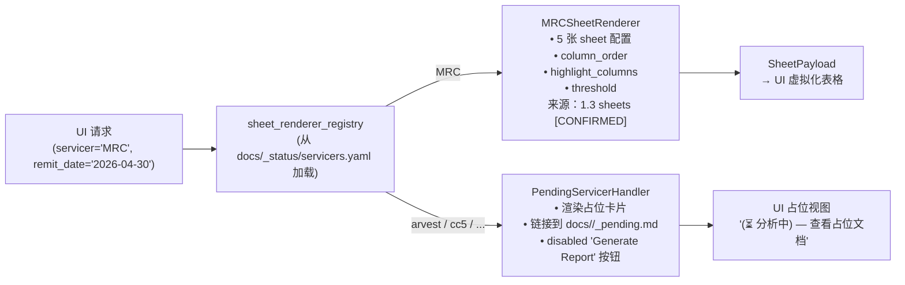

# 6.0 Stage 2 UI 架构 / Stage 2 UI Architecture

> **目的 / Purpose**：为 Stage 2 交互式验证报告界面定义完整的信息架构、线框图、8 个交互特性规格、技术选型权衡矩阵、钻取接口契约，以及 registry 驱动的 servicer 无关渲染方案。本文是 `stage2-mrc-ui-design` 的交付物，也是 `stage2-mrc-ui-impl` 的设计输入。
>
> **受众 / Intended audience**：Stage 2 UI 实现工程师；接受本设计评审的用户；Stage 2 API / 引擎工程师（需遵循钻取契约）；新 servicer 接入工程师。
>
> **修订历史 / Revision history**
>
> | 日期 | 作者 | 变更 |
> |---|---|---|
> | 2026-05-17 | Copilot CLI agent | v1 — 首版。8 个交互特性来自 prompt 19 / decisions.md 2026-05-17 条目。技术选型尚未锁定（见 § 6 权衡矩阵，等待用户 Q2 回答）。 |

---

> **MRC 章节索引** （`docs/mrc/`）—— 完整定义见 [`docs/mrc/_chapter-index.md`](../mrc/_chapter-index.md)
>
> | # | 标题 | 文件 | 职责 |
> |---|---|---|---|
> | 1.0 | TOC & Scope / 章节地图与范围 | `1.0-toc.zh.md` | 入口与契约 |
> | 1.3 | Sheet Rendering Layer / Sheet 渲染层 | `1.3-sheets.zh.md` | openpyxl 渲染契约 |
> | 1.5 | Validation Rules / 验证规则 | `1.5-rules.zh.md` | 规则目录 |
> | 1.6 | Baseline XLSX Behavior / Baseline XLSX 行为 | `1.6-baseline.zh.md` | baseline 真值 |
> | **6.0** | **Stage 2 UI Architecture** | **本文** | **UI 架构设计** |

---

## ⚠️ 横幅 / Banners

### 行为层级标记（AGENTS.md § 6.11 三级标记）

本文所有设计断言均携带以下其中一个标记：

| 标记 | 含义 |
|---|---|
| `[CONFIRMED]` | 已由 Stage 1 源码 + 物理 baseline 双重印证；Stage 2 实现必须遵循 |
| `[VERIFY]` | 仅由 Stage 1 源码反推；物理 baseline 落地后需回填确认 |
| `[PROPOSED]` | 本文提出的设计建议；未经用户锁定；可在实现阶段调整 |

### G-gate 依赖 / Gate dependencies

```
G2a  — mrc-snapshot（Redshift 快照）⏸ 待完成
G2b  — mrc-source-baseline（baseline XLSX 生成）⏸ 待完成
G3   — stage1-mrc-baseline-verify（V1–V12 升 [CONFIRMED]）⏸ 待完成
```

> **本文设计层（B5）不被 G2/G3 阻塞**——可立即推进。
> 但 UI **实现层**（`stage2-mrc-ui-impl`）被 G2 + G3 + `stage2-mrc-extensibility-spec` 阻塞。

### 技术选型暂缓 / Tech-stack deferred

> ⚠️ **技术选型未锁定。** `plan.md` § 5 的用户问题 **Q2**（"你希望 UI 是纯 Python 生态，还是可以接受 JS 前端？"）尚未回答。
> § 6 权衡矩阵列出三个候选方案并给出带条件的默认推荐；最终决策依赖 Q2 答案。

---

## 1. 目标与非目标 / Goals & Non-goals

### 目标

1. **呈现 5 张 MRC sheet 的验证报告**，与 `baselines/mrc/2026-04-30/validation_report.xlsx` 的单元格完全对应（`[CONFIRMED]` 契约见 1.6 Baseline XLSX 行为 (../mrc/1.6-baseline.zh.md)）。
2. **支持 8 个交互特性**（见 § 5），使业务人员和技术人员都能理解每一行、每一格的计算来源。
3. **Servicer 无关**：通过 registry 驱动渲染，未来接入新 servicer 只需提供一个配置条目，无需改 UI 代码。
4. **告别黑盒**：每个高亮格、每个 diff 格都可追溯到 validator 规则 + 上游原始数据行。
5. 导出 cell-identical XLSX（与老系统输出格式一致）。

### 非目标

- **不**写任何 UI 代码或脚手架（`npm init`、`pip install streamlit` 等）——本文纯设计。
- **不**锁定技术选型（等待 Q2 答案）。
- **不**修改 Stage 1 文档（`docs/mrc/`）或 `tools/`。
- **不**涉及非 MRC servicer 的实现——仅在 UI 中为 pending servicer 保留占位入口。
- 不承诺像素级 UI 设计（线框图仅用 ASCII art / mermaid）。

---

## 2. 信息架构 / Information Architecture

### 2.1 导航树

```
PrefectFlow Whitebox（根）
└─ 验证报告 / Validation Report
   ├─ Servicer 选择器（下拉，MRC 激活；其他 pending 显示"分析中"）
   └─ Remit Cycle 选择器（如 2026-04-30）
      └─ 报告概览 / Report Overview（5 个 Tab）
         ├─ Tab: MRC_Summary_check
         ├─ Tab: MRC_General_Check
         ├─ Tab: MRC_Advance_Check
         ├─ Tab: MRC_ServiceFee_Check
         └─ Tab: MRC_Adv_Info
            └─ Sheet 表格（行 × 列）
               └─ 单元格点击 → 钻取面板 / Cell Drill-down Panel
                  ├─ 原始数据血缘（raw_row_refs[]）
                  ├─ 计算链（computed_values{}）
                  ├─ Validator 追踪面板（rule_explanation, validator_id）
                  └─ Baseline Diff 面板（vs baseline cell）
```

### 2.2 核心实体层级

| 层级 | 实体 | 来源章节 |
|---|---|---|
| Servicer | MRC / Carrington / ... （registry）| `docs/_status/servicers-registry.zh.md` |
| Remit cycle | `remit_date = 2026-04-30` | 1.1 rawdata `[CONFIRMED]` |
| Sheet | 5 张 MRC sheet | 1.3 sheets `[CONFIRMED]` |
| Row | DataFrame 行，以 `loan_number` 或 `(loan_number, remit_date)` 为自然键 `[VERIFY]` | 1.4 fields |
| Cell | `(sheet_id, row_id, col_id)` 三元组；高亮标记来自 `diff_cell_format` | 1.3 sheets `[CONFIRMED]` |
| Drill-down | `CellTrace` JSON（见 § 7）；引用 B3 data model `ValidatorResult` | B3 `stage2-mrc-data-model`（前向引用）|

---

## 3. 线框图 / Wireframes

### 3.1 主报告视图 / Main Report View

```
╔═══════════════════════════════════════════════════════════════════════╗
║  PrefectFlow Whitebox — Validation Report                             ║
║                                                                       ║
║  Servicer: [▼ MRC ──────────────]  Remit Date: [▼ 2026-04-30 ──]    ║
║  [Generate Report]  [Export XLSX]  [Show Diff vs Baseline]           ║
╠═══════════════════════════════════════════════════════════════════════╣
║  [Summary] [General_Check] [Advance_Check] [ServiceFee_Check][Adv_Info]║
╠═══════════════════════════════════════════════════════════════════════╣
║  🔍 Filter/Search: [________________]  [ ] 仅显示高亮行               ║
╠══════════════╦═══════════════╦══════════════╦════════════════════════╣
║ loan_number  ║ remit_amt     ║ prior_amt    ║ diff_amt        [HL]  ║
╠══════════════╬═══════════════╬══════════════╬════════════════════════╣
║ 1001         ║ 50,000.00     ║ 49,500.00    ║ ████ 500.00     [●]  ║  ← 高亮格（粉底橙字）
║ 1002         ║ 32,000.00     ║ 32,000.00    ║       0.00           ║
║ 1003         ║ 18,000.00     ║ 0.00         ║ ████18,000.00   [●]  ║
╚══════════════╩═══════════════╩══════════════╩════════════════════════╝
  图例：[HL] = 高亮列标记  [●] = 可点击钻取
```

_图 6.0.3.1 — 主报告视图线框图：Servicer 选择器 + Remit Date 选择器 + 5-tab sheet 视图 + filter bar + 高亮格点击入口。_

**说明**：
- 高亮列表头用 `ffc7ce` 底色 + `df5006` 橙字标注（来源：1.3 sheets `[CONFIRMED]` § 4.3）。
- 高亮数据格仅当 `abs(value) > 0` 时着色（threshold 固定为 `0`，来源：1.5 rules `[CONFIRMED]` § 3.1）。
- `[●]` 是单元格点击热区（F1 触发 Cell Drill-down，见 § 5）。

### 3.2 单元格钻取面板 / Cell Drill-down Panel

```
╔══════════════════════════════════════════════════════╗
║  ✕  Cell Trace — MRC_Advance_Check · loan 1001       ║
║     Column: diff_adv_bal  Value: 500.00  [HIGHLIGHT] ║
╠══════════════════════════════════════════════════════╣
║  📋 Raw Data Lineage                                  ║
║  ┌──────────────────────────────────────────────────┐ ║
║  │ mrc.portmrcremitloanlevelrecap (row 1001)        │ ║
║  │   adv_balance_cur  = 50,000.00                   │ ║
║  │   adv_balance_prev = 49,500.00                   │ ║
║  │ port.portmonth (row 2026-04-30)                  │ ║
║  │   fctrdt = 2026-03-20                            │ ║
║  └──────────────────────────────────────────────────┘ ║
╠══════════════════════════════════════════════════════╣
║  🔗 Computation Chain                                 ║
║  diff_adv_bal = adv_balance_cur - adv_balance_prev   ║
║               = 50,000.00 - 49,500.00 = 500.00       ║
╠══════════════════════════════════════════════════════╣
║  📌 Validator Trace  (see § 3.3)   [Open Full Trace] ║
║  Rule: abs(diff_adv_bal) > 0 → HIGHLIGHT             ║
╠══════════════════════════════════════════════════════╣
║  📊 Baseline Diff   (see § 3.4)    [Open Full Diff]  ║
║  Baseline: 500.00  │  Current: 500.00  │  Delta: 0   ║
╚══════════════════════════════════════════════════════╝
```

_图 6.0.3.2 — 单元格钻取面板：4 个子模块（原始血缘 / 计算链 / 验证器追踪 / baseline diff）。_

### 3.3 Validator 追踪面板 / Validator Trace Panel

```
╔══════════════════════════════════════════════════════╗
║  Validator Trace — mrc_check_adv_balance (V3)        ║
╠══════════════════════════════════════════════════════╣
║  触发：mrc_validation.py:39-54                        ║
║  SQL 模板：mrc_adv_validation                         ║
║    servicer_validation_with_portdaily.py:LINE         ║
║  生成 Sheet：MRC_Advance_Check                        ║
║  高亮列：[diff_adv_bal, diff_adv_cur, ...]           ║
║                                                       ║
║  📜 Rule 详情                                         ║
║  ┌──────────────────────────────────────────────────┐ ║
║  │ R1  NULL guard: case when adv_bal IS NULL        │ ║
║  │     → diff = NULL → [SUPPRESSED] 不高亮           │ ║
║  │ R2  diff 非零: abs(diff_adv_bal) > 0             │ ║
║  │     → [HIGHLIGHT] ffc7ce底/df5006字              │ ║
║  │ R3  Validator 异常: try/except → return None     │ ║
║  │     → [MISSING-SHEET] 整张 sheet 消失            │ ║
║  └──────────────────────────────────────────────────┘ ║
║  [复制 Trace JSON]  [查看原始 SQL]                    ║
╚══════════════════════════════════════════════════════╝
```

_图 6.0.3.3 — Validator 追踪面板：显示哪条规则触发、来源、SQL 模板、规则分类（HIGHLIGHT / SUPPRESSED / MISSING-SHEET，来自 1.5 rules `[CONFIRMED]` § 2.2）。_

### 3.4 Baseline Diff 视图 / Baseline Diff View

```
╔════════════════════════════════════════════════════════════════════╗
║  Side-by-Side Diff — MRC_Advance_Check  vs  Baseline 2026-04-30   ║
╠═══════════════════════╦════════════════════════════════════════════╣
║  📦 Current (新系统)   ║  📂 Baseline（原系统 frozen XLSX）         ║
╠═══════════╦═══════════╬═══════════════╦════════════════════════════╣
║ loan_num  ║ diff_adv  ║ loan_num      ║ diff_adv                  ║
╠═══════════╬═══════════╬═══════════════╬════════════════════════════╣
║ 1001      ║ 500.00 ✅ ║ 1001          ║ 500.00                    ║
║ 1002      ║ 0.00   ✅ ║ 1002          ║ 0.00                      ║
║ 1003      ║ ⚠️18k  ❌ ║ 1003          ║ 0.00   ← baseline         ║
╚═══════════╩═══════════╩═══════════════╩════════════════════════════╝
  ✅ = cell-identical  ❌ = delta detected（点击可查看 cell trace）
  Δ 汇总：3 行，1 个 delta，0 个缺失行，0 个缺失列
```

_图 6.0.3.4 — Baseline Diff 视图：左新右旧并排，✅/❌ 标注 cell-identical 状态，Δ 汇总统计，❌ 格可点击钻取。_

### 3.5 Filter / Search Bar

```
╔══════════════════════════════════════════════════════════════╗
║  🔍 Search: [loan_number / column name / value...]           ║
║  [ ] 仅高亮行  [ ] 仅 diff 行  [ ] 仅有 NULL 行  [重置]      ║
║  列可见性：[✅全选]  [☐ loan_number] [✅ remit_amt] [✅ diff] ║
╚══════════════════════════════════════════════════════════════╝
```

_图 6.0.3.5 — Filter / Search Bar：文本搜索 + 高亮行过滤 + diff 行过滤 + NULL 行过滤 + 列可见性控制。_

---

## 4. 交互模型 / Interaction Model（8 个特性）

### 图例 / Legend

| ID | 特性 | trigger | UI affordance | 数据来源 | 预期延迟 |
|---|---|---|---|---|---|
| F1 | 单元格钻取（raw data lineage） | 点击任意格 | 侧面板滑出 | B3 `CellTrace` JSON（§ 7） | < 200 ms |
| F2 | 日期 / Servicer 选择器 | 下拉选择 | 重新加载报告 | `servicers.yaml` + API 枚举端点 | < 1 s |
| F3 | 逐 Sheet 逻辑浏览器 | Tab 切换 | 5 个 Tab | B3 `SheetPayload` | < 100 ms（本地渲染）|
| F4 | Validator 追踪面板 | F1 钻取后点击 "Open Full Trace" | 模态或次级面板 | B3 `ValidatorTrace` | < 200 ms |
| F5 | Pass / Fail 解释 | 行展开 或 高亮格 hover | Tooltip / 展开行 | 1.5 rules 规则目录 → B3 `RuleExplanation` | < 100 ms |
| F6 | 数据血缘视图 | F1 钻取子模块 | 内嵌树/表 | B3 `raw_row_refs[]` + `computed_values{}` | < 200 ms |
| F7 | XLSX 导出 | 点击 "Export XLSX" | 下载触发 | B3 渲染引擎 → cell-identical XLSX | < 5 s |
| F8 | Baseline Diff 视图 | 点击 "Show Diff vs Baseline" | 并排全页面或 Tab | B3 `BaselineDiff` + `baselines/mrc/` | < 2 s |

---

### F1 — 单元格钻取（Cell Drill-down / Raw Data Lineage）

**触发**：用户点击报告表格中任意单元格（行 × 列交叉处）。

**UI affordance**：
- 鼠标 hover 时单元格出现 `cursor: pointer` + 浅蓝高亮边框。
- 点击后从右侧滑出宽约 40% 视口的钻取面板（见 § 3.2 线框图）。
- 面板包含 4 个子模块（原始血缘、计算链、Validator 追踪入口、Baseline diff 摘要）。

**数据来源**：
- API 调用 `GET /api/v1/cell-trace/{sheet_id}/{row_id}/{col_id}`。
- 响应：`CellTrace` JSON（§ 7 完整契约）；引用 B3 `stage2-mrc-data-model` 中的 `ValidatorResult` 与 `SheetPayload`。

**预期延迟**：< 200 ms（数据已预聚合于 B3 staging 层）。

---

### F2 — 日期 / Servicer 选择器（Date & Servicer Picker）

**触发**：页面顶部下拉菜单；初始默认 `(MRC, 2026-04-30)`。

**UI affordance**：
- Servicer 下拉：MRC（激活）；其他 6 servicer 显示"⏳ 分析中"后缀 + disabled + 链接到 `docs/<servicer>/_pending.md`（来源：plan v9.1 placeholder reservation policy `[CONFIRMED]`）。
- Remit date 下拉：列出所有已冻结的 `(servicer, remit_date)` 组合（来自 registry API `GET /api/v1/servicers`）。
- 选择后触发 `GET /api/v1/report/{servicer}/{remit_date}` 重新渲染整个报告视图。

**数据来源**：`docs/_status/servicers.yaml`（registry）→ B3 API。

**预期延迟**：< 1 s（整个报告重新拉取 + 渲染）。

---

### F3 — 逐 Sheet 逻辑浏览器（Per-sheet Logic Viewer）

**触发**：点击 Tab（Summary / General_Check / Advance_Check / ServiceFee_Check / Adv_Info）。

**UI affordance**：
- 5 个水平 Tab（对应 5 张 MRC sheet `[CONFIRMED]` 来源：1.3 sheets § 4.4）。
- Tab 标签上显示高亮行计数徽章（如 "Advance_Check (2)"）。
- Tab 内容 = 虚拟化表格（列顺序与 baseline XLSX column order 精确一致 `[CONFIRMED]` 来源：1.3 sheets § 5）。
- 列标题带 tooltip 显示字段定义（引用 1.4 fields）。

**数据来源**：B3 `SheetPayload.rows`；列顺序由 B3 `sheet_renderer_registry[servicer][sheet_id].column_order` 驱动（§ 8 servicer-agnostic 渲染）。

**预期延迟**：< 100 ms（数据已加载；纯前端 Tab 切换）。

---

### F4 — Validator 追踪面板（Validator Trace Panel）

**触发**：在 F1 钻取面板中点击"Open Full Trace"，或点击报告顶部"Validator Details"工具栏按钮。

**UI affordance**：
- 模态或全高侧边面板（见 § 3.3 线框图）。
- 显示：validator 名称 + 源码位置 + SQL 模板名 + sheet 列表 + 规则分类（HIGHLIGHT / SUPPRESSED / MISSING-SHEET / NO-HIGHLIGHT / INFO / OPEN-POLICY `[CONFIRMED]` 来源：1.5 rules § 2.2）。
- 每条规则展开显示 SQL 片段 + 原始 `case-when` 逻辑。
- "复制 Trace JSON" 按钮（F2E 开发者友好）。

**数据来源**：B3 `ValidatorTrace`（包含 `validator_id`, `rule_id`, `rule_explanation`, `sql_fragment`）。

**预期延迟**：< 200 ms。

---

### F5 — Pass / Fail 解释（Pass/Fail Explanations）

**触发**：hover 高亮格出现 tooltip；或展开高亮行查看规则摘要。

**UI affordance**：
- Tooltip（hover）：一句话解释（如"diff_adv_bal = 500.00，超出阈值 0，触发 HIGHLIGHT"）。
- 展开行（点击行首展开图标）：显示该行涉及的所有规则状态（HIGHLIGHT / SUPPRESSED / NO-HIGHLIGHT）。
- 状态颜色码：HIGHLIGHT = 粉 `ffc7ce`；SUPPRESSED = 灰；INFO = 无色（来源：1.5 rules § 2.2 `[CONFIRMED]`）。

**数据来源**：B3 `RuleExplanation`（从 `CellTrace.rule_explanation` 派生）。

**预期延迟**：< 100 ms（tooltip 本地渲染，数据随 F3 sheet payload 一起预加载）。

---

### F6 — 数据血缘视图（Data Lineage View）

**触发**：F1 钻取面板中的"Raw Data Lineage"子模块展开；或独立"Lineage"标签页。

**UI affordance**：
- 内嵌表或树形视图：列出 `raw_row_refs[]`（每个 ref 含 `table`, `row_key`, `column`, `value`）。
- 计算链（`computed_values{}`）以公式形式展示：`diff_adv_bal = adv_balance_cur (50000) - adv_balance_prev (49500) = 500`。
- 可折叠树（对多表 join 场景展示多个 upstream 数据行）。

**数据来源**：B3 `CellTrace.raw_row_refs[]` + `CellTrace.computed_values{}`；上游表来自 1.1 rawdata `[CONFIRMED]`。

**预期延迟**：< 200 ms（随 F1 同一 API 调用返回）。

---

### F7 — XLSX 导出（Export）

**触发**：点击顶栏"Export XLSX"按钮；可选择"当前 sheet"或"全部 5 sheets"。

**UI affordance**：
- 点击后进入 loading 态（progress bar 或 spinner）。
- 完成后触发浏览器文件下载（`validation_report_MRC_2026-04-30.xlsx`）。
- 导出选项：sheet 范围、是否包含高亮样式（默认：全部保留，cell-identical `[CONFIRMED]` 来源：1.6 baseline § 2.1）。

**数据来源**：B3 XLSX 渲染引擎（`stage2-mrc-xlsx-renderer`）；确保 openpyxl number_format / header style / highlight 与 baseline 完全一致。

**预期延迟**：< 5 s（5 sheet × 数百行；服务端渲染后 stream 下载）。

---

### F8 — Baseline Diff 视图（Baseline Diff / Side-by-side Comparison）

**触发**：点击顶栏"Show Diff vs Baseline"按钮；或在 F1 钻取面板中点击"Open Full Diff"。

**UI affordance**：
- 并排全页视图（见 § 3.4 线框图）：左 = 新系统输出；右 = baseline XLSX。
- 每格 ✅（一致）或 ❌（delta）标记。
- 顶部 Δ 汇总：总行数、delta 格数、缺失行数、缺失列数。
- ❌ 格可点击触发 F1 cell trace。
- 过滤条：仅显示 delta 行 / 仅显示 delta 格。

**数据来源**：B3 `BaselineDiff`（`stage2-mrc-cell-identity-harness` 的运行时输出）；`baselines/mrc/2026-04-30/validation_report.xlsx`（来源：1.6 baseline `[CONFIRMED]`）。

**预期延迟**：< 2 s（diff 预计算后缓存；首次生成最多 30 s，之后增量刷新）。

---

## 5. Filter / Search Bar 规格

| 控件 | 行为 |
|---|---|
| 文本搜索框 | 对 `loan_number`、列名、单元格值做 substring 匹配；debounced 300 ms |
| "仅高亮行" 复选框 | 过滤：仅显示含至少 1 个 HIGHLIGHT 格的行 |
| "仅 diff 行" 复选框 | 需 F8 diff 已生成；过滤：仅显示至少 1 个 ❌ 格的行 |
| "仅有 NULL 行" 复选框 | 过滤：含 NULL / NaN 格的行（帮助排查 SUPPRESSED 规则）|
| 列可见性 | 多选 checkbox 控制哪些列显示；顺序锁定（不允许拖动重排，以保证与 baseline 列顺序一致）`[PROPOSED]` |
| 重置 | 清空所有过滤条件 |

---

## 6. 技术选型权衡 / Tech-stack Trade-offs

> ⚠️ **本节不做最终决策。** 三个方案并列展示；推荐方案带明确条件。最终选择依赖用户回答 Q2（"`plan.md` § 5: 你希望 UI 是纯 Python 生态，还是可以接受 JS 前端？"）。

### 6.1 候选方案

| 维度 | Streamlit | FastAPI + HTMX | Next.js + FastAPI |
|---|---|---|---|
| **开发速度** | ⭐⭐⭐⭐⭐ 最快 | ⭐⭐⭐ 中等 | ⭐⭐ 较慢（需 JS 团队）|
| **可定制性** | ⭐⭐ 有限（组件库固定）| ⭐⭐⭐⭐ 较高 | ⭐⭐⭐⭐⭐ 最高 |
| **Python 生态对齐** | ⭐⭐⭐⭐⭐ 原生 | ⭐⭐⭐⭐⭐ 原生 | ⭐⭐ 需 JS/TS 维护 |
| **可部署性** | ⭐⭐⭐⭐ Streamlit Cloud / Docker | ⭐⭐⭐⭐ 任意 WSGI/ASGI | ⭐⭐⭐ 需 Node 运行时 |
| **钻取面板响应速度** | ⭐⭐⭐ 可做但体验有限 | ⭐⭐⭐⭐ HTMX partial swap 流畅 | ⭐⭐⭐⭐⭐ 完整 SPA 体验 |
| **大表虚拟化** | ⭐⭐ st.dataframe 受限 | ⭐⭐⭐ 需手工实现 | ⭐⭐⭐⭐⭐ AG-Grid / TanStack |
| **白盒透明度 UI** | ⭐⭐⭐ 可接受 | ⭐⭐⭐⭐ 结构清晰 | ⭐⭐⭐⭐⭐ 最灵活 |
| **团队学习成本（纯 Python 背景）** | 极低 | 低 | 高 |

### 6.2 条件推荐 / Conditional Recommendation

```
如果 Q2 答案 = "纯 Python 生态" ──→  推荐 Streamlit
  理由：开发最快；F1–F8 均可实现；MRC 5 sheet 数据量在 st.dataframe 可接受范围内；
        后期如需更高定制，可无缝迁移 FastAPI + HTMX。

如果 Q2 答案 = "可以接受 JS 前端" ──→  推荐 FastAPI + HTMX（默认）
  理由：Python 后端 100% 对齐现有生态；HTMX partial swap 实现 F1 钻取面板
        无需完整 SPA 框架；可部署在任意标准 Python web server。

如果 Q2 答案 = "需要完整 SPA 体验 / 企业级 UI" ──→  考虑 Next.js + FastAPI
  理由：大表虚拟化 + 复杂钻取面板动效最佳；但引入 JS/TS 维护成本。
```

> `[PROPOSED]` 默认推荐 **FastAPI + HTMX**，条件：Q2 答案不强制纯 Python 桌面工具，且无企业级 SPA 要求。

---

## 7. 钻取追踪契约 / Drill-down Trace Contract

### 7.1 `CellTrace` JSON 形状

> 本契约是 UI（B5）与 API/引擎（B3 `stage2-mrc-data-model` + `stage2-mrc-api`）的界面。`ValidatorResult` 与 `SheetPayload` 字段定义归属 B3，本文仅定义 UI 所需的视图模型。

```json
{
  "sheet_id":        "MRC_Advance_Check",
  "row_id":          "1001",
  "col_id":          "diff_adv_bal",
  "highlight_status": "HIGHLIGHT",
  "cell_value":       500.00,

  "validator_id":    "mrc_check_adv_balance",
  "validator_source": "mrc_validation.py:39-54",
  "sql_template":    "mrc_adv_validation",

  "raw_row_refs": [
    {
      "table":   "mrc.portmrcremitloanlevelrecap",
      "row_key": {"loan_number": 1001, "remit_date": "2026-04-30"},
      "columns": {
        "adv_balance_cur":  50000.00,
        "adv_balance_prev": 49500.00
      }
    },
    {
      "table":   "port.portmonth",
      "row_key": {"remit_date": "2026-04-30"},
      "columns": { "fctrdt": "2026-03-20" }
    }
  ],

  "computed_values": {
    "diff_adv_bal": "adv_balance_cur (50000.00) - adv_balance_prev (49500.00) = 500.00"
  },

  "rule_explanation": {
    "rule_id":      "R2",
    "label":        "HIGHLIGHT",
    "trigger":      "abs(diff_adv_bal) > 0",
    "threshold":    0,
    "fired":        true,
    "suppressed_by": null,
    "source":       "gen_remit_validation_report.py:1764-1798"
  },

  "baseline_diff": {
    "baseline_value": 500.00,
    "current_value":  500.00,
    "delta":          0,
    "match":          true
  }
}
```

### 7.2 字段说明

| 字段 | 类型 | 来源 | 说明 |
|---|---|---|---|
| `sheet_id` | `str` | 1.3 sheets `[CONFIRMED]` | 5 个 MRC sheet 名之一 |
| `row_id` | `str` | 1.4 fields `[VERIFY]` | 自然键（`loan_number` 或 loan+date 组合） |
| `col_id` | `str` | 1.3 sheets `[CONFIRMED]` | 列名，与 helper 列清单一致 |
| `highlight_status` | `HIGHLIGHT \| SUPPRESSED \| NO-HIGHLIGHT \| INFO \| MISSING-SHEET \| OPEN-POLICY` | 1.5 rules `[CONFIRMED]` § 2.2 | |
| `validator_id` | `str` | 1.0 toc `[CONFIRMED]` | 5 个 MRC validator 之一 |
| `raw_row_refs[]` | array | 1.1 rawdata `[CONFIRM]` | 每个上游表的源行快照 |
| `computed_values{}` | dict | B3 `stage2-mrc-data-model` | 计算步骤字符串（用于渲染）|
| `rule_explanation` | object | 1.5 rules `[CONFIRMED]` | 规则触发详情 |
| `baseline_diff` | object | 1.6 baseline `[VERIFY]` | 与 baseline XLSX 的 cell-level 对比 |

### 7.3 与 B3 的对齐

| B3 实体 | 对应 `CellTrace` 字段 |
|---|---|
| `ValidatorResult.sheet_name` | → `sheet_id` |
| `ValidatorResult.row_key` | → `row_id` |
| `ValidatorResult.column` | → `col_id` |
| `ValidatorResult.highlight_columns[]` | → `highlight_status` |
| `SheetPayload.column_order` | → 驱动 F3 表格列顺序 |
| `SheetPayload.rows[].raw_refs` | → `raw_row_refs[]` |

> `[VERIFY]` B3 `stage2-mrc-data-model` 尚未完成；以上字段名为前向设计契约，实现时以 B3 最终 schema 为准。

---

## 8. Servicer 无关渲染 / Servicer-agnostic Rendering

### 8.1 Registry 解析流程



_图 6.0.8.1 — Registry 解析 servicer → sheet renderer 的路由流程。MRC 路由至实现完备的 `MRCSheetRenderer`；pending servicer 路由至 `PendingServicerHandler` 显示占位视图。_

**说明**：
- `sheet_renderer_registry` 在启动时从 `docs/_status/servicers.yaml` 加载（9 个 servicer 条目）。
- `status: in-progress` 或 `done` → 路由至具体 `ServicerSheetRenderer` 实现。
- `status: pending-analysis` → 路由至 `PendingServicerHandler`（来源：AGENTS.md § 6.8 placeholder reservation rule `[CONFIRMED]`）。

### 8.2 新 Servicer 接入要求

当新 servicer（如 Arvest）完成 Stage 1 分析后，接入 UI 只需：

| 步骤 | 交付物 |
|---|---|
| 1. 完成 Stage 1 章节 | `docs/<servicer>/` 下的 toc / rawdata / dataflow / sheets / fields / rules / baseline |
| 2. 更新 registry | `docs/_status/servicers.yaml` 中 `status` 从 `pending-analysis` → `in-progress` |
| 3. 实现 `ServicerSheetRenderer` | 提供：`sheet_configs`（sheet 名、列清单、高亮列、threshold）+ `get_cell_trace(sheet_id, row_id, col_id)` 方法 |
| 4. 注册到 `sheet_renderer_registry` | 一行配置注册 |
| 5. 更新 4 个 registry 文档 | 同 AGENTS.md § 6.8：servicers-registry.md + plan.md matrix + SQL todo + registry tool |

UI 代码本身**无需修改**——所有 servicer 特定逻辑封装在 `ServicerSheetRenderer` 实现中。

---

## 9. 无障碍与国际化 / Accessibility & i18n

### 9.1 双语支持（zh / en）

- UI 文本通过 i18n 资源文件切换（`ui/i18n/zh.json` / `ui/i18n/en.json`）。
- 顶栏语言切换按钮（🌐 中文 / English）。
- 所有 API 响应的 `rule_explanation.label` 字段支持 `lang` 参数。
- `[PROPOSED]` 默认语言跟随浏览器语言头（`Accept-Language`）。

### 9.2 无障碍（screen-reader）

- 每个高亮单元格添加 `aria-label`，如：`aria-label="diff_adv_bal: 500.00 [HIGHLIGHT — abs(diff) > 0]"`。
- 钻取面板触发按钮附带 `aria-expanded` + `aria-controls`。
- 表格使用语义化 `<th scope="col">` 表头。
- Tab 组件使用 `role="tablist"` / `role="tab"` / `role="tabpanel"` ARIA 角色。

### 9.3 色盲安全调色板 / Color-blind-safe Palette

> ⚠️ **重要约束**：1.3 sheets `[CONFIRMED]` § 4.3 规定了 XLSX 导出的确切颜色（`ffc7ce` + `df5006`）。以下调色板**仅用于 web UI 渲染**，不影响 XLSX 导出格式。

| 场景 | XLSX 颜色（不变） | Web UI 替代色（色盲安全） | WCAG 对比度 |
|---|---|---|---|
| 高亮格背景 | `#ffc7ce`（粉） | `#f4a261`（橙，Deuteranopia 可分辨） | ≥ 3:1 `[PROPOSED]` |
| 高亮字体 | `#df5006`（橙） | `#1d3557`（深蓝） | ≥ 4.5:1 `[PROPOSED]` |
| 表头背景 | `#bccde9`（蓝） | `#bccde9`（同色，可接受）| ≥ 3:1 `[VERIFY]` |
| ✅ Diff 一致 | — | `#2dc653`（绿） | ≥ 3:1 |
| ❌ Diff 差异 | — | `#e63946`（红）+ 图标 | ≥ 4.5:1 |

- 高亮状态使用**颜色 + 图标双通道**（确保色盲用户仍可识别）：HIGHLIGHT 单元格同时显示 `⚠` 图标。
- `[PROPOSED]` 具体色值在实现时需做 Deuteranopia / Protanopia 双模拟验证。

---

## 10. 开放问题 / Open Questions & [VERIFY] 标记

| ID | 类型 | 问题 | 所属 G-gate |
|---|---|---|---|
| OQ-1 | `[VERIFY]` | F3 逐 Sheet 视图：行顺序是否需要与 baseline 完全一致？（目前 1.6 § 5.2 `[VERIFY]` 未确认）| G3 |
| OQ-2 | `[PROPOSED]` | Q2 Tech-stack 答案？（Streamlit vs FastAPI+HTMX vs Next.js）| — (用户 Q2) |
| OQ-3 | `[VERIFY]` | F7 XLSX 导出：freeze panes 是否存在于 baseline？（1.6 § 9 `[VERIFY]`）| G3 |
| OQ-4 | `[VERIFY]` | F1 钻取：`row_id` 的自然键字段（`loan_number` 单列，还是 `loan_number + remit_date` 复合键）？（1.4 fields § 5 `[VERIFY]`）| G3 |
| OQ-5 | `[PROPOSED]` | F8 diff：是否提供 column-level summary（diff 列百分比统计）？| — |
| OQ-6 | `[PROPOSED]` | 是否需要 session 持久化（用户上次选择的 servicer / remit_date / filter 状态）？| Q2 |
| OQ-7 | `[VERIFY]` | `mrc_other_check` (V5 → `MRC_Adv_Info`) 中 `_mrc_adv_info_sql` helper 的 raw_row_refs 结构与其他 sheet 是否相同？ | G2 |
| OQ-8 | `[PROPOSED]` | 服务端预计算 `CellTrace`（所有格预算）vs 按需计算（点击时算）？影响 F1 延迟与存储。| B3 |

---

> **与其他 Stage 2 章节的依赖关系**
>
> | 本文章节 | 依赖 |
> |---|---|
> | § 5 F1, F6 (钻取 / 血缘) | B3 `stage2-mrc-data-model` `ValidatorResult` + `SheetPayload` |
> | § 7 钻取契约 | B3 API 端点实现（`stage2-mrc-api`）|
> | § 8 Registry | `docs/_status/servicers.yaml` + AGENTS.md § 6.8 |
> | § 3.4, F8 Baseline diff | `baselines/mrc/2026-04-30/` (G2b) + `stage2-mrc-cell-identity-harness` |
> | F7 XLSX 导出 | `stage2-mrc-xlsx-renderer` |
