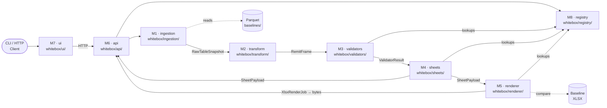

> **Living document** — Follows AGENTS.md § 6.11 3-tier behavior-marker convention.
> `[CONFIRMED]` = verified against source + physical baseline XLSX ·
> `[VERIFY]` = inferred from source only · `[FOUND-DURING-B6]` = discovered during B6 authoring.

> **Gate dependency** (AGENTS.md § 6.11 + plan.md § 4.2):
> All **implementation** is blocked until **G1 ∧ G2a ∧ G2b ∧ G3** are closed AND all B-docs (B1–B6) are frozen.
> Module boundary and design work may proceed immediately.
>
> | Gate | Description | Status |
> |---|---|---|
> | G1 | Stage 1 walk-through review | ✅ Closed (provisional, iterative refinement per AGENTS § 6.11) |
> | G2a | Input snapshot freeze (Redshift → local Parquet) | ⏸ Pending operator action |
> | G2b | Physical baseline XLSX freeze | ⏸ Pending operator action |
> | G3 | V1–V12 upgraded to `[CONFIRMED]` | ⏸ Pending user sign-off |

> **Purpose**: Define crisp, independently-testable module boundaries for the Stage 2 system.
> Establishes the owner package layout, input/output data-model contracts (from B3), and hook points (from B4/B5)
> for each module so that any contributor can work on one module without breaking the others.
> Includes the canonical B1↔B5 feature crosswalk to resolve the numbering discrepancy between docs.
>
> **Intended audience**: Stage 2 implementation engineers; servicer-onboarding engineers; QA/test authors;
> tech leads making architecture decisions before P2.1.
>
> **Revision history**
>
> | Date | Author | Change |
> |---|---|---|
> | 2026-05-28 | Copilot CLI agent | v1 — Initial version (B6). Defines 8 modules with data-model contracts (B3), hook points (B4/B5), test boundaries, and package layout. Adds B1↔B5 feature crosswalk. Aligned with plan.md § 4.4 phasing. |

# 7.0 Module Boundaries (Stage 2)

---

## 1. Goal

Define crisp, independently-testable module boundaries so that:

1. Each module can be built, tested, and deployed without depending on another module's runtime state.
2. Mock / fixture boundaries are explicit — no cross-module runtime calls during unit tests.
3. New servicers (Arvest, CC5, Selene, SLS, Scattered) can be onboarded by adding to the registry without touching any module's core logic (B4 `docs/stage2/4.0-validator-registry.en.md` §1.2; B5 `docs/stage2/5.0-extensibility-spec.en.md` §1.1).
4. The anti-patterns enumerated in § 6 are enforceable via static analysis.

---

## 2. Module Catalog

Eight modules form the complete Stage 2 system.

> **B3 reference**: all data model names below refer to `docs/stage2/3.0-data-model.en.md`.
> **B4/B5 hook references**: all `H#` names refer to `docs/stage2/5.0-extensibility-spec.en.md` § 4.

---

### M1 — Ingestion

| Attribute | Value |
|---|---|
| **Name** | `ingestion` |
| **Responsibility** | Locate and load frozen Parquet snapshots for a `(servicer, remit_date)` pair into `RawTableSnapshot` objects, validating the `SnapshotManifest`. |
| **Inputs** | `(servicer: ServicerId, remit_date: date)` + filesystem at `baselines/<servicer>/<date>/input_snapshots/` |
| **Outputs** | `list[RawTableSnapshot]` (B3 § 2.2) + `SnapshotManifest` (B3 § 2.3) |
| **Hook point** | H1 — Ingestion Adapter (B5 § 4.1) |
| **Test boundary** | Fixture: a minimal synthetic Parquet folder tree under `tests/fixtures/baselines/mrc/2026-04-30/`; no real Redshift; mock `SnapshotManifest` entries. |
| **Owner package** | `whitebox/ingestion/` |
| **Stage 1 anchor** | ch 1.1 §§ 3–6 (table inventory, time anchors, snapshot plan `[FROM-CODE]`) |

**Notes**: Before G2a closes, M1 uses mock fixture data. After G2a, real Parquet files are wired in. A new servicer overrides H1 by providing its own path pattern without changing this module (B5 § 4.1 `[VERIFY]`).

---

### M2 — Transform (Raw → Normalized Frame)

| Attribute | Value |
|---|---|
| **Name** | `transform` |
| **Responsibility** | Merge a `list[RawTableSnapshot]` into a servicer-specific `RemitFrame` (e.g. `MrcRemitFrame`), centralising derivation of all time anchors. |
| **Inputs** | `list[RawTableSnapshot]` (B3 § 2.2) |
| **Outputs** | `MrcRemitFrame` (B3 § 2.4) implementing `RemitFrame` protocol (B3 § 3.2) |
| **Hook point** | H2 — Raw Normalizer (B5 § 4.2) |
| **Test boundary** | Fixture: minimal in-memory Parquet DataFrames for each of the 8 MRC upstream tables; mock the 4 time-anchor derivations; assert `MrcRemitFrame` field equality. |
| **Owner package** | `whitebox/transform/` |
| **Stage 1 anchor** | ch 1.1 § 3 (4 time anchors `[FROM-CODE]`); ch 1.2 § 3 fig 1.2.3 (8 upstream tables) |

**Notes**: `MrcIntermediateCTEs` (B3 § 2.5) is produced by the validator (M3) not here; the hook for CTE capture is H3. `[VERIFY]` whether two `fctrdt`/`fctrdt_1m` copies of the advances DataFrame are pre-loaded here or over-queried in V5 (DM-6 open question, B3 § 2.4 notes).

---

### M3 — Validators

| Attribute | Value |
|---|---|
| **Name** | `validators` |
| **Responsibility** | Execute each registered validator function against a `ValidatorContext`, producing a `ValidatorResult` per validator (stamped DataFrame + `CellAnnotation[]`). |
| **Inputs** | `ValidatorContext` (B3 § 2.6): holds `RemitFrame` + `(servicer, remit_date)` + registry reference |
| **Outputs** | `list[ValidatorResult]` (B3 § 2.7): one per validator, ordered V1→V5 per B2 FR-F2.1 |
| **Hook points** | H3 — Intermediate CTE Customizer (B5 § 4.3); H4 — Validator Add/Override (B5 § 4.4) |
| **Test boundary** | Fixture: synthetic `MrcRemitFrame` with known row values; mock `ValidatorRegistry`; assert `ValidatorResult.cell_annotations` match expected highlight set; use `MrcIntermediateCTEs` fixtures for CTE drill-down tests. |
| **Owner package** | `whitebox/validators/` |
| **Stage 1 anchor** | ch 1.2 §§ 4–6 (per-validator CTE structure); ch 1.5 §§ 2–3 (rule catalogue `[FROM-CODE]`) |

**Notes**: Validators run in V1→V5 order per `remit_validation.py:134–144` `[FROM-CODE]`. No data dependency between validators (B3 § 1.8) — parallel execution is permitted, but output ordering must be preserved. CTE asymmetry (`p1/p2` vs `p/p2`) noted in ch 1.2 `[FROM-CODE]` is a known MRC-source quirk; Stage 2 must not replicate it. See § 7 `[VERIFY]` MB-4.

---

### M4 — Sheets (Payload Assembly)

| Attribute | Value |
|---|---|
| **Name** | `sheets` |
| **Responsibility** | Convert `list[ValidatorResult]` into `list[SheetPayload]`, pre-computing every cell's `(row, col)` coordinate and applying column ordering from the sheet registry. |
| **Inputs** | `list[ValidatorResult]` (B3 § 2.7) + `SheetRegistry[servicer]` |
| **Outputs** | `list[SheetPayload]` (B3 § 2.8): each payload has `sheet_id`, `rows`, `columns`, `cell_annotations`, pre-computed coordinates |
| **Hook point** | H5 — Sheet Add/Override (B5 § 4.5) |
| **Test boundary** | Fixture: minimal `ValidatorResult` stubs (3 rows, 2 columns); assert `SheetPayload.rows` contains expected `CellAnnotation` entries; assert `column_order` matches the baseline column order from ch 1.3 § 5 `[CONFIRMED]`. |
| **Owner package** | `whitebox/sheets/` |
| **Stage 1 anchor** | ch 1.3 §§ 4–5 (sheet metadata, column order `[CONFIRMED]`); ch 1.6 § 3.1 (column order is fixed by source code `[FROM-CODE]`) |

**Notes**: Pre-computing `(row, col)` at this stage (B3 § 1.3 design principle) allows M7 UI to perform drill-down without invoking the renderer. `pandi_diff` highlight exemption (ch 1.5 § 3.3 `[FROM-CODE]`) must be handled here, not in M3.

---

### M5 — Renderer (XLSX)

| Attribute | Value |
|---|---|
| **Name** | `renderer` |
| **Responsibility** | Convert `XlsxRenderJob` (wrapping `list[SheetPayload]`) into a byte-identical openpyxl workbook, reproducing all MRC style attributes (fonts, colours, column widths, freeze panes). |
| **Inputs** | `XlsxRenderJob` (B3 § 2.9): contains `list[SheetPayload]` + style overrides + `(servicer, remit_date)` |
| **Outputs** | `bytes` (XLSX workbook) that passes `BaselineComparison` cell-identity check (B3 § 2.10) |
| **Hook point** | H7 — Renderer Style Override (B5 § 4.7) |
| **Test boundary** | Fixture: minimal `XlsxRenderJob` with 2 sheets and 5 rows; run `openpyxl.load_workbook()` on output; assert cell values, `fill.fgColor`, `font.color`, `number_format` match expected values. Cell-identity harness (`stage2-mrc-cell-identity-harness`) is the P2.2 acceptance gate for this module. |
| **Owner package** | `whitebox/renderer/` |
| **Stage 1 anchor** | ch 1.3 § 4.3 (highlight colour contract `[CONFIRMED]`); ch 1.6 §§ 4–7 (rendering attributes, V1–V12 `[VERIFY]`) |

**Notes**: openpyxl version must be pinned at P2.2 (plan.md § 4.4, risk R4). `±inf`/`NaN`/`None`-date rendering varies across openpyxl ≥ 3.1 vs 3.0 (plan.md § 3 R4). Default styles: `header_fill_normal_rgb = "bccde9"`, `diff_fill_rgb = "ffc7ce"`, `diff_font_color_rgb = "df5006"` (ch 1.6 §§ 4.1–4.2 `[FROM-CODE]`; B5 § 4.7). `[VERIFY]` MB-5.

---

### M6 — API

| Attribute | Value |
|---|---|
| **Name** | `api` |
| **Responsibility** | Expose HTTP endpoints that orchestrate M1→M2→M3→M4 and serve `SheetPayload`, `CellTrace`, `ValidatorTrace`, `BaselineDiff`, and XLSX export responses to the UI layer. |
| **Inputs** | HTTP requests: `GET /api/v1/servicers`, `GET /api/v1/report/{servicer}/{remit_date}`, `GET /api/v1/cell-trace/{sheet_id}/{row_id}/{col_id}`, `GET /api/v1/export/{servicer}/{remit_date}` (B5 § 7.1) |
| **Outputs** | JSON (`CellTrace`, `SheetPayload[]`, servicer list) + XLSX bytes (export endpoint) |
| **Hook points** | None directly — orchestrates all other modules; passes `ServicerId` to each |
| **Test boundary** | Fixture: mock M1–M5 implementations returning synthetic data; assert HTTP response shape, status codes, and serialised JSON schema; no real filesystem or XLSX rendering in API unit tests. |
| **Owner package** | `whitebox/api/` |
| **Stage 1 anchor** | B2 FR-F2.1 (validator execution order); B5 § 7 (CellTrace JSON contract); B3 § 2.10 (BaselineComparison) |

**Notes**: Tech-stack for M6 is conditional on Q2 answer (plan.md § 5 Q2); default is FastAPI + HTMX (B5 § 6.2 `[PROPOSED]`). M6 is blocked behind all implementation gates (T-C tier per plan.md § 7.1). `[VERIFY]` MB-6.

---

### M7 — UI

| Attribute | Value |
|---|---|
| **Name** | `ui` |
| **Responsibility** | Render the interactive 8-feature web UI: picker, report tabs, cell drill-down panel, validator trace, lineage view, pass/fail tooltips, XLSX export trigger, and baseline diff view. |
| **Inputs** | API responses from M6 (JSON: `SheetPayload[]`, `CellTrace`, `ValidatorTrace`, `BaselineDiff`) |
| **Outputs** | Interactive HTML/JS; XLSX browser download |
| **Hook point** | H8 — UI Panel Slot (B5 § 4.8 `[EXPERIMENTAL]`) for servicer-specific sub-panels |
| **Test boundary** | Mock M6 API with canned JSON fixtures; test F1–F8 feature interactions via UI integration tests (e.g. `playwright` or `streamlit-testing-library`). Tech-stack-specific tooling TBD (Q2 decision). |
| **Owner package** | `whitebox/ui/` |
| **Stage 1 anchor** | B5 `docs/stage2/6.0-ui-architecture.en.md` (full spec); B1 §§ F1–F8 (user stories + acceptance criteria) |

**Notes**: P2.3 start is conditional on Q2 tech-stack decision (plan.md § 5 Q2). All 8 B5 features must be mapped to the B1 canonical numbering (see § 5 crosswalk). Pending-servicer entries must show as disabled with a link to `docs/<servicer>/_pending.md` (AGENTS § 6.8). `[VERIFY]` MB-7.

---

### M8 — Registry

| Attribute | Value |
|---|---|
| **Name** | `registry` |
| **Responsibility** | Provide the four in-memory registries (`ValidatorRegistry`, `SheetRegistry`, `FieldMappingRegistry`, `RuleRegistry`) and their auto-discovery / loading mechanism; expose the `@register_validator`, `@register_sheet`, `@register_field_mapping`, `@register_rule` decorators. |
| **Inputs** | Module import side-effects (decorator calls at module load); `docs/_status/servicers.yaml` for servicer-list enumeration |
| **Outputs** | `ValidatorRegistry`, `SheetRegistry`, `FieldMappingRegistry`, `RuleRegistry` singletons; servicer status list |
| **Hook points** | H4 (validator registration), H5 (sheet registration), H6 (field-mapping registration) are all implemented here |
| **Test boundary** | Reset registry singleton between tests (`registry.clear()` fixture); assert that registering a mock validator/sheet produces the correct lookup key; assert override semantics; no filesystem access in registry unit tests. |
| **Owner package** | `whitebox/registry/` |
| **Stage 1 anchor** | B4 `docs/stage2/4.0-validator-registry.en.md` §§ 2–4 (registry shapes, discovery, override); B5 `docs/stage2/5.0-extensibility-spec.en.md` § 4 (hook topology) |

**Notes**: Registry is the only module that M3–M5 import at runtime; all other inter-module communication flows via data model objects (no direct imports). MRC seed registrations (5 validators + 5 sheets + 12 rules) are defined in `whitebox/validators/mrc/` and `whitebox/sheets/mrc/` — the registry itself is servicer-neutral (B4 § 1.2).

---

## 3. Boundary Diagram



_Figure 7.0.3 — Module boundary data-flow diagram. Solid arrows are synchronous in-process calls passing typed data-model objects (B3). Dashed arrows are filesystem reads. M8 (registry) is consumed by M3, M4, M5 for dispatch but never calls them (no upward imports). Node IDs are display-only cross-references between this figure and the prose; they are not source-code identifiers._

**Step-by-step execution flow:**

1. **Client → M7**: user interacts with the UI (pick servicer + remit_date; click "Generate Report").
2. **M7 → M6**: UI issues HTTP calls to the API (`GET /api/v1/report/{servicer}/{remit_date}`).
3. **M6 → M1**: API calls M1 ingestion with `(servicer, remit_date)` to load Parquet files.
4. **M1 → Parquet store**: M1 locates files under `baselines/<servicer>/<date>/input_snapshots/` and returns `list[RawTableSnapshot]`.
5. **M1 → M2**: M2 transform merges snapshots into a `RemitFrame` (e.g. `MrcRemitFrame`), deriving time anchors.
6. **M2 → M3**: M3 validators execute registered functions (via M8 `ValidatorRegistry`) against `ValidatorContext`, producing `list[ValidatorResult]`.
7. **M3 → M4**: M4 sheets converts results into `list[SheetPayload]` (pre-computed cell coordinates) using M8 `SheetRegistry` for column ordering.
8. **M4 → M5** (export path): M5 renderer builds `XlsxRenderJob` from `SheetPayload[]` and writes openpyxl bytes.
9. **M4 → M6** (UI path): `SheetPayload[]` and `CellTrace` data are serialised as JSON and returned to M7.
10. **M6 → M7**: API response delivered; M7 renders the 5-tab sheet view and enables F1–F8 interactions.

---

## 4. Package Layout

```
whitebox/
├── ingestion/          # M1  — H1 Ingestion Adapter implementations
│   ├── __init__.py
│   ├── loader.py       #      load_snapshots(servicer, remit_date) → list[RawTableSnapshot]
│   └── mrc/            #      MRC-specific path logic
├── transform/          # M2  — H2 Raw Normalizer implementations
│   ├── __init__.py
│   ├── normalizer.py   #      normalize(snapshots) → RemitFrame
│   └── mrc/            #      MrcRemitFrame constructor
├── validators/         # M3  — H3/H4 Validator implementations
│   ├── __init__.py
│   └── mrc/            #      mrc_summary_check, mrc_check_general_info, …
│       ├── v1_summary.py
│       ├── v2_general.py
│       ├── v3_adv_balance.py
│       ├── v4_service_fee.py
│       └── v5_other.py
├── sheets/             # M4  — H5 Sheet renderer implementations
│   ├── __init__.py
│   └── mrc/            #      5 sheet payload assemblers
├── renderer/           # M5  — H7 XLSX renderer
│   ├── __init__.py
│   └── xlsx.py         #      XlsxRenderJob → bytes (openpyxl)
├── api/                # M6  — FastAPI / Streamlit entrypoint
│   ├── __init__.py
│   └── routes.py
├── ui/                 # M7  — Frontend (tech-stack decided in Q2)
│   └── __init__.py
├── registry/           # M8  — Registry singletons + decorators
│   ├── __init__.py
│   ├── validators.py
│   ├── sheets.py
│   ├── field_mappings.py
│   └── rules.py
├── models/             # B3 data models (shared, no module affiliation)
│   ├── __init__.py
│   ├── servicer.py     # ServicerId enum
│   ├── raw.py          # RawTableSnapshot, SnapshotManifest
│   ├── frame.py        # MrcRemitFrame, RemitFrame protocol
│   ├── intermediate.py # MrcIntermediateCTEs
│   ├── context.py      # ValidatorContext
│   ├── result.py       # ValidatorResult, CellAnnotation
│   ├── payload.py      # SheetPayload
│   ├── render.py       # XlsxRenderJob
│   └── baseline.py     # BaselineComparison
└── field_mappings/     # per-servicer YAML logical field → SourcePath
    └── mrc.yaml
```

---

## 5. UI-Feature Crosswalk (B1 ↔ B5)

> **Note**: B5 (`docs/stage2/6.0-ui-architecture.en.md`) was authored with a
> different numbering scheme from the canonical B1 (`docs/stage2/1.0-feature-list.en.md`).
> **B1 numbering is canonical** (directly derived from prompt-19 verbatim, session
> `4cd52a8e-d034-4def-84a0-04057dd64872` `turn_index=15`).
> This crosswalk is the authoritative reconciliation table; all downstream
> implementation docs must use B1 numbers as the primary identifier and may
> parenthetically reference B5 numbers for orientation.

> `[FOUND-DURING-B6]` 2026-05-28: B5 introduced two new UI features (cell
> drill-down, baseline diff) not present in the original prompt-19 eight features,
> and renumbered all features relative to B1. This crosswalk documents the
> discrepancy and maps both naming conventions.

| B1 # (canonical, prompt-19) | B1 Feature Name | B5 # (UI reframing) | B5 Feature Name | Notes |
|---|---|---|---|---|
| F1 | Parameter selector | F2 | Date / Servicer picker | B5 splits B1.F1 into F2 (picker UI) and the "Generate Report" trigger; canonical meaning preserved. |
| F2 | Generate validation report | _(implied)_ | Generate Report button inside B5 main view | B5 does not assign a standalone F# to generation; it is the trigger for all other features. |
| F3 | Sheet logic viewer | F3 | Per-sheet logic viewer | 1:1 correspondence. Both reference 1.3 sheets + validator function. |
| F4 | Field logic viewer | F4 | Validator trace panel | B5 broadens to "validator trace" (validator + rule + SQL); B1's "field logic" is a subset. |
| F5 | Lineage | F6 | Data lineage view | B5 F5 is pass/fail (see next row); lineage is B5 F6. |
| F6 | Intermediate data | _(implicit)_ | F1 cell drill-down sub-module "Raw Data Lineage" | B5 subsumes intermediate data under the F1 drill-down panel rather than a separate feature. |
| F7 | Pass / fail reasons | F5 | Pass / fail explanations | B1 F7 = B5 F5; both reference 1.5 rules catalogue. |
| F8 | Export | F7 | XLSX export | 1:1 correspondence. Both reference the cell-identical XLSX acceptance contract. |
| — | _(not in B1)_ | F1 | Cell drill-down (raw data lineage) | **New in B5** — not in the original 8 features; proposed as an enabling UX primitive for F3–F8. |
| — | _(not in B1)_ | F8 | Baseline diff view | **New in B5** — not in the original 8 features; required for G2b acceptance. Added by B5 as a natural extension of the G2 baseline contract. |

_Caption: Feature crosswalk between B1 (canonical prompt-19 numbering) and B5 (UI-architecture reframing). B5 added two new features (cell drill-down and baseline diff) not explicitly listed in prompt-19; both are retained as they are required for G2b acceptance and F3–F7 UX quality._

**Crosswalk step-by-step explanation:**

1. **B1.F1 ↔ B5.F2** — The parameter picker is the same concept; B5 decomposes it more precisely into a "Date/Servicer picker" sub-widget.
2. **B1.F2 ↔ B5 implicit** — Report generation is a side effect of picking parameters + clicking "Generate"; B5 does not assign a top-level feature number to this, but it is fully specified in B5 § 3.1 wireframe.
3. **B1.F3 ↔ B5.F3** — Direct 1:1 match (sheet tabs + per-sheet logic viewer).
4. **B1.F4 ↔ B5.F4** — B5 expands field-level logic into a full "Validator Trace Panel" covering SQL template + rule classification (ch 1.5 rule catalogue).
5. **B1.F5 ↔ B5.F6** — Lineage is B5.F6; B5.F5 was assigned to pass/fail explanations instead (numbering gap).
6. **B1.F6 ↔ B5.F1 sub-module** — B5 consolidates intermediate data into the cell drill-down panel (B5 § 3.2 wireframe), not as a standalone feature.
7. **B1.F7 ↔ B5.F5** — Pass/fail reasons / explanations are the same concept; both reference the 1.5 rule catalogue.
8. **B1.F8 ↔ B5.F7** — XLSX export is a direct 1:1 match.
9. **B5.F1 (new)** — Cell drill-down is a B5 addition; not in prompt-19 but required as the UX entry-point for F3/F4/F5/F6 drill-down interactions.
10. **B5.F8 (new)** — Baseline diff is a B5 addition; the G2b acceptance criterion implicitly requires it but prompt-19 did not list it explicitly.

---

## 6. What CANNOT Cross a Boundary (Anti-Patterns)

The following interactions are **forbidden** and should be enforced via import guards or linter rules:

| Anti-pattern | Why forbidden | Enforcement |
|---|---|---|
| `validators/` imports from `renderer/` | Validator logic must not depend on XLSX rendering; breaks M3/M5 independent testability. | `ruff` import rule: `whitebox.validators.* must not import whitebox.renderer.*` |
| `renderer/` imports from `validators/` | Renderer receives only `XlsxRenderJob`; any validator business logic inside the renderer creates a circular dependency. | Same `ruff` import rule. |
| `api/` calls `validators/` directly (bypassing M2 `transform/`) | API must go through the full M1→M2→M3 pipeline to guarantee time-anchor consistency. | Integration test: mock M2; assert M3 is never called directly from M6. |
| `ui/` imports any module other than making HTTP calls to `api/` | UI must be decoupled from the Python engine entirely; enables independent deployment. | `whitebox/ui/` must contain only HTTP client code; no direct imports from `whitebox/validators/`, `whitebox/renderer/`, etc. |
| Hard-coded `ServicerId.MRC` strings in `registry/`, `api/`, `ui/` | Breaks extensibility; adding a new servicer must not require modifying these modules. | Grep CI rule: forbid bare string `"MRC"` in `registry/`, `api/`, `ui/` (except in `ServicerId` enum definition itself). |
| `sheets/` calling SQL or Parquet reads | Sheets module assembles payloads from already-executed `ValidatorResult`; any re-query creates a hidden dependency on M1/M2. | No `pandas.read_parquet` or DB calls allowed inside `whitebox/sheets/`. |
| `registry/` storing mutable state between test runs | Registry singletons must be resettable; tests that leave entries pollute subsequent tests. | `tests/conftest.py` must call `registry.clear()` in a session-scoped teardown fixture. |
| Validators writing to `SheetPayload` directly | `SheetPayload` is assembled by M4, not M3; validators emit `ValidatorResult` only. | M3 output type is `ValidatorResult`; M4 input type is `ValidatorResult`; `SheetPayload` constructor is private to `whitebox/sheets/`. |

---

## 7. Open Questions / `[VERIFY]`

| ID | Question | Source | Impact | Phase |
|---|---|---|---|---|
| MB-1 | Does B5.F1 (cell drill-down) require a dedicated API endpoint or is it bundled with the `SheetPayload` response? | B5 § 4 F1; B3 § 2.7 | M6 route design | P2.3 |
| MB-2 | Is the `trust` field an explicit column in the Parquet snapshots or a filter parameter applied at query time? | B1 F1 `[VERIFY]`; ch 1.4 | M1 ingestion schema | P2.0 |
| MB-3 | Does M4 (sheets) need to produce `CellTrace` objects, or does M6 (API) assemble them from `ValidatorResult` + `SheetPayload` on-demand? | B5 § 7.1 (CellTrace JSON); B3 §§ 2.7–2.8 | M4/M6 boundary | P2.0 |
| MB-4 | CTE-naming asymmetry (`p1/p2` vs `p/p2`) documented in ch 1.2 § 4.1 `[FROM-CODE]` — does Stage 2 normalise to `p1/p2` universally, or preserve legacy asymmetry for bit-identical reproducibility? | ch 1.2 § 4.1 | M3 CTE capture | P2.1 |
| MB-5 | Which exact `openpyxl` version was used to produce the gold baseline XLSX? Needed before pinning M5 renderer. | plan.md § 3 R4; ch 1.6 V1–V12 | M5 renderer pin | P2.2 gate |
| MB-6 | Should M6 (API) support async generation (long-running background task) or synchronous blocking? | B1 F2 `[VERIFY]`; B2 NFR | M6 API design | P2.3 |
| MB-7 | H8 (UI Panel Slot) interface is `[EXPERIMENTAL]`; confirm whether it is in scope for P2.3 or deferred to P3. | B5 § 4.8; B5 § 8 `[PROPOSED]` | M7/M8 interface | P2.3/P3 |
