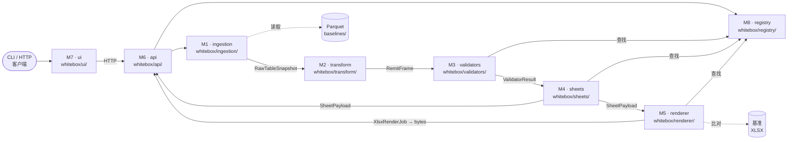

> **动态文档** — 遵循 AGENTS.md § 6.11 三层行为标记规范。
> `[CONFIRMED]` = 已通过源码 + 物理基准 XLSX 验证 ·
> `[VERIFY]` = 仅从源码推断，尚未通过物理产出物确认 · `[FOUND-DURING-B6]` = B6 编写期间发现。

> **关卡依赖**（AGENTS.md § 6.11 + plan.md § 4.2）：
> 所有**实施**工作均需等待 **G1 ∧ G2a ∧ G2b ∧ G3** 全部关闭且 B 系列文档（B1–B6）冻结后方可启动。
> 模块边界与设计工作可立即进行。
>
> | 关卡 | 说明 | 状态 |
> |---|---|---|
> | G1 | Stage 1 走查评审 | ✅ 已关闭（暂时批准，按 AGENTS § 6.11 迭代精化） |
> | G2a | 输入快照冻结（Redshift → 本地 Parquet） | ⏸ 等待操作员操作 |
> | G2b | 物理基准 XLSX 冻结 | ⏸ 等待操作员操作 |
> | G3 | V1–V12 升级为 `[CONFIRMED]` | ⏸ 等待用户签字 |

> **目的**：定义清晰的、可独立测试的模块边界，供 Stage 2 系统使用。
> 为每个模块建立所有者包布局、输入/输出数据模型契约（引用 B3）以及挂钩点（引用 B4/B5），
> 使任何贡献者均可在不破坏其他模块的前提下独立工作。
> 包含规范性 B1↔B5 功能交叉对照表，以解决两份文档之间的编号不一致问题。
>
> **目标读者**：Stage 2 实施工程师；服务商入驻工程师；QA/测试作者；P2.1 前做架构决策的技术负责人。
>
> **版本历史**
>
> | 日期 | 作者 | 变更 |
> |---|---|---|
> | 2026-05-28 | Copilot CLI agent | v1 — 初版（B6）。定义 8 个模块，含数据模型契约（B3）、挂钩点（B4/B5）、测试边界及包布局。增加 B1↔B5 功能交叉对照表。与 plan.md § 4.4 阶段划分对齐。 |

# 7.0 模块边界（Stage 2）

---

## 1. 目标

定义清晰的、可独立测试的模块边界，以实现：

1. 每个模块可在不依赖其他模块运行时状态的情况下独立构建、测试和部署。
2. Mock / 固定数据边界明确——单元测试期间不进行跨模块的运行时调用。
3. 新服务商（Arvest、CC5、Selene、SLS、Scattered）只需向注册表添加条目即可完成接入，无需修改任何模块核心逻辑（B4 `docs/stage2/4.0-validator-registry.en.md` §1.2；B5 `docs/stage2/5.0-extensibility-spec.en.md` §1.1）。
4. 第 6 节列举的反模式可通过静态分析工具强制执行。

---

## 2. 模块目录

Stage 2 系统由八个模块构成。

> **B3 引用**：下文所有数据模型名称均指 `docs/stage2/3.0-data-model.en.md`。
> **B4/B5 挂钩引用**：所有 `H#` 名称均指 `docs/stage2/5.0-extensibility-spec.en.md` § 4。

---

### M1 — 摄入层（Ingestion）

| 属性 | 值 |
|---|---|
| **名称** | `ingestion` |
| **职责** | 定位并加载 `(servicer, remit_date)` 对应的已冻结 Parquet 快照，构造 `RawTableSnapshot` 对象并验证 `SnapshotManifest`。 |
| **输入** | `(servicer: ServicerId, remit_date: date)` + 文件系统路径 `baselines/<servicer>/<date>/input_snapshots/` |
| **输出** | `list[RawTableSnapshot]`（B3 § 2.2）+ `SnapshotManifest`（B3 § 2.3） |
| **挂钩点** | H1 — 摄入适配器（B5 § 4.1） |
| **测试边界** | 固定数据：`tests/fixtures/baselines/mrc/2026-04-30/` 下的最小合成 Parquet 目录树；无真实 Redshift；Mock `SnapshotManifest` 条目。 |
| **所属包** | `whitebox/ingestion/` |
| **Stage 1 锚点** | ch 1.1 §§ 3–6（表清单、时间锚点、快照方案 `[FROM-CODE]`） |

**说明**：G2a 关闭前，M1 使用 Mock 固定数据。G2a 关闭后，接入真实 Parquet 文件。新服务商通过覆盖 H1（提供自身路径模式）即可实现接入，无需修改本模块（B5 § 4.1 `[VERIFY]`）。

---

### M2 — 转换层（Transform，原始 → 标准化帧）

| 属性 | 值 |
|---|---|
| **名称** | `transform` |
| **职责** | 将 `list[RawTableSnapshot]` 合并为特定服务商的 `RemitFrame`（如 `MrcRemitFrame`），集中推导所有时间锚点。 |
| **输入** | `list[RawTableSnapshot]`（B3 § 2.2） |
| **输出** | `MrcRemitFrame`（B3 § 2.4），实现 `RemitFrame` 协议（B3 § 3.2） |
| **挂钩点** | H2 — 原始标准化器（B5 § 4.2） |
| **测试边界** | 固定数据：8 张 MRC 上游表各自对应的最小内存 Parquet DataFrame；Mock 4 个时间锚点推导；断言 `MrcRemitFrame` 字段相等。 |
| **所属包** | `whitebox/transform/` |
| **Stage 1 锚点** | ch 1.1 § 3（4 个时间锚点 `[FROM-CODE]`）；ch 1.2 § 3 图 1.2.3（8 张上游表） |

**说明**：`MrcIntermediateCTEs`（B3 § 2.5）由验证器（M3）而非本模块产生，CTE 捕获挂钩为 H3。`[VERIFY]` 两份 `fctrdt`/`fctrdt_1m` 版本的 advances DataFrame 是在此处预加载还是在 V5 内部重复查询（DM-6 待确认问题，B3 § 2.4 注释）。

---

### M3 — 验证器层（Validators）

| 属性 | 值 |
|---|---|
| **名称** | `validators` |
| **职责** | 对每个已注册的验证器函数执行 `ValidatorContext`，为每个验证器生成一个 `ValidatorResult`（含时间戳 DataFrame + `CellAnnotation[]`）。 |
| **输入** | `ValidatorContext`（B3 § 2.6）：持有 `RemitFrame` + `(servicer, remit_date)` + 注册表引用 |
| **输出** | `list[ValidatorResult]`（B3 § 2.7）：每个验证器一个，按 B2 FR-F2.1 规定的 V1→V5 顺序排列 |
| **挂钩点** | H3 — 中间 CTE 定制器（B5 § 4.3）；H4 — 验证器添加/覆盖（B5 § 4.4） |
| **测试边界** | 固定数据：含已知行值的合成 `MrcRemitFrame`；Mock `ValidatorRegistry`；断言 `ValidatorResult.cell_annotations` 与预期高亮集合匹配；使用 `MrcIntermediateCTEs` 固定数据进行 CTE 钻取测试。 |
| **所属包** | `whitebox/validators/` |
| **Stage 1 锚点** | ch 1.2 §§ 4–6（各验证器 CTE 结构）；ch 1.5 §§ 2–3（规则目录 `[FROM-CODE]`） |

**说明**：验证器按 V1→V5 顺序执行，依据 `remit_validation.py:134–144` `[FROM-CODE]`。验证器之间无数据依赖（B3 § 1.8）——允许并行执行，但输出顺序必须保持。ch 1.2 `[FROM-CODE]` 记录的 CTE 别名不对称（`p1/p2` 与 `p/p2`）是 MRC 源码已知问题，Stage 2 不得复制。参见 § 7 `[VERIFY]` MB-4。

---

### M4 — 工作表层（Sheets，负载组装）

| 属性 | 值 |
|---|---|
| **名称** | `sheets` |
| **职责** | 将 `list[ValidatorResult]` 转换为 `list[SheetPayload]`，预计算每个单元格的 `(row, col)` 坐标，并应用来自工作表注册表的列排序。 |
| **输入** | `list[ValidatorResult]`（B3 § 2.7）+ `SheetRegistry[servicer]` |
| **输出** | `list[SheetPayload]`（B3 § 2.8）：每个负载含 `sheet_id`、`rows`、`columns`、`cell_annotations` 及预计算坐标 |
| **挂钩点** | H5 — 工作表添加/覆盖（B5 § 4.5） |
| **测试边界** | 固定数据：最小 `ValidatorResult` 存根（3 行 2 列）；断言 `SheetPayload.rows` 包含预期 `CellAnnotation` 条目；断言 `column_order` 与 ch 1.3 § 5 基准列顺序匹配 `[CONFIRMED]`。 |
| **所属包** | `whitebox/sheets/` |
| **Stage 1 锚点** | ch 1.3 §§ 4–5（工作表元数据、列顺序 `[CONFIRMED]`）；ch 1.6 § 3.1（列顺序由源码固定 `[FROM-CODE]`） |

**说明**：在此阶段预计算 `(row, col)`（B3 § 1.3 设计原则）可使 M7 UI 在不调用渲染器的情况下执行钻取。`pandi_diff` 高亮豁免（ch 1.5 § 3.3 `[FROM-CODE]`）必须在此处理，而非在 M3 中。

---

### M5 — 渲染器层（Renderer，XLSX）

| 属性 | 值 |
|---|---|
| **名称** | `renderer` |
| **职责** | 将 `XlsxRenderJob`（封装 `list[SheetPayload]`）转换为字节级一致的 openpyxl 工作簿，复现所有 MRC 样式属性（字体、颜色、列宽、冻结窗格）。 |
| **输入** | `XlsxRenderJob`（B3 § 2.9）：包含 `list[SheetPayload]` + 样式覆盖 + `(servicer, remit_date)` |
| **输出** | `bytes`（XLSX 工作簿），通过 `BaselineComparison` 单元格一致性检查（B3 § 2.10） |
| **挂钩点** | H7 — 渲染器样式覆盖（B5 § 4.7） |
| **测试边界** | 固定数据：含 2 张工作表和 5 行的最小 `XlsxRenderJob`；对输出调用 `openpyxl.load_workbook()`；断言单元格值、`fill.fgColor`、`font.color`、`number_format` 与预期值匹配。单元格一致性套件（`stage2-mrc-cell-identity-harness`）是本模块 P2.2 验收关卡。 |
| **所属包** | `whitebox/renderer/` |
| **Stage 1 锚点** | ch 1.3 § 4.3（高亮颜色契约 `[CONFIRMED]`）；ch 1.6 §§ 4–7（渲染属性，V1–V12 `[VERIFY]`） |

**说明**：openpyxl 版本必须在 P2.2 时锁定（plan.md § 4.4，风险 R4）。openpyxl ≥ 3.1 与 3.0 在处理 `±inf`/`NaN`/`None`-日期时行为不同（plan.md § 3 R4）。默认样式：`header_fill_normal_rgb = "bccde9"`，`diff_fill_rgb = "ffc7ce"`，`diff_font_color_rgb = "df5006"`（ch 1.6 §§ 4.1–4.2 `[FROM-CODE]`；B5 § 4.7）。`[VERIFY]` MB-5。

---

### M6 — API 层

| 属性 | 值 |
|---|---|
| **名称** | `api` |
| **职责** | 暴露 HTTP 端点，编排 M1→M2→M3→M4，并向 UI 层提供 `SheetPayload`、`CellTrace`、`ValidatorTrace`、`BaselineDiff` 及 XLSX 导出响应。 |
| **输入** | HTTP 请求：`GET /api/v1/servicers`、`GET /api/v1/report/{servicer}/{remit_date}`、`GET /api/v1/cell-trace/{sheet_id}/{row_id}/{col_id}`、`GET /api/v1/export/{servicer}/{remit_date}`（B5 § 7.1） |
| **输出** | JSON（`CellTrace`、`SheetPayload[]`、服务商列表）+ XLSX 字节（导出端点） |
| **挂钩点** | 无直接挂钩——编排所有其他模块；向每个模块传递 `ServicerId` |
| **测试边界** | 固定数据：Mock M1–M5 实现，返回合成数据；断言 HTTP 响应结构、状态码及序列化 JSON Schema；API 单元测试中不使用真实文件系统或 XLSX 渲染。 |
| **所属包** | `whitebox/api/` |
| **Stage 1 锚点** | B2 FR-F2.1（验证器执行顺序）；B5 § 7（CellTrace JSON 契约）；B3 § 2.10（BaselineComparison） |

**说明**：M6 的技术栈取决于 Q2 答案（plan.md § 5 Q2）；默认为 FastAPI + HTMX（B5 § 6.2 `[PROPOSED]`）。M6 在所有实施关卡（T-C 层级，plan.md § 7.1）之后才解锁。`[VERIFY]` MB-6。

---

### M7 — UI 层

| 属性 | 值 |
|---|---|
| **名称** | `ui` |
| **职责** | 渲染 8 功能交互式 Web UI：选择器、报告标签页、单元格钻取面板、验证器追踪、血缘视图、通过/失败提示、XLSX 导出触发及基准差异视图。 |
| **输入** | 来自 M6 的 API 响应（JSON：`SheetPayload[]`、`CellTrace`、`ValidatorTrace`、`BaselineDiff`） |
| **输出** | 交互式 HTML/JS；XLSX 浏览器下载 |
| **挂钩点** | H8 — UI 面板插槽（B5 § 4.8 `[EXPERIMENTAL]`），用于特定服务商子面板 |
| **测试边界** | 使用预设 JSON 固定数据 Mock M6 API；通过 UI 集成测试验证 F1–F8 功能交互（如 `playwright` 或 `streamlit-testing-library`）。具体测试工具取决于 Q2 技术栈决策。 |
| **所属包** | `whitebox/ui/` |
| **Stage 1 锚点** | B5 `docs/stage2/6.0-ui-architecture.en.md`（完整规范）；B1 §§ F1–F8（用户故事 + 验收标准） |

**说明**：P2.3 启动条件为 Q2 技术栈决策（plan.md § 5 Q2）。8 个 B5 功能均需映射到 B1 规范编号（参见 § 5 交叉对照表）。待分析服务商条目必须以禁用状态显示，并链接至 `docs/<servicer>/_pending.md`（AGENTS § 6.8）。`[VERIFY]` MB-7。

---

### M8 — 注册表层（Registry）

| 属性 | 值 |
|---|---|
| **名称** | `registry` |
| **职责** | 提供四个内存注册表（`ValidatorRegistry`、`SheetRegistry`、`FieldMappingRegistry`、`RuleRegistry`）及其自动发现/加载机制；暴露 `@register_validator`、`@register_sheet`、`@register_field_mapping`、`@register_rule` 装饰器。 |
| **输入** | 模块导入副作用（模块加载时的装饰器调用）；`docs/_status/servicers.yaml`（服务商列表枚举） |
| **输出** | `ValidatorRegistry`、`SheetRegistry`、`FieldMappingRegistry`、`RuleRegistry` 单例；服务商状态列表 |
| **挂钩点** | H4（验证器注册）、H5（工作表注册）、H6（字段映射注册）均在此实现 |
| **测试边界** | 测试间重置注册表单例（`registry.clear()` 固定数据装置）；断言注册 Mock 验证器/工作表后产生正确的查找键；断言覆盖语义；注册表单元测试中不访问文件系统。 |
| **所属包** | `whitebox/registry/` |
| **Stage 1 锚点** | B4 `docs/stage2/4.0-validator-registry.en.md` §§ 2–4（注册表结构、发现机制、覆盖语义）；B5 `docs/stage2/5.0-extensibility-spec.en.md` § 4（挂钩拓扑） |

**说明**：注册表是 M3–M5 运行时唯一导入的模块；所有其他模块间通信通过数据模型对象流转（不直接导入）。MRC 种子注册条目（5 个验证器 + 5 张工作表 + 12 条规则）定义在 `whitebox/validators/mrc/` 和 `whitebox/sheets/mrc/` 中——注册表本身与服务商无关（B4 § 1.2）。

---

## 3. 边界示意图



_图 7.0.3 — 模块边界数据流图。实线箭头为同步进程内调用，传递类型化数据模型对象（B3）。虚线箭头为文件系统读取。M8（注册表）被 M3、M4、M5 消费用于分发，但从不调用它们（无向上导入）。节点 ID 仅为图与正文之间的展示用交叉引用，不是源码标识符。_

**逐步执行流程说明：**

1. **客户端 → M7**：用户与 UI 交互（选择服务商 + remit_date；点击"生成报告"）。
2. **M7 → M6**：UI 向 API 发出 HTTP 调用（`GET /api/v1/report/{servicer}/{remit_date}`）。
3. **M6 → M1**：API 用 `(servicer, remit_date)` 调用 M1 摄入层，加载 Parquet 文件。
4. **M1 → Parquet 存储**：M1 在 `baselines/<servicer>/<date>/input_snapshots/` 下定位文件，返回 `list[RawTableSnapshot]`。
5. **M1 → M2**：M2 转换层将快照合并为 `RemitFrame`（如 `MrcRemitFrame`），推导时间锚点。
6. **M2 → M3**：M3 验证器通过 M8 `ValidatorRegistry` 对 `ValidatorContext` 执行已注册函数，产生 `list[ValidatorResult]`。
7. **M3 → M4**：M4 工作表层使用 M8 `SheetRegistry` 的列排序，将结果转换为含预计算单元格坐标的 `list[SheetPayload]`。
8. **M4 → M5**（导出路径）：M5 渲染器由 `SheetPayload[]` 构建 `XlsxRenderJob`，写出 openpyxl 字节。
9. **M4 → M6**（UI 路径）：`SheetPayload[]` 及 `CellTrace` 数据序列化为 JSON，返回给 M7。
10. **M6 → M7**：API 响应交付；M7 渲染 5 标签页工作表视图并启用 F1–F8 交互。

---

## 4. 包布局

```
whitebox/
├── ingestion/          # M1  — H1 摄入适配器实现
│   ├── __init__.py
│   ├── loader.py       #      load_snapshots(servicer, remit_date) → list[RawTableSnapshot]
│   └── mrc/            #      MRC 专用路径逻辑
├── transform/          # M2  — H2 原始标准化器实现
│   ├── __init__.py
│   ├── normalizer.py   #      normalize(snapshots) → RemitFrame
│   └── mrc/            #      MrcRemitFrame 构造器
├── validators/         # M3  — H3/H4 验证器实现
│   ├── __init__.py
│   └── mrc/            #      mrc_summary_check, mrc_check_general_info, …
│       ├── v1_summary.py
│       ├── v2_general.py
│       ├── v3_adv_balance.py
│       ├── v4_service_fee.py
│       └── v5_other.py
├── sheets/             # M4  — H5 工作表渲染器实现
│   ├── __init__.py
│   └── mrc/            #      5 张工作表负载组装器
├── renderer/           # M5  — H7 XLSX 渲染器
│   ├── __init__.py
│   └── xlsx.py         #      XlsxRenderJob → bytes（openpyxl）
├── api/                # M6  — FastAPI / Streamlit 入口
│   ├── __init__.py
│   └── routes.py
├── ui/                 # M7  — 前端（技术栈由 Q2 决定）
│   └── __init__.py
├── registry/           # M8  — 注册表单例 + 装饰器
│   ├── __init__.py
│   ├── validators.py
│   ├── sheets.py
│   ├── field_mappings.py
│   └── rules.py
├── models/             # B3 数据模型（共享，无模块归属）
│   ├── __init__.py
│   ├── servicer.py     # ServicerId 枚举
│   ├── raw.py          # RawTableSnapshot, SnapshotManifest
│   ├── frame.py        # MrcRemitFrame, RemitFrame 协议
│   ├── intermediate.py # MrcIntermediateCTEs
│   ├── context.py      # ValidatorContext
│   ├── result.py       # ValidatorResult, CellAnnotation
│   ├── payload.py      # SheetPayload
│   ├── render.py       # XlsxRenderJob
│   └── baseline.py     # BaselineComparison
└── field_mappings/     # 各服务商 YAML 逻辑字段 → SourcePath 映射
    └── mrc.yaml
```

---

## 5. UI 功能交叉对照表（B1 ↔ B5）

> **注意**：B5（`docs/stage2/6.0-ui-architecture.en.md`）采用与规范 B1（`docs/stage2/1.0-feature-list.en.md`）不同的编号方案。
> **B1 编号为规范**（直接源自 prompt-19 原文，会话 `4cd52a8e-d034-4def-84a0-04057dd64872` `turn_index=15`）。
> 本交叉对照表是权威对照文档；所有下游实施文档必须以 B1 编号为主要标识符，可在括号内注明 B5 编号以便定位。

> `[FOUND-DURING-B6]` 2026-05-28：B5 引入了两个原始 prompt-19 八功能中未出现的新 UI 功能（单元格钻取、基准差异视图），并相对 B1 重新编号了所有功能。本对照表记录了该差异并完成了两套命名规范的映射。

| B1 编号（规范，prompt-19） | B1 功能名称 | B5 编号（UI 重构） | B5 功能名称 | 说明 |
|---|---|---|---|---|
| F1 | 参数选择器 | F2 | 日期/服务商选择器 | B5 将 B1.F1 细分为 F2（选择器 UI）和"生成报告"触发器；规范含义保持不变。 |
| F2 | 生成验证报告 | _（隐含）_ | 主视图中的"生成报告"按钮 | B5 未为生成操作单独分配顶级 F#；在 B5 § 3.1 线框图中完整说明。 |
| F3 | 工作表逻辑查看器 | F3 | 各工作表逻辑查看器 | 1:1 对应。均引用 1.3 工作表 + 验证器函数。 |
| F4 | 字段逻辑查看器 | F4 | 验证器追踪面板 | B5 扩展为"验证器追踪"（验证器 + 规则 + SQL）；B1 的"字段逻辑"是其子集。 |
| F5 | 血缘 | F6 | 数据血缘视图 | B5 F5 为通过/失败（见下一行）；血缘为 B5 F6。 |
| F6 | 中间数据 | _（隐含）_ | B5 F1 单元格钻取子模块"原始数据血缘" | B5 将中间数据整合进单元格钻取面板（B5 § 3.2 线框图），而非独立功能。 |
| F7 | 通过/失败原因 | F5 | 通过/失败解释 | B1 F7 = B5 F5；均引用 1.5 规则目录。 |
| F8 | 导出 | F7 | XLSX 导出 | 1:1 对应。均引用单元格一致性 XLSX 验收契约。 |
| — | _（B1 中无此功能）_ | F1 | 单元格钻取（原始数据血缘） | **B5 新增**——不在原始 8 功能中；作为 F3–F8 钻取交互的 UX 入口点提出。 |
| — | _（B1 中无此功能）_ | F8 | 基准差异视图 | **B5 新增**——不在原始 8 功能中；G2b 验收标准隐式要求此功能。B5 作为 G2 基准契约的自然延伸添加。 |

_图注：B1（规范 prompt-19 编号）与 B5（UI 架构重构）之间的功能交叉对照。B5 增加了两个 prompt-19 中未明确列出的新功能（单元格钻取与基准差异视图）；因其为 G2b 验收和 F3–F7 用户体验质量所必需，故予以保留。_

**交叉对照逐步说明：**

1. **B1.F1 ↔ B5.F2** — 参数选择器概念相同；B5 将其更精确地分解为"日期/服务商选择器"子组件。
2. **B1.F2 ↔ B5 隐含** — 报告生成是选择参数后点击"生成"的副作用；B5 未为此分配顶级 F#，但在 B5 § 3.1 线框图中完整说明。
3. **B1.F3 ↔ B5.F3** — 直接 1:1 对应（工作表标签页 + 每张工作表逻辑查看器）。
4. **B1.F4 ↔ B5.F4** — B5 将字段级逻辑扩展为完整的"验证器追踪面板"，涵盖 SQL 模板 + 规则分类（ch 1.5 规则目录）。
5. **B1.F5 ↔ B5.F6** — 血缘为 B5.F6；B5.F5 被分配给通过/失败解释（编号差异）。
6. **B1.F6 ↔ B5.F1 子模块** — B5 将中间数据整合进单元格钻取面板（B5 § 3.2 线框图），而非独立功能。
7. **B1.F7 ↔ B5.F5** — 通过/失败原因/解释为同一概念；均引用 1.5 规则目录。
8. **B1.F8 ↔ B5.F7** — XLSX 导出直接 1:1 对应。
9. **B5.F1（新增）** — 单元格钻取为 B5 新增；不在 prompt-19 中，但作为 F3/F4/F5/F6 钻取交互的 UX 入口所必需。
10. **B5.F8（新增）** — 基准差异视图为 B5 新增；G2b 验收标准隐式要求，但 prompt-19 未明确列出。

---

## 6. 禁止跨越边界的反模式

以下交互**严禁**出现，应通过导入限制或 lint 规则强制执行：

| 反模式 | 禁止原因 | 执行方式 |
|---|---|---|
| `validators/` 从 `renderer/` 导入 | 验证器逻辑不得依赖 XLSX 渲染；破坏 M3/M5 独立可测性。 | `ruff` 导入规则：`whitebox.validators.* 不得导入 whitebox.renderer.*` |
| `renderer/` 从 `validators/` 导入 | 渲染器仅接收 `XlsxRenderJob`；在渲染器中加入验证器业务逻辑将造成循环依赖。 | 同上 `ruff` 导入规则。 |
| `api/` 直接调用 `validators/`（绕过 M2 `transform/`） | API 必须经过完整的 M1→M2→M3 流水线，以确保时间锚点一致性。 | 集成测试：Mock M2；断言 M3 从未直接被 M6 调用。 |
| `ui/` 导入除通过 HTTP 调用 `api/` 之外的任何模块 | UI 必须与 Python 引擎完全解耦，以支持独立部署。 | `whitebox/ui/` 中只允许包含 HTTP 客户端代码；不得直接从 `whitebox/validators/`、`whitebox/renderer/` 等处导入。 |
| 在 `registry/`、`api/`、`ui/` 中硬编码 `ServicerId.MRC` 字符串 | 破坏可扩展性；添加新服务商不应需要修改这些模块。 | grep CI 规则：在 `registry/`、`api/`、`ui/` 中禁止裸字符串 `"MRC"`（`ServicerId` 枚举定义本身除外）。 |
| `sheets/` 调用 SQL 或读取 Parquet | 工作表模块仅从已执行的 `ValidatorResult` 组装负载；任何重新查询都会造成对 M1/M2 的隐性依赖。 | `whitebox/sheets/` 内不允许使用 `pandas.read_parquet` 或 DB 调用。 |
| `registry/` 在测试运行之间保留可变状态 | 注册表单例必须可重置；遗留条目会污染后续测试。 | `tests/conftest.py` 必须在会话级 teardown 固定数据装置中调用 `registry.clear()`。 |
| 验证器直接写入 `SheetPayload` | `SheetPayload` 由 M4 而非 M3 组装；验证器只输出 `ValidatorResult`。 | M3 输出类型为 `ValidatorResult`；M4 输入类型为 `ValidatorResult`；`SheetPayload` 构造器对 `whitebox/sheets/` 私有。 |

---

## 7. 待确认问题 / `[VERIFY]`

| 编号 | 问题 | 来源 | 影响 | 阶段 |
|---|---|---|---|---|
| MB-1 | B5.F1（单元格钻取）是否需要专用 API 端点，还是与 `SheetPayload` 响应捆绑返回？ | B5 § 4 F1；B3 § 2.7 | M6 路由设计 | P2.3 |
| MB-2 | `trust` 字段是 Parquet 快照中的显式列还是查询时应用的过滤参数？ | B1 F1 `[VERIFY]`；ch 1.4 | M1 摄入 Schema | P2.0 |
| MB-3 | M4（工作表）是否需要产生 `CellTrace` 对象，还是由 M6（API）按需从 `ValidatorResult` + `SheetPayload` 组装？ | B5 § 7.1（CellTrace JSON）；B3 §§ 2.7–2.8 | M4/M6 边界 | P2.0 |
| MB-4 | ch 1.2 § 4.1 `[FROM-CODE]` 记录的 CTE 别名不对称（`p1/p2` 与 `p/p2`）——Stage 2 是否统一为 `p1/p2`，还是为保留位级可重现性而保留原有不对称？ | ch 1.2 § 4.1 | M3 CTE 捕获 | P2.1 |
| MB-5 | 用于生成黄金基准 XLSX 的确切 openpyxl 版本是什么？锁定 M5 渲染器前需确认。 | plan.md § 3 R4；ch 1.6 V1–V12 | M5 渲染器版本锁定 | P2.2 关卡 |
| MB-6 | M6（API）是否应支持异步生成（长时间运行的后台任务），还是同步阻塞模式？ | B1 F2 `[VERIFY]`；B2 NFR | M6 API 设计 | P2.3 |
| MB-7 | H8（UI 面板插槽）接口为 `[EXPERIMENTAL]`；确认其是否在 P2.3 范围内，或推迟至 P3。 | B5 § 4.8；B5 § 8 `[PROPOSED]` | M7/M8 接口 | P2.3/P3 |
