> **Living document** — Follows AGENTS.md § 6.11 3-tier behavior-marker convention.
> `[CONFIRMED]` = verified against source + physical baseline XLSX ·
> `[VERIFY]` = inferred from source only · `[FOUND-DURING-B6]` = discovered during B6 authoring.

> **Gate dependency** (AGENTS.md § 6.11 + plan.md § 4.2):
> Onboarding **implementation** is blocked until **G1 ∧ G2a ∧ G2b ∧ G3** are closed and B-docs frozen.
> Onboarding **planning and checklist prep** may proceed immediately.
>
> | Gate | Description | Status |
> |---|---|---|
> | G1 | Stage 1 walk-through review | ✅ Closed |
> | G2a | Input snapshot freeze (Redshift → local Parquet) | ⏸ Pending operator action |
> | G2b | Physical baseline XLSX freeze | ⏸ Pending operator action |
> | G3 | V1–V12 upgraded to `[CONFIRMED]` | ⏸ Pending user sign-off |

> **Purpose**: Define the end-to-end onboarding workflow for a new servicer.
> Covers the MRC-as-reference-pattern approach, prerequisites checklist, step-by-step workflow,
> skeleton directory tree, common pitfalls from the MRC experience, and an Arvest walkthrough.
>
> **Intended audience**: Engineers onboarding a new servicer (Arvest, CC5, Selene, SLS, Scattered);
> Stage 2 tech leads reviewing extensibility readiness; users reviewing B6 deliverables.
>
> **Revision history**
>
> | Date | Author | Change |
> |---|---|---|
> | 2026-05-28 | Copilot CLI agent | v1 — Initial version (B6). Derives onboarding workflow from MRC Stage 1 pattern and B4/B5 extensibility spec. Captures MRC-specific pitfalls as cautionary notes for future servicers. Includes Arvest minimum walkthrough pseudocode. |

# 8.0 Servicer Onboarding (Stage 2)

---

## 1. Onboarding Philosophy

### 1.1 MRC as the reference implementation

MRC is the first servicer to reach a complete Stage 1 analysis (`docs/mrc/1.0–1.6.*`) and will
be the first servicer implemented end-to-end in Stage 2.  Every future servicer
(Arvest, CC5, Selene, SLS, Scattered) **copies the MRC pattern**, parameterises it
on the `ServicerId` discriminator, and registers its artefacts in the B4 registries without
touching any core engine or UI code.

This principle is established in B5 § 1.1 (`docs/stage2/5.0-extensibility-spec.en.md`):

> "Onboarding Arvest, CC5, Selene, SLS, or any future servicer must not require modifying
>  the core engine, core data models, or B5 UI code."

### 1.2 Servicer-discriminator parameterisation

The key mechanism is the `ServicerId` enum (B3 § 2.1, `docs/stage2/3.0-data-model.en.md`).
Every shared data-model object (from `RawTableSnapshot` to `BaselineComparison`) carries a
`servicer: ServicerId` field.  The engine and registries dispatch on this field with zero
`if/elif` branches.

Adding a new servicer requires only:

1. A new `ServicerId` enum value (one line of code).
2. Artefacts registered via `@register_validator`, `@register_sheet`, `@register_field_mapping` decorators.
3. All data flowing through unchanged core pipeline (M1 → M2 → M3 → M4 → M5 → M6/M7).

---

## 2. Prerequisites for a New Servicer

Before any implementation work begins for a new servicer, **all of the following must be complete**:

### 2.1 Stage 1 analysis complete (A1–A7)

| # | Artefact | Pattern / Reference |
|---|---|---|
| A1 | `docs/<servicer>/1.0-toc.{zh,en}.md` | Chapter map and scope — see `docs/mrc/1.0-toc.*` |
| A2 | `docs/<servicer>/1.1-rawdata.{zh,en}.md` | Upstream tables, time anchors — see `docs/mrc/1.1-rawdata.*` |
| A3 | `docs/<servicer>/1.2-dataflow.{zh,en}.md` | End-to-end execution pipeline — see `docs/mrc/1.2-dataflow.*` |
| A4 | `docs/<servicer>/1.3-sheets.{zh,en}.md` | openpyxl rendering contract — see `docs/mrc/1.3-sheets.*` |
| A5 | `docs/<servicer>/1.4-fields.{zh,en}.md` | Field-level lineage + business meaning — see `docs/mrc/1.4-fields.*` |
| A6 | `docs/<servicer>/1.5-rules.{zh,en}.md` | Rule catalogue (HIGHLIGHT / SUPPRESSED / …) — see `docs/mrc/1.5-rules.*` |
| A7 | `docs/<servicer>/1.6-baseline.{zh,en}.md` | Baseline XLSX behaviour, V1–V12 checklist — see `docs/mrc/1.6-baseline.*` |

Checklist: all 7 chapters exist, pass `tools/stage_doc_checks.py`, and are bilingual-aligned.

### 2.2 G2a-equivalent: Input snapshot frozen (A8)

| Requirement | Details |
|---|---|
| Frozen Parquet snapshots exist | `baselines/<servicer>/<date>/input_snapshots/` mirrors the MRC G2a layout (plan.md § 4.2) |
| `_manifest.json` is complete | Every Parquet file has non-empty `sha256_file` + `sha256_canonical_rows` + `row_count` |
| Export SQL files committed | `_export_queries/resolved/*.sql` contains the verbatim SQL used for each dataset |
| Manifest passes `tools/freeze_snapshot.py verify` | All datasets catalogued; all hashes valid |

Use mock fixture data before G2a gate opens; do not block implementation planning on snapshots.

### 2.3 G2b-equivalent: Legacy code reproducible

| Requirement | Details |
|---|---|
| Legacy `flow/remit_validation/<servicer>_validation.py` runs against Parquet shim | `tools/legacy_adapter.py` points at `input_snapshots/`; legacy code runs without Redshift |
| Output XLSX produced | `baselines/<servicer>/<date>/validation_report.xlsx` exists |
| `manifest.json` complete | Contains `sha256`, `openpyxl_version`, source repo SHA, input-snapshot manifest hash |

### 2.4 G3-equivalent: V1-V*n* `[CONFIRMED]`

All `[VERIFY]` items from `docs/<servicer>/1.6-baseline.{zh,en}.md` § 9 must be upgraded to
`[CONFIRMED]` against the physical XLSX produced by the G2b-equivalent run.  The number of
items may differ from MRC's V1–V12 depending on the servicer's rendering complexity.

### 2.5 Field-mapping YAML (A9)

`whitebox/field_mappings/<servicer>.yaml` exists and maps every logical field to a
`SourcePath` (B4 `FieldMappingRegistry`, `docs/stage2/4.0-validator-registry.en.md` § 2.3).

### 2.6 Registry registrations pending (A10–A11)

Registration code stubs (`@register_validator`, `@register_sheet`) may exist as
`NotImplementedError` placeholders before A1–A9 are complete.  They must be replaced with
real implementations before Stage 2 cell-identity tests can pass.

---

## 3. Step-by-Step Onboarding Workflow

The following sequence applies to every non-MRC servicer.  Numbers correspond to the B5
onboarding workflow diagram (B5 § 6, `docs/stage2/5.0-extensibility-spec.en.md` Fig 5.0.6).

```mermaid
flowchart TD
    S1["S1 · Read MRC Stage 1 as reference\n(docs/mrc/1.0–1.6.{zh,en}.md)\nUnderstand depth, template, bilingual structure"]
    S2["S2 · Reverse-engineer servicer source\n(flow/remit_validation/<servicer>_validation.py)\nCover validators, sheets, fields, rules, time anchors"]
    S3["S3 · Write docs/<servicer>/1.0–1.6.{zh,en}.md\n(7 chapters × 2 languages = 14 files)\nAll AGENTS § 6.7 / § 6.9 / § 6.10 requirements met"]
    S4["S4 · Four-artifact commit (AGENTS § 6.8 mandatory)\n+ servicers.yaml status: pending-analysis → in-progress\n+ servicers-registry.md update\n+ plan.md servicer matrix update\n+ SQL todo status update"]
    S5["S5 · Freeze input snapshots\n(baselines/<servicer>/<date>/input_snapshots/)\nUse mock fixtures before G2a gate opens"]
    S6["S6 · Create field-mapping YAML\n(whitebox/field_mappings/<servicer>.yaml)\nLogical field → SourcePath for each column"]
    S7["S7 · Implement validator registrations\n(@register_validator(servicer=<id>, id=<vid>) × N)\n(@register_rule(servicer=<id>, rule_id=<rid>) × M)"]
    S8["S8 · Implement sheet renderer registrations\n(@register_sheet(servicer=<id>, id=<sid>) × N)"]
    S9["S9 · Run cell-identity test suite\n(pytest tests/test_cell_identity.py --servicer=<id>)\nBaselineComparison.passed == True"]
    S10["S10 · Write test report\n(test_reports/<servicer-stage1-todo-id>_YYYY-MM-DD.md)\nAGENTS § 6.5 mandatory — P0 all PASS before done"]
    S11["S11 · Commit all changes\n(single commit containing all AGENTS § 6.8 updates)"]

    S1 --> S2 --> S3 --> S4 --> S5 --> S6 --> S7 --> S8 --> S9 --> S10 --> S11
```



_Figure 8.0.3 — 11-step servicer onboarding workflow. S1–S3 are the analysis phase (may run before Stage 2 gates close). S4 is the mandatory four-artifact status commit (AGENTS § 6.8). S5–S8 are the implementation phase (blocked until G2a/G2b/G3-equivalent). S9–S11 are the verification and commit phase._

**Step-by-step explanation:**

1. **S1 — Reference read**: Study `docs/mrc/1.0–1.6.{zh,en}.md` completely.  Understand the
   analysis depth required: 7 chapters, bilingual, all AGENTS §§ 6.7/6.9/6.10 requirements, tier
   markers, source citations.  Do not begin writing until you understand what "done" looks like.
   Trigger: decision to onboard a new servicer.  Output: no artefact, just internal readiness.

2. **S2 — Reverse-engineer**: Read `flow/remit_validation/<servicer>_validation.py` (read-only
   source, AGENTS § 3) plus any transitively imported modules.  Extract: table names, time anchors,
   validator function names and call order, SQL templates, sheet configuration, highlight conditions,
   field definitions.  Document every finding with source-line citations.
   Output: working notes / scratch doc (not committed yet).

3. **S3 — Write 14 doc files**: Create `docs/<servicer>/1.0–1.6.{zh,en}.md` following the MRC
   chapter template exactly.  Every chapter needs: doc header (Purpose / Intended audience / Revision
   history), diagrams with captions, step-by-step explanations, mermaid node-ID legends, tier markers
   on every behavior assertion, source citations.

4. **S4 — Four-artifact commit** (AGENTS § 6.8 mandatory same-commit requirement):
   a. `docs/_status/servicers.yaml` — `status: pending-analysis → in-progress`.
   b. `docs/_status/servicers-registry.{zh,en}.md` — update status matrix row.
   c. `plan.md` — update "Servicer status matrix" section.
   d. SQL `todos` — `UPDATE todos SET status='in_progress' WHERE id='<servicer>-stage1'`.
   All four must be in the **same** commit.

5. **S5 — Snapshot freeze** (or mock substitute): Prepare `baselines/<servicer>/<date>/input_snapshots/`
   with the same layout as `baselines/mrc/2026-04-30/` (plan.md § 4.2 G2a binding spec).  Before the
   G2a gate opens, use synthetic Parquet fixtures under `tests/fixtures/`.

6. **S6 — Field-mapping YAML**: Create `whitebox/field_mappings/<servicer>.yaml`.  List every logical
   field name that appears in `docs/<servicer>/1.4-fields.{zh,en}.md` mapped to its `SourcePath`
   (B4 `docs/stage2/4.0-validator-registry.en.md` § 2.3).

7. **S7 — Validator registrations**: For each validator function identified in S2, implement
   `@register_validator(servicer=<id>, id=<vid>)`.  During pre-G2 development, raise
   `NotImplementedError` with a descriptive message referencing `docs/<servicer>/_pending.md`.
   Also register rules: `@register_rule(servicer=<id>, rule_id=<rid>)` for each rule in
   `docs/<servicer>/1.5-rules.{zh,en}.md`.

8. **S8 — Sheet registrations**: For each sheet identified in `docs/<servicer>/1.3-sheets.{zh,en}.md`,
   implement `@register_sheet(servicer=<id>, id=<sid>)`.  The renderer must accept `ValidatorResult`
   (B3 § 2.7) and return `SheetPayload` (B3 § 2.8) with pre-computed `(row, col)` coordinates.

9. **S9 — Cell-identity test**: Run `pytest tests/test_cell_identity.py --servicer=<id>`.  The test
   calls `BaselineComparison` (B3 § 2.10) comparing the new system's XLSX output to the frozen
   baseline.  `BaselineComparison.passed` must equal `True`; all deltas are P0 failures.

10. **S10 — Test report**: Write `test_reports/<servicer-stage1-todo-id>_YYYY-MM-DD.md` following
    the AGENTS § 6.5 template.  All P0 checks must be `PASS` before the todo can be marked `done`.

11. **S11 — Commit**: One commit containing all Stage 1 docs + registrations + YAML + status updates.
    Commit message: `stage1(<servicer>): complete analysis and Stage 2 registration`.

---

## 4. Servicer Skeleton Template

A new servicer must produce the following directory tree.
Replace `<servicer>` with the lowercase `ServicerId` string (e.g. `arvest`, `cc5`).

```
docs/
└── <servicer>/
    ├── 1.0-toc.{zh,en}.md            # Chapter map + scope declaration
    ├── 1.1-rawdata.{zh,en}.md        # Upstream tables, time anchors, snapshot plan
    ├── 1.2-dataflow.{zh,en}.md       # End-to-end execution pipeline
    ├── 1.3-sheets.{zh,en}.md         # openpyxl rendering contract
    ├── 1.4-fields.{zh,en}.md         # Field-level lineage + business meaning
    ├── 1.5-rules.{zh,en}.md          # Rule catalogue
    └── 1.6-baseline.{zh,en}.md       # Baseline XLSX behaviour + V-checklist

baselines/
└── <servicer>/
    └── <remit_date>/
        ├── input_snapshots/
        │   ├── _manifest.json
        │   ├── _export_queries/
        │   │   ├── resolved/*.sql
        │   │   └── template/*.sql
        │   └── parquet/*.parquet
        ├── validation_report.xlsx     # G2b-equivalent output
        └── manifest.json             # XLSX-level manifest

whitebox/
├── field_mappings/
│   └── <servicer>.yaml               # logical field → SourcePath
├── validators/
│   └── <servicer>/
│       ├── __init__.py               # registers validators at import time
│       ├── v1_<name>.py              # one file per validator
│       └── ...
└── sheets/
    └── <servicer>/
        ├── __init__.py               # registers sheet renderers at import time
        ├── s1_<name>.py              # one file per sheet renderer
        └── ...

test_reports/
└── <servicer>-stage1_YYYY-MM-DD.md  # AGENTS § 6.5 test report
```

---

## 5. Common Pitfalls (Drawn from MRC Experience)

The following issues were discovered during MRC Stage 1 analysis.  Future servicer engineers
must be aware of them before assuming their own code is simpler.

### P1 — CTE-Naming Asymmetry (`p1/p2` vs `p/p2`)

**MRC source**: `docs/mrc/1.2-dataflow.en.md` § 4.1 `[FROM-CODE]`; `docs/mrc/1.4-fields.en.md` § 2.1.

**What happens**: In the MRC `mrc_adv_validation` SQL template, the prior-cycle CTE is aliased
`p2` in the primary branch but `p` (not `p1`) in the secondary branch.  This inconsistency is a
**pre-existing legacy quirk** in the source code.

**B6 guidance**: Stage 2 must normalise CTE aliases to a consistent scheme (`p1/p2` or `curr/prev`)
for the intermediate CTE capture layer (M3, `MrcIntermediateCTEs` — B3 § 2.5).  Do NOT replicate
the asymmetry.  `[VERIFY]` MB-4 in `7.0-module-boundaries.en.md § 7`.

**Action for future servicers**: When reverse-engineering CTE aliases in S2, note any naming
inconsistency explicitly in `docs/<servicer>/1.2-dataflow.{zh,en}.md` § 4 as a `[FOUND-DURING-STAGE2]`
marker.  Do not treat it as "correct" behaviour.

### P2 — `pandi_diff` Highlight Exemption

**MRC source**: `docs/mrc/1.5-rules.en.md` § 3.3 `[FROM-CODE]`.

**What happens**: The column `pandi_diff` in the `MRC_Advance_Check` sheet is not highlighted
even when `abs(pandi_diff) > 0`.  This is a deliberate business rule — it is *exempted* from the
standard `abs(diff) > 0 → HIGHLIGHT` rule that applies to all other diff columns.

**B6 guidance**: This exemption must live in M4 (sheets, `whitebox/sheets/mrc/`), not in M3
(validators).  If implemented in M3, it leaks validator logic into the wrong layer.  Register it
as a rule with `category = "SUPPRESSED"` in the `RuleRegistry` (B4 §§ 2.4).

**Action for future servicers**: Explicitly audit every diff column in `docs/<servicer>/1.5-rules.{zh,en}.md`
for SUPPRESSED / exempted behaviours.  One missed exemption produces a false-positive highlight
that will fail the cell-identity test.

### P3 — V5 Double-Query (`fctrdt` and `fctrdt_1m` Advances)

**MRC source**: `docs/mrc/1.2-dataflow.en.md` § 6.3 `[FROM-CODE]`; B3 § 2.4 open question DM-6.

**What happens**: MRC validator V5 (`mrc_other_check`) issues the same advances queries twice —
once for `fctrdt` and once for `fctrdt_1m`.  It is `[VERIFY]` whether both DataFrame variants
should be pre-loaded in `MrcRemitFrame` (M2) or whether V5 over-queries internally.

**B6 guidance**: This ambiguity must be resolved (`[VERIFY]` MB-2 in `7.0-module-boundaries.en.md`)
before P2.1.  Pre-loading in M2 is preferred (allows parallel validator execution without duplicate
I/O).

**Action for future servicers**: Check whether their validators issue the same underlying table
query multiple times with different filter values.  If yes, document in § 6 of their 1.2-dataflow
chapter and design the `RemitFrame` accordingly.

### P4 — Undocumented `[VERIFY]` Items Blocking G3

**MRC source**: `docs/mrc/1.6-baseline.en.md` § 9 — 12 `[VERIFY]` items V1–V12.

**What happens**: Several rendering behaviours (font defaults, NaN rendering, column widths, freeze
panes, header row height) could only be documented as `[VERIFY]` because no physical baseline XLSX
existed at Stage 1 writing time.  These block the G3 gate.

**B6 guidance**: Write the G3-equivalent checklist in `docs/<servicer>/1.6-baseline.{zh,en}.md`
§ 9 **even if the answers are `[VERIFY]`** at Stage 1 time.  Each item becomes a test assertion
for `stage2-mrc-cell-identity-harness` (B2 `FR-F2.2`).  More items = more test coverage.

**Action for future servicers**: Use the V1–V12 checklist as a template.  Add servicer-specific
items (e.g. if the servicer has merged cells, custom tab colours, or conditional number formats).

### P5 — `intrate_*` Float vs Percentage Rendering

**MRC source**: `docs/mrc/1.4-fields.en.md` § 5 gap 1 `[VERIFY]`.

**What happens**: The `intrate_*` columns in MRC may be stored as floats (`0.05`) but displayed
as percentages (`5.00%`) in the XLSX.  The Stage 1 doc flags this as `[VERIFY]` — the exact
`number_format` was not confirmed from source code.

**B6 guidance**: Confirm this in the G3 sweep for MRC.  For future servicers, explicitly document
`number_format` strings for every percentage / currency / ratio column in
`docs/<servicer>/1.4-fields.{zh,en}.md` § 5.

### P6 — Servicer `flow` String Value vs Registry `ServicerId`

**MRC source**: `docs/mrc/1.1-rawdata.en.md` § 5.1 `[FROM-CODE]` — 5 dispatch sites on `flow == 'mrc'`.

**What happens**: The legacy `PrefectFlow` source uses bare `flow == 'mrc'` strings for dispatch.
The canonical `ServicerId` enum value for MRC is `"MRC"` (uppercase).  **These are different strings.**
The registry uses `ServicerId.MRC = "MRC"`; do not copy the lowercase `"mrc"` from legacy dispatch sites.

**B6 guidance**: For each future servicer, confirm the canonical uppercase enum string from the
`port.portmonth.servicer` column values (B5 ES-OQ-2 `[VERIFY]`), not from the `flow == '<name>'`
dispatch string.

---

## 6. Reference Example — Arvest Minimum Onboarding Walkthrough

> **Status**: Arvest Stage 1 analysis has **not started**. The following is **forward-looking
> pseudocode** illustrating the interface shapes and workflow for a minimum-viable Arvest onboarding.
> All field names, sheet names, and validator names are **placeholders** to be filled after
> Arvest Stage 1 reverse-engineering.
>
> Source: derived from B5 § 9 reference example (`docs/stage2/5.0-extensibility-spec.en.md § 9`).

### 6.1 Assumed Arvest structure (all `[VERIFY]`)

| Attribute | MRC value (known) | Arvest assumption (all `[VERIFY]`) |
|---|---|---|
| Source file | `flow/remit_validation/mrc_validation.py` | `flow/remit_validation/arvest_validation.py` `[VERIFY]` |
| Number of validators | 5 (`mrc_summary_check` … `mrc_other_check`) | Assumed 3–6 `[VERIFY]` |
| Number of sheets | 5 (Summary, General, Advance, ServiceFee, Adv_Info) | Assumed 4 `[VERIFY]` |
| `ServicerId` string | `"MRC"` `[FROM-CODE]` | `"ARVEST"` `[VERIFY]` — confirm vs `port.portmonth.servicer` |
| Time anchors | 4 (`remit_date`, `pre_date`, `fctrdt`, `fctrdt_1m`) | `[VERIFY]` — may differ |

### 6.2 S1 — Artefact checklist before any code

```
[ ] docs/arvest/1.0-toc.{zh,en}.md        written + bilingual aligned
[ ] docs/arvest/1.1-rawdata.{zh,en}.md    upstream tables documented with source citations
[ ] docs/arvest/1.2-dataflow.{zh,en}.md   dataflow diagram + step-by-step explanation
[ ] docs/arvest/1.3-sheets.{zh,en}.md     rendering contract (all [VERIFY] items listed)
[ ] docs/arvest/1.4-fields.{zh,en}.md     field list with number_format and lineage
[ ] docs/arvest/1.5-rules.{zh,en}.md      all highlight/suppressed/info rules catalogued
[ ] docs/arvest/1.6-baseline.{zh,en}.md   V-checklist (even if all [VERIFY] initially)
[ ] docs/_status/servicers.yaml           arvest status: in-progress (same commit as docs)
[ ] baselines/arvest/<date>/              snapshot folder (may be mock fixtures initially)
[ ] whitebox/field_mappings/arvest.yaml   logical field → SourcePath
```

### 6.3 S2 — Registration stubs (pseudocode, interfaces only)

```python
# whitebox/validators/arvest/v1_placeholder.py
# [VERIFY] Replace with real validator name from docs/arvest/1.2-dataflow.*

from whitebox.registry import register_validator
from whitebox.models import ValidatorContext, ValidatorResult, ServicerId

@register_validator(servicer=ServicerId.ARVEST, id="arvest_v1_placeholder")
def arvest_v1_impl(ctx: ValidatorContext) -> ValidatorResult:
    """[VERIFY] Placeholder — to be replaced after Arvest Stage 1 is complete.
    See docs/arvest/_pending.en.md for onboarding status.
    """
    raise NotImplementedError(
        "Arvest V1 not yet implemented — see docs/arvest/_pending.md"
    )
```

```python
# whitebox/sheets/arvest/s1_placeholder.py
# [VERIFY] Replace with real sheet name from docs/arvest/1.3-sheets.*

from whitebox.registry import register_sheet
from whitebox.models import ValidatorResult, SheetPayload, ServicerId

@register_sheet(servicer=ServicerId.ARVEST, id="ARVEST_PlaceholderSheet")
def arvest_s1_renderer(result: ValidatorResult) -> SheetPayload:
    """[VERIFY] Placeholder renderer — to be replaced after Arvest Stage 1 is complete."""
    raise NotImplementedError(
        "Arvest S1 renderer not yet implemented — see docs/arvest/_pending.md"
    )
```

```yaml
# whitebox/field_mappings/arvest.yaml
# [VERIFY] All field names below are placeholders to be replaced after Stage 1 analysis.
version: "1"
servicer: "ARVEST"
fields:
  - logical_name: "placeholder_diff"   # [VERIFY]
    source_table: "arvest.portarvestremit"  # [VERIFY]
    source_column: "placeholder_col"    # [VERIFY]
```

### 6.4 S3 — AGENTS § 6.8 four-artifact commit checklist

Before committing any Arvest implementation code, ensure **one commit** contains all four:

```
[ ] docs/_status/servicers.yaml                    arvest.status: in-progress
[ ] docs/_status/servicers-registry.{zh,en}.md     Arvest row: status column updated
[ ] plan.md "Servicer status matrix"               Arvest row: ⏳ → 🔄 in-progress
[ ] SQL: UPDATE todos SET status='in_progress'     WHERE id='stage1-mrc-arvest' (or servicer-specific id)
```

### 6.5 S4 — Cell-identity acceptance criterion

After Arvest Stage 1 is complete and G2b-equivalent runs:

```
pytest tests/test_cell_identity.py --servicer=arvest
# Expected output:
# PASSED: BaselineComparison.passed == True
# PASSED: all [sheet_id, row_id, col_id] cell triples match baseline
# PASSED: highlight colours match for all annotated cells
# FAILED (P0): any cell value mismatch → must fix before marking stage done
```

---

## 7. Open Questions / `[VERIFY]`

| ID | Question | Source | Impact | Phase |
|---|---|---|---|---|
| SO-1 | How many validators and sheets does Arvest have? Is it closer to MRC's 5 or a different count? | `[VERIFY]` pending Stage 1 | Skeleton validator count | Stage 1 Arvest |
| SO-2 | Does Arvest share any logic (SQL templates, time-anchor derivation) with MRC? If so, should a `whitebox/shared/` module hold the common code? | `[VERIFY]` B5 AP3 | Package structure | Stage 1 Arvest |
| SO-3 | What is the canonical `servicer` string value in `port.portmonth.servicer` for Arvest? Required before `ServicerId.ARVEST` can be upgraded from `[VERIFY]` to `[CONFIRMED]`. | B5 ES-OQ-2 | ServicerId enum | Stage 1 Arvest |
| SO-4 | Does the `scattered` servicer onboard as `ServicerId.SCATTERED` or as overrides under each involved servicer? | B5 ES-OQ-3 | Registry key design | Stage 1 Scattered |
| SO-5 | For servicers with concurrent multi-servicer report runs (P3 goal), does the snapshot directory layout need a per-run subdirectory or can `(servicer, remit_date)` be the unique key? | B5 ES-OQ-5; plan.md § 4.4 P3 | M1 ingestion path | P3 |
| SO-6 | Should the onboarding workflow include a "Stage 1 peer review" gate analogous to MRC G1 before implementation begins? | plan.md § 4.2 G1 pattern | Onboarding quality gate | P3 |
