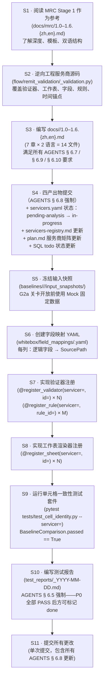

> **动态文档** — 遵循 AGENTS.md § 6.11 三层行为标记规范。
> `[CONFIRMED]` = 已通过源码 + 物理基准 XLSX 验证 ·
> `[VERIFY]` = 仅从源码推断，尚未通过物理产出物确认 · `[FOUND-DURING-B6]` = B6 编写期间发现。

> **关卡依赖**（AGENTS.md § 6.11 + plan.md § 4.2）：
> 入驻**实施**工作需等待 **G1 ∧ G2a ∧ G2b ∧ G3** 全部关闭且 B 系列文档冻结后方可启动。
> 入驻**规划与检查表准备**可立即进行。
>
> | 关卡 | 说明 | 状态 |
> |---|---|---|
> | G1 | Stage 1 走查评审 | ✅ 已关闭 |
> | G2a | 输入快照冻结（Redshift → 本地 Parquet） | ⏸ 等待操作员操作 |
> | G2b | 物理基准 XLSX 冻结 | ⏸ 等待操作员操作 |
> | G3 | V1–V12 升级为 `[CONFIRMED]` | ⏸ 等待用户签字 |

> **目的**：定义新服务商的端到端入驻工作流。
> 涵盖"以 MRC 为参考模式"方法、先决条件检查表、分步工作流、
> 骨架目录树、MRC 经验中的常见陷阱以及 Arvest 演练示例。
>
> **目标读者**：入驻新服务商的工程师（Arvest、CC5、Selene、SLS、Scattered）；
> 评估可扩展性就绪情况的 Stage 2 技术负责人；评审 B6 产出物的用户。
>
> **版本历史**
>
> | 日期 | 作者 | 变更 |
> |---|---|---|
> | 2026-05-28 | Copilot CLI agent | v1 — 初版（B6）。从 MRC Stage 1 模式及 B4/B5 可扩展性规范推导入驻工作流。将 MRC 专属陷阱记录为未来服务商的警示注记。包含 Arvest 最小演练伪代码。 |

# 8.0 服务商入驻（Stage 2）

---

## 1. 入驻理念

### 1.1 以 MRC 为参考实现

MRC 是第一个完成完整 Stage 1 分析（`docs/mrc/1.0–1.6.*`）的服务商，也将是 Stage 2 中第一个端到端实施的服务商。每一个未来服务商（Arvest、CC5、Selene、SLS、Scattered）均**复用 MRC 模式**，以 `ServicerId` 鉴别器为参数化入口，将其产出物注册到 B4 注册表中，而无需修改任何核心引擎或 UI 代码。

该原则在 B5 § 1.1（`docs/stage2/5.0-extensibility-spec.en.md`）中确立：

> "入驻 Arvest、CC5、Selene、SLS 或任何未来服务商，不得需要修改核心引擎、核心数据模型或 B5 UI 代码。"

### 1.2 服务商鉴别器参数化

核心机制是 `ServicerId` 枚举（B3 § 2.1，`docs/stage2/3.0-data-model.en.md`）。每个共享数据模型对象（从 `RawTableSnapshot` 到 `BaselineComparison`）均携带 `servicer: ServicerId` 字段。引擎和注册表通过该字段进行分发，**零 `if/elif` 分支**。

添加新服务商只需：

1. 在枚举中新增一个 `ServicerId` 值（一行代码）。
2. 通过 `@register_validator`、`@register_sheet`、`@register_field_mapping` 装饰器注册产出物。
3. 所有数据流经不变的核心流水线（M1 → M2 → M3 → M4 → M5 → M6/M7）。

---

## 2. 新服务商的先决条件

在任何新服务商的实施工作开始之前，**以下所有条件必须满足**：

### 2.1 Stage 1 分析完成（A1–A7）

| # | 产出物 | 参考/模式 |
|---|---|---|
| A1 | `docs/<servicer>/1.0-toc.{zh,en}.md` | 章节目录和范围声明——参见 `docs/mrc/1.0-toc.*` |
| A2 | `docs/<servicer>/1.1-rawdata.{zh,en}.md` | 上游表、时间锚点——参见 `docs/mrc/1.1-rawdata.*` |
| A3 | `docs/<servicer>/1.2-dataflow.{zh,en}.md` | 端到端执行流水线——参见 `docs/mrc/1.2-dataflow.*` |
| A4 | `docs/<servicer>/1.3-sheets.{zh,en}.md` | openpyxl 渲染契约——参见 `docs/mrc/1.3-sheets.*` |
| A5 | `docs/<servicer>/1.4-fields.{zh,en}.md` | 字段级血缘和业务含义——参见 `docs/mrc/1.4-fields.*` |
| A6 | `docs/<servicer>/1.5-rules.{zh,en}.md` | 规则目录（HIGHLIGHT / SUPPRESSED / …）——参见 `docs/mrc/1.5-rules.*` |
| A7 | `docs/<servicer>/1.6-baseline.{zh,en}.md` | 基准 XLSX 行为 + V 检查表——参见 `docs/mrc/1.6-baseline.*` |

检查：7 章全部存在，通过 `tools/stage_doc_checks.py`，中英双文档对齐。

### 2.2 G2a 等效：输入快照已冻结（A8）

| 要求 | 详情 |
|---|---|
| 已冻结 Parquet 快照存在 | `baselines/<servicer>/<date>/input_snapshots/` 与 MRC G2a 布局一致（plan.md § 4.2） |
| `_manifest.json` 完整 | 每个 Parquet 文件均有非空的 `sha256_file` + `sha256_canonical_rows` + `row_count` |
| 导出 SQL 文件已提交 | `_export_queries/resolved/*.sql` 包含每个数据集使用的逐字 SQL |
| 清单通过 `tools/freeze_snapshot.py verify` 检查 | 所有数据集已编目；所有哈希值有效 |

G2a 关卡开放前使用 Mock 固定数据；不要因等待快照而阻塞实施规划。

### 2.3 G2b 等效：遗留代码可重现

| 要求 | 详情 |
|---|---|
| 遗留 `flow/remit_validation/<servicer>_validation.py` 可对 Parquet shim 运行 | `tools/legacy_adapter.py` 指向 `input_snapshots/`；遗留代码无需 Redshift 即可运行 |
| 输出 XLSX 已产出 | `baselines/<servicer>/<date>/validation_report.xlsx` 存在 |
| `manifest.json` 完整 | 包含 `sha256`、`openpyxl_version`、源仓库 SHA、输入快照清单哈希 |

### 2.4 G3 等效：V1-V*n* 全部 `[CONFIRMED]`

`docs/<servicer>/1.6-baseline.{zh,en}.md` § 9 中所有 `[VERIFY]` 条目必须通过 G2b 等效运行产出的物理 XLSX 升级为 `[CONFIRMED]`。条目数量可能因服务商渲染复杂度而异（不一定是 12 条）。

### 2.5 字段映射 YAML（A9）

`whitebox/field_mappings/<servicer>.yaml` 已存在，且将每个逻辑字段映射到 `SourcePath`（B4 `FieldMappingRegistry`，`docs/stage2/4.0-validator-registry.en.md` § 2.3）。

### 2.6 注册存根待填充（A10–A11）

A1–A9 完成之前，注册代码存根（`@register_validator`、`@register_sheet`）可以以 `NotImplementedError` 占位符形式存在。在 Stage 2 单元格一致性测试通过之前，必须替换为真实实现。

---

## 3. 分步入驻工作流

以下序列适用于所有非 MRC 服务商。编号对应 B5 入驻工作流图（B5 § 6，`docs/stage2/5.0-extensibility-spec.en.md` 图 5.0.6）。



_图 8.0.3 — 11 步服务商入驻工作流。S1–S3 为分析阶段（可在 Stage 2 关卡关闭前进行）。S4 为强制四产出物状态提交（AGENTS § 6.8）。S5–S8 为实施阶段（需等待 G2a/G2b/G3 等效关卡）。S9–S11 为验证和提交阶段。_

**逐步说明：**

1. **S1 — 参考阅读**：完整学习 `docs/mrc/1.0–1.6.{zh,en}.md`。理解所需的分析深度：7 章、双语、所有 AGENTS §§ 6.7/6.9/6.10 要求、层级标记、源码引用。在明确"完成"的样子之前不要开始编写。触发条件：决定入驻新服务商。输出：无产出物，仅内部准备就绪。

2. **S2 — 逆向工程**：阅读 `flow/remit_validation/<servicer>_validation.py`（只读源码，AGENTS § 3）及任何传递导入的模块。提取：表名、时间锚点、验证器函数名及调用顺序、SQL 模板、工作表配置、高亮条件、字段定义。所有发现均需附带源码行引用。输出：工作笔记/草稿（暂不提交）。

3. **S3 — 编写 14 个文档文件**：严格按照 MRC 章节模板创建 `docs/<servicer>/1.0–1.6.{zh,en}.md`。每章需包含：文档头（目的/目标读者/版本历史）、带图注的图表、逐步说明、Mermaid 节点 ID 图例、每条行为断言的层级标记、源码引用。

4. **S4 — 四产出物提交**（AGENTS § 6.8 强制同次提交要求）：
   a. `docs/_status/servicers.yaml` — `status: pending-analysis → in-progress`。
   b. `docs/_status/servicers-registry.{zh,en}.md` — 更新状态矩阵对应行。
   c. `plan.md` — 更新"服务商状态矩阵"章节。
   d. SQL `todos` — `UPDATE todos SET status='in_progress' WHERE id='<servicer>-stage1'`。
   以上四项必须在**同一次**提交中完成。

5. **S5 — 快照冻结**（或 Mock 替代）：准备 `baselines/<servicer>/<date>/input_snapshots/`，与 `baselines/mrc/2026-04-30/` 布局相同（plan.md § 4.2 G2a 绑定规范）。G2a 关卡开放前，使用 `tests/fixtures/` 下的合成 Parquet 固定数据。

6. **S6 — 字段映射 YAML**：创建 `whitebox/field_mappings/<servicer>.yaml`。列出 `docs/<servicer>/1.4-fields.{zh,en}.md` 中每个逻辑字段名及其对应的 `SourcePath`（B4 `docs/stage2/4.0-validator-registry.en.md` § 2.3）。

7. **S7 — 验证器注册**：为 S2 中识别的每个验证器函数实现 `@register_validator(servicer=<id>, id=<vid>)`。G2 开发阶段前，抛出附有描述信息（引用 `docs/<servicer>/_pending.md`）的 `NotImplementedError`。同时注册规则：为 `docs/<servicer>/1.5-rules.{zh,en}.md` 中每条规则注册 `@register_rule(servicer=<id>, rule_id=<rid>)`。

8. **S8 — 工作表注册**：为 `docs/<servicer>/1.3-sheets.{zh,en}.md` 中每张工作表实现 `@register_sheet(servicer=<id>, id=<sid>)`。渲染器必须接受 `ValidatorResult`（B3 § 2.7）并返回含预计算 `(row, col)` 坐标的 `SheetPayload`（B3 § 2.8）。

9. **S9 — 单元格一致性测试**：运行 `pytest tests/test_cell_identity.py --servicer=<id>`。测试调用 `BaselineComparison`（B3 § 2.10），将新系统 XLSX 输出与冻结基准进行比对。`BaselineComparison.passed` 必须等于 `True`；所有差异均为 P0 失败。

10. **S10 — 测试报告**：按 AGENTS § 6.5 模板编写 `test_reports/<servicer-stage1-todo-id>_YYYY-MM-DD.md`。P0 检查全部 PASS 后，todo 方可标记为 `done`。

11. **S11 — 提交**：一次提交包含所有 Stage 1 文档 + 注册 + YAML + 状态更新。提交信息：`stage1(<servicer>): complete analysis and Stage 2 registration`。

---

## 4. 服务商骨架模板

新服务商必须产出以下目录树。将 `<servicer>` 替换为小写 `ServicerId` 字符串（如 `arvest`、`cc5`）。

```
docs/
└── <servicer>/
    ├── 1.0-toc.{zh,en}.md            # 章节目录 + 范围声明
    ├── 1.1-rawdata.{zh,en}.md        # 上游表、时间锚点、快照方案
    ├── 1.2-dataflow.{zh,en}.md       # 端到端执行流水线
    ├── 1.3-sheets.{zh,en}.md         # openpyxl 渲染契约
    ├── 1.4-fields.{zh,en}.md         # 字段级血缘 + 业务含义
    ├── 1.5-rules.{zh,en}.md          # 规则目录
    └── 1.6-baseline.{zh,en}.md       # 基准 XLSX 行为 + V 检查表

baselines/
└── <servicer>/
    └── <remit_date>/
        ├── input_snapshots/
        │   ├── _manifest.json
        │   ├── _export_queries/
        │   │   ├── resolved/*.sql
        │   │   └── template/*.sql
        │   └── parquet/*.parquet
        ├── validation_report.xlsx     # G2b 等效输出
        └── manifest.json             # XLSX 级别清单

whitebox/
├── field_mappings/
│   └── <servicer>.yaml               # 逻辑字段 → SourcePath
├── validators/
│   └── <servicer>/
│       ├── __init__.py               # 模块导入时注册验证器
│       ├── v1_<name>.py              # 每个验证器一个文件
│       └── ...
└── sheets/
    └── <servicer>/
        ├── __init__.py               # 模块导入时注册工作表渲染器
        ├── s1_<name>.py              # 每个工作表渲染器一个文件
        └── ...

test_reports/
└── <servicer>-stage1_YYYY-MM-DD.md  # AGENTS § 6.5 测试报告
```

---

## 5. 常见陷阱（来自 MRC 经验）

以下问题在 MRC Stage 1 分析过程中被发现。未来服务商工程师在假设自身代码更简单之前必须了解这些问题。

### P1 — CTE 别名不对称（`p1/p2` 与 `p/p2`）

**MRC 来源**：`docs/mrc/1.2-dataflow.en.md` § 4.1 `[FROM-CODE]`；`docs/mrc/1.4-fields.en.md` § 2.1。

**现象**：在 MRC `mrc_adv_validation` SQL 模板中，前一周期 CTE 在主分支中被别名为 `p2`，但在次分支中被别名为 `p`（而非 `p1`）。这一不一致性是源码中的**预先存在的遗留问题**。

**B6 指导**：Stage 2 必须将 CTE 别名标准化（统一使用 `p1/p2` 或 `curr/prev`）用于中间 CTE 捕获层（M3，`MrcIntermediateCTEs` — B3 § 2.5）。**不得**复制该不对称。参见 `7.0-module-boundaries.en.md § 7` 的 `[VERIFY]` MB-4。

**未来服务商行动**：在 S2 逆向工程阶段，注意任何 CTE 别名命名不一致，在 `docs/<servicer>/1.2-dataflow.{zh,en}.md` § 4 中以 `[FOUND-DURING-STAGE2]` 标记明确记录。不要将其视为"正确"行为。

### P2 — `pandi_diff` 高亮豁免

**MRC 来源**：`docs/mrc/1.5-rules.en.md` § 3.3 `[FROM-CODE]`。

**现象**：`MRC_Advance_Check` 工作表中的 `pandi_diff` 列在 `abs(pandi_diff) > 0` 时**不会**被高亮。这是一个刻意的业务规则——它被豁免于适用所有其他差值列的标准 `abs(diff) > 0 → HIGHLIGHT` 规则。

**B6 指导**：此豁免必须在 M4（工作表，`whitebox/sheets/mrc/`）而非 M3（验证器）中处理。若在 M3 中实现，则会将验证器逻辑泄露到错误的层级。在 `RuleRegistry` 中以 `category = "SUPPRESSED"` 注册为规则（B4 §§ 2.4）。

**未来服务商行动**：在 `docs/<servicer>/1.5-rules.{zh,en}.md` 中明确审查每个差值列的 SUPPRESSED / 豁免行为。遗漏一个豁免会产生误报高亮，导致单元格一致性测试失败。

### P3 — V5 双重查询（`fctrdt` 与 `fctrdt_1m` advances）

**MRC 来源**：`docs/mrc/1.2-dataflow.en.md` § 6.3 `[FROM-CODE]`；B3 § 2.4 待确认问题 DM-6。

**现象**：MRC 验证器 V5（`mrc_other_check`）对同一 advances 查询执行两次——分别针对 `fctrdt` 和 `fctrdt_1m`。`[VERIFY]` 两个 DataFrame 变体是否应在 `MrcRemitFrame`（M2）中预加载，还是 V5 内部重复查询。

**B6 指导**：此歧义必须在 P2.1 前解决（`[VERIFY]` MB-2）。优先在 M2 中预加载（避免重复 I/O，支持验证器并行执行）。

**未来服务商行动**：检查其验证器是否对同一底层表以不同过滤值进行多次查询。若是，在 1.2-dataflow 章节 § 6 中记录，并相应设计 `RemitFrame`。

### P4 — 未记录 `[VERIFY]` 条目阻塞 G3

**MRC 来源**：`docs/mrc/1.6-baseline.en.md` § 9 — 12 个 `[VERIFY]` 条目 V1–V12。

**现象**：由于 Stage 1 编写时物理基准 XLSX 不存在，若干渲染行为（字体默认值、NaN 渲染、列宽、冻结窗格、表头行高）只能记录为 `[VERIFY]`。这些条目阻塞 G3 关卡。

**B6 指导**：即使 Stage 1 时答案均为 `[VERIFY]`，也要在 `docs/<servicer>/1.6-baseline.{zh,en}.md` § 9 中编写 G3 等效检查表。每个条目将成为 `stage2-mrc-cell-identity-harness` 的测试断言（B2 `FR-F2.2`）。条目越多 = 测试覆盖越全面。

**未来服务商行动**：以 V1–V12 检查表为模板。添加服务商专属条目（如合并单元格、自定义标签颜色、条件数字格式等）。

### P5 — `intrate_*` 浮点数 vs 百分比渲染

**MRC 来源**：`docs/mrc/1.4-fields.en.md` § 5 gap 1 `[VERIFY]`。

**现象**：MRC 中 `intrate_*` 列可能以浮点数（`0.05`）存储，但在 XLSX 中显示为百分比（`5.00%`）。Stage 1 文档将此标记为 `[VERIFY]`——确切的 `number_format` 字符串未从源码确认。

**B6 指导**：在 MRC 的 G3 扫描中确认此项。对于未来服务商，在 `docs/<servicer>/1.4-fields.{zh,en}.md` § 5 中为每个百分比/货币/比率列明确记录 `number_format` 字符串。

### P6 — 服务商 `flow` 字符串值 vs 注册表 `ServicerId`

**MRC 来源**：`docs/mrc/1.1-rawdata.en.md` § 5.1 `[FROM-CODE]` — 5 个 `flow == 'mrc'` 分发位置。

**现象**：遗留 `PrefectFlow` 源码使用裸字符串 `flow == 'mrc'` 进行分发。MRC 的规范 `ServicerId` 枚举值为 `"MRC"`（大写）。**这是两个不同的字符串。** 注册表使用 `ServicerId.MRC = "MRC"`；不要从遗留分发位置复制小写的 `"mrc"`。

**B6 指导**：对于每个未来服务商，从 `port.portmonth.servicer` 列值（B5 ES-OQ-2 `[VERIFY]`）确认规范大写枚举字符串，而非从 `flow == '<name>'` 分发字符串确认。

---

## 6. 参考示例 — Arvest 最小入驻演练

> **状态**：Arvest Stage 1 分析**尚未开始**。以下是**前瞻性伪代码**，仅展示最小可行 Arvest 入驻的接口形状和工作流。所有字段名、工作表名和验证器名均为**占位符**，待 Arvest Stage 1 逆向工程后填充。
>
> 来源：从 B5 § 9 参考示例（`docs/stage2/5.0-extensibility-spec.en.md § 9`）推导。

### 6.1 假设的 Arvest 结构（全部 `[VERIFY]`）

| 属性 | MRC 值（已知） | Arvest 假设（全部 `[VERIFY]`） |
|---|---|---|
| 源文件 | `flow/remit_validation/mrc_validation.py` | `flow/remit_validation/arvest_validation.py` `[VERIFY]` |
| 验证器数量 | 5 个 | 假设 3–6 个 `[VERIFY]` |
| 工作表数量 | 5 张 | 假设 4 张 `[VERIFY]` |
| `ServicerId` 字符串 | `"MRC"` `[FROM-CODE]` | `"ARVEST"` `[VERIFY]` — 对照 `port.portmonth.servicer` 确认 |
| 时间锚点 | 4 个 | `[VERIFY]` — 可能不同 |

### 6.2 S1 — 任何代码前的产出物检查表

```
[ ] docs/arvest/1.0-toc.{zh,en}.md        已编写 + 双语对齐
[ ] docs/arvest/1.1-rawdata.{zh,en}.md    上游表已记录并附源码引用
[ ] docs/arvest/1.2-dataflow.{zh,en}.md   数据流图 + 逐步说明
[ ] docs/arvest/1.3-sheets.{zh,en}.md     渲染契约（所有 [VERIFY] 条目已列出）
[ ] docs/arvest/1.4-fields.{zh,en}.md     字段列表含 number_format 和血缘
[ ] docs/arvest/1.5-rules.{zh,en}.md      所有高亮/抑制/信息规则已编目
[ ] docs/arvest/1.6-baseline.{zh,en}.md   V 检查表（即使初始全部为 [VERIFY]）
[ ] docs/_status/servicers.yaml           arvest.status: in-progress（与文档同次提交）
[ ] baselines/arvest/<date>/              快照目录（初期可使用 Mock 固定数据）
[ ] whitebox/field_mappings/arvest.yaml   逻辑字段 → SourcePath
```

### 6.3 S2 — 注册存根（伪代码，仅展示接口形状）

```python
# whitebox/validators/arvest/v1_placeholder.py
# [VERIFY] 替换为 docs/arvest/1.2-dataflow.* 中的真实验证器名

from whitebox.registry import register_validator
from whitebox.models import ValidatorContext, ValidatorResult, ServicerId

@register_validator(servicer=ServicerId.ARVEST, id="arvest_v1_placeholder")
def arvest_v1_impl(ctx: ValidatorContext) -> ValidatorResult:
    """[VERIFY] 占位符——Arvest Stage 1 完成后替换为真实逻辑。
    入驻状态参见 docs/arvest/_pending.en.md。
    """
    raise NotImplementedError(
        "Arvest V1 尚未实现——参见 docs/arvest/_pending.md"
    )
```

```python
# whitebox/sheets/arvest/s1_placeholder.py
# [VERIFY] 替换为 docs/arvest/1.3-sheets.* 中的真实工作表名

from whitebox.registry import register_sheet
from whitebox.models import ValidatorResult, SheetPayload, ServicerId

@register_sheet(servicer=ServicerId.ARVEST, id="ARVEST_PlaceholderSheet")
def arvest_s1_renderer(result: ValidatorResult) -> SheetPayload:
    """[VERIFY] 占位符渲染器——Arvest Stage 1 完成后替换。"""
    raise NotImplementedError(
        "Arvest S1 渲染器尚未实现——参见 docs/arvest/_pending.md"
    )
```

```yaml
# whitebox/field_mappings/arvest.yaml
# [VERIFY] 以下所有字段名为占位符，待 Stage 1 分析后替换。
version: "1"
servicer: "ARVEST"
fields:
  - logical_name: "placeholder_diff"   # [VERIFY]
    source_table: "arvest.portarvestremit"  # [VERIFY]
    source_column: "placeholder_col"    # [VERIFY]
```

### 6.4 S3 — AGENTS § 6.8 四产出物提交检查表

提交任何 Arvest 实施代码前，确保**一次提交**包含以下四项：

```
[ ] docs/_status/servicers.yaml                    arvest.status: in-progress
[ ] docs/_status/servicers-registry.{zh,en}.md     Arvest 行：状态列已更新
[ ] plan.md "服务商状态矩阵"                        Arvest 行：⏳ → 🔄 进行中
[ ] SQL: UPDATE todos SET status='in_progress'      WHERE id='stage1-mrc-arvest'（或服务商专属 ID）
```

### 6.5 S4 — 单元格一致性验收标准

Arvest Stage 1 完成且 G2b 等效运行后：

```
pytest tests/test_cell_identity.py --servicer=arvest
# 预期输出：
# PASSED: BaselineComparison.passed == True
# PASSED: 所有 [sheet_id, row_id, col_id] 单元格三元组与基准匹配
# PASSED: 所有带注释单元格的高亮颜色匹配
# FAILED（P0）：任何单元格值不匹配 → 标记为 done 前必须修复
```

---

## 7. 待确认问题 / `[VERIFY]`

| 编号 | 问题 | 来源 | 影响 | 阶段 |
|---|---|---|---|---|
| SO-1 | Arvest 有多少个验证器和工作表？是否接近 MRC 的 5 个或数量不同？ | `[VERIFY]` 待 Stage 1 | 骨架验证器数量 | Stage 1 Arvest |
| SO-2 | Arvest 是否与 MRC 共享任何逻辑（SQL 模板、时间锚点推导）？若是，是否应建立 `whitebox/shared/` 模块存放公共代码？ | `[VERIFY]` B5 AP3 | 包结构 | Stage 1 Arvest |
| SO-3 | Arvest 在 `port.portmonth.servicer` 中的规范服务商字符串值是什么？`ServicerId.ARVEST` 从 `[VERIFY]` 升级为 `[CONFIRMED]` 前需确认。 | B5 ES-OQ-2 | ServicerId 枚举 | Stage 1 Arvest |
| SO-4 | `scattered` 服务商是以 `ServicerId.SCATTERED` 形式独立入驻，还是作为各相关服务商下的覆盖条目？ | B5 ES-OQ-3 | 注册表键设计 | Stage 1 Scattered |
| SO-5 | 对于 P3 目标中的并发多服务商报告运行，快照目录布局是否需要按运行的子目录，还是以 `(servicer, remit_date)` 作为唯一键？ | B5 ES-OQ-5；plan.md § 4.4 P3 | M1 摄入路径 | P3 |
| SO-6 | 入驻工作流是否应包含类似 MRC G1 的"Stage 1 同行评审"关卡，在实施开始前执行？ | plan.md § 4.2 G1 模式 | 入驻质量关卡 | P3 |
